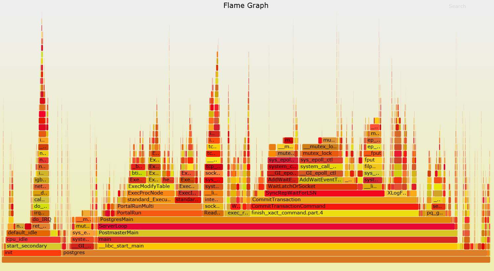
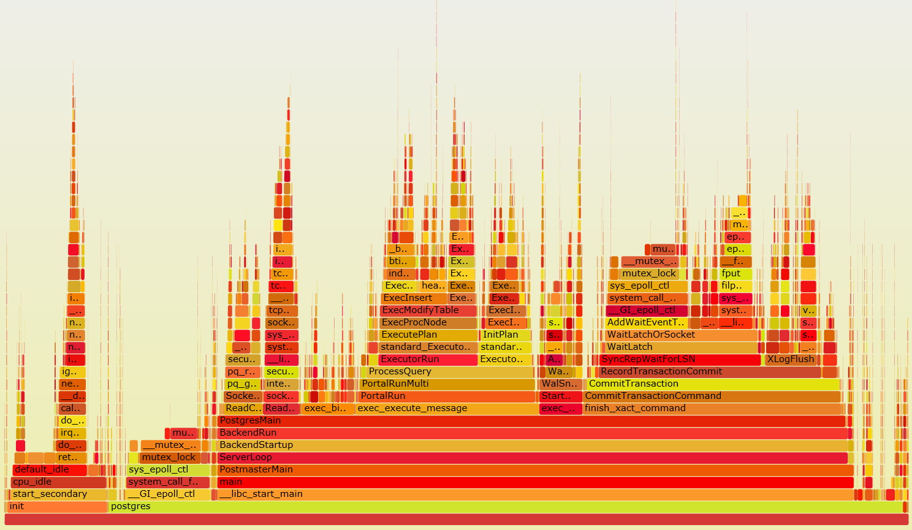

## PostgreSQL 同步流复制(高并发写入)锁瓶颈分析
                
### 作者               
digoal                
                
### 日期              
2016-11-07                  
                
### 标签              
PostgreSQL , 同步流复制 , mutex , Linux , latch                                            
                
----              
                
## 背景
PostgreSQL的同步流复制实际上是通过walsender接收到的walreceiver的LSN位点，来唤醒和释放那些需要等待WAL已被备库接收的事务的。  
  
对同步事务来说，用户发起结束事务的请求后，产生的RECORD LSN必须要小于或等于walsender接收到的walreceiver反馈的LSN位点。  
  
这个是通过WAIT队列来实现的，释放队列中的事务这个动作是由walsender完成的。  
  
在使用PostgreSQL的同步流复制时，使用insert的benchmark压测，发现主节点的CPU资源，网络，块设备都比较空闲，但是写性能会被局限在一个范围内无法提升。  
  
同时在主节点发现有大量的mutex，堵塞了整个写的性能。   
  
使用单机多实例（即一台主机部署多个主库，这种方式能消除实例级别的锁，例如实例级别的wal相关的LOCK），但是无法消除这个mutex的影响。   
  
## 问题复现
### 环境，3台数据库主机，1台测试机器；千MB互联。  
  
为了跟踪完备的userspace call stack trace，使用-g -ggdb -fno-omit-frame-pointer。    
  
```
cd postgresql-9.6.1
export USE_NAMED_POSIX_SEMAPHORES=1
LIBS=-lpthread CC="/home/digoal/gcc6.2.0/bin/gcc" CFLAGS="-O3 -flto -g -ggdb -fno-omit-frame-pointer" ./configure --prefix=/home/digoal/pgsql9.6
LIBS=-lpthread CC="/home/digoal/gcc6.2.0/bin/gcc" CFLAGS="-O3 -flto -g -ggdb -fno-omit-frame-pointer" make world -j 64
LIBS=-lpthread CC="/home/digoal/gcc6.2.0/bin/gcc" CFLAGS="-O3 -flto -g -ggdb -fno-omit-frame-pointer" make install-world
```
  
### 部署同步流复制环境，略 
1\. postgresql.conf  
  
```
listen_addresses = '0.0.0.0'
max_connections = 300
unix_socket_directories = '.'
shared_buffers = 24GB
maintenance_work_mem = 512MB
dynamic_shared_memory_type = posix
vacuum_cost_delay = 0
bgwriter_delay = 10ms
bgwriter_lru_maxpages = 1000
bgwriter_lru_multiplier = 10.0
bgwriter_flush_after = 0
max_parallel_workers_per_gather = 0
old_snapshot_threshold = -1
backend_flush_after = 0
wal_level = replica
fsync = on
synchronous_commit = remote_write
full_page_writes = off
wal_buffers = 256MB
wal_writer_delay = 10ms
wal_writer_flush_after = 0
checkpoint_timeout = 45min
max_wal_size = 48GB
checkpoint_completion_target = 0.05
checkpoint_flush_after = 0
max_wal_senders = 5
random_page_cost = 1.0
parallel_tuple_cost = 0
parallel_setup_cost = 0
effective_cache_size = 48GB
force_parallel_mode = off
log_destination = 'csvlog'
logging_collector = on
log_truncate_on_rotation = on
log_timezone = 'PRC'
update_process_title = off
autovacuum = on
log_autovacuum_min_duration = -1
autovacuum_max_workers = 16
autovacuum_naptime = 15s
autovacuum_vacuum_scale_factor = 0.02
autovacuum_analyze_scale_factor = 0.01
vacuum_freeze_table_age = 1500000000
vacuum_multixact_freeze_table_age = 1500000000
datestyle = 'iso, mdy'
timezone = 'PRC'
lc_messages = 'C'
lc_monetary = 'C'
lc_numeric = 'C'
lc_time = 'C'
default_text_search_config = 'pg_catalog.english'
```
  
2\. 启动  
   
```
pg_ctl -o "-p 1921 -c synchronous_standby_names='1(b,c)'" start -D /u01/digoal/pg_root1921
```
  
3\. 2个备库  
  
```
recovery.conf

recovery_target_timeline = 'latest'
standby_mode=on
primary_conninfo = 'user=postgres host= port= application_name=b'
```
  
4\. 状态查看  
  
```
-[ RECORD 1 ]----+------------------------------
pid              | 42754
usesysid         | 10
usename          | postgres
application_name | b
client_addr      | xxx.xxx.xxx.xxx
client_hostname  | 
client_port      | 52834
backend_start    | 2016-11-07 16:07:26.353563+08
backend_xmin     | 
state            | streaming
sent_location    | 2/36798458
write_location   | 2/36798458
flush_location   | 2/36798458
replay_location  | 2/36798458
sync_priority    | 1
sync_state       | sync
-[ RECORD 2 ]----+------------------------------
pid              | 42755
usesysid         | 10
usename          | postgres
application_name | c
client_addr      | xxx.xxx.xxx.xxx
client_hostname  | 
client_port      | 60064
backend_start    | 2016-11-07 16:07:26.353765+08
backend_xmin     | 
state            | streaming
sent_location    | 2/36798458
write_location   | 2/36798458
flush_location   | 2/36798458
replay_location  | 2/36798458
sync_priority    | 2
sync_state       | potential
```
  
### 并发插入压测
```
psql -c "create table test(id serial primary key, info text, crt_time timestamp);"


vi test3.sql
insert into test(info) values (null);

pgbench -M prepared -n -r -P 1 -f ./test3.sql -h xxx.xxx.xxx.xxx -p 1921 -U postgres -c 64 -j 64 -T 120
```
  
1\. 测试过程中观察top输出，还很空闲    
  
```
top - 16:09:47 up 37 days,  4:11,  1 user,  load average: 3.30, 2.94, 2.59
Tasks: 1707 total,  14 running, 1693 sleeping,   0 stopped,   0 zombie
Cpu(s):  8.9%us,  9.4%sy,  0.0%ni, 80.6%id,  0.0%wa,  0.0%hi,  1.0%si,  0.0%st
Mem:  529321832k total, 213706132k used, 315615700k free,   524824k buffers
Swap:        0k total,        0k used,        0k free, 186220740k cached

42754 digoal  20   0 24.9g 9384 1924 R 49.5  0.0   0:18.55 postgres: wal sender process postgres xxx.xxx.xxx.xx8(52834)
42755 digoal  20   0 24.9g 9340 1880 D 33.4  0.0   0:14.00 postgres: wal sender process postgres xxx.xxx.xxx.xx9(60064)
43187 digoal  20   0 24.9g  59m  52m S 19.3  0.0   0:01.22 postgres: postgres postgres xxx.xxx.xxx.xx2(48185)          
43222 digoal  20   0 24.9g  53m  46m S 19.3  0.0   0:01.21 postgres: postgres postgres xxx.xxx.xxx.xx2(48220)          
......
```
  
2\. 测试过程中观察perf top输出，可以看到kernel的占比很高，都是LOCK相关。     
  
```
   PerfTop:   39521 irqs/sec  kernel:73.0%  exact:  0.0% [1000Hz cycles],  (all, 64 CPUs)
-------------------------------------------------------------------------------------------- 
             samples  pcnt function                    DSO
             _______ _____ ___________________________ _____________________________________

            59139.00 12.0% __mutex_lock_slowpath       [kernel.kallsyms]                    
            44628.00  9.0% _spin_lock                  [kernel.kallsyms]                    
            37980.00  7.7% mutex_spin_on_owner         [kernel.kallsyms]                    
             9815.00  2.0% reverse_path_check_proc     [kernel.kallsyms]                    
             9105.00  1.8% find_busiest_group          [kernel.kallsyms]                    
             8001.00  1.6% schedule                    [kernel.kallsyms]                    
             7028.00  1.4% reschedule_interrupt        [kernel.kallsyms]                    
             6673.00  1.4% hash_search_with_hash_value /home/digoal/pgsql9.6/bin/postgres 
             6181.00  1.3% LWLockAttemptLock           /home/digoal/pgsql9.6/bin/postgres 
             5330.00  1.1% _spin_lock_irqsave          [kernel.kallsyms]                    
             4688.00  1.0% LWLockRelease               /home/digoal/pgsql9.6/bin/postgres 
             4544.00  0.9% GetSnapshotData             /home/digoal/pgsql9.6/bin/postgres 
```
   
3\. 压测过程perf record采样30秒    
  
```
#perf record -agv -- sleep 30

[ perf record: Woken up 655 times to write data ]
[ perf record: Captured and wrote 170.267 MB perf.data (~7439070 samples) ]
```
  
4\. 生成perf报告  
  
```
#perf report -vn --showcpuutilization --tui

Events: 1M cycles
+8.29%     0.11%     0.00%       1591         postgres  [kernel.kallsyms]                                                                               0xffffffff8105359f k [k] mutex_spin_on_owner                    
+6.48%     0.09%     0.00%       1532         postgres  [kernel.kallsyms]                                                                               0xffffffff8150d566 k [k] __mutex_lock_slowpath                  
+3.54%     0.05%     0.00%        730         postgres  [kernel.kallsyms]                                                                               0xffffffff8150e8c2 k [k] _spin_lock                             
+2.11%     0.02%     0.00%        341         postgres  [kernel.kallsyms]                                                                               0xffffffff811d02d8 k [k] reverse_path_check_proc                
+1.90%     1.90%     0.00%      31124         init      [kernel.kallsyms]                                                                               0xffffffff8103c94b k [k] native_safe_halt                       
+1.20%     0.00%     0.02%        291         postgres  /home/digoal/pgsql9.6/bin/postgres                                                            0x24e219         d [.] AllocSetAlloc.lto_priv.1064              
+1.08%     1.08%     0.00%      16874         init      [kernel.kallsyms]                                                                               0xffffffff8100cd60 k [k] reschedule_interrupt                   
+0.87%     0.00%     0.01%        190         postgres  /home/digoal/pgsql9.6/bin/postgres                                                            0x291386         d [.] GetSnapshotData                          
+0.86%     0.01%     0.00%        157         postgres  [kernel.kallsyms]                                                                               0xffffffff8150e7b3 k [k] _spin_lock_irqsave                     
+0.82%     0.00%     0.01%        158         postgres  /home/digoal/pgsql9.6/bin/postgres                                                            0x343d3e         d [.] LWLockRelease                            
+0.75%     0.00%     0.01%        177         postgres  /home/digoal/pgsql9.6/bin/postgres                                                            0x509555         d [.] LWLockAcquire.constprop.859              
+0.74%     0.00%     0.01%        156         postgres  /lib64/libc-2.12.so                                                                             0x83ae2          d [.] __memset_sse2                            
+0.71%     0.01%     0.00%        121         postgres  [kernel.kallsyms]                                                                               0xffffffff81278a8d k [k] copy_user_generic_string               
+0.63%     0.63%     0.00%       9800         init      [kernel.kallsyms]                                                                               0xffffffff8150bef4 k [k] schedule                               
+0.62%     0.00%     0.01%        130         postgres  /home/digoal/pgsql9.6/lib/pg_oltp_bench.so                                                    0x8b3            d [.] sb_rand_str                              
+0.60%     0.00%     0.01%        127         postgres  /home/digoal/pgsql9.6/bin/postgres                                                            0x32af62         d [.] SearchCatCache                           
+0.57%     0.00%     0.01%        122         postgres  /lib64/libc-2.12.so                                                                             0x366f0          d [.] __random_r                               
+0.57%     0.00%     0.01%        139         postgres  /home/digoal/pgsql9.6/bin/postgres                                                            0x5098ce         d [.] hash_search_with_hash_value.constprop.858
+0.54%     0.00%     0.01%        136         postgres  /home/digoal/pgsql9.6/bin/postgres                                                            0x35691e         d [.] PostgresMain                             
+0.54%     0.00%     0.01%        101         postgres  /lib64/libc-2.12.so                                                                             0x89779          d [.] memcpy                                   
+0.54%     0.01%     0.00%        119         postgres  [kernel.kallsyms]                                                                               0xffffffff8150bc95 k [k] schedule                               
+0.53%     0.01%     0.00%        124         postgres  [kernel.kallsyms]                                                                               0xffffffff8150d4c4 k [k] mutex_lock                             
+0.53%     0.01%     0.00%        116         postgres  /lib/modules/2.6.32-358.23.2.ali1195.el6.x86_64/kernel/drivers/net/igb/igb.ko                   0x6219           d [k] igb_configure_rx_ring                    
+0.51%     0.00%     0.01%        120         postgres  /home/digoal/pgsql9.6/bin/postgres                                                            0x24232e         d [.] _bt_compare                              
+0.49%     0.00%     0.01%        114         postgres  /home/digoal/pgsql9.6/bin/postgres                                                            0x1832e4         d [.] ExecInitExpr                             
+0.47%     0.47%     0.00%       7244         init      /lib/modules/2.6.32-358.23.2.ali1195.el6.x86_64/kernel/drivers/net/igb/igb.ko                   0x4ab0           d [k] igb_configure_rx_ring                    
+0.44%     0.00%     0.01%         98         postgres  /home/digoal/pgsql9.6/bin/postgres                                                            0x509213         d [.] LWLockAcquire.constprop.860              
+0.42%     0.01%     0.00%         77         postgres  [kernel.kallsyms]                                                                               0xffffffff81189ceb k [k] fget                                   
+0.41%     0.00%     0.01%         94         postgres  /lib64/libc-2.12.so                                                                             0x79cee          d [.] _int_malloc                              
+0.41%     0.00%     0.01%         89         postgres  /home/digoal/pgsql9.6/bin/postgres                                                            0x201a3a         d [.] expression_tree_walker                   
+0.41%     0.00%     0.01%        105         postgres  /home/digoal/pgsql9.6/bin/postgres                                                            0x3434d2         d [.] LWLockWaitListLock.lto_priv.1132         
+0.40%     0.00%     0.00%         70         postgres  [kernel.kallsyms]                                                                               0xffffffff8150d1f4 k [k] mutex_unlock                           
+0.40%     0.00%     0.01%         90         postgres  /lib64/libc-2.12.so                                                                             0x3632b          d [.] __random                                 
+0.40%     0.00%     0.00%         65         postgres  [kernel.kallsyms]                                                                               0xffffffff8116faf2 k [k] kmem_cache_alloc                       
+0.39%     0.00%     0.01%         70         postgres  /lib64/libc-2.12.so                                                                             0x470a4          d [.] __GI_vfprintf                            
+0.39%     0.00%     0.00%         55         postgres  [kernel.kallsyms]                                                                               0xffffffff811d1630 k [k] sys_epoll_ctl                          
+0.37%     0.00%     0.01%         92         postgres  /home/digoal/pgsql9.6/bin/postgres                                                            0x26c8cd         d [.] hash_search_with_hash_value              
+0.36%     0.00%     0.00%         65         postgres  [kernel.kallsyms]                                                                               0xffffffff81057fd7 k [k] update_curr                            
+0.36%     0.00%     0.01%         78         postgres  /home/digoal/pgsql9.6/bin/postgres                                                            0x253287         d [.] pg_mblen                                 
+0.36%     0.00%     0.01%         94         postgres  /home/digoal/pgsql9.6/bin/postgres                                                            0x26e534         d [.] fmgr_info_cxt_security.lto_priv.1139     
+0.35%     0.00%     0.01%         74         postgres  /home/digoal/pgsql9.6/bin/postgres                                                            0x288e67         d [.] LockReleaseAll                           
+0.35%     0.00%     0.01%         95         postgres  /home/digoal/pgsql9.6/bin/postgres                                                            0x10c913         d [.] CommitTransaction                        
+0.34%     0.00%     0.00%         53         postgres  /lib/modules/2.6.32-358.23.2.ali1195.el6.x86_64/kernel/net/netfilter/nf_conntrack.ko            0x6090           d [k] generic_pkt_to_tuple                     
+0.34%     0.00%     0.01%         81         postgres  /home/digoal/pgsql9.6/bin/postgres                                                            0x1d4574         d [.] hash_any                                 
+0.33%     0.00%     0.00%         48         postgres  [kernel.kallsyms]                                                                               0xffffffff8150e91d k [k] _spin_unlock_irqrestore                
+0.33%     0.00%     0.01%         82         postgres  /home/digoal/pgsql9.6/bin/postgres                                                            0x2523a8         d [.] pg_mbcliplen                             
+0.33%     0.01%     0.00%         80         postgres  [kernel.kallsyms]                                                                               0xffffffff8103c980 k [k] native_write_cr0                       
+0.33%     0.00%     0.00%         64         postgres  /lib/modules/2.6.32-358.23.2.ali1195.el6.x86_64/kernel/net/ipv4/netfilter/ip_tables.ko          0x31f2           d [k] ipt_do_table                             
+0.32%     0.32%     0.00%       5132             init  [kernel.kallsyms]                                                                               0xffffffff8100c688 k [k] irq_entries_start                      
+0.32%     0.00%     0.00%         68         postgres  [kernel.kallsyms]                                                                               0xffffffff8150e7e9 k [k] _spin_lock_irq                         
+0.32%     0.00%     0.00%         63         postgres  [kernel.kallsyms]                                                                               0xffffffff8116fc4d k [k] kmem_cache_free                        
+0.30%     0.00%     0.00%         45         postgres  [kernel.kallsyms]                                                                               0xffffffff81062e48 k [k] select_task_rq_fair                    
+0.30%     0.00%     0.00%         66         postgres  [kernel.kallsyms]                                                                               0xffffffff8100a8c3 k [k] __switch_to                            
+0.29%     0.00%     0.00%         49         postgres  [kernel.kallsyms]                                                                               0xffffffff8105360e k [k] resched_task                                                                                                                                                                                            

输入E展开，C收敛  
```
  
大量内核锁的开销，分析一下是哪些PG代码造成的。   
  
需要使用文本报告，可以看得比较详细，找到第一条mutex_spin_on_owner的LOCK实际上是来自PostgreSQL的 AddWaitEventToSet 调用，追踪到SyncRepWaitForLSN。     
  
```
#perf report -vn --showcpuutilization --stdio

# Events: 1M cycles
#
# Overhead  Samples    sys    us            Command                                   Shared Object                     
# ........ ..........  ...............  ......................................     .................................................
#
     8.28%     0.11%     0.00%       1591         postgres  [kernel.kallsyms]       0xffffffff8105359f k [k] mutex_spin_on_owner
                   |
                   --- mutex_spin_on_owner
                      |          
                      |--99.60%-- __mutex_lock_slowpath
                      |          mutex_lock
                      |          |          
                      |          |--85.19%-- sys_epoll_ctl
                      |          |          system_call_fastpath
                      |          |          __GI_epoll_ctl
                      |          |          |          
                      |          |          |--58.15%-- AddWaitEventToSet
                      |          |          |          |          
                      |          |          |          |--99.92%-- WaitLatchOrSocket
                      |          |          |          |          |          
                      |          |          |          |          |--90.27%-- SyncRepWaitForLSN
                      |          |          |          |          |          CommitTransaction
                      |          |          |          |          |          CommitTransactionCommand
                      |          |          |          |          |          finish_xact_command.part.4
                      |          |          |          |          |          PostgresMain
                      |          |          |          |          |          ServerLoop
                      |          |          |          |          |          PostmasterMain
                      |          |          |          |          |          main
                      |          |          |          |          |          __libc_start_main
                      |          |          |          |          |          
                      |          |          |          |          |--9.67%-- exec_replication_command
                      |          |          |          |          |          PostgresMain
                      |          |          |          |          |          ServerLoop
                      |          |          |          |          |          PostmasterMain
                      |          |          |          |          |          main
                      |          |          |          |          |          __libc_start_main
                      |          |          |          |           --0.06%-- [...]
                      |          |          |           --0.08%-- [...]
                      |          |          |          
                      |          |           --41.85%-- AddWaitEventToSet.constprop.929
                      |          |                     |          
                      |          |                     |--99.83%-- WaitLatchOrSocket
                      |          |                     |          |          
                      |          |                     |          |--79.61%-- SyncRepWaitForLSN
                      |          |                     |          |          CommitTransaction
                      |          |                     |          |          CommitTransactionCommand
                      |          |                     |          |          finish_xact_command.part.4
                      |          |                     |          |          PostgresMain
                      |          |                     |          |          ServerLoop
                      |          |                     |          |          PostmasterMain
                      |          |                     |          |          main
                      |          |                     |          |          __libc_start_main
                      |          |                     |          |          
                      |          |                     |          |--20.33%-- exec_replication_command
                      |          |                     |          |          PostgresMain
                      |          |                     |          |          ServerLoop
                      |          |                     |          |          PostmasterMain
                      |          |                     |          |          main
                      |          |                     |          |          __libc_start_main
                      |          |                     |           --0.06%-- [...]
                      |          |                      --0.17%-- [...]
                      |          |          
                      |          |--14.77%-- ep_free
                      |          |          ep_eventpoll_release
                      |          |          __fput
                      |          |          fput
                      |          |          filp_close
                      |          |          sys_close
                      |          |          system_call_fastpath
                      |          |          __libc_close
                      |          |          |          
                      |          |          |--73.14%-- SyncRepWaitForLSN
                      |          |          |          CommitTransaction
                      |          |          |          CommitTransactionCommand
                      |          |          |          finish_xact_command.part.4
                      |          |          |          PostgresMain
                      |          |          |          ServerLoop
                      |          |          |          PostmasterMain
                      |          |          |          main
                      |          |          |          __libc_start_main
                      |          |          |          
                      |          |          |--26.12%-- exec_replication_command
                      |          |          |          PostgresMain
                      |          |          |          ServerLoop
                      |          |          |          PostmasterMain
                      |          |          |          main
                      |          |          |          __libc_start_main
                      |          |           --0.74%-- [...]
                      |           --0.05%-- [...]
                       --0.40%-- [...]

     6.47%     0.09%     0.00%       1532         postgres  [kernel.kallsyms]                                                                               0xffffffff8150d566 k [k] __mutex_lock_slowpath
                   |
                   --- __mutex_lock_slowpath
                      |          
                      |--99.93%-- mutex_lock
                      |          |          
                      |          |--85.93%-- sys_epoll_ctl
                      |          |          system_call_fastpath
                      |          |          __GI_epoll_ctl
                      |          |          |          
                      |          |          |--71.69%-- AddWaitEventToSet
                      |          |          |          |          
                      |          |          |          |--99.90%-- WaitLatchOrSocket
                      |          |          |          |          |          
                      |          |          |          |          |--95.76%-- SyncRepWaitForLSN
                      |          |          |          |          |          CommitTransaction
                      |          |          |          |          |          CommitTransactionCommand
                      |          |          |          |          |          finish_xact_command.part.4
                      |          |          |          |          |          PostgresMain
                      |          |          |          |          |          ServerLoop
                      |          |          |          |          |          PostmasterMain
                      |          |          |          |          |          main
                      |          |          |          |          |          __libc_start_main
                      |          |          |          |          |          
                      |          |          |          |          |--4.09%-- exec_replication_command
                      |          |          |          |          |          PostgresMain
                      |          |          |          |          |          ServerLoop
                      |          |          |          |          |          PostmasterMain
                      |          |          |          |          |          main
                      |          |          |          |          |          __libc_start_main
                      |          |          |          |           --0.15%-- [...]
                      |          |          |           --0.10%-- [...]
                      |          |          |          
                      |          |           --28.31%-- AddWaitEventToSet.constprop.929
                      |          |                     |          
                      |          |                     |--99.51%-- WaitLatchOrSocket
                      |          |                     |          |          
                      |          |                     |          |--87.75%-- SyncRepWaitForLSN
                      |          |                     |          |          CommitTransaction
                      |          |                     |          |          CommitTransactionCommand
                      |          |                     |          |          finish_xact_command.part.4
                      |          |                     |          |          PostgresMain
                      |          |                     |          |          ServerLoop
                      |          |                     |          |          PostmasterMain
                      |          |                     |          |          main
                      |          |                     |          |          __libc_start_main
                      |          |                     |          |          
                      |          |                     |          |--11.91%-- exec_replication_command
                      |          |                     |          |          PostgresMain
                      |          |                     |          |          ServerLoop
                      |          |                     |          |          PostmasterMain
                      |          |                     |          |          main
                      |          |                     |          |          __libc_start_main
                      |          |                     |           --0.34%-- [...]
                      |          |                      --0.49%-- [...]
                      |          |          
                      |          |--13.97%-- ep_free
                      |          |          ep_eventpoll_release
                      |          |          __fput
                      |          |          fput
                      |          |          filp_close
                      |          |          sys_close
                      |          |          system_call_fastpath
                      |          |          __libc_close
                      |          |          |          
                      |          |          |--86.18%-- SyncRepWaitForLSN
                      |          |          |          CommitTransaction
                      |          |          |          CommitTransactionCommand
                      |          |          |          finish_xact_command.part.4
                      |          |          |          PostgresMain
                      |          |          |          ServerLoop
                      |          |          |          PostmasterMain
                      |          |          |          main
                      |          |          |          __libc_start_main
                      |          |          |          
                      |          |          |--12.47%-- exec_replication_command
                      |          |          |          PostgresMain
                      |          |          |          ServerLoop
                      |          |          |          PostmasterMain
                      |          |          |          main
                      |          |          |          __libc_start_main
                      |          |          |          
                      |          |          |--0.76%-- pgstat_start
                      |          |          |          reaper
                      |          |          |          __restore_rt
                      |          |          |          PostmasterMain
                      |          |          |          main
                      |          |          |          __libc_start_main
                      |          |           --0.59%-- [...]
                      |           --0.10%-- [...]
                       --0.07%-- [...]

     3.54%     0.05%     0.00%        730         postgres  [kernel.kallsyms]                                                                               0xffffffff8150e8c2 k [k] _spin_lock
                   |
                   --- _spin_lock
                      |          
                      |--40.06%-- __mutex_lock_slowpath
                      |          mutex_lock
                      |          |          
                      |          |--87.50%-- sys_epoll_ctl
                      |          |          system_call_fastpath
                      |          |          __GI_epoll_ctl
                      |          |          |          
                      |          |          |--74.21%-- AddWaitEventToSet
                      |          |          |          |          
                      |          |          |          |--99.97%-- WaitLatchOrSocket
                      |          |          |          |          |          
                      |          |          |          |          |--95.83%-- SyncRepWaitForLSN
                      |          |          |          |          |          CommitTransaction
                      |          |          |          |          |          CommitTransactionCommand
                      |          |          |          |          |          finish_xact_command.part.4
                      |          |          |          |          |          PostgresMain
                      |          |          |          |          |          ServerLoop
                      |          |          |          |          |          PostmasterMain
                      |          |          |          |          |          main
                      |          |          |          |          |          __libc_start_main
                      |          |          |          |          |          
                      |          |          |          |          |--4.12%-- exec_replication_command
                      |          |          |          |          |          PostgresMain
                      |          |          |          |          |          ServerLoop
                      |          |          |          |          |          PostmasterMain
                      |          |          |          |          |          main
                      |          |          |          |          |          __libc_start_main
                      |          |          |          |           --0.06%-- [...]
                      |          |          |           --0.03%-- [...]
                      |          |          |          
                      |          |           --25.79%-- AddWaitEventToSet.constprop.929
                      |          |                     |          
                      |          |                     |--99.96%-- WaitLatchOrSocket
                      |          |                     |          |          
                      |          |                     |          |--86.60%-- SyncRepWaitForLSN
                      |          |                     |          |          CommitTransaction
                      |          |                     |          |          CommitTransactionCommand
                      |          |                     |          |          finish_xact_command.part.4
                      |          |                     |          |          PostgresMain
                      |          |                     |          |          ServerLoop
                      |          |                     |          |          PostmasterMain
                      |          |                     |          |          main
                      |          |                     |          |          __libc_start_main
                      |          |                     |          |          
                      |          |                     |          |--13.36%-- exec_replication_command
                      |          |                     |          |          PostgresMain
                      |          |                     |          |          ServerLoop
                      |          |                     |          |          PostmasterMain
                      |          |                     |          |          main
                      |          |                     |          |          __libc_start_main
                      |          |                     |           --0.04%-- [...]
                      |          |                      --0.04%-- [...]
                      |          |          
                      |           --12.50%-- ep_free
                      |                     ep_eventpoll_release
                      |                     __fput
                      |                     fput
                      |                     filp_close
                      |                     sys_close
                      |                     system_call_fastpath
                      |                     __libc_close
                      |                     |          
                      |                     |--85.19%-- SyncRepWaitForLSN
                      |                     |          CommitTransaction
                      |                     |          CommitTransactionCommand
                      |                     |          finish_xact_command.part.4
                      |                     |          PostgresMain
                      |                     |          ServerLoop
                      |                     |          PostmasterMain
                      |                     |          main
                      |                     |          __libc_start_main
                      |                     |          
                      |                     |--14.15%-- exec_replication_command
                      |                     |          PostgresMain
                      |                     |          ServerLoop
                      |                     |          PostmasterMain
                      |                     |          main
                      |                     |          __libc_start_main
                      |                      --0.66%-- [...]
                      |          
                      |--14.55%-- __mutex_unlock_slowpath
                      |          mutex_unlock
                      |          |          
                      |          |--79.79%-- sys_epoll_ctl
                      |          |          system_call_fastpath
                      |          |          __GI_epoll_ctl
                      |          |          |          
                      |          |          |--65.89%-- AddWaitEventToSet
                      |          |          |          |          
                      |          |          |          |--99.57%-- WaitLatchOrSocket
                      |          |          |          |          |          
                      |          |          |          |          |--93.02%-- SyncRepWaitForLSN
                      |          |          |          |          |          CommitTransaction
                      |          |          |          |          |          CommitTransactionCommand
                      |          |          |          |          |          finish_xact_command.part.4
                      |          |          |          |          |          PostgresMain
                      |          |          |          |          |          ServerLoop
                      |          |          |          |          |          PostmasterMain
                      |          |          |          |          |          main
                      |          |          |          |          |          __libc_start_main
                      |          |          |          |          |          
                      |          |          |          |          |--6.08%-- exec_replication_command
                      |          |          |          |          |          PostgresMain
                      |          |          |          |          |          ServerLoop
                      |          |          |          |          |          PostmasterMain
                      |          |          |          |          |          main
                      |          |          |          |          |          __libc_start_main
                      |          |          |          |          |          
                      |          |          |          |          |--0.89%-- BackgroundWriterMain
                      |          |          |          |          |          AuxiliaryProcessMain
                      |          |          |          |          |          0x866e7a
                      |          |          |          |          |          reaper
                      |          |          |          |          |          __restore_rt
                      |          |          |          |          |          PostmasterMain
                      |          |          |          |          |          main
                      |          |          |          |          |          __libc_start_main
                      |          |          |          |           --0.00%-- [...]
                      |          |          |           --0.43%-- [...]
                      |          |          |          
                      |          |           --34.11%-- AddWaitEventToSet.constprop.929
                      |          |                     |          
                      |          |                     |--98.18%-- WaitLatchOrSocket
                      |          |                     |          |          
                      |          |                     |          |--83.82%-- SyncRepWaitForLSN
                      |          |                     |          |          CommitTransaction
                      |          |                     |          |          CommitTransactionCommand
                      |          |                     |          |          finish_xact_command.part.4
                      |          |                     |          |          PostgresMain
                      |          |                     |          |          ServerLoop
                      |          |                     |          |          PostmasterMain
                      |          |                     |          |          main
                      |          |                     |          |          __libc_start_main
                      |          |                     |          |          
                      |          |                     |          |--15.47%-- exec_replication_command
....................略...............................
```
      
5\. 生成perf火焰图    
  
文本有时候还是不够直观，可以使用火焰图，看得更直观，到底瓶颈在哪里。     
  
```
# git clone https://github.com/brendangregg/FlameGraph      # or download it from github
# mv perf.data FlameGraph/
# cd FlameGraph
# perf script | ./stackcollapse-perf.pl > out.perf-folded
# cat out.perf-folded | ./flamegraph.pl > perf-kernel.svg
```
  
[perf-kernel.svg](20161107_02_svg_001.svg)  
  
svg可以使用浏览器打开，转换的图片如下  
  
  
  
编译参数可以修改一下  
  
```
cd postgresql-9.6.1
export USE_NAMED_POSIX_SEMAPHORES=1
LIBS=-lpthread CC="/home/digoal/gcc6.2.0/bin/gcc" CFLAGS="-Og -g -ggdb -fno-omit-frame-pointer" ./configure --prefix=/home/digoal/pgsql9.6
LIBS=-lpthread CC="/home/digoal/gcc6.2.0/bin/gcc" CFLAGS="-Og -g -ggdb -fno-omit-frame-pointer" make world -j 64
LIBS=-lpthread CC="/home/digoal/gcc6.2.0/bin/gcc" CFLAGS="-Og -g -ggdb -fno-omit-frame-pointer" make install-world
```
  
重测得到  
  
```
+ 7.68%     0.11%     0.00%       1029         postgres  [kernel.kallsyms]                                                                       0xffffffff8105359b k [k] mutex_spin_on_owner       
+ 5.88%     0.09%     0.00%        865         postgres  [kernel.kallsyms]                                                                       0xffffffff8150d56f k [k] __mutex_lock_slowpath     
+ 3.34%     0.05%     0.00%        471         postgres  [kernel.kallsyms]                                                                       0xffffffff8150e8d1 k [k] _spin_lock                
+ 2.01%     0.02%     0.00%        235         postgres  [kernel.kallsyms]                                                                       0xffffffff811d02e0 k [k] reverse_path_check_proc   
+ 1.75%     1.75%     0.00%      16935             init  [kernel.kallsyms]                                                                       0xffffffff8103c94b k [k] native_safe_halt          
+ 1.42%     0.00%     0.02%        241         postgres  /home/digoal/pgsql9.6/bin/postgres                                                    0x3c0f3e         d [.] hash_search_with_hash_value 
+ 1.17%     0.00%     0.02%        159         postgres  /home/digoal/pgsql9.6/bin/postgres                                                    0x2b8de6         d [.] LWLockAttemptLock           
+ 1.15%     0.00%     0.02%        159         postgres  /home/digoal/pgsql9.6/bin/postgres                                                    0x3d5bab         d [.] AllocSetAlloc               
+ 1.01%     1.01%     0.00%       9411             init  [kernel.kallsyms]                                                                       0xffffffff8100cd60 k [k] reschedule_interrupt      
+ 0.94%     0.00%     0.01%        126         postgres  /home/digoal/pgsql9.6/bin/postgres                                                    0x2aae05         d [.] GetSnapshotData             
+ 0.83%     0.01%     0.00%        102         postgres  [kernel.kallsyms]                                                                       0xffffffff8150e7b3 k [k] _spin_lock_irqsave        
+ 0.72%     0.01%     0.00%         88         postgres  [kernel.kallsyms]                                                                       0xffffffff81278a8d k [k] copy_user_generic_string  
+ 0.66%     0.00%     0.01%         97         postgres  /home/digoal/pgsql9.6/bin/postgres                                                    0x2ba1b2         d [.] LWLockRelease               
+ 0.61%     0.00%     0.01%         87         postgres  /home/digoal/pgsql9.6/lib/pg_oltp_bench.so                                            0x8a9            d [.] sb_rand_str                 
+ 0.61%     0.61%     0.00%       5578             init  [kernel.kallsyms]                                                                       0xffffffff8150bef4 k [k] schedule                  
+ 0.58%     0.00%     0.01%         93         postgres  /home/digoal/pgsql9.6/bin/postgres                                                    0x3a2d45         d [.] SearchCatCache              
+ 0.55%     0.01%     0.00%         67         postgres  /lib/modules/2.6.32-358.23.2.ali1195.el6.x86_64/kernel/drivers/net/igb/igb.ko           0x8b04           d [k] igb_configure_rx_ring       
+ 0.52%     0.00%     0.01%         93         postgres  /home/digoal/pgsql9.6/bin/postgres                                                    0x1c34a2         d [.] ExecInitExpr                
+ 0.52%     0.00%     0.01%         75         postgres  /home/digoal/pgsql9.6/bin/postgres                                                    0xadc4c          d [.] _bt_compare                 
+ 0.52%     0.00%     0.01%         74         postgres  /lib64/libc-2.12.so                                                                     0x3671b          d [.] __random_r                  
+ 0.50%     0.01%     0.00%         76         postgres  [kernel.kallsyms]                                                                       0xffffffff8150bce2 k [k] schedule                  
+ 0.49%     0.01%     0.00%         71         postgres  [kernel.kallsyms]                                                                       0xffffffff8150d4c4 k [k] mutex_lock                
+ 0.49%     0.00%     0.01%         63         postgres  /lib64/libc-2.12.so                                                                     0x89734          d [.] memcpy                      
+ 0.45%     0.00%     0.01%         73         postgres  /home/digoal/pgsql9.6/bin/postgres                                                    0x2687b3         d [.] pgstat_report_activity      
+ 0.45%     0.00%     0.01%         60         postgres  /home/digoal/pgsql9.6/bin/postgres                                                    0x1f5c77         d [.] expression_tree_walker      
+ 0.43%     0.43%     0.00%       3750             init  /lib/modules/2.6.32-358.23.2.ali1195.el6.x86_64/kernel/drivers/net/igb/igb.ko           0x6253           d [k] igb_configure_rx_ring       
+ 0.41%     0.01%     0.00%         55         postgres  [kernel.kallsyms]                                                                       0xffffffff81189ceb k [k] fget                      
+ 0.40%     0.01%     0.00%         49         postgres  [kernel.kallsyms]                                                                       0xffffffff8150d1f4 k [k] mutex_unlock              
+ 0.39%     0.00%     0.00%         46         postgres  [kernel.kallsyms]                                                                       0xffffffff8116faea k [k] kmem_cache_alloc          
+ 0.37%     0.00%     0.01%         50         postgres  /lib64/libc-2.12.so                                                                     0x79aa3          d [.] _int_malloc                 
+ 0.37%     0.00%     0.01%         63         postgres  /lib64/libc-2.12.so                                                                     0x36320          d [.] __random                    
+ 0.37%     0.00%     0.00%         33         postgres  [kernel.kallsyms]                                                                       0xffffffff811d14a6 k [k] sys_epoll_ctl             
+ 0.35%     0.00%     0.00%         38         postgres  /home/digoal/pgsql9.6/bin/postgres                                                    0x90c54          d [.] hash_any                    
+ 0.34%     0.00%     0.00%         30         postgres  /lib/modules/2.6.32-358.23.2.ali1195.el6.x86_64/kernel/net/netfilter/nf_conntrack.ko    0x6811           d [k] generic_pkt_to_tuple        
+ 0.34%     0.01%     0.00%         48         postgres  [kernel.kallsyms]                                                                       0xffffffff81057f8f k [k] update_curr               
+ 0.33%     0.00%     0.00%         45         postgres  /lib64/libc-2.12.so                                                                     0x44ff8          d [.] __GI_vfprintf               
+ 0.32%     0.00%     0.00%         42         postgres  [kernel.kallsyms]                                                                       0xffffffff8150e917 k [k] _spin_unlock_irqrestore   
+ 0.32%     0.00%     0.01%         54         postgres  /lib64/libc-2.12.so                                                                     0x83a14          d [.] __memset_sse2               
+ 0.32%     0.00%     0.01%         57         postgres  /home/digoal/pgsql9.6/bin/postgres                                                    0x2b8e41         d [.] LWLockWaitListLock          
+ 0.31%     0.00%     0.01%         69         postgres  /home/digoal/pgsql9.6/bin/postgres                                                    0x3c5b4e         d [.] cliplen                     
+ 0.31%     0.00%     0.00%         40         postgres  [kernel.kallsyms]                                                                       0xffffffff8150e7e9 k [k] _spin_lock_irq            
+ 0.31%     0.00%     0.00%         44         postgres  [kernel.kallsyms]                                                                       0xffffffff81062b9d k [k] select_task_rq_fair       
+ 0.31%     0.00%     0.00%         34         postgres  /lib/modules/2.6.32-358.23.2.ali1195.el6.x86_64/kernel/net/ipv4/netfilter/ip_tables.ko  0x3003           d [k] ipt_do_table                
+ 0.29%     0.00%     0.01%         51         postgres  /home/digoal/pgsql9.6/bin/postgres                                                    0x2b5a57         d [.] LockReleaseAll              
+ 0.29%     0.00%     0.00%         26         postgres  [kernel.kallsyms]                                                                       0xffffffff8116fc40 k [k] kmem_cache_free           
+ 0.29%     0.00%     0.00%         32         postgres  /home/digoal/pgsql9.6/bin/postgres                                                    0x3bb7ca         d [.] fmgr_isbuiltin              
+ 0.28%     0.28%     0.00%       2548             init  [kernel.kallsyms]                                                                       0xffffffff8100c6d4 k [k] irq_entries_start         
+ 0.28%     0.00%     0.00%         43         postgres  /home/digoal/pgsql9.6/bin/postgres                                                    0x3d6f49         d [.] pfree                       
+ 0.28%     0.00%     0.00%         36         postgres  /home/digoal/pgsql9.6/bin/postgres                                                    0x3d6080         d [.] AllocSetFree                
+ 0.27%     0.00%     0.00%         33         postgres  [kernel.kallsyms]                                                                       0xffffffff8126dd8e k [k] _atomic_dec_and_lock      
+ 0.26%     0.00%     0.00%         27         postgres  [kernel.kallsyms]                                                                       0xffffffff8113598a k [k] get_page                  
+ 0.26%     0.00%     0.00%         33         postgres  /home/digoal/pgsql9.6/bin/postgres                                                    0x3d67e6         d [.] MemoryContextCreate         
+ 0.26%     0.00%     0.00%         41         postgres  /home/digoal/pgsql9.6/bin/postgres                                                    0x3c64b5         d [.] pg_mblen                    
+ 0.26%     0.00%     0.00%         26         postgres  [kernel.kallsyms]                                                                       0xffffffff810535d7 k [k] resched_task              
```
  
```
# Events: 924K cycles
#
# Overhead  Samples    sys    us            Command                                 Shared Object                                                                                         
# ........ ..........  ...............  .........................................  ...................................
#
     7.67%     0.11%     0.00%       1029         postgres  [kernel.kallsyms]       0xffffffff8105359b k [k] mutex_spin_on_owner
                   |
                   --- mutex_spin_on_owner
                      |          
                      |--99.62%-- __mutex_lock_slowpath
                      |          mutex_lock
                      |          |          
                      |          |--84.90%-- sys_epoll_ctl
                      |          |          system_call_fastpath
                      |          |          __GI_epoll_ctl
                      |          |          |          
                      |          |           --100.00%-- AddWaitEventToSet
                      |          |                     WaitLatchOrSocket
                      |          |                     |          
                      |          |                     |--77.32%-- WaitLatch
                      |          |                     |          |          
                      |          |                     |          |--99.85%-- SyncRepWaitForLSN
                      |          |                     |          |          RecordTransactionCommit
                      |          |                     |          |          CommitTransaction
                      |          |                     |          |          CommitTransactionCommand
                      |          |                     |          |          finish_xact_command
                      |          |                     |          |          PostgresMain
                      |          |                     |          |          BackendRun
                      |          |                     |          |          BackendStartup
                      |          |                     |          |          ServerLoop
                      |          |                     |          |          PostmasterMain
                      |          |                     |          |          main
                      |          |                     |          |          __libc_start_main
                      |          |                     |           --0.15%-- [...]
                      |          |                     |          
                      |          |                     |--22.40%-- WalSndLoop
                      |          |                     |          StartReplication
                      |          |                     |          exec_replication_command
                      |          |                     |          PostgresMain
                      |          |                     |          BackendRun
                      |          |                     |          BackendStartup
                      |          |                     |          ServerLoop
                      |          |                     |          PostmasterMain
                      |          |                     |          main
                      |          |                     |          __libc_start_main
                      |          |                      --0.29%-- [...]
                      |          |          
                      |          |--15.05%-- ep_free
                      |          |          ep_eventpoll_release
                      |          |          __fput
                      |          |          fput
                      |          |          filp_close
                      |          |          sys_close
                      |          |          system_call_fastpath
                      |          |          __libc_close
                      |          |          |          
                      |          |           --100.00%-- WaitLatchOrSocket
                      |          |                     |          
                      |          |                     |--74.47%-- WaitLatch
                      |          |                     |          |          
                      |          |                     |          |--99.28%-- SyncRepWaitForLSN
                      |          |                     |          |          RecordTransactionCommit
                      |          |                     |          |          CommitTransaction
                      |          |                     |          |          CommitTransactionCommand
                      |          |                     |          |          finish_xact_command
                      |          |                     |          |          PostgresMain
                      |          |                     |          |          BackendRun
                      |          |                     |          |          BackendStartup
                      |          |                     |          |          ServerLoop
                      |          |                     |          |          PostmasterMain
                      |          |                     |          |          main
                      |          |                     |          |          __libc_start_main
                      |          |                     |           --0.72%-- [...]
                      |          |                     |          
                      |          |                     |--25.33%-- WalSndLoop
                      |          |                     |          StartReplication
                      |          |                     |          exec_replication_command
                      |          |                     |          PostgresMain
                      |          |                     |          BackendRun
                      |          |                     |          BackendStartup
                      |          |                     |          ServerLoop
                      |          |                     |          PostmasterMain
                      |          |                     |          main
                      |          |                     |          __libc_start_main
                      |          |                      --0.20%-- [...]
                      |           --0.05%-- [...]
                       --0.38%-- [...]

     5.88%     0.09%     0.00%        865         postgres  [kernel.kallsyms]             0xffffffff8150d56f k [k] __mutex_lock_slowpath
                   |
                   --- __mutex_lock_slowpath
                      |          
                      |--99.94%-- mutex_lock
                      |          |          
                      |          |--85.40%-- sys_epoll_ctl
                      |          |          system_call_fastpath
                      |          |          __GI_epoll_ctl
                      |          |          |          
                      |          |           --100.00%-- AddWaitEventToSet
                      |          |                     WaitLatchOrSocket
                      |          |                     |          
                      |          |                     |--89.22%-- WaitLatch
                      |          |                     |          |          
                      |          |                     |          |--99.73%-- SyncRepWaitForLSN
                      |          |                     |          |          RecordTransactionCommit
                      |          |                     |          |          CommitTransaction
                      |          |                     |          |          CommitTransactionCommand
                      |          |                     |          |          finish_xact_command
                      |          |                     |          |          PostgresMain
                      |          |                     |          |          BackendRun
                      |          |                     |          |          BackendStartup
                      |          |                     |          |          ServerLoop
                      |          |                     |          |          PostmasterMain
                      |          |                     |          |          main
                      |          |                     |          |          __libc_start_main
                      |          |                     |           --0.27%-- [...]
                      |          |                     |          
                      |          |                     |--10.32%-- WalSndLoop
                      |          |                     |          StartReplication
                      |          |                     |          exec_replication_command
                      |          |                     |          PostgresMain
                      |          |                     |          BackendRun
                      |          |                     |          BackendStartup
                      |          |                     |          ServerLoop
                      |          |                     |          PostmasterMain
                      |          |                     |          main
                      |          |                     |          __libc_start_main
                      |          |                      --0.45%-- [...]
                      |          |          
                      |          |--14.48%-- ep_free
                      |          |          ep_eventpoll_release
                      |          |          __fput
                      |          |          fput
                      |          |          filp_close
                      |          |          sys_close
                      |          |          system_call_fastpath
                      |          |          __libc_close
                      |          |          |          
                      |          |           --100.00%-- WaitLatchOrSocket
                      |          |                     |          
                      |          |                     |--88.29%-- WaitLatch
                      |          |                     |          |          
                      |          |                     |          |--99.39%-- SyncRepWaitForLSN
                      |          |                     |          |          RecordTransactionCommit
                      |          |                     |          |          CommitTransaction
                      |          |                     |          |          CommitTransactionCommand
                      |          |                     |          |          finish_xact_command
                      |          |                     |          |          PostgresMain
                      |          |                     |          |          BackendRun
                      |          |                     |          |          BackendStartup
                      |          |                     |          |          ServerLoop
                      |          |                     |          |          PostmasterMain
                      |          |                     |          |          main
                      |          |                     |          |          __libc_start_main
                      |          |                     |           --0.61%-- [...]
                      |          |                     |          
                      |          |                     |--11.22%-- WalSndLoop
                      |          |                     |          StartReplication
                      |          |                     |          exec_replication_command
                      |          |                     |          PostgresMain
                      |          |                     |          BackendRun
                      |          |                     |          BackendStartup
                      |          |                     |          ServerLoop
                      |          |                     |          PostmasterMain
                      |          |                     |          main
                      |          |                     |          __libc_start_main
                      |          |                      --0.49%-- [...]
                      |           --0.11%-- [...]
                       --0.06%-- [...]

     3.34%     0.05%     0.00%        471         postgres  [kernel.kallsyms]          0xffffffff8150e8d1 k [k] _spin_lock
                   |
                   --- _spin_lock
                      |          
                      |--39.85%-- __mutex_lock_slowpath
                      |          mutex_lock
                      |          |          
                      |          |--87.75%-- sys_epoll_ctl
                      |          |          system_call_fastpath
                      |          |          __GI_epoll_ctl
                      |          |          |          
                      |          |           --100.00%-- AddWaitEventToSet
                      |          |                     WaitLatchOrSocket
                      |          |                     |          
                      |          |                     |--89.83%-- WaitLatch
                      |          |                     |          |          
                      |          |                     |          |--99.89%-- SyncRepWaitForLSN
                      |          |                     |          |          RecordTransactionCommit
                      |          |                     |          |          CommitTransaction
                      |          |                     |          |          CommitTransactionCommand
                      |          |                     |          |          finish_xact_command
                      |          |                     |          |          PostgresMain
                      |          |                     |          |          BackendRun
                      |          |                     |          |          BackendStartup
                      |          |                     |          |          ServerLoop
                      |          |                     |          |          PostmasterMain
                      |          |                     |          |          main
                      |          |                     |          |          __libc_start_main
                      |          |                     |           --0.11%-- [...]
                      |          |                     |          
                      |          |                     |--10.02%-- WalSndLoop
                      |          |                     |          StartReplication
                      |          |                     |          exec_replication_command
                      |          |                     |          PostgresMain
                      |          |                     |          BackendRun
                      |          |                     |          BackendStartup
                      |          |                     |          ServerLoop
                      |          |                     |          PostmasterMain
                      |          |                     |          main
                      |          |                     |          __libc_start_main
                      |          |                      --0.16%-- [...]
                      |          |          
                      |           --12.25%-- ep_free
                      |                     ep_eventpoll_release
                      |                     __fput
                      |                     fput
                      |                     filp_close
                      |                     sys_close
                      |                     system_call_fastpath
                      |                     __libc_close
                      |                     |          
                      |                      --100.00%-- WaitLatchOrSocket
                      |                                |          
                      |                                |--86.39%-- WaitLatch
                      |                                |          |          
                      |                                |          |--99.64%-- SyncRepWaitForLSN
                      |                                |          |          RecordTransactionCommit
                      |                                |          |          CommitTransaction
                      |                                |          |          CommitTransactionCommand
                      |                                |          |          finish_xact_command
                      |                                |          |          PostgresMain
                      |                                |          |          BackendRun
                      |                                |          |          BackendStartup
                      |                                |          |          ServerLoop
                      |                                |          |          PostmasterMain
                      |                                |          |          main
                      |                                |          |          __libc_start_main
                      |                                |           --0.36%-- [...]
                      |                                |          
                      |                                |--13.46%-- WalSndLoop
                      |                                |          StartReplication
                      |                                |          exec_replication_command
                      |                                |          PostgresMain
                      |                                |          BackendRun
                      |                                |          BackendStartup
                      |                                |          ServerLoop
                      |                                |          PostmasterMain
                      |                                |          main
                      |                                |          __libc_start_main
                      |                                 --0.15%-- [...]
                      |          
                      |--14.68%-- __mutex_unlock_slowpath
                      |          mutex_unlock
                      |          |          
                      |          |--80.53%-- sys_epoll_ctl
                      |          |          system_call_fastpath
                      |          |          __GI_epoll_ctl
                      |          |          |          
                      |          |           --100.00%-- AddWaitEventToSet
                      |          |                     WaitLatchOrSocket
                      |          |                     |          
                      |          |                     |--82.74%-- WaitLatch
                      |          |                     |          |          
                      |          |                     |          |--99.33%-- SyncRepWaitForLSN
                      |          |                     |          |          RecordTransactionCommit
                      |          |                     |          |          CommitTransaction
                      |          |                     |          |          CommitTransactionCommand
                      |          |                     |          |          finish_xact_command
                      |          |                     |          |          PostgresMain
                      |          |                     |          |          BackendRun
                      |          |                     |          |          BackendStartup
                      |          |                     |          |          ServerLoop
                      |          |                     |          |          PostmasterMain
                      |          |                     |          |          main
                      |          |                     |          |          __libc_start_main
                      |          |                     |          |          
                      |          |                     |          |--0.66%-- BackgroundWriterMain
                      |          |                     |          |          AuxiliaryProcessMain
                      |          |                     |          |          StartChildProcess
                      |          |                     |          |          reaper
                      |          |                     |          |          __restore_rt
                      |          |                     |          |          PostmasterMain
                      |          |                     |          |          main
                      |          |                     |          |          __libc_start_main
                      |          |                     |           --0.01%-- [...]
                      |          |                     |          
                      |          |                     |--15.40%-- WalSndLoop
                      |          |                     |          StartReplication
                      |          |                     |          exec_replication_command
                      |          |                     |          PostgresMain
                      |          |                     |          BackendRun
                      |          |                     |          BackendStartup
                      |          |                     |          ServerLoop
                      |          |                     |          PostmasterMain
                      |          |                     |          main
                      |          |                     |          __libc_start_main
                      |          |                     |          
                      |          |                      --1.86%-- PgstatCollectorMain
                      |          |                                pgstat_start
                      |          |                                reaper
                      |          |                                __restore_rt
                      |          |                                PostmasterMain
                      |          |                                main
                      |          |                                __libc_start_main
                      |          |          
                      |          |--19.28%-- ep_free
                      |          |          ep_eventpoll_release
                      |          |          __fput
                      |          |          fput
                      |          |          filp_close
                      |          |          sys_close
                      |          |          system_call_fastpath
                      |          |          __libc_close
                      |          |          |          
                      |          |           --100.00%-- WaitLatchOrSocket
                      |          |                     |          
                      |          |                     |--87.30%-- WaitLatch
                      |          |                     |          |          
                      |          |                     |          |--98.85%-- SyncRepWaitForLSN
                      |          |                     |          |          RecordTransactionCommit
                      |          |                     |          |          CommitTransaction
                      |          |                     |          |          CommitTransactionCommand
                      |          |                     |          |          finish_xact_command
                      |          |                     |          |          PostgresMain
                      |          |                     |          |          BackendRun
                      |          |                     |          |          BackendStartup
                      |          |                     |          |          ServerLoop
                      |          |                     |          |          PostmasterMain
                      |          |                     |          |          main
                      |          |                     |          |          __libc_start_main
                      |          |                     |          |          
                      |          |                     |          |--0.67%-- BackgroundWriterMain
                      |          |                     |          |          AuxiliaryProcessMain
                      |          |                     |          |          StartChildProcess
                      |          |                     |          |          reaper
                      |          |                     |          |          __restore_rt
                      |          |                     |          |          PostmasterMain
                      |          |                     |          |          main
                      |          |                     |          |          __libc_start_main
                      |          |                     |           --0.48%-- [...]
                      |          |                     |          
                      |          |                     |--11.24%-- WalSndLoop
                      |          |                     |          StartReplication
                      |          |                     |          exec_replication_command
                      |          |                     |          PostgresMain
                      |          |                     |          BackendRun
                      |          |                     |          BackendStartup
                      |          |                     |          ServerLoop
                      |          |                     |          PostmasterMain
                      |          |                     |          main
                      |          |                     |          __libc_start_main
                      |          |                     |          
                      |          |                      --1.46%-- PgstatCollectorMain
                      |          |                                pgstat_start
                      |          |                                reaper
                      |          |                                __restore_rt
                      |          |                                PostmasterMain
                      |          |                                main
                      |          |                                __libc_start_main
                      |           --0.19%-- [...]
                      |          
                      |--12.33%-- task_rq_lock
                      |          try_to_wake_up
                      |          |          
                      |          |--57.54%-- wake_up_process
                      |          |          __mutex_unlock_slowpath
                      |          |          mutex_unlock
                      |          |          |          
                      |          |          |--76.37%-- sys_epoll_ctl
                      |          |          |          system_call_fastpath
                      |          |          |          __GI_epoll_ctl
                      |          |          |          |          
                      |          |          |           --100.00%-- AddWaitEventToSet
                      |          |          |                     WaitLatchOrSocket
                      |          |          |                     |          
                      |          |          |                     |--74.22%-- WaitLatch
                      |          |          |                     |          |          
                      |          |          |                     |          |--99.63%-- SyncRepWaitForLSN
                      |          |          |                     |          |          RecordTransactionCommit
                      |          |          |                     |          |          CommitTransaction
                      |          |          |                     |          |          CommitTransactionCommand
                      |          |          |                     |          |          finish_xact_command
                      |          |          |                     |          |          PostgresMain
                      |          |          |                     |          |          BackendRun
                      |          |          |                     |          |          BackendStartup
                      |          |          |                     |          |          ServerLoop
                      |          |          |                     |          |          PostmasterMain
                      |          |          |                     |          |          main
                      |          |          |                     |          |          __libc_start_main
                      |          |          |                     |           --0.37%-- [...]
                      |          |          |                     |          
                      |          |          |                     |--25.22%-- WalSndLoop
                      |          |          |                     |          StartReplication
                      |          |          |                     |          exec_replication_command
                      |          |          |                     |          PostgresMain
                      |          |          |                     |          BackendRun
                      |          |          |                     |          BackendStartup
                      |          |          |                     |          ServerLoop
                      |          |          |                     |          PostmasterMain
                      |          |          |                     |          main
                      |          |          |                     |          __libc_start_main
                      |          |          |                     |          
                      |          |          |                      --0.55%-- PgstatCollectorMain
                      |          |          |                                pgstat_start
                      |          |          |                                reaper
                      |          |          |                                __restore_rt
                      |          |          |                                PostmasterMain
                      |          |          |                                main
                      |          |          |                                __libc_start_main
                      |          |          |          
                      |          |           --23.63%-- ep_free
                      |          |                     ep_eventpoll_release
                      |          |                     __fput
                      |          |                     fput
                      |          |                     filp_close
                      |          |                     sys_close
                      |          |                     system_call_fastpath
                      |          |                     __libc_close
                      |          |                     |          
                      |          |                      --100.00%-- WaitLatchOrSocket
                      |          |                                |          
                      |          |                                |--81.81%-- WaitLatch
                      |          |                                |          |          
                      |          |                                |          |--99.35%-- SyncRepWaitForLSN
                      |          |                                |          |          RecordTransactionCommit
                      |          |                                |          |          CommitTransaction
                      |          |                                |          |          CommitTransactionCommand
                      |          |                                |          |          finish_xact_command
                      |          |                                |          |          PostgresMain
                      |          |                                |          |          BackendRun
                      |          |                                |          |          BackendStartup
                      |          |                                |          |          ServerLoop
                      |          |                                |          |          PostmasterMain
                      |          |                                |          |          main
                      |          |                                |          |          __libc_start_main
                      |          |                                |           --0.65%-- [...]
                      |          |                                |          
                      |          |                                |--17.69%-- WalSndLoop
                      |          |                                |          StartReplication
                      |          |                                |          exec_replication_command
                      |          |                                |          PostgresMain
                      |          |                                |          BackendRun
                      |          |                                |          BackendStartup
                      |          |                                |          ServerLoop
                      |          |                                |          PostmasterMain
                      |          |                                |          main
                      |          |                                |          __libc_start_main
                      |          |                                 --0.49%-- [...]
                      |          |          
                      |          |--37.66%-- wake_up_state
                      |          |          |          
                      |          |          |--54.12%-- wake_futex
                      |          |          |          futex_wake
                      |          |          |          do_futex
                      |          |          |          sys_futex
                      |          |          |          system_call_fastpath
                      |          |          |          sem_post
                      |          |          |          |          
                      |          |          |          |--98.31%-- LWLockWakeup
                      |          |          |          |          LWLockRelease
                      |          |          |          |          |          
                      |          |          |          |          |--85.77%-- XLogFlush
                      |          |          |          |          |          RecordTransactionCommit
                      |          |          |          |          |          CommitTransaction
                      |          |          |          |          |          CommitTransactionCommand
                      |          |          |          |          |          finish_xact_command
                      |          |          |          |          |          PostgresMain
                      |          |          |          |          |          BackendRun
                      |          |          |          |          |          BackendStartup
                      |          |          |          |          |          ServerLoop
                      |          |          |          |          |          PostmasterMain
                      |          |          |          |          |          main
                      |          |          |          |          |          __libc_start_main
                      |          |          |          |          |          
                      |          |          |          |          |--6.58%-- SyncRepWaitForLSN
                      |          |          |          |          |          RecordTransactionCommit
                      |          |          |          |          |          CommitTransaction
                      |          |          |          |          |          CommitTransactionCommand
                      |          |          |          |          |          finish_xact_command
                      |          |          |          |          |          PostgresMain
                      |          |          |          |          |          BackendRun
                      |          |          |          |          |          BackendStartup
                      |          |          |          |          |          ServerLoop
                      |          |          |          |          |          PostmasterMain
                      |          |          |          |          |          main
                      |          |          |          |          |          __libc_start_main
                      |          |          |          |          |          
                      |          |          |          |          |--2.04%-- TransactionIdSetPageStatus
                      |          |          |          |          |          TransactionIdSetTreeStatus
                      |          |          |          |          |          TransactionIdCommitTree
                      |          |          |          |          |          RecordTransactionCommit
                      |          |          |          |          |          CommitTransaction
                      |          |          |          |          |          CommitTransactionCommand
                      |          |          |          |          |          finish_xact_command
                      |          |          |          |          |          PostgresMain
                      |          |          |          |          |          BackendRun
                      |          |          |          |          |          BackendStartup
                      |          |          |          |          |          ServerLoop
                      |          |          |          |          |          PostmasterMain
                      |          |          |          |          |          main
                      |          |          |          |          |          __libc_start_main
                      |          |          |          |          |          
                      |          |          |          |          |--1.74%-- LWLockReleaseClearVar
                      |          |          |          |          |          WALInsertLockRelease
                      |          |          |          |          |          XLogInsertRecord
                      |          |          |          |          |          XLogInsert
                      |          |          |          |          |          |          
                      |          |          |          |          |          |--51.16%-- heap_insert
                      |          |          |          |          |          |          ExecInsert
                      |          |          |          |          |          |          ExecModifyTable
                      |          |          |          |          |          |          ExecProcNode
                      |          |          |          |          |          |          ExecutePlan
                      |          |          |          |          |          |          standard_ExecutorRun
                      |          |          |          |          |          |          ExecutorRun
                      |          |          |          |          |          |          ProcessQuery
                      |          |          |          |          |          |          PortalRunMulti
                      |          |          |          |          |          |          PortalRun
                      |          |          |          |          |          |          exec_execute_message
                      |          |          |          |          |          |          PostgresMain
                      |          |          |          |          |          |          BackendRun
                      |          |          |          |          |          |          BackendStartup
                      |          |          |          |          |          |          ServerLoop
                      |          |          |          |          |          |          PostmasterMain
                      |          |          |          |          |          |          main
                      |          |          |          |          |          |          __libc_start_main
                      |          |          |          |          |          |          
                      |          |          |          |          |          |--37.08%-- XactLogCommitRecord
                      |          |          |          |          |          |          RecordTransactionCommit
                      |          |          |          |          |          |          CommitTransaction
                      |          |          |          |          |          |          CommitTransactionCommand
                      |          |          |          |          |          |          finish_xact_command
                      |          |          |          |          |          |          PostgresMain
                      |          |          |          |          |          |          BackendRun
                      |          |          |          |          |          |          BackendStartup
                      |          |          |          |          |          |          ServerLoop
                      |          |          |          |          |          |          PostmasterMain
                      |          |          |          |          |          |          main
                      |          |          |          |          |          |          __libc_start_main
                      |          |          |          |          |          |          
                      |          |          |          |          |           --11.76%-- _bt_insertonpg
                      |          |          |          |          |                     _bt_doinsert
                      |          |          |          |          |                     btinsert
                      |          |          |          |          |                     index_insert
                      |          |          |          |          |                     ExecInsertIndexTuples
                      |          |          |          |          |                     ExecInsert
                      |          |          |          |          |                     ExecModifyTable
                      |          |          |          |          |                     ExecProcNode
                      |          |          |          |          |                     ExecutePlan
                      |          |          |          |          |                     standard_ExecutorRun
                      |          |          |          |          |                     ExecutorRun
                      |          |          |          |          |                     ProcessQuery
                      |          |          |          |          |                     PortalRunMulti
                      |          |          |          |          |                     PortalRun
                      |          |          |          |          |                     exec_execute_message
                      |          |          |          |          |                     PostgresMain
                      |          |          |          |          |                     BackendRun
                      |          |          |          |          |                     BackendStartup
                      |          |          |          |          |                     ServerLoop
                      |          |          |          |          |                     PostmasterMain
                      |          |          |          |          |                     main
                      |          |          |          |          |                     __libc_start_main
                      |          |          |          |          |          
                      |          |          |          |          |--1.26%-- LockBuffer
                      |          |          |          |          |          |          
                      |          |          |          |          |          |--83.03%-- UnlockReleaseBuffer
                      |          |          |          |          |          |          _bt_relbuf
                      |          |          |          |          |          |          _bt_insertonpg
                      |          |          |          |          |          |          |          
                      |          |          |          |          |          |          |--53.84%-- _bt_insert_parent
                      |          |          |          |          |          |          |          _bt_insertonpg
                      |          |          |          |          |          |          |          _bt_doinsert
                      |          |          |          |          |          |          |          btinsert
                      |          |          |          |          |          |          |          index_insert
                      |          |          |          |          |          |          |          ExecInsertIndexTuples
                      |          |          |          |          |          |          |          ExecInsert
                      |          |          |          |          |          |          |          ExecModifyTable
                      |          |          |          |          |          |          |          ExecProcNode
                      |          |          |          |          |          |          |          ExecutePlan
                      |          |          |          |          |          |          |          standard_ExecutorRun
                      |          |          |          |          |          |          |          ExecutorRun
                      |          |          |          |          |          |          |          ProcessQuery
                      |          |          |          |          |          |          |          PortalRunMulti
                      |          |          |          |          |          |          |          PortalRun
                      |          |          |          |          |          |          |          exec_execute_message
                      |          |          |          |          |          |          |          PostgresMain
                      |          |          |          |          |          |          |          BackendRun
                      |          |          |          |          |          |          |          BackendStartup
                      |          |          |          |          |          |          |          ServerLoop
                      |          |          |          |          |          |          |          PostmasterMain
                      |          |          |          |          |          |          |          main
                      |          |          |          |          |          |          |          __libc_start_main
                      |          |          |          |          |          |          |          
                      |          |          |          |          |          |           --46.16%-- _bt_doinsert
                      |          |          |          |          |          |                     btinsert
                      |          |          |          |          |          |                     index_insert
                      |          |          |          |          |          |                     ExecInsertIndexTuples
                      |          |          |          |          |          |                     ExecInsert
                      |          |          |          |          |          |                     ExecModifyTable
                      |          |          |          |          |          |                     ExecProcNode
                      |          |          |          |          |          |                     ExecutePlan
                      |          |          |          |          |          |                     standard_ExecutorRun
                      |          |          |          |          |          |                     ExecutorRun
                      |          |          |          |          |          |                     ProcessQuery
                      |          |          |          |          |          |                     PortalRunMulti
                      |          |          |          |          |          |                     PortalRun
                      |          |          |          |          |          |                     exec_execute_message
                      |          |          |          |          |          |                     PostgresMain
                      |          |          |          |          |          |                     BackendRun
                      |          |          |          |          |          |                     BackendStartup
                      |          |          |          |          |          |                     ServerLoop
                      |          |          |          |          |          |                     PostmasterMain
                      |          |          |          |          |          |                     main
                      |          |          |          |          |          |                     __libc_start_main
                      |          |          |          |          |          |          
                      |          |          |          |          |           --16.97%-- _bt_relandgetbuf
                      |          |          |          |          |                     _bt_moveright
                      |          |          |          |          |                     _bt_search
                      |          |          |          |          |                     _bt_doinsert
                      |          |          |          |          |                     btinsert
                      |          |          |          |          |                     index_insert
                      |          |          |          |          |                     ExecInsertIndexTuples
                      |          |          |          |          |                     ExecInsert
                      |          |          |          |          |                     ExecModifyTable
                      |          |          |          |          |                     ExecProcNode
                      |          |          |          |          |                     ExecutePlan
                      |          |          |          |          |                     standard_ExecutorRun
                      |          |          |          |          |                     ExecutorRun
                      |          |          |          |          |                     ProcessQuery
                      |          |          |          |          |                     PortalRunMulti
                      |          |          |          |          |                     PortalRun
                      |          |          |          |          |                     exec_execute_message
                      |          |          |          |          |                     PostgresMain
                      |          |          |          |          |                     BackendRun
                      |          |          |          |          |                     BackendStartup
                      |          |          |          |          |                     ServerLoop
                      |          |          |          |          |                     PostmasterMain
                      |          |          |          |          |                     main
                      |          |          |          |          |                     __libc_start_main
                      |          |          |          |          |          
                      |          |          |          |          |--0.89%-- GetSnapshotData
                      |          |          |          |          |          GetTransactionSnapshot
                      |          |          |          |          |          exec_bind_message
                      |          |          |          |          |          PostgresMain
                      |          |          |          |          |          BackendRun
                      |          |          |          |          |          BackendStartup
                      |          |          |          |          |          ServerLoop
                      |          |          |          |          |          PostmasterMain
                      |          |          |          |          |          main
                      |          |          |          |          |          __libc_start_main
                      |          |          |          |          |          
                      |          |          |          |          |--0.62%-- SyncRepReleaseWaiters
                      |          |          |          |          |          ProcessStandbyReplyMessage
                      |          |          |          |          |          ProcessStandbyMessage
                      |          |          |          |          |          ProcessRepliesIfAny
                      |          |          |          |          |          WalSndLoop
                      |          |          |          |          |          StartReplication
                      |          |          |          |          |          exec_replication_command
                      |          |          |          |          |          PostgresMain
                      |          |          |          |          |          BackendRun
                      |          |          |          |          |          BackendStartup
                      |          |          |          |          |          ServerLoop
                      |          |          |          |          |          PostmasterMain
.................略..................................
```
  
[perf-kernel.svg](20161107_02_svg_002.svg)  
  
svg可以使用浏览器打开，转换的图片如下  
  
  
  
6\. 还可以使用gmon分析，编译时需要--enable-profiling 开关。       
  
```
cd postgresql-9.6.1
export USE_NAMED_POSIX_SEMAPHORES=1
LIBS=-lpthread CC="/home/digoal/gcc6.2.0/bin/gcc" CFLAGS="-Og -g -ggdb -fno-omit-frame-pointer" ./configure --enable-profiling --prefix=/home/digoal/pgsql9.6
LIBS=-lpthread CC="/home/digoal/gcc6.2.0/bin/gcc" CFLAGS="-Og -g -ggdb -fno-omit-frame-pointer" make world -j 64
LIBS=-lpthread CC="/home/digoal/gcc6.2.0/bin/gcc" CFLAGS="-Og -g -ggdb -fno-omit-frame-pointer" make install-world
```
  
由于gprof要进程结束才输出，所以压测时记录一下PID，压测结束后，关闭数据库，进入walsender PID对应的目录，可以查看gmon的结果。  
  
```
digoal 49230     1 14 16:13 pts/1    00:00:01 /home/digoal/pgsql9.6/bin/postgres -D /u01/digoal/pg_root1921 -p 1921 -c synchronous_standby_names=b,c
digoal 49232 49230  0 16:13 ?        00:00:00 postgres: logger process                                                                                  
digoal 49234 49230  0 16:13 ?        00:00:00 postgres: checkpointer process                                                                            
digoal 49235 49230  1 16:13 ?        00:00:00 postgres: writer process                                                                                  
digoal 49236 49230  1 16:13 ?        00:00:00 postgres: wal writer process                                                                              
digoal 49237 49230  0 16:13 ?        00:00:00 postgres: autovacuum launcher process                                                                     
digoal 49238 49230  0 16:13 ?        00:00:00 postgres: stats collector process                                                                         
digoal 49239 49230 45 16:13 ?        00:00:02 postgres: wal sender process postgres xxx.xxx.xxx.188(60702)                                                
digoal 49240 49230 32 16:13 ?        00:00:01 postgres: wal sender process postgres xxx.xxx.xxx.189(41507)                                                
digoal 49242 49230 24 16:13 ?        00:00:00 postgres: postgres postgres xxx.xxx.xxx.182(50016)                                                          
digoal 49243 49230 24 16:13 ?        00:00:00 postgres: postgres postgres xxx.xxx.xxx.182(50017)                                                          
digoal 49244 49230 23 16:13 ?        00:00:00 postgres: postgres postgres xxx.xxx.xxx.182(50018)                                                          
digoal 49245 49230 24 16:13 ?        00:00:00 postgres: postgres postgres xxx.xxx.xxx.182(50019)                                                          
digoal 49246 49230 23 16:13 ?        00:00:00 postgres: postgres postgres xxx.xxx.xxx.182(50020)                                                          
digoal 49247 49230 24 16:13 ?        00:00:00 postgres: postgres postgres xxx.xxx.xxx.182(50021)                                                          
digoal 49248 49230 23 16:13 ?        00:00:00 postgres: postgres postgres xxx.xxx.xxx.182(50022)                                                          
digoal 49249 49230 24 16:13 ?        00:00:00 postgres: postgres postgres xxx.xxx.xxx.182(50023)                                                          
digoal 49250 49230 23 16:13 ?        00:00:00 postgres: postgres postgres xxx.xxx.xxx.182(50024)                                                          
digoal 49251 49230 23 16:13 ?        00:00:00 postgres: postgres postgres xxx.xxx.xxx.182(50025)                                                          
digoal 49252 49230 23 16:13 ?        00:00:00 postgres: postgres postgres xxx.xxx.xxx.182(50026)                                                          
digoal 49253 49230 23 16:13 ?        00:00:00 postgres: postgres postgres xxx.xxx.xxx.182(50027)                                                          
digoal 49254 49230 23 16:13 ?        00:00:00 postgres: postgres postgres xxx.xxx.xxx.182(50028)                                                          
digoal 49255 49230 22 16:13 ?        00:00:00 postgres: postgres postgres xxx.xxx.xxx.182(50029)                                                          
digoal 49256 49230 22 16:13 ?        00:00:00 postgres: postgres postgres xxx.xxx.xxx.182(50030)                                                          
digoal 49257 49230 21 16:13 ?        00:00:00 postgres: postgres postgres xxx.xxx.xxx.182(50031)                                                          
digoal 49258 49230 23 16:13 ?        00:00:00 postgres: postgres postgres xxx.xxx.xxx.182(50032)                                                          
digoal 49259 49230 24 16:13 ?        00:00:00 postgres: postgres postgres xxx.xxx.xxx.182(50033)                                                          
digoal 49260 49230 23 16:13 ?        00:00:00 postgres: postgres postgres xxx.xxx.xxx.182(50034)                                                          
digoal 49261 49230 23 16:13 ?        00:00:00 postgres: postgres postgres xxx.xxx.xxx.182(50035)                                                          
digoal 49262 49230 23 16:13 ?        00:00:00 postgres: postgres postgres xxx.xxx.xxx.182(50036)                                                          
digoal 49263 49230 23 16:13 ?        00:00:00 postgres: postgres postgres xxx.xxx.xxx.182(50037)                                                          
digoal 49264 49230 23 16:13 ?        00:00:00 postgres: postgres postgres xxx.xxx.xxx.182(50038)                                                          
digoal 49265 49230 23 16:13 ?        00:00:00 postgres: postgres postgres xxx.xxx.xxx.182(50039)                                                          
digoal 49266 49230 23 16:13 ?        00:00:00 postgres: postgres postgres xxx.xxx.xxx.182(50040)                                                          
digoal 49267 49230 21 16:13 ?        00:00:00 postgres: postgres postgres xxx.xxx.xxx.182(50041)                                                          
digoal 49268 49230 23 16:13 ?        00:00:00 postgres: postgres postgres xxx.xxx.xxx.182(50042)                                                          
digoal 49269 49230 21 16:13 ?        00:00:00 postgres: postgres postgres xxx.xxx.xxx.182(50043)                                                          
digoal 49270 49230 23 16:13 ?        00:00:00 postgres: postgres postgres xxx.xxx.xxx.182(50044)                                                          
digoal 49271 49230 23 16:13 ?        00:00:00 postgres: postgres postgres xxx.xxx.xxx.182(50045)                                                          
digoal 49272 49230 22 16:13 ?        00:00:00 postgres: postgres postgres xxx.xxx.xxx.182(50046)                                                          
digoal 49273 49230 23 16:13 ?        00:00:00 postgres: postgres postgres xxx.xxx.xxx.182(50047)                                                          
digoal 49274 49230 22 16:13 ?        00:00:00 postgres: postgres postgres xxx.xxx.xxx.182(50048)                                                          
digoal 49275 49230 23 16:13 ?        00:00:00 postgres: postgres postgres xxx.xxx.xxx.182(50049)                                                          
digoal 49276 49230 22 16:13 ?        00:00:00 postgres: postgres postgres xxx.xxx.xxx.182(50050)                                                          
digoal 49277 49230 23 16:13 ?        00:00:00 postgres: postgres postgres xxx.xxx.xxx.182(50051)                                                          
digoal 49278 49230 22 16:13 ?        00:00:00 postgres: postgres postgres xxx.xxx.xxx.182(50052)                                                          
digoal 49279 49230 21 16:13 ?        00:00:00 postgres: postgres postgres xxx.xxx.xxx.182(50053)                                                          
digoal 49280 49230 22 16:13 ?        00:00:00 postgres: postgres postgres xxx.xxx.xxx.182(50054)                                                          
digoal 49281 49230 21 16:13 ?        00:00:00 postgres: postgres postgres xxx.xxx.xxx.182(50055)                                                          
digoal 49282 49230 23 16:13 ?        00:00:00 postgres: postgres postgres xxx.xxx.xxx.182(50056)                                                          
digoal 49283 49230 23 16:13 ?        00:00:00 postgres: postgres postgres xxx.xxx.xxx.182(50057)                                                          
digoal 49284 49230 23 16:13 ?        00:00:00 postgres: postgres postgres xxx.xxx.xxx.182(50058)                                                          
digoal 49285 49230 23 16:13 ?        00:00:00 postgres: postgres postgres xxx.xxx.xxx.182(50059)                                                          
digoal 49286 49230 23 16:13 ?        00:00:00 postgres: postgres postgres xxx.xxx.xxx.182(50060)                                                          
digoal 49287 49230 23 16:13 ?        00:00:00 postgres: postgres postgres xxx.xxx.xxx.182(50061)                                                          
digoal 49288 49230 23 16:13 ?        00:00:00 postgres: postgres postgres xxx.xxx.xxx.182(50062)                                                          
digoal 49289 49230 23 16:13 ?        00:00:00 postgres: postgres postgres xxx.xxx.xxx.182(50063)                                                          
digoal 49290 49230 23 16:13 ?        00:00:00 postgres: postgres postgres xxx.xxx.xxx.182(50064)                                                          
digoal 49291 49230 21 16:13 ?        00:00:00 postgres: postgres postgres xxx.xxx.xxx.182(50065)                                                          
digoal 49292 49230 23 16:13 ?        00:00:00 postgres: postgres postgres xxx.xxx.xxx.182(50066)                                                          
digoal 49293 49230 21 16:13 ?        00:00:00 postgres: postgres postgres xxx.xxx.xxx.182(50067)                                                          
digoal 49294 49230 22 16:13 ?        00:00:00 postgres: postgres postgres xxx.xxx.xxx.182(50068)                                                          
digoal 49295 49230 23 16:13 ?        00:00:00 postgres: postgres postgres xxx.xxx.xxx.182(50069)                                                          
digoal 49296 49230 22 16:13 ?        00:00:00 postgres: postgres postgres xxx.xxx.xxx.182(50070)                                                          
digoal 49297 49230 23 16:13 ?        00:00:00 postgres: postgres postgres xxx.xxx.xxx.182(50071)                                                          
digoal 49298 49230 23 16:13 ?        00:00:00 postgres: postgres postgres xxx.xxx.xxx.182(50072)                                                          
digoal 49299 49230 23 16:13 ?        00:00:00 postgres: postgres postgres xxx.xxx.xxx.182(50073)                                                          
digoal 49300 49230 22 16:13 ?        00:00:00 postgres: postgres postgres xxx.xxx.xxx.182(50074)                                                          
digoal 49301 49230 23 16:13 ?        00:00:00 postgres: postgres postgres xxx.xxx.xxx.182(50075)                                                          
digoal 49302 49230 22 16:13 ?        00:00:00 postgres: postgres postgres xxx.xxx.xxx.182(50076)                                                          
digoal 49303 49230 23 16:13 ?        00:00:00 postgres: postgres postgres xxx.xxx.xxx.182(50077)                                                          
digoal 49304 49230 22 16:13 ?        00:00:00 postgres: postgres postgres xxx.xxx.xxx.182(50078)                                                          
digoal 49305 49230 23 16:13 ?        00:00:00 postgres: postgres postgres xxx.xxx.xxx.182(50079)  
```
  
```
pg_ctl stop -m fast
```
  
```
进入同步流复制的wal sender进程目录
cd $PGDATA/gprof/49239

gprof -b /home/digoal/pgsql9.6/bin/postgres ./gmon.out |less

Flat profile:

Each sample counts as 0.01 seconds.
  %   cumulative   self              self     total           
 time   seconds   seconds    calls   s/call   s/call  name    
 71.65      7.96     7.96                             WalSndLastCycleHandler
  4.14      8.42     0.46  8551565     0.00     0.00  SetLatch
  1.35      8.57     0.15  1469690     0.00     0.00  SyncRepWakeQueue
  1.08      8.69     0.12   947868     0.00     0.00  SyncRepReleaseWaiters
  0.99      8.80     0.11  3165081     0.00     0.00  AddWaitEventToSet
  0.90      8.90     0.10        1     0.10     2.66  WalSndLoop
  0.72      8.98     0.08  7468536     0.00     0.00  appendBinaryStringInfo
  0.63      9.05     0.07  8551570     0.00     0.00  SHMQueueDelete
  0.63      9.12     0.07  1055029     0.00     0.00  WaitEventSetWait
  0.63      9.19     0.07                             palloc_extended
  0.63      9.26     0.07   947870     0.00     0.00  pq_getmessage
  0.63      9.33     0.07   933557     0.00     0.00  XLogRead
  0.54      9.39     0.06  1895626     0.00     0.00  elog_start
  0.54      9.45     0.06  1055155     0.00     0.00  ResetLatch
  0.54      9.51     0.06  1055154     0.00     0.00  ProcessRepliesIfAny
  0.54      9.57     0.06  1055026     0.00     0.00  WaitLatchOrSocket
  0.54      9.63     0.06  1054913     0.00     0.00  GetFlushRecPtr
  0.54      9.69     0.06   396610     0.00     0.00  LWLockWakeup
  0.45      9.74     0.05  7582944     0.00     0.00  pq_copymsgbytes
  0.45      9.79     0.05  1055034     0.00     0.00  MemoryContextAllocZero
  0.45      9.84     0.05  1055026     0.00     0.00  FreeWaitEventSet
  0.45      9.89     0.05  1054911     0.00     0.00  XLogSendPhysical
  0.45      9.94     0.05  1008169     0.00     0.00  LWLockAttemptLock
  0.45      9.99     0.05                             ProcessInterrupts
  .......略...........

                        Call graph


granularity: each sample hit covers 2 byte(s) for 0.09% of 11.11 seconds

index % time    self  children    called     name
                                                 <spontaneous>
[1]     71.6    7.96    0.00                 WalSndLastCycleHandler [1]
                0.00    0.00       1/8551565     SetLatch [16]
-----------------------------------------------
                                                 <spontaneous>
[2]     24.6    0.00    2.74                 main [2]
                0.00    2.74       1/1           PostmasterMain [3]
                0.00    0.00       1/1           MemoryContextInit [363]
                0.00    0.00       6/6           init_locale [539]
                0.00    0.00       1/1           get_progname [964]
                0.00    0.00       1/1           save_ps_display_args [1001]
                0.00    0.00       1/1           startup_hacks [1012]
                0.00    0.00       1/1           set_pglocale_pgservice [1003]
                0.00    0.00       1/1           check_strxfrm_bug [955]
                0.00    0.00       1/1           check_root [953]
-----------------------------------------------
.....................略
-----------------------------------------------
                0.12    0.98  947868/947868      ProcessStandbyReplyMessage [13]
[14]     9.9    0.12    0.98  947868         SyncRepReleaseWaiters [14]
                0.15    0.53 1469690/1469690     SyncRepWakeQueue [15]
                0.02    0.09  947744/947817      LWLockRelease [22]
                0.02    0.06  947744/947817      LWLockAcquire [27]
                0.01    0.03  947744/947744      SyncRepGetOldestSyncRecPtr [47]
                0.01    0.02  947744/1895626     elog_finish [32]
                0.03    0.00  947744/1895626     elog_start [34]
                0.00    0.01       1/4           errfinish [56]
                0.00    0.00       1/4           errmsg [131]
                0.00    0.00       1/1895685     errstart [46]
-----------------------------------------------
                0.15    0.53 1469690/1469690     SyncRepReleaseWaiters [14]
[15]     6.1    0.15    0.53 1469690         SyncRepWakeQueue [15]
                0.46    0.00 8551561/8551565     SetLatch [16]
                0.07    0.00 8551561/8551570     SHMQueueDelete [29]
                0.00    0.00 10021251/10021300     SHMQueueNext [405]
-----------------------------------------------
                0.00    0.00       1/8551565     WalSndLastCycleHandler [1]
                0.00    0.00       1/8551565     SwitchToSharedLatch [309]
                0.00    0.00       1/8551565     SwitchBackToLocalLatch [308]
                0.00    0.00       1/8551565     handle_sig_alarm [319]
                0.46    0.00 8551561/8551565     SyncRepWakeQueue [15]
[16]     4.1    0.46    0.00 8551565         SetLatch [16]
                0.00    0.00       1/284359      sendSelfPipeByte [415]
-----------------------------------------------
                0.00    0.00       1/1054911     WalSndKeepaliveIfNecessary [224]
                0.05    0.37 1054910/1054911     WalSndLoop [10]
[17]     3.8    0.05    0.37 1054911         XLogSendPhysical [17]
                0.02    0.11 3734228/3734228     pq_sendint64 [20]
                0.07    0.02  933557/933557      XLogRead [25]
                0.06    0.00 1054911/1054913     GetFlushRecPtr [36]
                0.03    0.03  933557/933557      socket_putmessage_noblock [37]
                0.02    0.00 1867114/3762896     resetStringInfo [51]
                0.01    0.00  933557/933560      pq_sendbyte [100]
                0.00    0.00  933557/9349963     enlargeStringInfo [48]
                0.00    0.00  933557/2320270     GetCurrentTimestamp [408]
                0.00    0.00     641/18658       s_lock [423]
.............略
-----------------------------------------------
                0.00    0.00       1/1           ProcKill [64]
[308]    0.0    0.00    0.00       1         SwitchBackToLocalLatch [308]
                0.00    0.00       1/8551565     SetLatch [16]
                0.00    0.00       1/5           ModifyWaitEvent [347]
-----------------------------------------------
                0.00    0.00       1/1           InitProcess [94]
[309]    0.0    0.00    0.00       1         SwitchToSharedLatch [309]
                0.00    0.00       1/8551565     SetLatch [16]
                0.00    0.00       1/5           ModifyWaitEvent [347]
-----------------------------------------------
.............略
-----------------------------------------------
                                                 <spontaneous>
[319]    0.0    0.00    0.00                 handle_sig_alarm [319]
                0.00    0.00       1/8551565     SetLatch [16]

............略
```
  
## release waiting session锁相关代码
1\. SetLatch    
  
```
/*-------------------------------------------------------------------------
 *
 * latch.c
 *        Routines for inter-process latches
 *
 * The Unix implementation uses the so-called self-pipe trick to overcome
 * the race condition involved with select() and setting a global flag
 * in the signal handler. When a latch is set and the current process
 * is waiting for it, the signal handler wakes up the select() in
 * WaitLatch by writing a byte to a pipe. A signal by itself doesn't
 * interrupt select() on all platforms, and even on platforms where it
 * does, a signal that arrives just before the select() call does not
 * prevent the select() from entering sleep. An incoming byte on a pipe
 * however reliably interrupts the sleep, and causes select() to return
 * immediately even if the signal arrives before select() begins.
 *
 * (Actually, we prefer epoll_wait() over poll() over select() where
 * available, but the same comments apply.)
 *
 * When SetLatch is called from the same process that owns the latch,
 * SetLatch writes the byte directly to the pipe. If it's owned by another
 * process, SIGUSR1 is sent and the signal handler in the waiting process
 * writes the byte to the pipe on behalf of the signaling process.
 *
 * The Windows implementation uses Windows events that are inherited by
 * all postmaster child processes.
 *
 * Portions Copyright (c) 1996-2016, PostgreSQL Global Development Group
 * Portions Copyright (c) 1994, Regents of the University of California
 *
 * IDENTIFICATION
 *        src/backend/storage/ipc/latch.c
 *
 *-------------------------------------------------------------------------
 */

...
/*
 * Sets a latch and wakes up anyone waiting on it.
 *
 * This is cheap if the latch is already set, otherwise not so much.
 *
 * NB: when calling this in a signal handler, be sure to save and restore
 * errno around it.  (That's standard practice in most signal handlers, of
 * course, but we used to omit it in handlers that only set a flag.)
 *
 * NB: this function is called from critical sections and signal handlers so
 * throwing an error is not a good idea.
 */
void
SetLatch(volatile Latch *latch)
{
#ifndef WIN32
        pid_t           owner_pid;
#else
        HANDLE          handle;
#endif

        /*
         * The memory barrier has to be placed here to ensure that any flag
         * variables possibly changed by this process have been flushed to main
         * memory, before we check/set is_set.
         */
        pg_memory_barrier();

        /* Quick exit if already set */
        if (latch->is_set)
                return;

        latch->is_set = true;

#ifndef WIN32

        /*
         * See if anyone's waiting for the latch. It can be the current process if
         * we're in a signal handler. We use the self-pipe to wake up the select()
         * in that case. If it's another process, send a signal.
         *
         * Fetch owner_pid only once, in case the latch is concurrently getting
         * owned or disowned. XXX: This assumes that pid_t is atomic, which isn't
         * guaranteed to be true! In practice, the effective range of pid_t fits
         * in a 32 bit integer, and so should be atomic. In the worst case, we
         * might end up signaling the wrong process. Even then, you're very
         * unlucky if a process with that bogus pid exists and belongs to
         * Postgres; and PG database processes should handle excess SIGUSR1
         * interrupts without a problem anyhow.
         *
         * Another sort of race condition that's possible here is for a new
         * process to own the latch immediately after we look, so we don't signal
         * it. This is okay so long as all callers of ResetLatch/WaitLatch follow
         * the standard coding convention of waiting at the bottom of their loops,
         * not the top, so that they'll correctly process latch-setting events
         * that happen before they enter the loop.
         */
        owner_pid = latch->owner_pid;
        if (owner_pid == 0)
                return;
        else if (owner_pid == MyProcPid)
        {
                if (waiting)
                        sendSelfPipeByte();
        }
        else
                kill(owner_pid, SIGUSR1);
#else

        /*
         * See if anyone's waiting for the latch. It can be the current process if
         * we're in a signal handler.
         *
         * Use a local variable here just in case somebody changes the event field
         * concurrently (which really should not happen).
         */
        handle = latch->event;
        if (handle)
        {
                SetEvent(handle);

                /*
                 * Note that we silently ignore any errors. We might be in a signal
                 * handler or other critical path where it's not safe to call elog().
                 */
        }
#endif

}
```
  
2\. SyncRepWakeQueue  
  
```
/*
 * Walk the specified queue from head.  Set the state of any backends that
 * need to be woken, remove them from the queue, and then wake them.
 * Pass all = true to wake whole queue; otherwise, just wake up to
 * the walsender's LSN.
 *
 * Must hold SyncRepLock.
 */
static int
SyncRepWakeQueue(bool all, int mode)
{
        volatile WalSndCtlData *walsndctl = WalSndCtl;
        PGPROC     *proc = NULL;
        PGPROC     *thisproc = NULL;
        int                     numprocs = 0;

        Assert(mode >= 0 && mode < NUM_SYNC_REP_WAIT_MODE);
        Assert(SyncRepQueueIsOrderedByLSN(mode));

        proc = (PGPROC *) SHMQueueNext(&(WalSndCtl->SyncRepQueue[mode]),
                                                                   &(WalSndCtl->SyncRepQueue[mode]),
                                                                   offsetof(PGPROC, syncRepLinks));

        while (proc)
        {
                /*
                 * Assume the queue is ordered by LSN
                 */
                if (!all && walsndctl->lsn[mode] < proc->waitLSN)
                        return numprocs;

                /*
                 * Move to next proc, so we can delete thisproc from the queue.
                 * thisproc is valid, proc may be NULL after this.
                 */
                thisproc = proc;
                proc = (PGPROC *) SHMQueueNext(&(WalSndCtl->SyncRepQueue[mode]),
                                                                           &(proc->syncRepLinks),
                                                                           offsetof(PGPROC, syncRepLinks));

                /*
                 * Set state to complete; see SyncRepWaitForLSN() for discussion of
                 * the various states.
                 */
                thisproc->syncRepState = SYNC_REP_WAIT_COMPLETE;

                /*
                 * Remove thisproc from queue.
                 */
                SHMQueueDelete(&(thisproc->syncRepLinks));

                /*
                 * Wake only when we have set state and removed from queue.
                 */
                SetLatch(&(thisproc->procLatch));

                numprocs++;
        }

        return numprocs;
}
```
  
3\. SyncRepReleaseWaiters  
  
```
/*
 * Update the LSNs on each queue based upon our latest state. This
 * implements a simple policy of first-valid-sync-standby-releases-waiter.
 *
 * Other policies are possible, which would change what we do here and
 * perhaps also which information we store as well.
 */
void
SyncRepReleaseWaiters(void)
{
        volatile WalSndCtlData *walsndctl = WalSndCtl;
        XLogRecPtr      writePtr;
        XLogRecPtr      flushPtr;
        XLogRecPtr      applyPtr;
        bool            got_oldest;
        bool            am_sync;
        int                     numwrite = 0;
        int                     numflush = 0;
        int                     numapply = 0;

        /*
         * If this WALSender is serving a standby that is not on the list of
         * potential sync standbys then we have nothing to do. If we are still
         * starting up, still running base backup or the current flush position is
         * still invalid, then leave quickly also.
         */
        if (MyWalSnd->sync_standby_priority == 0 ||
                MyWalSnd->state < WALSNDSTATE_STREAMING ||
                XLogRecPtrIsInvalid(MyWalSnd->flush))
        {
                announce_next_takeover = true;
                return;
        }

        /*
         * We're a potential sync standby. Release waiters if there are enough
         * sync standbys and we are considered as sync.
         */
        LWLockAcquire(SyncRepLock, LW_EXCLUSIVE);

        /*
         * Check whether we are a sync standby or not, and calculate the oldest
         * positions among all sync standbys.
         */
        got_oldest = SyncRepGetOldestSyncRecPtr(&writePtr, &flushPtr,
                                                                                        &applyPtr, &am_sync);

        /*
         * If we are managing a sync standby, though we weren't prior to this,
         * then announce we are now a sync standby.
         */
        if (announce_next_takeover && am_sync)
        {
                announce_next_takeover = false;
                ereport(LOG,
                                (errmsg("standby \"%s\" is now a synchronous standby with priority %u",
                                                application_name, MyWalSnd->sync_standby_priority)));
        }

        /*
         * If the number of sync standbys is less than requested or we aren't
         * managing a sync standby then just leave.
         */
        if (!got_oldest || !am_sync)
        {
                LWLockRelease(SyncRepLock);
                announce_next_takeover = !am_sync;
                return;
        }

        /*
         * Set the lsn first so that when we wake backends they will release up to
         * this location.
         */
        if (walsndctl->lsn[SYNC_REP_WAIT_WRITE] < writePtr)
        {
                walsndctl->lsn[SYNC_REP_WAIT_WRITE] = writePtr;
                numwrite = SyncRepWakeQueue(false, SYNC_REP_WAIT_WRITE);
        }
        if (walsndctl->lsn[SYNC_REP_WAIT_FLUSH] < flushPtr)
        {
                walsndctl->lsn[SYNC_REP_WAIT_FLUSH] = flushPtr;
                numflush = SyncRepWakeQueue(false, SYNC_REP_WAIT_FLUSH);
        }
        if (walsndctl->lsn[SYNC_REP_WAIT_APPLY] < applyPtr)
        {
                walsndctl->lsn[SYNC_REP_WAIT_APPLY] = applyPtr;
                numapply = SyncRepWakeQueue(false, SYNC_REP_WAIT_APPLY);
        }

        LWLockRelease(SyncRepLock);

        elog(DEBUG3, "released %d procs up to write %X/%X, %d procs up to flush %X/%X, %d procs up to apply %X/%X",
                 numwrite, (uint32) (writePtr >> 32), (uint32) writePtr,
                 numflush, (uint32) (flushPtr >> 32), (uint32) flushPtr,
                 numapply, (uint32) (applyPtr >> 32), (uint32) applyPtr);
}
```
  
4\. epoll_ctl瓶颈   
   
```
#if defined(WAIT_USE_EPOLL)
/*
 * action can be one of EPOLL_CTL_ADD | EPOLL_CTL_MOD | EPOLL_CTL_DEL
 */
static void
WaitEventAdjustEpoll(WaitEventSet *set, WaitEvent *event, int action)
{
        struct epoll_event epoll_ev;
        int                     rc;

        /* pointer to our event, returned by epoll_wait */
        epoll_ev.data.ptr = event;
        /* always wait for errors */
        epoll_ev.events = EPOLLERR | EPOLLHUP;

        /* prepare pollfd entry once */
        if (event->events == WL_LATCH_SET)
        {
                Assert(set->latch != NULL);
                epoll_ev.events |= EPOLLIN;
        }
        else if (event->events == WL_POSTMASTER_DEATH)
        {
                epoll_ev.events |= EPOLLIN;
        }
        else
        {
                Assert(event->fd != PGINVALID_SOCKET);
                Assert(event->events & (WL_SOCKET_READABLE | WL_SOCKET_WRITEABLE));

                if (event->events & WL_SOCKET_READABLE)
                        epoll_ev.events |= EPOLLIN;
                if (event->events & WL_SOCKET_WRITEABLE)
                        epoll_ev.events |= EPOLLOUT;
        }

        /*
         * Even though unused, we also pass epoll_ev as the data argument if
         * EPOLL_CTL_DEL is passed as action.  There used to be an epoll bug
         * requiring that, and actually it makes the code simpler...
         */
        rc = epoll_ctl(set->epoll_fd, action, event->fd, &epoll_ev);

        if (rc < 0)
                ereport(ERROR,
                                (errcode_for_socket_access(),
                                 errmsg("epoll_ctl() failed: %m")));
}
```
  
```
DESCRIPTION
       This system call performs control operations on the epoll instance referred to by the file descriptor epfd.  It requests that the operation op be performed for the target file descriptor, fd.

       Valid values for the op argument are :

       EPOLL_CTL_ADD
              Register the target file descriptor fd on the epoll instance referred to by the file descriptor epfd and associate the event event with the internal file linked to fd.

       EPOLL_CTL_MOD
              Change the event event associated with the target file descriptor fd.

       EPOLL_CTL_DEL
              Remove (deregister) the target file descriptor fd from the epoll instance referred to by epfd.  The event is ignored and can be NULL (but see BUGS below).

       The event argument describes the object linked to the file descriptor fd.  The struct epoll_event is defined as :

           typedef union epoll_data {
               void        *ptr;
               int          fd;
               __uint32_t   u32;
               __uint64_t   u64;
           } epoll_data_t;

           struct epoll_event {
               __uint32_t   events;      /* Epoll events */
               epoll_data_t data;        /* User data variable */
           };
```
  
难道用了同一个fd?  
  
## cpuset隔离后的性能
使用cgroup cpuset子系统，将CPU核数限定到15个左右，性能从7.6万提升到了10万tps  
  
15个核应该是我这个测试CASE，MUTEX锁以及其他的数据库开销达到的一个均衡状态，性能最佳。当核数再增加时，性能反而下降，可能是多个CPU核之间的MUTEX锁开销放大的原因。    
  
```
总共64HT的机器  

#numastat
                           node0
numa_hit              4372456435
numa_miss                      0
numa_foreign                   0
interleave_hit            216742
local_node            4372456435
other_node                     0


yum install -y libcgroup

mkdir -p /cgroup/cpuset

mount -t cgroup -o cpuset cpuset /cgroup/cpuset

cd /cgroup/cpuset
echo 0 > cpuset.mems
# 因为numastat只输出一个node0

mkdir r1

cd r1
echo "1-15" > cpuset.cpus
echo 0 > cpuset.mems
echo 1 > cpuset.cpu_exclusive
echo 1 > cpuset.memory_migrate


ps -ewf|grep postgres实例1主进程PID|grep -v grep|awk '{print "echo "$2" > tasks"}'

加入tasks

重新跑。  
  
但是使用这种方法，多实例依旧无法再次提升性能，从现象来看，当参与LOCK的CPU总数超出15时性能就会下滑。     
  
cd /cgroup/cpuset

mkdir r2

cd r2
echo "16-30" > cpuset.cpus
echo 0 > cpuset.mems
echo 1 > cpuset.cpu_exclusive
echo 1 > cpuset.memory_migrate


ps -ewf|grep postgres实例2主进程PID|grep -v grep|awk '{print "echo "$2" > tasks"}'

以上为两个实例的情况，参与LOCK的CPU核数为30，性能下滑到7万多。

或者这样，使用共享CPU的多实例，参与LOCK的CPU总数保持在15个，同样也只能达到10万左右的inesrt only tps。  
  
cd /cgroup/cpuset

mkdir r1

cd r1
echo "1-15" > cpuset.cpus
echo 0 > cpuset.mems
echo 0 > cpuset.cpu_exclusive
echo 1 > cpuset.memory_migrate

cd /cgroup/cpuset

mkdir r2

cd r2
echo "1-15" > cpuset.cpus
echo 0 > cpuset.mems
echo 0 > cpuset.cpu_exclusive
echo 1 > cpuset.memory_migrate
```
    
### 参考  
    
https://access.redhat.com/documentation/en-US/Red_Hat_Enterprise_Linux/6/html/Resource_Management_Guide/sec-cpuset.html  
  
多线程unblock thread( pthread_cond_broadcast )可能更加高效。     
  
https://docs.oracle.com/cd/E19455-01/806-5257/sync-40617/index.html  
  
http://pubs.opengroup.org/onlinepubs/9699919799/nframe.html  
       
## 另外几组测试
### 环境描述
一主2备，要求至少一个副本落盘。    
  
### test case  
记录每组测试的perf,profile,cpu,io,mem,net    
  
sysbench , insert only     
  
### 测试了7组
1\. 单机单实例，副本在异机    
  
测试4组 sync=off,local,remote_write,on    
  
测试小结  
  
remote_write,on时， 约7万QPS。  
  
使用CGROUP 将CPU限制在10个核时，另外将sync standby节点对应的WAL SENDER进程放到1核的cpuset，可以提升到10万 QPS。    
  
off, local 时，约30万，22万。   
  
瓶颈在文章前面有分析，主要是同步互斥锁。  
  
2\. 单机单实例，使用批量事务，排除网络问题，突出COMMIT等待的问题。    
  
```
begin; 
  ... 
  多条 
  ... 
end; 
```
   
测试小结   
   
放开CGROUP限制，塞10条insert在事务中， 可以达到2.2万tps, 约22W QPS (insert)。  
  
也就是说commit 时，backend process会进入sleep状态，等待wal sender来释放它，COMMIT越多，睡眠次数就越多，可能造成本文前面提到的瓶颈。  
    
3\. 单机多实例，副本在异机  
  
单机部署4个MASTER节点，每个master的2个STANDBY分别在另外两台物理机。  
  
同时测试4个master的insert case, 总qps ~= 7W/s。  
  
相比单节点没有任何提升。  
    
4\. 单机多实例，副本在本地。使用UNIX SOCKET连接。  
  
本地多副本，排除网络问题（排除CPU,IO问题）  
  
把一主两备全部放到一台主机，确保网络没有瓶颈，replication使用unix socket连接，pgbench也使用unix socket连接。  
  
由于本地的CPU，IO都不是瓶颈，所以考虑把同步的 standby放到本机，另外一个potention的standby放到异机。  
  
测试结果依旧总qps ~= 7W/s。  
  
没有任何提升，同时机器的CPU,IO都很空闲。   
    
5\. 单机，创建多个虚拟机隔离系统级别同步互斥锁的问题。副本在异机。  
  
在master的主机上，安装8个KVM虚拟机，每个虚拟机安装一个postgresql master实例。  
    
standby部署在另外两台物理机。  
    
压测有了性能提升，合并后的QPS 19万。  
    
考虑到kvm的CPU指令翻译，VIRTIO有一定的性能损耗，同时还有网络延迟的消耗，所以没有达到理论值22万。  
  
但是这个结果也说明了一个问题，使用KVM后，规避了OS层面的同步互斥锁。    
    
7\. 单机测试，无副本  
sync=off, on  
  
约30万，22万。  
    
    
    
        
  
<a rel="nofollow" href="http://info.flagcounter.com/h9V1"  ></a>  
  
  
  
  
  
  
## [digoal's 大量PostgreSQL文章入口](https://github.com/digoal/blog/blob/master/README.md "22709685feb7cab07d30f30387f0a9ae")
  
  
## [免费领取阿里云RDS PostgreSQL实例、ECS虚拟机](https://free.aliyun.com/ "57258f76c37864c6e6d23383d05714ea")
  
