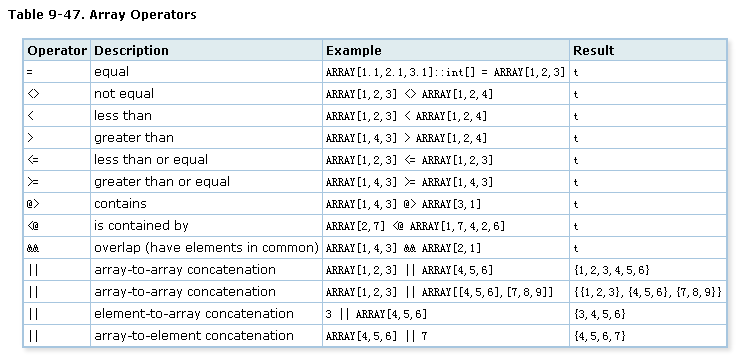
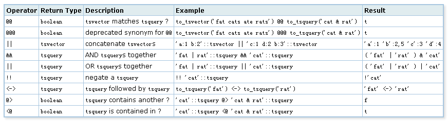

## 在PostgreSQL中实现按拼音、汉字、拼音首字母搜索的例子
##### [TAG 15](../class/15.md)
                
### 作者               
digoal                
                
### 日期               
2016-11-09                    
                
### 标签              
PostgreSQL , 拼音 , 中文分词 , tsvector , 拼音首字母 , hmm , 词库                                    
                
----              
                
## 背景   
PostgreSQL有很多特性是可以提升开发效率，提高生产力的。  
  
在前端页面中，搜索是一个非常常用的功能，例如淘宝首页的搜索。  
  
   
  
为了提升用户体验，用户可以按拼音首字母进行搜索，按中文单词搜索，或者按拼音的全部进行搜索。  
  
又比如家里的电视盒子，因为没有实体键盘，按拼音首字母搜索就非常方便。  
  
但是如何做到按拼音首字母或者按拼音可以进行匹配呢？   
  
## 应用程序端转换
本文的CASE主要需要用到的是中文和拼音以及拼音首字母的相互转换。  
  
例如这样的转换      
  
```
夹克
jk
jiake

大闹天宫
dntg
danaotiangong
```
  
有一个很好的例子  
  
http://www.letiantian.me/2016-02-08-pinyin-hanzi/  
  
### 基于词库的汉字转拼音  
    
词库中既要包含每个字的拼音，也要包含常用单词/短语的读音。有些字是多音字，所以至少要保存其最常用的读音，不常用的读音多出现在单词/短语里。  
  
好了，词库准备好了，现在手头有一句话要转换要转换为拼音，这句话是：  
  
```
你好世界杯
```
  
我们的词库是这样子的：  
  
```
你：nǐ
好：hǎo,hào
世：shì
界：jiè
杯：bēi
世界：shì,jiè
你好：nǐ,hǎo
苦尽甘来：kǔ,jìn,gān,lái
```
  
词库中最长的词 苦尽甘来 包含4个字。所以 你好世界杯 从4个字开始匹配：  
  
* 判断你好世界是否在词库中，不在；  
* 判断你好世是否在词库中，不在；  
* 判断你好是否在词库中，在，得到nǐ,hǎo；  
* 判断世界杯是否在词库中，不在；  
* 判断世界是否在词库中，在，得到shì,jiè；  
* 判断杯是否在词库中，在，得到bēi；  
    
于是你好世界杯被转换为nǐ,hǎo,shì,jiè,bēi。  
  
### 基于词库和分词工具的汉字转拼音  
纯粹的基于词库的方法在实际的使用中会遇到问题，例如 提出了解决方案 这句话中 了解 会被当作一个单词，所以会得到错误的结果：  
  
```
tí,chū,liǎo,jiě,jué,fāng,àn
```
   
更好的方法是先进行分词得到：   
   
```
提出
了
解决
方案
```
   
然后基于词库对每个结果分别处理。   
    
### 基于HMM的拼音转汉字
这里的拼音一般不带声调。  
   
将汉字作为隐藏状态，拼音作为观测值，使用viterbi算法可以将多个拼音转换成合理的汉字。例如给出 ti,chu,le,jie,jue,fang,an ，viterbi算法会认为 提出了解决方案 是最合理的状态序列。
  
HMM需要三个分布，分别是：  
  
* 初始时各个状态的概率分布  
* 各个状态互相转换的概率分布  
* 状态到观测值的概率分布  
  
这个3个分布就是三个矩阵，根据一些文本库统计出来即可。  
  
viterbi算法基于动态规划，维基百科 - Viterbi algorithm给出了很好的解释和示例。  
  
### 基于词库的拼音转汉字
原则：  
  
* 词的权重大于字的权重；  
  
转换中匹配的词越多，权重越小。  
  
词库的格式是：  
  
```
拼音:单词:权重
```
  
例如：  
  
```
ni:你:0.15
ni:泥:0.12
a:啊:0.18
hao:好:0.14
nihao:你好:0.6
```
  
假如输入是 ni,hao,a ，我们计算一下各种组合的权重：  
  
组合|	权重
---|---
你,好,啊|	0.15×0.14×0.18 = 0.00378
泥,好,啊|	0.12×0.14×0.18 = 0.003024
你好,啊|	0.6×0.18 = 0.108
  
可以看出，你好,啊 是最好的结果。  
  
实际实现中需要用到动态规划， 和求有向无环图中两点之间最短距离类似。  
  
### 代码实现
基于上面的思路，我编写了两个工具，欢迎指教 ^^  
  
拼音转汉字（拼音输入法引擎）：https://github.com/letiantian/Pinyin2Hanzi  
  
汉字转拼音：https://github.com/letiantian/ChineseTone  
  
### 参考 
https://github.com/jmz331/gpinyin  
  
http://www.letiantian.me/2016-02-08-pinyin-hanzi/  
  
https://github.com/letiantian/Pinyin2Hanzi  
  
https://github.com/letiantian/ChineseTone  
  
http://www.pudn.com/downloads370/sourcecode/windows/ime/detail1600247.html  
  
## 数据库端转换
可以把相关的中文，拼音相互转换的代码，嫁接到PostgreSQL，作为UDF对外提供转换接口。  
  
例如输入 zh_to_pinyin('你好') 返回 nihao,nh    
  
或者可以结合中文分词一起使用，同时支持自定义delimiter。  
  
例如输入 zh_to_pinyin('你好中国汉字', ';', ',') 返回 nihao,nh;zhongguo,zg;hanzi,hz  
  
## PostgreSQL存储例子
1\. 首先我们应该考虑分词，例如用户输入一个字符串，返回分词后的word。  
  
例如  
  
```
to_tsvector('zhparser', '你好中国')

返回

你好,中国
```
    
2\. 然后对word进行转换，得到转换后的值。  
  
例如输入 zh_to_pinyin(to_tsvector('zhparser', '你好中国')) 返回 你好,中国,nihao,nh,zhongguo,zg    
  
使用PostgreSQL分词插件得到分词的例子《使用阿里云PostgreSQL zhparser时不可不知的几个参数》    
  
https://yq.aliyun.com/articles/7730    
  
```
postgres=# create extension zhparser;
CREATE EXTENSION
postgres=# CREATE TEXT SEARCH CONFIGURATION testzhcfg (PARSER = zhparser);
CREATE TEXT SEARCH CONFIGURATION
postgres=# ALTER TEXT SEARCH CONFIGURATION testzhcfg ADD MAPPING FOR a,b,c,d,e,f,g,h,i,j,k,l,m,n,o,p,q,r,s,t,u,v,w,x,y,z WITH simple;
ALTER TEXT SEARCH CONFIGURATION
postgres=# set zhparser.punctuation_ignore = t;  -- 忽略标点符号
SET
postgres=# select * from ts_debug('testzhcfg','你好中国');  -- 得到分词后, 转换为拼音和拼音首字母
 alias | description | token | dictionaries | dictionary | lexemes 
-------+-------------+-------+--------------+------------+---------
 n     | noun        | 你好  | {simple}     | simple     | {你好}
 n     | noun        | 中国  | {simple}     | simple     | {中国}
(2 rows)
postgres=# select to_tsvector('testzhcfg', '你好,中国,nihao,nh,zhongguo,zg');  --  现在你有了所有需要的元素, 存入数组或tsvector就看你的喜好了
                      to_tsvector                       
--------------------------------------------------------
 'nh':4 'nihao':3 'zg':6 'zhongguo':5 '中国':2 '你好':1
(1 row)
```
  
这些动作可以封装为一个UDF来执行，提升效率，减少交互次数。  
  
3\. 得到转换后的值之后，再存入对应的字段中。  
  
在PostgreSQL中，你可以选择存储为字符串数组，或者tsvector类型。  
  
```
将 你好,中国,nihao,nh,zhongguo,zg 存入  
  
text[]

或 

tsvector
```
  
这两种类型都支持包含的查询。  
  
## 检索例子
1\. 精确匹配  
  
```
数组
column @> array['nihao']  
postgres=# select array['你好','中国','nihao','nh','zhongguo','zg'] @> array['nh'];
 ?column? 
----------
 t
(1 row)

tsvector
column @@ to_tsquery('nihao')  
postgres=# select to_tsvector('testzhcfg', '你好,中国,nihao,nh,zhongguo,zg') @@ to_tsquery('你好');
 ?column? 
----------
 t
(1 row)
postgres=# select to_tsvector('testzhcfg', '你好,中国,nihao,nh,zhongguo,zg') @@ to_tsquery('nh');
 ?column? 
----------
 t
(1 row)
postgres=# select to_tsvector('testzhcfg', '你好,中国,nihao,nh,zhongguo,zg') @@ to_tsquery('nh | 你哈');
 ?column? 
----------
 t
(1 row)
```
  
2\. 操作符  
  
数组  
  
   
  
tsvector  
  
   
    
           
        
  
<a rel="nofollow" href="http://info.flagcounter.com/h9V1"  ></a>  
  
  
  
  
  
  
## [digoal's 大量PostgreSQL文章入口](https://github.com/digoal/blog/blob/master/README.md "22709685feb7cab07d30f30387f0a9ae")
  
