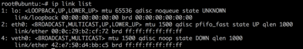
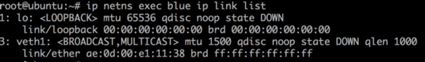
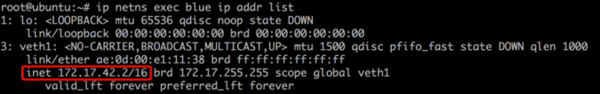
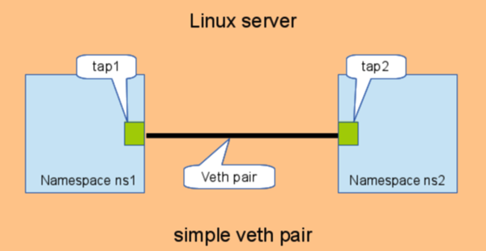
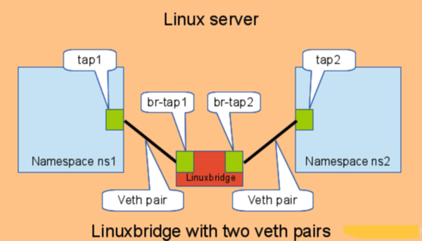

## network namespace与veth pair          
                      
### 作者                     
digoal                      
                      
### 日期                     
2016-11-10                            
                      
### 标签                    
namespace , veth pair , OpenvSwitch , OVS , bridge , VLAN , VM , 虚拟化 , 虚拟网桥                                        
                      
----                    
                      
## 背景  
在Linux虚拟化技术中，网络层面，通常除了网桥或虚拟交换机技术外。    
    
还有一个重要的就是namespace和veth pair。    
    
net namespace主要是隔离网络设备本身，例如在Linux 中有多个容器，每个容器对应各自的namespace，我们可以把不同的网络设备指派给不同的容器。    
    
veth pair你可以理解为使用网线连接好的两个接口，把两个端口放到两个namespace中，那么这两个namespace就能打通。  
  
如果要把namespace和本地网络打通，也可以创建veth设备，把两端分别放入本地和namespace。   
  
下面是例子  
  
http://www.cnblogs.com/hustcat/p/3928261.html   
  
## network namespace
### 创建network namespace
```
# ip netns add blue

# ip netns list

blue
```
  
### 添加网口到namespace
先创建veth  
  
```
# ip link add veth0 type veth peer name veth1
```
  
在当前namespace可以看到veth0和veth1  
```
# ip link list

1: lo: <LOOPBACK,UP,LOWER_UP> mtu 65536 qdisc noqueue state UNKNOWN
    link/loopback 00:00:00:00:00:00 brd 00:00:00:00:00:00

2: eth0: <BROADCAST,MULTICAST,UP,LOWER_UP> mtu 1500 qdisc pfifo_fast state UP qlen 1000
    link/ether 00:0c:29:b2:cf:72 brd ff:ff:ff:ff:ff:ff

3: veth1: <BROADCAST,MULTICAST> mtu 1500 qdisc noop state DOWN qlen 1000
    link/ether ae:0d:00:e1:11:38 brd ff:ff:ff:ff:ff:ff

4: veth0: <BROADCAST,MULTICAST> mtu 1500 qdisc noop state DOWN qlen 1000
    link/ether 42:e7:50:d4:bb:c5 brd ff:ff:ff:ff:ff:ff
```
   
将veth1加到namespace “blue”  
  
```
# ip link set veth1 netns blue
```
  
此时，当前namepapce只能看到veth0。  
  
   
  
通过如下命令可以查看blue namespace的网口  
  
```
# ip netns exec blue ip link list
```
  
  
  
### 配置network namespace的网口
通过ip netns exec可以配置namespace的网口  
  
```
# ip netns exec blue ifconfig veth1 172.17.42.2/16 up
```
  
  
  
### network namespace的网口与物理网卡的通信
通过bridge来实现。参见veth pair一节。  
  
主要参考    
   
http://blog.scottlowe.org/2013/09/04/introducing-linux-network-namespaces/  
  
## veth pair
veth pair是用于不同network namespace间进行通信的方式，veth pair将一个network namespace数据发往另一个network namespace的veth。如下：   
  
  
  
```
# add the namespaces

ip netns add ns1

ip netns add ns2

# create the veth pair

ip link add tap1 type veth peer name tap2

# move the interfaces to the namespaces

ip link set tap1 netns ns1

ip link set tap2 netns ns2

# bring up the links

ip netns exec ns1 ip link set dev tap1 up

ip netns exec ns2 ip link set dev tap2 up
```
   
如果多个network namespace需要进行通信，则需要借助bridge：  
  
  
  
```
# add the namespaces

ip netns add ns1

ip netns add ns2

# create the switch

BRIDGE=br-test

brctl addbr $BRIDGE

brctl stp   $BRIDGE off

ip link set dev $BRIDGE up

#

#### PORT 1

# create a port pair

ip link add tap1 type veth peer name br-tap1

# attach one side to linuxbridge

brctl addif br-test br-tap1

# attach the other side to namespace

ip link set tap1 netns ns1

# set the ports to up

ip netns exec ns1 ip link set dev tap1 up

ip link set dev br-tap1 up

#

#### PORT 2

# create a port pair

ip link add tap2 type veth peer name br-tap2

# attach one side to linuxbridge

brctl addif br-test br-tap2

# attach the other side to namespace

ip link set tap2 netns ns2

# set the ports to up

ip netns exec ns2 ip link set dev tap2 up

ip link set dev br-tap2 up

#
```
   
内核实现  
  
veth的实现与loopback interface类似，比较简单：  
  
```
//drivers/net/veth.c

static netdev_tx_t veth_xmit(struct sk_buff *skb, struct net_device *dev)

{

struct net_device *rcv = NULL;

struct veth_priv *priv, *rcv_priv;

 

priv = netdev_priv(dev);

rcv = priv->peer;

rcv_priv = netdev_priv(rcv);

 

stats = this_cpu_ptr(priv->stats);

 

length = skb->len;

   //转发给peer

if (dev_forward_skb(rcv, skb) != NET_RX_SUCCESS)

 

goto rx_drop;
```
   
### NETIF_F_NETNS_LOCAL
NETIF_F_NETNS_LOCAL是网络设备的一个特性，设置该特性的网络设备，不允许在不同network namespace间移动。这类设备也叫做本地设备（local devices）。    
  
Loopback，VXLAN，PPP，bridge都是这类设备。可以通过ethtool -k，或者ethtool –show- features查看该值：  
  
```
# ethtool -k br0

netns-local: on [fixed]
```
   
如果对这类设备network namespace，会报下面的错误：  
  
```
# ip link set br0 netns ns1

RTNETLINK answers: Invalid argument
```
   
  
参考《Resource management:Linux kernel Namespaces and cgroups》  
  
主要参考    

http://www.opencloudblog.com/?p=66  
                   
              
  
<a rel="nofollow" href="http://info.flagcounter.com/h9V1"  ></a>  
  
  
  
  
  
  
## [digoal's 大量PostgreSQL文章入口](https://github.com/digoal/blog/blob/master/README.md "22709685feb7cab07d30f30387f0a9ae")
  
