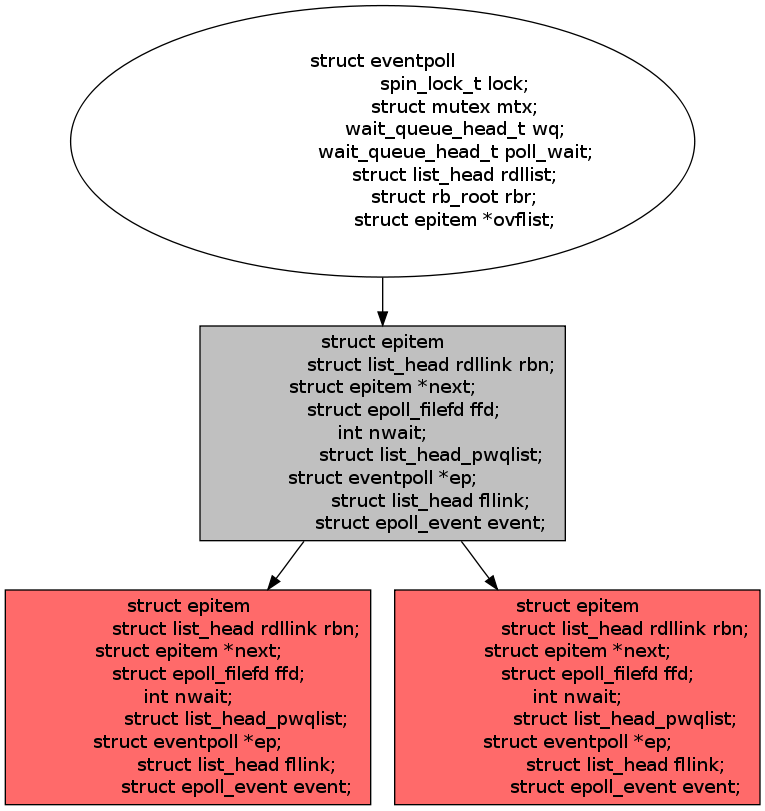
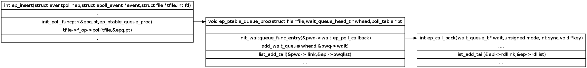
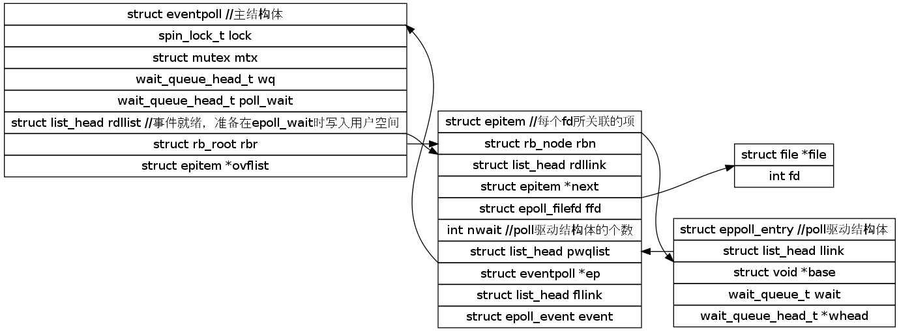
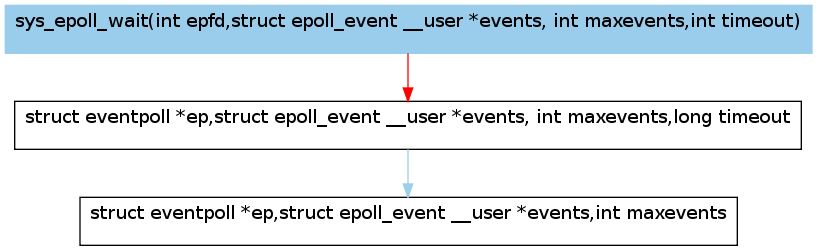

## epoll源码分析       
                                        
### 作者                                       
digoal                                        
                                        
### 日期                                       
2016-11-10                                              
                                        
### 标签                                      
Linux , 内核 , epoll , 网络编程 , 高并发                                                                      
                                        
----                                      
                                        
## 背景          
本文转自      
      
http://www.cnblogs.com/debian/archive/2012/02/16/2354454.html     
    
## 原文
当系统启动时，epoll进行初始化:    
  
```
 1 static int __init eventpoll_init(void)  
 2 {  
 3     mutex_init(&pmutex);  
 4     ep_poll_safewake_init(&psw);  
 5     epi_cache = kmem_cache_create(“eventpoll_epi”,sizeof(struct epitem),  
 6             0,SLAB_HWCACHE_ALIGN|EPI_SLAB_DEBUG|  
 7             SLAB_PANIC,NULL);  
 8     pwq_cache = kmem_cache_create(“eventpoll_pwq”,sizeof(struct  
 9              eppoll_entry),0,EPI_SLAB_DEBUG|SLAB_PANIC,NULL);  
10       
11     return 0;  
12 }  
``` 
  
  
上面的代码实现一些数据结构的初始化,通过fs/eventpoll.c中的注释可以看出,有三种类型的锁机制使用场景:  
  
1).epmutex(mutex):用户关闭文件描述符，但是没有调用EPOLL_CTL_DEL  
  
2).ep->mtx(mutex):用户态与内核态的转换可能会睡眠  
  
3).ep->lock(spinlock):内核态与具体设备中断过程中的转换,poll回调  
  
  
  
接下来就是使用slab分配器动态分配内存，第一个结构为当系统中添加一个fd时，就创建一epitem结构体,内核管理的基本数据结构:  
  
```  
 1 struct epitem  
 2 {  
 3     struct rb_node rbn;//用于主结构管理的红黑树  
 4     struct list_head rdllink;//事件就绪队列  
 5     struct epitem *next;//用于主结构体中的链表  
 6     struct epoll_filefd ffd;//每个fd生成的一个结构  
 7     int nwait;//  
 8     struct list_head pwqlist;//poll等待队列  
 9     struct eventpoll *ep;//该项属于哪个主结构体  
10     struct list_head fllink;//链接fd对应的file链表  
11     struct epoll_event event;//注册的感兴趣的事件,也就是用户空间的epoll_event  
12 }  
```  
  
  
而每个epoll fd对应的主要数据结构为:  
  
```  
1 struct eventpoll {  
2     spin_lock_t lock;//对本数据结构的访问  
3     struct mutex mtx;//防止使用时被删除  
4     wait_queue_head_t wq;//sys_epoll_wait() 使用的等待队列  
5     wait_queue_head_t poll_wait;//file->poll()使用的等待队列  
6     struct list_head rdllist;//事件满足条件的链表  
7     struct rb_root rbr;//用于管理所有fd的红黑树  
8     struct epitem *ovflist;//将事件到达的fd进行链接起来发送至用户空间  
9 }  
```  
  
  
该结构主要在epoll_create时进行创建:  
  
```  
 1 //原来使用的是hash表，所以有size,现在改为红黑树，故不使用.  
 2 long sys_epoll_create(int size)  
 3 {  
 4     int error,fd = -1;  
 5     struct eventpoll *ep;  
 6     struct inode *inode;  
 7     struct file *file;  
 8       
 9     ….  
10     error = -EINVAL;  
11     //分配空间  
12     if(size <= 0 || (error = ep_alloc(&ep)!=0))  
13         goto errror_return;  
14     //创建一个struct file结构，由于没有任何文件系统，为匿名文件,  
15         并将主结构体放入file->private项中进行保存  
16     error = anon_inode_getfd(&fd,&inode,&file,”[eventpoll]”,  
17             &eventpoll_fops,ep);  
18     if(error)  
19         goto error_free;  
20     return fd;  
21     ...  
22 }  
```  
  
  
上面注册的操作eventpoll_fops定义如下：  
  
``` 
1 static const struct file_operations eventpoll_fops = {  
2     .release     =     ep_eventpoll_release;  
3     .poll        =    ep_eventpoll_poll,  
4 }  
``` 
  
这样说来，内核中维护了一棵红黑树，大致的结构如下：  
  
  
  
  
  
  
上面的原型是epoll的fd所维护的主结构，下面是每一个具体的fd结构.  
  
以后每一个fd加入到epoll中，就会创建一个struct epitem结构，并插入至红黑树中。  
  
   
  
   
  
   
  
接着是epoll_ctl函数原型:  
  
```
 1 asmlinkage long sys_epoll_ctl(int epfd,int op,int fd,struct epoll_event __user *event)  
 2 {  
 3     int error;  
 4     struct file *file,*tfile;  
 5     struct eventpoll *ep;  
 6     struct epoll_event epds;  
 7       
 8     error = -FAULT;  
 9     //判断行参的合法性  
10     if(ep_op_has_event(op) && copy_from_user(&epds,event,sizeof(struct         epoll_event)))  
11             goto error_return;  
12   
13     error = -EBADF;  
14     file = fget (epfd);  
15     if(!file)    goto error_return;  
16       
17     tfile = fget(fd);  
18     if(!tfile)    goto error_fput;  
19       
20     error = -EPERM;  
21     //不能没有poll驱动  
22     if(!tfile->f_op || !tfile->f_op->poll)  
23         goto error_tgt_fput;  
24           
25     error =-EINVAL;  
26     //防止自己监听自己  
27     if(file == tfile || !is_file_poll(file))  
28         goto error_tgt_fput;  
29     //在create时存入进去的，现在将其拿出来  
30     ep = file->private->data;  
31       
32     mutex_lock(&ep->mtx);  
33     //防止重复添加  
34     epi = epi_find(ep,tfile,fd);  
35     error = -EINVAL;  
36       
37     switch(op)  
38     {  
39         ….....  
40         case EPOLL_CTL_ADD:  
41             if(!epi)  
42             {  
43                 epds.events |=EPOLLERR | POLLHUP;  
44                 error = ep_insert(ep,&epds,tfile,fd);  
45             } else   
46                 error = -EEXIST;  
47             break;  
48         …....  
49     }  
50     return error;      
51 }  
```
  
  
下面就是ep插入代码:  
  
```
 1 static int ep_insert(struct eventpoll *ep,struct epoll_event *event,  
 2                 struct file *tfile,int fd)  
 3 {  
 4     int error ,revents,pwake = 0;  
 5     unsigned long flags ;  
 6     struct epitem *epi;  
 7     /*  
 8     struct ep_queue{  
 9         poll_table pt;  
10         struct epitem *epi;  
11     }  
12 */  
13     struct ep_pqueue epq;  
14       
15     //分配一个epitem结构体来保存每个加入的fd  
16     error = -ENOMEM;  
17     if(!(epi = kmem_cache_alloc(epi_cache,GFP_KERNEL)))  
18         goto error_return;  
19     //初始化该结构体  
20     ep_rb_initnode(&epi->rbn);  
21     INIT_LIST_HEAD(&epi->rdllink);  
22     INIT_LIST_HEAD(&epi->fllink);  
23     INIT_LIST_HEAD(&epi->pwqlist);  
24     epi->ep = ep;  
25     ep_set_ffd(&epi->ffd,tfile,fd);  
26     epi->event = *event;  
27     epi->nwait = 0;  
28     epi->next = EP_UNACTIVE_PTR;  
29       
30     epq.epi = epi;  
31     //安装poll回调函数  
32     init_poll_funcptr(&epq.pt,ep_ptable_queue_proc);  
33     //调用poll函数来获取当前事件位，其实是利用它来调用注册函数ep_ptable_queue_proc  
34     revents = tfile->f_op->poll(tfile,&epq.pt);  
35   
36     if(epi->nwait < 0)  
37         goto error_unregister;  
38   
39     spin_lock(&tfile->f_ep_lock);  
40     list_add_tail(&epi->fllink,&tfile->f_ep_lilnks);  
41     spin_unlock(&tfile->f_ep_lock);  
42       
43     ep_rbtree_insert(ep,epi);  
44     spin_lock_irqsave(&ep->lock,flags);  
45   
46     if((revents & event->events) && !ep_is_linked(&epi->rdllink))  
47     {  
48         list_add_tail(&epi->rdllink,&ep->rdllist);  
49     if(waitqueue_active(&ep->wq))  
50         __wake_up_locked(&ep->wq,TAKS_UNINTERRUPTIBLE | TASK_INTERRUPTIBLE);  
51   
52     if(waitqueue_active(&ep->poll_wait))  
53         pwake++;  
54     }  
55       
56     spin_unlock_irqrestore(&ep->lock,flags);  
57     if(pwake)   
58         ep_poll_safewake(&psw,&ep->poll_wait);  
59         …....  
60       
61     return 0;  
62       
63     …...  
64       
65 }  
```
   
  
```
 1 //当poll醒来时就回调用该函数  
 2 static void ep_ptable_queue_proc(struct file *file,wait_queue_head_t *whead,  
 3                 poll_table *pt)  
 4 {  
 5     //从注册时的结构中struct ep_pqueue中获取项epi  
 6     struct epitem *epi = ep_item_from_epqueue(pt);  
 7     /*//epitem的私有项,通过pwqlist来进行链接  
 8      *struct eppoll_entry  
 9      {  
10         struct list_head llink;  
11         void *base;  
12         wait_queue_t wait;  
13         wait_queue_head_t *whead;  
14      }  
15 */  
16     struct eppoll_entry *pwq;//struct epitem的私有项，为每一个fd保存内核poll  
17   
18 //为每一个等待的结构分配一项  
19     if(epi->nwait >= 0 && (pwq = kmem_cache_alloc(pwq_cache,  
20             GFP_KERNEL)))  
21     {  
22         //醒来就调用ep_poll_callback,这里才是真正意义上的poll醒来时的回调函数  
23         init_waitqueue_func_entry(&pwq->wait,ep_poll_callback);  
24         pwq->whead = whead;  
25         pwq->base = epi;  
26         //加入到该驱动的等待队列  
27         add_wait_queue(whead,&pwq->wait);  
28         //将等待链接也放入到epitem链表中去  
29         list_add_tail(&pwq->llink,&epi->pwqlist);  
30         epi->nwait ++;          
31     } else {  
32         epi->nwait = -1;  
33     }  
34 }  
35 //当poll监听的事件到达时，就会调用下面的函数  
36 static int ep_poll_callback(wait_queue_t *wait,unsigned mode,int sync,void *key)  
37 {  
38     int pwake = 0;  
39     unsigned long flags;  
40     struct epitem *epi = ep_item_from_wait(wait);  
41     struct eventpoll *ep = epi->ep;  
42       
43     spin_lock_irqsave(&ep->lock,flags);  
44     //判断注册的感兴趣事件   
45 //#define EP_PRIVATE_BITS      (EPOLLONESHOT | EPOLLET)  
46 //有非EPOLLONESHONT或EPOLLET事件  
47     if(!(epi->event.events & ~EP_PRIVATE_BITS))  
48             goto out_unlock;  
49       
50     if(unlikely(ep->ovflist != EP_UNACTIVE_PTR))  
51     {  
52         if(epi->next == EP_UNACTIVE_PTR) {  
53             epi->next = ep->ovflist;  
54             ep->ovflist = epi;  
55         }  
56         goto out_unlock;  
57     }  
58   
59     if(ep_is_linked(&epi->rdllink))  
60         goto is_linked;  
61     //关键是这一句，将该fd加入到epoll监听的就绪链表中  
62     list_add_tail(&epi->rdllink,&ep->rdllist);  
63 is_linked:  
64     if(waitqueue_active(&ep->wq))  
65         __wake_up_locked(&ep->wq,TASK_UNINTERRUPTIBLE   
66             | TASK_INTERRUPTIBLE);      
67     if(waitqueue_active(&ep->poll_wait))  
68         pwake++;  
69 out_unlock:  
70     spin_unlock_irqrestore(&ep->lock,flags);  
71       
72     if(pwake)  
73         ep_poll_safewake(&psw,&ep->poll_wait);  
74     return 1;  
75 }  
```
  
  
这里采用了两级回调方式，流程如下:  
  
  
  
目前为止，整个数据结构就可以描述如下:  
  
  
  
  
  
epoll_wait系统实现如下:  
  
```
 1 asmlinkage long sys_epoll_wait(int epfd,struct epoll_event __user *events,  
 2             int maxevents,int timeout)  
 3 {  
 4     int error;  
 5     struct file *file;  
 6     struct eventpoll *ep;  
 7     //#define EP_MAX_EVENTS (INT_MAX / sizeof(struct epoll_event))  
 8 //178956970(1.7亿)  
 9     if(maxevents <=0 || maxevents > EP_MAX_EVETNS)   
10         return -EINVAL;  
11     //判断返回事件数组是否合法  
12     if(!access_ok(VERIFY_WRITE,events,  
13             maxevents * sizeof(struct epoll_event)))  
14     {  
15         error = -EFAULT;  
16         goto error_return;  
17     }  
18   
19     error = -EBADF;  
20     file = fget(epfd);  
21       
22     if(!file)  
23         goto error_return;  
24     error = -EINVAL;  
25     if(!is_file_epoll(file))  
26         goto error_fput;  
27     //将epoll注册时设置的数据结构取出来，开始进行判断  
28     ep = file->private_data;  
29     error = ep_poll(ep,events,maxevents,timeout);  
30         ….......  
31 }  
``` 
  
  
现在又转入了ep_poll函数中:  
  
```
 1 static int ep_poll(struct eventpoll *ep,struct epoll_event __user *events,  
 2                 int maxevents,long timeout)  
 3 {  
 4     int res,avail;  
 5     unsigned long flags;  
 6     long jtimeout;  
 7     wait_queue_t wait;  
 8       
 9     //注册的0ms按0.999 Jiffies处理,并非真正的0s,HZ=100,  
10 //jiffies/HZ 为s  
11     jtimeout = (timeout<0 || timeout >= EP_MAX_MSTIMEO)?  
12         MAX_SCHEDULE_TIMEOUT:(timeout*HZ+999)/1000;  
13   
14 retry:  
15     spin_lock_irqsave(&ep->lock,flags);  
16       
17     res = 0;  
18     //事件就绪队列为空，就监听poll  
19     if(list_empty(&ep->rdllist))  
20     {  
21         //让当前进程挂在等待队列wait上，并将该等待队列加入到ep->wq(epoll_wait的            专属队列中),  
22         init_waitqueue_entry(&wait,current);  
23         wait.flags |= WQ_FLAG_EXCLUSIVE;  
24         __add_wait_queue(&ep->wq,&wait);  
25   
26         for(;;){  
27             //进程设置睡眠状态，等到信息时变唤醒  
28             set_current_state(TASK_INTERRUPTIBLE);  
29             if(!list_empty(&ep->rdllist) || !jtimeout)//只要事件到来，就返回  
30                 break;  
31             if(signal_pending(current)) {//被信号中断就会返回  
32                 res = -EINTR;  
33                 break;  
34             }  
35         spin_unlock_irqrestore(&ep->lock,flags);  
36         //进程进入睡眠状态直到规定的睡眠事件醒来或者注册的fd对应的poll驱动函数唤醒该            进程  
37         jtimeout = schedule_timeout(jtimeout);  
38         spin_lock_irqrestore(&ep->lock,flags);  
39         }  
40     //poll驱动唤醒了该进程，现在就将对应的poll从等待队列中清除出去,并设置为运行状态  
41     __remove_wait_queue(&ep->wq,&wait);  
42     set_current_state(TASK_RUNNING);  
43     }  
44     eavail = !list_empty(&ep->rdllist);  
45     spin_unlock_irqrestore(&ep->lock,flags);  
46     //没有被中断，有就绪事件，并且向用户空间发送成功，就返回  
47     if(!res && eavail && !(res = ep_send_events(ep,events,maxevents))  
48         &&jtimeout)  
49         goto retry;  
50   
51     return res;  
52 }  
``` 
  
  
ep_send_events函数向用户空间发送就绪事件:  
  
```
 1 static int ep_send_events(struct eventpoll *ep,struct epoll_event __user *events,int maxevents)  
 2 {  
 3     int eventcnt,error = -EFAULT,pwake = 0;  
 4     unsigned int revents;  
 5     unsigned long flags;  
 6     struct epitem *epi,*nepi;  
 7     struct list_head txlist;  
 8   
 9     INIT_LIST_HEAD(&txlist);  
10     mutex_lock(&ep->mtx);  
11   
12     spin_lock_irqsave(&ep->lock,flags);  
13     //将ep->rdllist链表加入到txlist链表中去,这样的话rdllist链表就为空了  
14     list_splice(&ep->rdllist,&txlist);  
15     INIT_LIST_HEAD(&ep->rdllist);  
16     ep->ovflist = NULL;  
17     spin_unlock_irqrestore(&ep->lock,flags);  
18     //将rdllist链表中的每一项都发送至用户空间  
19     for(eventcnt = 0; !list_empty(&txlist) && eventcnt < maxevents;) {  
20           
21         epi = list_first_entry(&txlist,struct epitem,rdllink);  
22         list_del_init(&epi->rdllink);      
23         //立刻返回当前文件的就绪事件  
24         revents = epi->ffd.file->f_op->poll(epi->ffd.file,NULL);  
25         revents &= epi->event.events;  
26           
27         if(revents) {  
28             //将就绪事件的poll_event发送至用户空间  
29             if(__put_user(revents,&events[eventcnt.].events) ||  
30              __put_user(epi->event.data,&events[eventcnt].data))  
31                   
32                 goto errxit;  
33             //#define EP_PRIVATE_BITS (EPOLLONESHOT | EPOLLET)  
34             if(epi->event.events & EPOLLONESHOT)  
35                 epi->event.events &= EP_PRIVATE_BITS;  
36             eventcnt++;  
37         }  
38      //非边缘触发，且事件就绪时，就将epi->rdllink加入到rdllist链表中,实际上就是将没有标记为ET模式的fd又放回到rdllist中，这样下次就绪时又能将其发送至用户空间了  
39      if(!(epi->event.events & EPOLLET) && (revents &   
40                 epi->event.events))  
41             list_add_tail(&epi->rdllink,&ep->rdllist);  
42 }  
43     error = 0;  
44 errixt:  
45     spin_lock_irqsave(&ep->lock,flags);  
46     //在执行上面的代码期间，又有可能有就绪事件，这样的话就进入了ovflist队列，这样有需要再一次确认一次      
47     for(nepi = ep->ovflist;(epi = nepi)!= NULL;  
48      nepi = epi->next;epi->next = EP_UNACTIVE_PTR) {  
49         //链表为空且没有ET事件发生,#define EP_PRIVATE_BITS (EPOLLONESHOT | EPOLLET),这里也和上面的一样  
50         if(!ep_is_linked(&epi->rdllink) && (epi->event.events &   
51             ~EP_PRIVATE_BITS))  
52             //又将rdllink其加入到rdllist中  
53                 list_add_tail(&epi->rdllink,&ep->rdllist);  
54     }  
55     //#define EP_UNACTIVE_PTR    ((void*) -1L)  
56     ep->ovflist = EP_UNACTIVE_PTR;  
57     list_spice(&txlist,&ep->rdllist);//现在又将txlist链表加入到rdllist链表中去  
58     if(!list_empty(&ep->rdllist))  
59     {  
60         //等待的队列不为空  
61         if(waitqueue_active(&ep->wq))  
62               
63             __wake_up_locked(&ep->wq,TASK_UNINTERRUPTIBLE |  
64             TASK_INTERRUPTIBLE);  
65         //如果poll队列不为空，则唤醒的次数加1  
66         if(waitqueue_active(&ep->poll_wait))  
67             pwake++;  
68     }  
69     spin_unlock_irqrestore(&ep->lock,flags);  
70     mutex_unlock(&ep->mtx);  
71     if(pwake)  
72         ep_poll_safewake(&psw,&ep->poll_wait);  
73     return eventcnt == 0?error:eventcnt;  
74 }  
``` 
  
  
这样epoll_wait的调用顺序为:  
  
  
  
   
  
参考资料:  
  
linux-2.6.24.3源代码  
  
http://donghao.org/2009/08/linuxiapolliepollaueouaeaeeio.html  
  
http://blog.chinaunix.net/uid-20687780-id-2105154.html  
                       
                                
  
<a rel="nofollow" href="http://info.flagcounter.com/h9V1"  ></a>  
  
  
  
  
  
  
## [digoal's 大量PostgreSQL文章入口](https://github.com/digoal/blog/blob/master/README.md "22709685feb7cab07d30f30387f0a9ae")
  
