## 数据仓库架构的变迁         
                                          
### 作者                                         
digoal                                          
                                          
### 日期                                         
2016-11-10                                                
                                          
### 标签                                        
Greenplum , HAWQ , PostgreSQL , MPP , OLAP , HDFS , Hadoop                                                                          
                                          
----                                        
                                          
## 背景      
本文是HashData发表的关于Greenplum, HAWQ的文章，内容很丰富，向作者致敬，收藏。  
  
HashData是原pivotal HAWQ的开发团队出去创业创办的大数据产品公司。  
  
转自        
        
https://segmentfault.com/a/1190000007419222?from=groupmessage&isappinstalled=0      
      
## 原文  
引言  
第八届中国架构师大会（SACC2016）10月27号到29号在北京万达索菲特大饭店成功举办。大会以“架构创新之路“为主题，云集了国内外顶尖专家，共同探讨云计算和大数据等技术背景下，如何通过架构创新及各种IT新技术来带动企业转型增效。作为一家专注于云端数据仓库的初创公司，酷克数据受邀在SACC2016 “数据库平台架构及变迁”分会场作了题为“数据仓库架构及变迁”的演讲。以下是这次演讲的PPT。  
  
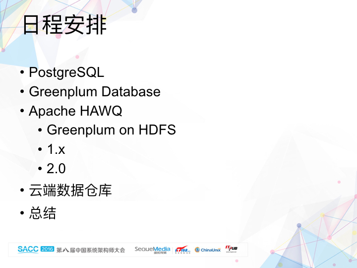    
  
这个日程安排同时也是我们公司核心团队的技术进阶史。公司创始团队成员有幸以核心开发者的角色参与，从单机版的关系型数据库（PostgreSQL），大规模并行处理（MPP）数据库（Greenplum Database）到SQL on Hadoop解决方案（Apache HAWQ），以及最新的SQL on Cloud数据仓库（HashData）。通过回顾这个技术演进的历程，我们将阐述如何一步一步地解决联机分析（OLAP）系统低延迟、高并发以及扩展性问题。  
  
PostgreSQL    
    
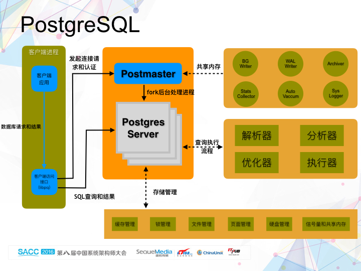    
  
  
由于后面讨论的所有的分布式数据库，包括Greenplum Database，Apache HAWQ以及HashData云端数据仓库，都是基于单机版关系型数据库PostgreSQL的，所以我们首先简单介绍一下PostgreSQL，作为后续讨论的基础。  
  
每个PostgreSQL数据库的实例包含一个PostMaster的damon进程和多个子进程,包括负责写出脏数据的BG Writer进程，收集统计信息的Stats Collector进程，写事务日志的WAL Writer进程，等等。  
  
客户端应用通过libpq协议连接到PostMaster进程；PostMaster收到连接请求后，fork出一个子进程Postgres Server来处理来自这个连接的查询语句。Postgres Server进程的功能组件可以分成两大类：查询执行和存储管理。查询执行组件包括解析器、分析器、优化器以及执行器。在查询执行过程中，需要访问和更新系统状态和数据，包括缓存，锁，文件和页面等等。  
  
Greenplum  
  
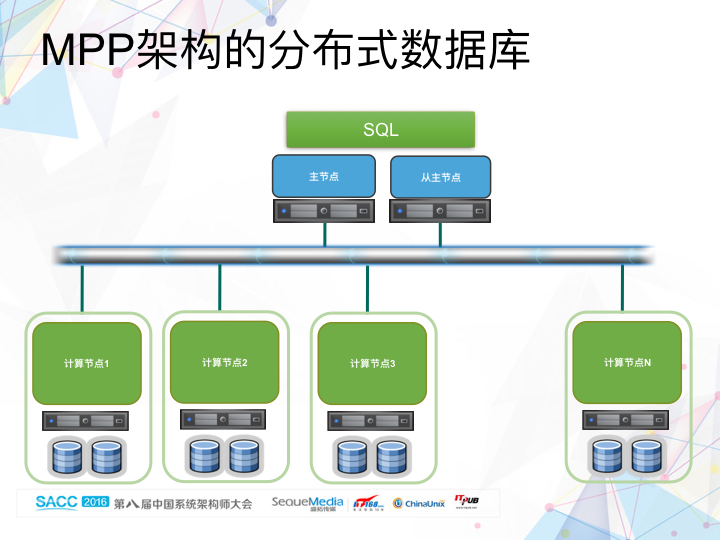    
  
作为一个单机版的关系型数据库，PostgreSQL更多地是作为联机事务处理（OLTP）系统使用的。当然，由于其丰富的分析功能，很多企业也会基于PostgreSQL来构建数据仓库，特别是在数据量不大的情况下。但是，随着数据量的增大，基于单机PostgreSQL构建的数据仓库就无法满足企业用户对查询响应时间的要求：低延迟。  
  
为了解决这个问题，MPP架构就被引入了。这是MPP架构分布式数据库的简单示意图。MPP数据库通过将数据切片分布到各个计算节点后并行处理来解决海量数据分析的难题。每个MPP数据库集群由一个主节点（为了提供高可用性，通常还会有一个从主节点）和多个计算节点组成。主节点和每个计算节点都有自己独立的CPU，内存和外部存储。主节点负责接收客户端的请求，生成查询计划，并将计划下发到每个计算节点，协调查询计划的完成，最后汇总查询结果返回给客户端。计算节点负责数据的存储以及查询计划的执行。计算节点之间是没有任何共享依赖的（shared nothing）。查询在每个计算节点上面并行执行，大大提升了查询的效率。  
  
我们接下来要讲的开源Greenplum Database就是基于PostgreSQL的MPP数据库。对应到这个架构图，每个节点上面的数据库实例可以简单的认为是一个PostgreSQL实例。  
  
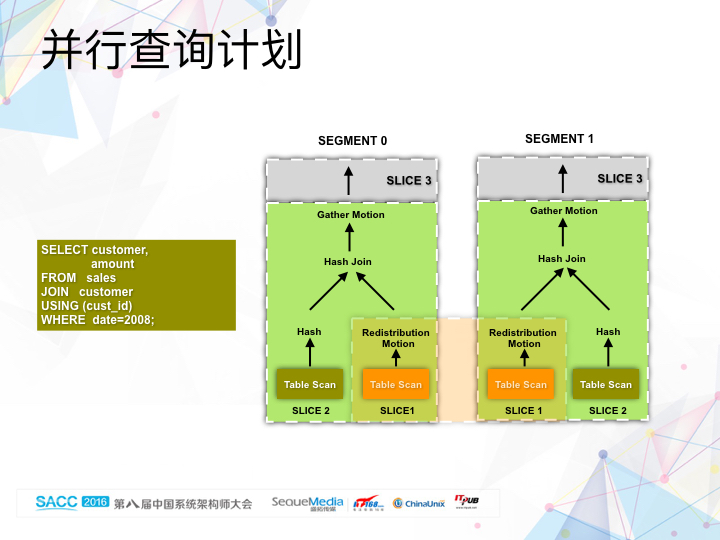    
  
我们首先通过一条简单的查询，感性地认识一下Greenplum Database是如何执行一条查询的。  
  
这是一条简单的两表等值连接语句。其中，customer表是维度表，表数据以cust_id作为hash分布的key；sales表是事实表，在这个例子中，我们可以认为它的表数据是round-robin的方式随机分布的，不影响查询的执行。  
  
每个查询执行是一个由操作符组成的树。只看其中一个节点的话（如前面所说，每个计算节点就是一个PostgreSQL的实例），为了执行两表的等值连接，我们首先会将两表的数据分别扫描出来，然后基于维度表customer建立hash桶。对于每一条从sales表扫描出来的纪录，我们都会到hash桶去查。如果满足匹配条件，数据连接结果；否则，直接pass。  
  
如前面提到的，在Greenplum Database中，每张表的数据按照hash分布或者随机分布打散到每个计算节点上面。在这个例子中，由于sales表是随机分布的，为了正确执行基于cust_id的等值连接，生成的执行计划会在table scan上面添加一个Redistribution motion节点。这个motion节点根据cust_id的hash值对数据作重分布，类似MapReduce中的shuffling。由于hash join操作是在每个节点上面分布式执行的，在将结果返回给客户端的时候，需要在主节点上面执行汇总操作。Gather motion的作用就在于将每个节点上面的中间结果集中到主节点上面。  
  
对于这样一个并行的查询计划，我们会根据数据重分布的操作将整棵查询执行树切割成不同的子树。每个子树对应查询计划的一个阶段，我们称为slice。查询计划和slice是逻辑上的概念。  
  
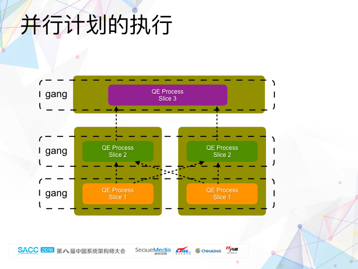    
  
在物理层面，对应的是并行执行计划和gang。gang指的是执行同一个slice操作的一组进程。MPP数据库的一个重要特征是，计算和存储是紧耦合的。每一张表的数据打散存储到每个计算节点上面。为了确保查询结果的正确性，每个计算节点都需要参与每条查询的执行中。在Greenplum Database的架构设计中，对于每个slice执行子树，在每个计算节点中会启动一个相应的Postgres Server进程（这里称为QE进程）来执行对应的操作。执行同一个slice的一组QE进程我们称为gang。对应于查询计划中的三个slice，在执行计划中，相应有三组gang。其中底下的两个gang，我们称之为N-gang，因为这种类型的gang中，包含了每个计算节点上面启动的一个QE进程。顶上的gang，我们称之为1-gang，因为它只包含了一个进程。  
  
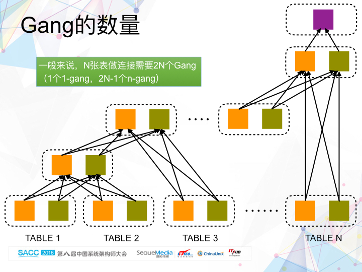    
  
一般来说，对于N张表的关联操作，执行计划中会包含2N个gang，其中1个1-gang，对应主节点上面的进程；2N-1个N-gang，对应每个计算节点上面启动的2N-1个QE进程。在这2N-1个gang中，其中N个用于扫描N张表，中间N-1个gang用于两表关联。也就是说，对于一条涉及到N表关联操作的查询语句，我们需要在每个计算节点上面启动2N-1个QE进程。  
  
很多用户在评估Greenplum Database的并发数，也就是支持的最大同时运行的查询数量，首先会担心主节点会成为瓶颈，直观原因是所有用户连接请求都首先会到主节点。其实，从资源使用的角度看，计算节点会首先成为瓶颈。因为在执行涉及多表关联的复杂查询时，计算节点上面启动的进程数量会远多于主节点。所以，Greenplum Database系统架构决定了它不能支持非常高的并发访问。  
  
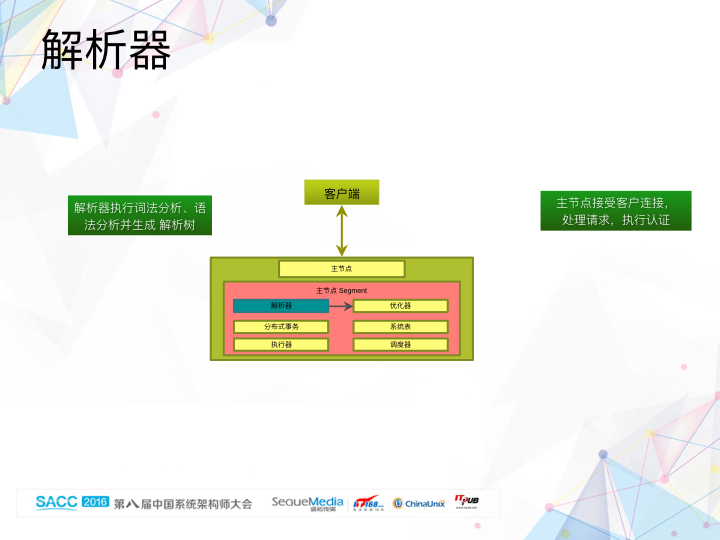    
  
前面我们简单阐述了MPP分布式数据库的架构，并通过一条简单的查询语句解释了分布式的执行计划。接下来我们深入讨论一下Greenplum Database的重要组件。  
  
首先是解析器。从使用者的角度看，Greenplum Database跟PostgreSQL没有明显差别。主节点作为整个分布式系统集群的大脑，负责接收客户连接，处理请求。跟PostgreSQL一样，对于每一个连接请求，Greenplum Database都会在主节点上面fork一个Postgres Server（我们称之为QD）进程出来，负责处理这个连接提交的查询语句。对于每一条进来的查询语句，QD进程中的解析器执行语法分析和词法分析，生成解析树。虽然在一些DDL语句上面，Greenplum Database跟PostgreSQL会有一些语法上的小不同，例如建表语句可以指定数据进行hash分布的key，但总体上，在解析器这个组件上面，两者的差别不大。  
  
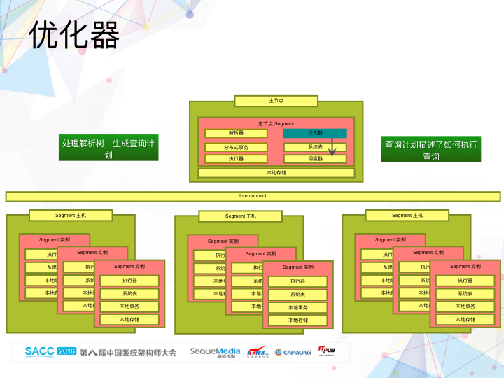    
  
优化器根据解析器生成的解析树，生成查询计划。查询计划描述了如何执行查询。查询计划的优劣直接影响查询的执行效率。对于同样一条查询语句，一个好的查询执行效率比一个次好的查询计划快上100倍，也是一个很正常的事情。从PostgreSQL到MPP架构的Greenplum Database，优化器做了重大改动。虽然两者都是基于代价来生成最优的查询计划，但是Greenplum Database除了需要常规的表扫描代价、连接和聚合的执行方式外，还需要考虑数据的分布式状态、数据重分布的代价，以及集群计算节点数量对执行效率的影响，因为它最终是要生成一个分布式的查询计划。  
  
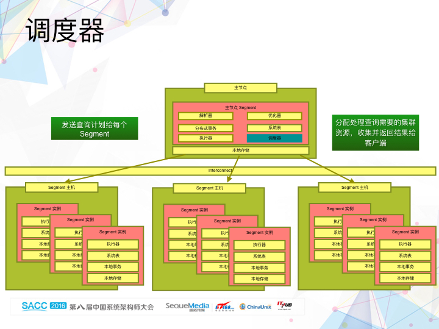    
  
调度器是Greenplum Database在PostgreSQL上新增的一个组件，负责分配处理查询需要的计算资源，将查询计划发送到每个计算节点。在Greenplum Database中，我们称计算节点为Segment节点。前面也提过，每一个Segment实例实际上就是一个PostgreSQL实例。调度器根据优化器生成的查询计划确定执行计划需要的计算资源，然后通过libpg（修改过的libpg协议)协议给每个Segment实例发送连接请求，通过Segment实例上的PostMaster进程fork出前面提到过的QE进程。调度器同时负责这些fork出来的QE进程的整个生命周期。  
  
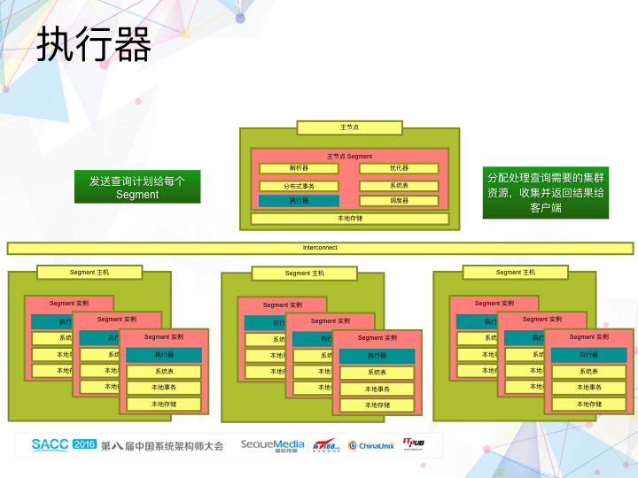    
  
每个QE进程接收到从调度器发送过来的查询计划之后，通过执行器执行分配给自己的任务。除了增加一个新的称谓Motion的操作节点（负责不同QE进程间的数据交换）之外，总体上看，Greenplum Database的执行器跟PostgreSQL的执行器差别不大。  
  
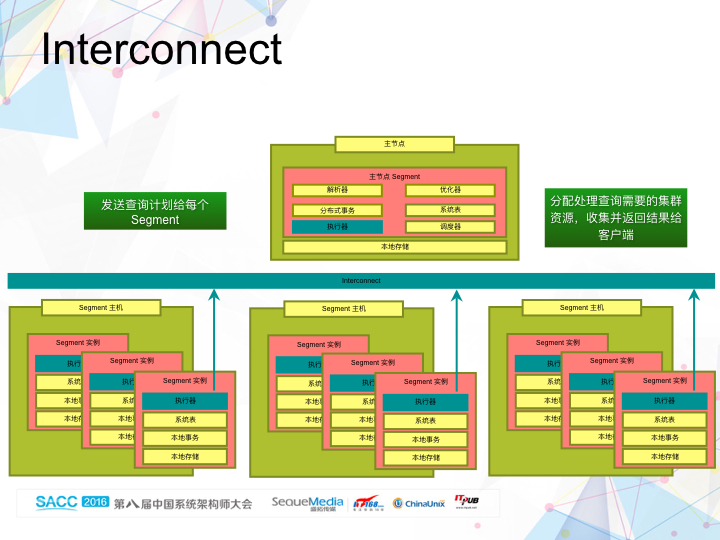    
  
MPP数据库在执行查询语句的时候，跟单机数据库的一个重要差别在于，它会涉及到不同计算节点间的数据交换。在Greenplum Database系统架构中，我们引入了Interconnect组件负责数据交换，作用类似于MapReduce中的shuffling阶段。不过与MapReduce基于HTTP协议不一样，Greenplum Database出于数据传输效率和系统扩展性方面的考虑，实现了基于UDP协议的数据交换组件。前面在解析执行器的时候提到，Greenplum Database引入了一个叫Motion的操作节点。Motion操作节点就是通过Interconnect组件在不同的计算节点之间实现数据的重分布。  
  
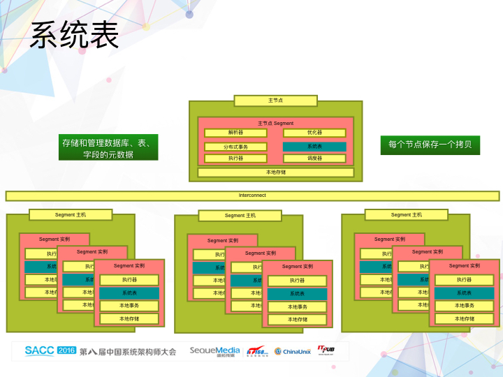    
  
前面讲到的解析器、优化器、调度器、执行器和Interconnect都是跟计算相关的组件，属于无状态组件。下面我们再看一下跟系统状态相关的组件。首先是，系统表。系统表负责存储和管理数据库、表、字段等元数据。主节点上面的系统表是全局数据库对象的元数据，称为全局系统表；每个Segment实例上也有一份本地数据库对象的元数据，称为本地系统表。解析器、优化器、调度器、执行器和Interconenct等无状态组件在运行过程中需要访问系统表信息，决定执行的逻辑。由于系统表分布式地存储在不同的节点中，如何保持系统表中信息的一致性是极具挑战的任务。一旦出现系统表不一致的情况，整个分布式数据库系统是无法正常工作的。  
  
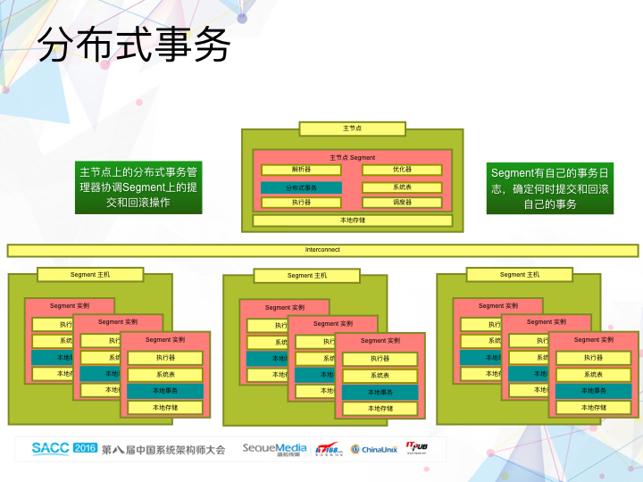    
  
跟很多分布式系统一样，Greenplum Database是通过分布式事务来确保系统信息一致的，更确切地说，通过两阶段提交来确保系统元数据的一致性。主节点上的分布式事务管理器协调Segment节点上的提交和回滚操作。每个Segment实例有自己的事务日志，确定何时提交和回滚自己的事务。本地事务状态保存在本地的事务日志中。  
  
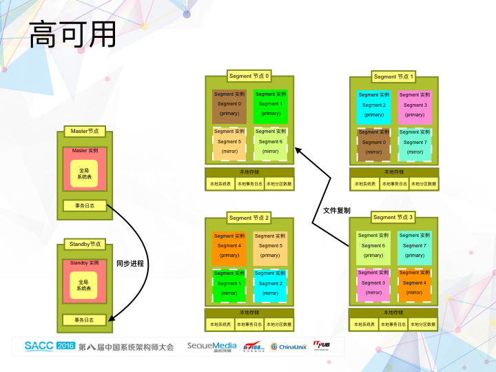    
  
介绍完Greenplum Database的查询组件和系统状态组件后，我们再看看它是如何提供高可用性的。首先是管理节点的高可用。我们采取的方式是，启动一个称为Standby的从主节点作为主节点的备份，通过同步进程同步主节点和Standby节点两者的事务日志，在Standby节点上重做系统表的更新操作，从而实现两者在全局系统表上面的信息同步。当主节点出故障的时候，我们能够切换到Standby节点，系统继续正常工作，从而实现管理节点的高可用。  
  
计算节点高可用性的实现类似于管理节点，但是细节上有些小不同。每个Segment实例都会有另外一个Segment实例作为备份。处于正常工作状态的Segment实例我们称为Primary，它的备份称为Mirror。不同于管理节点日志重放方式，计算节点的高可用是通过文件复制。对于每一个Segment实例，它的状态以文件的形式保存在本地存储介质中。这些本地状态可以分成三大类：本地系统表、本地事务日志和本地表分区数据。通过以文件复制的方式保证Primary和Mirror之间的状态一致，我们能够实现计算节点的高可用。  
  
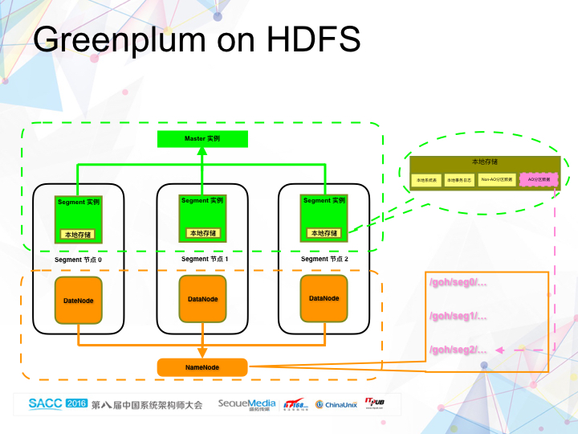    
  
HAWQ  
Hadoop出现之前，MPP数据库是为数不多的大数据处理技术之一。随着Hadoop的兴起，特别是HDFS的成熟，越来越多的数据被保存在HDFS上面。一个自然的问题出现了：我们怎样才能高效地分析保存在HDFS上面的数据，挖掘其中的价值。4，5年前，SQL-on-Hadoop远没有现在这么火，市场上的解决方案也只有耶鲁大学团队做的Hadapt和Facebook做的Hive，像Impala，Drill，Presto，SparkSQL等都是后来才出现的。而Hadapt和Hive两个产品，在当时无论是易用性还是查询性能方面都差强人意。  
  
我们当时的想法是将Greenplum Database跟HDFS结合起来。与其他基于connector连接器的方式不同，我们希望让HDFS，而不是本地存储，成为MPP数据库的数据持久层。这就是后来的Apache HAWQ项目。但在当时，我们把它叫做Greenplum on Hadoop，其实更准确的说法应该是，Greenplum on HDFS。当时的想法非常简单，就是将Greenplum Database和HDFS部署在同一个物理机器集群中，同时将Greenplum Database中的Append-only表的数据放到HDFS上面。Append-only表指的是只能追加，不能更新和删除的表，这是因为HDFS本身只能Append的属性决定的。  
  
除了Append-only表之外，Greenplum Database还支持Heap表，这是一种能够支持增删改查的表类型。结合前面提到的Segment实例的本地状态，我们可以将本地存储分成四大类：系统表、日志、Append-only表分区数据和非Append-only表分区数据。我们将其中的Append-only表分区数据放到了HDFS上面。每个Segment实例对应一个HDFS的目录，非常直观。其它三类数据还是保存在本地的磁盘中。  
  
总体上说，相对于传统的Greenplum Database， Greenplum on HDFS架构上并没有太多的改动，只是将一部分数据从本地存储放到了HDFS上面，但是每个Segment实例还是需要通过本地存储保存本地状态数据。所以，从高可用性的角度看，我们还是需要为每个实例提供备份，只是需要备份的数据少了，因为Append-only表的数据现在我们是通过HDFS本身的高可用性提供的。  
  
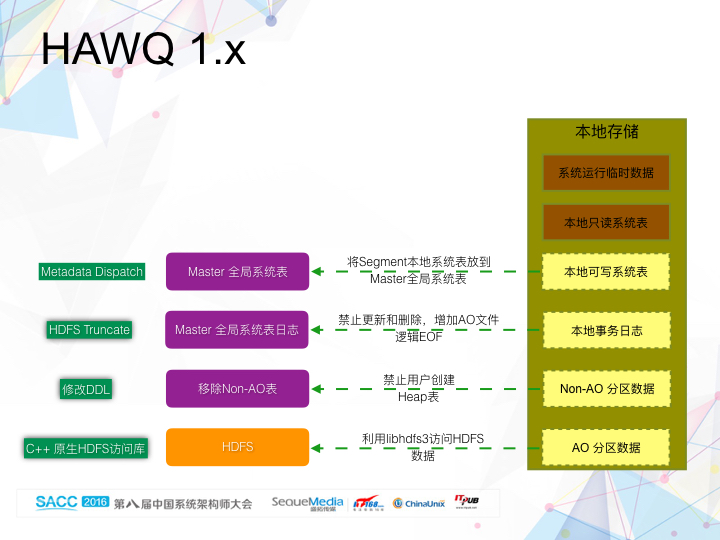    
  
Greenplum on HDFS作为一个原型系统，验证了MPP数据库和HDFS是可以很好地整合起来工作的。基于这个原型系统，我们开始将它当成一个真正的产品来打造，也就是后来的HAWQ。  
  
从Greenplum on HDFS到HAWQ，我们主要针对本地存储做了系统架构上的调整。我们希望将计算节点的本地状态彻底去掉。本地状态除了前面提到的系统表（系统表又可以细分成只读系统表（系统完成初始化后不会再发生更改的元数据，主要是数据库内置的数据类型和函数）和可写系统表（主要是通过DDL语句对元数据的修改，如创建新的数据库和表））、事务日志、Append-only表分区数据和非Append-only表分区数据，同时还有系统在执行查询过程中产生的临时数据，如外部排序时用到的临时文件。其中临时数据和本地只读系统表的数据都是不需要持久化的。我们需要考虑的是如何在Segment节点上面移除另外四类状态数据。  
  
Append-only表分区数据前面已经提到过，交给HDFS处理。为了提高访问HDFS的效率，我们没有采用Hadoop自动的HDFS访问接口，而是用C++实现了原生的HDFS访问库，libhdfs3。针对非Append-only表数据的问题，我们的解决方案就比较简单粗暴了：通过修改DDL，我们彻底禁止用户创建Heap表，因为Heap表支持更新和删除。所以，从那时起到现在最新的Apache HAWQ，都只支持表数据的追加，不支持更新和删除。没有了表数据的更新和删除，分布式事务就变得非常简单了。通过为每个Append-only表文件对应的元数据增加一列，逻辑EoF，即有效的文件结尾。只要能够保证EoF的正确性，我们就能够保证事务的正确性。而且Append-only表文件的逻辑EoF信息是保存在主节点的全局系统表中的，它的正确性通过主节点的本地事务保证。为了清理Append-only表文件在追加新数据时事务abort造成的脏数据，我们实现了HDFS Truncate功能。  
  
对于本地可写系统表，我们的做法是将Segment实例上面的本地可写系统表放到主节点的全局系统表中。这样主节点就拥有了全局唯一的一份系统表数据。查询执行过程中需要用到的系统元数据，我们通过Metadata Dispatch的方式和查询计划一起分发给每个Segment实例。  
  
    
  
通过上述的一系列策略，我们彻底摆脱了Segment节点的本地状态，也就是实现了无状态Segment。整个系统的高可用性策略就简单了很多，而且也不需要再为Segment节点提供Mirror了，系统的利用率大大提升。  
  
数据的高可用交给了HDFS来保证。当一个Segment节点出故障后，我们可以在任意一台有空闲资源的机器上重新创始化一个新的Segment节点，加入到集群中替代原来出故障的节点，整个集群就能够恢复正常工作。  
  
我们也做到了计算和存储物理上的解耦合，往彻底摆脱传统MPP数据库（例如Greenplum Database）计算和存储紧耦合的目标迈出了有着实质意义的一步。  
  
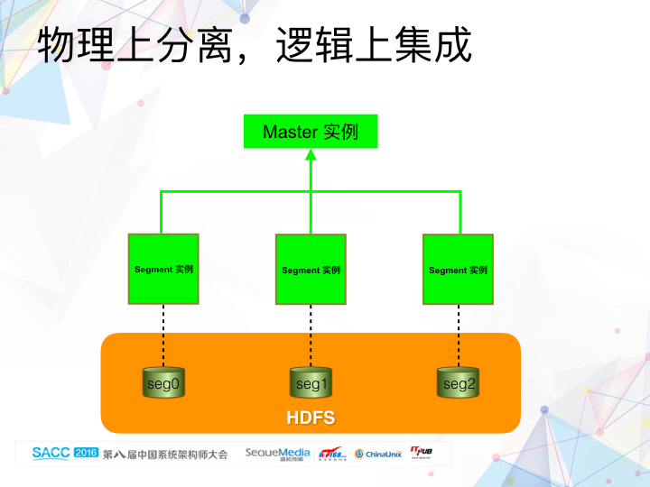    
  
虽然在HAWQ 1.x的阶段，我们做到了计算和存储物理上的分离，但是逻辑上两者还是集成的。原因是，在将本地表分区数据往HDFS上面迁移的时候，为了不改变原来Segment实例的执行逻辑流程，我们为每个Segment指定了一个其专有的HDFS目录，以便跟原来本地数据目录一一对应。每个Segment负责存储和管理的数据都放在其对应的目录的底下，而且该目录底下的文件，也只有它自身能够访问。这种HDFS数据跟计算节点逻辑上的集成关系，使得HAWQ 1.x版本依然没有摆脱传统MPP数据库刚性的并发执行策略：无论查询的复杂度如何，所有的计算节点都需要参与到每条查询的执行中。这意味着，系统执行一条单行插入语句所使用的计算资源，和执行一条对几TB数据进行复杂多表连接和聚合的语句所使用的资源是一样的。这种刚性的并行执行策略，极大地约束了系统的扩展性和吞吐量，同时与Hadoop基于查询复杂度来调度计算资源的弹性策略也是相违背的。  
  
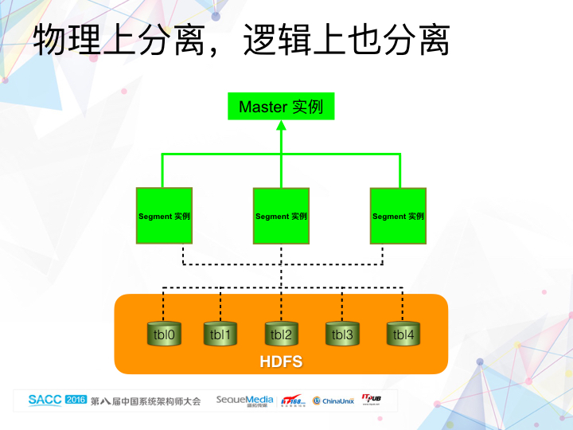    
  
我们决心对HAWQ的系统架构做一次大的调整，使其更加地Hadoop Native，Hadoop原生，而不仅仅是简单地将数据放到HDFS上面。当时，我们内部成为HAWQ 2.0，也就是大家现在在github上面看到的Apache HAWQ。  
  
其中最重要的一步是，我们希望计算和存储不仅物理上分离，逻辑上也是分离。数据库中的用户表数据在HDFS上不再按照每个Segment单独来组织，而是按照全局的数据库对象来组织。举个例子，我们将一张用户表对应的多个数据文件（因为当往该表插入数据的时候，为了提高数据插入的速度，系统会启动了多个QE进程同时往HDFS写数据，每个QE写一个单独文件）放到同一个目录底下，而不是像原来那样，每个QE进程将文件写到自己对应的Segment目录底下。这种改变带来的一个直观结果就是，由于所有文件的数据文件都放一起了，查询执行的时候，根据需要扫描的数据量不同，我们既可以使用一个Segment实例去完成表扫描操作，也可以使用多个Segment实例去做，彻底摆脱了原来只能使用固定个Segment实例来执行查询的刚性并行执行策略。  
  
当然，HDFS数据目录组织的改变只是实现HAWQ 2.0弹性执行引擎的一步，但是却是最重要的一步。计算和存储的彻底分离，使得HAWQ可以像MapReduce一样根据查询的复杂度灵活地调度计算资源，极大地提升了系统的扩展性和吞吐量。  
  
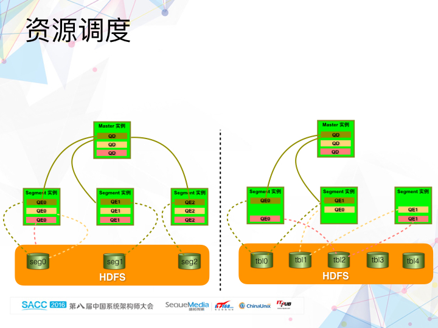    
  
我们简单比较一下HAWQ 1.x和HAWQ 2.0的资源调度。  
  
左边展现的是HAWQ 1.x在同时处理三个查询（分别来自三个不同的会话）时的资源调度情况。与传统的MPP数据库一样，无论查询的复杂度怎样，每个Segment实例都会参与到这条查询的执行中。换句话说，每个Segment实例都会启动一个QE进程处理分配给它的任务。在这种情况下，系统能够支持的并发查询数量，跟集群的计算节点数没有任何关系，完全由一个计算节点决定（这里，我们先不考虑主节点成为瓶颈的问题）。一个4个节点的HAWQ集群能够支持的并发查询数量和一个400个节点的集群是一样的。  
  
右边展现的是HAWQ 2.0在同样并发查询下的资源调度情况。和Hadoop的MapReduce一样，我们能够根据查询的复杂度决定需要调度多少计算资源参与到每条查询的执行中。为了简化阐述，我们这里假设每条查询只需要两个计算资源单元。而且，执行单元可以根据资源管理器的调度算法分配到不同的物理计算节点上面。这两点灵活性：计算资源的数量可变和计算资源的位置可变，正是HAWQ 2.0弹性执行引擎的核心。在这种情况下，系统能够支持的并发查询数量，跟集群的计算节点数量呈线性关系：计算节点越多，系统能够支持的并发查询数量越多（再次提醒，这里，我们先不考虑主节点成为瓶颈的问题）。  
  
所以，可以说，HAWQ 2.0成功解决了传统MPP数据仓库中计算节点首先成为吞吐量瓶颈的问题。同时，由于并不是所有计算节点都需要参与到每条查询的执行中，HAWQ 2.0同时也解决了传统MPP数据库由于单个计算节点性能下降直接影响整个集群性能的问题（这导致MPP集群不能包含太多的计算节点，因为根据概率，集群节点到达一定值后，出现单个计算节点性能下降的概率将会非常高），从而也很大程度上解决了扩展性问题。  
  
云端数据仓库  
  
    
  
通过将计算和存储彻底分离成功解决了计算节点成为系统吞吐量瓶颈的问题后，现在系统的唯一瓶颈就剩下主节点。  
  
如前面提到，主节点的功能主要分成两类：元数据管理，包括系统表存储和管理、锁管理和分布式事务等等，和计算资源调度管理和执行。前者我们可以看成是状态管理，后者是没有状态的组件。通过将状态管理提取出来成为单独一个功能层，我们让主节点跟计算节点一样变得没有状态。这样，我们能够根据系统并发查询的变化，动态增加或者减少主节点的数量。这个设计借鉴了Hadoop YARN的设计，将原来的Job Manager的功能分成了Resource Manager和Application Manager，从而解决Hadoop集群吞吐量的问题。  
  
这是一个云端数据仓库的架构图。其实，我们在HashData希望通过云端数据仓库解决企业用户使用数据仓库时碰到的多种难题，包括商业上和技术上。在这里，我们只关注技术上的。  
  
在这个系统架构中，我们将管理即元数据、计算和存储三者分离了，每一层都能单独动态伸缩，在解决系统吞吐量和扩展性问题的同时，提供了多维度的弹性。  
  
我们利用云平台的对象存储服务，如AWS的S3和青云QingCloud的QingStor，作为系统数据的持久层。除了按需付费的经济特性外，云平台的对象存储服务在可扩展性、稳定性和高可用性等方面远胜于我们自己维护的分布式文件系统（如HDFS）。虽然对象存储的访问延迟远高于本地磁盘访问，但是我们可以通过本地缓存的策略很大程度减轻延迟问题。  
  
同样的，我们利用云平台提供的虚拟机作为我们的计算资源，也能够一定程度上实现资源的隔离，从而保证不同的工作负载之间没有相互影响。  
  
云平台提供的近乎无限的计算和存储资源（相对于数据仓库应用来说），使得云端数据仓库能够存储和处理的数据达到一个全新的高度。  
  
总结  
  
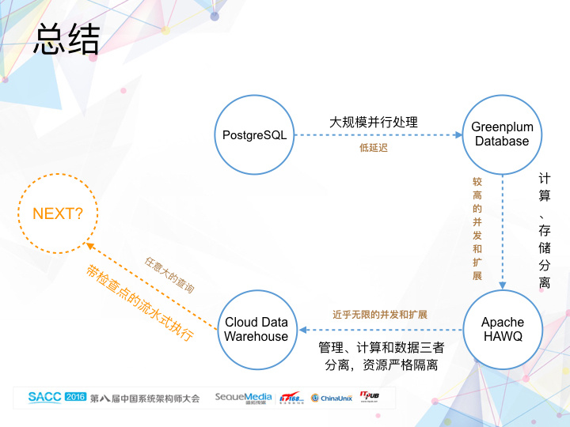    
  
最后，我们做一个简单的总结。从PostgreSQL到Greenplum Database，我们通过大规模并行处理（MPP）技术，实现了处理海量数据时的低延迟目标。从Greenplum Database到Apache HAWQ，通过计算和存储分析的策略，我们提升了系统的并发处理能力和扩展性。从Apache HAWQ到Cloud Data Warehouse，我们借助云平台近乎无限的计算资源和存储资源，以及管理、计算和数据三者分离，还有计算资源严格隔离，我们能够取得近乎无限的并发处理能力和扩展性。  
  
MPP数据库采取的是流水式的执行引擎，中间的每个阶段是不带检查点的。这意味着，只有有一个参与到查询执行的QE进程出错，整条查询将会失败，只能从头开始重新执行这条查询。而我们知道，当参与到查询执行的QE进程达到一定数量的时候，QE进程出错将是必然的，特别是在一个资源共享的环境中。这时候，即使是重新提交查询重跑，失败还是必然的。换句话说，我们几乎无法成功执行需要调度大量计算资源的查询。  
  
展望未来，我们希望实现带检查点的流水式执行引擎，从而使得系统能够处理任意大的查询（单个查询需要同时调度成千上万的计算资源）。  
                         
                                  
  
  
  
  
  
  
  
  
## [digoal's 大量PostgreSQL文章入口](https://github.com/digoal/blog/blob/master/README.md "22709685feb7cab07d30f30387f0a9ae")
  
