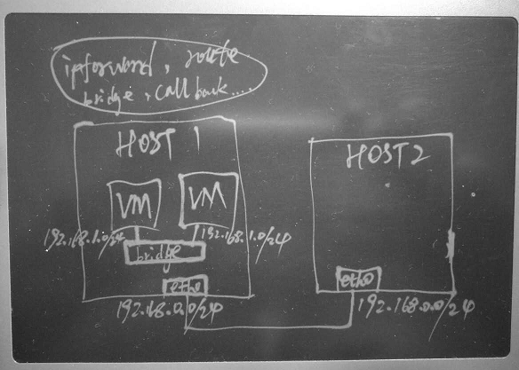

## 用静态路由和ip forward打通虚拟机与其他宿主机
                                              
### 作者                                             
digoal                                              
                                              
### 日期                                             
2016-11-12                                                     
                                              
### 标签                                            
ipforward , linux , kvm , bridge , iptables , route                                                                                
                                              
----                                            
                                              
## 背景   
最近我在做一些测试，用到了虚拟机环境，如图，有多台物理机，其中有一台物理机安装了几个虚拟机。  
  
  
  
物理机之间处于同一网段，可以相互通信。  
  
虚拟机新开了一个网段。  
  
现在的目标是把虚拟机和其他几个物理机的网络打通。  为了不依赖网络层的改动来实现虚拟机和其他物理机网络的打通。  
  
需要用到宿主机的ip forward , brdige call , 以及其他物理机到虚拟机的静态路由。  
  
这样做是最省事的。  
  
虚拟机的部署可参考我另外的几篇文档，都在github。  
  
## 宿主机网桥
安装虚拟机时，宿主机需要一个网桥，网桥有个IP地址，虚拟机的网段与这个IP一致，默认路由指向这个IP，也就是说虚拟机不管到哪里的包都丢给网桥的IP。  
  
我们的目的是让宿主机在收到发往虚拟机网段的包时，不至于丢掉，而是forward给网桥。  
  
路由的话是两端的，现在虚拟机知道出去的路，那么其他物理主机则需要知道如何到达虚拟机，这样一来一回路就通了。  
  
所以其他物理主机需要配置到虚拟机网段的路由即可。  
  
另外还需要考虑防火墙的干扰，最好测试时清掉防火墙。  
  
环境信息  
  
```
宿主机网桥
#brctl show
bridge name     bridge id               STP enabled     interfaces
virbr0          8000.525400b57e1e       yes             virbr0-nic  # 网桥
                                                        vnet1  #  虚拟机网卡  

#ip addr show virbr0
7: virbr0: <BROADCAST,MULTICAST,UP,LOWER_UP> mtu 1500 qdisc noqueue state UNKNOWN 
    link/ether 52:54:00:b5:7e:1e brd ff:ff:ff:ff:ff:ff
    inet 192.168.122.1/24 brd 192.168.122.255 scope global virbr0

宿主机网络
#ip addr show bond0
6: bond0: <BROADCAST,MULTICAST,MASTER,UP,LOWER_UP> mtu 1500 qdisc noqueue state UP 
    link/ether 00:8c:fa:f8:72:a2 brd ff:ff:ff:ff:ff:ff
    inet xxx.xxx.xxx.183/22 brd xxx.xxx.xxx.255 scope global bond0

宿主机路由
#ip route show
192.168.122.0/24 dev virbr0  proto kernel  scope link  src 192.168.122.1 
xxx.xxx.xxx.0/22 dev bond0  proto kernel  scope link  src xxx.xxx.xxx.183 
default via xxx.xxx.xxx.247 dev bond0 
```
  
## 虚拟机网络
```
[root@localhost ]# ifconfig
eth0      Link encap:Ethernet  HWaddr 00:16:3E:AD:89:A7  
          inet addr:192.168.122.102  Bcast:192.168.123.255  Mask:255.255.252.0
          inet6 addr: fe80::216:3eff:fead:89a7/64 Scope:Link
          UP BROADCAST RUNNING MULTICAST  MTU:1500  Metric:1
          RX packets:821250 errors:0 dropped:0 overruns:0 frame:0
          TX packets:474489 errors:0 dropped:0 overruns:0 carrier:0
          collisions:0 txqueuelen:1000 
          RX bytes:6710421970 (6.2 GiB)  TX bytes:40348286 (38.4 MiB)

[root@localhost ]# ip route
192.168.120.0/22 dev eth0  proto kernel  scope link  src 192.168.122.102 
169.254.0.0/16 dev eth0  scope link  metric 1002 
default via 192.168.122.1 dev eth0 
```
  
## 宿主机配置
需要打开ipforward，同时需要打开bridge call，关闭防火墙  
  
```
sysctl -a|grep bridge
net.bridge.bridge-nf-call-arptables = 1
net.bridge.bridge-nf-call-iptables = 1
net.bridge.bridge-nf-call-ip6tables = 1

sysctl -a|grep forward
net.ipv4.conf.all.forwarding = 1
net.ipv4.conf.all.mc_forwarding = 0
net.ipv4.conf.default.forwarding = 1
net.ipv4.conf.default.mc_forwarding = 0
net.ipv4.conf.lo.forwarding = 1
net.ipv4.conf.lo.mc_forwarding = 0
net.ipv4.conf.eth0.forwarding = 1
net.ipv4.conf.eth0.mc_forwarding = 0
net.ipv4.conf.eth1.forwarding = 1
net.ipv4.conf.eth1.mc_forwarding = 0
net.ipv4.conf.eth2.forwarding = 1
net.ipv4.conf.eth2.mc_forwarding = 0
net.ipv4.conf.eth3.forwarding = 1
net.ipv4.conf.eth3.mc_forwarding = 0
net.ipv4.conf.bond0.forwarding = 1
net.ipv4.conf.bond0.mc_forwarding = 0
net.ipv4.conf.virbr0.forwarding = 1
net.ipv4.conf.virbr0.mc_forwarding = 0
net.ipv4.conf.virbr0-nic.forwarding = 1
net.ipv4.conf.virbr0-nic.mc_forwarding = 0
net.ipv4.conf.vnet1.forwarding = 1
net.ipv4.conf.vnet1.mc_forwarding = 0
net.ipv4.ip_forward = 1

iptables -F
service iptables stop
```
  
## 需要与虚拟机通信的其他物理机
其他的物理机，配置静态路由到虚拟机网段192.168.122.0/24的包发给虚拟机所在的宿主机即可。  
  
```
#ip route add 192.168.122.0/24 via xxx.xxx.xxx.183 dev bond0
```
  
## 其他
在实际的环境中，如果要搭建虚拟机云环境的话，通常宿主机需要多个网卡，一些网卡给网桥，一些网卡给管理设备。  
  
交换机使用TRUNC口，这样在宿主机的虚拟交换机内就可以跑VPN了，达到隔离虚拟机网络的效果。  
  
可以参考我之前写的关于容器的文章，有介绍到网络这块。  
                         
                                      
  
<a rel="nofollow" href="http://info.flagcounter.com/h9V1"  ></a>  
  
  
  
  
  
  
## [digoal's 大量PostgreSQL文章入口](https://github.com/digoal/blog/blob/master/README.md "22709685feb7cab07d30f30387f0a9ae")
  
