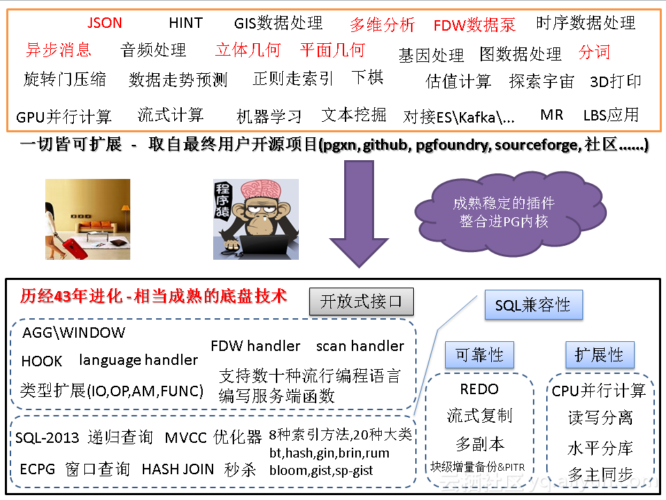
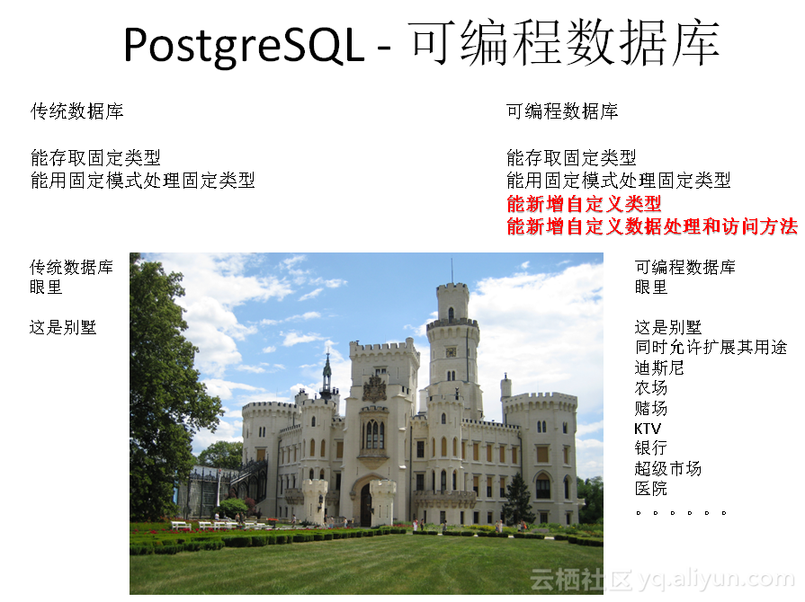
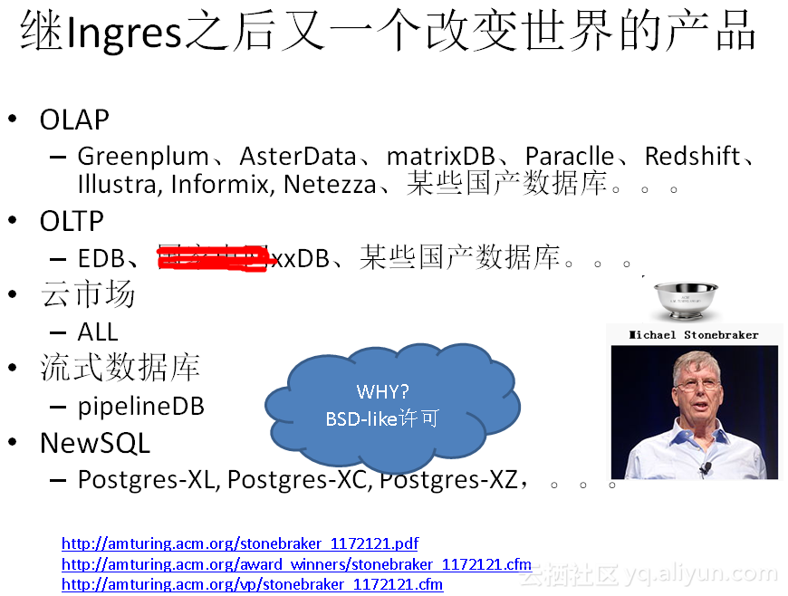

## 聊一聊双十一背后的技术 - 分词和搜索
##### [TAG 15](../class/15.md)
                                              
### 作者                                             
digoal                                              
                                              
### 日期                                             
2016-11-14                                                     
                                              
### 标签                                            
PostgreSQL , 分词 , 全文索引 , rum , 搜索引擎 , 双十一 , tsvector , tsquery                                                                                      
                                              
----                                            
                         
## 背景
2016双十一刚过，大伙还在忙着收快递，我也没有闲着，总结一些双十一背后的数据库技术。   
  
本文将要给大家分享的是 双十一背后的 搜索和分词 相关技术。   
  
我曾经写过一些类似的话题，可以参考如下，有幸帮助不少朋友解决了一些业务场景的问题。      
  
[《PostgreSQL 全文检索加速 填补搜索引擎无法满足的功能》](../201610/20161019_01.md)    
  
[《在PostgreSQL中实现按拼音、汉字、拼音首字母搜索的例子》](20161109_01.md)   
  
[《如何加快PostgreSQL词库装载速度》](https://yq.aliyun.com/articles/58007)  
  
[《PostgreSQL 文本数据分析实践之 - 相似度分析》](https://yq.aliyun.com/articles/59212)  
  
[《PostgreSQL 实现按 任意字段 检索》](https://yq.aliyun.com/articles/58006)  
  
[《PostgreSQL 行级 全文检索》](https://yq.aliyun.com/articles/30858)  
  
[《如何用PostgreSQL解决一个人工智能语义去重的小问题》](https://yq.aliyun.com/articles/25899)  
  
[《使用阿里云PostgreSQL zhparser时不可不知的几个参数》](https://yq.aliyun.com/articles/7730)  
  
[《PostgreSQL · 特性介绍 · 全文搜索介绍》](https://yq.aliyun.com/articles/189)  
  
[《PostgreSQL 百亿数据 秒级响应 正则及模糊查询》](https://yq.aliyun.com/articles/7444)  
  
[《中文模糊查询性能优化 by PostgreSQL trgm》](https://yq.aliyun.com/articles/39033)  
  
PostgreSQL数据库在搜索领域有着非常不错的口碑。就如它在GIS领域一样，已经耕耘了多年，处于行业领先的地位。      
  
9.6 ts search 加入了phrase功能（指包含了距离信息的lexemes），同时支持rank计算匹配系数，用PG社区核心Committer Oleg的话说，这次不小心打开了潘多拉魔盒，可想而知它的"牛逼"程度。     
  
## 全文检索类型
全文检索分为两个数据类型，一个是分词，一个是查询词组合。  
  
https://www.postgresql.org/docs/9.6/static/datatype-textsearch.html  
  
1\. 分词类型  
  
就是将字符串，根据选择的分词配置规则，转换为分词的类型，你可以理解为一堆被抽象出来的lexeme。  
  
例子  
  
```
postgres=> select * from pg_ts_config;
  cfgname   | cfgnamespace | cfgowner | cfgparser 
------------+--------------+----------+-----------
 simple     |           11 |       10 |      3722
 danish     |           11 |       10 |      3722
 dutch      |           11 |       10 |      3722
 english    |           11 |       10 |      3722
 finnish    |           11 |       10 |      3722
 french     |           11 |       10 |      3722
 german     |           11 |       10 |      3722
 hungarian  |           11 |       10 |      3722
 italian    |           11 |       10 |      3722
 norwegian  |           11 |       10 |      3722
 portuguese |           11 |       10 |      3722
 romanian   |           11 |       10 |      3722
 russian    |           11 |       10 |      3722
 spanish    |           11 |       10 |      3722
 swedish    |           11 |       10 |      3722
 turkish    |           11 |       10 |      3722
(16 rows)

分词转换  :后面是位置信息。  
postgres=> select to_tsvector('english', 'Hi i''m digoal, a pger, are you pger?');
            to_tsvector             
------------------------------------
 'digoal':4 'hi':1 'm':3 'pger':6,9
(1 row)

被过滤的都是stop words，即没有意义的词. 例如i, an , a ,am ,yes ,no等（可以自定义）。  
```
    
2\. 查询词组类型    
    
这个很好理解，就是你要查啥.  例如我要查postgresql，或者我要查postgresql 或 mysql。   
   
例子, 同样需要指定配置，对其进行lexeme判断，过滤。  可以组合任意你要查的词组。  
  
```
postgres=> select to_tsquery('a');
NOTICE:  text-search query contains only stop words or doesn't contain lexemes, ignored
 to_tsquery 
------------
 
(1 row)

postgres=> select to_tsquery('english', 'mysql|postgresql');
       to_tsquery       
------------------------
 'mysql' | 'postgresql'
(1 row)

postgres=> select to_tsquery('english', 'mysql&postgresql');
       to_tsquery       
------------------------
 'mysql' & 'postgresql'
(1 row)

postgres=> select to_tsquery('english', 'mysql&postgresql|abc');
           to_tsquery           
--------------------------------
 'mysql' & 'postgresql' | 'abc'
(1 row)

postgres=> select to_tsquery('english', '(mysql&postgresql)|abc');
           to_tsquery           
--------------------------------
 'mysql' & 'postgresql' | 'abc'
(1 row)

postgres=> select to_tsquery('english', 'mysql&(postgresql|abc)');
             to_tsquery             
------------------------------------
 'mysql' & ( 'postgresql' | 'abc' )
(1 row)
```
  
tsquery还支持前缀查询哦，例如    
  
```
postgres=> select to_tsquery('english', 'postgres:*' );
 to_tsquery 
------------
 'postgr':*
(1 row)

表示postgr开头的lexeme。  
```
  
对于tsvector，它还有段落或权重的概念例如正文，标题，副标题。一共分4级，A,B,C,D，可以标示对应的lexeme出现在哪个层面的哪个位置。  
  
Lexemes that have positions can further be labeled with a weight, which can be A, B, C, or D. D is the default and hence is not shown on output:  
  
```
SELECT 'a:1A fat:2B,4C cat:5D'::tsvector;
          tsvector          
----------------------------
 'a':1A 'cat':5 'fat':2B,4C
```
    
## 全文检索类型操作符
前面讲的是数据类型，接下来我们讲讲这个数据类型的操作符，就像数字有加减乘除一样，分词类型有匹配，包含，叠加，相邻等操作符。  
  
  
  
例子  
  
```
分词字段是否包含了需要查找的词组
to_tsvector('fat cats ate rats') @@ to_tsquery('cat & rat')
 return 
true


将两个分词字段的内容合并
'a:1 b:2'::tsvector || 'c:1 d:2 b:3'::tsvector
  return
'a':1 'b':2,5 'c':3 'd':4


将两个查询词组的内容执行与操作
'fat | rat'::tsquery && 'cat'::tsquery
  return
( 'fat' | 'rat' ) & 'cat'


将两个查询词组的内容执行或操作
'fat | rat'::tsquery || 'cat'::tsquery
  return
( 'fat' | 'rat' ) | 'cat'


not 查询词组的内容
!! 'cat'::tsquery
  return
!'cat'


表示两个相邻的查询词组，这个很牛逼哦，是9.6新加的，例如hello world和hello digoal world，如果搜索hello <-> world时，前者能匹配，后者不行。 利用了位置信息。  
to_tsquery('fat') <-> to_tsquery('rat')
  return
'fat' <-> 'rat'

postgres=> select to_tsvector('english', 'Hi i''m digoal, a pger, are you pger?') @@ to_tsquery($$'digoal' <-> 'pger'$$);
 ?column? 
----------
 f
(1 row)

postgres=> select to_tsvector('english', 'Hi i''m digoal, a pger, are you pger?');
            to_tsvector             
------------------------------------
 'digoal':4 'hi':1 'm':3 'pger':6,9
(1 row)

postgres=> select to_tsvector('english', 'hello world');
     to_tsvector     
---------------------
 'hello':1 'world':2
(1 row)

postgres=> select to_tsvector('english', 'hello world') @@ to_tsquery($$'hello' <-> 'world'$$);
 ?column? 
----------
 t
(1 row)

postgres=> select to_tsvector('english', 'hello world') @@ to_tsquery($$'world' <-> 'hello'$$);
 ?column? 
----------
 f
(1 row)

postgres=> select to_tsvector('english', 'hello world') @@ to_tsquery($$'world' & 'hello'$$);
 ?column? 
----------
 t
(1 row)


两个词组字段的包含关系
'cat'::tsquery @> 'cat & rat'::tsquery
  return
false

'cat'::tsquery <@ 'cat & rat'::tsquery
  return
true
```
  
## 全文检索类型函数
这个部分是tsvector或tsquery类型的数据库内置函数，支持很多常用的功能。  
  
例如  
  
将数组转换为分词类型、获取当前的tsconfig（如english, chinese,...）、获取分词字段的长度（元素lexeme个数）、将字符串转换为查询词组、将phrase转换为查询词组（带有位置信息）。  
  
表格  
  
Function|	Return Type|	Description|	Example|	Result
---|---|---|---|---
array_to_tsvector(text[])|	tsvector|	convert array of lexemes to tsvector|	array_to_tsvector('{fat,cat,rat}'::text[])|	'cat' 'fat' 'rat'
get_current_ts_config()|	regconfig|	get default text search configuration|	get_current_ts_config()|	english
length(tsvector)|	integer|	number of lexemes in tsvector|	length('fat:2,4 cat:3 rat:5A'::tsvector)|	3
numnode(tsquery)|	integer|	number of lexemes plus operators in tsquery|	numnode('(fat & rat) &#124; cat'::tsquery)|	5
plainto_tsquery([ config regconfig , ] query text)|	tsquery|	produce tsquery ignoring punctuation|	plainto_tsquery('english', 'The Fat Rats')|	'fat' & 'rat'
phraseto_tsquery([ config regconfig , ] query text)|	tsquery|	produce tsquery that searches for a phrase, ignoring punctuation|	phraseto_tsquery('english', 'The Fat Rats')|	'fat' <-> 'rat'
querytree(query tsquery)|	text|	get indexable part of a tsquery|	querytree('foo & ! bar'::tsquery)|	'foo'
setweight(vector tsvector, weight "char")|	tsvector|	assign weight to each element of vector|	setweight('fat:2,4 cat:3 rat:5B'::tsvector, 'A')|	'cat':3A 'fat':2A,4A 'rat':5A
setweight(vector tsvector, weight "char", lexemes text[])|	tsvector|	assign weight to elements of vector that are listed in lexemes|	setweight('fat:2,4 cat:3 rat:5B'::tsvector, 'A', '{cat,rat}')|	'cat':3A 'fat':2,4 'rat':5A
strip(tsvector)|	tsvector|	remove positions and weights from tsvector|	strip('fat:2,4 cat:3 rat:5A'::tsvector)|	'cat' 'fat' 'rat'
to_tsquery([ config regconfig , ] query text)|	tsquery|	normalize words and convert to tsquery|	to_tsquery('english', 'The & Fat & Rats')|	'fat' & 'rat'
to_tsvector([ config regconfig , ] document text)|	tsvector|	reduce document text to tsvector|	to_tsvector('english', 'The Fat Rats')|	'fat':2 'rat':3
ts_delete(vector tsvector, lexeme text)|	tsvector|	remove given lexeme from vector|	ts_delete('fat:2,4 cat:3 rat:5A'::tsvector, 'fat')|	'cat':3 'rat':5A
ts_delete(vector tsvector, lexemes text[])|	tsvector|	remove any occurrence of lexemes in lexemes from vector|	ts_delete('fat:2,4 cat:3 rat:5A'::tsvector, ARRAY['fat','rat'])|	'cat':3
ts_filter(vector tsvector, weights "char"[])|	tsvector|	select only elements with given weights from vector|	ts_filter('fat:2,4 cat:3b rat:5A'::tsvector, '{a,b}')|	'cat':3B 'rat':5A
ts_headline([ config regconfig, ] document text, query tsquery [, options text ])|	text|	display a query match|	ts_headline('x y z', 'z'::tsquery)|	```x y <b>z</b>```
ts_rank([ weights float4[], ] vector tsvector, query tsquery [, normalization integer ])|	float4|	rank document for query|	ts_rank(textsearch, query)|	0.818
ts_rank_cd([ weights float4[], ] vector tsvector, query tsquery [, normalization integer ])|	float4|	rank document for query using cover density|	ts_rank_cd('{0.1, 0.2, 0.4, 1.0}', textsearch, query)|	2.01317
ts_rewrite(query tsquery, target tsquery, substitute tsquery)|	tsquery|	replace target with substitute within query|	ts_rewrite('a & b'::tsquery, 'a'::tsquery, 'foo&#124;bar'::tsquery)|	'b' & ( 'foo' &#124; 'bar' )
ts_rewrite(query tsquery, select text)|	tsquery|	replace using targets and substitutes from a SELECT command|	SELECT ts_rewrite('a & b'::tsquery, 'SELECT t,s FROM aliases')|	'b' & ( 'foo' &#124; 'bar' )
tsquery_phrase(query1 tsquery, query2 tsquery)|	tsquery|	make query that searches for query1 followed by query2 (same as <-> operator)|	tsquery_phrase(to_tsquery('fat'), to_tsquery('cat'))|	'fat' <-> 'cat'
tsquery_phrase(query1 tsquery, query2 tsquery, distance integer)|	tsquery|	make query that searches for query1 followed by query2 at maximum distance distance|	tsquery_phrase(to_tsquery('fat'), to_tsquery('cat'), 10)|	'fat' <10> 'cat'
tsvector_to_array(tsvector)|	text[]|	convert tsvector to array of lexemes|	tsvector_to_array('fat:2,4 cat:3 rat:5A'::tsvector)|	{cat,fat,rat}
tsvector_update_trigger()|	trigger|	trigger function for automatic tsvector column update|	CREATE TRIGGER ... tsvector_update_trigger(tsvcol, 'pg_catalog.swedish', title, body)|	
tsvector_update_trigger_column()|	trigger|	trigger function for automatic tsvector column update|	CREATE TRIGGER ... tsvector_update_trigger_column(tsvcol, configcol, title, body)|	
unnest(tsvector, OUT lexeme text, OUT positions smallint[], OUT weights text)|	setof record|	expand a tsvector to a set of rows|	unnest('fat:2,4 cat:3 rat:5A'::tsvector)|	(cat,{3},{D})...
    
一些重要的例子  
  
1\. 这里重点将一下PG9.6加入的phrase转换功能，支持相邻度啦。   
  
例如你要搜索“中国道教文化”，分词后变成了中国 <-> 道教 <-> 文化，他们必须相邻才能匹配。  否则不匹配。   
  
如"中国人口普查，道教占比xx，文化程度xx"，这个分词是不匹配的。  如果你要匹配则可以使用原始的方法使用 中国 & 道教 & 文化 即可。  是不是非常灵活非常赞呢。      
  
```
postgres=# select phraseto_tsquery('hello digoal');
   phraseto_tsquery   
----------------------
 'hello' <-> 'digoal'
(1 row)

postgres=# select phraseto_tsquery('hello digoal zhou');
        phraseto_tsquery         
---------------------------------
 'hello' <-> 'digoal' <-> 'zhou'
(1 row)

postgres=# select plainto_tsquery('hello digoal zhou');
       plainto_tsquery       
-----------------------------
 'hello' & 'digoal' & 'zhou'
(1 row)

postgres=# select plainto_tsquery('hello digoal zhou, this is china');
            plainto_tsquery            
---------------------------------------
 'hello' & 'digoal' & 'zhou' & 'china'
(1 row)

postgres=# select phraseto_tsquery('hello digoal zhou, this is china');
              phraseto_tsquery               
---------------------------------------------
 'hello' <-> 'digoal' <-> 'zhou' <3> 'china'
(1 row)
```
  
2\. 查询词组哪些支持索引搜索    
  
```
querytree('foo & ! bar'::tsquery)  
  
foo支持索引  

!bar不支持索引  
```
  
3\. 添加或消除tsvector的weight（即ABCD）    
  
```
setweight('fat:2,4 cat:3 rat:5B'::tsvector, 'A')  -- 所有lexeme都添加A权重
  
'cat':3A 'fat':2,4 'rat':5A

setweight('fat:2,4 cat:3 rat:5B'::tsvector, 'A', '{cat,rat}')  -- cat,rat添加A权重

'cat':3A 'fat':2,4 'rat':5A

strip('fat:2,4 cat:3 rat:5A'::tsvector)  --  消除权重

'cat' 'fat' 'rat'
```
  
4\. 删除tsvector中指定的lexeme ， 例如 我们知道这些词是没有意义的，可以清除出去。    
  
```
ts_delete('fat:2,4 cat:3 rat:5A'::tsvector, 'fat')	返回	'cat':3 'rat':5A
ts_delete('fat:2,4 cat:3 rat:5A'::tsvector, ARRAY['fat','rat'])	返回	'cat':3
```
  
5\. 根据权重过滤分词，例如 我只看标题和副标题是否匹配（假设标题和副标题的权重为A,B）。     
  
```
ts_filter('fat:2,4 cat:3b rat:5A'::tsvector, '{a,b}')	返回	'cat':3B 'rat':5A
```
  
6\. 黑体表示匹配的词组，这个忒有用了，特别是在展示时。  
  
例如我经常为一些BLOG平台敏感词过滤苦恼，他们也不告诉我哪些敏感词触犯规则了，有了这个，可以很快速的定位到匹配的词。  
  
```
	ts_headline('x y z', 'z'::tsquery)	返回	x y <b>z</b>
```
  
7\. 匹配百分比，应用场景更多，例如，按匹配程度排序，匹配度越高的，排的越前面。  
  
```
ts_rank(textsearch, query)	0.818

select *, ts_rank(fts,to_tsquery('supernovae & x-ray')) as rank 
from apod
where fts  @@ to_tsquery('supernovae & x-ray') 
order by rank desc limit 5;

或者直接使用<=>操作符

select *
from apod
where fts  @@ to_tsquery('supernovae & x-ray') 
order by fts <=> to_tsquery('supernovae & x-ray') desc limit 5;
```
  
由于分词有标题，副标题，正文，段落（即权重）之分，所以它还支持为不同的权重，设置不同的系数，例如    
  
根据你设置的权重，计算匹配度，是不是很有意思呢。    
  
```
设置A,B,C,D的系数为{0.1, 0.2, 0.4, 1.0}

ts_rank_cd('{0.1, 0.2, 0.4, 1.0}', textsearch, query)	返回	2.01317
```
  
8\. 查询词组重写功能，就像SQL REWRITE一样，或者像文本替换功能一样。  
  
```
将a替换为foo|bar    
ts_rewrite('a & b'::tsquery, 'a'::tsquery, 'foo|bar'::tsquery)	返回	'b' & ( 'foo' | 'bar' )

支持批量替换，例如使用QUERY，替换目标为s字段，替换为t。   
SELECT ts_rewrite('a & b'::tsquery, 'SELECT t,s FROM aliases')	返回	'b' & ( 'foo' | 'bar' )
```
  
9\. 计算phrase，转换为tsquery，这里包含了lexeme之间的距离信息。  
  
```
tsquery_phrase(to_tsquery('fat'), to_tsquery('cat'))	返回	'fat' <-> 'cat'    --  制造fat和cat相邻的phrase  

tsquery_phrase(to_tsquery('fat'), to_tsquery('cat'), 10)	返回	'fat' <10> 'cat'   --  制造fat和cat相距10个token(包括被过滤的token)的phrase   
```
  
10\. 将tsvector转换为数组，数组没有位置信息。  
  
```
tsvector_to_array('fat:2,4 cat:3 rat:5A'::tsvector)	返回	{cat,fat,rat}
```
  
11\. 自动更新分词字段，这个太重要了，例如用户更新了文本字段，如何自动更新对应的分词字段呢？    
  
```
两个内置的触发器搞定  
  
CREATE TRIGGER ... tsvector_update_trigger(tsvcol, 'pg_catalog.swedish', title, body)  
  
CREATE TRIGGER ... tsvector_update_trigger_column(tsvcol, configcol, title, body)
```
  
12\. 展开tsvector，转换为多条记录.    
  
```
unnest('fat:2,4 cat:3 rat:5A'::tsvector)	(cat,{3},{D}) ...  
```
  
## 全文检索类型调试函数
例如你添加了字典，添加了分词配置，或者修改了分词的配置，先给看看修改后的分词结果。  
  
因为分词有几个步骤，如将字符串按照字典拆分成tokens，包括位置信息，权重等；然后根据token的属性，以及ts config配置，过滤不必要token；返回tsvector。  
  
使用调试函数可以看到最原始的拆分信息。  
  
https://www.postgresql.org/docs/9.6/static/functions-textsearch.html    
  
例子    
    
Table 9-41. Text Search Debugging Functions  
  
Function|	Return| Type|	Description|	Example	Result
---|---|---|---|---
ts_debug([ config regconfig, ] document text, OUT alias text, OUT description text, OUT token text, OUT dictionaries regdictionary[], OUT dictionary regdictionary, OUT lexemes text[])|	setof record|	test a configuration|	ts_debug('english', 'The Brightest supernovaes')|	(asciiword,"Word, all ASCII",The,{english_stem},english_stem,{}) ...
ts_lexize(dict regdictionary, token text)|	text[]|	test a dictionary|	ts_lexize('english_stem', 'stars')|	{star}
ts_parse(parser_name text, document text, OUT tokid integer, OUT token text)|	setof record|	test a parser|	ts_parse('default', 'foo - bar')|	(1,foo) ...
ts_parse(parser_oid oid, document text, OUT tokid integer, OUT token text)|	setof record|	test a parser|	ts_parse(3722, 'foo - bar')|	(1,foo) ...
ts_token_type(parser_name text, OUT tokid integer, OUT alias text, OUT description text)|	setof record|	get token types defined by parser|	ts_token_type('default')|	(1,asciiword,"Word, all ASCII") ...
ts_token_type(parser_oid oid, OUT tokid integer, OUT alias text, OUT description text)|	setof record|	get token types defined by parser|	ts_token_type(3722)|	(1,asciiword,"Word, all ASCII") ...
ts_stat(sqlquery text, [ weights text, ] OUT word text, OUT ndoc integer, OUT nentry integer)|	setof record|	get statistics of a tsvector column|	ts_stat('SELECT vector from apod')|	(foo,10,15) ...
    
## 索引  
数据库要真正的支持一个数据类型，光有类型和函数是不够的，还需要支持索引，否则不能称为支持这种数据类型。  
  
PostgreSQL的分词是支持索引的，包括GIN, GiST, SP-Gist可选。  
  
用法很简单，例子  
  
```
create table test(id serial primary key, content text, ts tsvector);
  
create index idx_test_ts on test using gin (ts);

select * from test where ts @@ to_tsquery('english', 'hello <-> digoal');  -- 这样的查询就可以走索引了
```
  
## 多国语言分词
PostgreSQL支持自定义字典，分词配置。    
    
中文分词当然也很容易添加进来，例如网上就有很多添加中文分词的方法。   
  
https://github.com/fxsjy/jieba  
  
https://github.com/jaiminpan/pg_scws  
  
或者你可以试用一下阿里云的RDS PostgreSQL产品，包含了zhparser分词。  
  
## 模糊查询
分词和模糊查询属于两类需求，模糊查询是分词覆盖不到的场景，例如用户输入规则表达式进行查询，或者输入前后模糊的条件进行查询，它可以匹配到分词无法匹配到的文本。    
    
分词只能做到前缀，不能做到前后模糊，或者正则表达式模糊。  
```
postgres=# select to_tsquery('postgresql:*');
   to_tsquery   
----------------
 'postgresql':*
(1 row)

postgres=# select to_tsquery('postgres:*');
 to_tsquery 
------------
 'postgr':*
(1 row)
```
  
如果有模糊查询的需求，PostgreSQL也能支持索引检索，使用pg_trgm插件即可。  
  
支持相似度的查询，模糊匹配。  
  
```
postgres=# create extension pg_trgm;
CREATE EXTENSION

postgres=# explain select * from tb where info ~ '5821a';  -- 前后模糊查询
                                 QUERY PLAN                                   
----------------------------------------------------------------------------  
 Bitmap Heap Scan on tb  (cost=103.75..3677.71 rows=1000 width=9)  
   Recheck Cond: (info ~ '5821a'::text)  
   ->  Bitmap Index Scan on idx_tb_2  (cost=0.00..103.50 rows=1000 width=0)  
         Index Cond: (info ~ '5821a'::text)  
(4 rows)  
Time: 0.647 ms  

postgres=# explain (analyze,verbose,timing,costs,buffers) select * from t_split where info ~ '^33.+7.+9$' limit 10;  -- 正则查询，老牛逼啊。  
                                                           QUERY PLAN                                                              
---------------------------------------------------------------------------------------------------------------------------------  
 Limit  (cost=43.75..80.78 rows=10 width=57) (actual time=19.573..21.212 rows=10 loops=1)  
   Output: id, crt_time, sensorid, sensorloc, info, c1, c2, c3, c4, c5, c6, c7, c8  
   Buffers: shared hit=566  
   ->  Bitmap Heap Scan on public.t_split  (cost=43.75..3746.56 rows=1000 width=57) (actual time=19.571..21.206 rows=10 loops=1)  
         Output: id, crt_time, sensorid, sensorloc, info, c1, c2, c3, c4, c5, c6, c7, c8  
         Recheck Cond: (t_split.info ~ '^33.+7.+9$'::text)  
         Rows Removed by Index Recheck: 647  
         Heap Blocks: exact=552  
         Buffers: shared hit=566  
         ->  Bitmap Index Scan on idx9  (cost=0.00..43.50 rows=1000 width=0) (actual time=11.712..11.712 rows=39436 loops=1)  
               Index Cond: (t_split.info ~ '^33.+7.+9$'::text)  
               Buffers: shared hit=14  
 Planning time: 0.301 ms  
 Execution time: 21.255 ms  
(14 rows)  
Time: 21.995 ms   
```
  
例子参考  
  
http://blog.163.com/digoal@126/blog/static/163877040201191882553803/  
  
https://yq.aliyun.com/articles/7444  
  
https://www.postgresql.org/docs/9.6/static/pgtrgm.html  
    
## 优势
看完前面的介绍，是不是心动了，以前要用搜索引擎解决的问题，或者要用外接插件解决的问题，今天，使用PostgreSQL数据库就可以解决了，性能可以参考文章开头链接的指标。   
   
相比自建外部搜索引擎的优势：  
  
1\. 数据不需要倒来倒去，绝对的实时搜索，提升了效率还节约了成本，数据在库中还能用到数据库的特性，例如关联查询等，还有节约了带宽。  
  
2\. 由于文本和分词都在数据库中，可以保证搜索的一致性。  
  
3\. 没有搜索次数，返回结果记录数的限制，自由度好把控。  
  
4\. 可以自定义lexeme的权重，自定义权重系数，实现更大灵活度的搜索需求。  
  
5\. 支持相似度的排序，可以根据相似度进行搜索。  
  
6\. 支持lexeme的距离系数，可以根据绝对的距离系数匹配查询。  例如 '速度与激情'  转换成查询词条后，'速度 <1> 激情'， 可以正确的精准匹配到这部片子，而不会匹配到'速度很快，很有激情'。  
  
7\. 支持自定义词组，当自带的词组无法满足时，你可以自定义属于自己的词组。  
  
8\. 支持tsvector细粒度可调，参考[《使用阿里云PostgreSQL zhparser时不可不知的几个参数》](https://yq.aliyun.com/articles/7730)  
  
## 其他资料
PostgreSQL是一个历史悠久的数据库产品，起源于伯克利大学，BSD-LIKE许可，非常的人性化，很多产品是基于PG的。  
  
  
   
  
  
  
   
  
  
  
    
如果你对PG感兴趣，可以再了解一下  
    
[《德哥的PostgreSQL私房菜 - 史上最屌PG资料合集》](https://yq.aliyun.com/articles/59251)    
    
     
  
<a rel="nofollow" href="http://info.flagcounter.com/h9V1"  ></a>  
  
  
  
  
  
  
## [digoal's 大量PostgreSQL文章入口](https://github.com/digoal/blog/blob/master/README.md "22709685feb7cab07d30f30387f0a9ae")
  
