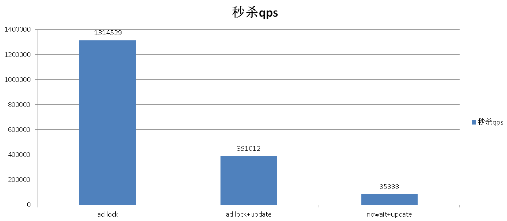

## 聊一聊双十一背后的技术 - 不一样的秒杀技术, 裸秒
##### [TAG 15](../class/15.md)
                                              
### 作者                                             
digoal                                              
                                              
### 日期                                             
2016-11-17                                                     
                                              
### 标签                                            
PostgreSQL , 秒杀 , 裸秒 , ad lock                                                                                      
                                              
----                                            
         
### 双十一背后的技术系列文章
[《聊一聊双十一背后的技术 - 物流, 动态路径规划》](https://yq.aliyun.com/articles/57857)  
  
[《聊一聊双十一背后的技术 - 分词和搜索》](https://yq.aliyun.com/articles/64240)  
  
[《聊一聊双十一背后的技术 - 不一样的秒杀技术, 裸秒》](https://yq.aliyun.com/articles/64351)  
  
## 背景
秒杀在商品交易中是一个永恒的话题，从双十一，到一票难求，比的仅仅是手快吗？   
    
其实对于交易平台来说，面对的不仅仅是人肉，还有很多脚本，外挂自动化的抢购系统，压力可想而知。   
    
秒杀的优化手段很多，就拿数据库来说，有用排队机制的，有用异步消息的，有用交易合并的。   
    
今天我要给大家介绍一种更极端的秒杀应对方法，裸秒。   
  
（其实我很久以前就写过类似的文章，趁双十一跟大伙再练练）   
    
目前可能只有PostgreSQL可以做到裸秒，也即是说，来吧，强奸我吧，一起上。  有点淫荡，但是确实就是这么暴力。   
    
PostgreSQL提供了一种ad lock，可以让用户尽情的释放激情，以一台32核64线程的机器为例，每秒可以获取、探测约130万次的ad lock。    
    
试想一下，对单条记录的秒杀操作，达到了单机100万/s的处理能力后，秒杀算什么？100台机器就能处理1亿/s的秒杀请求，不行我的小心脏受不了了，下面听我娓娓道来。    
    
## 秒杀场景简介
虽然秒杀已经很普遍了，但是出于文章的完整性，还是简单介绍一下秒杀的业务背景。   
    
例如，Iphone的1元秒杀，如果我只放出1台Iphone，我们把它看成一条记录，秒杀开始后，谁先抢到（更新这条记录的锁），谁就算秒杀成功。   
    
对数据库来说，秒杀瓶颈在于并发的对同一条记录的多次更新请求，只有一个或者少量请求是成功的，其他请求是以失败或更新不到记录而告终。   
    
例如有100台IPHONE参与秒杀，并发来抢的用户有100万，对于数据库来说，最小粒度的为行锁，当有一个用户在更新这条记录时，其他的999999个用户是在等待中度过的，以此类推。   
    
除了那100个幸运儿，其他的用户的等待都是无谓的，甚至它们不应该到数据库中来浪费资源。   
    
传统的做法，使用一个标记位来表示这条记录是否已经被更新，或者记录更新的次数（几台Iphone）。    
  
```
update tbl set xxx=xxx,upd_cnt=upd_cnt+1 where id=pk and upd_cnt+1<=5;   -- 假设可以秒杀5台  
```
  
这种方法的弊端：  
  
获得锁的用户在处理这条记录时，可能成功，也可能失败，或者可能需要很长时间，（例如数据库响应慢）在它结束事务前，其他会话只能等着。  
  
等待是非常不科学的，因为对于没有获得锁的用户，等待是在浪费时间。  
  
## 常用的秒杀优化手段
1\. 一般的优化处理方法是先使用for update nowait的方式来避免等待，即如果无法即可获得锁，那么就不等待。  
  
```
begin;
select 1 from tbl where id=pk for update nowait;  --  如果用户无法即刻获得锁，则返回错误。从而这个事务回滚。
update tbl set xxx=xxx,upd_cnt=upd_cnt+1 where id=pk and upd_cnt+1<=5;
end;
```
  
这种方法可以减少用户的等待时间，因为无法即刻获得锁后就直接返回了。  
  
2\. 合并请求，即将多个更新合并到一个更新的请求，这种做法需要修改内核，同时会破坏ACID，因为如果合并后的请求失败了，会导致合并中的所有人的请求失败。（与分组提交不一样，分组提交是不会破坏ACID的）。     
    
那么接下来我们看看AD LOCK。  
  
## 什么是ad lock
手册中的说明，AD LOCK是一种面向用户的轻量级锁，锁的目标是一个整型，分为事务级和会话级的锁，以及共享和排他锁。    
   
在单个DB内，只要锁的整型值不一样，就可以获得锁，如果值一样，可以使用TRY来加锁，没有获得则立即返回FALSE。    
   
https://www.postgresql.org/docs/current/static/functions-admin.html#FUNCTIONS-ADVISORY-LOCKS  
  
Table 9-87. Advisory Lock Functions    
  
Name|   Return Type|    Description
---|---|---
pg_advisory_lock(key bigint)|   void|   Obtain exclusive session level advisory lock
pg_advisory_lock(key1 int, key2 int)|   void|   Obtain exclusive session level advisory lock
pg_advisory_lock_shared(key bigint)|    void|   Obtain shared session level advisory lock
pg_advisory_lock_shared(key1 int, key2 int)|    void|   Obtain shared session level advisory lock
pg_advisory_unlock(key bigint)| boolean|        Release an exclusive session level advisory lock
pg_advisory_unlock(key1 int, key2 int)| boolean|        Release an exclusive session level advisory lock
pg_advisory_unlock_all()|       void    Release| all session level advisory locks held by the current session
pg_advisory_unlock_shared(key bigint)|  boolean|        Release a shared session level advisory lock
pg_advisory_unlock_shared(key1 int, key2 int)|  boolean|        Release a shared session level advisory lock
pg_advisory_xact_lock(key bigint)|      void|   Obtain exclusive transaction level advisory lock
pg_advisory_xact_lock(key1 int, key2 int)|      void|   Obtain exclusive transaction level advisory lock
pg_advisory_xact_lock_shared(key bigint)|       void|   Obtain shared transaction level advisory lock
pg_advisory_xact_lock_shared(key1 int, key2 int)|       void|   Obtain shared transaction level advisory lock
pg_try_advisory_lock(key bigint)|       boolean|        Obtain exclusive session level advisory lock if available
pg_try_advisory_lock(key1 int, key2 int)|       boolean|        Obtain exclusive session level advisory lock if available
pg_try_advisory_lock_shared(key bigint)|        boolean|        Obtain shared session level advisory lock if available
pg_try_advisory_lock_shared(key1 int, key2 int)|        boolean|        Obtain shared session level advisory lock if available
pg_try_advisory_xact_lock(key bigint)|  boolean|        Obtain exclusive transaction level advisory lock if available
pg_try_advisory_xact_lock(key1 int, key2 int)|  boolean|        Obtain exclusive transaction level advisory lock if available
pg_try_advisory_xact_lock_shared(key bigint)|   boolean|        Obtain shared transaction level advisory lock if available
pg_try_advisory_xact_lock_shared(key1 int, key2 int)|   boolean|        Obtain shared transaction level advisory lock if available
    
通常数据库支持的最小粒度的锁（指开放给用户的）是行锁，行锁相比LWLOCK，SPINLOCK等是非常重的，所以传统的行锁在秒杀中会成为非常大的瓶颈，包括锁的等待。    
     
## ad lock的用途
ad lock的用途，除了我接下来要说的秒杀，其实还有很多用途，例如    
  
并发的安全性检查，  
  
递归调用中用于UPSERT的场景，  
  
业务逻辑设计中用来确保原子操作等。   
    
## ad lock的性能指标
因为AD LOCK很轻量化，不需要访问数据，不需要执行冗长的代码，所以很高效。   
    
32核64线程机器测试可以达到131万次/s的锁请求。   
    
```
vi test.sql
\set id random(1,100000000)
select pg_try_advisory_xact_lock(:id);

pgbench -M prepared -n -r -P 1 -f ./test.sql -c 96 -j 96 -T 100

transaction type: ./test.sql
scaling factor: 1
query mode: prepared
number of clients: 96
number of threads: 96
duration: 100 s
number of transactions actually processed: 131516823
latency average = 0.072 ms
latency stddev = 0.070 ms
tps = 1314529.211060 (including connections establishing)
tps = 1315395.309707 (excluding connections establishing)
script statistics:
 - statement latencies in milliseconds:
         0.001  \set id random(1,100000000)
         0.074  select pg_try_advisory_xact_lock(:id);
```
    
## ad lock用于秒杀的例子
在数据库中，商品通常有唯一ID，我们可以对这个ID加锁，（当然，如果对不同的表这个ID有重叠的可能，我们可以加偏移量或者其他的手段来达到无冲突）。    
     
加锁成功才会去对行加锁，执行更新，这样就能规避掉无效的行锁等待，以及冗长的查询代码。    
     
使用 AD LOCK 对单条记录的并发更新处理QPS可以达到39.1万/s，被秒杀的商品很快就会变成售罄状态，不会再浪费数据库的资源。    
     
```
create table test(id int primary key, crt_time timestamp);
insert into test values (1);
```
  
```
vi test.sql
update test set crt_time=now() where id=1 and pg_try_advisory_xact_lock(1);

pgbench -M prepared -n -r -P 1 -f ./test.sql -c 64 -j 64 -T 100

transaction type: ./test.sql
scaling factor: 1
query mode: prepared
number of clients: 64
number of threads: 64
duration: 100 s
number of transactions actually processed: 39104368
latency average = 0.163 ms
latency stddev = 0.216 ms
tps = 391012.743072 (including connections establishing)
tps = 391175.983419 (excluding connections establishing)
script statistics:
 - statement latencies in milliseconds:
         0.163  update test set crt_time=now() where id=1 and pg_try_advisory_xact_lock(1);
```
  
此时数据库主机还有66.2%的空闲CPU资源可用使用。  
```
top - 13:12:43 up 51 days, 18:41,  2 users,  load average: 1.12, 0.97, 0.78
Tasks: 1463 total,  28 running, 1435 sleeping,   0 stopped,   0 zombie
Cpu(s): 24.5%us,  9.3%sy,  0.0%ni, 66.2%id,  0.0%wa,  0.0%hi,  0.0%si,  0.0%st
Mem:  529321832k total, 235226420k used, 294095412k free,   903076k buffers
Swap:        0k total,        0k used,        0k free, 62067636k cached
```
  
### 对比传统的例子
传统的消除等待的做法是这样的，通过select for update nowait。  
  
```
begin;
select 1 from tbl where id=pk for update nowait;  --  如果用户无法即刻获得锁，则返回错误。从而这个事务回滚。
update tbl set xxx=xxx,upd_cnt=upd_cnt+1 where id=pk and upd_cnt+1<=5;
end;
```
  
在PG中，可以使用do语句，把以上合成到一个块里面操作。  
  
使用传统的方法，每秒可以处理8.6万。   
  
```
vi test.sql
do language plpgsql $$ declare begin with t as (select * from test where id=1 for update nowait) update test set crt_time=now() from t where t.id=test.id; exception when others then return; end; $$;

pgbench -M prepared -n -r -P 1 -f ./test.sql -c 64 -j 64 -T 100

transaction type: ./test.sql
scaling factor: 1
query mode: prepared
number of clients: 64
number of threads: 64
duration: 100 s
number of transactions actually processed: 8591222
latency average = 0.744 ms
latency stddev = 0.713 ms
tps = 85888.823884 (including connections establishing)
tps = 85924.666940 (excluding connections establishing)
script statistics:
 - statement latencies in milliseconds:
         0.744  do language plpgsql $$ declare begin with t as (select * from test where id=1 for update nowait) update test set crt_time=now() from t where t.id=test.id; exception when others then return; end; $$;
```
  
CPU剩余54.5%  
  
```
top - 13:13:48 up 51 days, 18:42,  2 users,  load average: 8.14, 2.69, 1.37
Tasks: 1464 total,  21 running, 1442 sleeping,   0 stopped,   1 zombie
Cpu(s): 41.7%us,  3.8%sy,  0.0%ni, 54.5%id,  0.0%wa,  0.0%hi,  0.0%si,  0.0%st
Mem:  529321832k total, 235256052k used, 294065780k free,   903176k buffers
Swap:        0k total,        0k used,        0k free, 62068308k cached
```
    
## 单个商品真实扣减吞吐
测试单个商品的真实扣减吞吐，我们看到QUERY QPS很高，但是真实的扣减当然不会有那么高，因为没有拿到锁就返回了。  
  
```
postgres=# create table upd(id int primary key, cnt int8);
postgres=# insert into upd values(1,0);


vi t0.sql
update upd set cnt=cnt-1 where id=1 and pg_try_advisory_xact_lock(1);
\sleep 10 us

....
vi t7.sql
update upd set cnt=cnt-1 where id=1 and pg_try_advisory_xact_lock(1);
\sleep 80 us


pgbench -M prepared -n -r -P 1 -f t0.sql -f t1.sql -f t2.sql -f t3.sql -f t4.sql -f t5.sql -f t6.sql -f t7.sql -c 64 -j 64 -T 100


postgres=# select * from upd;
 id |   cnt   
----+---------
  1 | -611249
(1 row)
```
    
单个商品，每秒扣减6112.49次，通常参与秒杀的商品，库存都不会很多，通常在一千以内，否则就不叫秒杀了，用户也犯不着来秒杀。  
    
所以这个值是完全满足现实需求的。    
    
## 整个平台所有商品真实扣减吞吐
假设整个平台有1000万商品，测试一下使用这种方法的整体扣减吞吐。    
  
```
postgres=# create table upd(id int primary key, cnt int8);
postgres=# insert into upd select generate_series(1,10000000), 0;


vi test.sql
\set id random(1,10000000)
update upd set cnt=cnt-1 where id=:id and pg_try_advisory_xact_lock(:id);


pgbench -M prepared -n -r -P 1 -f ./test.sql -c 64 -j 64 -T 100

postgres=# select sum(cnt) from upd;
    sum    
-----------
 -27233112
(1 row)
```
  
查看cnt得到真实的扣减情况，整个平台来说，每秒约扣减272331.12个商品，即每秒有27万个商品售出。  
  
## ad lock相比其他秒杀优化的优势
  
  
使用AD LOCK可以使得CPU开销最小化，等待最小化，从本文的测试CASE来看，单条记录的更新可以达到39.1万/s。  
    
传统的手段只能达到8.6万/s。   

使用AD LOCK不破坏ACID，单个请求单个事务，不影响其他的事务。  

合并优化，本质上是破坏了ACID的，如果合并失败，会导致所有相关的请求失败。  
      
如果你对PG感兴趣，可以再了解一下  
    
[《德哥的PostgreSQL私房菜 - 史上最屌PG资料合集》](https://yq.aliyun.com/articles/59251)    
    
     
  
<a rel="nofollow" href="http://info.flagcounter.com/h9V1"  ></a>  
  
  
  
  
  
  
## [digoal's 大量PostgreSQL文章入口](https://github.com/digoal/blog/blob/master/README.md "22709685feb7cab07d30f30387f0a9ae")
  
