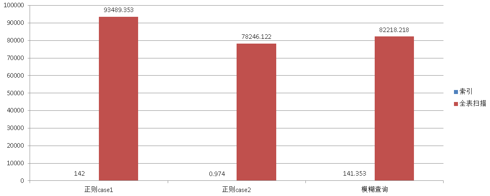

## 聊一聊双十一背后的技术 - 毫秒分词算啥, 试试正则和相似度
##### [TAG 15](../class/15.md)
                                              
### 作者                                             
digoal                                              
                                              
### 日期                                             
2016-11-18                                                     
                                              
### 标签                                            
PostgreSQL , 正则匹配 , 分词 ,  双十一 , rum , trgm , 全文索引 , 搜索引擎 , tsvector , tsquery                                                                                 
                                              
----                                            
         
### 双十一背后的技术系列文章
[《聊一聊双十一背后的技术 - 物流, 动态路径规划》](https://yq.aliyun.com/articles/57857)  
  
[《聊一聊双十一背后的技术 - 分词和搜索》](https://yq.aliyun.com/articles/64240)  
  
[《聊一聊双十一背后的技术 - 强奸式秒杀技术实现》](https://yq.aliyun.com/articles/64351)  
               
## 背景
看刑侦剧经常有看到人物拼图，然后到图库搜索的，以前可能靠的是人肉，今天，使用PG，可以靠数据库的图形近似度搜索功能。  
  
[《弱水三千,只取一瓢,当图像搜索遇见PostgreSQL (Haar wavelet)》](https://yq.aliyun.com/articles/58246)    
  
但是我今天不是写图形搜索，我要写的是文本搜索，文本搜索，大家一定会想到分词。   
      
千万不要以为分词可以搞定一切需求，比如这样的需求就搞不定。   
   
hello world打成了hello word或者hello w0rld，你要让数据库匹配出来，怎么搞？    
   
又或者你的业务需要写正则进行匹配，怎么搞？比如一些域名的查询，www.firefoxcn.org可能你只想输入其中的一个部分来搜索，如果firefox可以匹配。   
   
甚至更变态的 fi[a-z]{1}e.*?\.?? ，这样的查询。   
    
数据量小，并发小时，这种查询是可以忍受全表扫描和CPU处理过滤的。  
  
但是想想一下，你是一个日请求过亿的业务，或者数据量亿级别的，全表扫描和CPU的开销会让你疯掉的。   
  
那么来看看PostgreSQL是如何做到的吧。  
  
PG就像机器猫的百宝箱，里面什么都能找到，一起来召唤。  
  
    
    
## PostgreSQL 如何支持正则?  
在pg_trgm的代码注释中有详细的介绍，分为4个步骤。  
  
1\. 使用PostgreSQL regexp库，将正则转换为NFA样式（图形化词组）。   
  
2\. 将NFA样式再进行转换，转换为扩展的图形样式(trigrams)，包括拆分后的查询词组与NOT词组。    
  
3\. 简化，过滤不必要的trigrams。   
  
4\. 打包为TrgmPackedGraph结构，支持GIN,GIST索引的检索。  
  
## 正则查询、模糊查询例子
新建一张测试表，其中包含一个字符串类型字段，插入5000万随机字符串，要来就来大数据量，数据库可不是玩具。    
  
```
postgres=# create extension pg_trgm; 
postgres=# create table tbl(id int primary key, info text, crt_time timestamp); 
postgres=# insert into tbl select id,md5(random()::text), now() from generate_series(1,50000000) t(id); 
```
    
创建支持正则的索引    
    
```
postgres=# CREATE INDEX trgm_idx_tbl_gin ON tbl USING GIN (info gin_trgm_ops);  
```
   
正则查询例子，刚给一位搞其他数据库产品的同学演示过，被查询速度惊吓到，直接给跪了。      
  
```
postgres=# select * from tbl where info ~ '53?6b.*8823a' limit 10;
    id    |               info               |          crt_time          
----------+----------------------------------+----------------------------
  4587797 | 0b1e56bd258823a9f9338919617651e5 | 2016-11-18 14:43:25.726919
  7269097 | 9d5a7aace4bb56b29fe54cd98823a8ec | 2016-11-18 14:43:25.726919
 11589980 | 3536b69b29b607348823a675cf4842c3 | 2016-11-18 14:43:25.726919
(3 rows)
Time: 142.087 ms
postgres=# explain (analyze,verbose,timing,costs,buffers) select * from tbl where info ~ '53?6b.*8823a' limit 10;
                                                             QUERY PLAN                                                             
------------------------------------------------------------------------------------------------------------------------------------
 Limit  (cost=527.75..537.82 rows=10 width=45) (actual time=140.867..140.902 rows=3 loops=1)
   Output: id, info, crt_time
   Buffers: shared hit=911
   ->  Bitmap Heap Scan on public.tbl  (cost=527.75..5564.25 rows=5000 width=45) (actual time=140.847..140.881 rows=3 loops=1)
         Output: id, info, crt_time
         Recheck Cond: (tbl.info ~ '53?6b.*8823a'::text)
         Rows Removed by Index Recheck: 5
         Heap Blocks: exact=8
         Buffers: shared hit=911
         ->  Bitmap Index Scan on trgm_idx_tbl  (cost=0.00..526.50 rows=5000 width=0) (actual time=140.832..140.832 rows=8 loops=1)
               Index Cond: (tbl.info ~ '53?6b.*8823a'::text)
               Buffers: shared hit=903
 Planning time: 0.389 ms
 Execution time: 140.928 ms
(14 rows)


postgres=# select * from tbl where info ~ 'hello.*[a-f]{1}abc' limit 10;
 id | info | crt_time 
----+------+----------
(0 rows)
Time: 0.974 ms
postgres=# explain (analyze,verbose,timing,costs,buffers) select * from tbl where info ~ 'hello.*[a-f]{1}abc' limit 10;
                                                           QUERY PLAN                                                           
--------------------------------------------------------------------------------------------------------------------------------
 Limit  (cost=852.75..862.82 rows=10 width=45) (actual time=0.451..0.451 rows=0 loops=1)
   Output: id, info, crt_time
   Buffers: shared hit=35
   ->  Bitmap Heap Scan on public.tbl  (cost=852.75..5889.25 rows=5000 width=45) (actual time=0.449..0.449 rows=0 loops=1)
         Output: id, info, crt_time
         Recheck Cond: (tbl.info ~ 'hello.*[a-f]{1}abc'::text)
         Buffers: shared hit=35
         ->  Bitmap Index Scan on trgm_idx_tbl  (cost=0.00..851.50 rows=5000 width=0) (actual time=0.447..0.447 rows=0 loops=1)
               Index Cond: (tbl.info ~ 'hello.*[a-f]{1}abc'::text)
               Buffers: shared hit=35
 Planning time: 0.366 ms
 Execution time: 0.479 ms
(12 rows)
```
  
模糊查询例子(其实正则已经包含了模糊查询，这里只是再展示一下)    
  
```
postgres=# select * from tbl where info ~ '821b8b92' limit 10;
 id |               info               |          crt_time          
----+----------------------------------+----------------------------
  4 | c5132821b8b92ba36487d06b438d8aed | 2016-11-18 14:43:25.726919
(1 row)
Time: 141.353 ms

postgres=# explain (analyze,verbose,timing,costs,buffers) select * from tbl where info ~ '821b8b92' limit 10;
                                                             QUERY PLAN                                                             
------------------------------------------------------------------------------------------------------------------------------------
 Limit  (cost=527.75..537.82 rows=10 width=45) (actual time=140.293..140.299 rows=1 loops=1)
   Output: id, info, crt_time
   Buffers: shared hit=904
   ->  Bitmap Heap Scan on public.tbl  (cost=527.75..5564.25 rows=5000 width=45) (actual time=140.291..140.297 rows=1 loops=1)
         Output: id, info, crt_time
         Recheck Cond: (tbl.info ~ '821b8b92'::text)
         Rows Removed by Index Recheck: 1
         Heap Blocks: exact=2
         Buffers: shared hit=904
         ->  Bitmap Index Scan on trgm_idx_tbl  (cost=0.00..526.50 rows=5000 width=0) (actual time=140.279..140.279 rows=2 loops=1)
               Index Cond: (tbl.info ~ '821b8b92'::text)
               Buffers: shared hit=902
 Planning time: 0.331 ms
 Execution time: 140.323 ms
(14 rows)
```
  
以上例子若全表扫描的耗时(本例未使用PG支持的CPU并行计算)    
  
```
postgres=# select * from tbl where info ~ '53?6b.*8823a' limit 10;
    id    |               info               |          crt_time          
----------+----------------------------------+----------------------------
  4587797 | 0b1e56bd258823a9f9338919617651e5 | 2016-11-18 14:43:25.726919
  7269097 | 9d5a7aace4bb56b29fe54cd98823a8ec | 2016-11-18 14:43:25.726919
 11589980 | 3536b69b29b607348823a675cf4842c3 | 2016-11-18 14:43:25.726919
(3 rows)
Time: 93489.353 ms

postgres=# select * from tbl where info ~ 'hello.*[a-f]{1}abc' limit 10;
 id | info | crt_time 
----+------+----------
(0 rows)
Time: 78246.122 ms

postgres=# select * from tbl where info ~ '821b8b92' limit 10;
 id |               info               |          crt_time          
----+----------------------------------+----------------------------
  4 | c5132821b8b92ba36487d06b438d8aed | 2016-11-18 14:43:25.726919
(1 row)
Time: 82218.218 ms
```
    
    
  
## 索引优化
由于这里GIN索引是对TOKEN做的，一般来说，如果字符串越长，TOKEN就越多，如果索引字段会更新的话，需要优化一下GIN的异步合并，提升更新的性能。  
  
## 其他
### 相似度查询
相似度，其实是指输错了还能匹配，就好比人物拼图，或者回忆录，你总不能每个细节都记得清楚吧，所以相似度匹配的功能就展露头角了。   
    
[《PostgreSQL 文本数据分析实践之 - 相似度分析》](https://yq.aliyun.com/articles/59212)  
  
## 参考  
  
https://www.postgresql.org/docs/9.6/static/sql-createindex.html  
    
```
GIN indexes accept different parameters:

fastupdate
This setting controls usage of the fast update technique described in Section 63.4.1. 
It is a Boolean parameter: ON enables fast update, OFF disables it. 
(Alternative spellings of ON and OFF are allowed as described in Section 19.1.) The default is ON.

gin_pending_list_limit
Custom gin_pending_list_limit parameter. This value is specified in kilobytes.
```
  
## 参考
```
/*-------------------------------------------------------------------------
 *
 * trgm_regexp.c
 *	  Regular expression matching using trigrams.
 *
 * The general idea of trigram index support for a regular expression (regex)
 * search is to transform the regex into a logical expression on trigrams.
 * For example:
 *
 *	 (ab|cd)efg  =>  ((abe & bef) | (cde & def)) & efg
 *
 * If a string matches the regex, then it must match the logical expression on
 * trigrams.  The opposite is not necessarily true, however: a string that
 * matches the logical expression might not match the original regex.  Such
 * false positives are removed via recheck, by running the regular regex match
 * operator on the retrieved heap tuple.
 *
 * Since the trigram expression involves both AND and OR operators, we can't
 * expect the core index machinery to evaluate it completely.  Instead, the
 * result of regex analysis is a list of trigrams to be sought in the index,
 * plus a simplified graph that is used by trigramsMatchGraph() to determine
 * whether a particular indexed value matches the expression.
 *
 * Converting a regex to a trigram expression is based on analysis of an
 * automaton corresponding to the regex.  The algorithm consists of four
 * stages:
 *
 * 1) Compile the regexp to NFA form.  This is handled by the PostgreSQL
 *	  regexp library, which provides accessors for its opaque regex_t struct
 *	  to expose the NFA state graph and the "colors" (sets of equivalent
 *	  characters) used as state transition labels.
 *
 * 2) Transform the original NFA into an expanded graph, where arcs
 *	  are labeled with trigrams that must be present in order to move from
 *	  one state to another via the arcs.  The trigrams used in this stage
 *	  consist of colors, not characters, as in the original NFA.
 *
 * 3) Expand the color trigrams into regular trigrams consisting of
 *	  characters.  If too many distinct trigrams are produced, trigrams are
 *	  eliminated and the graph is simplified until it's simple enough.
 *
 * 4) Finally, the resulting graph is packed into a TrgmPackedGraph struct,
 *	  and returned to the caller.
 *
 * 1) Compile the regexp to NFA form
 * ---------------------------------
 * The automaton returned by the regexp compiler is a graph where vertices
 * are "states" and arcs are labeled with colors.  Each color represents
 * a set of characters, so that all characters assigned to the same color
 * are interchangeable, so far as matching the regexp is concerned.  There
 * are two special states: "initial" and "final".  A state can have multiple
 * outgoing arcs labeled with the same color, which makes the automaton
 * non-deterministic, because it can be in many states simultaneously.
 *
 * Note that this NFA is already lossy compared to the original regexp,
 * since it ignores some regex features such as lookahead constraints and
 * backref matching.  This is OK for our purposes since it's still the case
 * that only strings matching the NFA can possibly satisfy the regexp.
 *
 * 2) Transform the original NFA into an expanded graph
 * ----------------------------------------------------
 * In the 2nd stage, the automaton is transformed into a graph based on the
 * original NFA.  Each state in the expanded graph represents a state from
 * the original NFA, plus a prefix identifying the last two characters
 * (colors, to be precise) seen before entering the state.  There can be
 * multiple states in the expanded graph for each state in the original NFA,
 * depending on what characters can precede it.  A prefix position can be
 * "unknown" if it's uncertain what the preceding character was, or "blank"
 * if the character was a non-word character (we don't need to distinguish
 * which non-word character it was, so just think of all of them as blanks).
 *
 * For convenience in description, call an expanded-state identifier
 * (two prefix colors plus a state number from the original NFA) an
 * "enter key".
 *
 * Each arc of the expanded graph is labelled with a trigram that must be
 * present in the string to match.  We can construct this from an out-arc of
 * the underlying NFA state by combining the expanded state's prefix with the
 * color label of the underlying out-arc, if neither prefix position is
 * "unknown".  But note that some of the colors in the trigram might be
 * "blank".  This is OK since we want to generate word-boundary trigrams as
 * the regular trigram machinery would, if we know that some word characters
 * must be adjacent to a word boundary in all strings matching the NFA.
 *
 * The expanded graph can also have fewer states than the original NFA,
 * because we don't bother to make a separate state entry unless the state
 * is reachable by a valid arc.  When an enter key is reachable from a state
 * of the expanded graph, but we do not know a complete trigram associated
 * with that transition, we cannot make a valid arc; instead we insert the
 * enter key into the enterKeys list of the source state.  This effectively
 * means that the two expanded states are not reliably distinguishable based
 * on examining trigrams.
 *
 * So the expanded graph resembles the original NFA, but the arcs are
 * labeled with trigrams instead of individual characters, and there may be
 * more or fewer states.  It is a lossy representation of the original NFA:
 * any string that matches the original regexp must match the expanded graph,
 * but the reverse is not true.
 *
 * We build the expanded graph through a breadth-first traversal of states
 * reachable from the initial state.  At each reachable state, we identify the
 * states reachable from it without traversing a predictable trigram, and add
 * those states' enter keys to the current state.  Then we generate all
 * out-arcs leading out of this collection of states that have predictable
 * trigrams, adding their target states to the queue of states to examine.
 *
 * When building the graph, if the number of states or arcs exceed pre-defined
 * limits, we give up and simply mark any states not yet processed as final
 * states.  Roughly speaking, that means that we make use of some portion from
 * the beginning of the regexp.  Also, any colors that have too many member
 * characters are treated as "unknown", so that we can't derive trigrams
 * from them.
 *
 * 3) Expand the color trigrams into regular trigrams
 * --------------------------------------------------
 * The trigrams in the expanded graph are "color trigrams", consisting
 * of three consecutive colors that must be present in the string. But for
 * search, we need regular trigrams consisting of characters. In the 3rd
 * stage, the color trigrams are expanded into regular trigrams. Since each
 * color can represent many characters, the total number of regular trigrams
 * after expansion could be very large. Because searching the index for
 * thousands of trigrams would be slow, and would likely produce so many
 * false positives that we would have to traverse a large fraction of the
 * index, the graph is simplified further in a lossy fashion by removing
 * color trigrams. When a color trigram is removed, the states connected by
 * any arcs labelled with that trigram are merged.
 *
 * Trigrams do not all have equivalent value for searching: some of them are
 * more frequent and some of them are less frequent. Ideally, we would like
 * to know the distribution of trigrams, but we don't. But because of padding
 * we know for sure that the empty character is more frequent than others,
 * so we can penalize trigrams according to presence of whitespace. The
 * penalty assigned to each color trigram is the number of simple trigrams
 * it would produce, times the penalties[] multiplier associated with its
 * whitespace content. (The penalties[] constants were calculated by analysis
 * of some real-life text.) We eliminate color trigrams starting with the
 * highest-penalty one, until we get to a total penalty of no more than
 * WISH_TRGM_PENALTY. However, we cannot remove a color trigram if that would
 * lead to merging the initial and final states, so we may not be able to
 * reach WISH_TRGM_PENALTY. It's still okay so long as we have no more than
 * MAX_TRGM_COUNT simple trigrams in total, otherwise we fail.
 *
 * 4) Pack the graph into a compact representation
 * -----------------------------------------------
 * The 2nd and 3rd stages might have eliminated or merged many of the states
 * and trigrams created earlier, so in this final stage, the graph is
 * compacted and packed into a simpler struct that contains only the
 * information needed to evaluate it.
 *
 * ALGORITHM EXAMPLE:
 *
 * Consider the example regex "ab[cd]".  This regex is transformed into the
 * following NFA (for simplicity we show colors as their single members):
 *
 *					  4#
 *					c/
 *		 a	   b	/
 *	 1* --- 2 ---- 3
 *					\
 *					d\
 *					  5#
 *
 * We use * to mark initial state and # to mark final state. It's not depicted,
 * but states 1, 4, 5 have self-referencing arcs for all possible characters,
 * because this pattern can match to any part of a string.
 *
 * As the result of stage 2 we will have the following graph:
 *
 *		  abc	 abd
 *	 2# <---- 1* ----> 3#
 *
 * The process for generating this graph is:
 * 1) Create state 1 with enter key (UNKNOWN, UNKNOWN, 1).
 * 2) Add key (UNKNOWN, "a", 2) to state 1.
 * 3) Add key ("a", "b", 3) to state 1.
 * 4) Create new state 2 with enter key ("b", "c", 4).  Add an arc
 *	  from state 1 to state 2 with label trigram "abc".
 * 5) Mark state 2 final because state 4 of source NFA is marked as final.
 * 6) Create new state 3 with enter key ("b", "d", 5).  Add an arc
 *	  from state 1 to state 3 with label trigram "abd".
 * 7) Mark state 3 final because state 5 of source NFA is marked as final.
 *
 *-------------------------------------------------------------------------
 */
```
                  
     
  
<a rel="nofollow" href="http://info.flagcounter.com/h9V1"  ></a>  
  
  
  
  
  
  
## [digoal's 大量PostgreSQL文章入口](https://github.com/digoal/blog/blob/master/README.md "22709685feb7cab07d30f30387f0a9ae")
  
