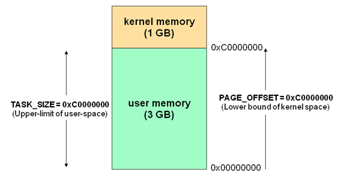
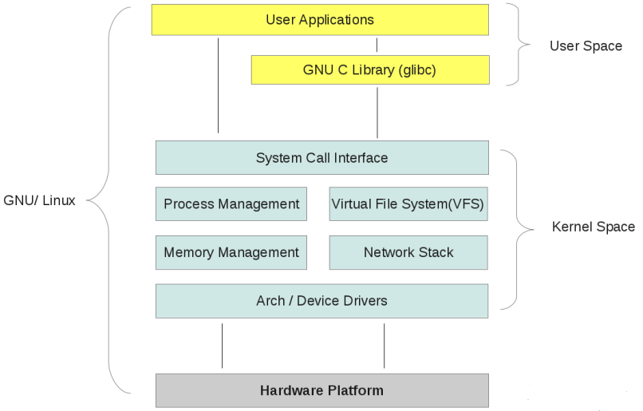

## 转载 - 用户空间与内核空间，进程上下文与中断上下文[总结]  
                                                
### 作者                                               
digoal                                                
                                                
### 日期                                               
2016-11-20                                                    
                                                
### 标签                                              
Linux , 用户空间 , 内核空间 , 用户态 , 内核态 , 进程上下文 , 中断上下文                                                                                            
                                                
----                                              
           
## 背景  
原文    
    
http://www.cnblogs.com/Anker/p/3269106.html    
    
## 1、前言  
最近在学习linux内核方面的知识，经常会看到用户空间与内核空间及进程上下文与中断上下文。  
  
看着很熟悉，半天又说不出到底是怎么回事，有什么区别。  
  
看书过程经常被感觉欺骗，似懂非懂的感觉，很是不爽，今天好好结合书和网上的资料总结一下，加深理解。  
  
## 2、用户空间与内核空间　　  
我们知道现在操作系统都是采用虚拟存储器，那么对32位操作系统而言，它的寻址空间（虚拟存储空间）为4G（2的32次方）。  
  
操作系统的核心是内核，独立于普通的应用程序，可以访问受保护的内存空间，也有访问底层硬件设备的所有权限。为了保证用户进程不能直接操作内核，保证内核的安全，操作系统将虚拟空间划分为两部分，一部分为内核空间，一部分为用户空间。  
  
针对linux操作系统而言，将最高的1G字节（从虚拟地址0xC0000000到0xFFFFFFFF），供内核使用，称为内核空间，而将较低的3G字节（从虚拟地址0x00000000到0xBFFFFFFF），供各个进程使用，称为用户空间。  
  
每个进程可以通过系统调用进入内核，因此，Linux内核由系统内的所有进程共享。于是，从具体进程的角度来看，每个进程可以拥有4G字节的虚拟空间。空间分配如下图所示：  
  
      
  
有了用户空间和内核空间，整个linux内部结构可以分为三部分，从最底层到最上层依次是：硬件-->内核空间-->用户空间。  
  
如下图所示：  
  
      
  
### 需要注意的细节问题：  
1\. 内核空间中存放的是内核代码和数据，而进程的用户空间中存放的是用户程序的代码和数据。不管是内核空间还是用户空间，它们都处于虚拟空间中。   
  
2\. Linux使用两级保护机制：0级供内核使用，3级供用户程序使用。  
  
### 内核态与用户态：  
  
1\. 当一个任务（进程）执行系统调用而陷入内核代码中执行时，称进程处于内核运行态（内核态）。  
  
此时处理器处于特权级最高的（0级）内核代码中执行。当进程处于内核态时，执行的内核代码会使用当前进程的内核栈。每个进程都有自己的内核栈。  
  
2\. 当进程在执行用户自己的代码时，则称其处于用户运行态（用户态）。此时处理器在特权级最低的（3级）用户代码中运行。  
  
当正在执行用户程序而突然被中断程序中断时，此时用户程序也可以象征性地称为处于进程的内核态。因为中断处理程序将使用当前进程的内核栈。  
  
### 参考资料：  
http://blog.csdn.net/f22jay/article/details/7925531  
  
http://blog.csdn.net/zhangskd/article/details/6956638  
  
http://blog.chinaunix.net/uid-26838492-id-3162146.html  
  
## 3、进程上下文与中断上下文  
我在看《linux内核设计与实现》这本书的第三章进程管理时候，看到进程上下文。  
  
书中说当一个程序执行了系统调用或者触发某个异常（软中断），此时就会陷入内核空间，内核此时代表进程执行，并处于进程上下文中。  
  
看后还是没有弄清楚，什么是进程上下文，如何上google上面狂搜一把，总结如下：  
  
程序在执行过程中通常有用户态和内核态两种状态，CPU对处于内核态根据上下文环境进一步细分，因此有了下面三种状态：  
  
1\. 内核态，运行于进程上下文，内核代表进程运行于内核空间。  
  
2\. 内核态，运行于中断上下文，内核代表硬件运行于内核空间。  
  
3\. 用户态，运行于用户空间。  
  
### 上下文 context  
上下文简单说来就是一个环境。  
  
用户空间的应用程序，通过系统调用，进入内核空间。  
  
这个时候用户空间的进程要传递 很多变量、参数的值给内核，内核态运行的时候也要保存用户进程的一些寄存 器值、变量等。  
  
所谓的“进程上下文”，可以看作是用户进程传递给内核的这些参数以及内核要保存的那一整套的变量和寄存器值和当时的环境等。  
  
相对于进程而言，就是进程执行时的环境。具体来说就是各个变量和数据，包括所有的寄存器变量、进程打开的文件、内存信息等。  
  
一个进程的上下文可以分为三个部分:用户级上下文、寄存器上下文以及系统级上下文。  
  
1\. 用户级上下文: 正文、数据、用户堆栈以及共享存储区；  
  
2\. 寄存器上下文: 通用寄存器、程序寄存器(IP)、处理器状态寄存器(EFLAGS)、栈指针(ESP)；  
  
3\. 系统级上下文: 进程控制块task_struct、内存管理信息(mm_struct、vm_area_struct、pgd、pte)、内核栈。  
  
当发生进程调度时，进行进程切换就是上下文切换(context switch). 操作系统必须对上面提到的全部信息进行切换，新调度的进程才能运行。  
  
而系统调用进行的模式切换(mode switch)。模式切换与进程切换比较起来，容易很多，而且节省时间，因为模式切换最主要的任务只是切换进程寄存器上下文的切换。  
  
硬件通过触发信号，导致内核调用中断处理程序，进入内核空间。这个过程中，硬件的 一些变量和参数也要传递给内核，内核通过这些参数进行中断处理。  
  
所谓的“ 中断上下文”，其实也可以看作就是硬件传递过来的这些参数和内核需要保存的一些其他环境（主要是当前被打断执行的进程环境）。  
  
中断时，内核不代表任何进程运行，它一般只访问系统空间，而不会访问进程空间，内核在中断上下文中执行时一般不会阻塞。  
  
### 摘录Linux注释的内容如下
  
```  
Process Context  
-------------------------------------------  
One of the most important parts of a process is the executing program code. 

This code is read in from an executable file and executed within the program's address space. 

Normal program execution occurs in user-space. 

When a program executes a system call or triggers an exception, it enters kernel-space. 

At this point, the kernel is said to be "executing on behalf of the process" and is in process context. 

When in process context, the current macro is valid[7].

Upon exiting the kernel, the process resumes execution in user-space, 
unless a higher-priority process has become runnable in the interim(过渡期), 
in which case the scheduler is invoked to select the higher priority process.  
  
Other than process context there is interrupt context, In interrupt context, 
the system is not running on behalf of a process, but is executing an interrupt handler. 

There is no process tied to interrupt handlers and consequently no process context.   
  
System calls and exception handlers are well-defined interfaces into the kernel. 

A process can begin executing in kernel-space only through one of these interfaces -- 
all access to the kernel is through these interfaces.  
  
-------------------------------------------  
  
Interrupt Context  
-------------------------------------------  
When executing an interrupt handler or bottom half, the kernel is in interrupt context.

Recall that process context is the mode of operation the kernel is in while it is executing on behalf of a process -- 
for example, executing a system call or running a kernel thread. 

In process context, the current macro points to the associated task. 

Furthermore, because a process is coupled to the kernel in process context(因为进程是以进程上文的形式连接到内核中的), 
process context can sleep or otherwise invoke the scheduler.  
  
Interrupt context, on the other hand, is not associated with a process. 

The current macro is not relevant (although it points to the interrupted process). 

Without a backing process(由于没有进程的背景),interrupt context cannot sleep -- 
how would it ever reschedule?(否则怎么再对它重新调度?) 

Therefore, you cannot call certain functions from interrupt context. 

If a function sleeps, you cannot use it from your interrupt handler -- 
this limits the functions that one can call from an interrupt handler.(这是对什么样的函数可以在中断处理程序中使用的限制)  
  
Interrupt context is time critical because the interrupt handler interrupts other code. 

Code should be quick and simple. Busy looping is discouraged. 

This is a very important point; always keep in mind that your interrupt handler has 
interrupted other code (possibly even another interrupt handler on a different line!). 

Because of this asynchronous nature, it is imperative(必须) that all interrupt handlers be as quick and as simple as possible. 

As much as possible, work should be pushed out from the interrupt handler and performed in a bottom half, 
which runs at a more convenient time.  
  
The setup of an interrupt handler's stacks is a configuration option. 

Historically, interrupt handlers did not receive(拥有) their own stacks. 

Instead, they would share the stack of the process that they interrupted[1]. 

The kernel stack is two pages in size; 

typically, that is 8KB on 32-bit architectures and 16KB on 64-bit architectures. 

Because in this setup interrupt handlers share the stack, they must be 
exceptionally frugal(必须非常节省) with what data they allocate there. 

Of course, the kernel stack is limited to begin with, so all kernel code should be cautious.  
  
A process is always running. When nothing else is schedulable, the idle task runs.   
  
-------------------------------------------  
```  
    
LINUX完全注释中的一段话：  
  
当一个进程在执行时,CPU的所有寄存器中的值、进程的状态以及堆栈中的内容被称为该进程的上下文。  
  
当内核需要切换到另一个进程时，它需要保存当前进程的所有状态，即保存当前进程的上下文，以便在再次执行该进程时，能够必得到切换时的状态执行下去。  
  
在LINUX中，当前进程上下文均保存在进程的任务数据结构中。在发生中断时,内核就在被中断进程的上下文中，在内核态下执行中断服务例程。  
  
但同时会保留所有需要用到的资源，以便中继服务结束时能恢复被中断进程的执行。    
  
## 参考资料  
http://www.cnblogs.com/hustcat/articles/1505618.html  
  
http://mprc.pku.edu.cn/~zhengyansong/blog/?p=199  
  
http://blog.chinaunix.net/uid-26980210-id-3235544.html  
  
  
       
       
  
<a rel="nofollow" href="http://info.flagcounter.com/h9V1"  ></a>  
  
  
  
  
  
  
## [digoal's 大量PostgreSQL文章入口](https://github.com/digoal/blog/blob/master/README.md "22709685feb7cab07d30f30387f0a9ae")
  
