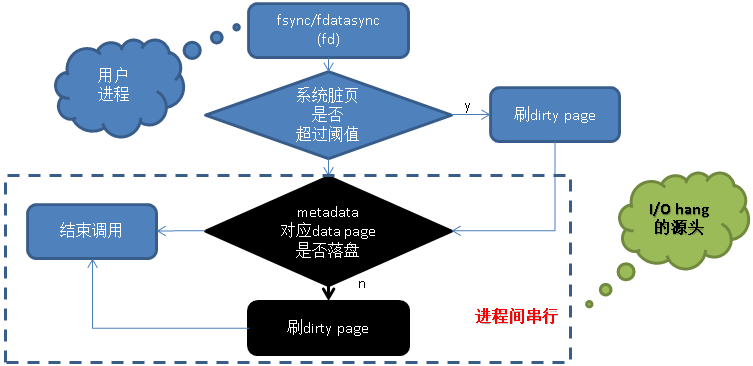

## PostgreSQL on Linux 最佳部署手册 - 珍藏级 
##### [TAG 24](../class/24.md)
                                                        
### 作者                                                       
digoal                                                        
                                                        
### 日期                                                       
2016-11-21                                                            
                                                        
### 标签                                                      
Linux , PostgreSQL , Install , 最佳部署                                                                                                           
                                                        
----                                                      
                   
## 背景          
数据库的安装一直以来都挺复杂的，特别是Oracle，现在身边都还有安装Oracle数据库赚外快的事情。    
  
PostgreSQL其实安装很简单，但是那仅仅是可用，并不是好用。很多用户使用默认的方法安装好数据库之后，然后测试一通性能，发现性能不行就不用了。    
   
原因不用说，多方面没有优化的结果。   
  
PostgreSQL数据库为了适应更多的场景能使用，默认的参数都设得非常保守，通常需要优化，比如检查点，SHARED BUFFER等。   
  
本文将介绍一下PostgreSQL on Linux的最佳部署方法，其实在我的很多文章中都有相关的内容，但是没有总结成一篇文档。  
  
## OS与硬件认证检查
目的是确认服务器与OS通过certification  
  
Intel Xeon v3和v4的cpu,能支持的RHEL的最低版本是不一样的,  
  
详情请见:https://access.redhat.com/support/policy/intel  
  
Intel Xeon v3和v4的cpu,能支持的Oracle Linux 的最低版本是不一样的,  
  
详情请见:http://linux.oracle.com/pls/apex/f?p=117:1  
  
第一:RedHat生态系统--来自RedHat的认证列表https://access.redhat.com/ecosystem  
  
第二:Oracle Linux 对服务器和存储的硬件认证列表 http://linux.oracle.com/pls/apex/f?p=117:1  
    
## 安装常用包
```
# yum -y install coreutils glib2 lrzsz mpstat dstat sysstat e4fsprogs xfsprogs ntp readline-devel zlib-devel openssl-devel pam-devel libxml2-devel libxslt-devel python-devel tcl-devel gcc make smartmontools flex bison perl-devel perl-ExtUtils* openldap-devel jadetex  openjade bzip2
```
  
## 配置OS内核参数
1\. sysctl

注意某些参数，根据内存大小配置（已说明）

含义详见  
  
[《DBA不可不知的操作系统内核参数》](../201608/20160803_01.md)  

```
# vi /etc/sysctl.conf

# add by digoal.zhou
fs.aio-max-nr = 1048576
fs.file-max = 76724600
kernel.core_pattern= /data01/corefiles/core_%e_%u_%t_%s.%p         
# /data01/corefiles事先建好，权限777，如果是软链接，对应的目录修改为777
kernel.sem = 4096 2147483647 2147483646 512000    
# 信号量, ipcs -l 或 -u 查看，每16个进程一组，每组信号量需要17个信号量。
kernel.shmall = 107374182      
# 所有共享内存段相加大小限制(建议内存的80%)
kernel.shmmax = 274877906944   
# 最大单个共享内存段大小(建议为内存一半), >9.2的版本已大幅降低共享内存的使用
kernel.shmmni = 819200         
# 一共能生成多少共享内存段，每个PG数据库集群至少2个共享内存段
net.core.netdev_max_backlog = 10000
net.core.rmem_default = 262144       
# The default setting of the socket receive buffer in bytes.
net.core.rmem_max = 4194304          
# The maximum receive socket buffer size in bytes
net.core.wmem_default = 262144       
# The default setting (in bytes) of the socket send buffer.
net.core.wmem_max = 4194304          
# The maximum send socket buffer size in bytes.
net.core.somaxconn = 4096
net.ipv4.tcp_max_syn_backlog = 4096
net.ipv4.tcp_keepalive_intvl = 20
net.ipv4.tcp_keepalive_probes = 3
net.ipv4.tcp_keepalive_time = 60
net.ipv4.tcp_mem = 8388608 12582912 16777216
net.ipv4.tcp_fin_timeout = 5
net.ipv4.tcp_synack_retries = 2
net.ipv4.tcp_syncookies = 1    
# 开启SYN Cookies。当出现SYN等待队列溢出时，启用cookie来处理，可防范少量的SYN攻击
net.ipv4.tcp_timestamps = 1    
# 减少time_wait
net.ipv4.tcp_tw_recycle = 0    
# 如果=1则开启TCP连接中TIME-WAIT套接字的快速回收，但是NAT环境可能导致连接失败，建议服务端关闭它
net.ipv4.tcp_tw_reuse = 1      
# 开启重用。允许将TIME-WAIT套接字重新用于新的TCP连接
net.ipv4.tcp_max_tw_buckets = 262144
net.ipv4.tcp_rmem = 8192 87380 16777216
net.ipv4.tcp_wmem = 8192 65536 16777216
net.nf_conntrack_max = 1200000
net.netfilter.nf_conntrack_max = 1200000
vm.dirty_background_bytes = 409600000       
#  系统脏页到达这个值，系统后台刷脏页调度进程 pdflush（或其他） 自动将(dirty_expire_centisecs/100）秒前的脏页刷到磁盘
vm.dirty_expire_centisecs = 3000             
#  比这个值老的脏页，将被刷到磁盘。3000表示30秒。
vm.dirty_ratio = 95                          
#  如果系统进程刷脏页太慢，使得系统脏页超过内存 95 % 时，则用户进程如果有写磁盘的操作（如fsync, fdatasync等调用），则需要主动把系统脏页刷出。
#  有效防止用户进程刷脏页，在单机多实例，并且使用CGROUP限制单实例IOPS的情况下非常有效。  
vm.dirty_writeback_centisecs = 100            
#  pdflush（或其他）后台刷脏页进程的唤醒间隔， 100表示1秒。
vm.mmap_min_addr = 65536
vm.overcommit_memory = 0     
#  在分配内存时，允许少量over malloc, 如果设置为 1, 则认为总是有足够的内存，内存较少的测试环境可以使用 1 .  
vm.overcommit_ratio = 90     
#  当overcommit_memory = 2 时，用于参与计算允许指派的内存大小。
vm.swappiness = 0            
#  关闭交换分区
vm.zone_reclaim_mode = 0     
# 禁用 numa, 或者在vmlinux中禁止. 
net.ipv4.ip_local_port_range = 40000 65535    
# 本地自动分配的TCP, UDP端口号范围
fs.nr_open=20480000
# 单个进程允许打开的文件句柄上限

# 以下参数请注意
# vm.extra_free_kbytes = 4096000
# vm.min_free_kbytes = 2097152
# 如果是小内存机器，以上两个值不建议设置
# vm.nr_hugepages = 66536    
#  建议shared buffer设置超过64GB时 使用大页，页大小 /proc/meminfo Hugepagesize
# vm.lowmem_reserve_ratio = 1 1 1
# 对于内存大于64G时，建议设置，否则建议默认值 256 256 32
```

2\. 生效配置

```
sysctl -p
```
  
## 配置OS资源限制
```
# vi /etc/security/limits.conf

# nofile超过1048576的话，一定要先将sysctl的fs.nr_open设置为更大的值，并生效后才能继续设置nofile.

* soft    nofile  1024000
* hard    nofile  1024000
* soft    nproc   unlimited
* hard    nproc   unlimited
* soft    core    unlimited
* hard    core    unlimited
* soft    memlock unlimited
* hard    memlock unlimited
```
  
最好在关注一下/etc/security/limits.d目录中的文件内容，会覆盖limits.conf的配置。    
  
已有进程的ulimit请查看/proc/pid/limits，例如

```
Limit                     Soft Limit           Hard Limit           Units     
Max cpu time              unlimited            unlimited            seconds   
Max file size             unlimited            unlimited            bytes     
Max data size             unlimited            unlimited            bytes     
Max stack size            10485760             unlimited            bytes     
Max core file size        0                    unlimited            bytes     
Max resident set          unlimited            unlimited            bytes     
Max processes             11286                11286                processes 
Max open files            1024                 4096                 files     
Max locked memory         65536                65536                bytes     
Max address space         unlimited            unlimited            bytes     
Max file locks            unlimited            unlimited            locks     
Max pending signals       11286                11286                signals   
Max msgqueue size         819200               819200               bytes     
Max nice priority         0                    0                    
Max realtime priority     0                    0                    
Max realtime timeout      unlimited            unlimited            us
```

如果你要启动其他进程，建议退出SHELL再进一遍，确认ulimit环境配置已生效，再启动。

## 配置OS防火墙
（建议按业务场景设置，我这里先清掉）     
  
```
iptables -F
```
  
配置范例   
   
```
# 私有网段
-A INPUT -s 192.168.0.0/16 -j ACCEPT
-A INPUT -s 10.0.0.0/8 -j ACCEPT
-A INPUT -s 172.16.0.0/16 -j ACCEPT
```
  
## selinux
如果没有这方面的需求，建议禁用  
  
```
# vi /etc/sysconfig/selinux 

SELINUX=disabled
SELINUXTYPE=targeted
```
  
## 关闭不必要的OS服务
```
chkconfig --list|grep on  
关闭不必要的,例如 
chkconfig iscsi off
```
  
## 部署文件系统
注意SSD对齐，延长寿命，避免写放大。  
  
```
parted -s /dev/sda mklabel gpt
parted -s /dev/sda mkpart primary 1MiB 100%
```
  
格式化(如果你选择ext4的话)  
  
```
mkfs.ext4 /dev/sda1 -m 0 -O extent,uninit_bg -E lazy_itable_init=1 -T largefile -L u01
```
  
建议使用的ext4 mount选项  
  
```
# vi /etc/fstab

LABEL=u01 /u01     ext4        defaults,noatime,nodiratime,nodelalloc,barrier=0,data=writeback    0 0

# mkdir /u01
# mount -a
```
  
为什么需要data=writeback?  
  
  
  
建议pg_xlog放到独立的IOPS性能贼好的块设备中。   
   
## 设置SSD盘的调度为deadline
如果不是SSD的话，还是使用CFQ，否则建议使用DEADLINE。   
  
临时设置(比如sda盘)  
  
```
echo deadline > /sys/block/sda/queue/scheduler
```
  
永久设置  
  
编辑grub文件修改块设备调度策略  
  
```
vi /boot/grub.conf

elevator=deadline
```
  
注意，如果既有机械盘，又有SSD，那么可以使用/etc/rc.local，对指定磁盘修改为对应的调度策略。   
  
## 关闭透明大页、numa
加上前面的默认IO调度，如下  
  
```
vi /boot/grub.conf

elevator=deadline numa=off transparent_hugepage=never 
```
  
## 编译器
建议使用较新的编译器，安装 gcc 6.2.0 参考  
  
[《PostgreSQL clang vs gcc 编译》](../201611/20161106_01.md)        
  
如果已安装好，可以分发给不同的机器。  
  
```
cd ~
tar -jxvf gcc6.2.0.tar.bz2
tar -jxvf python2.7.12.tar.bz2


# vi /etc/ld.so.conf

/home/digoal/gcc6.2.0/lib
/home/digoal/gcc6.2.0/lib64
/home/digoal/python2.7.12/lib

# ldconfig
```
  
环境变量  
  
```
# vi ~/env_pg.sh

export PS1="$USER@`/bin/hostname -s`-> "
export PGPORT=$1
export PGDATA=/$2/digoal/pg_root$PGPORT
export LANG=en_US.utf8
export PGHOME=/home/digoal/pgsql9.6
export LD_LIBRARY_PATH=/home/digoal/gcc6.2.0/lib:/home/digoal/gcc6.2.0/lib64:/home/digoal/python2.7.12/lib:$PGHOME/lib:/lib64:/usr/lib64:/usr/local/lib64:/lib:/usr/lib:/usr/local/lib:$LD_LIBRARY_PATH
export PATH=/home/digoal/gcc6.2.0/bin:/home/digoal/python2.7.12/bin:/home/digoal/cmake3.6.3/bin:$PGHOME/bin:$PATH:.
export DATE=`date +"%Y%m%d%H%M"`
export MANPATH=$PGHOME/share/man:$MANPATH
export PGHOST=$PGDATA
export PGUSER=postgres
export PGDATABASE=postgres
alias rm='rm -i'
alias ll='ls -lh'
unalias vi
```
  
### icc, clang
如果你想使用ICC或者clang编译PostgreSQL，请参考  
  
[《[转载]用intel编译器icc编译PostgreSQL》](../201605/20160524_03.md)  
  
[《PostgreSQL clang vs gcc 编译》](../201611/20161106_01.md)  
  
## 编译PostgreSQL
建议使用NAMED_POSIX_SEMAPHORES  
  
```
src/backend/port/posix_sema.c

create sem : 
named :
                mySem = sem_open(semname, O_CREAT | O_EXCL,
                                                 (mode_t) IPCProtection, (unsigned) 1);


unamed :
/*
 * PosixSemaphoreCreate
 *
 * Attempt to create a new unnamed semaphore.
 */
static void
PosixSemaphoreCreate(sem_t * sem)
{
        if (sem_init(sem, 1, 1) < 0)
                elog(FATAL, "sem_init failed: %m");
}


remove sem : 

#ifdef USE_NAMED_POSIX_SEMAPHORES
        /* Got to use sem_close for named semaphores */
        if (sem_close(sem) < 0)
                elog(LOG, "sem_close failed: %m");
#else
        /* Got to use sem_destroy for unnamed semaphores */
        if (sem_destroy(sem) < 0)
                elog(LOG, "sem_destroy failed: %m");
#endif
```
    
编译项  
    
```
. ~/env_pg.sh 1921 u01

cd postgresql-9.6.1
export USE_NAMED_POSIX_SEMAPHORES=1
LIBS=-lpthread CC="/home/digoal/gcc6.2.0/bin/gcc" CFLAGS="-O3 -flto" ./configure --prefix=/home/digoal/pgsql9.6
LIBS=-lpthread CC="/home/digoal/gcc6.2.0/bin/gcc" CFLAGS="-O3 -flto" make world -j 64
LIBS=-lpthread CC="/home/digoal/gcc6.2.0/bin/gcc" CFLAGS="-O3 -flto" make install-world
```
    
如果你是开发环境，需要调试，建议这样编译。    
  
```
cd postgresql-9.6.1
export USE_NAMED_POSIX_SEMAPHORES=1
LIBS=-lpthread CC="/home/digoal/gcc6.2.0/bin/gcc" CFLAGS="-O0 -flto -g -ggdb -fno-omit-frame-pointer" ./configure --prefix=/home/digoal/pgsql9.6 --enable-cassert
LIBS=-lpthread CC="/home/digoal/gcc6.2.0/bin/gcc" CFLAGS="-O0 -flto -g -ggdb -fno-omit-frame-pointer" make world -j 64
LIBS=-lpthread CC="/home/digoal/gcc6.2.0/bin/gcc" CFLAGS="-O0 -flto -g -ggdb -fno-omit-frame-pointer" make install-world
```
  
## 初始化数据库集群
pg_xlog建议放在IOPS最好的分区。    
  
```
. ~/env_pg.sh 1921 u01
initdb -D $PGDATA -E UTF8 --lc-collate=C --lc-ctype=en_US.utf8 -U postgres -X /u02/digoal/pg_xlog$PGPORT
```
  
## 配置postgresql.conf
以PostgreSQL 9.6, 512G内存主机为例   
  
```
最佳到文件末尾即可，重复的会以末尾的作为有效值。  
  
$ vi postgresql.conf

listen_addresses = '0.0.0.0'
port = 1921
max_connections = 5000
unix_socket_directories = '.'
tcp_keepalives_idle = 60
tcp_keepalives_interval = 10
tcp_keepalives_count = 10
shared_buffers = 128GB                      # 1/4 主机内存
maintenance_work_mem = 2GB                  # min( 2G, (1/4 主机内存)/autovacuum_max_workers )
dynamic_shared_memory_type = posix
vacuum_cost_delay = 0
bgwriter_delay = 10ms
bgwriter_lru_maxpages = 1000
bgwriter_lru_multiplier = 10.0
bgwriter_flush_after = 0                    # IO很好的机器，不需要考虑平滑调度
max_worker_processes = 128
max_parallel_workers_per_gather = 0         #  如果需要使用并行查询，设置为大于1 ，不建议超过 主机cores-2
old_snapshot_threshold = -1
backend_flush_after = 0  # IO很好的机器，不需要考虑平滑调度, 否则建议128~256kB
wal_level = replica
synchronous_commit = off
full_page_writes = on   # 支持原子写超过BLOCK_SIZE的块设备，在对齐后可以关闭。或者支持cow的文件系统可以关闭。
wal_buffers = 1GB       # min( 2047MB, shared_buffers/32 ) = 512MB
wal_writer_delay = 10ms
wal_writer_flush_after = 0  # IO很好的机器，不需要考虑平滑调度, 否则建议128~256kB
checkpoint_timeout = 30min  # 不建议频繁做检查点，否则XLOG会产生很多的FULL PAGE WRITE(when full_page_writes=on)。
max_wal_size = 256GB       # 建议是SHARED BUFFER的2倍
min_wal_size = 64GB        # max_wal_size/4
checkpoint_completion_target = 0.05          # 硬盘好的情况下，可以让检查点快速结束，恢复时也可以快速达到一致状态。否则建议0.5~0.9
checkpoint_flush_after = 0                   # IO很好的机器，不需要考虑平滑调度, 否则建议128~256kB
archive_mode = on
archive_command = '/bin/date'      #  后期再修改，如  'test ! -f /disk1/digoal/arch/%f && cp %p /disk1/digoal/arch/%f'
max_wal_senders = 8
random_page_cost = 1.3  # IO很好的机器，不需要考虑离散和顺序扫描的成本差异
parallel_tuple_cost = 0
parallel_setup_cost = 0
min_parallel_relation_size = 0
effective_cache_size = 300GB                          # 看着办，扣掉会话连接RSS，shared buffer, autovacuum worker, 剩下的都是OS可用的CACHE。
force_parallel_mode = off
log_destination = 'csvlog'
logging_collector = on
log_truncate_on_rotation = on
log_checkpoints = on
log_connections = on
log_disconnections = on
log_error_verbosity = verbose
log_timezone = 'PRC'
vacuum_defer_cleanup_age = 0
hot_standby_feedback = off                             # 建议关闭，以免备库长事务导致 主库无法回收垃圾而膨胀。
max_standby_archive_delay = 300s
max_standby_streaming_delay = 300s
autovacuum = on
log_autovacuum_min_duration = 0
autovacuum_max_workers = 16                            # CPU核多，并且IO好的情况下，可多点，但是注意16*autovacuum mem，会消耗较多内存，所以内存也要有基础。  
autovacuum_naptime = 45s                               # 建议不要太高频率，否则会因为vacuum产生较多的XLOG。
autovacuum_vacuum_scale_factor = 0.1
autovacuum_analyze_scale_factor = 0.1
autovacuum_freeze_max_age = 1600000000
autovacuum_multixact_freeze_max_age = 1600000000
vacuum_freeze_table_age = 1500000000
vacuum_multixact_freeze_table_age = 1500000000
datestyle = 'iso, mdy'
timezone = 'PRC'
lc_messages = 'C'
lc_monetary = 'C'
lc_numeric = 'C'
lc_time = 'C'
default_text_search_config = 'pg_catalog.english'
shared_preload_libraries='pg_stat_statements'

## 如果你的数据库有非常多小文件（比如有几十万以上的表，还有索引等，并且每张表都会被访问到时），建议FD可以设多一些，避免进程需要打开关闭文件。
## 但是不要大于前面章节系统设置的ulimit -n(open files)
max_files_per_process=655360
```
  
## 配置pg_hba.conf
避免不必要的访问，开放允许的访问，建议务必使用密码访问。  
  
```
$ vi pg_hba.conf

host replication xx 0.0.0.0/0 md5  # 流复制

host all postgres 0.0.0.0/0 reject # 拒绝超级用户从网络登录
host all all 0.0.0.0/0 md5  # 其他用户登陆
```
  
## 启动数据库
```
pg_ctl start
```
   
好了，你的PostgreSQL数据库基本上部署好了，可以愉快的玩耍了。    
       
          
  
<a rel="nofollow" href="http://info.flagcounter.com/h9V1"  ></a>  
  
  
  
  
  
  
## [digoal's 大量PostgreSQL文章入口](https://github.com/digoal/blog/blob/master/README.md "22709685feb7cab07d30f30387f0a9ae")
  
