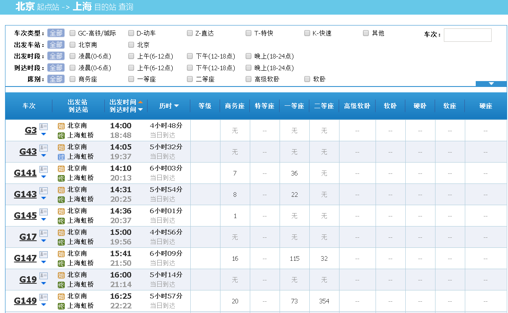
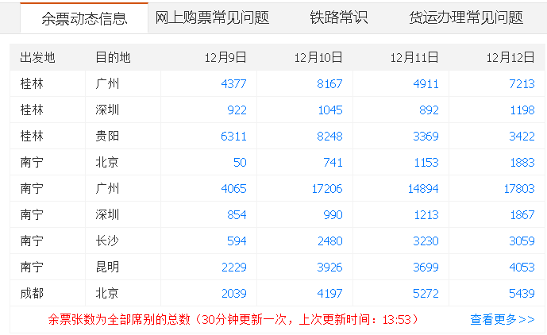
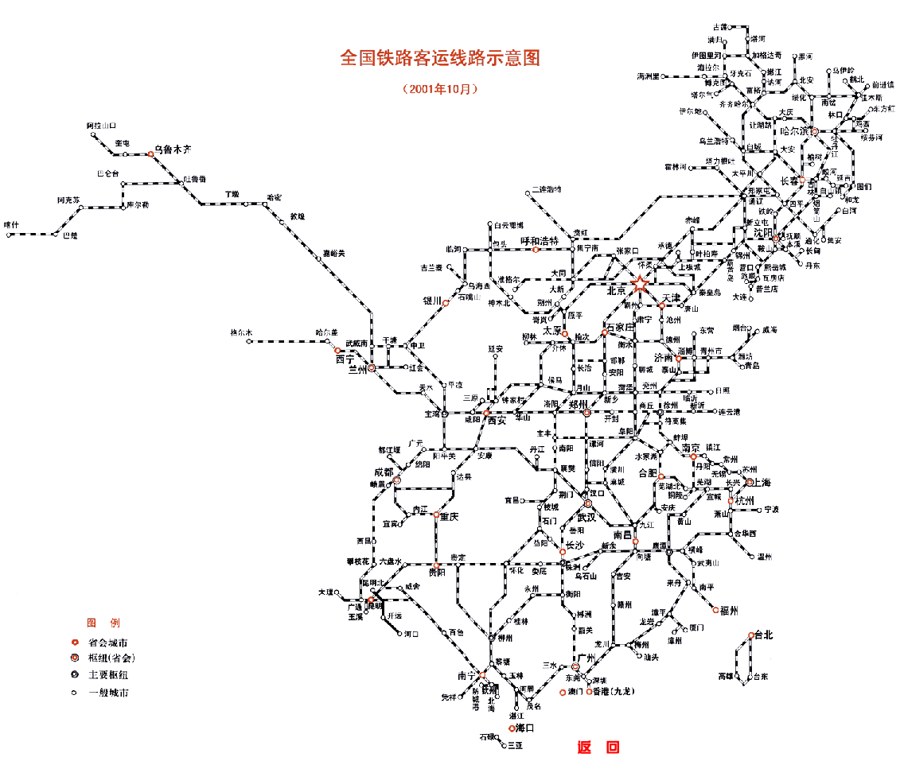

## PostgreSQL 与 12306 抢火车票的思考       
##### [TAG 15](../class/15.md)
                                                              
### 作者                                                             
digoal                                                              
                                                              
### 日期                                                             
2016-11-24                                                                  
                                                              
### 标签                                                            
PostgreSQL , 12306 , 春节 , 一票难求 , 门禁广告 , 数组 , 范围类型 , 抢购 , 排他约束 , 大盘分析 , 广告查询 , 火车票                                                                                                                     
                                                              
----                                                            
                         
## 背景        
马上春节了，又到了火车票的销售旺季，一票难求的问题依旧存在吗？    
     
还记得10年前春节前买火车票得在放票前1天搬个小板凳去排队，对于热门路线，排一个晚上都有可能买不到票。    
     
随着互联网的发展，几年前建设了12306网上购票系统，可以从电脑上买票，但是不要以为在电脑上就能买到票。    
    
我记得12306刚推出时，经常发生12306网站打不开，或者无法付款的问题。   
   
为什么呢？   
  
原因很简单，春节期间网上购票的人可能达到几亿的级别，而且放票日期是同一天同一个时间点，也就是说同一时刻12306要接受几亿用户的访问。   
   
处理能力和实际的访问需求更不上，带来的结果就是网站打不开，系统不稳定的现象。   
    
    
    
后来12306想了分线路分时段开启的办法，想办法把不同线路的用户错开时间来访问12306的网站，但是这个方法起初的效果不明显，并不是所有用户都知道的（就好像你临时通知今天不上班，但还是有用户会来单位的），所以大多数用户还是集中在一个点去访问12306的网站。    
    
随着硬件的发展，技术的演进，12306的系统越来越趋于成熟，稳定性和响应速度也越来越好。   
    
据说现在很多商家还开通了云抢票业务，本质上是让你不要冲击12306系统了，把需求提前收集，在放票时，这些系统会进行排队与合并购买，这种手段可以减少12306的访问并发。        
    
抢火车票是很有意思的一个课题，对IT人的智商以及IT系统的健壮性，尤其是数据库的功能和性能都是一种挑战。      
      
接下来我们一起来缕一缕有哪些难点，又有怎样的解决手段。     
      
## 一、扒一扒熟悉的铁路售票系统
铁路售票系统最基本的功能包括    
  
```
查询余票、余票统计、购票、车次变化、退票、改签、中转乘车规划 等。     
```
  
每个需求都有各自的特点，例如    
    
1\. 查询余票，用户在购票前通常会查一下到达目的地有哪些余票，它属于一个高并发的操作，同时需要统计余票张数，需要很强的CPU来支撑实时的查询。    
  
2\. 购票，购票和查询不一样，购票是会改变库存的，所以对数据库来说是更新的操作。   
     
而且购票很可能发生冲突，例如很多人要买同一趟车的票，那就出现冲突了，到底卖给谁呢？    
    
需要考虑锁冲突，尽量的让不同的人购买时可并行，或者可以合并多人的购票请求，来减少数据库的更新操作。     
    
3\. 中转乘车，当用户需要购买的起点和到达站无票时，需要计算中转的搭乘方案。   
  
比如从北京到上海，如果没有直达车，是不是该转车呢？转哪趟，在哪里转就成了问题，简单一点就是买票的人自己想。   
  
高级一点的话，可以让12306给你推荐路线，这个涉及的是数据库的路径规划功能。    
    
我们来逐一分析一下这些需求的特点。       
        
### 1 查询余票  
1\. 普通的余票查询需求  
  
你如果要买从北京到上海的火车票，通常会查一下哪些车次还有余票。    
    
查询的过滤条件可能很多，比如    
  
1\.1\. 上车站、下车站、中转站  
  
1\.2\. 车次类型（高铁、动车、直达、快速、普客、...）  
  
1\.3\. 出发日期、时段  
  
1\.4\. 到达日期、时段  
  
1\.5\. 席别（硬座、硬卧、...站票）  
  
1\.6\. 过滤掉没有余票的车次  
  
展示给用时还要考虑到怎么排序（是按始发时间排呢，还是按票价，或者按余票数量排？），怎么分页。    
    
      
    
**眼见不一定为实**    
  
查询余票通常不是实时的、或者说不一定是准确的，有可能是后台异步统计的结果。    
    
即使是实时统计的结果，在高并发的抢票期间，你看到的信息对你来说也许很快就会失效。    
    
比如你看到某趟车还有100张票，很可能等你付款的时候，已经卖光了。    
    
所以在高峰期，余票信息的参考价值并不大，不要被迷惑了。   
    
2\. 查询余票的另一个更高级的需求是路径规划, 自动适配(根据用户输入的中转站点s)   
  
这个功能以前可能没有，但是总有一天会暴露出来，特别是车票很紧张的情况下。    
    
就比如从北京到上海，直达的没有了，系统可以帮你看看转一趟车的，转2趟车的，转N趟车的。（当然，转的越多越复杂）。    
    
从中转这个角度来讲，实际上已经扯上路径规划的技术了。    
    
怎么中转是时间最短的、价格最低的、中转次数最少的等等。（里面还涉及转车的输入要求（比如用户要求在一线城市转车，或者必须要转高铁））。       
    
关于路径规划，可以参考一下PostgreSQL pgrouting，已支持多种路径规划算法，支持算法的自定义扩展。  
  
简直是居家旅行，杀人灭口的必备良药。  
    
[《聊一聊双十一背后的技术 - 物流, 动态路径规划》](../201607/20160710_01.md)      
  
#### 设计痛点  
1\. 大多数用户是有选择综合症的，通常来说，用户可能会查询很多次，才选到合适日期的合适车次的票。   
    
查询量比较大，春节期间更甚。    
  
2\. 为了展示余票数量，需要统计，会耗费较多的CPU, IO资源。    
  
3\. 路径规划，帮用户选择最佳的转车路线，很考验数据库的功能，大多数数据库没有这个功能。  
  
### 2 余票统计  
对于售票系统来说，查询余票实际上是一个统计操作。    
    
统计操作相比简单查询，不但消耗更多的IO还消耗更多的CPU资源。    
      
想像一下几亿人（其实不用这么多，可能几十万就够了）来查询余票，即使机器没挂掉，也会把所有机器的资源跑满，CPU产生的热量，可能几分钟就能把鸡蛋煮熟咯。     
     
为了减少实时查询余票的开销，通常会分时进行统计，更新最新的统计信息。    
     
用户查询余票信息时，查到的是统计后的结果，前面我已经分析过了，余票是不可信的，所以存在一定的延迟其实也是允许的。    
   
这下不能煮鸡蛋了，因为把几亿个统计请求，变成了1个统计请求，是不是一下子世界就冷静了呢？     
  
我们可以看到12306主页的余票大盘数据    
  
      
  
#### 设计痛点  
1\. 余票信息需要统计，查询会耗费较多的CPU,IO。  
   
由于余票是不可信的，所以存在一定的延迟其实也是允许的，优化手段是异步统计，用户查询统计后的结果。   
  
### 3 购票  
购票相对于查询余票来说，从请求量来分析，比查询请求更少，因为通常来说，用户可能会查询很多次，才选到合适日期的合适车次的票。     
    
但是由于购票是一次交易，每次交易都会产生写操作，而且这种交易并不是无限库存的交易，因为库存是有限的，所以设计的关键是降低粒度，减少锁冲突，减少数据扫描量。    
    
另外还需要考虑的因素包括      
  
1\. 同一趟车次的同一个座位，在不同的维度可能会被多次售卖    
  
1\.1 时间维度，如发车日期    
  
1\.2 空间维度，不同的起始站点  
  
2\. 票价  
    
票价一般和席别绑定，按区间计费。    
  
另一个需求是尽量的将票卖出去，减少空洞座位。    
  
打个比方，从北京到上海的车，中间经过（天津、徐州、南京、无锡、苏州），如果天津到南京段有人买了，剩下的没有被购买的段应该还可以继续被购买。    
     
如果一趟从北京到上海的车，所有的票都被苏州到上海的用户买了，其他的位置没有卖出，铁大哥是不是要哭晕在厕所。   
   
又或者某趟车大量的座位被中途上车的用户买了，是不是可以买到全程的票数就少了。   
    
以前就存在这种情况，对铁大哥的成本是个不小的考验。    
    
#### 设计痛点  
1\. 为了减少购票系统的写锁冲突，例如同一个座位，尽量不出现因为一个会话在更新它，其他会话需要等待的情况。    
    
（比如A用户买了北京到天津的，B用户买了天津到上海的同一趟车的同一个座位，那么应该设计合理的合并操作（如数据库内核改进）或者从设计上避免锁等待）  
  
其实就是把座位的空间维度（从哪里到哪里）、本身的属性（座位号）、时间维度（发车日期）进行解耦，放到多条记录中，从而在购买时，可以同时进行。   
   
因为数据库中最小的锁目前是行锁（单行记录同一时刻只允许一个会话进行更新，其他的被堵塞，等待释放锁），也许随着技术的发展，会演变成列锁，或者列里面的元素锁（比如数组，JSON）。    
         
### 4 车次新增、删除、变更  
春节来临时、通常需要对某些热门线路增加车次。    
    
及车次的新增、删除和变更需求。    
    
在设计数据库时，应该考虑到这一点。  
  
#### 设计痛点  
车次的变更简直是牵一发而动全身，比如余票统计会跟着变化，查询系统也要跟着变化。  
    
还有初始化信息的准备，例如为了加快购票的速度，可能会将车次的数据提前准备好（也许是每个座位一条记录），参考第3个需求的解说。    
    
### 5 对账需求  
票可能是经过很多渠道卖出去的，例如支付宝、去哪儿、携程、铁老大的售票窗口、银行的代理窗口、客运机构 等等。   
    
涉及到实际的销售信息与资金往来的对账需求。    
    
通常这个操作是隔天延迟对账的。    
  
### 6 退票、改签需求  
退票和改签也是比较常见的需求，特别是现在APP流行起来，退改签都很方便。  
  
这就导致了用户可能会先买好一些，特别是春节期间，用户无法预先知道什么时候请假回家，所以先买几张不同日期的，到时候提前退票或者改签。    
    
改签和退票就涉及到位置回收（对数据库来说也许是更新数据），改签还涉及购票同样的流程。    
    
#### 设计痛点  
与购票类似  
  
### 7 取票  
这个就很简单了，就是按照用户ID，查询已购买，未打印的车票。    
  
### 8 其他需求  
#### 票的种类  
学生票、团体票、卧铺、站票    
  
这里特别是站票，站票是有上限的，需要控制一趟车的站票人数    
    
站票同样有起点和终点，但是有些用户可能买不到终点的票，会先买一段的，然后补票或者就一直在车上不下车，下车后再补票。  
  
#### 先上车后补票  
这个手段极其恶劣，不过很多人都是这么干的，未婚先孕，现在的年轻人啊。。。。  
  
通常会考虑容积率，避免站票太多。    
   
如果无节制的销售站票，可能坐不下的。   
  
## 痛点小结  
1\. 大多数用户是有选择综合症的，通常来说，用户可能会查询很多次，才选到合适日期的合适车次的票。   
    
查询量比较大，春节期间更甚。    
  
2\. 为了展示余票数量，需要统计，会耗费较多的CPU, IO资源。    
  
3\. 路径规划的需求，帮用户找出（时间最短、行程最短、指定中转站、最廉价、或者站票最少）等条件的中转搭乘路线。    
   
妈妈再也不用担心买不到票啦。  
   
4\. 余票信息需要统计，查询会耗费较多的CPU,IO。  
    
由于余票是不可信的，所以存在一定的延迟其实也是允许的，优化手段是异步统计，用户查询统计后的结果。   
   
5\. 为了减少购票系统的写锁冲突，例如同一个座位，尽量不出现因为一个会话在更新它，其他会话需要等待的情况。    
     
（比如A用户买了北京到天津的，B用户买了天津到上海的同一趟车的同一个座位，那么应该设计合理的合并操作（如数据库内核改进）或者从设计上避免锁等待）  
  
其实就是把座位的空间维度（从哪里到哪里）、本身的属性（座位号）、时间维度（发车日期）进行解耦，放到多条记录中，从而在购买时，可以同时进行。   
   
因为数据库中最小的锁目前是行锁（单行记录同一时刻只允许一个会话进行更新，其他的被堵塞，等待释放锁），也许随着技术的发展，会演变成列锁，或者列里面的元素锁（比如数组，JSON）。    
   
6\. 车次的变更简直是牵一发而动全身，比如余票统计会跟着变化，查询系统也要跟着变化。  
      
还有初始化信息的准备，例如为了加快购票的速度，可能会将车次的数据提前准备好（也许是每个座位一条记录），参考第3个需求的解说。    
   
综合以上痛点和需求分析，我们在设计时应尽量避免锁等待，避免实时余票查询，同时还要避免席位空洞。    
         
## 二、猴子请来的救兵来啦  
经过前面的分析，已经把铁路售票系统最关键的几个业务场景进行了描述，并且阐述了其中的设计痛点，那么我们如何设计合理的系统来满足几亿人民抢票的需求呢？   
    
西游记里每一集孙悟空师父被妖怪抓走，总能找到救兵来解救。   
   
我们也需要救兵，救兵快来啊。。。。     
    
PostgreSQL是全世界最高级的开源数据库，几乎适用于任何场景。    
    
有很多特性是可以用来加快开发效率，满足架构需求的。     
  
针对铁路售票系统，可以用到哪些救命法宝呢？      
    
1\. 法宝1，varbit类型   

使用varbit存储每趟车的每个座位途径站点是否已销售。    
    
例如 G1921车次，从北京到上海，途径天津、徐州、南京、苏州。包括起始站，总共6个站点。   那么使用6个比特位来表示。    
    
```
'000000'     
```
    
如果我要买从天津到徐州的，这个值变更为(下车站的BIT不需要设置)   
  
```
'010000'     
```
    
这个位置还可以卖从北京到天津，从徐州到终点的任意站点。    
    
余票统计也很方便，对整个车次根据BIT做聚合计算即可。    
    
统计任意组合站点的余票（ 北京-天津, 北京-徐州, 北京-南京, 北京-苏州, 北京-上海, 天津-徐州, 天津-南京, ......, 苏州-上海 ）    
  
```
udf_count(varbit) returns record    
```
  
统计指定起始站点的余票（start: 北京, end: 南京； 则返回的是 北京-南京 的余票）    
  
```
udf_count(varbit, start, end) returns record    
```
    
以上两个需求，开发对应的聚合函数即可，其实就是一些指定范围的bitand的count操作。     
   
通过法宝1，解决了统计余票的需求、售票无空洞的需求。  
  
2\. 法宝2，数组类型   
   
使用数组存储每趟车的起始站点，途经站点。     
  
使用数组来存储，好处是可以使用到数组的GIN索引，快速的检索哪些车次是可以搭乘的。    
    
例如查询从北京到南京的车次。    
    
```
select 车次 from 全国列车时刻表 where column_arr @> array['北京','南京'];  
```
  
这条SQL是可以走索引的，效率非常高，每秒请求几十万不是问题。   
  
法宝2解决了高并发请求查询符合条件的列车信息的需求。       
    
3\. 法宝3，skip locked    
    
这个特性是跳过已被锁定的行，比如用户在购买某一趟从北京到南京的车票时，其实是一次UPDATE ... SET BIT的操作。    
      
但是很可能其他用户也在购买，可能就会出现锁冲突，为了避免这个情况发生，可以skip locked，跳过锁冲突，直接找另一个座位。    
     
```
select * from table   
  where column1='车次号'   -- 指定车次  
  and column2='车次日期'   -- 指定发车日期  
  -- and mod(pg_backend_pid(),100) = mod(pk,100)   -- 提高并发，如果有多个连接并发的在更新，可以直接分开落到不同的行，但是可能某些pID卖完了，可能会找不到票，建议不要开启这个条件  
  and column4='席别'  -- 指定席别  
  and getbit(column3, 开始站点位置, 结束站点位置-1) = '0...0'  -- 获取起始位置的BIT位，要求全部为0  
  order by column3 desc   -- 这个目的是先把已经卖了散票的的座位拿来卖，也符合铁大哥的思想，尽量把起点和重点的票卖出去，减少空洞  
  for update  
  skip locked  -- 跳过被锁的行，老牛逼了，不需要锁等待  
  limit ?;     -- 要买几张票  
```
    
法宝3解决了一伙人来抢票时，在同一趟车的座位发生冲突的问题。   
     
4\. 法宝4，cursor  
    
如果要查询大量记录，可以使用cursor，减少重复扫描。  
   
5\. 法宝5，路径规划  
  
如果用户选择直达车已经无票了，可以自动计算如何转乘，根据用户的乘车站点和目的地选择最佳搭乘路线。    
    
参考一下pgrouting，与物流的动态路径规划需求一致。    
    
[《聊一聊双十一背后的技术 - 物流, 动态路径规划》](../201607/20160710_01.md)      
   
6\. 法宝6，多核并行计算  
  
开源也支持多核并行计算的，在生成余票统计时，为了提高生成速度，可以将更多的CPU加入进来并行计算，快速得到余票统计。    
   
就比如你策划了一本书，已经列好了大纲，同时你找了100个作者，这100个作者可以根据你分配的工作，同时开始写作，很快就能把一本书写完。   
  
而传统的情况，一本书，只能一个作者帮你写，即使你找了100个作者，另外的99位也只能空闲，或者他们只能写其他的99本书。    
  
7\. 法宝7，资源隔离  
  
PostgreSQL为进程模型，所以可以控制每个进程的资源开销，包括(CPU,IOPS,MEMORY,network)，在铁路售票系统中，查询和售票是最关键的需求，使用这种方法，可以在关键时刻保证关键业务有足够的资源，流畅运行。  
    
这个思想和双十一护航也是一样的，在双十一期间，会关掉一些不必要的业务，保证主要业务的资源，以及它们的流畅运行。    
  
8\. 法宝8，分库分表  
    
铁路数据达到了海量数据的级别，很显然一台机器无法存下所有的铁路数据。    
   
那么怎么办呢？ 可以将铁路的数据进行分区存储，存到不同的主机。      
      
PostgreSQL的分库分表方案很多，例如plproxy, pgpool-II, pg-xl, pg-xc, citus等等.    
    
9\. 法宝9，递归查询   
  
铁路有非常典型的上下文相关特性，例如一趟车途径N个站点，全国铁路组成了一个很大的铁路网。  
  
递归查询可以根据某一个节点，向上或者向下递归搜索相关的站点。  
    
比如在有哪些车可以直达北京，有哪些车可以转车到达北京，又或者查询从北京到拉萨，有哪些线路以及途经线路可以走。   
    
    
    
10\. 法宝10，MPP    
  
为了持续的提高12306的体验，铁大哥还有数据挖掘的需求，比如今年春节应该对哪些线路增加车次，每天的车次增加的规划，哪些线路可以减少车次也能在春节前将用户送回家。   
    
这些问题可以基于以往的运输数据进行挖掘计算，进行回答。    
    
基于PostgreSQL的MPP产品很多，例如Postgres-XL, Greenplum, Hawq, REDSHIFT, paraccl, 等等。    
    
使用PG可以和这些产品很好的融合，保持语法一致。   
    
降低数据分析的开发成本。    
    
猴子请来的救兵厉害吧，还有更厉害的，阿里云在PostgreSQL基础上做了很多的改进，比对对于12306的系统，就有特别的定制特性。   
    
## 三、阿里云PostgreSQL varbit, array增强介绍  
在铁路购票系统中，有几个需求需要用到bit和array的特殊功能，这些特殊的功能目前社区版本没有，阿里云RDS PostgreSQL对此做了增强，如下。    
    
1\. 余票统计  
  
统计指定bit范围=全0的计数  
  
不指定范围，查询任意组合的bit范围全=0的计数  
  
2\. 购票  
  
指定bit位置过滤、取出、设置对应的bit值    
  
根据数组值取其位置下标。    
  
回顾一下我之前写的两篇文章，也是使用varbit的应用场景，有异曲同工之妙        
      
[《基于 阿里云 RDS PostgreSQL 打造实时用户画像推荐系统》](../201610/20161021_01.md)         
      
[《门禁广告销售系统需求剖析 与 PostgreSQL数据库实现》](20161124_01.md)      
        
PostgreSQL的bit, array功能已经很强大，阿里云RDS PostgreSQL的bitpack也是用户实际应用中的需求提炼的新功能，大伙一起来给阿里云提需求。      
      
打造属于国人的PostgreSQL吧。           
   
## 四、数据库设计(伪代码)  
讲了这么多，最后提供一些伪代码，帮助大家来理解一下。  
  
1\. 列车信息表 :     
    
```  
create table train     
(id int primary key, --主键    
go_date date, -- 发车日期    
train_num name, -- 车次    
station text[] -- 途径站点数组    
);     
```  
    
2\. 位置信息表 :     
    
```  
create table train_sit     
(id serial8 primary key, -- 主键    
tid int references train (id), --关联列车ID    
bno int, -- 车厢或bucket号    
sit_level text, -- 席别  
sit_no int,  -- 座位号  
station_bit varbit  -- 途径站点组成的BIT位信息, 已售站点用1表示, 未售站点用0表示. 购票时设置起点和终点-1, 终点不设置   
);    
```   
    
3\. 测试数据模型, 1趟火车, 途径14个站点.    
    
```  
insert into train values (1, '2013-01-20', 'D645', array['上海南','嘉兴','杭州南','诸暨','义乌','金华','衢州','上饶','鹰潭','新余','宜春','萍乡','株洲','长沙']);    
```  
    
4\. 插入测试数据, 共计200W个车厢或bucket, 每个车厢98个位置.    
    
```  
insert into train_sit values (id, 1, id, '一等座', generate_series(1,98), repeat('0',14)::varbit) from generate_series(1,1000000) t(id);    
insert into train_sit values (id, 1, id, '二等座', generate_series(1,98), repeat('0',98)::varbit) from generate_series(1000001,2000000) t(id);    
```  
    
5\. 创建取数组中元素位置的函数 (实际生产时可以使用C实现) :     
    
```  
create or replace function array_pos (a anyarray, b anyelement) returns int as $$    
declare    
  i int;    
begin    
  for i in 1..array_length(a,1) loop    
    if b=a[i] then    
      return i;    
    end if;    
    i := i+1;    
  end loop;    
  return null;    
end;    
$$ language plpgsql;    
```  
    
6\. 创建购票函数 (伪代码) :      
    
下单，更新    
    
```  
create or replace function buy     
(    
inout i_train_num name,     
inout i_fstation text,     
inout i_tstation text,    
inout i_go_date date,    
inout i_sits int, -- 购买多少张  
out o_slevel text,    
out o_bucket_no int,    
out o_sit_no int,    
out o_order_status boolean    
)     
declare  
  vid int[];  
  
begin  
  
-- 锁定席位  
  
open cursor for  
select array_agg(id) into vid[] from table   
  where column1='车次号'   -- 指定车次  
  and column2='车次日期'   -- 指定发车日期  
  -- and mod(pg_backend_pid(),100) = mod(pk,100)   -- 提高并发，如果有多个连接并发的在更新，可以直接分开落到不同的行，但是可能某些pID卖完了，可能会找不到票，建议不要开启这个条件  
  and column4='席别'  -- 指定席别  
  and getbit(column3, 开始站点位置, 结束站点位置-1) = '0...0'  -- 获取起始位置的BIT位，要求全部为0  
  order by column3 desc   -- 这个目的是先把已经卖了散票的的座位拿来卖，也符合铁大哥的思想，尽量把起点和重点的票卖出去，减少空洞  
  for update  
  skip locked  -- 跳过被锁的行，老牛逼了，不需要锁等待  
  limit ?;     -- 要买几张票  
  
  if array_lengty(vid,1)=? then  -- 确保锁定行数与实际需要购票的数量一致   
  
    -- 购票，更新席别，设置对应BIT=1  
    update ... set column3=set_bit(column3, 1, 开始位置, 结束位置) where id = any(vid);  
  end if;  
  
end;  
$$ language plpgsql;    
```  
    
测试(old 输出) :     
    
```  
digoal=# select * from buy('D645','杭州南','宜春','2013-01-20', 10);    
 i_train_num | i_fstation | i_tstation | i_go_date  | o_slevel | o_bucket_no | o_sit_no | o_order_status     
-------------+------------+------------+------------+----------+-------------+----------+----------------    
 D645        | 杭州南     | 宜春       | 2013-01-20 | 一等座   |       35356 |        9 | t    
(1 row)    
```  
  
7\. 余票统计(伪代码)  
  
表结构  
  
```  
create table ? (  
 车次  
 发车日期  
 起点  
 到站  
 余票  
);  
```  
  
统计SQL  
  
```  
select 车次,发车日期,count(varbit, 起点, 到站) from table group by 车次 发车日期;  
```  
    
## 五、小结  
本文从铁路购票系统的需求出发，分析了购票系统的痛点，以及数据库设计时需要注意的事项。      
         
PostgreSQL的10个特性，加上阿里云对varbit和array的改进，可以很好的满足铁路购票系统的需求。    
    
1\. 照顾到余票查询的实时性、购票的锁竞争、以及超大规模的分库分表的需求。       
  
2\. 购票时，如果是中途票，会尽量选择已售的中途票，减少位置空洞的产生，保证更多的人可以购买到全程票。  
  
3\. 使用bit描述了每一个站点是否被售出，不会出现有票不能卖的情况。  
     
## 六、以前写的同类文章
  
## 正文  
在PostgreSQL 中可以使用varbit存储比特位, 下面模拟一个简单的应用场景.    
  
马上春节了, 火车票又到了销售旺季, 一票难求依旧.  
  
下面就以火车票销售为例来介绍一下PostgreSQL varbit类型的用法.  
  
测试环境 :   
  
PostgreSQL 9.2.1  
  
测试表 :   
  
列车信息表 :   
  
```
create table train   
(id int primary key, --主键  
go_date date, -- 发车日期  
train_num name, -- 车次  
station text[] -- 途径站点  
);   
```
  
车厢或bucket信息表 :   
  
```
create table train_bucket   
(id int primary key, --主键  
tid int references train (id), -- 关联列车ID  
bno int, -- 车厢或bucket号  
sit_level text, -- 席别  
sit_cnt int, -- 该车厢或bucket的座位总数  
sit_remain int, -- 剩余座位  
sit_bit varbit -- 座位BIT位, 已售座位用1表示, 未售座位用0表示  
);  
```
  
位置信息表 :   
  
```
create table train_sit   
(id serial8 primary key, -- 主键  
tid int references train (id), --关联列车ID  
tbid int references train_bucket(id), --关联bucket表ID  
sit_no int,  -- 座位号, 来自train_bucket.sit_bit的位置信息.  
station_bit varbit  -- 途径站点组成的BIT位信息, 已售站点用1表示, 未售站点用0表示.  
);  
```
  
创建索引 :   
  
```
create index idx_train_bucket_sit_remain on train_bucket(sit_remain) where sit_remain>0;  
create index idx_train_sit_station_bit on train_sit (station_bit) where station_bit<>repeat('1', 13)::varbit;  
```
  
插入测试数据, 1趟火车, 途径14个站点.  
  
```
insert into train values (1, '2013-01-20', 'D645', array['上海南','嘉兴','杭州南','诸暨','义乌','金华','衢州','上饶','鹰潭','新余','宜春','萍乡','株洲','长沙']);  
```
  
插入测试数据, 共计200W个车厢或bucket, 每个车厢98个位置.  
  
```
insert into train_bucket values (generate_series(1,1000000), 1, generate_series(1,1000000), '一等座', 98, 98, repeat('0',98)::varbit);  
insert into train_bucket values (generate_series(1000001,2000000), 1, generate_series(1000001,2000000), '二等座', 98, 98, repeat('0',98)::varbit);  
```
  
创建取数组中元素位置的函数 :   
  
```
create or replace function array_pos (a anyarray, b anyelement) returns int as $$  
declare  
  i int;  
begin  
  for i in 1..array_length(a,1) loop  
    if b=a[i] then  
      return i;  
    end if;  
    i := i+1;  
  end loop;  
  return null;  
end;  
$$ language plpgsql;  
```
  
创建购票函数 :    
  
```
create or replace function buy   
(  
inout i_train_num name,   
inout i_fstation text,   
inout i_tstation text,  
inout i_go_date date,  
out o_slevel text,  
out o_bucket_no int,  
out o_sit_no int,  
out o_order_status boolean  
)   
returns record as $$  
declare  
  curs1 refcursor;  
  curs2 refcursor;  
  v_row int;  
  v_station text[];  
  v_train_id int;  
  v_train_bucket_id int;  
  v_train_sit_id int;  
  v_from_station_idx int;  
  v_to_station_idx int;  
  v_station_len int;  
begin  
  set enable_seqscan=off;  
  v_row := 0;  
  o_order_status := false;  
    
  select array_length(station,1), station, id, array_pos(station, i_fstation), array_pos(station, i_tstation)   
    into v_station_len, v_station, v_train_id, v_from_station_idx, v_to_station_idx   
    from train where train_num=i_train_num and go_date = i_go_date;  
  if ( found and array_pos(v_station, i_fstation) is not null   
       and array_pos(v_station, i_tstation) is not null   
       and array_pos(v_station, i_fstation) < array_pos(v_station, i_tstation)   
     ) then  
  else  
    o_order_status := false;  
    return;  
  end if;  
    
  open curs2 for select tid,tbid,sit_no from train_sit  
    where (station_bit & bitsetvarbit(repeat('0', v_station_len-1)::varbit, v_from_station_idx-1, v_to_station_idx-v_from_station_idx, 1)) = repeat('0', v_station_len-1)::varbit   
    and station_bit <> repeat('1', v_station_len-1)::varbit  
    -- and ctid not in (select locked_row from pgrowlocks('train_sit')) -- 耗时约300毫秒, 用它来解决热点锁等待不划算.  
    limit 1  
    for update nowait; -- 也可不加nowait, 加了的话如果获取锁失败将返回55P03异常, 需要程序重新提交  
  loop  
    fetch curs2 into v_train_id,v_train_bucket_id,o_sit_no;  
    if found then  
      update train_sit set station_bit=bitsetvarbit(station_bit, v_from_station_idx-1, v_to_station_idx-v_from_station_idx, 1)   
        where current of curs2;  
      GET DIAGNOSTICS v_row = ROW_COUNT;  
      if (v_row = 1) then  
        select sit_level, bno into o_slevel, o_bucket_no from train_bucket where id=v_train_bucket_id;  
 close curs2;  
 o_order_status := true;  
 return;  
      end if;  
    else   
      close curs2;  
      exit;  
    end if;  
  end loop;  
  
  v_row := 0;  
  
  open curs1 for select id, tid, strpos(sit_bit::text,'0'), sit_level, bno from train_bucket   
    where sit_remain>0  
    -- and ctid not in (select locked_row from pgrowlocks('train_bucket')) -- 耗时约300毫秒, 用它来解决热点锁等待不划算.  
    limit 1   
    for update nowait; -- 也可不加nowait, 加了的话如果获取锁失败将返回55P03异常, 需要程序重新提交.  
  loop  
    fetch curs1 into v_train_bucket_id, v_train_id, o_sit_no, o_slevel, o_bucket_no;  
    if found then  
      update train_bucket set sit_bit = set_bit(sit_bit, strpos(sit_bit::text,'0')-1, 1), sit_remain = sit_remain-1  
        where current of curs1;  
      GET DIAGNOSTICS v_row = ROW_COUNT;  
      if (v_row = 1) then  
        close curs1;  
 exit;  
      end if;  
    else   
      close curs1;  
      exit;  
    end if;  
  end loop;  
  
  if v_row = 1 then  
    insert into train_sit(tid,tbid,sit_no,station_bit)  
    values (  
      v_train_id,   
      v_train_bucket_id,   
      o_sit_no,  
      bitsetvarbit(repeat('0', v_station_len-1)::varbit, v_from_station_idx-1, v_to_station_idx-v_from_station_idx, 1)  
      );  
    o_order_status := true;  
    return;  
  else  
    o_order_status := false;  
    return;  
  end if;  
    
  exception   
  when others then  
    o_order_status := false;  
    return;  
end;  
$$ language plpgsql;  
```
  
测试 :   
  
```
digoal=# select * from buy('D645','杭州南','宜春','2013-01-20');  
 i_train_num | i_fstation | i_tstation | i_go_date  | o_slevel | o_bucket_no | o_sit_no | o_order_status   
-------------+------------+------------+------------+----------+-------------+----------+----------------  
 D645        | 杭州南     | 宜春       | 2013-01-20 | 一等座   |       35356 |        9 | t  
(1 row)  
```
  
## 压力测试
```
vi test.sql  
select * from buy('D645','上海南','长沙','2013-01-20');  
```
  
不加nowait测试结果 :   
  
```
ocz@db-172-16-3-150-> pgbench -M prepared -f ./test.sql -n -r -c 16 -j 8 -T 1200 -U postgres digoal  
transaction type: Custom query  
scaling factor: 1  
query mode: prepared  
number of clients: 16  
number of threads: 8  
duration: 1200 s  
number of transactions actually processed: 2197407  
tps = 1831.143708 (including connections establishing)  
tps = 1831.169308 (excluding connections establishing)  
statement latencies in milliseconds:  
        8.734424        select * from buy('D645','上海南','长沙','2013-01-20');  
```
  
加nowait测试结果 :   
  
```
ocz@db-172-16-3-150-> pgbench -M prepared -f ./test.sql -n -r -c 16 -j 16 -T 12 -U postgres digoal  
transaction type: Custom query  
scaling factor: 1  
query mode: prepared  
number of clients: 16  
number of threads: 16  
duration: 12 s  
number of transactions actually processed: 93632  
tps = 7800.056248 (including connections establishing)  
tps = 7818.803904 (excluding connections establishing)  
statement latencies in milliseconds:  
        2.042862        select * from buy('D645','上海南','长沙','2013-01-20');  
```
  
## 小结
1\. 需要解决更新热点, 降低等待, 提高并行处理几率.   
  
    本例的热点在 :   
      
```
update train_bucket set sit_bit = set_bit(sit_bit, strpos(sit_bit::text,'0')-1, 1), sit_remain = sit_remain-1  
   where current of curs1;  
```
  
以及  
  
```
 update train_sit set station_bit=bitsetvarbit(station_bit, v_from_station_idx-1, v_to_station_idx-v_from_station_idx, 1)   
    where current of curs2;  
```
  
对应的游标  :  
  
```
  open curs2 for select tid,tbid,sit_no from train_sit  
    where (station_bit & bitsetvarbit(repeat('0', v_station_len-1)::varbit, v_from_station_idx-1, v_to_station_idx-v_from_station_idx, 1)) = repeat('0', v_station_len-1)::varbit   
    and station_bit <> repeat('1', v_station_len-1)::varbit  
    -- and ctid not in (select locked_row from pgrowlocks('train_sit')) -- 耗时约300毫秒, 用它来解决热点锁等待不划算.  
    limit 1  
    for update;  
```
  
以及  
  
```
  open curs1 for select id, tid, strpos(sit_bit::text,'0'), sit_level, bno from train_bucket   
    where sit_remain>0  
    -- and ctid not in (select locked_row from pgrowlocks('train_bucket')) -- 耗时约300毫秒, 用它来解决热点锁等待不划算.  
    limit 1   
    for update;  
```
  
解决的关键在这里.  
  
如果不能解决热点的问题, 那就提高处理速度, 精简字段数量和长度, 精简索引. 提高更新速度.  
  
2\. 减少数据扫描的量.  
  
    partial index, 避免满座车厢的扫描, 以及全程占位位子的扫描.  
  
3\. 先查bucket 是否空闲, 再查sit是否空闲.   
  
4\. 还需要考虑优先级的问题 :   
  
例如有111000和111100两个位子, 如果请求要最后两个站的票, 应该优先匹配111100, 这样更不容易浪费。如下 :   
  
```
111000 | 000011 = 111011  
111100 | 000011 = 111111  
```
  
## 参考
1\. setbitvarbit  
  
http://blog.163.com/digoal@126/blog/static/163877040201302192427651/  
                 
                      
              
  
<a rel="nofollow" href="http://info.flagcounter.com/h9V1"  ></a>  
  
  
  
  
  
  
## [digoal's 大量PostgreSQL文章入口](https://github.com/digoal/blog/blob/master/README.md "22709685feb7cab07d30f30387f0a9ae")
  
