## PostgreSQL 在视频、图片去重，图像搜索业务中的应用
##### [TAG 15](../class/15.md)
                                                          
### 作者                                                         
digoal                                                          
                                                          
### 日期                                                         
2016-11-26                                                              
                                                          
### 标签                                                        
PostgreSQL , Haar wavelet , 图像搜索 , 图片去重 , 视频去重                                                                                                    
                                                          
----                                                        
                     
## 背景    
图像处理的业务场景比较多，例如 图像搜索、视频去重、人脸识别、美图、图片去重 等。  
  
比如，视频去重，一些用户上传了较多的视频，同一部电影可能有不同的版本，分辨率不一样，音轨不一样，压缩比不一样。这种情况会导致服务端重复存储大量的视频。  
  
又比如甄别黄色视频或黄色图片，鉴黄师的职业要消失了。   
  
有什么方法可以得到重复的视频呢？  如何鉴别黄色视频和图片呢？  本文将给你揭晓。     
   
另一方面，图片搜索是继文字搜索后又一个比较常用的搜索引擎。  
  
市面上常见的搜索引擎有谷歌、百度、搜狗等图片搜索引擎。  
  
http://image.baidu.com/   
  
http://images.google.com.hk   
  
例如在搜索引擎提供的接口中上层了一张雪人的图片，搜出来一堆和雪人近似的图片。  
  
  
  
图片搜索是怎么做到的呢?  
  
万能的PostgreSQL绝不落下这么好玩的东东，通过PG万能的API，可以扩展它的图片搜索功能。  
  
如果你对PostgreSQL扩展开发感兴趣，可以参考我写的文章  
  
[《找对业务G点, 体验酸爽 - PostgreSQL内核扩展指南》](https://yq.aliyun.com/articles/55981)    
  
## PostgreSQL 图像搜索插件背景技术 
PostgreSQL的图像搜索插件使用了非常主流的Haar wavelet技术对图像进行变换后存储，可以参考WIKI和一篇关于HW的文献。  
  
https://en.wikipedia.org/wiki/Haar_wavelet    
  
http://www.cs.toronto.edu/~kyros/courses/320/Lectures.2013s/lecture.2013s.10.pdf  
  
https://wiki.postgresql.org/images/4/43/Pgcon_2013_similar_images.pdf  
  
截取几页，注意烧脑。  
  
  
  
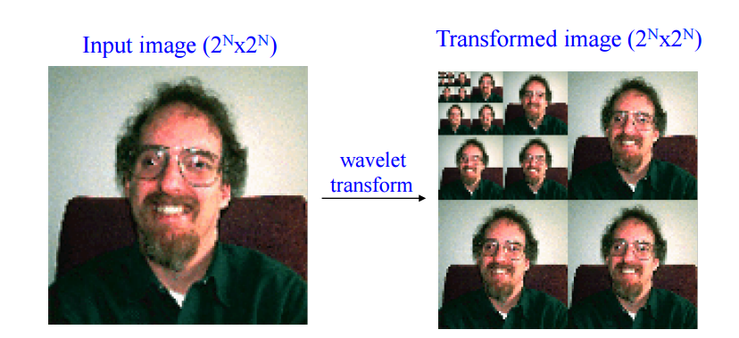  
  
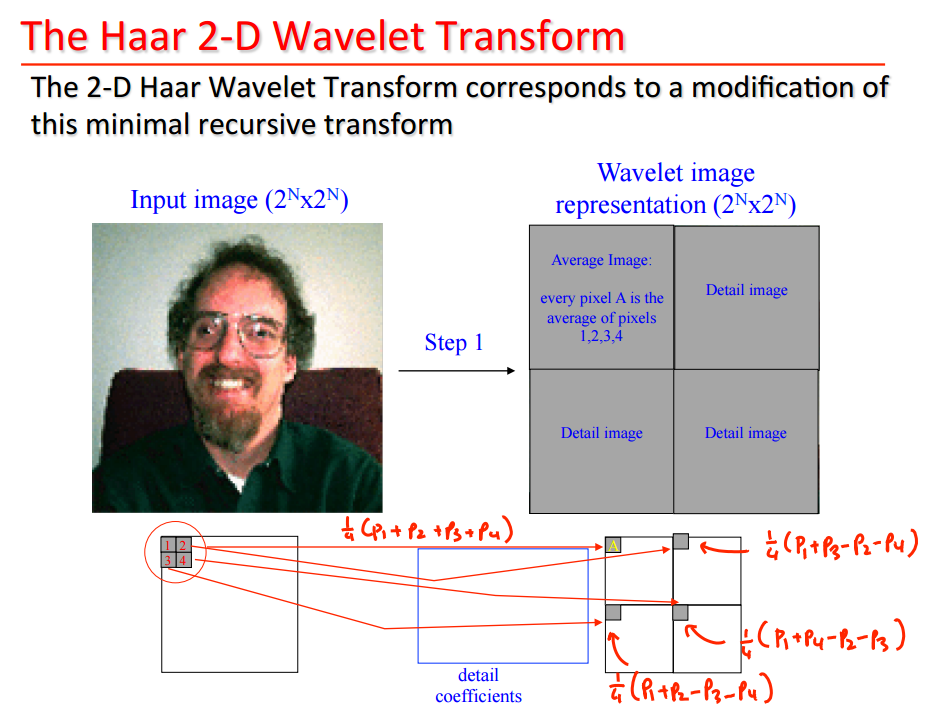  
  
  
  
## PostgreSQL 图像搜索插件介绍
依赖gd.h  
  
```
# yum install -y gd-devel
```
  
下载安装imgsmlr  
  
```
$ git clone https://github.com/postgrespro/imgsmlr
$ cd imgsmlr
$ export PGHOME=/home/digoal/pgsql9.5
$ export PATH=$PGHOME/bin:$PATH:.

$ make USE_PGXS=1
$ make USE_PGXS=1 install
```
  
安装插件  
  
```
$ psql
psql (9.5.3)
Type "help" for help.
postgres=# create extension imgsmlr;
CREATE EXTENSION
```
  
imgsmlr新增了两个数据类型    
  
| Datatype  | Storage length |                              Description                           |
| --------- |--------------: | ------------------------------------------------------------------ |
| pattern   | 16388 bytes    | Result of Haar wavelet transform on the image                      |
| signature | 64 bytes       | Short representation of pattern for fast search using GiST indexes |
  
gist 索引方法(支持pattern和signature类型), 以及KNN操作符，可以用于搜索相似度      
  
| Operator | Left type | Right type | Return type |                Description                |
| -------- |-----------| ---------- | ----------- | ----------------------------------------- |
| <->      | pattern   | pattern    | float8      | Eucledian distance between two patterns   |
| <->      | signature | signature  | float8      | Eucledian distance between two signatures |
  
新增了几个函数  
  
将图像的二进制转换为pattern类型，将pattern中存储的数据转换为signature类型      
  
|          Function          | Return type |                      Description                    |
| -------------------------- |-------------| --------------------------------------------------- |
| jpeg2pattern(bytea)        | pattern     | Convert jpeg image into pattern                     |
| png2pattern(bytea)         | pattern     | Convert png image into pattern                      |
| gif2pattern(bytea)         | pattern     | Convert gif image into pattern                      |
| pattern2signature(pattern) | signature   | Create signature from pattern                       |
| shuffle_pattern(pattern)   | pattern     | Shuffle pattern for less sensitivity to image shift |
  
## PostgreSQL 图像搜索插件测试  
导入一些图片，例如（越多越好）    
  
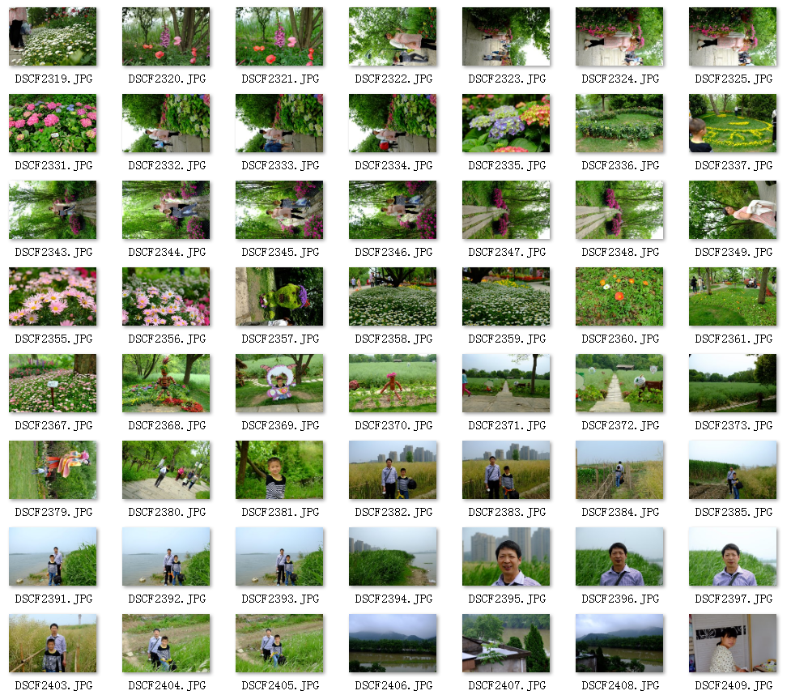  
  
建立图片表  
  
```
create table image (id serial, data bytea);
```
  
导入图片到数据库    
  
```
insert into image(data) select pg_read_binary_file('文件路径');
```
  
将图片转换成 patten 和 signature    
  
```
CREATE TABLE pat AS (
	SELECT
		id,
		shuffle_pattern(pattern) AS pattern, 
		pattern2signature(pattern) AS signature 
	FROM (
		SELECT 
			id, 
			jpeg2pattern(data) AS pattern 
		FROM 
			image
	) x 
);
```
  
创建索引  
  
```
ALTER TABLE pat ADD PRIMARY KEY (id);

CREATE INDEX pat_signature_idx ON pat USING gist (signature);
```
  
近似度查询，例如查询与id = :id的图像相似的图像，按相似度排行，取出前10条    
  
```sql
SELECT
	id,
	smlr
FROM
(
	SELECT
		id,
		pattern <-> (SELECT pattern FROM pat WHERE id = :id) AS smlr
	FROM pat
	WHERE id <> :id
	ORDER BY
		signature <-> (SELECT signature FROM pat WHERE id = :id)
	LIMIT 100
) x
ORDER BY x.smlr ASC 
LIMIT 10
```
  
这里可以用到KNN索引，快速按相似度排行输出结果。  
  
例子  
  
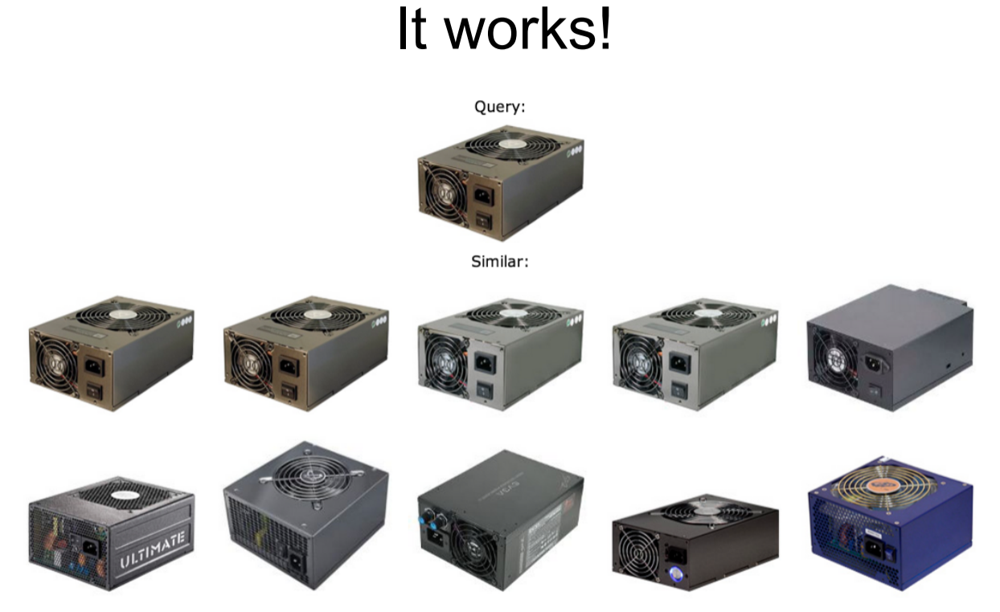  
  
  
  
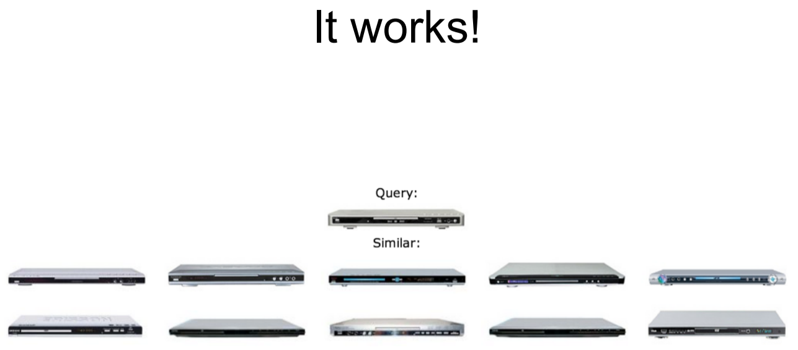  
  
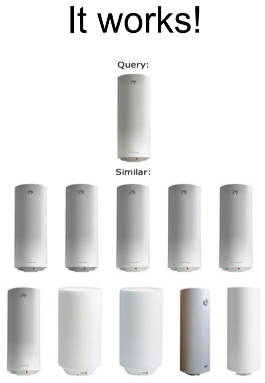  
  
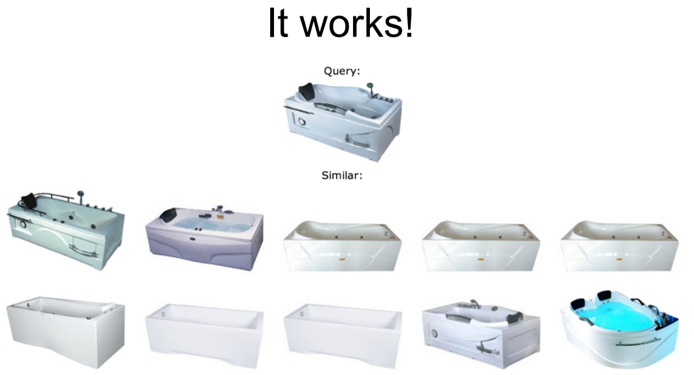  
  
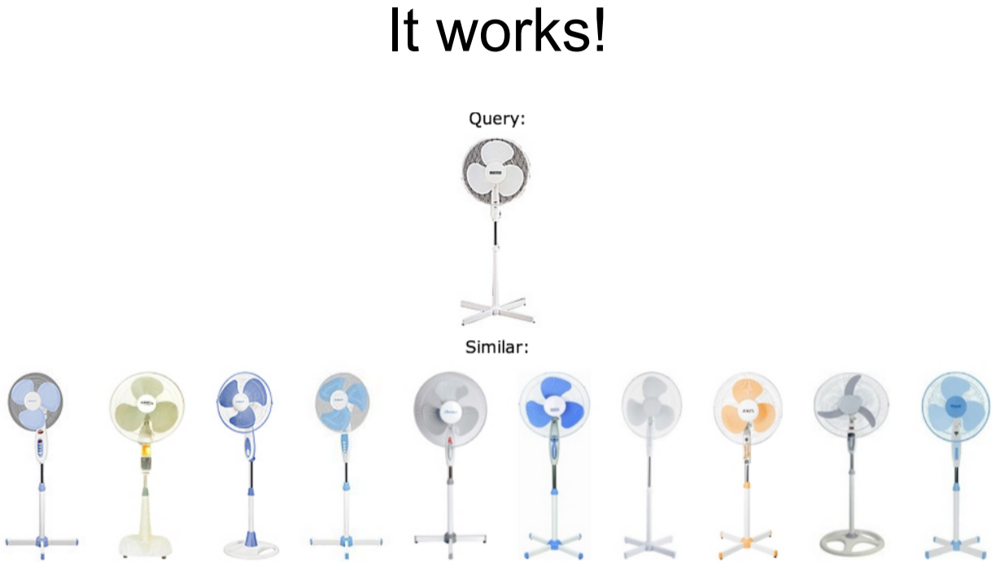  
  
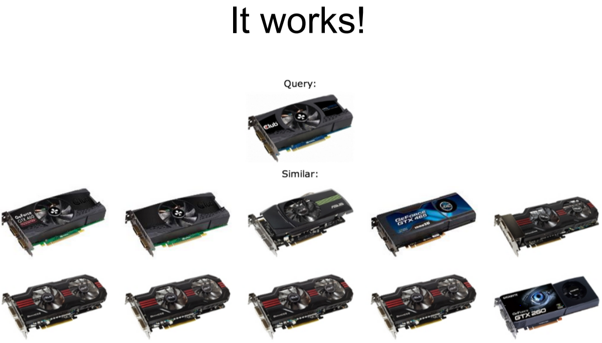  
  
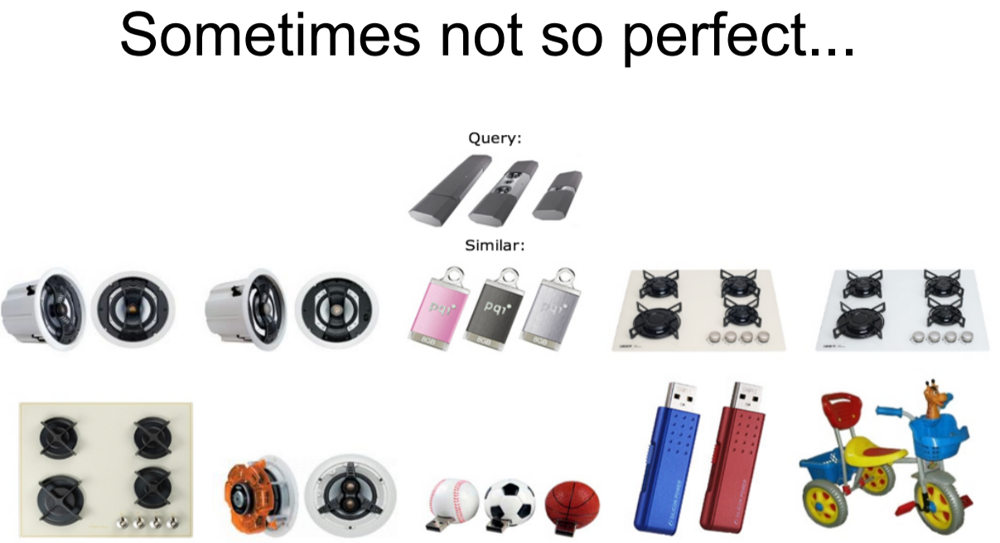  
  
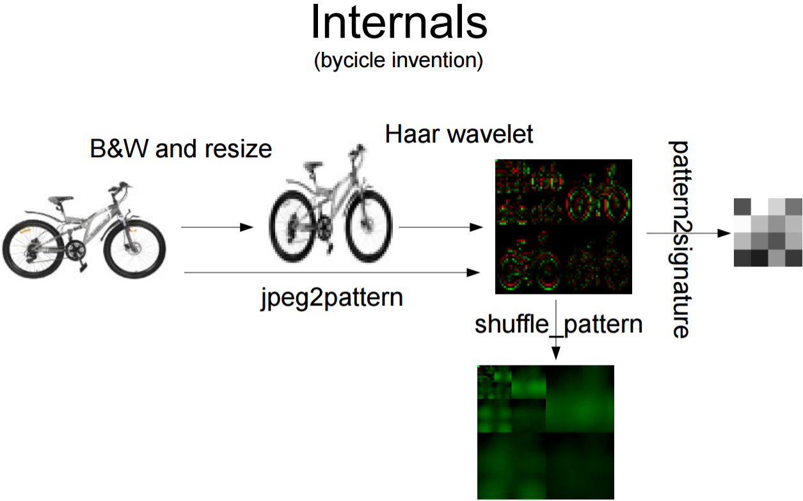  
  
## 视频去重业务
视频去重，可以抽取视频中的关键帧，自关联产生笛卡尔积，计算不同视频的任意两张图片的相似度，相似度达到一定阈值，可以认为是相同视频。    
  
例子  
  
```
创建图片表，并将所有视频的关键帧导入表中
create table image (id serial8 primary key, movie_id int, data bytea);

导入图片，假设为jpeg格式
... 略 ...

生成patten 和 signature
CREATE TABLE pat AS (
	SELECT
		id, movie_id,
		shuffle_pattern(pattern) AS pattern, 
		pattern2signature(pattern) AS signature 
	FROM (
		SELECT 
			id, movie_id,
			jpeg2pattern(data) AS pattern 
		FROM 
			image
	) x 
);

计算不同视频的相似度
select t1.movie_id, t1.id, t1.signature<->t2.signature from 
pat t1 join pat t2 on (t1.movie_id<>t2.movie_id) 
order by t1.signature<->t2.signature desc 

or 

select t1.movie_id, t1.id, t1.signature<->t2.signature from 
pat t1 join pat t2 on (t1.movie_id<>t2.movie_id) 
where t1.signature<->t2.signature > 0.9 
order by t1.signature<->t2.signature desc 
```
  
## 小结
1\. PostgreSQL是一个非常强大的数据库，功能高度可定制。而且不需要动到PostgreSQL的内核。  安全可靠。    
  
2\. 使用图像搜索的技术就是PostgreSQL功能扩展的例子，速度杠杠的，还记得我以前给出的关于地理位置近邻查询的性能指标吗。  
  
[《PostgreSQL 百亿地理位置数据 近邻查询毫秒级反馈》](https://yq.aliyun.com/articles/2999)  
  
3\. 如果你对PostgreSQL扩展开发感兴趣，可以参考我写的文章    
  
[《找对业务G点, 体验酸爽 - PostgreSQL内核扩展指南》](https://yq.aliyun.com/articles/55981)    
    
             
         
  
<a rel="nofollow" href="http://info.flagcounter.com/h9V1"  ></a>  
  
  
  
  
  
  
## [digoal's 大量PostgreSQL文章入口](https://github.com/digoal/blog/blob/master/README.md "22709685feb7cab07d30f30387f0a9ae")
  
