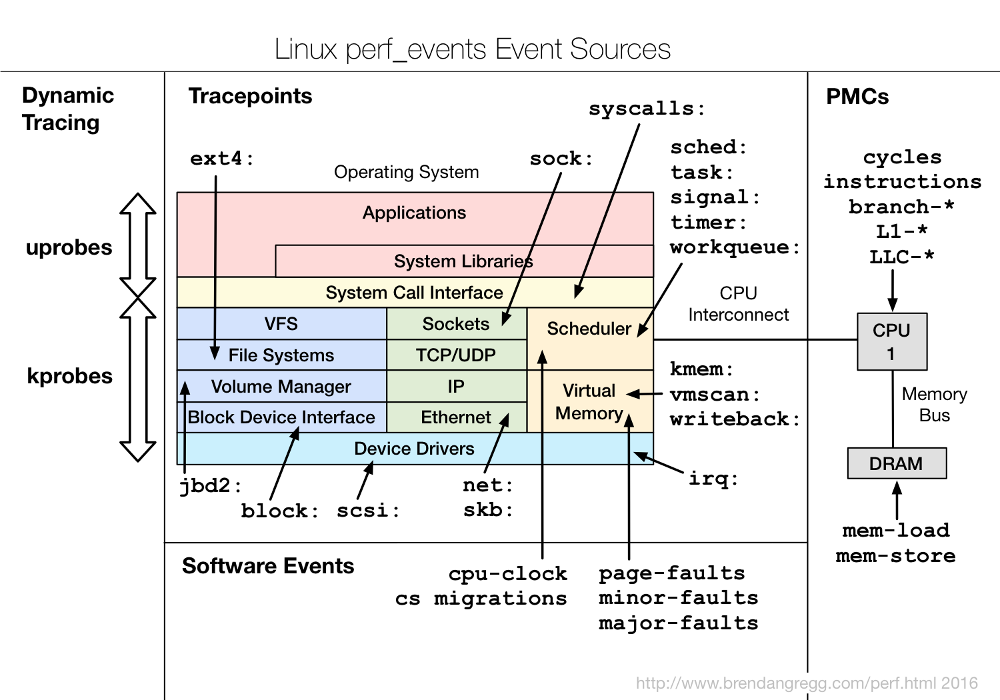
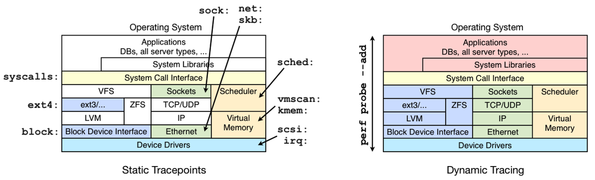
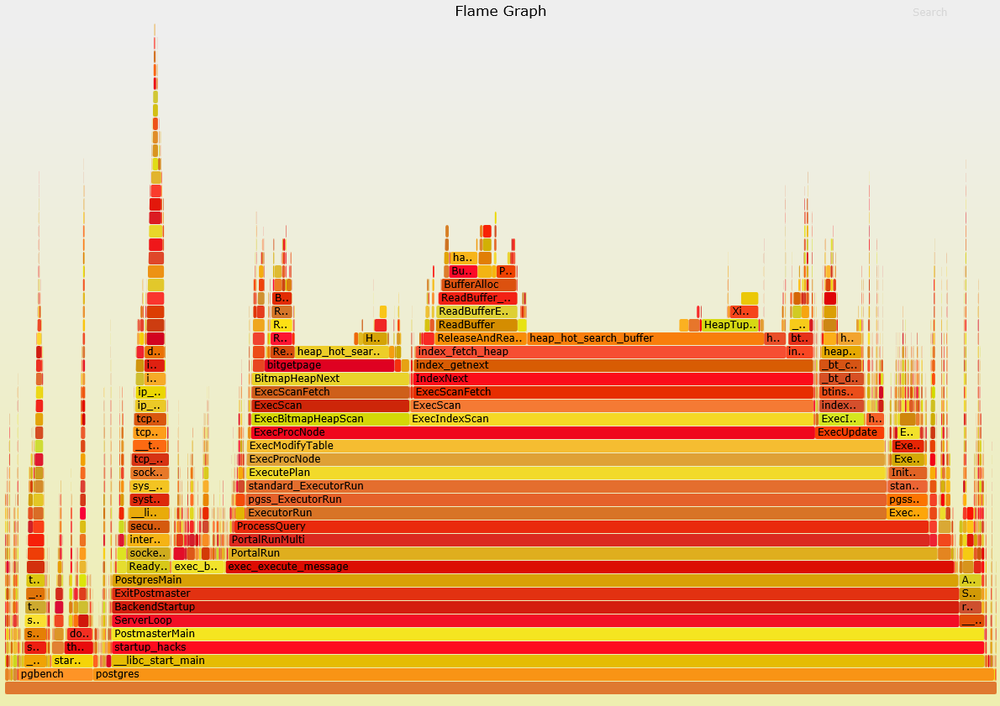
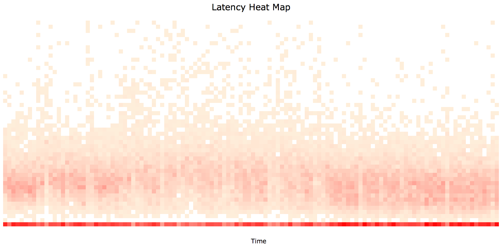

## Linux 性能诊断 perf使用指南
                                                          
### 作者                                                         
digoal                                                          
                                                          
### 日期                                                         
2016-11-27                                                              
                                                          
### 标签                                                        
Linux , perf , 性能诊断 , stap , systemtap , strace , dtrace , dwarf , profiler , perf_events                                                                                                          
                                                          
----                                                        
                     
## 背景    
Linux在服务端已占据非常大的比例，很多业务很多服务都跑在Linux上面。   
  
软件运行在Linux下，软件本身、以及Linux系统的性能诊断也成为热门的话题。   
  
例如，你要如何回答这些问题  
  
```
Why is the kernel on-CPU so much? What code-paths?  
  
Which code-paths are causing CPU level 2 cache misses?  
  
Are the CPUs stalled on memory I/O?  
  
Which code-paths are allocating memory, and how much?  
  
What is triggering TCP retransmits?  
  
Is a certain kernel function being called, and how often?  
  
What reasons are threads leaving the CPU?  
```
    
又或者你是一名DBA或者开发人员，想知道数据库在跑某些benchmark时，性能瓶颈在哪里，是IO，是等待，还是网络，代码瓶颈在哪里？   
    
在Linux下诊断的工具比较多，比如systemtap, dtrace, perf。  
    
本文将介绍一下perf的用法，网上很多叫法如perf_events , perf profiler , Performance Counters for Linux。叫法不同，都指perf。       
  
## 什么是perf
perf是Linux 2.6+内核中的一个工具，在内核源码包中的位置 tools/perf。  
   
perf利用Linux的trace特性，可以用于实时跟踪，统计event计数(perf stat)；或者使用采样(perf record)，报告(perf report|script|annotate)的使用方式进行诊断。   
   
perf命令行接口并不能利用所有的Linux trace特性，有些trace需要通过ftrace接口得到。   
  
参考 https://github.com/brendangregg/perf-tools  
  
## perf工作原理
    
    
这张图大致列出了perf支持的跟踪事件，从kernerl到user space，支持块设备、网络、CPU、文件系统、内存等，同时还支持系统调用，用户库的事件跟踪。  
  
你可以使用perf list输出当前内核perf 支持的预置events    
  
```
perf list

List of pre-defined events (to be used in -e):

  ref-cycles                                         [Hardware event]

  alignment-faults                                   [Software event]
  context-switches OR cs                             [Software event]
  cpu-clock                                          [Software event]
  cpu-migrations OR migrations                       [Software event]
  dummy                                              [Software event]
  emulation-faults                                   [Software event]
  major-faults                                       [Software event]
  minor-faults                                       [Software event]
  page-faults OR faults                              [Software event]
  task-clock                                         [Software event]

.....略.......

  writeback:writeback_pages_written                  [Tracepoint event]
  writeback:writeback_queue                          [Tracepoint event]
  writeback:writeback_task_start                     [Tracepoint event]
  writeback:writeback_task_stop                      [Tracepoint event]
```
  
### perf background
我们看到perf支持这么多的事件和trace，它依赖了很多的接口来干这件事情。  
  
1\. Symbols  
  
没有符号表，无法将内存地址翻译成函数和变量名。  
  
例如，无符号表的跟踪显示如下  
  
```
    57.14%     sshd  libc-2.15.so        [.] connect           
               |
               --- connect
                  |          
                  |--25.00%-- 0x7ff3c1cddf29
                  |          
                  |--25.00%-- 0x7ff3bfe82761
                  |          0x7ff3bfe82b7c
                  |          
                  |--25.00%-- 0x7ff3bfe82dfc
                   --25.00%-- [...]
```
  
有符号表的跟踪显示如下  
  
```
    57.14%     sshd  libc-2.15.so        [.] __GI___connect_internal
               |
               --- __GI___connect_internal
                  |          
                  |--25.00%-- add_one_listen_addr.isra.0
                  |          
                  |--25.00%-- __nscd_get_mapping
                  |          __nscd_get_map_ref
                  |          
                  |--25.00%-- __nscd_open_socket
                   --25.00%-- [...]
```
  
如何安装符号表?   
  
对于内核代码的符号表，在编译内核时，使用CONFIG_KALLSYMS=y。  检查如下  
  
```
# cat /boot/config-`uname -r` |grep CONFIG_KALLSYMS
CONFIG_KALLSYMS=y
CONFIG_KALLSYMS_ALL=y
CONFIG_KALLSYMS_EXTRA_PASS=y
```
   
对于用户安装软件的符号表，如果是yum安装的，可以安装对应的debuginfo包。  
   
如果是用户自己编译的，例如使用GCC编译时加上-g选项。  
  
2\. perf annotate  
  
perf annotate can generate sourcecode level information if the application is compiled with -ggdb.  
  
3\. Stack Traces  (使用perf record -g收集stack traces)  
  
要跟踪完整的stack，编译时需要注意几个东西。  
  
```
Always compile with frame pointers. 
Omitting frame pointers is an evil compiler optimization that breaks debuggers, and sadly, is often the default. 

Without them, you may see incomplete stacks from perf_events, like seen in the earlier sshd symbols example. 

There are two ways to fix this: 
either using dwarf data to unwind the stack, or returning the frame pointers.
```
  
3\.1 编译perf时包含libunwind和-g dwarf，需要3.9以上的内核版本。  
  
```
Since about the 3.9 kernel, perf_events has supported a workaround for missing frame pointers in user-level stacks: libunwind, which uses dwarf. 

This can be enabled using "-g dwarf".

man gcc
       -gdwarf-version
           Produce debugging information in DWARF format (if that is supported).  This is the format used by DBX on IRIX 6.  The value of version may be either 2 or 3; the default version is 3.

           Note that with DWARF version 2 some ports require, and will always use, some non-conflicting DWARF 3 extensions in the unwind tables.
```
    
3\.2 有些编译优化项会忽略frame pointer，所以编译软件时必须指定 -fno-omit-frame-pointer ，才能跟踪完整的stack trace.  
  
```
The earlier sshd example was a default build of OpenSSH, which uses compiler optimizations (-O2), which in this case has omitted the frame pointer. 

Here's how it looks after recompiling OpenSSH with -fno-omit-frame-pointer
```
  
3\.3 编译内核时包含 CONFIG_FRAME_POINTER=y  
  
总结一下，要愉快的跟踪更完备的信息，就要在编译软件时打开符号表的支持(gcc -g)，开启annotate的支持(gcc -ggdb)，以及Stack trace的支持(gcc -fno-omit-frame-pointer)。   
  
### perf pre-defined event说明
```
Hardware [Cache] Events: 
  CPU相关计数器
  CPU周期、指令重试，内存间隔周期、L2CACHE miss等
  These instrument low-level processor activity based on CPU performance counters. 
  For example, CPU cycles, instructions retired, memory stall cycles, level 2 cache misses, etc. 
  Some will be listed as Hardware Cache Events.

Software Events: 
  内核相关计数器
  These are low level events based on kernel counters. 
  For example, CPU migrations, minor faults, major faults, etc.

Tracepoint Events: 
  内核ftrace框架相关，例如系统调用，TCP事件，文件系统IO事件，块设备事件等。  
  根据LIBRARY归类。如sock表示socket事件。  
  This are kernel-level events based on the ftrace framework. These tracepoints are placed in interesting and logical locations of the kernel, so that higher-level behavior can be easily traced. 
  For example, system calls, TCP events, file system I/O, disk I/O, etc. 
  These are grouped into libraries of tracepoints; 
    eg, "sock:" for socket events, "sched:" for CPU scheduler events.

Dynamic Tracing: 
  动态跟踪，可以在代码中的任何位置创建事件跟踪节点。很好很强大。  
  内核跟踪使用kprobe，user-level跟踪使用uprobe。  
  Software can be dynamically instrumented, creating events in any location. 
  For kernel software, this uses the kprobes framework. 
  For user-level software, uprobes.

Timed Profiling: 
  采样频度，按指定频率采样，被用于perf record。  
  Snapshots can be collected at an arbitrary frequency, using perf record -FHz. 
  This is commonly used for CPU usage profiling, and works by creating custom timed interrupt events.
```
  
了解了perf event后，我们可以更精细的，有针对性的对事件进行跟踪，采样，报告。  
  
当然，你也可以不指定事件，全面采样。  
  
## build perf
例如centos你可以使用yum安装，也可以使用源码安装。  
  
perf在内核源码的tools/perf中，所以下载与你的内核大版本一致的内核源码即可  
  
```
uname -a 

wget https://cdn.kernel.org/pub/linux/kernel/v3.x/linux-3.10.104.tar.xz

tar -xvf linux-3.10.104.tar.xz

cd linux-3.10.104/tools/perf/
```
  
安装依赖库，有一个小窍门可以找到依赖的库  
  
```
$cat Makefile |grep found

                msg := $(warning No libelf found, disables 'probe' tool, please install elfutils-libelf-devel/libelf-dev);
                msg := $(error No gnu/libc-version.h found, please install glibc-dev[el]/glibc-static);
                msg := $(warning No libdw.h found or old libdw.h found or elfutils is older than 0.138, disables dwarf support. Please install new elfutils-devel/libdw-dev);
        msg := $(warning No libunwind found, disabling post unwind support. Please install libunwind-dev[el] >= 0.99);
                msg := $(warning No libaudit.h found, disables 'trace' tool, please install audit-libs-devel or libaudit-dev);
                msg := $(warning slang not found, disables TUI support. Please install slang-devel or libslang-dev);
                msg := $(warning GTK2 not found, disables GTK2 support. Please install gtk2-devel or libgtk2.0-dev);
  $(if $(1),$(warning No $(1) was found))
                                                msg := $(warning No bfd.h/libbfd found, install binutils-dev[el]/zlib-static to gain symbol demangling)
                msg := $(warning No numa.h found, disables 'perf bench numa mem' benchmark, please install numa-libs-devel or libnuma-dev);
```
  
通常依赖 gcc make bison flex elfutils libelf-dev libdw-dev libaudit-dev python-dev binutils-dev  
  
### perf依赖的kernel宏
并不是每个开关都需要，但是有些没有就不方便或者功能缺失，例如没有打开符号表的话，看到的是一堆内存地址。  
  
```
# for perf_events:
CONFIG_PERF_EVENTS=y
# for stack traces:
CONFIG_FRAME_POINTER=y
# kernel symbols:
CONFIG_KALLSYMS=y
# tracepoints:
CONFIG_TRACEPOINTS=y
# kernel function trace:
CONFIG_FTRACE=y
# kernel-level dynamic tracing:
CONFIG_KPROBES=y
CONFIG_KPROBE_EVENTS=y
# user-level dynamic tracing:
CONFIG_UPROBES=y
CONFIG_UPROBE_EVENTS=y
# full kernel debug info:
CONFIG_DEBUG_INFO=y
# kernel lock tracing:
CONFIG_LOCKDEP=y
# kernel lock tracing:
CONFIG_LOCK_STAT=y
# kernel dynamic tracepoint variables:
CONFIG_DEBUG_INFO=y
```
  
一些开关的用途介绍  
  
1\. Kernel-level symbols are in the kernel debuginfo package, or when the kernel is compiled with CONFIG_KALLSYMS.  
  
2\. The kernel stack traces are incomplete. Now a similar profile with CONFIG_FRAME_POINTER=y  
  
3\. 当我们使用perf record [stack traces (-g)]时，可以跟踪stack，但是如果内核编译时没有指定CONFIG_FRAME_POINTER=y，perf report时就会看到缺失的信息。  
  
不包含CONFIG_FRAME_POINTER=y时  
  
```
    99.97%  swapper  [kernel.kallsyms]  [k] default_idle
            |
            --- default_idle

     0.03%     sshd  [kernel.kallsyms]  [k] iowrite16   
               |
               --- iowrite16
                   __write_nocancel
                   (nil)
```
  
包含CONFIG_FRAME_POINTER=y时  （Much better -- the entire path from the write() syscall (__write_nocancel) to iowrite16() can be seen.）  
  
```
    99.97%  swapper  [kernel.kallsyms]  [k] default_idle
            |
            --- default_idle
                cpu_idle
               |          
               |--87.50%-- start_secondary
               |          
                --12.50%-- rest_init
                          start_kernel
                          x86_64_start_reservations
                          x86_64_start_kernel

     0.03%     sshd  [kernel.kallsyms]  [k] iowrite16
               |
               --- iowrite16
                   vp_notify
                   virtqueue_kick
                   start_xmit
                   dev_hard_start_xmit
                   sch_direct_xmit
                   dev_queue_xmit
                   ip_finish_output
                   ip_output
                   ip_local_out
                   ip_queue_xmit
                   tcp_transmit_skb
                   tcp_write_xmit
                   __tcp_push_pending_frames
                   tcp_sendmsg
                   inet_sendmsg
                   sock_aio_write
                   do_sync_write
                   vfs_write
                   sys_write
                   system_call_fastpath
                   __write_nocancel
```
  
4\. 如果要使用动态跟踪，即跟踪任意指定代码，则需要打开这些开关:  
  
For kernel analysis, using CONFIG_KPROBES=y and CONFIG_KPROBE_EVENTS=y, to enable kernel dynamic tracing. and CONFIG_FRAME_POINTER=y, for frame pointer-based kernel stacks.   
  
For user-level analysis, CONFIG_UPROBES=y and CONFIG_UPROBE_EVENTS=y, for user-level dynamic tracing.  
  
5\. 如果打开了CONFIG_DEBUG_INFO，则可以在动态跟踪中打印内核变量的值。  
  
If your kernel has debuginfo (CONFIG_DEBUG_INFO=y), you can fish out kernel variables from functions. This is a simple example of examining a size_t (integer)  
  
例如  
  
```
1. Listing variables available for tcp_sendmsg():

# perf probe -V tcp_sendmsg
Available variables at tcp_sendmsg
        @<tcp_sendmsg+0>
                size_t  size
                struct kiocb*   iocb
                struct msghdr*  msg
                struct sock*    sk

2. Creating a probe for tcp_sendmsg() with the "size" variable:

# perf probe --add 'tcp_sendmsg size'
Added new event:
  probe:tcp_sendmsg    (on tcp_sendmsg with size)

3. You can now use it in all perf tools, such as: 

	perf record -e probe:tcp_sendmsg -aR sleep 1
```
  
通过以下命令可以查看linux的config  
  
```
cat /boot/config-`uname -r`

#
# Automatically generated make config: don't edit
# Linux kernel version: 2.6.32-573.el6.x86_64
# Thu Jul 23 15:38:20 2015
#
CONFIG_64BIT=y
# CONFIG_X86_32 is not set
CONFIG_X86_64=y
CONFIG_X86=y
CONFIG_OUTPUT_FORMAT="elf64-x86-64"
CONFIG_ARCH_DEFCONFIG="arch/x86/configs/x86_64_defconfig"
CONFIG_GENERIC_CMOS_UPDATE=y
.......
```
    
## perf使用说明
### perf --help
先了解一下概貌  
  
perf 命令用法还是挺简单的，根据功能区分了COMMAND，每个COMMAND有各自的用法。    
  
用得比较多的有list, record, report, script, stat, top。    
  
```
 usage: perf [--version] [--help] [OPTIONS] COMMAND [ARGS]

 The most commonly used perf commands are:
   annotate        Read perf.data (created by perf record) and display annotated code
   archive         Create archive with object files with build-ids found in perf.data file
   bench           General framework for benchmark suites
   buildid-cache   Manage build-id cache.
   buildid-list    List the buildids in a perf.data file
   data            Data file related processing
   diff            Read perf.data files and display the differential profile
   evlist          List the event names in a perf.data file
   inject          Filter to augment the events stream with additional information
   kmem            Tool to trace/measure kernel memory properties
   kvm             Tool to trace/measure kvm guest os
   list            List all symbolic event types
   lock            Analyze lock events
   mem             Profile memory accesses
   record          Run a command and record its profile into perf.data
   report          Read perf.data (created by perf record) and display the profile
   sched           Tool to trace/measure scheduler properties (latencies)
   script          Read perf.data (created by perf record) and display trace output
   stat            Run a command and gather performance counter statistics
   test            Runs sanity tests.
   timechart       Tool to visualize total system behavior during a workload
   top             System profiling tool.
   probe           Define new dynamic tracepoints
   trace           strace inspired tool

 See 'perf help COMMAND' for more information on a specific command.
```
  
### perf help COMMAND
要得到每个command的用法也蛮简单，可以使用perf help COMMAND得到。  
  
例如  
  
```
perf help record

PERF-RECORD(1)                    perf Manual                   PERF-RECORD(1)

NAME
       perf-record - Run a command and record its profile into perf.data

SYNOPSIS
       perf record [-e <EVENT> | --event=EVENT] [-l] [-a] <command>
       perf record [-e <EVENT> | --event=EVENT] [-l] [-a] — <command> [<options>]

DESCRIPTION
       This command runs a command and gathers a performance counter profile from it, into perf.data - without displaying anything.

       This file can then be inspected later on, using perf report.

OPTIONS
       <command>...
           Any command you can specify in a shell.
.....
```
   
### perf top跟踪实时信息
跟踪时可以指定事件，CPU，以及是否跟踪stack trace。   
  
```
perf top -ag 

       -a, --all-cpus
           System-wide collection. (default)
       -g
           Enables call-graph (stack chain/backtrace) recording.
```
  
输出如下  
  
```
Samples: 240  of event 'cpu-clock', Event count (approx.): 19122881                                                                                                                                                                          
  Children      Self  Shared Object      Symbol  
+   14.64%    14.64%  [kernel]           [k] _spin_unlock_irqrestore   
+   10.91%    10.91%  libslang.so.2.2.1  [.] SLtt_smart_puts       
+    6.02%     6.02%  perf               [.] symbols__insert   
+    6.02%     6.02%  [kernel]           [k] kallsyms_expand_symbol   
+    6.01%     6.01%  [kernel]           [k] copy_page   
+    3.96%     0.64%  libc-2.12.so       [.] _int_malloc   
+    3.61%     3.61%  [kernel]           [k] number          
+    3.31%     3.31%  [kernel]           [k] clear_page   
+    2.71%     2.71%  [kernel]           [k] pointer     
....       
```
  
输入 ? 可以得到top的帮助介绍  
  
```
│                                                                                     
│UP/DOWN/PGUP                                                 │
│PGDN/SPACE    Navigate                                       │
│q/ESC/CTRL+C  Exit browser                                   │
│                                                             │
│For multiple event sessions:                                 │
│                                                             │
│TAB/UNTAB     Switch events                                  │
│                                                             │
│For symbolic views (--sort has sym):                         │
│                                                             │
│->            Zoom into DSO/Threads & Annotate current symbol│
│<-            Zoom out                                       │
│a             Annotate current symbol                        │
│C             Collapse all callchains                        │
│d             Zoom into current DSO                          │
│E             Expand all callchains                          │
│F             Toggle percentage of filtered entries          │
│H             Display column headers                         │
│P             Print histograms to perf.hist.N                │
│t             Zoom into current Thread                       │
│V             Verbose (DSO names in callchains, etc)         │
│z             Toggle zeroing of samples                      │
│/             Filter symbol by name
```
  
输入E全部展开，展开后可以得到stack trace的结果, 如果发现有地址的信息，但是没有符号表的信息，可能是软件编译时没有指定-g，如果stack信息不完整，则软件编译时需要加-fno-omit-frame-pointer(参考前面章节的介绍)。       
  
```
Samples: 1K of event 'cpu-clock', Event count (approx.): 17510648      
  Children      Self  Shared Object        Symbol                      
-   28.51%    28.51%  [kernel]             [k] _spin_unlock_irqrestore 
   -→_spin_unlock_irqrestore [kernel] 
        17.24% __write_nocancel libc-2.12.so                                                                                                                               
        13.79% 0xe7cd libpthread-2.12.so                               
        10.34% 0x7f670b15b923 unknown                                  
        10.34% __fdatasync_nocancel libc-2.12.so                       
           0x1b00000017 unknown        4                               
        10.34% __libc_fork libc-2.12.so                                
        6.90% __select libc-2.12.so                                    
        3.45% 0x7f670b15b822 unknown                                   
        3.45% 0x7f670b14d560 unknown                                   
        3.45% 0x7f670b11ede7 unknown                                   
        3.45% 0x7f670b11eb5d unknown                                   
           0x2ad1 pam_unix.so                                          
           0xdcdd4c000000000 unknown                                   
        3.45% __clone libc-2.12.so                                     
        3.45% __libc_writev libc-2.12.so                               
        3.45% __read_nocancel libc-2.12.so                             
        3.45% 0x7b294 libslang.so.2.2.1                                
        3.45% 0x7efee6ee2560 unknown   
```
  
输入C全部收起    
  
```
Samples: 240  of event 'cpu-clock', Event count (approx.): 19122881                                                                                                                                                                          
  Children      Self  Shared Object      Symbol  
+   14.64%    14.64%  [kernel]           [k] _spin_unlock_irqrestore   
+   10.91%    10.91%  libslang.so.2.2.1  [.] SLtt_smart_puts       
+    6.02%     6.02%  perf               [.] symbols__insert   
+    6.02%     6.02%  [kernel]           [k] kallsyms_expand_symbol   
+    6.01%     6.01%  [kernel]           [k] copy_page   
+    3.96%     0.64%  libc-2.12.so       [.] _int_malloc   
+    3.61%     3.61%  [kernel]           [k] number          
+    3.31%     3.31%  [kernel]           [k] clear_page   
+    2.71%     2.71%  [kernel]           [k] pointer     
....    
```
  
Symbol列[]中字符代表的含义如下，通常是k或者.表示kernel和user space事件。     
  
```
[.]: user level
[k]: kernel level
[g]: guest kernel level (virtualization)
[u]: guest os user space
[H]: hypervisor
```
  
### perf record 收集统计信息
perf record用来收集统计信息，通常的用法包括    
  
1\. 使用record收集统计信息，可以收集全局的，指定PID或者线程ID的，指定CPU的，指定USER ID的。   
  
```
       -a, --all-cpus
           System-wide collection from all CPUs.
       -p, --pid=
           Record events on existing process ID (comma separated list).
       -t, --tid=
           Record events on existing thread ID (comma separated list). This option also disables inheritance by default. Enable it by adding --inherit.
       -u, --uid=
           Record events in threads owned by uid. Name or number.
```
   
2\. 收集间隔，可以指定采样的频率，采样的EVENT数，采样时间。    
  
```
       -c, --count=
           Event period to sample.
       -F, --freq=
           Profile at this frequency.
```
  
3\. 采集的详细程度，可以指定event，使用CPU实时调度策略的进程（可以参考RHEL 讲CGROUP cpu部分的文章），是否跟踪stack chain，  
  
```
       -r, --realtime=
           Collect data with this RT SCHED_FIFO priority.
       -g
           Enables call-graph (stack chain/backtrace) recording.
       --call-graph
           Setup and enable call-graph (stack chain/backtrace) recording, implies -g.

               Allows specifying "fp" (frame pointer) or "dwarf"
               (DWARF′s CFI - Call Frame Information) or "lbr"
               (Hardware Last Branch Record facility) as the method to collect
               the information used to show the call graphs.

               In some systems, where binaries are build with gcc
               --fomit-frame-pointer, using the "fp" method will produce bogus
               call graphs, using "dwarf", if available (perf tools linked to
               the libunwind library) should be used instead.
               Using the "lbr" method doesn′t require any compiler options. It
               will produce call graphs from the hardware LBR registers. The
               main limition is that it is only available on new Intel
               platforms, such as Haswell. It can only get user call chain. It
               doesn′t work with branch stack sampling at the same time.
       -e, --event=
           Select the PMU event. Selection can be:
           ·   a symbolic event name (use perf list to list all events)
           ·   a raw PMU event (eventsel+umask) in the form of rNNN where NNN is a hexadecimal event descriptor.
           ·   a symbolically formed PMU event like pmu/param1=0x3,param2/ where param1, param2, etc are defined as formats for the PMU in /sys/bus/event_sources/devices/<pmu>/format/*.
           ·   a symbolically formed event like pmu/config=M,config1=N,config3=K/
                   where M, N, K are numbers (in decimal, hex, octal format). Acceptable
                   values for each of ′config′, ′config1′ and ′config2′ are defined by
                   corresponding entries in /sys/bus/event_sources/devices/<pmu>/format/*
                   param1 and param2 are defined as formats for the PMU in:
                   /sys/bus/event_sources/devices/<pmu>/format/*
           ·   a group of events surrounded by a pair of brace ("{event1,event2,...}"). Each event is separated by commas and the group should be quoted to prevent the shell interpretation. You also need to use
               --group on "perf report" to view group events together.
       --filter=<filter>
           Event filter.
```
  
例子  
  
```
开始跑一个benchmark，同时收集统计信息(指定-a, -g选项)。  
CFLAGS='-g -ggdb -fno-omit-frame-pointer' ./configure --prefix=/home/digoal/pgsql9.6
make world -j 32
make install-world -j 32
初始化略
pgbench -i -s 100

跟踪
perf record -ag  

Ctrl-C，退出perf record，统计信息已输出到perf.data。  
```
  
### perf report
解读前面收集到的perf.data.  
  
常用的开关如下，--tui是交互式的文本显示窗口，--stdio是文本显示窗口。   
  
```
       -i, --input=
           Input file name. (default: perf.data)
       -v, --verbose
           Be more verbose. (show symbol address, etc)
       -n, --show-nr-samples
           Show the number of samples for each symbol
       -g [type,min], --call-graph
           Display call chains using type and min percent threshold. type can be either:
           ·   flat: single column, linear exposure of call chains.
           ·   graph: use a graph tree, displaying absolute overhead rates.
           ·   fractal: like graph, but displays relative rates. Each branch of the tree is considered as a new profiled object.
               Default: fractal,0.5.
       --stdio
           Use the stdio interface.
       --tui
           Use the TUI interface, that is integrated with annotate and allows zooming into DSOs or threads, among other features. Use of --tui requires a tty, if one is not present, as when piping to other
           commands, the stdio interface is used.
```
  
交互式显示例子，看概貌挺方便的 (常用的交互命令:  E扩展，C收敛，q退出)  
   
```
#perf report -g --tui

Events: 52K cycles
+     11.17%         postgres  postgres                             [.] hash_seq_search     [.]表示user call, [k]表示kernel call
+      4.41%          pgbench  libc-2.12.so                         [.] __GI_vfprintf                           
+      4.02%         postgres  postgres                             [.] NextCopyFrom                            
+      3.27%         postgres  [kernel.kallsyms]                    [k] copy_user_generic_string                
+      2.83%         postgres  postgres                             [.] CopyReadLineText                        
+      2.25%         postgres  postgres                             [.] pg_comp_crc32c_sse42                    
+      2.18%         postgres  libc-2.12.so                         [.] memcpy                                  
+      1.99%         postgres  postgres                             [.] CopyReadAttributesText                  
+      1.72%         postgres  [xfs]                                [k] ftrace_raw_init_event_xfs_dir2_leafn_add
+      1.65%         postgres  postgres                             [.] heap_fill_tuple                         
+      1.52%         postgres  libc-2.12.so                         [.] __GI_____strtoll_l_internal             
+      1.26%         postgres  postgres                             [.] heap_form_tuple                         
+      1.22%          pgbench  libc-2.12.so                         [.] _IO_default_xsputn_internal             
+      1.17%         postgres  postgres                             [.] AllocSetAlloc                           
+      1.16%         postgres  postgres                             [.] heap_compute_data_size                  
+      1.10%         postgres  postgres                             [.] heap_multi_insert                       
+      1.03%         postgres  postgres                             [.] pg_atoi                                 
+      1.03%         postgres  libc-2.12.so                         [.] __memset_sse2                           
+      1.01%         postgres  postgres                             [.] pg_verify_mbstr_len                     
+      0.95%          pgbench  libc-2.12.so                         [.] _itoa_word                              
+      0.89%         postgres  postgres                             [.] int4in                                  
+      0.83%         postgres  postgres                             [.] resetStringInfo                         
+      0.81%         postgres  postgres                             [.] InputFunctionCall                       
+      0.81%         postgres  postgres                             [.] hash_search_with_hash_value             
+      0.79%         postgres  postgres                             [.] ExecConstraints                         
+      0.71%         postgres  postgres                             [.] CopyFrom                                
+      0.71%          pgbench  libc-2.12.so                         [.] __strchrnul                             
+      0.67%         postgres  postgres                             [.] PageAddItemExtended                     
+      0.66%         postgres  [kernel.kallsyms]                    [k] find_get_page                           
+      0.65%         postgres  postgres                             [.] CopyReadLine                            
+      0.62%         postgres  [kernel.kallsyms]                    [k] page_fault                              
+      0.58%         postgres  postgres                             [.] heap_prepare_insert                     
+      0.57%         postgres  postgres                             [.] heap_prune_chain                        
+      0.52%         postgres  postgres                             [.] bpcharin                                
+      0.52%          pgbench  libpq.so.5.9                         [.] PQputCopyData                           
+      0.52%         postgres  postgres                             [.] AllocSetFreeIndex                       
+      0.52%         postgres  postgres                             [.] pq_getbytes                             
+      0.51%         postgres  postgres                             [.] RelationPutHeapTuple                    
+      0.49%         postgres  postgres                             [.] BufferGetBlockNumber                    
+      0.47%         postgres  postgres                             [.] enlargeStringInfo                       
+      0.47%         postgres  postgres                             [.] bpchar_input                            
+      0.46%         postgres  postgres                             [.] CopyGetData                             
+      0.45%         postgres  postgres                             [.] lazy_scan_heap                          
+      0.45%         postgres  [kernel.kallsyms]                    [k] radix_tree_lookup_slot                  
+      0.44%          pgbench  libpq.so.5.9                         [.] PQputline                               
+      0.44%         postgres  postgres                             [.] CopyLoadRawBuf                          
+      0.42%         postgres  postgres                             [.] HeapTupleSatisfiesVacuum                
+      0.42%         postgres  [kernel.kallsyms]                    [k] _spin_lock_irq                          
+      0.42%         postgres  [kernel.kallsyms]                    [k] list_del                                
+      0.38%       flush-8:16  [xfs]                                [k] ftrace_raw_init_event_xfs_dir2_leafn_add
+      0.37%         postgres  postgres                             [.] ExecStoreTuple                          
+      0.36%         postgres  postgres                             [.] appendBinaryStringInfo                  
+      0.35%         postgres  postgres                             [.] pq_getmessage                           
+      0.35%          pgbench  libpq.so.5.9                         [.] pqPutMsgEnd                             
Press '?' for help on key bindings
```
  
文本显示例子，看细节挺方便  
  
```
#perf report -v -n --showcpuutilization -g --stdio
```
   
首先显示了一些异常，如果你发现少了符号表或者什么的，可以根据提示安装debuginfo，或者重新编译内核或软件。    
    
```
Looking at the vmlinux_path (6 entries long)
dso__load_sym: cannot get elf header.
Using /proc/kallsyms for symbols
Looking at the vmlinux_path (6 entries long)
No kallsyms or vmlinux with build-id 3187a0b0fc53e27c19f9fad3e63f9437402e5548 was found
[bianque_driver] with build id 3187a0b0fc53e27c19f9fad3e63f9437402e5548 not found, continuing without symbols
Looking at the vmlinux_path (6 entries long)
No kallsyms or vmlinux with build-id e6c06734499e665685cd28ac846d8d69d95cce8c was found
[missing_slash] with build id e6c06734499e665685cd28ac846d8d69d95cce8c not found, continuing without symbols
/lib64/ld-2.12.so was updated, restart the long running apps that use it!
/usr/lib64/libsyslog-ng-3.6.so.0.0.0 was updated, restart the long running apps that use it!
/disk1/gpdb_20160101/bin/postgres was updated, restart the long running apps that use it!
Looking at the vmlinux_path (6 entries long)
No kallsyms or vmlinux with build-id 253ed41ca3926c96e4181ac4df30cf3cde868089 was found
[pdeath_signal] with build id 253ed41ca3926c96e4181ac4df30cf3cde868089 not found, continuing without symbols
no symbols found in /sbin/iscsid, maybe install a debug package?
no symbols found in /bin/egrep, maybe install a debug package?
no symbols found in /usr/sbin/dmidecode, maybe install a debug package?
/opt/aegis/lib64/aegis_monitor.so was updated, restart the long running apps that use it!
```
   
报告的细节如下  
  
```
# Events: 52K cycles
#
# Overhead  Samples    sys    us            Command                                   Shared Object                                                               
# 事件百分比 采样百分比  系统消耗占比  系统消耗u秒  命令  共享对象
# ........ ..........  ...............  ............................................  ...............................................................
#

第一条
   事件百分比  采样百分比  系统消耗占比  系统消耗u秒    命令                                         共享对象             
    11.17%     0.00%     5.56%       2173               postgres                              /home/digoal/pgsql9.6/bin/postgres       0x50eb35         B [.] hash_seq_search
                   |
                   --- hash_seq_search  (输出call stack trace，需要在编译软件时开启-g开关, -fno-omit-frame-pointer开关)
                       GetRunningTransactionLocks
                       LogStandbySnapshot    (有两个分支会调用 LogStandbySnapshot)
                      |          
                      |--50.23%-- CreateCheckPoint    (分支开销占比)
                      |          CheckpointerMain
                      |          AuxiliaryProcessMain
                      |          StartChildProcess
                      |          reaper
                      |          __restore_rt
                      |          PostmasterMain
                      |          startup_hacks
                      |          __libc_start_main
                      |          
                       --49.77%-- BackgroundWriterMain  (分支开销占比)
                                 AuxiliaryProcessMain
                                 StartChildProcess
                                 reaper
                                 __restore_rt
                                 PostmasterMain
                                 startup_hacks
                                 __libc_start_main

下面这条全部是系统开销  
     4.41%     0.00%     4.41%       1808            pgbench                                   /lib64/libc-2.12.so                          0x44005          B [.] __GI_vfprintf
                    |
                    --- __GI_vfprintf
                       |          
                       |--99.48%-- __vsnprintf
                       |          |          
后面。。。。。。略
```
   
### perf script
一条条打印perf.data内的数据，输出的是perf record收集到的原始数据。  
  
生成热力图、火焰图也需要perf script的输出，从最原始的信息中提取数据，生成svg。    
  
```
perf-script - Read perf.data (created by perf record) and display trace output  
  
主要的options
       -G, --hide-call-graph
           When printing symbols do not display call chain.
    -v, --verbose         be more verbose (show symbol address, etc)
    -L, --Latency         show latency attributes (irqs/preemption disabled, etc)
    -d, --debug-mode      do various checks like samples ordering and lost events
    -D, --dump-raw-trace  dump raw trace in ASCII

#perf script -v -G|wc -l
52958 

刚好等于前面使用perf report输出的# Events: 52K cycles  

详细内容就不列出了，非常多  
```
  
### perf annotate
解读前面收集到的perf.data，辅以汇编指令显示。      
  
```
perf-annotate - Read perf.data (created by perf record) and display annotated code  

       -i, --input=
           Input file name. (default: perf.data)
       -v, --verbose
           Be more verbose. (Show symbol address, etc)
       -D, --dump-raw-trace
           Dump raw trace in ASCII.
       -l, --print-line
           Print matching source lines (may be slow).
       -P, --full-paths
           Don’t shorten the displayed pathnames.
       --stdio
           Use the stdio interface.
       --tui
           Use the TUI interface Use of --tui requires a tty, if one is not present, as when piping to other commands, the stdio interface is used. This interfaces starts by centering on the line with more
           samples, TAB/UNTAB cycles through the lines with more samples.
```
  
例子  
  
```
Sorted summary for file /home/digoal/pgsql9.6/bin/postgres
----------------------------------------------

   32.43 /home/digoal/postgresql-9.6.1/src/backend/utils/hash/dynahash.c:1403 (discriminator 1)
   16.20 /home/digoal/postgresql-9.6.1/src/backend/utils/hash/dynahash.c:1403 (discriminator 1)
   14.16 /home/digoal/postgresql-9.6.1/src/backend/utils/hash/dynahash.c:1403 (discriminator 1)
   10.68 /home/digoal/postgresql-9.6.1/src/backend/utils/hash/dynahash.c:1406
   10.68 /home/digoal/postgresql-9.6.1/src/backend/utils/hash/dynahash.c:1403 (discriminator 1)
    9.97 /home/digoal/postgresql-9.6.1/src/backend/utils/hash/dynahash.c:1412
    3.76 /home/digoal/postgresql-9.6.1/src/backend/utils/hash/dynahash.c:1403 (discriminator 1)
 Percent |      Source code & Disassembly of /home/digoal/pgsql9.6/bin/postgres
------------------------------------------------
                          50eac0: 466
                          50eac4: 1
                          50eac7: 3
                          50eaca: 1
                          50eaec: 435
                          50eaf5: 12
                          50eafb: 7
                          50eb00: 20
                          50eb08: 5
                          50eb10: 8
                          50eb14: 1
                          50eb18: 5
                          50eb1b: 4
                          50eb1e: 15
                          50eb22: 466
                          50eb26: 2
                          50eb2e: 2
                          50eb32: 6
                          50eb35: 618
                          50eb38: 707
                          50eb3c: 164
                          50eb41: 1415
                          h->sum: 4363
         :
         :
         :
         :      Disassembly of section .text:
         :
         :      000000000090e9cc <hash_seq_search>:
         :                      register_seq_scan(hashp);
         :      }
         :
         :      void *
         :      hash_seq_search(HASH_SEQ_STATUS *status)
         :      {
    0.00 :        90e9cc:       55                      push   %rbp
    0.00 :        90e9cd:       48 89 e5                mov    %rsp,%rbp
    0.00 :        90e9d0:       48 83 ec 60             sub    $0x60,%rsp
    0.00 :        90e9d4:       48 89 7d a8             mov    %rdi,-0x58(%rbp)
         :              long            segment_ndx;
         :              HASHSEGMENT segp;
         :              uint32          curBucket;
         :              HASHELEMENT *curElem;
         :
         :              if ((curElem = status->curEntry) != NULL)
    0.00 :        90e9d8:       48 8b 45 a8             mov    -0x58(%rbp),%rax
    0.00 :        90e9dc:       48 8b 40 10             mov    0x10(%rax),%rax
    0.00 :        90e9e0:       48 89 45 d8             mov    %rax,-0x28(%rbp)
    0.00 :        90e9e4:       48 83 7d d8 00          cmpq   $0x0,-0x28(%rbp)
    0.00 :        90e9e9:       74 3a                   je     90ea25 <hash_seq_search+0x59>
         :              {
         :                      /* Continuing scan of curBucket... */
         :                      status->curEntry = curElem->link;
    0.00 :        90e9eb:       48 8b 45 d8             mov    -0x28(%rbp),%rax
    0.00 :        90e9ef:       48 8b 10                mov    (%rax),%rdx
    0.00 :        90e9f2:       48 8b 45 a8             mov    -0x58(%rbp),%rax
    0.00 :        90e9f6:       48 89 50 10             mov    %rdx,0x10(%rax)
         :                      if (status->curEntry == NULL)   /* end of this bucket */
    0.00 :        90e9fa:       48 8b 45 a8             mov    -0x58(%rbp),%rax
    0.00 :        90e9fe:       48 8b 40 10             mov    0x10(%rax),%rax
    0.00 :        90ea02:       48 85 c0                test   %rax,%rax
    0.00 :        90ea05:       75 11                   jne    90ea18 <hash_seq_search+0x4c>
         :                              ++status->curBucket;
    0.00 :        90ea07:       48 8b 45 a8             mov    -0x58(%rbp),%rax
    0.00 :        90ea0b:       8b 40 08                mov    0x8(%rax),%eax
    0.00 :        90ea0e:       8d 50 01                lea    0x1(%rax),%edx
    0.00 :        90ea11:       48 8b 45 a8             mov    -0x58(%rbp),%rax
    0.00 :        90ea15:       89 50 08                mov    %edx,0x8(%rax)
         :                      return (void *) ELEMENTKEY(curElem);
    0.00 :        90ea18:       48 8b 45 d8             mov    -0x28(%rbp),%rax
    0.00 :        90ea1c:       48 83 c0 10             add    $0x10,%rax
    0.00 :        90ea20:       e9 54 01 00 00          jmpq   90eb79 <hash_seq_search+0x1ad>
         :              }
         :
         :              /*
         :               * Search for next nonempty bucket starting at curBucket.
         :               */
         :              curBucket = status->curBucket;
    0.00 :        90ea25:       48 8b 45 a8             mov    -0x58(%rbp),%rax
    0.00 :        90ea29:       8b 40 08                mov    0x8(%rax),%eax
    0.00 :        90ea2c:       89 45 e4                mov    %eax,-0x1c(%rbp)
         :              hashp = status->hashp;
    0.00 :        90ea2f:       48 8b 45 a8             mov    -0x58(%rbp),%rax
    0.00 :        90ea33:       48 8b 00                mov    (%rax),%rax
    0.00 :        90ea36:       48 89 45 d0             mov    %rax,-0x30(%rbp)
         :              hctl = hashp->hctl;
    0.00 :        90ea3a:       48 8b 45 d0             mov    -0x30(%rbp),%rax
    0.00 :        90ea3e:       48 8b 00                mov    (%rax),%rax
    0.00 :        90ea41:       48 89 45 c8             mov    %rax,-0x38(%rbp)
         :              ssize = hashp->ssize;
    0.00 :        90ea45:       48 8b 45 d0             mov    -0x30(%rbp),%rax
    0.00 :        90ea49:       48 8b 40 50             mov    0x50(%rax),%rax
    0.00 :        90ea4d:       48 89 45 c0             mov    %rax,-0x40(%rbp)
         :              max_bucket = hctl->max_bucket;
    0.00 :        90ea51:       48 8b 45 c8             mov    -0x38(%rbp),%rax
    0.00 :        90ea55:       8b 80 10 03 00 00       mov    0x310(%rax),%eax
    0.00 :        90ea5b:       89 45 bc                mov    %eax,-0x44(%rbp)
         :
         :              if (curBucket > max_bucket)
    0.00 :        90ea5e:       8b 45 e4                mov    -0x1c(%rbp),%eax
    0.00 :        90ea61:       3b 45 bc                cmp    -0x44(%rbp),%eax
    0.00 :        90ea64:       76 16                   jbe    90ea7c <hash_seq_search+0xb0>
         :              {
         :                      hash_seq_term(status);
    0.00 :        90ea66:       48 8b 45 a8             mov    -0x58(%rbp),%rax
    0.00 :        90ea6a:       48 89 c7                mov    %rax,%rdi
    0.00 :        90ea6d:       e8 09 01 00 00          callq  90eb7b <hash_seq_term>
         :                      return NULL;                    /* search is done */
    0.00 :        90ea72:       b8 00 00 00 00          mov    $0x0,%eax
    0.00 :        90ea77:       e9 fd 00 00 00          jmpq   90eb79 <hash_seq_search+0x1ad>
         :              }
         :
         :              /*
         :               * first find the right segment in the table directory.
         :               */
         :              segment_num = curBucket >> hashp->sshift;
    0.00 :        90ea7c:       48 8b 45 d0             mov    -0x30(%rbp),%rax
    0.00 :        90ea80:       8b 40 58                mov    0x58(%rax),%eax
    0.00 :        90ea83:       8b 55 e4                mov    -0x1c(%rbp),%edx
    0.00 :        90ea86:       89 c1                   mov    %eax,%ecx
    0.00 :        90ea88:       d3 ea                   shr    %cl,%edx
    0.00 :        90ea8a:       89 d0                   mov    %edx,%eax
    0.00 :        90ea8c:       89 c0                   mov    %eax,%eax
    0.00 :        90ea8e:       48 89 45 f8             mov    %rax,-0x8(%rbp)
         :              segment_ndx = MOD(curBucket, ssize);
    0.00 :        90ea92:       8b 45 e4                mov    -0x1c(%rbp),%eax
    0.00 :        90ea95:       48 8b 55 c0             mov    -0x40(%rbp),%rdx
    0.00 :        90ea99:       48 83 ea 01             sub    $0x1,%rdx
    0.00 :        90ea9d:       48 21 d0                and    %rdx,%rax
    0.00 :        90eaa0:       48 89 45 f0             mov    %rax,-0x10(%rbp)
         :
         :              segp = hashp->dir[segment_num];
    0.00 :        90eaa4:       48 8b 45 d0             mov    -0x30(%rbp),%rax
    0.00 :        90eaa8:       48 8b 40 08             mov    0x8(%rax),%rax
    0.00 :        90eaac:       48 8b 55 f8             mov    -0x8(%rbp),%rdx
    0.00 :        90eab0:       48 c1 e2 03             shl    $0x3,%rdx
    0.00 :        90eab4:       48 01 d0                add    %rdx,%rax
    0.00 :        90eab7:       48 8b 00                mov    (%rax),%rax
    0.00 :        90eaba:       48 89 45 e8             mov    %rax,-0x18(%rbp)
         :               * Pick up the first item in this bucket's chain.  If chain is not empty
         :               * we can begin searching it.  Otherwise we have to advance to find the
         :               * next nonempty bucket.  We try to optimize that case since searching a
         :               * near-empty hashtable has to iterate this loop a lot.
         :               */
         :              while ((curElem = segp[segment_ndx]) == NULL)
    0.00 :        90eabe:       eb 62                   jmp    90eb22 <hash_seq_search+0x156>
         :              {
         :                      /* empty bucket, advance to next */
         :                      if (++curBucket > max_bucket)
 /home/digoal/postgresql-9.6.1/src/backend/utils/hash/dynahash.c:1406
   10.68 :        90eac0:       83 45 e4 01             addl   $0x1,-0x1c(%rbp)
    0.02 :        90eac4:       8b 45 e4                mov    -0x1c(%rbp),%eax
    0.07 :        90eac7:       3b 45 bc                cmp    -0x44(%rbp),%eax
    0.02 :        90eaca:       76 20                   jbe    90eaec <hash_seq_search+0x120>
         :                      {
         :                              status->curBucket = curBucket;
    0.00 :        90eacc:       48 8b 45 a8             mov    -0x58(%rbp),%rax
    0.00 :        90ead0:       8b 55 e4                mov    -0x1c(%rbp),%edx
    0.00 :        90ead3:       89 50 08                mov    %edx,0x8(%rax)
         :                              hash_seq_term(status);
    0.00 :        90ead6:       48 8b 45 a8             mov    -0x58(%rbp),%rax
    0.00 :        90eada:       48 89 c7                mov    %rax,%rdi
    0.00 :        90eadd:       e8 99 00 00 00          callq  90eb7b <hash_seq_term>
         :                              return NULL;            /* search is done */
    0.00 :        90eae2:       b8 00 00 00 00          mov    $0x0,%eax
    0.00 :        90eae7:       e9 8d 00 00 00          jmpq   90eb79 <hash_seq_search+0x1ad>
         :                      }
         :                      if (++segment_ndx >= ssize)
 /home/digoal/postgresql-9.6.1/src/backend/utils/hash/dynahash.c:1412
    9.97 :        90eaec:       48 83 45 f0 01          addq   $0x1,-0x10(%rbp)
    0.00 :        90eaf1:       48 8b 45 f0             mov    -0x10(%rbp),%rax
    0.28 :        90eaf5:       48 3b 45 c0             cmp    -0x40(%rbp),%rax
    0.00 :        90eaf9:       7c 27                   jl     90eb22 <hash_seq_search+0x156>
         :                      {
         :                              segment_num++;
    0.16 :        90eafb:       48 83 45 f8 01          addq   $0x1,-0x8(%rbp)
         :                              segment_ndx = 0;
    0.46 :        90eb00:       48 c7 45 f0 00 00 00    movq   $0x0,-0x10(%rbp)
    0.00 :        90eb07:       00 
         :                              segp = hashp->dir[segment_num];
    0.11 :        90eb08:       48 8b 45 d0             mov    -0x30(%rbp),%rax
    0.00 :        90eb0c:       48 8b 40 08             mov    0x8(%rax),%rax
    0.18 :        90eb10:   Can't annotate copy_user_generic_string: No vmlinux file with build id 7f980c04dad5ff7955a0035ceddb54b83d0b1ab1 was found in the path.
Please use 'perf buildid-cache -av vmlinux' or --vmlinux vmlinux.
symbol__annotate: filename=/root/.debug/.build-id/3a/c348a69f62bfc2280da1a8188173961bb2e9be, sym=__GI_vfprintf, start=0x7fed22c73d10, end=0x7fed22c78e78
annotating [0xba0c30]            /lib64/libc-2.12.so : [0x1c7c310]                  __GI_vfprintf
Executing: objdump --start-address=0x0000000000043d10 --stop-address=0x0000000000048e78 -dS -C /root/.debug/.build-id/3a/c348a69f62bfc2280da1a8188173961bb2e9be|grep -v /root/.debug/.build-id/3a/c348a69f62bfc2280da1a8188173961bb2e9be|expa
    48 8b 55 f8             mov    -0x8(%rbp),%rdx
    0.02 :        90eb14:       48 c1 e2 03             shl    $0x3,%rdx
    0.11 :        90eb18:       48 01 d0                add    %rdx,%rax
    0.09 :        90eb1b:       48 8b 00                mov    (%rax),%rax
    0.34 :        90eb1e:       48 89 45 e8             mov    %rax,-0x18(%rbp)
         :               * Pick up the first item in this bucket's chain.  If chain is not empty
         :               * we can begin searching it.  Otherwise we have to advance to find the
         :               * next nonempty bucket.  We try to optimize that case since searching a
         :               * near-empty hashtable has to iterate this loop a lot.
         :               */
         :              while ((curElem = segp[segment_ndx]) == NULL)
 /home/digoal/postgresql-9.6.1/src/backend/utils/hash/dynahash.c:1403 (discriminator 1)
   10.68 :        90eb22:       48 8b 45 f0             mov    -0x10(%rbp),%rax
    0.05 :        90eb26:       48 8d 14 c5 00 00 00    lea    0x0(,%rax,8),%rdx
    0.00 :        90eb2d:       00 
    0.05 :        90eb2e:       48 8b 45 e8             mov    -0x18(%rbp),%rax
    0.14 :        90eb32:       48 01 d0                add    %rdx,%rax
   14.16 :        90eb35:       48 8b 00                mov    (%rax),%rax
   16.20 :        90eb38:       48 89 45 d8             mov    %rax,-0x28(%rbp)
 /home/digoal/postgresql-9.6.1/src/backend/utils/hash/dynahash.c:1403 (discriminator 1)
    3.76 :        90eb3c:       48 83 7d d8 00          cmpq   $0x0,-0x28(%rbp)
 /home/digoal/postgresql-9.6.1/src/backend/utils/hash/dynahash.c:1403 (discriminator 1)
   32.43 :        90eb41:       0f 84 79 ff ff ff       je     90eac0 <hash_seq_search+0xf4>
         :                              segp = hashp->dir[segment_num];
         :                      }
         :              }
         :
         :              /* Begin scan of curBucket... */
         :              status->curEntry = curElem->link;
    0.00 :        90eb47:       48 8b 45 d8             mov    -0x28(%rbp),%rax
    0.00 :        90eb4b:       48 8b 10                mov    (%rax),%rdx
    0.00 :        90eb4e:       48 8b 45 a8             mov    -0x58(%rbp),%rax
    0.00 :        90eb52:       48 89 50 10             mov    %rdx,0x10(%rax)
         :              if (status->curEntry == NULL)           /* end of this bucket */
    0.00 :        90eb56:       48 8b 45 a8             mov    -0x58(%rbp),%rax
    0.00 :        90eb5a:       48 8b 40 10             mov    0x10(%rax),%rax
    0.00 :        90eb5e:       48 85 c0                test   %rax,%rax
    0.00 :        90eb61:       75 04                   jne    90eb67 <hash_seq_search+0x19b>
         :                      ++curBucket;
    0.00 :        90eb63:       83 45 e4 01             addl   $0x1,-0x1c(%rbp)
         :              status->curBucket = curBucket;
    0.00 :        90eb67:       48 8b 45 a8             mov    -0x58(%rbp),%rax
    0.00 :        90eb6b:       8b 55 e4                mov    -0x1c(%rbp),%edx
    0.00 :        90eb6e:       89 50 08                mov    %edx,0x8(%rax)
         :              return (void *) ELEMENTKEY(curElem);
    0.00 :        90eb71:       48 8b 45 d8             mov    -0x28(%rbp),%rax
    0.00 :        90eb75:       48 83 c0 10             add    $0x10,%rax
         :      }
    0.00 :        90eb79:       c9                      leaveq 

Sorted summary for file /lib64/libc-2.12.so
----------------------------------------------

    4.34 ??:0
    3.71 ??:0
    3.24 ??:0
    2.93 ??:0
    2.93 ??:0
    略
```
  
### perf bench
用来测试系统的一些常见指标的性能(如IPC, message or pipe, memcpy)。  
  
```
       perf-bench - General framework for benchmark suites

SYNOPSIS
       perf bench [<common options>] <subsystem> <suite> [<options>]
SUBSYSTEM
       sched
           Scheduler and IPC mechanisms.

   SUITES FOR sched
       messaging
           Suite for evaluating performance of scheduler and IPC mechanisms. Based on hackbench by Rusty Russell.

       Options of messaging
           -p, --pipe
               Use pipe() instead of socketpair()

           -t, --thread
               Be multi thread instead of multi process

           -g, --group=
               Specify number of groups

           -l, --loop=
               Specify number of loops

       Example of messaging
               .ft C
               % perf bench sched messaging                 # run with default
               options (20 sender and receiver processes per group)
               (10 groups == 400 processes run)

                     Total time:0.308 sec

               % perf bench sched messaging -t -g 20        # be multi-thread, with 20 groups
               (20 sender and receiver threads per group)
               (20 groups == 800 threads run)

                     Total time:0.582 sec
               .ft

       pipe
           Suite for pipe() system call. Based on pipe-test-1m.c by Ingo Molnar.

       Options of pipe
           -l, --loop=
               Specify number of loops.

       Example of pipe
               .ft C
               % perf bench sched pipe
               (executing 1000000 pipe operations between two tasks)

                       Total time:8.091 sec
                               8.091833 usecs/op
                               123581 ops/sec

               % perf bench sched pipe -l 1000              # loop 1000
               (executing 1000 pipe operations between two tasks)

                       Total time:0.016 sec
                               16.948000 usecs/op
                               59004 ops/sec
               .ft
```
  
例子  
  
测试进程或线程通信性能     
  
```
使用200个进程
#perf bench sched messaging -g 200 -l 100
# Running sched/messaging benchmark...
# 20 sender and receiver processes per group
# 200 groups == 8000 processes run

     Total time: 2.665 [sec]
```
  
```
使用200个线程代替进程
#perf bench sched messaging -g 200 -l 100 -t
# Running sched/messaging benchmark...
# 20 sender and receiver threads per group
# 200 groups == 8000 threads run

     Total time: 2.025 [sec]
```
  
```
使用线程, 使用pipe()代替socketpair()
#perf bench sched messaging -g 200 -l 100 -t -p
# Running sched/messaging benchmark...
# 20 sender and receiver threads per group
# 200 groups == 8000 threads run

     Total time: 1.028 [sec]
```
  
```
使用进程, 使用pipe()代替socketpair()
#perf bench sched messaging -g 200 -l 100 -p
# Running sched/messaging benchmark...
# 20 sender and receiver processes per group
# 200 groups == 8000 processes run

     Total time: 1.126 [sec]
```
  
从测试来看，线程, pipe()通信效率是最高的。  
  
测试pipe()  
  
```
#perf bench sched pipe -l 100000
# Running sched/pipe benchmark...
# Executed 100000 pipe operations between two tasks

     Total time: 0.785 [sec]

       7.851860 usecs/op
         127358 ops/sec
```
  
测试所有，包括memcpy   
  
```
#perf bench all
# Running sched/messaging benchmark...
# 20 sender and receiver processes per group
# 10 groups == 400 processes run

     Total time: 0.102 [sec]

# Running sched/pipe benchmark...
# Executed 1000000 pipe operations between two tasks

     Total time: 7.967 [sec]

       7.967202 usecs/op
         125514 ops/sec

# Running mem/memcpy benchmark...
# Copying 1MB Bytes from 0x7f360c80c010 to 0x7f360f5d9010 ...

     855.431993 MB/Sec
```
  
### perf stat
perf 除了可以采样(使用perf record)（包括call stack trace），还可以用于event计数。    
  
perf stat就是用于event计数的，可以跟踪指定命令的event计数。  
  
```
NAME
       perf-stat - Run a command and gather performance counter statistics

SYNOPSIS
       perf stat [-e <EVENT> | --event=EVENT] [-a] <command>
       perf stat [-e <EVENT> | --event=EVENT] [-a] — <command> [<options>]

DESCRIPTION
       This command runs a command and gathers performance counter statistics from it.

跟踪指定command，或者pid, tid，或指定cgroup的event计数
       <command>...
           Any command you can specify in a shell.
       -r, --repeat=<n>  重复执行N次命令
           repeat command and print average + stddev (max: 100)
       -p, --pid=<pid>
           stat events on existing process id
       -t, --tid=<tid>
           stat events on existing thread id
       -G name, --cgroup name
           monitor only in the container (cgroup) called "name". This option is available only in per-cpu mode. The cgroup filesystem must be mounted. All threads belonging to container "name" are monitored when
           they run on the monitored CPUs. Multiple cgroups can be provided. Each cgroup is applied to the corresponding event, i.e., first cgroup to first event, second cgroup to second event and so on. It is
           possible to provide an empty cgroup (monitor all the time) using, e.g., -G foo,,bar. Cgroups must have corresponding events, i.e., they always refer to events defined earlier on the command line.

只跟踪指定事件
       -e, --event=
           Select the PMU event. 
	   Selection can be a symbolic event name (use perf list to list all events) or a raw PMU event (eventsel+umask) in the form of rNNN where NNN is a hexadecimal event descriptor.

跟踪所有CPU
       -a, --all-cpus
           system-wide collection from all CPUs

输出相关
       -c, --scale
           scale/normalize counter values
       -B, --big-num
           print large numbers with thousands′ separators according to locale
       -v, --verbose
           be more verbose (show counter open errors, etc)
```
  
例子  
  
```
124331 digoal  20   0 93.0g  38g  38g S  0.0 20.6   0:28.21 /home/digoal/pgsql9.6/bin/postgres                                                                                                                                           
124589 digoal  20   0  125m  972  464 S  0.0  0.0   0:00.03 postgres: logger process                                                                                                                                                       
124592 digoal  20   0 93.0g 2.1g 2.1g S  0.0  1.1   0:11.64 postgres: checkpointer process                                                                                                                                                 
124593 digoal  20   0 93.0g 2.1g 2.1g S  0.0  1.1   0:13.18 postgres: writer process                                                                                                                                                       
124594 digoal  20   0 93.0g 129m 128m S  0.0  0.1   0:03.82 postgres: wal writer process                                                                                                                                                   
124595 digoal  20   0 93.0g 2172 1360 S  0.0  0.0   0:00.43 postgres: autovacuum launcher process                                                                                                                                          
124596 digoal  20   0  127m 1076  548 S  0.0  0.0   0:00.33 postgres: archiver process   failed on 00000001000000820000002D                                                                                                                
124597 digoal  20   0  127m 1132  560 S  0.0  0.0   0:00.93 postgres: stats collector process

pgbench -M prepared -n -r -P 1 -c 32 -j 32 -T 1000
```
  
```
跟踪10秒 wal writer进程

#perf stat -p 124594 -a -c -B -v sleep 10

task-clock: 240196875907 240196865902 240196818048
context-switches: 966775 240197106316 240197074990
CPU-migrations: 24926 240197787932 240197772224
page-faults: 350142 240196568475 240196568475
cycles: 376379394416 239735813498 198569141526
stalled-cycles-frontend: 305098988594 239733245755 199380423076
stalled-cycles-backend: 205940630988 239730830300 160173568784
instructions: 233667165879 239725298183 200717526856
branches: 38305737741 239719766523 201249886312
branch-misses: 524692310 239712708191 199567372892

 Performance counter stats for process id '124594':

     240196.875907 task-clock                #   23.997 CPUs utilized           [100.00%]
           966,775 context-switches          #    0.004 M/sec                   [100.00%]
            24,926 CPU-migrations            #    0.000 M/sec                   [100.00%]
           350,142 page-faults               #    0.001 M/sec                  
   376,379,394,416 cycles                    #    1.567 GHz                     [82.83%] 
   305,098,988,594 stalled-cycles-frontend   #   81.06% frontend cycles idle    [83.17%]
   205,940,630,988 stalled-cycles-backend    #   54.72% backend  cycles idle    [66.81%]
   233,667,165,879 instructions              #    0.62  insns per cycle     注意一个cycle只执行了0.62条指令，说明有大量的等待，并没有充分发挥CPU的性能，也说明了系统存在瓶颈。       
                                             #    1.31  stalled cycles per insn [83.73%]  每个指令的空闲CPU周期，越大说明CPU越闲，没干活。  
    38,305,737,741 branches                  #  159.476 M/sec                   [83.95%]
       524,692,310 branch-misses             #    1.37% of all branches         [83.25%]

      10.009649400 seconds time elapsed

如果insns per cycle很大，但是实际软件的运行效率确很低时，可能是类似SPIN LOCK，导致CPU空转，实际没有干活。    
```
   
如果你想跟踪PostgreSQL数据库，可以把数据库的所有进程塞到CGROUP里，然后使用perf stat -G cgname统计整个CGROUP。  
  
perf stat还支持-e指定事件，事件支持通配符。   
  
```
$ sudo perf stat -e block:block_rq_*,syscalls:sys_enter_write,syscalls:sys_enter_fsync -a -r 5 -- psql -q -U postgres craig -c "drop table if exists x; create table x as select a FROM generate_series(1,1000000) a;";

 Performance counter stats for 'psql -U postgres craig -c drop table if exists x; create table x as select a FROM generate_series(1,1000000) a;' (5 runs):

     0 block:block_rq_abort                       [100.00%]
     0 block:block_rq_requeue                     [100.00%]
    97 block:block_rq_complete      ( +- 14.82% ) [100.00%]
    96 block:block_rq_insert        ( +- 14.97% ) [100.00%] 
    98 block:block_rq_issue         ( +- 14.67% ) [100.00%]
     0 block:block_rq_remap                       [100.00%]
10,607 syscalls:sys_enter_write     ( +-  0.17% ) [100.00%]
     1 syscalls:sys_enter_fsync                                    

0.908835058 seconds time elapsed    ( +- 18.31% )

或者
perf stat -e block:*,syscalls:* -a -r 5 -- psql -q -U postgres craig -c "drop table if exists x; create table x as select a FROM generate_series(1,1000000) a;";
```
  
### perf event modifier
使用instruction:modifier可以指定要跟踪的instruction在哪里？在kernel space或user space，又或者在虚拟机，虚拟机OS，宿主机OS等。    
  
modifier用法如下，写在event:后面。    
  
Modifiers|	Description|	Example
---|---|---
u|	monitor at priv level 3, 2, 1 (user)	|event:u
k|	monitor at priv level 0 (kernel)	|event:k
h|	monitor hypervisor events on a virtualization environment	|event:h
H|	monitor host machine on a virtualization environment	|event:H
G|	monitor guest machine on a virtualization environment	|event:G
  
例子  -e instructions:u    
  
```
perf stat -e instructions:u dd if=/dev/zero of=/dev/null count=100000 
```
  
### perf高级用法 - 动态跟踪
perf probe可以实现动态跟踪，指哪打哪。静态跟踪是预置的，而动态跟踪是补充预置不足的。      
  
  
  
比如你想跟踪kernel的某个function, 甚至某一行代码，某些变量的值。  
  
或者你想跟踪用户软件的某个function，甚至某一行代码，某些变量的值。    
  
首先要添加需要动态跟踪的对象（function, var, ...）  
  
然后record，和report分析，这和前面的用法是一样的。    
  
例子  
  
```
Listing variables available for tcp_sendmsg():

# perf probe -V tcp_sendmsg
Available variables at tcp_sendmsg
        @<tcp_sendmsg+0>
                size_t  size
                struct kiocb*   iocb
                struct msghdr*  msg
                struct sock*    sk
Creating a probe for tcp_sendmsg() with the "size" variable:

# perf probe --add 'tcp_sendmsg size'
Added new event:
  probe:tcp_sendmsg    (on tcp_sendmsg with size)

You can now use it in all perf tools, such as:

	perf record -e probe:tcp_sendmsg -aR sleep 1
Tracing this probe:

# perf record -e probe:tcp_sendmsg -a
^C[ perf record: Woken up 1 times to write data ]
[ perf record: Captured and wrote 0.052 MB perf.data (~2252 samples) ]
# perf script
# ========
# captured on: Fri Jan 31 23:49:55 2014
# hostname : dev1
# os release : 3.13.1-ubuntu-12-opt
# perf version : 3.13.1
# arch : x86_64
# nrcpus online : 2
# nrcpus avail : 2
# cpudesc : Intel(R) Xeon(R) CPU E5645 @ 2.40GHz
# cpuid : GenuineIntel,6,44,2
# total memory : 1796024 kB
# cmdline : /usr/bin/perf record -e probe:tcp_sendmsg -a 
# event : name = probe:tcp_sendmsg, type = 2, config = 0x1dd, config1 = 0x0, config2 = ...
# HEADER_CPU_TOPOLOGY info available, use -I to display
# HEADER_NUMA_TOPOLOGY info available, use -I to display
# pmu mappings: software = 1, tracepoint = 2, breakpoint = 5
# ========
#
            sshd  1301 [001]   502.424719: probe:tcp_sendmsg: (ffffffff81505d80) size=b0
            sshd  1301 [001]   502.424814: probe:tcp_sendmsg: (ffffffff81505d80) size=40
            sshd  2371 [000]   502.952590: probe:tcp_sendmsg: (ffffffff81505d80) size=27
            sshd  2372 [000]   503.025023: probe:tcp_sendmsg: (ffffffff81505d80) size=3c0
            sshd  2372 [001]   503.203776: probe:tcp_sendmsg: (ffffffff81505d80) size=98
            sshd  2372 [001]   503.281312: probe:tcp_sendmsg: (ffffffff81505d80) size=2d0
            sshd  2372 [001]   503.461358: probe:tcp_sendmsg: (ffffffff81505d80) size=30
            sshd  2372 [001]   503.670239: probe:tcp_sendmsg: (ffffffff81505d80) size=40
            sshd  2372 [001]   503.742565: probe:tcp_sendmsg: (ffffffff81505d80) size=140
            sshd  2372 [001]   503.822005: probe:tcp_sendmsg: (ffffffff81505d80) size=20
            sshd  2371 [000]   504.118728: probe:tcp_sendmsg: (ffffffff81505d80) size=30
            sshd  2371 [000]   504.192575: probe:tcp_sendmsg: (ffffffff81505d80) size=70
[...]
The size is shown as hexadecimal.
```
  
跟踪某行代码  
  
```
# perf probe -L tcp_sendmsg
<tcp_sendmsg@/mnt/src/linux-3.14.5/net/ipv4/tcp.c:0>
      0  int tcp_sendmsg(struct kiocb *iocb, struct sock *sk, struct msghdr *msg,
                        size_t size)
      2  {
                struct iovec *iov;
                struct tcp_sock *tp = tcp_sk(sk);
                struct sk_buff *skb;
      6         int iovlen, flags, err, copied = 0;
      7         int mss_now = 0, size_goal, copied_syn = 0, offset = 0;
                bool sg;
                long timeo;
[...]
     79                 while (seglen > 0) {
                                int copy = 0;
     81                         int max = size_goal;
         
                                skb = tcp_write_queue_tail(sk);
     84                         if (tcp_send_head(sk)) {
     85                                 if (skb->ip_summed == CHECKSUM_NONE)
                                                max = mss_now;
     87                                 copy = max - skb->len;
                                }
         
     90                         if (copy <= 0) {
         new_segment:
[...]


# perf probe -V tcp_sendmsg:81
Available variables at tcp_sendmsg:81
        @<tcp_sendmsg+537>
                bool    sg
                int     copied
                int     copied_syn
                int     flags
                int     mss_now
                int     offset
                int     size_goal
                long int        timeo
                size_t  seglen
                struct iovec*   iov
                struct sock*    sk
                unsigned char*  from


Now lets trace line 81, with the seglen variable that is checked in the loop:

# perf probe --add 'tcp_sendmsg:81 seglen'
Added new event:
  probe:tcp_sendmsg    (on tcp_sendmsg:81 with seglen)

You can now use it in all perf tools, such as:

	perf record -e probe:tcp_sendmsg -aR sleep 1

# perf record -e probe:tcp_sendmsg -a
^C[ perf record: Woken up 1 times to write data ]
[ perf record: Captured and wrote 0.188 MB perf.data (~8200 samples) ]
# perf script
            sshd  4652 [001] 2082360.931086: probe:tcp_sendmsg: (ffffffff81642ca9) seglen=0x80
   app_plugin.pl  2400 [001] 2082360.970489: probe:tcp_sendmsg: (ffffffff81642ca9) seglen=0x20
        postgres  2422 [000] 2082360.970703: probe:tcp_sendmsg: (ffffffff81642ca9) seglen=0x52
   app_plugin.pl  2400 [000] 2082360.970890: probe:tcp_sendmsg: (ffffffff81642ca9) seglen=0x7b
        postgres  2422 [001] 2082360.971099: probe:tcp_sendmsg: (ffffffff81642ca9) seglen=0xb
   app_plugin.pl  2400 [000] 2082360.971140: probe:tcp_sendmsg: (ffffffff81642ca9) seglen=0x55
[...]
```
  
跟踪用户软件的指定function    
  
```
# perf probe -x /lib/x86_64-linux-gnu/libc-2.15.so --add malloc
Added new event:
  probe_libc:malloc    (on 0x82f20)

You can now use it in all perf tools, such as:

	perf record -e probe_libc:malloc -aR sleep 1

Tracing it system-wide:

# perf record -e probe_libc:malloc -a
^C[ perf record: Woken up 12 times to write data ]
[ perf record: Captured and wrote 3.522 MB perf.data (~153866 samples) ]
The report:

# perf report -n
[...]
# Samples: 45K of event 'probe_libc:malloc'
# Event count (approx.): 45158
#
# Overhead       Samples          Command  Shared Object      Symbol
# ........  ............  ...............  .............  ..........
#
    42.72%         19292       apt-config  libc-2.15.so   [.] malloc
    19.71%          8902             grep  libc-2.15.so   [.] malloc
     7.88%          3557             sshd  libc-2.15.so   [.] malloc
     6.25%          2824              sed  libc-2.15.so   [.] malloc
     6.06%          2738            which  libc-2.15.so   [.] malloc
     4.12%          1862  update-motd-upd  libc-2.15.so   [.] malloc
     3.72%          1680             stat  libc-2.15.so   [.] malloc
     1.68%           758            login  libc-2.15.so   [.] malloc
     1.21%           546        run-parts  libc-2.15.so   [.] malloc
     1.21%           545               ls  libc-2.15.so   [.] malloc
     0.80%           360        dircolors  libc-2.15.so   [.] malloc
     0.56%           252               tr  libc-2.15.so   [.] malloc
     0.54%           242              top  libc-2.15.so   [.] malloc
     0.49%           222       irqbalance  libc-2.15.so   [.] malloc
     0.44%           200             dpkg  libc-2.15.so   [.] malloc
     0.38%           173         lesspipe  libc-2.15.so   [.] malloc
     0.29%           130  update-motd-fsc  libc-2.15.so   [.] malloc
     0.25%           112            uname  libc-2.15.so   [.] malloc
     0.24%           108              cut  libc-2.15.so   [.] malloc
     0.23%           104           groups  libc-2.15.so   [.] malloc
     0.21%            94  release-upgrade  libc-2.15.so   [.] malloc
     0.18%            82        00-header  libc-2.15.so   [.] malloc
     0.14%            62             mesg  libc-2.15.so   [.] malloc
     0.09%            42  update-motd-reb  libc-2.15.so   [.] malloc
     0.09%            40             date  libc-2.15.so   [.] malloc
     0.08%            35             bash  libc-2.15.so   [.] malloc
     0.08%            35         basename  libc-2.15.so   [.] malloc
     0.08%            34          dirname  libc-2.15.so   [.] malloc
     0.06%            29               sh  libc-2.15.so   [.] malloc
     0.06%            26        99-footer  libc-2.15.so   [.] malloc
     0.05%            24              cat  libc-2.15.so   [.] malloc
     0.04%            18             expr  libc-2.15.so   [.] malloc
     0.04%            17         rsyslogd  libc-2.15.so   [.] malloc
     0.03%            12             stty  libc-2.15.so   [.] malloc
     0.00%             1             cron  libc-2.15.so   [.] malloc
This shows the most malloc() calls were by apt-config, while I was tracing.

User: malloc() with size

As of the Linux 3.13.1 kernel, this is not supported yet:

# perf probe -x /lib/x86_64-linux-gnu/libc-2.15.so --add 'malloc size'
Debuginfo-analysis is not yet supported with -x/--exec option.
  Error: Failed to add events. (-38)
As a workaround, you can access the registers (on Linux 3.7+). For example, on x86_64:

# perf probe -x /lib64/libc-2.17.so '--add=malloc size=%di'
       probe_libc:malloc    (on 0x800c0 with size=%di)
```
  
### perf tracepoint
event中的一种类型，实际上是一些比较常见的系统调用。  
  
不在里面的可以使用前面介绍的动态跟踪的方式进行跟踪。  
  
支持哪些tracepoint  
  
```
perf list | awk -F: '/Tracepoint event/ { lib[$1]++ } END {for (l in lib) { printf "  %-16s %d\n", l, lib[l] } }' | sort | column

    block          18       jbd2           11       kvmmmu         9        napi           1        sched          15       skb            3        timer          12       writeback      16
    ext4           46       kmem           42       mce            1        net            4        scsi           5        sock           2        udp            1        xfs            314
    irq            5        kvm            21       module         5        power          3        signal         2        syscalls       548      workqueue      4

perf list 
......
  xfs:xfs_attr_list_sf                               [Tracepoint event]
  xfs:xfs_attr_list_sf_all                           [Tracepoint event]
  xfs:xfs_attr_list_leaf                             [Tracepoint event]
  xfs:xfs_attr_list_leaf_end                         [Tracepoint event]
  xfs:xfs_attr_list_full                             [Tracepoint event]
  xfs:xfs_attr_list_add                              [Tracepoint event]
......
```
  
主要包含以下tracepoint subtype  
  
```
block: block device I/O
ext3, ext4: file system operations
kmem: kernel memory allocation events
random: kernel random number generator events
sched: CPU scheduler events
syscalls: system call enter and exits
task: task events
```
    
例子  
  
```
I used perf_events to record the block request (disk I/O) issue and completion static tracepoints:

# perf record -e block:block_rq_issue -e block:block_rq_complete -a sleep 120
[ perf record: Woken up 36 times to write data ]
[ perf record: Captured and wrote 8.885 MB perf.data (~388174 samples) ]
# perf script
[...]
     randread.pl  2522 [000]  6011.824759: block:block_rq_issue: 254,16 R 0 () 7322849 + 16 [randread.pl]
     randread.pl  2520 [000]  6011.824866: block:block_rq_issue: 254,16 R 0 () 26144801 + 16 [randread.pl]
         swapper     0 [000]  6011.828913: block:block_rq_complete: 254,16 R () 31262577 + 16 [0]
     randread.pl  2521 [000]  6011.828970: block:block_rq_issue: 254,16 R 0 () 70295937 + 16 [randread.pl]
         swapper     0 [000]  6011.835862: block:block_rq_complete: 254,16 R () 26144801 + 16 [0]
     randread.pl  2520 [000]  6011.835932: block:block_rq_issue: 254,16 R 0 () 5495681 + 16 [randread.pl]
         swapper     0 [000]  6011.837988: block:block_rq_complete: 254,16 R () 7322849 + 16 [0]
     randread.pl  2522 [000]  6011.838051: block:block_rq_issue: 254,16 R 0 () 108589633 + 16 [randread.pl]
         swapper     0 [000]  6011.850615: block:block_rq_complete: 254,16 R () 108589633 + 16 [0]
[...]
```
    
## 绘制perf火焰图
使用perf report -tui或者-stdio输出的文本不够直观的话，使用火焰图可以很直观的表现出哪些代码是瓶颈所在。  
  
```
压测
$pgbench -M prepared -n -r -P 1 -c 32 -j 32 -T 100

收集统计信息
#perf record -a -g -v sleep 30
```
  
生成火焰图  
  
```
# git clone https://github.com/brendangregg/FlameGraph      # or download it from github
# mv perf.data FlameGraph/
# cd FlameGraph
# perf script | ./stackcollapse-perf.pl > out.perf-folded
# cat out.perf-folded | ./flamegraph.pl > perf-kernel.svg
```
  
  
  
## 绘制perf热力图
```
压测
$pgbench -M prepared -n -r -P 1 -c 32 -j 32 -T 100

收集统计信息
#perf record -a -g -v sleep 30
```
  
生成热力图  
  
```
# git clone https://github.com/brendangregg/HeatMap      # or download it from github
# mv perf.data HeatMap/
# cd HeatMap
# perf script | awk '{ gsub(/:/, "") } $5 ~ /issue/ { ts[$6, $10] = $4 }
    $5 ~ /complete/ { if (l = ts[$6, $9]) { printf "%.f %.f\n", $4 * 1000000,
    ($4 - l) * 1000000; ts[$6, $10] = 0 } }' > out.lat_us
# ./trace2heatmap.pl --unitstime=us --unitslat=us --maxlat=50000 out.lat_us > out.svg
```
  
  
  
## 小结
要完备的跟踪和打印跟踪（符号表、call stack trace、汇编指令）信息，建议内核编译时加上    
  
```
CONFIG_KALLSYMS=y
CONFIG_FRAME_POINTER=y 
```
    
编译perf时需要支持libunwind, 并加上  
  
```
gcc -g dwarf

man gcc
       -gdwarf-version
           Produce debugging information in DWARF format (if that is supported).  This is the format used by DBX on IRIX 6.  The value of version may be either 2 or 3; the default version is 3.

           Note that with DWARF version 2 some ports require, and will always use, some non-conflicting DWARF 3 extensions in the unwind tables.
```
  
软件编译时加上  
  
```
gcc -g -ggdb -fno-omit-frame-pointer
```
  
如果是yum安装的软件，可以安装对应的debuginfo包。    
  
## 参考
1\. http://www.brendangregg.com/perf.html  
  
2\. https://perf.wiki.kernel.org/index.php/Main_Page  
  
3\. http://www.linux-kongress.org/2010/slides/lk2010-perf-acme.pdf  
  
4\. https://perf.wiki.kernel.org/index.php/Tutorial  
  
5\. 火焰图  
  
https://github.com/brendangregg/FlameGraph  
  
6\. 热力图  
  
https://github.com/brendangregg/HeatMap  
  
7\. https://github.com/brendangregg/perf-tools    
  
8\. https://kernel.org/    
  
9\. https://www.quora.com/How-do-I-compile-a-Linux-perf-tool-with-all-features-For-Linux-4-0-on-Ubuntu  
            
         
  
<a rel="nofollow" href="http://info.flagcounter.com/h9V1"  ></a>  
  
  
  
  
  
  
## [digoal's 大量PostgreSQL文章入口](https://github.com/digoal/blog/blob/master/README.md "22709685feb7cab07d30f30387f0a9ae")
  
