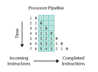
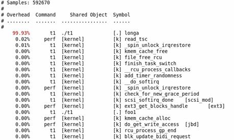
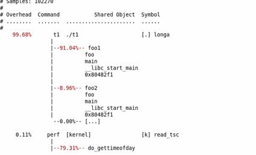
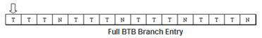

## [转载]Perf - Linux下的系统性能调优工具，第 1 部分              
                                
### 作者                               
digoal                                
                                
### 日期                              
2016-11-29                                  
                                
### 标签                              
Linux , profiling , perf                                                                
                                
----                              
                                
## 背景                
转载文章，原文地址    
    
https://www.ibm.com/developerworks/cn/linux/l-cn-perf1    
    
https://www.ibm.com/developerworks/cn/linux/l-cn-perf2    
    
Perf Event 是一款随 Linux 内核代码一同发布和维护的性能诊断工具，由内核社区维护和发展。Perf 不仅可以用于应用程序的性能统计分析，也可以应用于内核代码的性能统计和分析。得益于其优秀的体系结构设计，越来越多的新功能被加入 Perf，使其已经成为一个多功能的性能统计工具集 。在第一部分，将介绍 Perf 在应用程序开发上的应用。    
    
## Perf 简介  
Perf 是用来进行软件性能分析的工具。  
  
通过它，应用程序可以利用 PMU，tracepoint 和内核中的特殊计数器来进行性能统计。它不但可以分析指定应用程序的性能问题 (per thread)，也可以用来分析内核的性能问题，当然也可以同时分析应用代码和内核，从而全面理解应用程序中的性能瓶颈。  
  
最初的时候，它叫做 Performance counter，在 2.6.31 中第一次亮相。此后他成为内核开发最为活跃的一个领域。在 2.6.32 中它正式改名为 Performance Event，因为 perf 已不再仅仅作为 PMU 的抽象，而是能够处理所有的性能相关的事件。  
  
使用 perf，您可以分析程序运行期间发生的硬件事件，比如 instructions retired ，processor clock cycles 等；您也可以分析软件事件，比如 Page Fault 和进程切换。  
  
这使得 Perf 拥有了众多的性能分析能力，举例来说，使用 Perf 可以计算每个时钟周期内的指令数，称为 IPC，IPC 偏低表明代码没有很好地利用 CPU。Perf 还可以对程序进行函数级别的采样，从而了解程序的性能瓶颈究竟在哪里等等。Perf 还可以替代 strace，可以添加动态内核 probe 点，还可以做 benchmark 衡量调度器的好坏。。。  
  
人们或许会称它为进行性能分析的“瑞士军刀”，但我不喜欢这个比喻，我觉得 perf 应该是一把世间少有的倚天剑。  
  
金庸笔下的很多人都有对宝刀的癖好，即便本领低微不配拥有，但是喜欢，便无可奈何。我恐怕正如这些人一样，因此进了酒馆客栈，见到相熟或者不相熟的人，就要兴冲冲地要讲讲那倚天剑的故事。  
  
## 背景知识  
有些背景知识是分析性能问题时需要了解的。比如硬件 cache；再比如操作系统内核。应用程序的行为细节往往是和这些东西互相牵扯的，这些底层的东西会以意想不到的方式影响应用程序的性能，比如某些程序无法充分利用 cache，从而导致性能下降。比如不必要地调用过多的系统调用，造成频繁的内核 / 用户切换。等等。方方面面，这里只是为本文的后续内容做一些铺垫，关于调优还有很多东西，我所不知道的比知道的要多的多。  
  
### 性能相关的处理器硬件特性，PMU 简介  
当算法已经优化，代码不断精简，人们调到最后，便需要斤斤计较了。cache 啊，流水线啊一类平时不大注意的东西也必须精打细算了。  
  
### 硬件特性之 cache  
内存读写是很快的，但还是无法和处理器的指令执行速度相比。为了从内存中读取指令和数据，处理器需要等待，用处理器的时间来衡量，这种等待非常漫长。Cache 是一种 SRAM，它的读写速率非常快，能和处理器处理速度相匹配。因此将常用的数据保存在 cache 中，处理器便无须等待，从而提高性能。Cache 的尺寸一般都很小，充分利用 cache 是软件调优非常重要的部分。  
  
### 硬件特性之流水线，超标量体系结构，乱序执行  
提高性能最有效的方式之一就是并行。处理器在硬件设计时也尽可能地并行，比如流水线，超标量体系结构以及乱序执行。  
  
处理器处理一条指令需要分多个步骤完成，比如先取指令，然后完成运算，最后将计算结果输出到总线上。在处理器内部，这可以看作一个三级流水线，如下图所示：  
  
#### 图 1. 处理器流水线  
  
    
  
指令从左边进入处理器，上图中的流水线有三级，一个时钟周期内可以同时处理三条指令，分别被流水线的不同部分处理。  
  
超标量（superscalar）指一个时钟周期发射多条指令的流水线机器架构，比如 Intel 的 Pentium 处理器，内部有两个执行单元，在一个时钟周期内允许执行两条指令。  
  
此外，在处理器内部，不同指令所需要的处理步骤和时钟周期是不同的，如果严格按照程序的执行顺序执行，那么就无法充分利用处理器的流水线。因此指令有可能被乱序执行。  
  
上述三种并行技术对所执行的指令有一个基本要求，即相邻的指令相互没有依赖关系。假如某条指令需要依赖前面一条指令的执行结果数据，那么 pipeline 便失去作用，因为第二条指令必须等待第一条指令完成。因此好的软件必须尽量避免这种代码的生成。  
  
### 硬件特性之分支预测  
分支指令对软件性能有比较大的影响。尤其是当处理器采用流水线设计之后，假设流水线有三级，当前进入流水的第一条指令为分支指令。假设处理器顺序读取指令，那么如果分支的结果是跳转到其他指令，那么被处理器流水线预取的后续两条指令都将被放弃，从而影响性能。为此，很多处理器都提供了分支预测功能，根据同一条指令的历史执行记录进行预测，读取最可能的下一条指令，而并非顺序读取指令。  
  
分支预测对软件结构有一些要求，对于重复性的分支指令序列，分支预测硬件能得到较好的预测结果，而对于类似 switch case 一类的程序结构，则往往无法得到理想的预测结果。  
  
上面介绍的几种处理器特性对软件的性能有很大的影响，然而依赖时钟进行定期采样的 profiler 模式无法揭示程序对这些处理器硬件特性的使用情况。处理器厂商针对这种情况，在硬件中加入了 PMU 单元，即 performance monitor unit。  
  
PMU 允许软件针对某种硬件事件设置 counter，此后处理器便开始统计该事件的发生次数，当发生的次数超过 counter 内设置的值后，便产生中断。比如 cache miss 达到某个值后，PMU 便能产生相应的中断。  
  
捕获这些中断，便可以考察程序对这些硬件特性的利用效率了。  
  
### Tracepoints  
Tracepoint 是散落在内核源代码中的一些 hook，一旦使能，它们便可以在特定的代码被运行到时被触发，这一特性可以被各种 trace/debug 工具所使用。Perf 就是该特性的用户之一。  
  
假如您想知道在应用程序运行期间，内核内存管理模块的行为，便可以利用潜伏在 slab 分配器中的 tracepoint。当内核运行到这些 tracepoint 时，便会通知 perf。  
  
Perf 将 tracepoint 产生的事件记录下来，生成报告，通过分析这些报告，调优人员便可以了解程序运行时期内核的种种细节，对性能症状作出更准确的诊断。  
  
## perf 的基本使用  
说明一个工具的最佳途径是列举一个例子。  
  
考查下面这个例子程序。其中函数 longa() 是个很长的循环，比较浪费时间。函数 foo1 和 foo2 将分别调用该函数 10 次，以及 100 次。  
  
#### 清单 1. 测试程序 t1  
  
```
 //test.c   
 void longa()   
 {   
   int i,j;   
   for(i = 0; i < 1000000; i++)   
   j=i; //am I silly or crazy? I feel boring and desperate.   
 }   
  
 void foo2()   
 {   
   int i;   
   for(i=0 ; i < 10; i++)   
        longa();   
 }   
  
 void foo1()   
 {   
   int i;   
   for(i = 0; i< 100; i++)   
      longa();   
 }   
  
 int main(void)   
 {   
   foo1();   
   foo2();   
 }  
```
  
找到这个程序的性能瓶颈无需任何工具，肉眼的阅读便可以完成。Longa() 是这个程序的关键，只要提高它的速度，就可以极大地提高整个程序的运行效率。  
  
但，因为其简单，却正好可以用来演示 perf 的基本使用。假如 perf 告诉您这个程序的瓶颈在别处，您就不必再浪费宝贵时间阅读本文了。  
  
### 准备使用 perf  
安装 perf 非常简单，只要您有 2.6.31 以上的内核源代码，那么进入 tools/perf 目录然后敲入下面两个命令即可：  
  
```
 make   
 make install  
```
  
性能调优工具如 perf，Oprofile 等的基本原理都是对被监测对象进行采样，最简单的情形是根据 tick 中断进行采样，即在 tick 中断内触发采样点，在采样点里判断程序当时的上下文。假如一个程序 90% 的时间都花费在函数 foo() 上，那么 90% 的采样点都应该落在函数 foo() 的上下文中。运气不可捉摸，但我想只要采样频率足够高，采样时间足够长，那么以上推论就比较可靠。因此，通过 tick 触发采样，我们便可以了解程序中哪些地方最耗时间，从而重点分析。  
  
稍微扩展一下思路，就可以发现改变采样的触发条件使得我们可以获得不同的统计数据：  
  
以时间点 ( 如 tick) 作为事件触发采样便可以获知程序运行时间的分布。  
  
以 cache miss 事件触发采样便可以知道 cache miss 的分布，即 cache 失效经常发生在哪些程序代码中。如此等等。  
  
因此让我们先来了解一下 perf 中能够触发采样的事件有哪些。  
  
### Perf list，perf 事件  
使用 perf list 命令可以列出所有能够触发 perf 采样点的事件。比如  
  
```
 $ perf list   
 List of pre-defined events (to be used in -e):   
 cpu-cycles OR cycles [Hardware event]   
 instructions [Hardware event]   
…  
 cpu-clock [Software event]   
 task-clock [Software event]   
 context-switches OR cs [Software event]   
…  
 ext4:ext4_allocate_inode [Tracepoint event]   
 kmem:kmalloc [Tracepoint event]   
 module:module_load [Tracepoint event]   
 workqueue:workqueue_execution [Tracepoint event]   
 sched:sched_{wakeup,switch} [Tracepoint event]   
 syscalls:sys_{enter,exit}_epoll_wait [Tracepoint event]   
…  
```
  
不同的系统会列出不同的结果，在 2.6.35 版本的内核中，该列表已经相当的长，但无论有多少，我们可以将它们划分为三类：  
  
Hardware Event 是由 PMU 硬件产生的事件，比如 cache 命中，当您需要了解程序对硬件特性的使用情况时，便需要对这些事件进行采样；  
  
Software Event 是内核软件产生的事件，比如进程切换，tick 数等 ;  
  
Tracepoint event 是内核中的静态 tracepoint 所触发的事件，这些 tracepoint 用来判断程序运行期间内核的行为细节，比如 slab 分配器的分配次数等。  
  
上述每一个事件都可以用于采样，并生成一项统计数据，时至今日，尚没有文档对每一个 event 的含义进行详细解释。我希望能和大家一起努力，以弄明白更多的 event 为目标。。。  
  
### Perf stat  
做任何事都最好有条有理。老手往往能够做到不慌不忙，循序渐进，而新手则往往东一下，西一下，不知所措。  
  
面对一个问题程序，最好采用自顶向下的策略。先整体看看该程序运行时各种统计事件的大概，再针对某些方向深入细节。而不要一下子扎进琐碎细节，会一叶障目的。  
  
有些程序慢是因为计算量太大，其多数时间都应该在使用 CPU 进行计算，这叫做 CPU bound 型；有些程序慢是因为过多的 IO，这种时候其 CPU 利用率应该不高，这叫做 IO bound 型；对于 CPU bound 程序的调优和 IO bound 的调优是不同的。  
  
如果您认同这些说法的话，Perf stat 应该是您最先使用的一个工具。它通过概括精简的方式提供被调试程序运行的整体情况和汇总数据。  
  
还记得我们前面准备的那个例子程序么？现在将它编译为可执行文件 t1  
  
```
 gcc -o t1 -g test.c  
```
  
下面演示了 perf stat 针对程序 t1 的输出：  
  
```
 $perf stat ./t1   
 Performance counter stats for './t1':   
  
 262.738415 task-clock-msecs # 0.991 CPUs   
 2 context-switches # 0.000 M/sec   
 1 CPU-migrations # 0.000 M/sec   
 81 page-faults # 0.000 M/sec   
 9478851 cycles # 36.077 M/sec (scaled from 98.24%)   
 6771 instructions # 0.001 IPC (scaled from 98.99%)   
 111114049 branches # 422.908 M/sec (scaled from 99.37%)   
 8495 branch-misses # 0.008 % (scaled from 95.91%)   
 12152161 cache-references # 46.252 M/sec (scaled from 96.16%)   
 7245338 cache-misses # 27.576 M/sec (scaled from 95.49%)   
  
  0.265238069 seconds time elapsed   
```
  
上面告诉我们，程序 t1 是一个 CPU bound 型，因为 task-clock-msecs 接近 1。  
  
对 t1 进行调优应该要找到热点 ( 即最耗时的代码片段 )，再看看是否能够提高热点代码的效率。  
  
缺省情况下，除了 task-clock-msecs 之外，perf stat 还给出了其他几个最常用的统计信息：  
  
Task-clock-msecs：CPU 利用率，该值高，说明程序的多数时间花费在 CPU 计算上而非 IO。  
  
Context-switches：进程切换次数，记录了程序运行过程中发生了多少次进程切换，频繁的进程切换是应该避免的。  
  
Cache-misses：程序运行过程中总体的 cache 利用情况，如果该值过高，说明程序的 cache 利用不好  
  
CPU-migrations：表示进程 t1 运行过程中发生了多少次 CPU 迁移，即被调度器从一个 CPU 转移到另外一个 CPU 上运行。  
  
Cycles：处理器时钟，一条机器指令可能需要多个 cycles，  
  
Instructions: 机器指令数目。  
  
IPC：是 Instructions/Cycles 的比值，该值越大越好，说明程序充分利用了处理器的特性。  
  
Cache-references: cache 命中的次数  
  
Cache-misses: cache 失效的次数。  
  
通过指定 -e 选项，您可以改变 perf stat 的缺省事件 ( 关于事件，在上一小节已经说明，可以通过 perf list 来查看 )。假如您已经有很多的调优经验，可能会使用 -e 选项来查看您所感兴趣的特殊的事件。  
  
### perf Top  
使用 perf stat 的时候，往往您已经有一个调优的目标。比如我刚才写的那个无聊程序 t1。  
  
也有些时候，您只是发现系统性能无端下降，并不清楚究竟哪个进程成为了贪吃的 hog。  
  
此时需要一个类似 top 的命令，列出所有值得怀疑的进程，从中找到需要进一步审查的家伙。类似法制节目中办案民警常常做的那样，通过查看监控录像从茫茫人海中找到行为古怪的那些人，而不是到大街上抓住每一个人来审问。  
  
Perf top 用于实时显示当前系统的性能统计信息。该命令主要用来观察整个系统当前的状态，比如可以通过查看该命令的输出来查看当前系统最耗时的内核函数或某个用户进程。  
  
让我们再设计一个例子来演示吧。  
  
不知道您怎么想，反正我觉得做一件有益的事情很难，但做点儿坏事儿却非常容易。我很快就想到了如代码清单 2 所示的一个程序：  
  
#### 清单 2. 一个死循环  
```
 while (1) i++;  
```
  
我叫他 t2。启动 t2，然后用 perf top 来观察：  
  
下面是 perf top 的可能输出：  
  
```
 PerfTop: 705 irqs/sec kernel:60.4% [1000Hz cycles]   
 --------------------------------------------------   
 sampl pcnt function DSO   
 1503.00 49.2% t2   
 72.00 2.2% pthread_mutex_lock /lib/libpthread-2.12.so   
 68.00 2.1% delay_tsc [kernel.kallsyms]   
 55.00 1.7% aes_dec_blk [aes_i586]   
 55.00 1.7% drm_clflush_pages [drm]   
 52.00 1.6% system_call [kernel.kallsyms]   
 49.00 1.5% __memcpy_ssse3 /lib/libc-2.12.so   
 48.00 1.4% __strstr_ia32 /lib/libc-2.12.so   
 46.00 1.4% unix_poll [kernel.kallsyms]   
 42.00 1.3% __ieee754_pow /lib/libm-2.12.so   
 41.00 1.2% do_select [kernel.kallsyms]   
 40.00 1.2% pixman_rasterize_edges libpixman-1.so.0.18.0   
 37.00 1.1% _raw_spin_lock_irqsave [kernel.kallsyms]   
 36.00 1.1% _int_malloc /lib/libc-2.12.so   
 ^C  
```
  
很容易便发现 t2 是需要关注的可疑程序。不过其作案手法太简单：肆无忌惮地浪费着 CPU。所以我们不用再做什么其他的事情便可以找到问题所在。但现实生活中，影响性能的程序一般都不会如此愚蠢，所以我们往往还需要使用其他的 perf 工具进一步分析。  
  
通过添加 -e 选项，您可以列出造成其他事件的 TopN 个进程 / 函数。比如 -e cache-miss，用来看看谁造成的 cache miss 最多。  
  
### 使用 perf record, 解读 report  
使用 top 和 stat 之后，您可能已经大致有数了。要进一步分析，便需要一些粒度更细的信息。比如说您已经断定目标程序计算量较大，也许是因为有些代码写的不够精简。那么面对长长的代码文件，究竟哪几行代码需要进一步修改呢？这便需要使用 perf record 记录单个函数级别的统计信息，并使用 perf report 来显示统计结果。  
  
您的调优应该将注意力集中到百分比高的热点代码片段上，假如一段代码只占用整个程序运行时间的 0.1%，即使您将其优化到仅剩一条机器指令，恐怕也只能将整体的程序性能提高 0.1%。俗话说，好钢用在刀刃上，不必我多说了。  
  
仍以 t1 为例。  
  
```
 perf record – e cpu-clock ./t1   
 perf report  
```
  
结果如下图所示：  
  
#### 图 2. perf report 示例  
  
    
  
不出所料，hot spot 是 longa( ) 函数。  
  
但，代码是非常复杂难说的，t1 程序中的 foo1() 也是一个潜在的调优对象，为什么要调用 100 次那个无聊的 longa() 函数呢？但我们在上图中无法发现 foo1 和 foo2，更无法了解他们的区别了。  
  
我曾发现自己写的一个程序居然有近一半的时间花费在 string 类的几个方法上，string 是 C++ 标准，我绝不可能写出比 STL 更好的代码了。因此我只有找到自己程序中过多使用 string 的地方。因此我很需要按照调用关系进行显示的统计信息。  
  
使用 perf 的 -g 选项便可以得到需要的信息：  
  
```
 perf record -e cpu-clock -g ./t1   
 perf report  
```
  
结果如下图所示：  
  
#### 图 3. perf – g report 示例  
  
    
  
通过对 calling graph 的分析，能很方便地看到 91% 的时间都花费在 foo1() 函数中，因为它调用了 100 次 longa() 函数，因此假如 longa() 是个无法优化的函数，那么程序员就应该考虑优化 foo1，减少对 longa() 的调用次数。  
  
### 使用 PMU 的例子  
例子 t1 和 t2 都较简单。所谓魔高一尺，道才能高一丈。要想演示 perf 更加强大的能力，我也必须想出一个高明的影响性能的例子，我自己想不出，只好借助于他人。下面这个例子 t3 参考了文章“Branch and Loop Reorganization to Prevent Mispredicts”[6]  
  
该例子考察程序对奔腾处理器分支预测的利用率，如前所述，分支预测能够显著提高处理器的性能，而分支预测失败则显著降低处理器的性能。首先给出一个存在 BTB 失效的例子：  
  
#### 清单 3. 存在 BTB 失效的例子程序  
```
 //test.c   
 #include <stdio.h>   
 #include <stdlib.h>   
  
 void foo()   
 {   
  int i,j;   
  for(i=0; i< 10; i++)   
  j+=2;   
 }   
 int main(void)   
 {   
  int i;   
  for(i = 0; i< 100000000; i++)   
  foo();   
  return 0;   
 }  
```
  
用 gcc 编译生成测试程序 t3:  
  
```
 gcc -o t3 -O0 test.c  
```
  
用 perf stat 考察分支预测的使用情况：  
  
```
 [lm@ovispoly perf]$ ./perf stat ./t3   
  
  Performance counter stats for './t3':   
  
 6240.758394 task-clock-msecs # 0.995 CPUs   
 126 context-switches # 0.000 M/sec   
 12 CPU-migrations # 0.000 M/sec   
 80 page-faults # 0.000 M/sec   
 17683221 cycles # 2.834 M/sec (scaled from 99.78%)   
 10218147 instructions # 0.578 IPC (scaled from 99.83%)   
 2491317951 branches # 399.201 M/sec (scaled from 99.88%)   
 636140932 branch-misses # 25.534 % (scaled from 99.63%)   
 126383570 cache-references # 20.251 M/sec (scaled from 99.68%)   
 942937348 cache-misses # 151.093 M/sec (scaled from 99.58%)   
  
  6.271917679 seconds time elapsed  
```
  
可以看到 branche-misses 的情况比较严重，25% 左右。我测试使用的机器的处理器为 Pentium4，其 BTB 的大小为 16。而 test.c 中的循环迭代为 20 次，BTB 溢出，所以处理器的分支预测将不准确。  
  
对于上面这句话我将简要说明一下，但关于 BTB 的细节，请阅读参考文献 [6]。  
  
for 循环编译成为 IA 汇编后如下：  
  
#### 清单 4. 循环的汇编  
```
 // C code   
 for ( i=0; i < 20; i++ )   
 { … }   
  
 //Assembly code;   
 mov    esi, data   
 mov    ecx, 0   
 ForLoop:   
 cmp    ecx, 20   
 jge      
 EndForLoop   
…  
 add    ecx, 1   
 jmp    ForLoop   
 EndForLoop:  
```
  
可以看到，每次循环迭代中都有一个分支语句 jge，因此在运行过程中将有 20 次分支判断。每次分支判断都将写入 BTB，但 BTB 是一个 ring buffer，16 个 slot 写满后便开始覆盖。假如迭代次数正好为 16，或者小于 16，则完整的循环将全部写入 BTB，比如循环迭代次数为 4 次，则 BTB 应该如下图所示：  
  
#### 图 4. BTB buffer  
  
    
  
这个 buffer 完全精确地描述了整个循环迭代的分支判定情况，因此下次运行同一个循环时，处理器便可以做出完全正确的预测。但假如迭代次数为 20，则该 BTB 随着时间推移而不能完全准确地描述该循环的分支预测执行情况，处理器将做出错误的判断。  
  
我们将测试程序进行少许的修改，将迭代次数从 20 减少到 10，为了让逻辑不变，j++ 变成了 j+=2；  
  
#### 清单 5. 没有 BTB 失效的代码  
```
 #include <stdio.h>   
 #include <stdlib.h>   
  
 void foo()   
 {   
  int i,j;   
  for(i=0; i< 10; i++)   
  j+=2;   
 }   
 int main(void)   
 {   
  int i;   
  for(i = 0; i< 100000000; i++)   
  foo();   
  return 0;   
 }  
```
  
此时再次用 perf stat 采样得到如下结果：  
  
```
 [lm@ovispoly perf]$ ./perf stat ./t3   
  
  Performance counter stats for './t3:   
  
 2784.004851 task-clock-msecs # 0.927 CPUs   
 90 context-switches # 0.000 M/sec   
 8 CPU-migrations # 0.000 M/sec   
 81 page-faults # 0.000 M/sec   
 33632545 cycles # 12.081 M/sec (scaled from 99.63%)   
 42996 instructions # 0.001 IPC (scaled from 99.71%)   
 1474321780 branches # 529.569 M/sec (scaled from 99.78%)   
 49733 branch-misses # 0.003 % (scaled from 99.35%)   
 7073107 cache-references # 2.541 M/sec (scaled from 99.42%)   
 47958540 cache-misses # 17.226 M/sec (scaled from 99.33%)   
  
  3.002673524 seconds time elapsed  
```
  
Branch-misses 减少了。  
  
本例只是为了演示 perf 对 PMU 的使用，本身并无意义，关于充分利用 processor 进行调优可以参考 Intel 公司出品的调优手册，其他的处理器可能有不同的方法，还希望读者明鉴。  
  
## 小结  
以上介绍的这些 perf 用法主要着眼点在于对于应用程序的性能统计分析，本文的第二部分将继续讲述 perf 的一些特殊用法，并偏重于内核本身的性能统计分析。  
  
调优是需要综合知识的工作，要不断地修炼自己。Perf 虽然是一把宝剑，但宝剑配英雄，只有武功高强的大侠才能随心所欲地使用它。以我的功力，也只能道听途说地讲述一些关于宝刀的事情。但若本文能引起您对宝刀的兴趣，那么也算是有一点儿作用了。  
  
## 参考资料  
2\.6\.34 源代码 tools 目录下的文档。  
  
Lwn 上的文章 Perfcounters added to the mainline以及 Scripting support for perf。  
http://lwn.net/Articles/339361/    
http://lwn.net/Articles/373842/    
  
Ingo Molnar 写的关于 sched perf的教材。    
http://lwn.net/Articles/353295/    
    
Arjan van de Ven ’ s 关于 timechart 的 blog。    
http://blog.fenrus.org/?p=5    
    
IBM Developerworks 网站上的文章 用 OProfile 彻底了解性能。   
http://www.ibm.com/developerworks/cn/linux/l-oprof/index.html    
  
Intel 公司的 Jeff Andrews 写的 Branch and Loop Reorganization to Prevent Mispredicts。  
http://software.intel.com/en-us/articles/branch-and-loop-reorganization-to-prevent-mispredicts/   
  
在 developerWorks Linux 专区 寻找为 Linux 开发人员（包括 Linux 新手入门）准备的更多参考资料，查阅我们 最受欢迎的文章和教程。  
http://www.ibm.com/developerworks/cn/linux/  
http://www.ibm.com/developerworks/cn/linux/newto/  
http://www.ibm.com/developerworks/cn/linux/best2009/index.html  
  
在 developerWorks 上查阅所有 Linux 技巧 和 Linux 教程。  
http://www.ibm.com/developerworks/cn/views/linux/libraryview.jsp?search_by=Linux+%E6%8A%80%E5%B7%A7  
http://www.ibm.com/developerworks/cn/views/linux/libraryview.jsp?type_by=%E6%95%99%E7%A8%8B  
  
随时关注 developerWorks 技术活动和网络广播。  
http://www.ibm.com/developerworks/cn/offers/techbriefings/  
http://www.ibm.com/developerworks/cn/swi/  
  
   
  
                  
                        
  
<a rel="nofollow" href="http://info.flagcounter.com/h9V1"  ></a>  
  
  
  
  
  
  
## [digoal's 大量PostgreSQL文章入口](https://github.com/digoal/blog/blob/master/README.md "22709685feb7cab07d30f30387f0a9ae")
  
