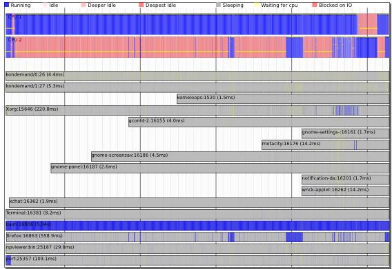
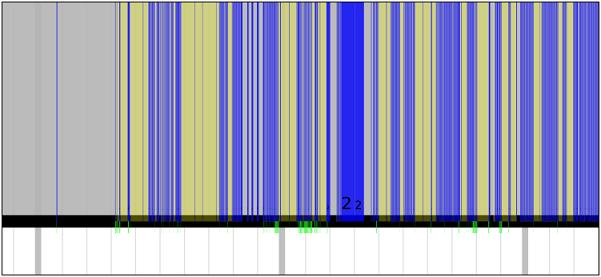

## [转载]Perf - Linux下的系统性能调优工具，第 2 部分           
                                    
### 作者                                   
digoal                                    
                                    
### 日期                                  
2016-11-29                                      
                                    
### 标签                                  
Linux , profiling , perf                                                                    
                                    
----                                  
                                    
## 背景                    
转载文章，原文地址        
        
https://www.ibm.com/developerworks/cn/linux/l-cn-perf1        
        
https://www.ibm.com/developerworks/cn/linux/l-cn-perf2        
        
perf event 是一款随 Linux 内核代码一同发布和维护的性能诊断工具，由内核社区维护和发展。perf 不仅可以用于应用程序的性能统计分析，也可以应用于内核代码的性能统计和分析。得益于其优秀的体系结构设计，越来越多的新功能被加入 perf，使其已经成为一个多功能的性能统计工具集 。第二部分将介绍 perf 在内核代码开发上的应用。        
        
## 本文内容简介    
之前介绍了 perf 最常见的一些用法，关注于 Linux 系统上应用程序的调优。现在让我们把目光转移到内核以及其他 perf 命令上面来。    
  
在内核方面，人们的兴趣五花八门，有些内核开发人员热衷于寻找整个内核中的热点代码；另一些则只关注某一个主题，比如 slab 分配器，对于其余部分则不感兴趣。对这些人而言，perf 的一些奇怪用法更受欢迎。当然，诸如 perf top，perf stat, perf record 等也是内核调优的基本手段，但用法和 part1 所描述的一样，无需重述。    
  
此外虽然内核事件对应用程序开发人员而言有些陌生，但一旦了解，对应用程序的调优也很有帮助。我曾经参与开发过一个数据库应用程序，其效率很低。通过常规的热点查询，IO 统计等方法，我们找到了一些可以优化的地方，以至于将程序的效率提高了几倍。可惜对于拥有海量数据的用户，其运行时间依然无法达到要求。进一步调优需要更加详细的统计信息，可惜本人经验有限，实在是无计可施。。。从客户反馈来看，该应用的使用频率很低。作为一个程序员，为此我时常心情沮丧。。。    
  
假如有 perf，那么我想我可以用它来验证自己的一些猜测，比如是否太多的系统调用，或者系统中的进程切换太频繁 ? 针对这些怀疑使用 perf 都可以拿出有用的报告，或许能找到问题吧。但过去的便无可弥补，时光不会倒流，无论我如何伤感，世界绝不会以我的意志为转移。所以我们好好学习 perf，或许可以预防某些遗憾吧。    
  
这里我还要提醒读者注意，讲述 perf 的命令和语法容易，但说明什么时候使用这些命令，或者说明怎样解决实际问题则很困难。就好象说明电子琴上 88 个琴键的唱名很容易，但想说明如何弹奏动听的曲子则很难。    
  
在简述每个命令语法的同时，我试图通过一些示例来说明这些命令的使用场景，但这只能是一种微薄的努力。因此总体说来，本文只能充当那本随同电子琴一起发售的使用说明书。。。    
      
## 使用 tracepoint    
当 perf 根据 tick 时间点进行采样后，人们便能够得到内核代码中的 hot spot。那什么时候需要使用 tracepoint 来采样呢？    
  
我想人们使用 tracepoint 的基本需求是对内核的运行时行为的关心，如前所述，有些内核开发人员需要专注于特定的子系统，比如内存管理模块。这便需要统计相关内核函数的运行情况。另外，内核行为对应用程序性能的影响也是不容忽视的：    
  
以之前的遗憾为例，假如时光倒流，我想我要做的是统计该应用程序运行期间究竟发生了多少次系统调用。在哪里发生的？    
  
下面我用 ls 命令来演示 sys_enter 这个 tracepoint 的使用：    
  
```  
 [root@ovispoly /]# perf stat -e raw_syscalls:sys_enter ls     
 bin dbg etc  lib  media opt root  selinux sys usr     
 boot dev home lost+found mnt proc sbin srv  tmp var     
    
  Performance counter stats for 'ls':     
    
 101 raw_syscalls:sys_enter     
    
  0.003434730 seconds time elapsed     
    
    
 [root@ovispoly /]# perf record -e raw_syscalls:sys_enter ls     
    
 [root@ovispoly /]# perf report     
 Failed to open .lib/ld-2.12.so, continuing without symbols     
 # Samples: 70     
 #     
 # Overhead Command Shared Object Symbol     
 # ........ ............... ............... ......     
 #     
 97.14% ls ld-2.12.so [.] 0x0000000001629d     
 2.86% ls [vdso] [.] 0x00000000421424     
 #     
 # (For a higher level overview, try: perf report --sort comm,dso)     
 #    
```  
  
这个报告详细说明了在 ls 运行期间发生了多少次系统调用 ( 上例中有 101 次 )，多数系统调用都发生在哪些地方 (97% 都发生在 ld-2.12.so 中 )。    
  
有了这个报告，或许我能够发现更多可以调优的地方。比如函数 foo() 中发生了过多的系统调用，那么我就可以思考是否有办法减少其中有些不必要的系统调用。    
  
您可能会说 strace 也可以做同样事情啊，的确，统计系统调用这件事完全可以用 strace 完成，但 perf 还可以干些别的，您所需要的就是修改 -e 选项后的字符串。  
  
罗列 tracepoint 实在是不太地道，本文当然不会这么做。但学习每一个 tracepoint 是有意义的，类似背单词之于学习英语一样，是一项缓慢痛苦却不得不做的事情。    
    
## perf probe    
tracepoint 是静态检查点，意思是一旦它在哪里，便一直在那里了，您想让它移动一步也是不可能的。内核代码有多少行？我不知道，100 万行是至少的吧，但目前 tracepoint 有多少呢？我最大胆的想象是不超过 1000 个。所以能够动态地在想查看的地方插入动态监测点的意义是不言而喻的。    
  
Perf 并不是第一个提供这个功能的软件，systemTap 早就实现了。但假若您不选择 RedHat 的发行版的话，安装 systemTap 并不是件轻松愉快的事情。perf 是内核代码包的一部分，所以使用和维护都非常方便。    
  
我使用的 Linux 版本为 2.6.33。因此您自己做实验时命令参数有可能不同。    
  
```  
 [root@ovispoly perftest]# perf probe schedule:12 cpu     
 Added new event:     
 probe:schedule (on schedule+52 with cpu)     
    
 You can now use it on all perf tools, such as:     
    
   perf record -e probe:schedule -a sleep 1     
    
 [root@ovispoly perftest]# perf record -e probe:schedule -a sleep 1     
 Error, output file perf.data exists, use -A to append or -f to overwrite.     
    
 [root@ovispoly perftest]# perf record -f -e probe:schedule -a sleep 1     
 [ perf record: Woken up 1 times to write data ]     
 [ perf record: Captured and wrote 0.270 MB perf.data (~11811 samples) ]     
 [root@ovispoly perftest]# perf report     
 # Samples: 40     
 #     
 # Overhead Command Shared Object Symbol     
 # ........ ............... ................. ......     
 #     
 57.50% init 0 [k] 0000000000000000     
 30.00% firefox [vdso] [.] 0x0000000029c424     
 5.00% sleep [vdso] [.] 0x00000000ca7424     
 5.00% perf.2.6.33.3-8 [vdso] [.] 0x00000000ca7424     
 2.50% ksoftirqd/0 [kernel] [k] 0000000000000000     
 #     
 # (For a higher level overview, try: perf report --sort comm,dso)     
 #    
```  
  
上例利用 probe 命令在内核函数 schedule() 的第 12 行处加入了一个动态 probe 点，和 tracepoint 的功能一样，内核一旦运行到该 probe 点时，便会通知 perf。可以理解为动态增加了一个新的 tracepoint。    
  
此后便可以用 record 命令的 -e 选项选择该 probe 点，最后用 perf report 查看报表。如何解读该报表便是见仁见智了，既然您在 shcedule() 的第 12 行加入了 probe 点，想必您知道自己为什么要统计它吧？    
    
## Perf sched    
调度器的好坏直接影响一个系统的整体运行效率。在这个领域，内核黑客们常会发生争执，一个重要原因是对于不同的调度器，每个人给出的评测报告都各不相同，甚至常常有相反的结论。因此一个权威的统一的评测工具将对结束这种争论有益。Perf sched 便是这种尝试。    
  
Perf sched 有五个子命令：    
  
```  
  perf sched record            # low-overhead recording of arbitrary workloads     
  perf sched latency           # output per task latency metrics     
  perf sched map               # show summary/map of context-switching     
  perf sched trace             # output finegrained trace     
  perf sched replay            # replay a captured workload using simlated threads    
```  
  
用户一般使用’ perf sched record ’收集调度相关的数据，然后就可以用’ perf sched latency ’查看诸如调度延迟等和调度器相关的统计数据。    
  
其他三个命令也同样读取 record 收集到的数据并从其他不同的角度来展示这些数据。下面一一进行演示。    
  
```  
 perf sched record sleep 10     # record full system activity for 10 seconds     
 perf sched latency --sort max  # report latencies sorted by max     
    
 -------------------------------------------------------------------------------------    
  Task               |   Runtime ms  | Switches | Average delay ms | Maximum delay ms |     
 -------------------------------------------------------------------------------------    
  :14086:14086        |      0.095 ms |        2 | avg:    3.445 ms | max:    6.891 ms |     
  gnome-session:13792   |   31.713 ms |      102 | avg:    0.160 ms | max:    5.992 ms |     
  metacity:14038      |     49.220 ms |      637 | avg:    0.066 ms | max:    5.942 ms |     
  gconfd-2:13971     | 48.587 ms |      777 | avg:    0.047 ms | max:    5.793 ms |     
  gnome-power-man:14050 |  140.601 ms | 434 | avg:  0.097 ms | max:    5.367 ms |     
  python:14049        |  114.694 ms |      125 | avg:    0.120 ms | max:    5.343 ms |     
  kblockd/1:236       |   3.458 ms |      498 | avg:    0.179 ms | max:    5.271 ms |     
  Xorg:3122         |   1073.107 ms |     2920 | avg:    0.030 ms | max:    5.265 ms |     
  dbus-daemon:2063   |   64.593 ms |      665 | avg:    0.103 ms | max:    4.730 ms |     
  :14040:14040       |   30.786 ms |      255 | avg:    0.095 ms | max:    4.155 ms |     
  events/1:8         |    0.105 ms |       13 | avg:    0.598 ms | max:    3.775 ms |     
  console-kit-dae:2080  | 14.867 ms |   152 | avg:    0.142 ms | max:    3.760 ms |     
  gnome-settings-:14023 |  572.653 ms |  979 | avg:    0.056 ms | max:    3.627 ms |     
 ...     
 -----------------------------------------------------------------------------------    
  TOTAL:                |   3144.817 ms |    11654 |     
 ---------------------------------------------------     
```  
    
上面的例子展示了一个 Gnome 启动时的统计信息。    
  
各个 column 的含义如下：    
  
```  
 Task: 进程的名字和 pid     
 Runtime: 实际运行时间    
 Switches: 进程切换的次数    
 Average delay: 平均的调度延迟    
 Maximum delay: 最大延迟    
```  
  
这里最值得人们关注的是 Maximum delay，一般从这里可以看到对交互性影响最大的特性：调度延迟，如果调度延迟比较大，那么用户就会感受到视频或者音频断断续续的。    
  
其他的三个子命令提供了不同的视图，一般是由调度器的开发人员或者对调度器内部实现感兴趣的人们所使用。    
  
首先是 map:    
  
```  
  $ perf sched map     
  ...     
    
   N1  O1  .   .   .   S1  .   .   .   B0  .  *I0  C1  .   M1  .    23002.773423 secs     
   N1  O1  .  *Q0  .   S1  .   .   .   B0  .   I0  C1  .   M1  .    23002.773423 secs     
   N1  O1  .   Q0  .   S1  .   .   .   B0  .  *R1  C1  .   M1  .    23002.773485 secs     
   N1  O1  .   Q0  .   S1  .  *S0  .   B0  .   R1  C1  .   M1  .    23002.773478 secs     
  *L0  O1  .   Q0  .   S1  .   S0  .   B0  .   R1  C1  .   M1  .    23002.773523 secs     
   L0  O1  .  *.   .   S1  .   S0  .   B0  .   R1  C1  .   M1  .    23002.773531 secs     
   L0  O1  .   .   .   S1  .   S0  .   B0  .   R1  C1 *T1  M1  .    23002.773547 secs     
                       T1 => irqbalance:2089     
   L0  O1  .   .   .   S1  .   S0  .  *P0  .   R1  C1  T1  M1  .    23002.773549 secs     
  *N1  O1  .   .   .   S1  .   S0  .   P0  .   R1  C1  T1  M1  .    23002.773566 secs     
   N1  O1  .   .   .  *J0  .   S0  .   P0  .   R1  C1  T1  M1  .    23002.773571 secs     
   N1  O1  .   .   .   J0  .   S0 *B0  P0  .   R1  C1  T1  M1  .    23002.773592 secs     
   N1  O1  .   .   .   J0  .  *U0  B0  P0  .   R1  C1  T1  M1  .    23002.773582 secs     
   N1  O1  .   .   .  *S1  .   U0  B0  P0  .   R1  C1  T1  M1  .    23002.773604 secs    
```  
  
星号表示调度事件发生所在的 CPU。    
  
点号表示该 CPU 正在 IDLE。    
  
Map 的好处在于提供了一个的总的视图，将成百上千的调度事件进行总结，显示了系统任务在 CPU 之间的分布，假如有不好的调度迁移，比如一个任务没有被及时迁移到 idle 的 CPU 却被迁移到其他忙碌的 CPU，类似这种调度器的问题可以从 map 的报告中一眼看出来。    
  
如果说 map 提供了高度概括的总体的报告，那么 trace 就提供了最详细，最底层的细节报告。    
  
```  
  pipe-test-100k-13520 [001]  1254.354513808: sched_stat_wait:     
 task: pipe-test-100k:13521 wait: 5362 [ns]     
  pipe-test-100k-13520 [001]  1254.354514876: sched_switch:     
 task pipe-test-100k:13520 [120] (S) ==> pipe-test-100k:13521 [120]     
          :13521-13521 [001]  1254.354517927: sched_stat_runtime:     
 task: pipe-test-100k:13521 runtime: 5092 [ns], vruntime: 133967391150 [ns]     
          :13521-13521 [001]  1254.354518984: sched_stat_sleep:     
 task: pipe-test-100k:13520 sleep: 5092 [ns]     
          :13521-13521 [001]  1254.354520011: sched_wakeup:     
 task pipe-test-100k:13520 [120] success=1 [001]    
```  
  
要理解以上的信息，必须对调度器的源代码有一定了解，对一般用户而言，理解他们十分不易。幸好这些信息一般也只有编写调度器的人感兴趣。。。    
  
Perf replay 这个工具更是专门为调度器开发人员所设计，它试图重放 perf.data 文件中所记录的调度场景。很多情况下，一般用户假如发现调度器的奇怪行为，他们也无法准确说明发生该情形的场景，或者一些测试场景不容易再次重现，或者仅仅是出于“偷懒”的目的，使用 perf replay，perf 将模拟 perf.data 中的场景，无需开发人员花费很多的时间去重现过去，这尤其利于调试过程，因为需要一而再，再而三地重复新的修改是否能改善原始的调度场景所发现的问题。    
  
下面是 replay 执行的示例：    
  
```  
 $ perf sched replay     
 run measurement overhead: 3771 nsecs     
 sleep measurement overhead: 66617 nsecs     
 the run test took 999708 nsecs     
 the sleep test took 1097207 nsecs     
 nr_run_events:        200221     
 nr_sleep_events:      200235     
 nr_wakeup_events:     100130     
 task      0 (                perf:     13519), nr_events: 148     
 task      1 (                perf:     13520), nr_events: 200037     
 task      2 (      pipe-test-100k:     13521), nr_events: 300090     
 task      3 (         ksoftirqd/0:         4), nr_events: 8     
 task      4 (             swapper:         0), nr_events: 170     
 task      5 (     gnome-power-man:      3192), nr_events: 3     
 task      6 (     gdm-simple-gree:      3234), nr_events: 3     
 task      7 (                Xorg:      3122), nr_events: 5     
 task      8 (     hald-addon-stor:      2234), nr_events: 27     
 task      9 (               ata/0:       321), nr_events: 29     
 task     10 (           scsi_eh_4:       704), nr_events: 37     
 task     11 (            events/1:         8), nr_events: 3     
 task     12 (            events/0:         7), nr_events: 6     
 task     13 (           flush-8:0:      6980), nr_events: 20     
 ------------------------------------------------------------     
 #1  : 2038.157, ravg: 2038.16, cpu: 0.09 / 0.09     
 #2  : 2042.153, ravg: 2038.56, cpu: 0.11 / 0.09     
 ^C    
```  
    
## perf bench    
除了调度器之外，很多时候人们都需要衡量自己的工作对系统性能的影响。benchmark 是衡量性能的标准方法，对于同一个目标，如果能够有一个大家都承认的 benchmark，将非常有助于”提高内核性能”这项工作。    
  
目前，就我所知，perf bench 提供了 3 个 benchmark:    
  
1\. Sched message    
  
```  
[lm@ovispoly ~]$ perf bench sched messaging     
  
# Running sched/messaging benchmark...# 
20 sender and receiver processes per group# 
10 groups == 400 processes run 
Total time: 1.918 [sec]
sched message 
```  
    
是从经典的测试程序 hackbench 移植而来，用来衡量调度器的性能，overhead 以及可扩展性。该 benchmark 启动 N 个 reader/sender 进程或线程对，通过 IPC(socket 或者 pipe) 进行并发的读写。一般人们将 N 不断加大来衡量调度器的可扩展性。Sched message 的用法及用途和 hackbench 一样。    
  
2\. Sched Pipe    
  
```  
[lm@ovispoly ~]$ perf bench sched pipe    
  
# Running sched/pipe benchmark...# 
Extecuted 1000000 pipe operations between two tasks 
Total time: 20.888 [sec] 
20.888017 usecs/op 
47874 ops/secsched 
pipe 
```
  
从 Ingo Molnar 的 pipe-test-1m.c 移植而来。当初 Ingo 的原始程序是为了测试不同的调度器的性能和公平性的。其工作原理很简单，两个进程互相通过 pipe 拼命地发 1000000 个整数，进程 A 发给 B，同时 B 发给 A。。。因为 A 和 B 互相依赖，因此假如调度器不公平，对 A 比 B 好，那么 A 和 B 整体所需要的时间就会更长。    
  
3\. Mem memcpy    
  
```  
[lm@ovispoly ~]$ perf bench mem memcpy    
  
# Running mem/memcpy benchmark...# 
Copying 1MB Bytes from 0xb75bb008 to 0xb76bc008 ... 
364.697301 MB/Sec
```
  
这个是 perf bench 的作者 Hitoshi Mitake 自己写的一个执行 memcpy 的 benchmark。该测试衡量一个拷贝 1M 数据的 memcpy() 函数所花费的时间。我尚不明白该 benchmark 的使用场景。。。或许是一个例子，告诉人们如何利用 perf bench 框架开发更多的 benchmark 吧。    
  
这三个 benchmark 给我们展示了一个可能的未来：不同语言，不同肤色，来自不同背景的人们将来会采用同样的 benchmark，只要有一份 Linux 内核代码即可。    
    
## perf lock    
锁是内核同步的方法，一旦加了锁，其他准备加锁的内核执行路径就必须等待，降低了并行。因此对于锁进行专门分析应该是调优的一项重要工作。    
  
我运行 perf lock 后得到如下输出：    
  
```  
 Name acquired contended total wait (ns) max wait (ns) min     
    
 &md->map_lock 396 0 0 0     
 &(&mm->page_tabl... 309 0 0 0     
 &(&tty->buf.lock... 218 0 0 0     
 &ctx->lock 185 0 0 0     
 key 178 0 0 0     
 &ctx->lock 132 0 0 0     
 &tty->output_loc... 126 0 0 0     
。。。    
 &(&object->lock)... 1 0 0 0     
 &(&object->lock)... 0 0 0 0     
 &(&object->lock)... 0 0 0 0     
 &p->cred_guard_m... 0 0 0 0     
    
 === output for debug===     
    
 bad: 28, total: 664     
 bad rate: 4.216867 %     
 histogram of events caused bad sequence     
  acquire: 8     
  acquired: 0     
  contended: 0     
  release: 20    
```  
  
对该报表的一些解释如下：    
  
```  
“Name”: 锁的名字，比如 md->map_lock，即定义在 dm.c 结构 mapped_device 中的读写锁。    
“acquired”: 该锁被直接获得的次数，即没有其他内核路径拥有该锁的情况下得到该锁的次数。    
“contended”冲突的次数，即在准备获得该锁的时候已经被其他人所拥有的情况的出现次数。    
“total wait”：为了获得该锁，总共的等待时间。    
“max wait”：为了获得该锁，最大的等待时间。    
“min wait”：为了获得该锁，最小的等待时间。    
```  
  
目前 perf lock 还处于比较初级的阶段，我想在后续的内核版本中，还应该会有较大的变化，因此当您开始使用 perf lock 时，恐怕已经和本文这里描述的有所不同了。不过我又一次想说的是，命令语法和输出并不是最重要的，重要的是了解什么时候我们需要用这个工具，以及它能帮我们解决怎样的问题。    
    
## perf Kmem    
Perf Kmem 专门收集内核 slab 分配器的相关事件。比如内存分配，释放等。可以用来研究程序在哪里分配了大量内存，或者在什么地方产生碎片之类的和内存管理相关的问题。    
  
Perf kmem 和 perf lock 实际上都是 perf tracepoint 的特例，您也完全可以用 Perf record – e kmem:* 或者 perf record – e lock:* 来完成同样的功能。但重要的是，这些工具在内部对原始数据进行了汇总和分析，因而能够产生信息更加明确更加有用的统计报表。    
  
perf kmem 的输出结果如下：    
  
```  
 [root@ovispoly perf]# ./perf kmem --alloc -l 10 --caller stat     
 ---------------------------------------------------------------------------     
 Callsite       | Total_alloc/Per | Total_req/Per | Hit | Ping-pong| Frag     
 ---------------------------------------------------------------------------     
 perf_mmap+1a8 | 1024/1024 | 572/572|1 | 0 | 44.141%     
 seq_open+15| 12384/96 | 8772/68 |129 | 0 | 29.167%     
 do_maps_open+0| 1008/16 | 756/12 |63 | 0 | 25.000%     
 ...| ... | ...| ... | ... | ...     
 __split_vma+50| 88/88 | 88/88 | 1 | 0 | 0.000%     
 ---------------------------------------------------------------------------     
  Alloc Ptr | Total_alloc/Per | Total_req/Per | Hit |Ping-pong| Frag     
 ---------------------------------------------------------------------------     
 0xd15d4600|64/64 | 33/33  1 |  0 | 48.438%     
 0xc461e000|1024/1024 | 572/572 |1 | 0 | 44.141%     
 0xd15d44c0| 64/64 | 38/38 |1 | 0 | 40.625%     
 ... | ... | ... | ... | ... | ...     
 ---------------------------------------------------------------------------     
    
 SUMMARY     
 =======     
 Total bytes requested: 10487021     
 Total bytes allocated: 10730448     
 Total bytes wasted on internal fragmentation: 243427     
 Internal fragmentation: 2.268563%     
 Cross CPU allocations: 0/246458    
```  
  
该报告有三个部分：根据 Callsite 显示的部分，所谓 Callsite 即内核代码中调用 kmalloc 和 kfree 的地方。比如上图中的函数 perf_mmap，Hit 栏为 1，表示该函数在 record 期间一共调用了 kmalloc 一次，假如如第三行所示数字为 653，则表示函数 sock_alloc_send_pskb 共有 653 次调用 kmalloc 分配内存。    
  
对于第一行 Total_alloc/Per 显示为 1024/1024，第一个值 1024 表示函数 perf_mmap 总共分配的内存大小，Per 表示平均值。    
  
比较有趣的两个参数是 Ping-pong 和 Frag。Frag 比较容易理解，即内部碎片。虽然相对于 Buddy System，Slab 正是要解决内部碎片问题，但 slab 依然存在内部碎片，比如一个 cache 的大小为 1024，但需要分配的数据结构大小为 1022，那么有 2 个字节成为碎片。Frag 即碎片的比例。    
  
Ping-pong 是一种现象，在多 CPU 系统中，多个 CPU 共享的内存会出现”乒乓现象”。一个 CPU 分配内存，其他 CPU 可能访问该内存对象，也可能最终由另外一个 CPU 释放该内存对象。而在多 CPU 系统中，L1 cache 是 per CPU 的，CPU2 修改了内存，那么其他的 CPU 的 cache 都必须更新，这对于性能是一个损失。Perf kmem 在 kfree 事件中判断 CPU 号，如果和 kmalloc 时的不同，则视为一次 ping-pong，理想的情况下 ping-pone 越小越好。Ibm developerworks 上有一篇讲述 oprofile 的文章，其中关于 cache 的调优可以作为很好的参考资料。    
  
后面则有根据被调用地点的显示方式的部分。    
  
最后一个部分是汇总数据，显示总的分配的内存和碎片情况，Cross CPU allocation 即 ping-pong 的汇总。    
    
## Perf timechart    
很多 perf 命令都是为调试单个程序或者单个目的而设计。有些时候，性能问题并非由单个原因所引起，需要从各个角度一一查看。为此，人们常需要综合利用各种工具，比如 top,vmstat,oprofile 或者 perf。这非常麻烦。    
  
此外，前面介绍的所有工具都是基于命令行的，报告不够直观。更令人气馁的是，一些报告中的参数令人费解。所以人们更愿意拥有一个“傻瓜式”的工具。    
  
以上种种就是 perf timechart 的梦想，其灵感来源于 bootchart。采用“简单”的图形“一目了然”地揭示问题所在。    
  
加注了引号的原因是，perf timechart 虽然有了美观的图形输出，但对于新手，这个图形就好象高科技节目中播放的 DNA 图像一样，不明白那些坐在屏幕前的人是如何从密密麻麻的点和线中找到有用的信息的。但正如受过训练的科学家一样，经过一定的练习，相信您也一定能从下图中找到您想要的。    
  
### 图 1. perf timechart    
      
    
人们说，只有黑白两色是一个人内心压抑的象征，Timechart 用不同的颜色代表不同的含义。上图的最上面一行是图例，告诉人们每种颜色所代表的含义。蓝色表示忙碌，红色表示 idle，灰色表示等待，等等。    
  
接下来是 per-cpu 信息，上图所示的系统中有两个处理器，可以看到在采样期间，两个处理器忙碌程度的概括。蓝色多的地方表示忙碌，因此上图告诉我们，CPU1 很忙，而 CPU2 很闲。    
  
再下面是 per-process 信息，每一个进程有一个 bar。上图中进程 bash 非常忙碌，而其他进程则大多数时间都在等待着什么。Perf 自己在开始的时候很忙，接下来便开始 wait 了。    
  
总之这张图告诉了我们一个系统的概况，但似乎不够详细？    
  
Timechart 可以显示更详细的信息，上图实际上是一个矢量图形 SVG 格式，用 SVG viewer 的放大功能，我们可以将该图的细节部分放大，timechart 的设计理念叫做”infinitely zoomable”。放大之后便可以看到一些更详细的信息，类似网上的 google 地图，找到国家之后，可以放大，看城市的分布，再放大，可以看到某个城市的街道分布，还可以放大以便得到更加详细的信息。    
  
完整的 timechart 图形和颜色解读超出了本文的范围，感兴趣的读者可以到作者 Arjan 的博客上查看。这里仅举一个例子，上图中有一条 bar 对应了 Xorg 进程。多数时候该进程都处于 waiting 状态，只有需要显示什么的时候它才会开始和内核通信，以便进行绘图所需的 IO 操作。    
  
将 Xorg 条目放大的例子图形如下：    
  
### 图 2. perf timechart detail    
      
    
上图中需要注意的是几条绿色的短线，表示进程通信，即准备绘图。假如通信的两个进程在图中上下相邻，那么绿线可以连接他们。但如果不相邻，则只会显示如上图所示的被截断的绿色短线。    
  
蓝色部分表示进程忙碌，黄色部分表示该进程的时间片已经用完，但仍处于就绪状态，在等待调度器给予 CPU。    
  
通过这张图，便可以较直观地看到进程在一段时间内的详细行为。    
    
## 使用 Script 增强 perf 的功能    
通常，面对看似复杂，实则较有规律的计算机输出，程序员们总是会用脚本来进行处理：比如给定一个文本文件，想从中找出有多少个数字 0125，人们不会打开文件然后用肉眼去一个一个地数，而是用 grep 命令来进行处理。    
  
perf 的输出虽然是文本格式，但还是不太容易分析和阅读。往往也需要进一步处理，perl 和 python 是目前最强大的两种脚本语言。Tom Zanussi 将 perl 和 python 解析器嵌入到 perf 程序中，从而使得 perf 能够自动执行 perl 或者 python 脚本进一步进行处理，从而为 perf 提供了强大的扩展能力。因为任何人都可以编写新的脚本，对 perf 的原始输出数据进行所需要的进一步处理。这个特性所带来的好处很类似于 plug-in 之于 eclipse。    
  
下面的命令可以查看系统中已经安装的脚本：    
  
```  
 # perf trace -l     
    List of available trace scripts:     
      syscall-counts [comm]                system-wide syscall counts     
      syscall-counts-by-pid [comm]         system-wide syscall counts, by pid     
      failed-syscalls-by-pid [comm]        system-wide failed syscalls, by pid     
。。。    
```  
  
比如 failed-syscalls 脚本，执行的效果如下：    
  
```  
 # perf trace record failed-syscalls     
    ^C[ perf record: Woken up 11 times to write data ]                             
    [ perf record: Captured and wrote 1.939 MB perf.data (~84709 samples) ]       
    
 perf trace report failed-syscalls     
    perf trace started with Perl script \     
	 /root/libexec/perf-core/scripts/perl/failed-syscalls.pl     
    
    failed syscalls, by comm:     
    
    comm                    # errors     
    --------------------  ----------     
    firefox                     1721     
    claws-mail                   149     
    konsole                       99     
    X                             77     
    emacs                         56     
    [...]     
    
    failed syscalls, by syscall:     
    
    syscall                           # errors     
    ------------------------------  ----------     
    sys_read                              2042     
    sys_futex                              130     
    sys_mmap_pgoff                          71     
    sys_access                              33     
    sys_stat64                               5     
    sys_inotify_add_watch                    4     
    [...]    
```  
  
该报表分别按进程和按系统调用显示失败的次数。非常简单明了，而如果通过普通的 perf record 加 perf report 命令，则需要自己手工或者编写脚本来统计这些数字。    
  
我想重要的不仅是学习目前已经存在的这些脚本，而是理解如何利用 perf 的脚本功能开发新的功能。但如何写 perf 脚本超出了本文的范围，要想描述清楚估计需要一篇单独的文章。因此不再赘述。    
      
## 结束语    
从 2.6.31 开始，一晃居然也有几个年头了，期间每一个内核版本都会有新的 perf 特性。因此于我而言，阅读新的 changelog 并在其中发现 perf 的新功能已经成为一项乐趣，类似喜欢陈奕迅的人们期待他创作出新的专辑一般。    
  
本文写到这里可以暂时告一段落，还有一些命令没有介绍，而且或许就在此时此刻，新的功能已经加入 perf 家族了。所以当您读到这篇文章时，本文恐怕已经开始泛黄，然而我依旧感到高兴，因为我正在经历一个伟大时代，Linux 的黄金时代吧。    
  
本人水平有限，必然有写的不对的地方，还希望能和大家一起交流。    
    
## 参考资料    
2\.6\.34 源代码 tools 目录下的文档。    
    
Lwn 上的文章 Perfcounters added to the mainline以及 Scripting support for perf。    
http://lwn.net/Articles/339361/    
http://lwn.net/Articles/373842/    
    
Ingo Molnar 写的关于 sched perf的教材。    
http://lwn.net/Articles/353295/    
    
Arjan van de Ven ’ s 关于 timechart 的 blog。    
http://blog.fenrus.org/?p=5    
    
IBM Developerworks 网站上的文章 用 OProfile 彻底了解性能。    
http://www.ibm.com/developerworks/cn/linux/l-oprof/index.html    
    
Intel 公司的 Jeff Andrews 写的 Branch and Loop Reorganization to Prevent Mispredicts。    
http://software.intel.com/en-us/articles/branch-and-loop-reorganization-to-prevent-mispredicts/    
    
在 developerWorks Linux 专区 寻找为 Linux 开发人员（包括 Linux 新手入门）准备的更多参考资料，查阅我们 最受欢迎的文章和教程。    
http://www.ibm.com/developerworks/cn/linux/    
http://www.ibm.com/developerworks/cn/linux/newto/    
http://www.ibm.com/developerworks/cn/linux/best2009/index.html    
    
在 developerWorks 上查阅所有 Linux 技巧 和 Linux 教程。    
http://www.ibm.com/developerworks/cn/views/linux/libraryview.jsp?search_by=Linux+%E6%8A%80%E5%B7%A7    
http://www.ibm.com/developerworks/cn/views/linux/libraryview.jsp?type_by=%E6%95%99%E7%A8%8B    
    
随时关注 developerWorks 技术活动和网络广播。    
http://www.ibm.com/developerworks/cn/offers/techbriefings/    
http://www.ibm.com/developerworks/cn/swi/    
      
                      
                            
  
<a rel="nofollow" href="http://info.flagcounter.com/h9V1"  ></a>  
  
  
  
  
  
  
## [digoal's 大量PostgreSQL文章入口](https://github.com/digoal/blog/blob/master/README.md "22709685feb7cab07d30f30387f0a9ae")
  
