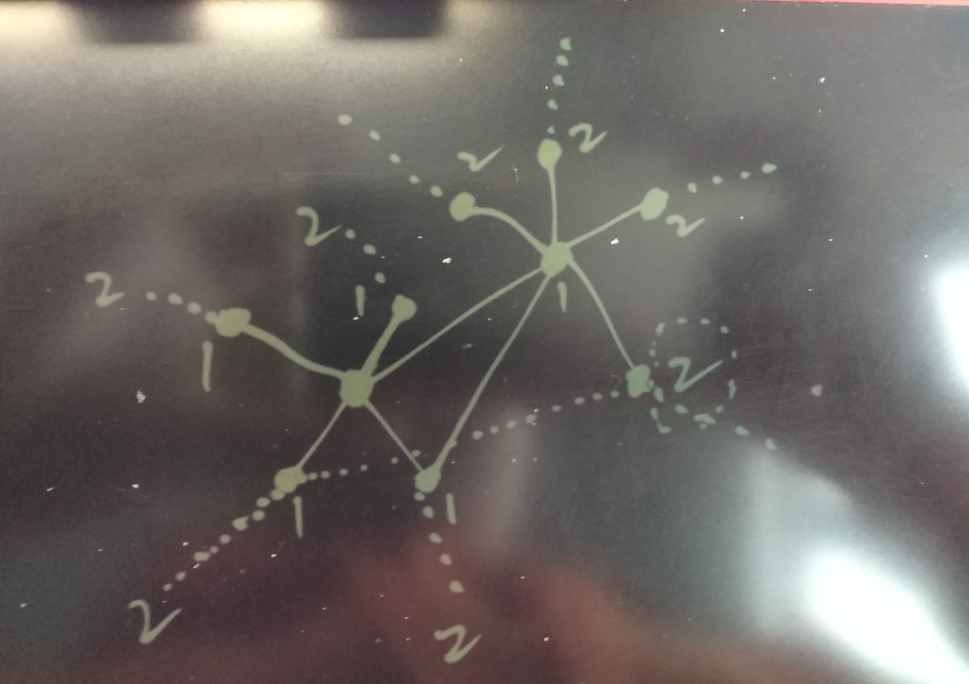
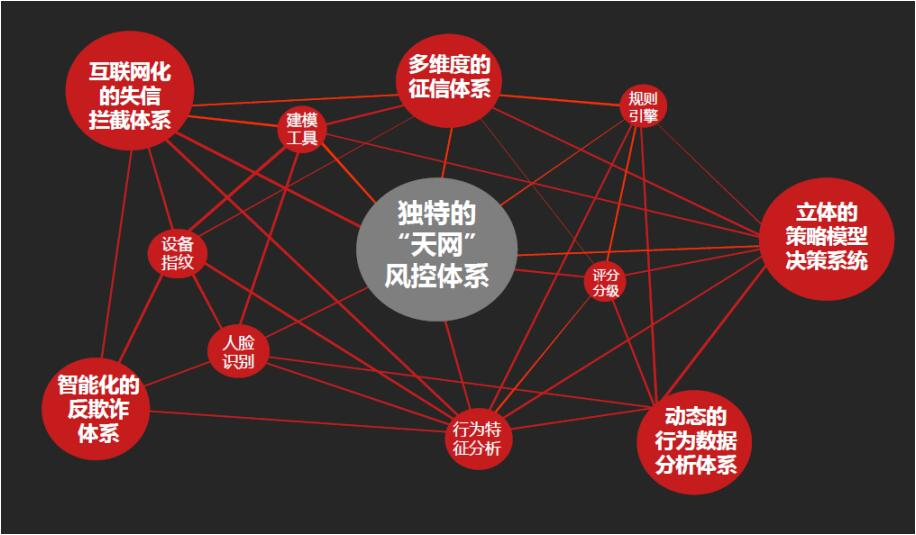
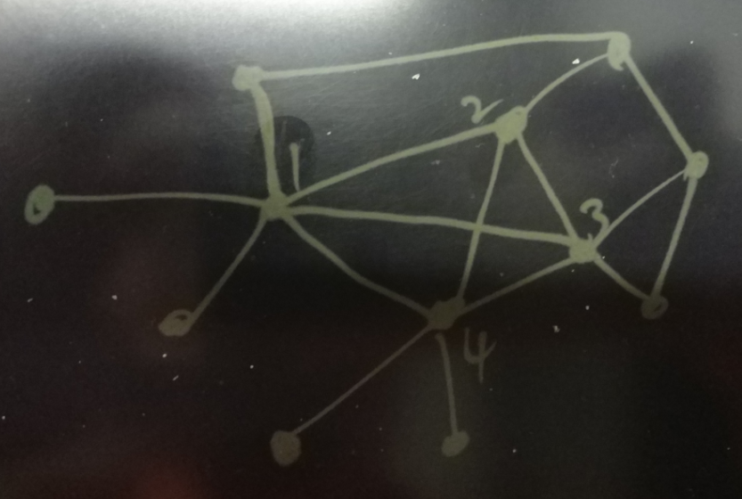
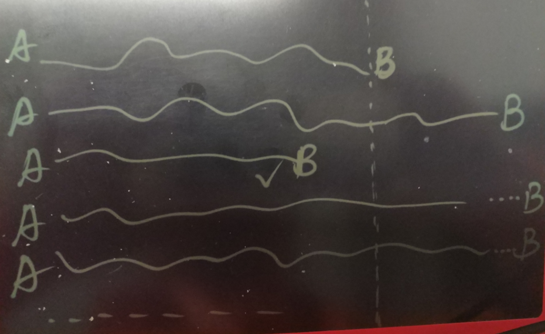
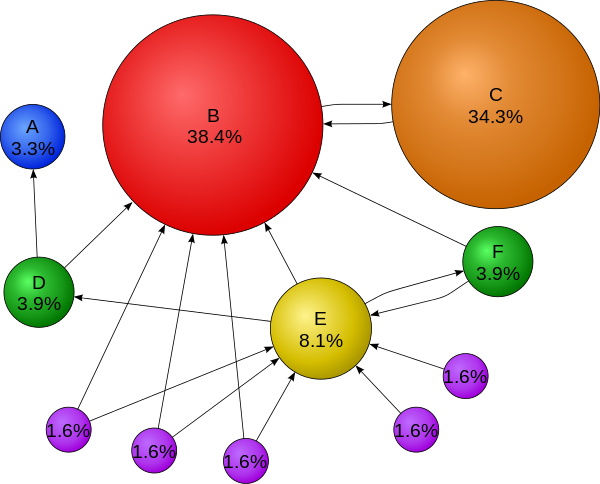
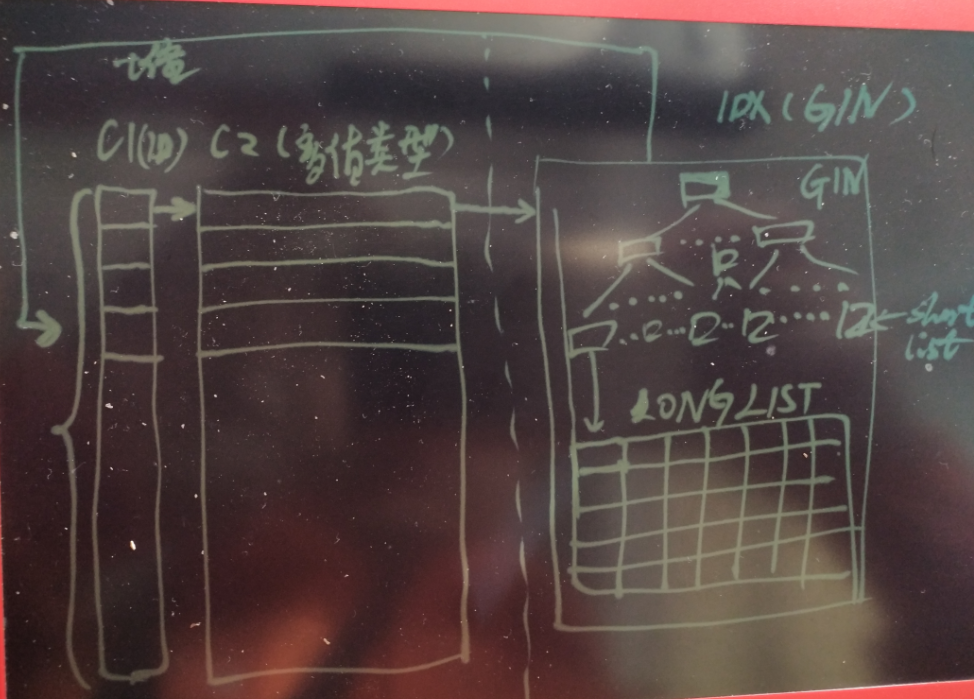
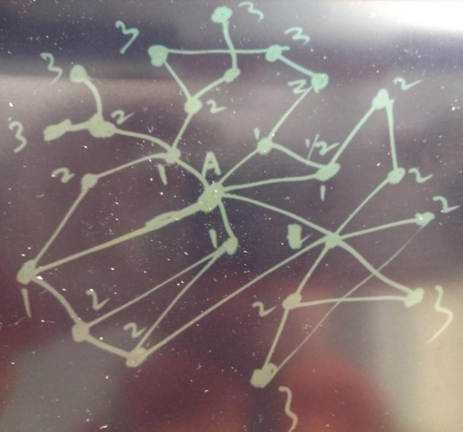

## 金融风控、公安刑侦、社会关系、人脉分析等需求分析与数据库实现 - PostgreSQL图数据库场景应用  
##### [TAG 15](../class/15.md)
                                                
### 作者                                               
digoal                                                
                                                
### 日期                                              
2016-12-13                                                 
                                                
### 标签                                              
PostgreSQL , pgrouting , neo4j , graph database , 图数据库 , 金融风险控制 , 风控 , 刑侦 , 社会关系 , 近亲 , linkedin , 人脉                                                                                                
                                                
----                                              
                                                
## 背景  
人类是群居动物，随着人口的增长，联络方式越来越无界化，人与人，人与事件，人与时间之间形成了一张巨大的关系网络。   
   
有许多场景就是基于这张巨大的关系网络的，比如。   
  
1\. 猎头挖人     
  
作为IT人士或者猎头、HR，对Linkedin一定不陌生，领英网实际上就是一个维护人际关系的网站。    
    
   
   
通过搜索你的一度人脉，可以找到与你直接相关的人，搜索2度人脉，可以搜索到与你间接相关的人。   
    
当然你还可以继续搜索N度人脉，不过那些和你可能就不那么相关了。    
   
如果你知道和美女范冰冰隔了几度人脉，是不是有点心动了呢？    
   
其实在古代，就有这种社会关系学，还有这种专门的职业，买官卖官什么的，其实都是人脉关系网。看过红楼梦的话，你会发现那家子人怎么那么多亲戚呢？     
   
2\. 公安破案   
   
公安刑侦学也是一类人脉相关的应用，只是现在的关系和行为越来越复杂，这种关系也越来越复杂，原来的人能接触的范围基本上就靠2条腿，顶多加匹马。  
  
现在，手机，电脑，ATM机，超时，摄像头，汽车等等，都通过公路网、互联网连接在一起。  
    
一个人的行为，产生的关系会更加的复杂，单靠人肉的关系分析，刑侦难度变得越来越复杂。   
        
3\. 金融风控    
   
比如银行在审核贷款资格时，通常需要审核申请人是否有偿还能力，是否有虚假消息，行为习惯，资产，朋友圈等等。  同样涉及到复杂的人物关系，人的行为关系分析等等。   
  
图片来自互联网  
     
    
   
    
      
此类围绕人为中心，事件为关系牵连的业务催生了图数据库的诞生。   
    
目前比较流行的图数据库比如neo4j，等。  
    
详见   
  
https://en.wikipedia.org/wiki/Graph_database   
   
PostgreSQL是一个功能全面的数据库，其中就有一些图数据库产品的后台是使用PostgreSQL的，例如OpenCog， Cayley等。      
   
除了这些图数据库产品，PostgreSQL本身在关系查询，关系管理方面也非常的成熟。   
     
本文将给大家揭示PostgreSQL是如何玩转金融风控，刑侦，社会关系，人脉关系需求的。    
     
## 图数据模型
   
  
在许多图数据库的设计中会将事件或人物作为NODE，事件或人物之间如果有关系，则建立关系。   
   
在PostgreSQL中，我们可以使用2列来表示这种关系，每列代表一个事件或人物，如果两者有关系，就创建一条记录。   
   
这样表示，和图数据保持一致。   
    
当然后面还有优化的手段，比如数组，PostgreSQL中，将与一个事件关联的其他事件或人物作为数组来存储，可以提高检索的效率。   
    
## PostgreSQL 递归查询能满足关系推导的需求吗
PostgreSQL 递归查询是很出彩的功能，还记不记得我写的  
  
[《distinct xx和count(distinct xx)的变态递归优化方法 - 索引收敛(skip scan)扫描》](../201611/20161128_02.md)  
  
[《用PostgreSQL找回618秒逝去的青春 - 递归收敛优化》](20161201_01.md)  
  
但是，请记住，关系是可能打环的，由于有LOOP的问题，所以在推导时每次要排除之前已找到的所有关系，这一点目前的PostgreSQL递归还没有办法做到。  
  
例如，我需要这样的语法来支持排除打环  
  
```
postgres=# with recursive s as ( 
  select c1,c2 from a where c1=1
  union all
  select a.c1,a.c2 from a join s on (a.c1=s.c2) where a.c1 not in (with t as (insert into tmp select * from s) select c2 from tmp ) and s.* is not null
)
  select * from s;

ERROR:  42P19: recursive reference to query "s" must not appear within a subquery
LINE 4: ... not in (with t as (insert into tmp select * from s) select ...
                                                             ^
LOCATION:  checkWellFormedRecursionWalker, parse_cte.c:773
```
  
而目前是不支持的.   
    
递归只能排除work table的集合，不能排除整个递归过程的集合，如果关系中存在LOOP则会导致无限LOOP。   
   
图例 :    
   
  
  
这里的很多点合在一起就形成环状了，例如我和A是好朋友，和B也是好朋友，A和B也是好朋友，这样的关系。   
   
在推导时，从我开始推导出A,B，然后A又推导出B，B又推导出A，。。。。无限循环。   
   
## PostgreSQL UDF解决关系环的问题
使用UDF可以很好的解决数据打环导致递归无限循环的这个问题   
  
### 建模  
    
构建1亿条关系数据，假设人物一共1000万个。此处为了测试方便，在表中省略人物或事件的其他属性（如时间，地点，亲密度等）     
    
```
postgres=# create table a(c1 int, c2 int, primary key(c1,c2));
CREATE TABLE
postgres=# create index idx_a_1 on a(c1);
CREATE INDEX
postgres=# create index idx_a_2 on a(c2);
CREATE INDEX

postgres=# insert into a select random()*10000000, random()*10000000 from generate_series(1,100000000) ;
```
  
函数用到的几个临时表   
  
```
create temp table if not exists tmp1(level int, c1 int, c2 int) ON COMMIT delete rows; 
  create index if not exists idx_tmp1_1 on tmp1(level);
  create index if not exists idx_tmp1_2 on tmp1(c1);
  create index if not exists idx_tmp1_3 on tmp1(c2);

create unlogged table u1 (like tmp1);

create temp table if not exists tmp2(level int, path int[], c1 int, c2 int) ON COMMIT delete rows; 
  create index if not exists idx_tmp2_1 on tmp2(level);
  create index if not exists idx_tmp2_2 on tmp2(c1);
  create index if not exists idx_tmp2_3 on tmp2(c2);

create unlogged table u2 (like tmp2);
```
   
### 函数1， 输出以A为中心的，N级关系数据。   
  
```
create or replace function find_rel(v_c1 int, v_level int) returns setof u1 as $$
declare 
  i int := 1; 
begin 
  if v_level <=0 then 
    raise notice 'level must >=1'; 
    return; 
  end if; 
  
  -- 9.6还是inner temp table，频繁创建和删除，可能导致catalog产生垃圾，需要注意一下。  
  -- 用来临时存储从起点开始, 牵扯出来的每一层级的关系
  create temp table if not exists tmp1(level int, c1 int, c2 int) ON COMMIT delete rows; 
  create index if not exists idx_tmp1_1 on tmp1(level);
  create index if not exists idx_tmp1_2 on tmp1(c1);
  create index if not exists idx_tmp1_3 on tmp1(c2);

  -- 存储初始层级, 即起点的数据
  return query insert into tmp1 select i, * from a where c1=v_c1 returning *; 

  loop
    i := i+1; 

    -- 已找到所有层级的数据
    if i > v_level then
      return;
    end if; 

    -- 通过与level=i-1的JOIN推导下一级关系(group by排除重复node(比如1-2-3-4, 1-5-3-4，这里的3会被排除掉))，通过not exists排除打环的点
    return query insert into tmp1 select i, a.c1, a.c2 from a join (select c2 from tmp1 where level=i-1 group by c2) tmp on (a.c1=tmp.c2) where not exists (select 1 from tmp1 where a.c1 = tmp1.c1) returning *; 
  end loop; 
end;
$$ language plpgsql strict;
```
   
### 函数2， 输出以A为中心的，N级关系数据。   
   
同时产生路径，注意这个路径是完备路径，一个NODE可能有多条线路经过。   
  
```
create or replace function find_rel_withpath(v_c1 int, v_level int) returns setof u2 as $$
declare 
  i int := 1; 
begin 
  if v_level <=0 then 
    raise notice 'level must >=1'; 
    return; 
  end if; 
  
  -- 9.6还是inner temp table，频繁创建和删除，可能导致catalog产生垃圾，需要注意一下。  
  -- 用来临时存储从起点开始, 牵扯出来的每一层级的关系
  create temp table if not exists tmp2(level int, path int[], c1 int, c2 int) ON COMMIT delete rows; 
  create index if not exists idx_tmp2_1 on tmp2(level);
  create index if not exists idx_tmp2_2 on tmp2(c1);
  create index if not exists idx_tmp2_3 on tmp2(c2);

  -- 存储初始层级, 即起点的数据
  return query insert into tmp2 select i, array[]::int[] || c1 || c2 , * from a where c1=v_c1 returning *; 

  loop
    i := i+1; 

    -- 已找到所有层级的数据
    if i > v_level then
      return;
    end if; 

    -- 通过与level=i-1的JOIN推导下一级关系(group by排除重复node(比如1-2-3-4, 1-2-3-4，完全重复的路径，排除掉。实际中加了c1,c2唯一约束后不可能存在))，通过not exists排除打环的点
    -- path用来表示当前路径，是不是很爽
    -- 如果有c1,c2的PK约束，可以不使用group by，直接与tmp2关联
    return query insert into tmp2 select i, tmp.path||a.c2, a.c1, a.c2 from a join (select c2,path from tmp2 where level=i-1 group by c2,path) tmp on (a.c1=tmp.c2) where not exists (select 1 from tmp2 where a.c1 = tmp2.c1) returning *; 
  end loop; 
end;
$$ language plpgsql strict;
```
   
### 函数3，找两个人物、事件的最短关系路径   
   
这里就考验优化算法了，涉及从哪个点开始搜索，或者两边同时进行辐射式搜索等。      
    
```
create or replace function find_rel_path(v_c1 int, v_c2 int) returns setof int[] as $$
declare 
  i int := 1; 
begin 
  -- 9.6还是inner temp table，频繁创建和删除，可能导致catalog产生垃圾，需要注意一下。  
  -- 用来临时存储从起点开始, 牵扯出来的每一层级的关系
  create temp table if not exists tmp2(level int, path int[], c1 int, c2 int) ON COMMIT delete rows; 
  create index if not exists idx_tmp2_1 on tmp2(level);
  create index if not exists idx_tmp2_2 on tmp2(c1);
  create index if not exists idx_tmp2_3 on tmp2(c2);

  -- 存储初始层级, 即起点的数据
  insert into tmp2 select i, array[]::int[] || c1 || c2 , * from a where c1=v_c1;

  loop
    i := i+1; 
    
    perform 1 from tmp2 where c2=v_c2 limit 1;
    if found then
      return query select path from tmp2 where c2=v_c2 and level=i-1;
      return;
    end if;

    insert into tmp2 select i, tmp.path||a.c2, a.c1, a.c2 from a join (select c2,path from tmp2 where level=i-1 group by c2,path) tmp on (a.c1=tmp.c2) where not exists (select 1 from tmp2 where a.c1 = tmp2.c1);
  end loop; 
end;
$$ language plpgsql strict;
```
   
### 测试
1\. 找出ID=1这个用户的3级关系网     
    
```
select * from find_rel(1,3);

select * from find_rel_withpath(1,3);
```
  
结果  
  
```
postgres=# select * from find_rel(1,3);
NOTICE:  relation "tmp1" already exists, skipping
NOTICE:  relation "idx_tmp1_1" already exists, skipping
NOTICE:  relation "idx_tmp1_2" already exists, skipping
NOTICE:  relation "idx_tmp1_3" already exists, skipping
 level |   c1    |   c2    
-------+---------+---------
     1 |       1 | 5157873
     1 |       1 | 3102468
     1 |       1 | 8399312
     1 |       1 | 1442141
     1 |       1 | 5094441
     1 |       1 | 1521897
     1 |       1 |  401079
     2 |  401079 | 1147078
     2 |  401079 | 9740100
......
     3 | 1731998 | 6503196
     3 | 1731998 | 5112396
     3 | 6525458 |  937613
     3 | 6525458 | 8459123
     3 | 6525458 | 8419231
     3 | 6525458 | 4021987
(828 rows)
Time: 15.000 ms

postgres=# select * from find_rel_withpath(1,3);
NOTICE:  relation "tmp2" already exists, skipping
NOTICE:  relation "idx_tmp2_1" already exists, skipping
NOTICE:  relation "idx_tmp2_2" already exists, skipping
NOTICE:  relation "idx_tmp2_3" already exists, skipping
 level |            path             |   c1    |   c2    
-------+-----------------------------+---------+---------
     1 | {1,5157873}                 |       1 | 5157873
     1 | {1,3102468}                 |       1 | 3102468
     1 | {1,8399312}                 |       1 | 8399312
     1 | {1,1442141}                 |       1 | 1442141
     1 | {1,5094441}                 |       1 | 5094441
     1 | {1,1521897}                 |       1 | 1521897
     1 | {1,401079}                  |       1 |  401079
     2 | {1,401079,1147078}          |  401079 | 1147078
     2 | {1,401079,9740100}          |  401079 | 9740100
......
     3 | {1,1442141,9719411,7811631} | 9719411 | 7811631
     3 | {1,401079,9740100,5119416}  | 9740100 | 5119416
     3 | {1,401079,9740100,350046}   | 9740100 |  350046
     3 | {1,401079,9740100,8223067}  | 9740100 | 8223067
     3 | {1,401079,9740100,5608312}  | 9740100 | 5608312
     3 | {1,401079,9740100,7920319}  | 9740100 | 7920319
     3 | {1,401079,9740100,6416565}  | 9740100 | 6416565
(828 rows)
Time: 19.524 ms


postgres=# select * from find_rel_withpath(1,5) order by level desc limit 10;
NOTICE:  relation "tmp2" already exists, skipping
NOTICE:  relation "idx_tmp2_1" already exists, skipping
NOTICE:  relation "idx_tmp2_2" already exists, skipping
NOTICE:  relation "idx_tmp2_3" already exists, skipping
 level |                  path                  | c1  |   c2    
-------+----------------------------------------+-----+---------
     5 | {1,401079,3806993,3879310,165,8074824} | 165 | 8074824
     5 | {1,401079,3806993,3879310,165,5983603} | 165 | 5983603
     5 | {1,401079,3806993,3879310,165,9804825} | 165 | 9804825
     5 | {1,401079,3806993,3879310,165,3848025} | 165 | 3848025
     5 | {1,401079,3806993,3879310,165,2045526} | 165 | 2045526
     5 | {1,401079,3806993,3879310,165,9783524} | 165 | 9783524
     5 | {1,401079,3806993,3879310,165,386886}  | 165 |  386886
     5 | {1,401079,3806993,3879310,165,6318408} | 165 | 6318408
     5 | {1,401079,3806993,3879310,165,1150578} | 165 | 1150578
     5 | {1,401079,3806993,3879310,165,6702827} | 165 | 6702827
(10 rows)
Time: 1473.953 ms
```
   
2\. 找出ID=1和ID=386886的最短关系路径     
  
```
select * from find_rel_path(1,386886);
```
     
结果   
    
```
postgres=# select * from find_rel_path(1,386886);
NOTICE:  relation "tmp2" already exists, skipping
NOTICE:  relation "idx_tmp2_1" already exists, skipping
NOTICE:  relation "idx_tmp2_2" already exists, skipping
NOTICE:  relation "idx_tmp2_3" already exists, skipping
             find_rel_path             
---------------------------------------
 {1,401079,3806993,3879310,165,386886}
(1 row)
Time: 1069.781 ms

postgres=# select * from find_rel_path(1,3879310);
NOTICE:  relation "tmp2" already exists, skipping
NOTICE:  relation "idx_tmp2_1" already exists, skipping
NOTICE:  relation "idx_tmp2_2" already exists, skipping
NOTICE:  relation "idx_tmp2_3" already exists, skipping
       find_rel_path        
----------------------------
 {1,401079,3806993,3879310}
(1 row)
Time: 17.290 ms
```
     
速度杠杠的。    
   
### UDF优化思路1 - 游标，流式接收
我们看到，前面的UDF，都是搜索到所有数据后才开始输出，实际上，可以在找到第一条记录后就开始输出，这样客户端可以不断的接收数据，减少延迟。   
   
使用游标就可以达到这样的目的。   
   
游标用法参考  
    
https://www.postgresql.org/docs/9.6/static/plpgsql-cursors.html    
  
举例  
  
```
create or replace function find_rel_withpath_cur(v_c1 int, v_level int) returns setof refcursor as $$
declare 
  i int := 1; 
  ref refcursor[];  
  res refcursor;  
begin 
  if v_level <=0 then 
    raise notice 'level must >=1'; 
    return; 
  end if; 

  for x in 1..v_level loop
    ref[x] := 'a'||x;
  end loop;

  -- 9.6还是inner temp table，频繁创建和删除，可能导致catalog产生垃圾，需要注意一下。  
  -- 用来临时存储从起点开始, 牵扯出来的每一层级的关系
  create temp table if not exists tmp2(level int, path int[], c1 int, c2 int) ON COMMIT delete rows; 
  create index if not exists idx_tmp2_1 on tmp2(level);
  create index if not exists idx_tmp2_2 on tmp2(c1);
  create index if not exists idx_tmp2_3 on tmp2(c2);

  -- 存储初始层级, 即起点的数据
  res := ref[i];
  open res for insert into tmp2 select i, array[]::int[] || c1 || c2 , * from a where c1=v_c1 returning *; 
  return next res;

  loop
    i := i+1; 

    -- 已找到所有层级的数据
    if i > v_level then
      return;
    end if; 

    -- 通过与level=i-1的JOIN推导下一级关系(group by排除重复node(比如1-2-3-4, 1-2-3-4，完全重复的路径，排除掉。实际中加了c1,c2唯一约束后不可能存在))，通过not exists排除打环的点
    -- path用来表示当前路径，是不是很爽
    -- 如果有c1,c2的PK约束，可以不使用group by，直接与tmp2关联
    res := ref[i];
    open res for insert into tmp2 select i, tmp.path||a.c2, a.c1, a.c2 from a join (select c2,path from tmp2 where level=i-1 group by c2,path) tmp on (a.c1=tmp.c2) where not exists (select 1 from tmp2 where a.c1 = tmp2.c1) returning *; 
    return next res;
  end loop; 
end;
$$ language plpgsql strict;
```
    
```
postgres=# begin;
BEGIN
Time: 0.390 ms
postgres=# select * from find_rel_withpath_cur(1,5);
NOTICE:  relation "tmp2" already exists, skipping
NOTICE:  relation "idx_tmp2_1" already exists, skipping
NOTICE:  relation "idx_tmp2_2" already exists, skipping
NOTICE:  relation "idx_tmp2_3" already exists, skipping
 find_rel_withpath_cur 
-----------------------
 a1
 a2
 a3
 a4
 a5
(5 rows)
Time: 4.008 ms
```
   
返回1级关系  
  
```
postgres=# fetch all in a1;
 level |    path     | c1 |   c2    
-------+-------------+----+---------
     1 | {1,5157873} |  1 | 5157873
     1 | {1,3102468} |  1 | 3102468
     1 | {1,8399312} |  1 | 8399312
     1 | {1,1442141} |  1 | 1442141
     1 | {1,5094441} |  1 | 5094441
     1 | {1,1521897} |  1 | 1521897
     1 | {1,401079}  |  1 |  401079
(7 rows)

Time: 0.958 ms
```
  
返回2级关系   
  
```
postgres=# fetch all in a2;
 level |        path         |   c1    |   c2    
-------+---------------------+---------+---------
     2 | {1,401079,1147078}  |  401079 | 1147078
     2 | {1,401079,9740100}  |  401079 | 9740100
     2 | {1,401079,8171779}  |  401079 | 8171779
     2 | {1,401079,3806993}  |  401079 | 3806993
     2 | {1,401079,2491387}  |  401079 | 2491387
......
     2 | {1,8399312,5886963} | 8399312 | 5886963
     2 | {1,8399312,3652462} | 8399312 | 3652462
     2 | {1,8399312,8148713} | 8399312 | 8148713
     2 | {1,8399312,8282991} | 8399312 | 8282991
(75 rows)
Time: 3.173 ms
```
   
以此类推   
  
```
postgres=# fetch all in a3;
 level |            path             |   c1    |   c2    
-------+-----------------------------+---------+---------
     3 | {1,1521897,47614,2653114}   |   47614 | 2653114
     3 | {1,1521897,47614,1354306}   |   47614 | 1354306
     3 | {1,1521897,47614,7452721}   |   47614 | 7452721
...
     3 | {1,401079,9740100,7920319}  | 9740100 | 7920319
     3 | {1,401079,9740100,6416565}  | 9740100 | 6416565
(746 rows)
Time: 25.455 ms
```
   
```
postgres=# fetch all in a4;
......
     4 | {1,401079,8171779,9968575,6388546}  | 9968575 | 6388546
     4 | {1,401079,8171779,9968575,8281935}  | 9968575 | 8281935
     4 | {1,401079,8171779,9968575,6076729}  | 9968575 | 6076729
     4 | {1,401079,8171779,9968575,7087557}  | 9968575 | 7087557
(7383 rows)
Time: 14.482 ms
```
   
**注意**  
  
因为这里的游标返回有上下文的关系，所以务必在接收完一个游标后再接收下一个游标的数据，如果一开就就直接接收后面的游标，会没有数据。   
  
```
postgres=# begin;
BEGIN
Time: 0.561 ms
postgres=# select * from find_rel_withpath_cur(1,5);
NOTICE:  relation "tmp2" already exists, skipping
NOTICE:  relation "idx_tmp2_1" already exists, skipping
NOTICE:  relation "idx_tmp2_2" already exists, skipping
NOTICE:  relation "idx_tmp2_3" already exists, skipping
 find_rel_withpath_cur 
-----------------------
 a1
 a2
 a3
 a4
 a5
(5 rows)

Time: 2.161 ms

如果一开始就跳跃式的接收，那么这个以后的游标都不会再有数据了。  

postgres=# fetch all in a4;
 level | path | c1 | c2 
-------+------+----+----
(0 rows)

Time: 0.738 ms
postgres=# fetch all in a5;
 level | path | c1 | c2 
-------+------+----+----
(0 rows)

Time: 0.727 ms
postgres=# fetch all in a1;
 level |    path     | c1 |   c2    
-------+-------------+----+---------
     1 | {1,5157873} |  1 | 5157873
     1 | {1,3102468} |  1 | 3102468
     1 | {1,8399312} |  1 | 8399312
     1 | {1,1442141} |  1 | 1442141
     1 | {1,5094441} |  1 | 5094441
     1 | {1,1521897} |  1 | 1521897
     1 | {1,401079}  |  1 |  401079
(7 rows)
Time: 0.954 ms
```
    
使用游标后，可以按关系层级流式接收了。   
  
```
c2=数组类型时的游标返回函数     
  
create or replace function find_rel_withpath_cur_array(v_c1 int, v_level int) returns setof refcursor as $$
declare 
  i int := 1; 
  ref refcursor[];  
  res refcursor;  
begin 
  if v_level <=0 then 
    raise notice 'level must >=1'; 
    return; 
  end if; 

  for x in 1..v_level loop
    ref[x] := 'a'||x;
  end loop;

  -- 9.6还是inner temp table，频繁创建和删除，可能导致catalog产生垃圾，需要注意一下。  
  -- 用来临时存储从起点开始, 牵扯出来的每一层级的关系
  create temp table if not exists tmp2(level int, path int[], c1 int, c2 int) ON COMMIT delete rows; 
  create index if not exists idx_tmp2_1 on tmp2(level);
  create index if not exists idx_tmp2_2 on tmp2(c1);
  create index if not exists idx_tmp2_3 on tmp2(c2);

  -- 存储初始层级, 即起点的数据
  res := ref[i];
  open res for insert into tmp2 select i as level, array[]::int[] || c1 || c2 as path , c1, c2 from (select c1,unnest(c2) as c2 from a where c1=v_c1) a returning *; 
  return next res;

  loop
    i := i+1; 

    -- 已找到所有层级的数据
    if i > v_level then
      return;
    end if; 

    -- 通过与level=i-1的JOIN推导下一级关系(group by排除重复node(比如1-2-3-4, 1-2-3-4，完全重复的路径，排除掉。实际中加了c1,c2唯一约束后不可能存在))，通过not exists排除打环的点
    -- path用来表示当前路径，是不是很爽
    -- 如果有c1,c2的PK约束，可以不使用group by，直接与tmp2关联
    res := ref[i];
    open res for insert into tmp2 select i as level, a.path||a.c2 as path, a.c1, a.c2 from (select tmp2.path, a.c1, unnest(a.c2) c2 from a join tmp2 on (a.c1=tmp2.c2 and tmp2.level=i-1 and tmp2.c1<>a.c1)) a returning *; 
    return next res;
  end loop; 
end;
$$ language plpgsql strict;
```
     
### UDF优化思路2，函数流式接收
目前PostgreSQL的insert into ... returning *要等insert结束才能返回第一条记录，所以层级越深，插入时间越长，层级越深的数据接收可能越慢。那么还有更好的优化手段吗。   
   
除了修改内核(这是最好的方法)，让其支持insert into ... returning *的游标支持流式返回，还有一种方法，在函数中流式返回。   
   
#### 创建1亿用户，每5万作为一个有牵连的群体，每个用户牵连1000个用户，形成1000亿的超大规模关系网。   
  
```
postgres=# create table a(c1 int, c2 int[], primary key (c1));
CREATE TABLE


vi test.sql
\set id random(1,100000000)
insert into a select :id, (select array_agg(((width_bucket(:id,1,100000000,2000)-1)*50000 + (random()*50000)::int)) from generate_series(1,1000)) on conflict do nothing;

pgbench -M prepared -n -r -P 5 -f ./test.sql -c 64 -j 64 -T 100000
```
  
约520GB    
  
#### 测试场景  
  
根据用户A，推导他的N级关系网。  
  
```
create or replace function find_rel_withpath_cur(v_c1 int, v_level int) returns setof record as $$ 
declare  
  i int := 1;  
  ref1 cursor(var1 int, var2 int) for select var1 as level, array[]::int[] || c1 || c2 as path , c1, c2 from (select c1,unnest(c2) as c2 from a where c1=var2) a ;
  ref2 cursor(var1 int) for select var1 as level, a.path||a.c2 as path, a.c1, a.c2 from (select tmp2.path, a.c1, unnest(a.c2) c2 from a join tmp2 on (a.c1=tmp2.c2 and tmp2.level=i-1 and tmp2.c1<>a.c1)) a;
begin 
  if v_level <=0 then 
    raise notice 'level must >=1'; 
    return; 
  end if; 

  -- 9.6还是inner temp table，频繁创建和删除，可能导致catalog产生垃圾，需要注意一下。   
  -- 用来临时存储从起点开始, 牵扯出来的每一层级的关系  
  -- 目前plpgsql不支持流式返回, 即使使用return next , return query 
  -- https://www.postgresql.org/docs/9.6/static/plpgsql-control-structures.html  
  create temp table if not exists tmp2(level int, path int[] unique, c1 int, c2 int) ON COMMIT delete rows;   
  create index if not exists idx_tmp2_1 on tmp2(level, c2);  

  -- 存储初始层级, 即起点的数据  
  for rec in ref1(i, v_c1) loop 
    insert into tmp2 values (rec.level, rec.path, rec.c1, rec.c2) on conflict do nothing; 
    if found then 
      return next rec; 
    end if;
  end loop; 

  loop
    i := i+1; 

    -- 已找到所有层级的数据 
    if i > v_level then 
      return; 
    end if; 

    -- 通过与level=i-1的JOIN推导下一级关系(group by排除重复node(比如1-2-3-4, 1-2-3-4，完全重复的路径，排除掉。实际中加了c1,c2唯一约束后不可能存在))，通过not exists排除打环的点
    -- path用来表示当前路径，是不是很爽
    -- 如果有c1,c2的PK约束，可以不使用group by，直接与tmp2关联

    for rec in ref2(i) loop 
      insert into tmp2 values(rec.level, rec.path, rec.c1, rec.c2) on conflict do nothing; 
      if found then 
        return next rec; 
      end if; 
    end loop;  

  end loop; 
  return;
end;
$$ language plpgsql strict;   
```
  
目前plpgsql不支持流式返回, 即使使用return next , return query  
  
https://www.postgresql.org/docs/9.6/static/plpgsql-control-structures.html  
  
```
Note: The current implementation of RETURN NEXT and RETURN QUERY stores the entire result set before returning from the function, as discussed above. 

That means that if a PL/pgSQL function produces a very large result set, performance might be poor: 
data will be written to disk to avoid memory exhaustion, but the function itself will not return until the entire result set has been generated. 
A future version of PL/pgSQL might allow users to define set-returning functions that do not have this limitation. 
Currently, the point at which data begins being written to disk is controlled by the work_mem configuration variable. 

Administrators who have sufficient memory to store larger result sets in memory should consider increasing this parameter.
```
  
目前使用c function实现以上逻辑，可以实现函数的流式接收。    
  
#### 测试场景2
测试从1000亿数据量中，取出某个用户的10级关系  
  
```
-- 消除重复NODE，例如有N条路径经过同一个NODE，只记录一个NODE。

create or replace function find_rel(v_c1 int, v_level int) returns setof u1 as $$
declare 
  i int := 1; 
begin 
  if v_level <=0 then 
    raise notice 'level must >=1'; 
    return; 
  end if; 

  -- 9.6还是inner temp table，频繁创建和删除，可能导致catalog产生垃圾，需要注意一下。  
  -- 用来临时存储从起点开始, 牵扯出来的每一层级的关系
  create temp table if not exists tmp1( level int, c1 int primary key) ON COMMIT delete rows; 
  create index if not exists idx_tmp1_1 on tmp1(level, c1); 

  -- 存储初始层级, 即起点的数据
  return query insert into tmp1 select i, c1 from a where c1=v_c1 union select i, unnest(c2) from a where c1=v_c1 returning *; 

  loop
    i := i+1; 

    -- 已找到所有层级的数据 
    if i > v_level then 
      return; 
    end if; 

    -- 通过与level=i-1的JOIN推导下一级关系(group by排除重复node(比如1-2-3-4, 1-5-3-4，这里的3会被排除掉))，通过not exists排除打环的点

    return query 
    insert into tmp1 
      select t.i, t.c2 from 
        ( select i, unnest(c2) c2 from a join tmp1 tmp on ( a.c1=tmp.c1 and tmp.level=i-1 and a.c1<>v_c1 )
        ) t
        left join tmp1 on (t.c2=tmp1.c1) 
        where tmp1.* is null group by 1,2 
    on conflict do nothing 
    returning *;  
    
  end loop; 
end; 
$$ language plpgsql strict; 
```
    
```
postgres=#  select count(*) from find_rel(5000,10);
NOTICE:  relation "tmp1" already exists, skipping
NOTICE:  relation "idx_tmp1_1" already exists, skipping
 count 
-------
 50001
(1 row)

由于数据模型的问题，第三级搜索了5000万记录，所以耗费了约15秒，
没有打开CPU并行也是耗费时间较长的原因。

据研究，每个人约维护200个左右的亲密关系网
正常的业务模型应该是每一级都会加一定的约束进行结果收敛，不会无限扩散。
正常的业务模型，查询时间可以控制在秒级。  
Time: 17131.492 ms
```
   
```
create or replace function find_rel_cur(v_c1 int, v_level int) returns setof refcursor as $$
declare 
  i int := 1; 
  ref refcursor[];  
  res refcursor;  
begin 
  if v_level <=0 then 
    raise notice 'level must >=1'; 
    return; 
  end if; 

  for x in 1..v_level loop
    ref[x] := 'a'||x;
  end loop;

  -- 9.6还是inner temp table，频繁创建和删除，可能导致catalog产生垃圾，需要注意一下。  
  -- 用来临时存储从起点开始, 牵扯出来的每一层级的关系
  create temp table if not exists tmp1( level int, c1 int primary key) ON COMMIT delete rows; 
  create index if not exists idx_tmp1_1 on tmp1(level, c1); 

  -- 存储初始层级, 即起点的数据
  res := ref[i];
  open res for insert into tmp1 select i, c1 from a where c1=v_c1 union select i, unnest(c2) from a where c1=v_c1 returning *; 
  return next res;

  loop
    i := i+1; 

    -- 已找到所有层级的数据 
    if i > v_level then 
      return; 
    end if; 

    -- 通过与level=i-1的JOIN推导下一级关系(group by排除重复node(比如1-2-3-4, 1-5-3-4，这里的3会被排除掉))，通过not exists排除打环的点

    res := ref[i];
    open res for 
      insert into tmp1 
      select t.i, t.c2 from 
        ( select i, unnest(c2) c2 from a join tmp1 tmp on ( a.c1=tmp.c1 and tmp.level=i-1 and a.c1<>v_c1 )
        ) t
        left join tmp1 on (t.c2=tmp1.c1) 
        where tmp1.* is null group by 1,2 
      on conflict do nothing 
      returning *;
    return next res;
  end loop; 
end; 
$$ language plpgsql strict; 

postgres=# select * from find_rel_cur(1,10);
NOTICE:  relation "tmp1" already exists, skipping
NOTICE:  relation "idx_tmp1_1" already exists, skipping
 find_rel_cur 
--------------
 a1
 a2
 a3
 a4
 a5
 a6
 a7
 a8
 a9
 a10
(10 rows)

Time: 2.098 ms
postgres=# fetch 1 in a1;
 level |  c1   
-------+-------
     1 | 37394
(1 row)

Time: 3.138 ms
postgres=# fetch 1 in a2;
 level | c1 
-------+----
     2 |  0
(1 row)

Time: 1345.473 ms

由于测试模型的问题，第三级搜索了5000万记录
正常的业务模型不会如此，不必担心
postgres=# fetch 1 in a3;
 level | c1 
-------+----
(0 rows)

Time: 15587.686 ms
postgres=# fetch 1 in a4;
 level | c1 
-------+----
(0 rows)

Time: 0.143 ms
postgres=# 
```
   
### UDF优化思路3，异步消息
使用异步消息也可以达到同样的效果。     
   
PostgreSQL是不是很好用呢，异步消息都有啦。    
    
例子  
  
```
create extension dblink;
CREATE FOREIGN DATA WRAPPER postgresql VALIDATOR postgresql_fdw_validator;
CREATE SERVER dst FOREIGN DATA WRAPPER postgresql OPTIONS (hostaddr '127.0.0.1', port '1921', dbname 'postgres');
CREATE USER MAPPING FOR postgres SERVER dst OPTIONS (user 'postgres', password 'postgres');


create or replace function find_rel_withpath_notify(v_c1 int, v_level int, v_notify_channel text) returns void as $$ 
declare  
  i int := 1;  
  query text;
  ref1 cursor(var1 int, var2 int) for select var1 as level, array[]::int[] || c1 || c2 as path , c1, c2 from (select c1,unnest(c2) as c2 from a where c1=var2) a ;
  ref2 cursor(var1 int) for select var1 as level, a.path||a.c2 as path, a.c1, a.c2 from (select tmp2.path, a.c1, unnest(a.c2) c2 from a join tmp2 on (a.c1=tmp2.c2 and tmp2.level=i-1 and tmp2.c1<>a.c1)) a;
begin 
  if v_level <=0 then 
    raise notice 'level must >=1'; 
    return; 
  end if; 

  -- 判断连接是否存在, 不存在则创建.
  if array_position(dblink_get_connections(), v_notify_channel) is not null then 
  else
    perform dblink_connect(v_notify_channel, 'dst');
  end if;

  -- 9.6还是inner temp table，频繁创建和删除，可能导致catalog产生垃圾，需要注意一下。   
  -- 用来临时存储从起点开始, 牵扯出来的每一层级的关系  
  -- 目前plpgsql不支持流式返回, 即使使用return next , return query 
  -- https://www.postgresql.org/docs/9.6/static/plpgsql-control-structures.html  
  create temp table if not exists tmp2(level int, path int[] unique, c1 int, c2 int) ON COMMIT delete rows;   
  create index if not exists idx_tmp2_1 on tmp2(level, c2);  

  -- 存储初始层级, 即起点的数据  
  for rec in ref1(i, v_c1) loop 
    insert into tmp2 values (rec.level, rec.path, rec.c1, rec.c2) on conflict do nothing; 
    if found then 
      query := format($_$select 1 from pg_notify( %L , 'level: %s, path: %s, c1: %s, c2: %s')$_$, v_notify_channel, rec.level, rec.path, rec.c1, rec.c2);
      -- 发送异步消息
      perform * from dblink(v_notify_channel, query, true) as t(id int); 
    end if; 
  end loop; 

  loop
    i := i+1; 

    -- 已找到所有层级的数据 
    if i > v_level then 
      return; 
    end if; 

    -- 通过与level=i-1的JOIN推导下一级关系(group by排除重复node(比如1-2-3-4, 1-2-3-4，完全重复的路径，排除掉。实际中加了c1,c2唯一约束后不可能存在))，通过not exists排除打环的点
    -- path用来表示当前路径，是不是很爽
    -- 如果有c1,c2的PK约束，可以不使用group by，直接与tmp2关联

    for rec in ref2(i) loop 
      insert into tmp2 values(rec.level, rec.path, rec.c1, rec.c2) on conflict do nothing; 
      if found then 
        query := format($_$select 1 from pg_notify( %L , 'level: %s, path: %s, c1: %s, c2: %s')$_$, v_notify_channel, rec.level, rec.path, rec.c1, rec.c2);
        -- 发送异步消息
        perform * from dblink(v_notify_channel, query, true) as t(id int); 
      end if; 
    end loop;  

  end loop; 
  return;
end;
$$ language plpgsql strict;   
``` 
  
在会话a开启一个监听  
  
```
postgres=# listen hello;
```
  
在会话B启动查询  
  
```
postgres=# select find_rel_withpath_notify(1,5,'hello');
```
  
会话A可以读取异步消息  
  
```
。。。。。。
Asynchronous notification "hello" with payload "level: 2, path: {1,32847,15869}, c1: 32847, c2: 15869" received from server process with PID 33062.
Asynchronous notification "hello" with payload "level: 2, path: {1,32847,21312}, c1: 32847, c2: 21312" received from server process with PID 33062.
Asynchronous notification "hello" with payload "level: 2, path: {1,32847,22852}, c1: 32847, c2: 22852" received from server process with PID 33062.
Asynchronous notification "hello" with payload "level: 2, path: {1,32847,8031}, c1: 32847, c2: 8031" received from server process with PID 33062.
Asynchronous notification "hello" with payload "level: 2, path: {1,32847,45248}, c1: 32847, c2: 45248" received from server process with PID 33062.
Asynchronous notification "hello" with payload "level: 2, path: {1,32847,7139}, c1: 32847, c2: 7139" received from server process with PID 33062.
Asynchronous notification "hello" with payload "level: 2, path: {1,32847,28589}, c1: 32847, c2: 28589" received from server process with PID 33062.
Asynchronous notification "hello" with payload "level: 2, path: {1,32847,8615}, c1: 32847, c2: 8615" received from server process with PID 33062.
Asynchronous notification "hello" with payload "level: 2, path: {1,32847,49518}, c1: 32847, c2: 49518" received from server process with PID 33062.
Asynchronous notification "hello" with payload "level: 2, path: {1,32847,35727}, c1: 32847, c2: 35727" received from server process with PID 33062.
Asynchronous notification "hello" with payload "level: 2, path: {1,32847,2679}, c1: 32847, c2: 2679" received from server process with PID 33062.
Asynchronous notification "hello" with payload "level: 2, path: {1,32847,34267}, c1: 32847, c2: 34267" received from server process with PID 33062.
Asynchronous notification "hello" with payload "level: 2, path: {1,32847,13890}, c1: 32847, c2: 13890" received from server process with PID 33062.
Asynchronous notification "hello" with payload "level: 2, path: {1,32847,20092}, c1: 32847, c2: 20092" received from server process with PID 33062.
Asynchronous notification "hello" with payload "level: 2, path: {1,32847,11795}, c1: 32847, c2: 11795" received from server process with PID 33062.
。。。。。。
```
  
## 设计优化1 - 数组现身
我们在存储关系时，使用的是一对一的存储，这样存储非常简洁，但是也有一定的缺陷，比如要搜索一个用户的直接关系网，就需要搜索N条记录，搜索的层级越多，记录数会成倍增加。   
     
假设平均每个用户有100个直接的关系，那么搜索5级，就得搜索和输出100^1+100^2+100^3+...100^5条记录。    
     
而如果使用数组存储的话，可以将扫描的记录数降低到100^0+100^1+100^2+...100^4条记录，每个层级的开销都差100倍。      
     
用法也很简单，本文就不展示了，数组支持= any(array)的查询，在FUNCTION中支持foreach的循环等。   
    
## 设计优化2 - 柳暗花明又一春, pgrouting
我们知道关系也有亲密度，事件的关联关系也有相关度的，所以简单的使用有关系和没关系来表示，在现实生活中是远远不够的。   
   
比如，我和小明是好朋友，和少聪是好基友，和PostgreSQL是好基友，这些亲密关系也是完全不同的，在展示的时候，或者在分析人物关系的时候，就体现出来了。   
   
那么怎么表示呢，再加一个字段，表示权重即可。   
   
```
a(c1, int, c2 int, weight numeric).    
```
   
在计算路径时，就不是先到先得这么简单了，得计算到每条路径的weight都大于已有的路径才算结束。   
   
例如从A到B，有很多路径，但是第一条路径先到达，不过我们不能就此结束运算，因为还有可能有path总weight更小的，所以需要继续计算，只有当目前每条路径的weight（包括没有达到B的）都超出已计算出来的最短路径时，才结束运算。   
  
     
   
这是pgrouting擅长的，pgrouting完全可以用在图数据库领域。    
   
    
   
pgrouting天然支持路径的weight（比如路段限速、上坡下坡、道路弯道多少、道路的车道数、道路的拥堵程度，都可以作为动态的weight值），支持多个路径规划算法，支持自定义规划算法。    
   
    
    
详见   
   
http://pgrouting.org/   
   
## 其他图数据库
neo4j也是非常不错的图数据库，有很多小伙伴在使用。   
    
但是从一些研究论文和PG的对比，可以看出Neo4j也存在一定的问题，比如内存不能装下所有数据时，访问速度不稳定。   
    
Neo4j只能按Label为分组建立索引，进行搜索。（类似分区索引，非全局索引）如果要全局搜索，每个用户必须包含同一个标签。   
    
论文参考  
  
https://bib.irb.hr/datoteka/690975.1268-4089-1-PB.pdf  

https://numergent.com/2015-05/Tropology-performance-PostgreSQL-vs-Neo4j.html  
   
## 小结
随着人类交流方式、成本越来越低，人与人，人与物，人与事件的交集越来越多，社会关系越来越复杂。   
    
在关系系统中，拥NODE表示点（人，事件，物，加上特定的时间空间属性），NODE与NODE之间有关系的话就将两者关联起来。   
   
关系的数据会继续爆炸性的增长，NODE可能达到万亿级别，每个NODE可能与成千上万的其他NODE发生关系，产生万万亿的关系网。  
  
当然，特定的系统不会有这么庞大的数据，在同一时间点，有万亿级别的关系网已经是非常大的公司才能达到的量级。   
     
PostgreSQL是比较全面的数据库，几乎可以用在任意场景，本文就关系网作为应用场景，使用PostgreSQL的一些特性，设计了一个DEMO，包括关系推导，NODE与NODE的路径搜索等常见需求。   
   
### 用到的特性举例    
  
1\. 数组，用于存储正向关系  
  
2\. plpgsql，用于编写推导逻辑，路径搜索逻辑等     
  
3\. 游标，用于流式返回  
  
4\. 异步消息，用于流式数据返回  
  
4\. 聚合查询    
  
5\. pgrouting，用于最短路径搜索     
  
6\. 递归查询  
  
7\. 关于亲密度分析，可以使用类似PostgreSQL rum的插件计算方法，比如计算共同的事件重叠度打分(目前RUM已支持tsvector的近似度值输出和排序，可以用于亲密度计算).     
    
    
  
https://en.wikipedia.org/wiki/PageRank  
  
rum参考  
  
[《PostgreSQL 全文检索加速 快到没有朋友 - RUM索引接口(潘多拉魔盒)》](../201610/20161019_01.md)    
  
亲密度关系层级推导例子  
  
依旧创建1亿用户，每5万作为一个有牵连的群体，每个用户牵连100个亲密用户，形成100亿的关系网。    
   
```
CREATE EXTENSION rum;
create table rum1(c1 int, c2 tsvector, primary key (c1));
create index idx_rum1_1 on rum1 using rum(c2 rum_tsvector_ops);

vi test.sql
\set id random(1,100000000)
insert into rum1 select :id, (select to_tsvector(string_agg(((width_bucket(:id,1,100000000,2000)-1)*50000 + (random()*50000)::int)::text, ' ')) from generate_series(1,100)) on conflict do nothing;

pgbench -M prepared -n -r -P 5 -f ./test.sql -c 64 -j 64 -T 100000
```
  
通过RUM的rum_tsvector_ops可以按亲近排序，得到同时亲近值。  
  
```
postgres=# select c1, c2 <=> tsq as dis 
from 
rum1, 
(select to_tsquery(replace(rtrim(ltrim(array_to_tsvector(tsvector_to_array(c2))::text, ''''), ''''), $$' '$$, ' | ')) tsq from rum1 where c1=1) as tmp 
where 
c2 @@ tsq 
and
c1<>33233490
order by c2 <=> tsq 
limit 10; 
```
  
值越小，关系越亲密  
  
```
  c1   |   dis    
-------+----------
     1 | 0.164493
 42469 |  4.11234
 28939 |  5.48311
 45740 |  5.48311
 15508 |  5.48311
 11589 |  5.48311
 12377 |  5.48311
 34282 |  5.48311
 16731 |  5.48311
  6474 |  5.48311
(10 rows)
Time: 259.834 ms
```
   
#### 迭代计算
逐级推导，当然你也可以加个字段实时亲密度，那么就不需要每次都通过rum索引查询了。       
     
```
create or replace function find_rel_pagerank_cur(
  v_c1 int,   -- 需要推导的ID
  v_level int,    -- 推导几级关系
  v_rank numeric,   -- 亲密度阈值，大于该值的不输出(越大距离越远, 越不亲密)
  v_limit_perlevel int  -- 每一级输出的最大记录数(如人数)
) 
returns setof record as $$ 
declare  
  i int := 1;  
  i_c1 int;

  ref cursor(
    var_level int,
    var_c1 int
    ) for 
     select level,c1,c2,pagerank::numeric from 
      (select var_level as level, var_c1 as c1, c1 as c2, c2 <=> tsq as pagerank from 
      rum1, 
      (select to_tsquery(replace(rtrim(ltrim(array_to_tsvector(tsvector_to_array(c2))::text, ''''), ''''), $_$' '$_$, ' | ')) tsq from rum1 where c1=var_c1) as tmp 
      where
        c2 @@ tsq 
        and
        c1<>var_c1
        order by c2 <=> tsq 
        limit v_limit_perlevel
       ) t where t.pagerank < v_rank ; 

begin 
  if v_level <=0 then 
    raise notice 'level must >=1'; 
    return; 
  end if; 

  -- 9.6还是inner temp table，频繁创建和删除，可能导致catalog产生垃圾，需要注意一下。   
  -- 用来临时存储从起点开始, 牵扯出来的每一层级的关系  
  -- 目前plpgsql不支持流式返回, 即使使用return next , return query 
  -- https://www.postgresql.org/docs/9.6/static/plpgsql-control-structures.html  
  create temp table if not exists tmp2(level int, c1 int, c2 int, pagerank numeric, primary key(c1,c2)) ON COMMIT delete rows;   
  create index if not exists idx_tmp2_1 on tmp2(level, c2);  

  -- 存储初始层级, 即起点的数据  
  for rec in ref(i,v_c1) loop  
    insert into tmp2 values (rec.level, rec.c1, rec.c2, rec.pagerank) on conflict do nothing; 
    if found then 
      raise notice 'level: %, c1: %, c2:% ,pagerank: %', rec.level, rec.c1, rec.c2, rec.pagerank;
      return next rec; 
    end if;
  end loop; 

  loop
    i := i+1; 

    -- 已找到所有层级的数据 
    if i > v_level then 
      return; 
    end if; 

    for i_c1 in select t2.c1 from rum1 t2 JOIN tmp2 t1 on (t1.c2=t2.c1 and t1.level=i-1 and t2.c1<>v_c1) where not exists (select 1 from tmp2 where tmp2.c1=t2.c1) group by 1 
    loop 

      for rec in ref(i,i_c1) loop 
        insert into tmp2 values (rec.level, rec.c1, rec.c2, rec.pagerank) on conflict do nothing; 
        if found then 
          raise notice 'level: %, c1: %, c2:% ,pagerank: %', rec.level, rec.c1, rec.c2, rec.pagerank;
	  return next rec; 
        end if;
      end loop; 

    end loop;

  end loop; 
  return;
end;
$$ language plpgsql strict;  
```
     
```
postgres=# select * from find_rel_pagerank_cur(96807211,2,10000,10) as t(level int, c1 int, c2 int, pagerank numeric);

NOTICE:  relation "tmp2" already exists, skipping
NOTICE:  relation "idx_tmp2_1" already exists, skipping
NOTICE:  level: 1, c1: 96807211, c2:96810420 ,pagerank: 5.48311
NOTICE:  level: 1, c1: 96807211, c2:96849305 ,pagerank: 5.48311
NOTICE:  level: 1, c1: 96807211, c2:96810740 ,pagerank: 5.48311
NOTICE:  level: 1, c1: 96807211, c2:96839717 ,pagerank: 5.48311
NOTICE:  level: 1, c1: 96807211, c2:96849378 ,pagerank: 5.48311
NOTICE:  level: 1, c1: 96807211, c2:96800097 ,pagerank: 5.48311
NOTICE:  level: 1, c1: 96807211, c2:96832351 ,pagerank: 5.48311
NOTICE:  level: 1, c1: 96807211, c2:96839438 ,pagerank: 5.48311
NOTICE:  level: 1, c1: 96807211, c2:96816466 ,pagerank: 5.48311
NOTICE:  level: 1, c1: 96807211, c2:96836416 ,pagerank: 5.48311
NOTICE:  level: 2, c1: 96800097, c2:96812430 ,pagerank: 4.11234
NOTICE:  level: 2, c1: 96800097, c2:96802051 ,pagerank: 5.48311
NOTICE:  level: 2, c1: 96800097, c2:96824209 ,pagerank: 5.48311
......
```
    
### PostgreSQL值得改进的点     
    
1\. insert into .. returning .. 游标支持流式返回, 目前需要等insert结束才返回returning的结果, 无法同时插入同时return        
   
2\. with recursive 递归查询目前仅支持支持work table中间状态的查询，建议支持全量work table查询。    
    
3\. with recursive 递归查询，建议支持LOOPth的变量，知道进入第几个循环了。   
   
4\. plpgsql return next, return query支持流式返回。  （目前要在FUNCTION中返回流式数据，还只能写C的接口，手册中有指出，未来可能会对plpgsql添加流式返回的支持）   
   
5\. 可以增强的点，PostgreSQL的索引接口是完全开放的，索引存储怎么组织，怎么检索，用户都可以自定义。   
   
针对图类数据应用，还有更多可以发掘的效率提升点，比如目前亲密度的关系是指一度关系的亲密度打分（可以走RUM的相似度排序接口，很快），   
   
  
  
但是怎么针对二度，甚至更广度的打分，还能做到高效呢？     
   
  
   
按一度的方法，多轮检索查询效率肯定不高。   
    
这个时候就体现PostgreSQL开放接口的优势了，用户完全可以根据场景，自定义更高效的索引组织，结构。   
   
可以参考rum, bloom index的写法。   
   
https://github.com/postgrespro/rum  
  
https://www.postgresql.org/docs/9.6/static/xindex.html   
  
https://www.postgresql.org/docs/9.6/static/bloom.html   
    
## 参考
1\. neo4j  
  
2\. 基于PG的graph database  
  
http://blog.163.com/digoal@126/blog/static/16387704020160182738756/  
  
https://github.com/google/cayley  
  
3\. pgrouting  
  
http://pgrouting.org/  
  
http://docs.pgrouting.org/2.3/en/doc/index.html  
  
pgrouting 与双十一的物流路径规划  
  
 [《聊一聊双十一背后的技术 - 物流, 动态路径规划》](../201607/20160710_01.md) 
  
4\. PostgreSQL facebook linkbench社交关系模型性能测试    
  
https://yq.aliyun.com/articles/60731     
  
5\. 递归查询的几个例子   
  
[《distinct xx和count(distinct xx)的变态递归优化方法 - 索引收敛(skip scan)扫描》](../201611/20161128_02.md)    
    
[《用PostgreSQL找回618秒逝去的青春 - 递归收敛优化》](20161201_01.md)    
  
    
                       
  
<a rel="nofollow" href="http://info.flagcounter.com/h9V1"  ></a>  
  
  
  
  
  
  
## [digoal's 大量PostgreSQL文章入口](https://github.com/digoal/blog/blob/master/README.md "22709685feb7cab07d30f30387f0a9ae")
  
