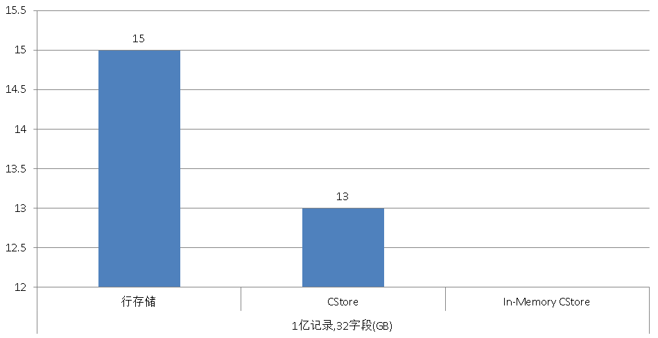
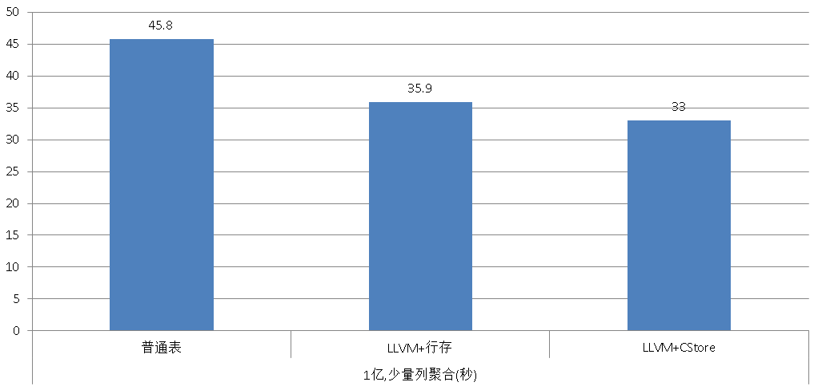
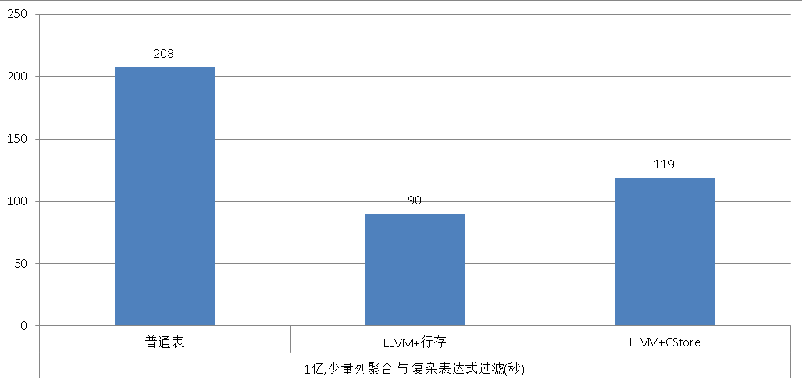

## 分析加速引擎黑科技 - LLVM、列存、多核并行、算子复用 大联姻 - 一起来开启PostgreSQL的百宝箱         
##### [TAG 16](../class/16.md)
                                                        
### 作者                                                       
digoal                                                        
                                                        
### 日期                                                      
2016-12-16                                                         
                                                        
### 标签                                                      
PostgreSQL , LLVM , OLAP , 列存储 , IMCS , cstore , column storage , Code Gen , 数据分析                                                                                                               
                                                        
----                                                      
                                                        
## 背景          
随着移动互联网的发展，数据爆炸性增长，企业对数据产生价值的渴望越来越多。         
         
比如很多APP中会埋点（已经不是什么秘密），以此收集用户的行为数据，用户的位置变化，上了什么网站，浏览了哪些网页，和什么人聊天。         
         
又比如汽车类的应用，汽车的轨迹，油耗，停留的时间，最喜欢去的商圈等。         
         
金融方面，用户的付费行为，和哪个商铺发生的交易，交易的明细，和哪些人有资金的往来等。         
         
数据无处不产生，无处不在，但是这么多的数据，怎么存储，怎么快速计算，怎么构建关系模型，分析模型？         
         
这么多的问题，没有机器猫怎么行？         
         
机器猫的百宝箱里可是什么都有的，PostgreSQL就是你们家的机器猫，要啥呢？快来问一问吧。          
         
机器猫啊，能告诉我怎么解决数据爆炸后存储成本、计算效率的问题么？         
         
**列存、LLVM、多核并行、OP SFUNC代码复用，四管齐下** ，解决存储效率，检索效率、计算效率的三大问题。          
        
关于并行基于算OP算子的sfunc复用本文不展开细讲，可以参考我另外的文章         
        
[《PostgreSQL 9.6 引领开源数据库攻克多核并行计算难题》](../201610/20161001_01.md)        
      
[《PostgreSQL 9.6 并行计算 优化器算法浅析》](../201610/20161002_01.md)        
      
[《PostgreSQL 9.6 并行计算 在 xfs, ext4 下的表现对比》](../201610/20161002_02.md)        
      
[《PostgreSQL 9.6 内核优化之 聚合代码优化OP复用浅析》](../201610/20161008_01.md)       
      
[《PostgreSQL 并行计算tpc-h测试和优化分析》](../201611/20161108_01.md)        
           
## 存储成本压缩 - 列存储      
随着数据量的暴增，存储成本是一个问题，另一个问题是查询效率。         
          
传统的方法使用行存储，行存储的好处是行操作效率高，例如同时查询多列时效率高，因为访问的数据块更少。          
          
但是行存储的压缩比并不高，即使使用块级压缩，原因是单行涉及的数据类型繁杂，数据值的离散型更强。          
          
所以列存出现了，在分析领域几乎成了标配，列存的压缩比可以做到更高，而且对单列或少量的列进行分析时，访问的块更少，速度更快。          
          
PostgreSQL社区很多年前就已经有列存储的插件，比如cstore, imcs（借鉴自monetdb思想）等。           
          
https://github.com/citusdata/cstore_fdw        
      
http://www.garret.ru/imcs/user_guide.html      
        
https://www.pgcon.org/2016/schedule/events/919.en.html        
       
本文介绍CSTORE这个存储引擎，有兴趣的童鞋可以另外再研究一下in memory column store引擎。       
          
## 计算效率提升 - LLVM + 列存储      
llvm其实在分析场景用得比较多，但是在传统数据库中引入LLVM的不是很常见，特别是开源领域，目前能看到的传统数据库PostgreSQL是领导者的地位。          
         
LLVM的改造工作量非常庞大，需要支持所有算子的话，所有的算子相关的代码都进行改造，而如果只是支持几个简单的算子，还远远不能满足数据分析的场景。         
          
一般数据库支持的数据类型就有几十上百，每种数据类型都有几十上百的算子，所以说改造的工作量是非常庞大的。         
          
PostgreSQL的LLVM开源版本        
        
https://github.com/ispras/postgres         
         
         
          
目前在重计算的SQL场景中，需要对大批量的数据进行运算，比如过滤数据，从代码层面来讲涉及到函数外的调用(get row后，需要对其进行filter涉及表达式的function调用)，interpretation耗费较大，通过profileing可以发现瓶颈出现在filter节点。         
        
[《PostgreSQL 源码性能诊断(perf profiling)指南》](../201611/20161129_01.md)          
        
         
        
针对性优化手段是尽量的减少函数切换，使用LLVM的接口可以帮你将这个部分的代码重新生成，在一个函数内完成所有的运算。         
        
         
        
         
         
文档详见        
        
http://llvm.org/devmtg/2016-09/slides/Melnik-PostgreSQLLLVM.pdf         
          
对大量数据分析，filter或select clause的表达式越多的情况，效果越明显。         
          
### 如何部署PostgreSQL llvm版本      
### 1\. 安装gcc, python, clang, llvm         
        
#### 1 安装新版本gcc, 建议安装6.x  
预备    
    
```
yum install -y texinfo

wget https://ftp.gnu.org/gnu/autoconf/autoconf-2.65.tar.bz2
wget https://ftp.gnu.org/gnu/automake/automake-1.14.1.tar.gz
tar -jxvf autoconf-2.65.tar.bz2
tar -zxvf automake-1.14.1.tar.gz

cd autoconf-2.65
./configure; make; make install
cd ../automake-1.14.1
./configure; make; make install
```
    
下载新版本  
  
https://gcc.gnu.org/mirrors.html  
  
解压  
  
```  
# tar -xvzf gcc-6.2.0.tar.gz  
# cd gcc-6.2.0 
```  
  
下载依赖包  
  
```  
./contrib/download_prerequisites  
```  
  
下载依赖包到gcc src根目录    
   
在我github的package目录中可以直接下载  
  
```  
-- cd gcc-6.2.0

tar -zxvf cloog-0.18.4.tar.gz
tar -jxvf gmp-4.3.2.tar.bz2
tar -jxvf isl-0.15.tar.bz2
tar -jxvf mpfr-2.4.2.tar.bz2
tar -zxvf mpc-0.8.1.tar.gz

mv cloog-0.18.4 cloog
mv gmp-4.3.2 gmp
mv mpfr-2.4.2 mpfr
mv mpc-0.8.1 mpc

sed -e 's/isl_stat_ok = 0,/isl_stat_ok = 0/' isl-0.15/include/isl/ctx.h > isl-0.15/include/isl/ctx.h.tem && mv isl-0.15/include/isl/ctx.h.tem isl-0.15/include/isl/ctx.h
mv isl-0.15 isl
```
  
编译gcc  
  
```
跳出gcc src目录
cd ..
mkdir objdir

cd objdir
../gcc-6.2.0/configure --prefix=/home/digoal/gcc6.2.0 --disable-isl-version-check --disable-multilib

make -j 32
make install

ln -s /home/digoal/digoal/bin/gcc /home/digoal/gcc6.2.0/bin/cc
```
  
修改环境变量  
  
```
export LD_LIBRARY_PATH=/home/digoal/gcc6.2.0/lib:$LD_LIBRARY_PATH  
export LD_RUN_PATH=$LD_LIBRARY_PATH  
export PATH=/home/digoal/gcc6.2.0/bin:$PATH 
```  
      
修改ld.so.conf  
  
```  
# vi /etc/ld.so.conf  
  
/home/digoal/gcc6.2.0/lib64  
  
# ldconfig  
```  
  
参考  
  
1\. https://gcc.gnu.org/install/prerequisites.html    
  
#### 安装clang  
1\. cmake  
  
```  
wget https://cmake.org/files/v3.4/cmake-3.4.1.tar.gz  
tar -zxvf cmake-3.4.1.tar.gz  
cd cmake-3.4.1  
./configure --prefix=/u02/digoal/cmake  
make  
make install  
export PATH=/u02/digoal/cmake/bin:$PATH  
```  
  
2\. python  
  
```  
wget  
https://www.python.org/ftp/python/2.7.11/Python-2.7.11.tar.xz  
tar -xvf Python-2.7.11.tar.xz  
cd Python-2.7.11  
./configure --prefix=/u02/digoal/python2.7.11 --enable-shared  
make -j 32  
make install -j 32  
export PATH=/u02/digoal/python2.7.11/bin:$PATH  
export LD_LIBRARY_PATH=/u02/digoal/python2.7.11/lib:$LD_LIBRARY_PATH  
vi /etc/ld.so.conf  
/u02/digoal/python2.7.11/lib  
```  
  
3\. llvm, clang  
  
```  
wget http://llvm.org/releases/3.7.1/llvm-3.7.1.src.tar.xz  
wget http://llvm.org/releases/3.7.1/cfe-3.7.1.src.tar.xz  
wget http://llvm.org/releases/3.7.1/compiler-rt-3.7.1.src.tar.xz  
wget http://llvm.org/releases/3.7.1/clang-tools-extra-3.7.1.src.tar.xz  
wget http://llvm.org/releases/3.7.1/libcxx-3.7.1.src.tar.xz  
  
tar -xvf llvm-3.7.1.src.tar.xz  
tar -xvf cfe-3.7.1.src.tar.xz  
tar -xvf compiler-rt-3.7.1.src.tar.xz  
tar -xvf clang-tools-extra-3.7.1.src.tar.xz  
tar -xvf libcxx-3.7.1.src.tar.xz  
  
mv cfe-3.7.1.src clang  
mv clang/ llvm-3.7.1.src/tools/  
  
mv clang-tools-extra-3.7.1.src extra  
mv extra/ llvm-3.7.1.src/tools/clang/  
  
mv compiler-rt-3.7.1.src compiler-rt  
mv compiler-rt llvm-3.7.1.src/projects/  
  
mkdir mybuild  
cd mybuild  

cmake -DCMAKE_BUILD_TYPE=Release /u02/digoal/soft_bak/llvm-3.7.1.src  
```  
  
安装  
  
```  
cmake -G"Unix Makefiles" ../llvm-3.7.1.src
make -j 128
cmake -DCMAKE_INSTALL_PREFIX=/u02/digoal/llvm -P cmake_install.cmake  
  
或  
  
/u02/digoal/soft_bak/llvm-3.7.1.src/configure --prefix=/u02/digoal/llvm --enable-optimized --enable-targets=host-only CC=gcc CXX=g++  
make -j 32  
make install -j 32  
```  
  
配置环境  
  
```  
export PATH=/u02/digoal/llvm/bin:$PATH  
export LD_LIBRARY_PATH=/u02/digoal/llvm/lib:$LD_LIBRARY_PATH  
  
# vi /etc/ld.so.conf  
/u02/digoal/llvm/lib  
  
# ldconfig  
```  
  
参考  
  
http://btorpey.github.io/blog/2015/01/02/building-clang/    
      
### 2\. 下载llvm postgresql        
      
```      
mkdir ispras      
      
cd ispras      
      
wget https://github.com/ispras/postgres/archive/llvm-expressions.zip      
      
unzip llvm-expressions.zip      
      
cd postgres-llvm-expressions      
```      
      
### 3\. 安装 llvm postgresql      
        
https://github.com/ispras/postgres      
      
```      
./configure --prefix=/home/digoal/pgsql9.6.1_llvm      
      
make world -j 32      
make install-world      
```      
      
### 4\. 初始化数据库      
      
```      
initdb -D $PGDATA -E SQL_ASCII --locale=C -U postgres      
```      
      
### 加载列存储cstore引擎插件      
1\. 安装依赖包protobuf, protobuf-c        
      
```      
yum install -y libtool automake gcc-c++      
      
wget https://github.com/google/protobuf/archive/v3.0.2.tar.gz      
      
tar -zxvf v3.0.2.tar.gz      
      
cd protobuf-3.0.2      
      
./autogen.sh      
      
./configure --prefix=/home/digoal/protobuf      
      
make && make install      
        
export LD_LIBRARY_PATH=/home/digoal/protobuf/lib:$PGHOME/lib:$LD_LIBRARY_PATH      
export PATH=/home/digoal/protobuf/bin::$PATH:.      
export PKG_CONFIG_PATH=/home/digoal/protobuf/lib/pkgconfig:$PKG_CONFIG_PATH      
      
        
wget https://github.com/protobuf-c/protobuf-c/releases/download/v1.2.1/protobuf-c-1.2.1.tar.gz      
      
./configure --prefix=/home/digoal/protobuf-c      
      
make -j 32      
make install      
      
      
export LD_LIBRARY_PATH=/home/digoal/protobuf-c/lib:/home/digoal/protobuf/lib:$PGHOME/lib:$LD_LIBRARY_PATH      
export PATH=/home/digoal/protobuf-c/bin:/home/digoal/protobuf/bin::$PATH:.      
export PKG_CONFIG_PATH=/home/digoal/protobuf-c/lib/pkgconfig:/home/digoal/protobuf/lib/pkgconfig:$PKG_CONFIG_PATH      
```      
      
2\. 安装cstore引擎      
      
```      
git clone https://github.com/citusdata/cstore_fdw        
        
cd cstore_fdw        
        
export PATH=/home/digoal/pgsqlllvm/bin:$PATH      
export C_INCLUDE_PATH=/home/digoal/protobuf-c/include      
export LIBRARY_PATH=$LD_LIBRARY_PATH      
      
make clean      
make      
make install      
```      
        
3\. 加载cstore引擎      
      
```      
vi $PGDATA/postgresql.conf      
shared_preload_libraries = 'cstore_fdw'      
      
      
pg_ctl restart -m fast      
```      
      
4\. 使用cstore引擎      
      
```      
psql       
psql (9.6.1)      
Type "help" for help.      
      
postgres=# create extension cstore_fdw;      
CREATE EXTENSION      
postgres=# CREATE SERVER cstore_server FOREIGN DATA WRAPPER cstore_fdw;      
CREATE SERVER      
```      
      
5\. cstore引擎用法      
      
```      
Before using cstore_fdw, you need to add it to shared_preload_libraries in your postgresql.conf and restart Postgres:      
      
shared_preload_libraries = 'cstore_fdw'    # (change requires restart)      
      
      
The following parameters can be set on a cstore foreign table object.      
      
filename (optional):       
  The absolute path to the location for storing table data.       
  If you don't specify the filename option, cstore_fdw will automatically choose the $PGDATA/cstore_fdw directory to store the files.       
  If specified the value of this parameter will be used as a prefix for all files created to store table data.       
  For example, the value /cstore_fdw/my_table could result in the files /cstore_fdw/my_table and /cstore_fdw/my_table.footer being used to manage table data.      
      
compression (optional):       
  The compression used for compressing value streams.       
  Valid options are none and pglz.       
  The default is none.      
      
stripe_row_count (optional):       
  Number of rows per stripe. The default is 150000.       
  Reducing this decreases the amount memory used for loading data and querying, but also decreases the performance.      
      
block_row_count (optional): Number of rows per column block.       
  The default is 10000. cstore_fdw compresses, creates skip indexes, and reads from disk at the block granularity.       
  Increasing this value helps with compression and results in fewer reads from disk.       
  However, higher values also reduce the probability of skipping over unrelated row blocks.      
      
To load or append data into a cstore table, you have two options:      
  You can use the COPY command to load or append data from a file, a program, or STDIN.      
  You can use the INSERT INTO cstore_table SELECT ... syntax to load or append data from another table.      
  You can use the ANALYZE command to collect statistics about the table.       
  These statistics help the query planner to help determine the most efficient execution plan for each query.      
      
Note. We currently don't support updating table using DELETE, and UPDATE commands. We also don't support single row inserts.      
```      
      
## 对比性能      
测试数据的结构包括32个字段，1亿条记录      
      
1\. llvm + cstore存储       
      
```      
create foreign table cstore_llvm(id int, c1 int, c2 int, c3 int, c4 int, c5 int, c6 int, c7 int, c8 int, c9 int, c10 int, c11 int, c12 int, c13 int, c14 int, c15 int, c16 int, c17 int, c18 int, c19 int, c20 int, c21 int,      
c22 int, c23 int, c24 int, c25 int, c26 int, c27 int, c28 int, c29 int, c30 int, c31 int)      
SERVER cstore_server      
OPTIONS(compression 'pglz', stripe_row_count '1000000', block_row_count '100000');      
      
insert into cstore_llvm select id,id,id,id,id,id,id,id,id,id,id,id,id,id,id,id,id,id,id,id,id,id,id,id,id,id,id,id,id,id,id,id from generate_series(1,100000000) t(id);      
      
analyze cstore_llvm;      
      
占用 13GB      
```      
      
2\. llvm only table      
      
```      
create unlogged table llvm(id int, c1 int, c2 int, c3 int, c4 int, c5 int, c6 int, c7 int, c8 int, c9 int, c10 int, c11 int, c12 int, c13 int, c14 int, c15 int, c16 int, c17 int, c18 int, c19 int, c20 int, c21 int,      
c22 int, c23 int, c24 int, c25 int, c26 int, c27 int, c28 int, c29 int, c30 int, c31 int);      
      
insert into llvm select id,id,id,id,id,id,id,id,id,id,id,id,id,id,id,id,id,id,id,id,id,id,id,id,id,id,id,id,id,id,id,id from generate_series(1,100000000) t(id);      
      
占用 15GB      
```      
      
3\. (normal PostgreSQL)普通代码 table      
      
```      
create unlogged table normal(id int, c1 int, c2 int, c3 int, c4 int, c5 int, c6 int, c7 int, c8 int, c9 int, c10 int, c11 int, c12 int, c13 int, c14 int, c15 int, c16 int, c17 int, c18 int, c19 int, c20 int, c21 int,      
c22 int, c23 int, c24 int, c25 int, c26 int, c27 int, c28 int, c29 int, c30 int, c31 int);      
      
insert into llvm select id,id,id,id,id,id,id,id,id,id,id,id,id,id,id,id,id,id,id,id,id,id,id,id,id,id,id,id,id,id,id,id from generate_series(1,100000000) t(id);      
      
占用 15GB      
```      
      
### 分析场景 性能表现 vs 传统方法      
1\. 空间对比    
    
Cstore 消耗 13GB，    
    
行存储消耗 15GB。      
      
cstore还有很大改进空间      
    
        
    
2\. 少量列的聚合操作，体现列存优势      
    
```    
select corr(c2,c1), covar_pop(c2,c1), covar_samp(c2,c1), regr_avgx(c2,c1), regr_avgy(c2,c1), regr_intercept(c2,c1), regr_r2(c2,c1), regr_slope(c2,c1), regr_sxx(c2,c1), regr_sxy(c2,c1), regr_syy(c2,c1) from     
cstore_llvm | llvm | normal ;     
```    
      
结果      
      
```    
postgres=# explain (analyze,verbose,timing,costs,buffers) select corr(c2,c1), covar_pop(c2,c1), covar_samp(c2,c1), regr_avgx(c2,c1), regr_avgy(c2,c1), regr_intercept(c2,c1), regr_r2(c2,c1), regr_slope(c2,c1), regr_sxx(c2,c1), regr_sxy(c2,c1), regr_syy(c2,c1) from normal;    
                                              QUERY PLAN     
-------------------------------------------------------------------------------    
 Aggregate  (cost=11173077.03..11173077.04 rows=1 width=88) (actual time=45776.841..45776.842 rows=1 loops=1)    
   Output: corr((c2)::double precision, (c1)::double precision), covar_pop((c2)::double precision, (c1)::double precision), covar_samp((c2)::double precision, (c1)::double precision), regr_avgx((c2)::double precision, (c1)::double precis    
ion), regr_avgy((c2)::double precision, (c1)::double precision), regr_intercept((c2)::double precision, (c1)::double precision), regr_r2((c2)::double precision, (c1)::double precision), regr_slope((c2)::double precision, (c1)::double pre    
cision), regr_sxx((c2)::double precision, (c1)::double precision), regr_sxy((c2)::double precision, (c1)::double precision), regr_syy((c2)::double precision, (c1)::double precision)    
   Buffers: shared hit=64 read=1923013    
   ->  Seq Scan on public.normal  (cost=0.00..2923077.00 rows=100000000 width=8) (actual time=0.074..18001.511 rows=100000000 loops=1)    
         Output: id, c1, c2, c3, c4, c5, c6, c7, c8, c9, c10, c11, c12, c13, c14, c15, c16, c17, c18, c19, c20, c21, c22, c23, c24, c25, c26, c27, c28, c29, c30, c31    
         Buffers: shared hit=64 read=1923013    
 Planning time: 0.113 ms    
 Execution time: 45776.978 ms    
(8 rows)    
    
postgres=# explain (analyze,verbose,timing,costs,buffers) select corr(c2,c1), covar_pop(c2,c1), covar_samp(c2,c1), regr_avgx(c2,c1), regr_avgy(c2,c1), regr_intercept(c2,c1), regr_r2(c2,c1), regr_slope(c2,c1), regr_sxx(c2,c1), regr_sxy(c2,c1), regr_syy(c2,c1) from llvm;    
                                                        QUERY PLAN      
------------------------------------------------------------------------    
 Aggregate  (cost=11173077.03..11173077.04 rows=1 width=88) (actual time=35787.702..35787.702 rows=1 loops=1)    
   Output: corr((c2)::double precision, (c1)::double precision), covar_pop((c2)::double precision, (c1)::double precision), covar_samp((c2)::double precision, (c1)::double precision), regr_avgx((c2)::double precision, (c1)::double precis    
ion), regr_avgy((c2)::double precision, (c1)::double precision), regr_intercept((c2)::double precision, (c1)::double precision), regr_r2((c2)::double precision, (c1)::double precision), regr_slope((c2)::double precision, (c1)::double pre    
cision), regr_sxx((c2)::double precision, (c1)::double precision), regr_sxy((c2)::double precision, (c1)::double precision), regr_syy((c2)::double precision, (c1)::double precision)    
   Buffers: shared hit=1923077    
   ->  Seq Scan on public.llvm  (cost=0.00..2923077.00 rows=100000000 width=8) (actual time=0.025..14526.088 rows=100000000 loops=1)    
         Output: id, c1, c2, c3, c4, c5, c6, c7, c8, c9, c10, c11, c12, c13, c14, c15, c16, c17, c18, c19, c20, c21, c22, c23, c24, c25, c26, c27, c28, c29, c30, c31    
         Buffers: shared hit=1923077    
 Planning time: 0.143 ms    
 Execution time: 35916.345 ms    
(8 rows)    
    
postgres=# explain (analyze,verbose,timing,costs,buffers) select corr(c2,c1), covar_pop(c2,c1), covar_samp(c2,c1), regr_avgx(c2,c1), regr_avgy(c2,c1), regr_intercept(c2,c1), regr_r2(c2,c1), regr_slope(c2,c1), regr_sxx(c2,c1), regr_sxy(c2,c1), regr_syy(c2,c1) from cstore_llvm;    
                                                QUERY PLAN       
--------------------------------------------------------------------------    
 Aggregate  (cost=9350716.90..9350716.91 rows=1 width=88) (actual time=32923.642..32923.642 rows=1 loops=1)    
   Output: corr((c2)::double precision, (c1)::double precision), covar_pop((c2)::double precision, (c1)::double precision), covar_samp((c2)::double precision, (c1)::double precision), regr_avgx((c2)::double precision, (c1)::double precis    
ion), regr_avgy((c2)::double precision, (c1)::double precision), regr_intercept((c2)::double precision, (c1)::double precision), regr_r2((c2)::double precision, (c1)::double precision), regr_slope((c2)::double precision, (c1)::double pre    
cision), regr_sxx((c2)::double precision, (c1)::double precision), regr_sxy((c2)::double precision, (c1)::double precision), regr_syy((c2)::double precision, (c1)::double precision)    
   Buffers: shared hit=8400    
   ->  Foreign Scan on public.cstore_llvm  (cost=0.00..1100716.88 rows=100000000 width=8) (actual time=5.959..14395.260 rows=100000000 loops=1)    
         Output: id, c1, c2, c3, c4, c5, c6, c7, c8, c9, c10, c11, c12, c13, c14, c15, c16, c17, c18, c19, c20, c21, c22, c23, c24, c25, c26, c27, c28, c29, c30, c31    
         CStore File: /disk1/digoal/pgdata/pg_root9.6llvm/cstore_fdw/13269/16408    
         CStore File Size: 13201155200    
         Buffers: shared hit=8400    
 Planning time: 0.239 ms    
 Execution time: 33053.735 ms    
```    
    
        
    
3\. 少量列聚合 与 复杂表达式过滤，体现LLVM的优势    
    
```    
explain (analyze,verbose,timing,costs,buffers) select corr(c2,c1), covar_pop(c2,c1), covar_samp(c2,c1), regr_avgx(c2,c1), regr_avgy(c2,c1), regr_intercept(c2,c1), regr_r2(c2,c1), regr_slope(c2,c1), regr_sxx(c2,c1), regr_sxy(c2,c1), regr_syy(c2,c1) from     
cstore_llvm | llvm | normal     
where c1+c2+c3+c4+c5+c6+c7+c8 >10000000 and c9+c10+c11+c12+c13+c14+c15+c16 >10000000 and c17+c18+c19+c20+c21+c22+c23+c24 >10000000 and c25+c26+c27+c28+c29+c30+c31 >10000000;    
```    
    
```    
postgres=# explain (analyze,verbose,timing,costs,buffers) select corr(c2,c1), covar_pop(c2,c1), covar_samp(c2,c1), regr_avgx(c2,c1), regr_avgy(c2,c1), regr_intercept(c2,c1), regr_r2(c2,c1), regr_slope(c2,c1), regr_sxx(c2,c1), regr_sxy(c2,c1), regr_syy(c2,c1) from normal where c1+c2+c3+c4+c5+c6+c7+c8 >10000000 and c9+c10+c11+c12+c13+c14+c15+c16 >10000000 and c17+c18+c19+c20+c21+c22+c23+c24 >10000000 and c25+c26+c27+c28+c29+c30+c31 >10000000;    
                                               QUERY PLAN        
---------------------------------------------------------------------    
 Aggregate  (cost=10774928.89..10774928.90 rows=1 width=88) (actual time=208222.725..208222.725 rows=1 loops=1)    
   Output: corr((c2)::double precision, (c1)::double precision), covar_pop((c2)::double precision, (c1)::double precision), covar_samp((c2)::double precision, (c1)::double precision), regr_avgx((c2)::double precision, (c1)::double precis    
ion), regr_avgy((c2)::double precision, (c1)::double precision), regr_intercept((c2)::double precision, (c1)::double precision), regr_r2((c2)::double precision, (c1)::double precision), regr_slope((c2)::double precision, (c1)::double pre    
cision), regr_sxx((c2)::double precision, (c1)::double precision), regr_sxy((c2)::double precision, (c1)::double precision), regr_syy((c2)::double precision, (c1)::double precision)    
   Buffers: shared hit=32 read=1923045    
   ->  Seq Scan on public.normal  (cost=0.00..10673077.00 rows=1234568 width=8) (actual time=927.591..181392.573 rows=98571429 loops=1)    
         Output: id, c1, c2, c3, c4, c5, c6, c7, c8, c9, c10, c11, c12, c13, c14, c15, c16, c17, c18, c19, c20, c21, c22, c23, c24, c25, c26, c27, c28, c29, c30, c31    
         Filter: ((((((((normal.c25 + normal.c26) + normal.c27) + normal.c28) + normal.c29) + normal.c30) + normal.c31) > 10000000) AND ((((((((normal.c1 + normal.c2) + normal.c3) + normal.c4) + normal.c5) + normal.c6) + normal.c7) + nor    
mal.c8) > 10000000) AND ((((((((normal.c9 + normal.c10) + normal.c11) + normal.c12) + normal.c13) + normal.c14) + normal.c15) + normal.c16) > 10000000) AND ((((((((normal.c17 + normal.c18) + normal.c19) + normal.c20) + normal.c21) + norm    
al.c22) + normal.c23) + normal.c24) > 10000000))    
         Rows Removed by Filter: 1428571    
         Buffers: shared hit=32 read=1923045    
 Planning time: 0.386 ms    
 Execution time: 208222.952 ms    
(10 rows)    
    
postgres=# explain (analyze,verbose,timing,costs,buffers) select corr(c2,c1), covar_pop(c2,c1), covar_samp(c2,c1), regr_avgx(c2,c1), regr_avgy(c2,c1), regr_intercept(c2,c1), regr_r2(c2,c1), regr_slope(c2,c1), regr_sxx(c2,c1), regr_sxy(c2,c1), regr_syy(c2,c1) from llvm where c1+c2+c3+c4+c5+c6+c7+c8 >10000000 and c9+c10+c11+c12+c13+c14+c15+c16 >10000000 and c17+c18+c19+c20+c21+c22+c23+c24 >10000000 and c25+c26+c27+c28+c29+c30+c31 >10000000;        
                                                        QUERY PLAN          
-------------------------------------------------------------------------------------    
 Aggregate  (cost=10774928.89..10774928.90 rows=1 width=88) (actual time=90154.111..90154.112 rows=1 loops=1)    
   Output: corr((c2)::double precision, (c1)::double precision), covar_pop((c2)::double precision, (c1)::double precision), covar_samp((c2)::double precision, (c1)::double precision), regr_avgx((c2)::double precision, (c1)::double precis    
ion), regr_avgy((c2)::double precision, (c1)::double precision), regr_intercept((c2)::double precision, (c1)::double precision), regr_r2((c2)::double precision, (c1)::double precision), regr_slope((c2)::double precision, (c1)::double pre    
cision), regr_sxx((c2)::double precision, (c1)::double precision), regr_sxy((c2)::double precision, (c1)::double precision), regr_syy((c2)::double precision, (c1)::double precision)    
   Buffers: shared hit=1923077    
   ->  Seq Scan on public.llvm  (cost=0.00..10673077.00 rows=1234568 width=8) (actual time=589.502..71372.203 rows=98571429 loops=1)    
         Output: id, c1, c2, c3, c4, c5, c6, c7, c8, c9, c10, c11, c12, c13, c14, c15, c16, c17, c18, c19, c20, c21, c22, c23, c24, c25, c26, c27, c28, c29, c30, c31    
         Filter: ((((((((llvm.c25 + llvm.c26) + llvm.c27) + llvm.c28) + llvm.c29) + llvm.c30) + llvm.c31) > 10000000) AND ((((((((llvm.c1 + llvm.c2) + llvm.c3) + llvm.c4) + llvm.c5) + llvm.c6) + llvm.c7) + llvm.c8) > 10000000) AND ((((((    
((llvm.c9 + llvm.c10) + llvm.c11) + llvm.c12) + llvm.c13) + llvm.c14) + llvm.c15) + llvm.c16) > 10000000) AND ((((((((llvm.c17 + llvm.c18) + llvm.c19) + llvm.c20) + llvm.c21) + llvm.c22) + llvm.c23) + llvm.c24) > 10000000))    
         Rows Removed by Filter: 1428571    
         Buffers: shared hit=1923077    
 Planning time: 0.274 ms    
 Execution time: 90589.330 ms    
(10 rows)    
    
    
postgres=# explain (analyze,verbose,timing,costs,buffers) select corr(c2,c1), covar_pop(c2,c1), covar_samp(c2,c1), regr_avgx(c2,c1), regr_avgy(c2,c1), regr_intercept(c2,c1), regr_r2(c2,c1), regr_slope(c2,c1), regr_sxx(c2,c1), regr_sxy(c2,c1), regr_syy(c2,c1) from cstore_llvm where c1+c2+c3+c4+c5+c6+c7+c8 >10000000 and c9+c10+c11+c12+c13+c14+c15+c16 >10000000 and c17+c18+c19+c20+c21+c22+c23+c24 >10000000 and c25+c26+c27+c28+c29+c30+c31 >10000000;    
                                                              QUERY PLAN         
------------------------------------------------------------------------------------------------------    
 Aggregate  (cost=10412963.45..10412963.46 rows=1 width=88) (actual time=119220.806..119220.806 rows=1 loops=1)    
   Output: corr((c2)::double precision, (c1)::double precision), covar_pop((c2)::double precision, (c1)::double precision), covar_samp((c2)::double precision, (c1)::double precision), regr_avgx((c2)::double precision, (c1)::double precis    
ion), regr_avgy((c2)::double precision, (c1)::double precision), regr_intercept((c2)::double precision, (c1)::double precision), regr_r2((c2)::double precision, (c1)::double precision), regr_slope((c2)::double precision, (c1)::double pre    
cision), regr_sxx((c2)::double precision, (c1)::double precision), regr_sxy((c2)::double precision, (c1)::double precision), regr_syy((c2)::double precision, (c1)::double precision)    
   Buffers: shared hit=130218    
   ->  Foreign Scan on public.cstore_llvm  (cost=0.00..10311111.56 rows=1234568 width=8) (actual time=1057.194..99364.443 rows=98571429 loops=1)    
         Output: id, c1, c2, c3, c4, c5, c6, c7, c8, c9, c10, c11, c12, c13, c14, c15, c16, c17, c18, c19, c20, c21, c22, c23, c24, c25, c26, c27, c28, c29, c30, c31    
         Filter: ((((((((cstore_llvm.c25 + cstore_llvm.c26) + cstore_llvm.c27) + cstore_llvm.c28) + cstore_llvm.c29) + cstore_llvm.c30) + cstore_llvm.c31) > 10000000) AND ((((((((cstore_llvm.c1 + cstore_llvm.c2) + cstore_llvm.c3) + cstor    
e_llvm.c4) + cstore_llvm.c5) + cstore_llvm.c6) + cstore_llvm.c7) + cstore_llvm.c8) > 10000000) AND ((((((((cstore_llvm.c9 + cstore_llvm.c10) + cstore_llvm.c11) + cstore_llvm.c12) + cstore_llvm.c13) + cstore_llvm.c14) + cstore_llvm.c15) +    
 cstore_llvm.c16) > 10000000) AND ((((((((cstore_llvm.c17 + cstore_llvm.c18) + cstore_llvm.c19) + cstore_llvm.c20) + cstore_llvm.c21) + cstore_llvm.c22) + cstore_llvm.c23) + cstore_llvm.c24) > 10000000))    
         Rows Removed by Filter: 1428571    
         CStore File: /disk1/digoal/pgdata/pg_root9.6llvm/cstore_fdw/13269/16408    
         CStore File Size: 13201155200    
         Buffers: shared hit=130218    
 Planning time: 0.372 ms    
 Execution time: 119676.841 ms    
(12 rows)    
```    
    
        
    
4\. normal | llvm + 多核并行 ，体现多核计算的硬件能力     
    
```    
postgres=# set max_parallel_workers_per_gather =12;    
SET    
postgres=# set min_parallel_relation_size =0;    
SET    
postgres=# set parallel_tuple_cost =0;    
SET    
postgres=# set parallel_setup_cost =0;    
SET    
postgres=# set force_parallel_mode =on;    
SET    
```    
    
结果      
    
```    
postgres=# explain (analyze,verbose,timing,costs,buffers) select corr(c2,c1), covar_pop(c2,c1), covar_samp(c2,c1), regr_avgx(c2,c1), regr_avgy(c2,c1), regr_intercept(c2,c1), regr_r2(c2,c1), regr_slope(c2,c1), regr_sxx(c2,c1), regr_sxy(c2,c1), regr_syy(c2,c1) from llvm;    
                            QUERY PLAN      
                                                                 
------------------------------------------------------------------------    
 Finalize Aggregate  (cost=2693910.67..2693910.68 rows=1 width=88) (actual time=3773.343..3773.343 rows=1 loops=1)    
   Output: corr((c2)::double precision, (c1)::double precision), covar_pop((c2)::double precision, (c1)::double precision), covar_samp((c2)::double precision, (c1)::double precision), regr_avgx((c2)::double precision, (c1)::double precis    
ion), regr_avgy((c2)::double precision, (c1)::double precision), regr_intercept((c2)::double precision, (c1)::double precision), regr_r2((c2)::double precision, (c1)::double precision), regr_slope((c2)::double precision, (c1)::double pre    
cision), regr_sxx((c2)::double precision, (c1)::double precision), regr_sxy((c2)::double precision, (c1)::double precision), regr_syy((c2)::double precision, (c1)::double precision)    
   Buffers: shared hit=4228 read=1920517    
   ->  Gather  (cost=2693910.31..2693910.32 rows=12 width=352) (actual time=3772.735..3773.298 rows=13 loops=1)    
         Output: (PARTIAL corr((c2)::double precision, (c1)::double precision)), (PARTIAL covar_pop((c2)::double precision, (c1)::double precision)), (PARTIAL covar_samp((c2)::double precision, (c1)::double precision)), (PARTIAL regr_avg    
x((c2)::double precision, (c1)::double precision)), (PARTIAL regr_avgy((c2)::double precision, (c1)::double precision)), (PARTIAL regr_intercept((c2)::double precision, (c1)::double precision)), (PARTIAL regr_r2((c2)::double precision, (    
c1)::double precision)), (PARTIAL regr_slope((c2)::double precision, (c1)::double precision)), (PARTIAL regr_sxx((c2)::double precision, (c1)::double precision)), (PARTIAL regr_sxy((c2)::double precision, (c1)::double precision)), (PARTI    
AL regr_syy((c2)::double precision, (c1)::double precision))    
         Workers Planned: 12    
         Workers Launched: 12    
         Buffers: shared hit=4228 read=1920517    
         ->  Partial Aggregate  (cost=2693910.31..2693910.32 rows=1 width=352) (actual time=3638.222..3638.222 rows=1 loops=13)    
               Output: PARTIAL corr((c2)::double precision, (c1)::double precision), PARTIAL covar_pop((c2)::double precision, (c1)::double precision), PARTIAL covar_samp((c2)::double precision, (c1)::double precision), PARTIAL regr_avgx    
((c2)::double precision, (c1)::double precision), PARTIAL regr_avgy((c2)::double precision, (c1)::double precision), PARTIAL regr_intercept((c2)::double precision, (c1)::double precision), PARTIAL regr_r2((c2)::double precision, (c1)::do    
uble precision), PARTIAL regr_slope((c2)::double precision, (c1)::double precision), PARTIAL regr_sxx((c2)::double precision, (c1)::double precision), PARTIAL regr_sxy((c2)::double precision, (c1)::double precision), PARTIAL regr_syy((c2    
)::double precision, (c1)::double precision)    
               Buffers: shared hit=2560 read=1920517    
               Worker 0: actual time=3562.153..3562.153 rows=1 loops=1    
                 Buffers: shared hit=128 read=87086    
               Worker 1: actual time=3637.692..3637.692 rows=1 loops=1    
                 Buffers: shared hit=208 read=158629    
               Worker 2: actual time=3639.831..3639.831 rows=1 loops=1    
                 Buffers: shared hit=209 read=152506    
               Worker 3: actual time=3636.022..3636.022 rows=1 loops=1    
                 Buffers: shared hit=203 read=152808    
               Worker 4: actual time=3638.024..3638.024 rows=1 loops=1    
                 Buffers: shared hit=210 read=151951    
               Worker 5: actual time=3639.676..3639.677 rows=1 loops=1    
                 Buffers: shared hit=208 read=158875    
               Worker 6: actual time=3640.410..3640.410 rows=1 loops=1    
                 Buffers: shared hit=210 read=159051    
               Worker 7: actual time=3638.528..3638.528 rows=1 loops=1    
                 Buffers: shared hit=201 read=149186    
               Worker 8: actual time=3640.234..3640.234 rows=1 loops=1    
                 Buffers: shared hit=209 read=159345    
               Worker 9: actual time=3572.413..3572.413 rows=1 loops=1    
                 Buffers: shared hit=126 read=138879    
               Worker 10: actual time=3640.223..3640.224 rows=1 loops=1    
                 Buffers: shared hit=213 read=161155    
               Worker 11: actual time=3639.719..3639.719 rows=1 loops=1    
                 Buffers: shared hit=212 read=155227    
               ->  Parallel Seq Scan on public.llvm  (cost=0.00..2006410.33 rows=8333333 width=8) (actual time=0.066..2048.353 rows=7692308 loops=13)    
                     Output: c2, c1    
                     Buffers: shared hit=2560 read=1920517    
                     Worker 0: actual time=0.083..1954.297 rows=4535128 loops=1    
                       Buffers: shared hit=128 read=87086    
                     Worker 1: actual time=0.062..2062.690 rows=8259524 loops=1    
                       Buffers: shared hit=208 read=158629    
                     Worker 2: actual time=0.068..2055.347 rows=7941180 loops=1    
                       Buffers: shared hit=209 read=152506    
                     Worker 3: actual time=0.062..2058.819 rows=7956572 loops=1    
                       Buffers: shared hit=203 read=152808    
                     Worker 4: actual time=0.054..2064.731 rows=7912372 loops=1    
                       Buffers: shared hit=210 read=151951    
                     Worker 5: actual time=0.052..2060.738 rows=8272312 loops=1    
                       Buffers: shared hit=208 read=158875    
                     Worker 6: actual time=0.073..2067.216 rows=8281572 loops=1    
                       Buffers: shared hit=210 read=159051    
                     Worker 7: actual time=0.055..2064.354 rows=7768124 loops=1    
                       Buffers: shared hit=201 read=149186    
                     Worker 8: actual time=0.053..2063.789 rows=8296808 loops=1    
                       Buffers: shared hit=209 read=159345    
                     Worker 9: actual time=0.151..1998.940 rows=7228260 loops=1    
                       Buffers: shared hit=126 read=138879    
                     Worker 10: actual time=0.054..2048.661 rows=8391136 loops=1    
                       Buffers: shared hit=213 read=161155    
                     Worker 11: actual time=0.057..2056.825 rows=8082828 loops=1    
                       Buffers: shared hit=212 read=155227    
 Planning time: 0.158 ms    
 Execution time: 3937.492 ms    
(64 rows)    
    
postgres=# explain (analyze,verbose,timing,costs,buffers) select corr(c2,c1), covar_pop(c2,c1), covar_samp(c2,c1), regr_avgx(c2,c1), regr_avgy(c2,c1), regr_intercept(c2,c1), regr_r2(c2,c1), regr_slope(c2,c1), regr_sxx(c2,c1), regr_sxy(c2,c1), regr_syy(c2,c1) from llvm where c1+c2+c3+c4+c5+c6+c7+c8 >10000000 and c9+c10+c11+c12+c13+c14+c15+c16 >10000000 and c17+c18+c19+c20+c21+c22+c23+c24 >10000000 and c25+c26+c27+c28+c29+c30+c31 >10000000;       
                                                         QUERY PLAN        
                                                                 
------------------------------------------------------------------------------------------    
 Finalize Aggregate  (cost=2660731.72..2660731.73 rows=1 width=88) (actual time=8422.301..8422.301 rows=1 loops=1)    
   Output: corr((c2)::double precision, (c1)::double precision), covar_pop((c2)::double precision, (c1)::double precision), covar_samp((c2)::double precision, (c1)::double precision), regr_avgx((c2)::double precision, (c1)::double precis    
ion), regr_avgy((c2)::double precision, (c1)::double precision), regr_intercept((c2)::double precision, (c1)::double precision), regr_r2((c2)::double precision, (c1)::double precision), regr_slope((c2)::double precision, (c1)::double pre    
cision), regr_sxx((c2)::double precision, (c1)::double precision), regr_sxy((c2)::double precision, (c1)::double precision), regr_syy((c2)::double precision, (c1)::double precision)    
   Buffers: shared hit=3884 read=1920933    
   ->  Gather  (cost=2660731.35..2660731.36 rows=12 width=352) (actual time=8421.715..8422.253 rows=13 loops=1)    
         Output: (PARTIAL corr((c2)::double precision, (c1)::double precision)), (PARTIAL covar_pop((c2)::double precision, (c1)::double precision)), (PARTIAL covar_samp((c2)::double precision, (c1)::double precision)), (PARTIAL regr_avg    
x((c2)::double precision, (c1)::double precision)), (PARTIAL regr_avgy((c2)::double precision, (c1)::double precision)), (PARTIAL regr_intercept((c2)::double precision, (c1)::double precision)), (PARTIAL regr_r2((c2)::double precision, (    
c1)::double precision)), (PARTIAL regr_slope((c2)::double precision, (c1)::double precision)), (PARTIAL regr_sxx((c2)::double precision, (c1)::double precision)), (PARTIAL regr_sxy((c2)::double precision, (c1)::double precision)), (PARTI    
AL regr_syy((c2)::double precision, (c1)::double precision))    
         Workers Planned: 12    
         Workers Launched: 12    
         Buffers: shared hit=3884 read=1920933    
         ->  Partial Aggregate  (cost=2660731.35..2660731.36 rows=1 width=352) (actual time=8000.670..8000.670 rows=1 loops=13)    
               Output: PARTIAL corr((c2)::double precision, (c1)::double precision), PARTIAL covar_pop((c2)::double precision, (c1)::double precision), PARTIAL covar_samp((c2)::double precision, (c1)::double precision), PARTIAL regr_avgx    
((c2)::double precision, (c1)::double precision), PARTIAL regr_avgy((c2)::double precision, (c1)::double precision), PARTIAL regr_intercept((c2)::double precision, (c1)::double precision), PARTIAL regr_r2((c2)::double precision, (c1)::do    
uble precision), PARTIAL regr_slope((c2)::double precision, (c1)::double precision), PARTIAL regr_sxx((c2)::double precision, (c1)::double precision), PARTIAL regr_sxy((c2)::double precision, (c1)::double precision), PARTIAL regr_syy((c2    
)::double precision, (c1)::double precision)    
               Buffers: shared hit=2144 read=1920933    
               Worker 0: actual time=7984.472..7984.472 rows=1 loops=1    
                 Buffers: shared hit=171 read=149992    
               Worker 1: actual time=7793.034..7793.035 rows=1 loops=1    
                 Buffers: shared hit=179 read=145915    
               Worker 2: actual time=7996.571..7996.571 rows=1 loops=1    
                 Buffers: shared hit=181 read=105392    
               Worker 3: actual time=7994.475..7994.475 rows=1 loops=1    
                 Buffers: shared hit=178 read=160335    
               Worker 4: actual time=7996.607..7996.608 rows=1 loops=1    
                 Buffers: shared hit=180 read=154611    
               Worker 5: actual time=7998.692..7998.692 rows=1 loops=1    
                 Buffers: shared hit=179 read=159983    
               Worker 6: actual time=7996.541..7996.541 rows=1 loops=1    
                 Buffers: shared hit=177 read=150883    
               Worker 7: actual time=7998.963..7998.963 rows=1 loops=1    
                 Buffers: shared hit=179 read=156921    
               Worker 8: actual time=7996.566..7996.566 rows=1 loops=1    
                 Buffers: shared hit=93 read=131531    
               Worker 9: actual time=7981.888..7981.888 rows=1 loops=1    
                 Buffers: shared hit=178 read=160112    
               Worker 10: actual time=7998.554..7998.554 rows=1 loops=1    
                 Buffers: shared hit=179 read=160049    
               Worker 11: actual time=7851.481..7851.481 rows=1 loops=1    
                 Buffers: shared hit=94 read=123127    
               ->  Parallel Seq Scan on public.llvm  (cost=0.00..2652243.67 rows=102881 width=8) (actual time=48.010..6342.870 rows=7582418 loops=13)    
                     Output: c2, c1    
                     Filter: ((((((((llvm.c25 + llvm.c26) + llvm.c27) + llvm.c28) + llvm.c29) + llvm.c30) + llvm.c31) > 10000000) AND ((((((((llvm.c1 + llvm.c2) + llvm.c3) + llvm.c4) + llvm.c5) + llvm.c6) + llvm.c7) + llvm.c8) > 10000000    
) AND ((((((((llvm.c9 + llvm.c10) + llvm.c11) + llvm.c12) + llvm.c13) + llvm.c14) + llvm.c15) + llvm.c16) > 10000000) AND ((((((((llvm.c17 + llvm.c18) + llvm.c19) + llvm.c20) + llvm.c21) + llvm.c22) + llvm.c23) + llvm.c24) > 10000000))    
                     Rows Removed by Filter: 109890    
                     Buffers: shared hit=2144 read=1920933    
                     Worker 0: actual time=8.082..6297.404 rows=7790692 loops=1    
                       Buffers: shared hit=171 read=149992    
                     Worker 1: actual time=0.074..6161.311 rows=7596888 loops=1    
                       Buffers: shared hit=179 read=145915    
                     Worker 2: actual time=20.204..6362.435 rows=5444477 loops=1    
                       Buffers: shared hit=181 read=105392    
                     Worker 3: actual time=18.108..6325.942 rows=8305960 loops=1    
                       Buffers: shared hit=178 read=160335    
                     Worker 4: actual time=20.216..6323.577 rows=8003684 loops=1    
                       Buffers: shared hit=180 read=154611    
                     Worker 5: actual time=22.317..6325.480 rows=8278244 loops=1    
                       Buffers: shared hit=179 read=159983    
                     Worker 6: actual time=20.143..6332.338 rows=7810344 loops=1    
                       Buffers: shared hit=177 read=150883    
                     Worker 7: actual time=22.591..6330.507 rows=8118500 loops=1    
                       Buffers: shared hit=179 read=156921    
                     Worker 8: actual time=20.168..6350.160 rows=6799000 loops=1    
                       Buffers: shared hit=93 read=131531    
                     Worker 9: actual time=5.520..6309.275 rows=8323588 loops=1    
                       Buffers: shared hit=178 read=160112    
                     Worker 10: actual time=22.156..6313.278 rows=8281676 loops=1    
                       Buffers: shared hit=179 read=160049    
                     Worker 11: actual time=0.071..6232.342 rows=6407492 loops=1    
                       Buffers: shared hit=94 read=123127    
 Planning time: 0.210 ms    
 Execution time: 8886.857 ms    
(66 rows)    
    
    
postgres=# explain (analyze,verbose,timing,costs,buffers) select corr(c2,c1), covar_pop(c2,c1), covar_samp(c2,c1), regr_avgx(c2,c1), regr_avgy(c2,c1), regr_intercept(c2,c1), regr_r2(c2,c1), regr_slope(c2,c1), regr_sxx(c2,c1), regr_sxy(c2,c1), regr_syy(c2,c1) from normal;    
                                  QUERY PLAN     
                                                                 
----------------------------------------------------------------------------------------    
 Finalize Aggregate  (cost=2693910.67..2693910.68 rows=1 width=88) (actual time=4306.842..4306.842 rows=1 loops=1)    
   Output: corr((c2)::double precision, (c1)::double precision), covar_pop((c2)::double precision, (c1)::double precision), covar_samp((c2)::double precision, (c1)::double precision), regr_avgx((c2)::double precision, (c1)::double precis    
ion), regr_avgy((c2)::double precision, (c1)::double precision), regr_intercept((c2)::double precision, (c1)::double precision), regr_r2((c2)::double precision, (c1)::double precision), regr_slope((c2)::double precision, (c1)::double pre    
cision), regr_sxx((c2)::double precision, (c1)::double precision), regr_sxy((c2)::double precision, (c1)::double precision), regr_syy((c2)::double precision, (c1)::double precision)    
   Buffers: shared hit=2540 read=1923045    
   ->  Gather  (cost=2693910.31..2693910.32 rows=12 width=352) (actual time=4306.598..4306.785 rows=13 loops=1)    
         Output: (PARTIAL corr((c2)::double precision, (c1)::double precision)), (PARTIAL covar_pop((c2)::double precision, (c1)::double precision)), (PARTIAL covar_samp((c2)::double precision, (c1)::double precision)), (PARTIAL regr_avg    
x((c2)::double precision, (c1)::double precision)), (PARTIAL regr_avgy((c2)::double precision, (c1)::double precision)), (PARTIAL regr_intercept((c2)::double precision, (c1)::double precision)), (PARTIAL regr_r2((c2)::double precision, (    
c1)::double precision)), (PARTIAL regr_slope((c2)::double precision, (c1)::double precision)), (PARTIAL regr_sxx((c2)::double precision, (c1)::double precision)), (PARTIAL regr_sxy((c2)::double precision, (c1)::double precision)), (PARTI    
AL regr_syy((c2)::double precision, (c1)::double precision))    
         Workers Planned: 12    
         Workers Launched: 12    
         Buffers: shared hit=2540 read=1923045    
         ->  Partial Aggregate  (cost=2693910.31..2693910.32 rows=1 width=352) (actual time=4299.116..4299.116 rows=1 loops=13)    
               Output: PARTIAL corr((c2)::double precision, (c1)::double precision), PARTIAL covar_pop((c2)::double precision, (c1)::double precision), PARTIAL covar_samp((c2)::double precision, (c1)::double precision), PARTIAL regr_avgx    
((c2)::double precision, (c1)::double precision), PARTIAL regr_avgy((c2)::double precision, (c1)::double precision), PARTIAL regr_intercept((c2)::double precision, (c1)::double precision), PARTIAL regr_r2((c2)::double precision, (c1)::do    
uble precision), PARTIAL regr_slope((c2)::double precision, (c1)::double precision), PARTIAL regr_sxx((c2)::double precision, (c1)::double precision), PARTIAL regr_sxy((c2)::double precision, (c1)::double precision), PARTIAL regr_syy((c2    
)::double precision, (c1)::double precision)    
               Buffers: shared hit=32 read=1923045    
               Worker 0: actual time=4297.157..4297.157 rows=1 loops=1    
                 Buffers: shared hit=3 read=143194    
               Worker 1: actual time=4297.827..4297.827 rows=1 loops=1    
                 Buffers: shared hit=3 read=159914    
               Worker 2: actual time=4299.110..4299.110 rows=1 loops=1    
                 Buffers: shared hit=1 read=146417    
               Worker 3: actual time=4298.043..4298.043 rows=1 loops=1    
                 Buffers: shared hit=3 read=160742    
               Worker 4: actual time=4298.538..4298.538 rows=1 loops=1    
                 Buffers: shared hit=1 read=89259    
               Worker 5: actual time=4298.588..4298.588 rows=1 loops=1    
                 Buffers: shared hit=3 read=149895    
               Worker 6: actual time=4299.038..4299.038 rows=1 loops=1    
                 Buffers: shared hit=3 read=154132    
               Worker 7: actual time=4299.327..4299.327 rows=1 loops=1    
                 Buffers: shared hit=2 read=150503    
               Worker 8: actual time=4298.151..4298.151 rows=1 loops=1    
                 Buffers: shared hit=3 read=160307    
               Worker 9: actual time=4299.438..4299.438 rows=1 loops=1    
                 Buffers: shared hit=2 read=151403    
               Worker 10: actual time=4299.447..4299.447 rows=1 loops=1    
                 Buffers: shared hit=3 read=159475    
               Worker 11: actual time=4298.857..4298.857 rows=1 loops=1    
                 Buffers: shared hit=2 read=137020    
               ->  Parallel Seq Scan on public.normal  (cost=0.00..2006410.33 rows=8333333 width=8) (actual time=0.045..2197.153 rows=7692308 loops=13)    
                     Output: c2, c1    
                     Buffers: shared hit=32 read=1923045    
                     Worker 0: actual time=0.049..2196.906 rows=7446240 loops=1    
                       Buffers: shared hit=3 read=143194    
                     Worker 1: actual time=0.042..2221.352 rows=8315684 loops=1    
                       Buffers: shared hit=3 read=159914    
                     Worker 2: actual time=0.046..2220.055 rows=7613736 loops=1    
                       Buffers: shared hit=1 read=146417    
                     Worker 3: actual time=0.047..2213.939 rows=8358740 loops=1    
                       Buffers: shared hit=3 read=160742    
                     Worker 4: actual time=0.050..2117.906 rows=4641520 loops=1    
                       Buffers: shared hit=1 read=89259    
                     Worker 5: actual time=0.045..2200.762 rows=7794696 loops=1    
                       Buffers: shared hit=3 read=149895    
                     Worker 6: actual time=0.039..2217.515 rows=8015020 loops=1    
                       Buffers: shared hit=3 read=154132    
                     Worker 7: actual time=0.040..2205.260 rows=7826260 loops=1    
                       Buffers: shared hit=2 read=150503    
                     Worker 8: actual time=0.051..2210.629 rows=8336120 loops=1    
                       Buffers: shared hit=3 read=160307    
                     Worker 9: actual time=0.050..2193.906 rows=7873060 loops=1    
                       Buffers: shared hit=2 read=151403    
                     Worker 10: actual time=0.045..2195.646 rows=8292856 loops=1    
                       Buffers: shared hit=3 read=159475    
                     Worker 11: actual time=0.044..2191.400 rows=7125144 loops=1    
                       Buffers: shared hit=2 read=137020    
 Planning time: 0.324 ms    
 Execution time: 4345.409 ms    
(64 rows)    
    
postgres=# explain (analyze,verbose,timing,costs,buffers) select corr(c2,c1), covar_pop(c2,c1), covar_samp(c2,c1), regr_avgx(c2,c1), regr_avgy(c2,c1), regr_intercept(c2,c1), regr_r2(c2,c1), regr_slope(c2,c1), regr_sxx(c2,c1), regr_sxy(c2,c1), regr_syy(c2,c1) from normal where c1+c2+c3+c4+c5+c6+c7+c8 >10000000 and c9+c10+c11+c12+c13+c14+c15+c16 >10000000 and c17+c18+c19+c20+c21+c22+c23+c24 >10000000 and c25+c26+c27+c28+c29+c30+c31 >10000000;    
                   QUERY PLAN     
-------------------------------------------------------------    
 Finalize Aggregate  (cost=2660731.72..2660731.73 rows=1 width=88) (actual time=17908.499..17908.499 rows=1 loops=1)    
   Output: corr((c2)::double precision, (c1)::double precision), covar_pop((c2)::double precision, (c1)::double precision), covar_samp((c2)::double precision, (c1)::double precision), regr_avgx((c2)::double precision, (c1)::double precis    
ion), regr_avgy((c2)::double precision, (c1)::double precision), regr_intercept((c2)::double precision, (c1)::double precision), regr_r2((c2)::double precision, (c1)::double precision), regr_slope((c2)::double precision, (c1)::double pre    
cision), regr_sxx((c2)::double precision, (c1)::double precision), regr_sxy((c2)::double precision, (c1)::double precision), regr_syy((c2)::double precision, (c1)::double precision)    
   Buffers: shared hit=2956 read=1922629    
   ->  Gather  (cost=2660731.35..2660731.36 rows=12 width=352) (actual time=17908.274..17908.442 rows=13 loops=1)    
         Output: (PARTIAL corr((c2)::double precision, (c1)::double precision)), (PARTIAL covar_pop((c2)::double precision, (c1)::double precision)), (PARTIAL covar_samp((c2)::double precision, (c1)::double precision)), (PARTIAL regr_avg    
x((c2)::double precision, (c1)::double precision)), (PARTIAL regr_avgy((c2)::double precision, (c1)::double precision)), (PARTIAL regr_intercept((c2)::double precision, (c1)::double precision)), (PARTIAL regr_r2((c2)::double precision, (    
c1)::double precision)), (PARTIAL regr_slope((c2)::double precision, (c1)::double precision)), (PARTIAL regr_sxx((c2)::double precision, (c1)::double precision)), (PARTIAL regr_sxy((c2)::double precision, (c1)::double precision)), (PARTI    
AL regr_syy((c2)::double precision, (c1)::double precision))    
         Workers Planned: 12    
         Workers Launched: 12    
         Buffers: shared hit=2956 read=1922629    
         ->  Partial Aggregate  (cost=2660731.35..2660731.36 rows=1 width=352) (actual time=17901.359..17901.360 rows=1 loops=13)    
               Output: PARTIAL corr((c2)::double precision, (c1)::double precision), PARTIAL covar_pop((c2)::double precision, (c1)::double precision), PARTIAL covar_samp((c2)::double precision, (c1)::double precision), PARTIAL regr_avgx    
((c2)::double precision, (c1)::double precision), PARTIAL regr_avgy((c2)::double precision, (c1)::double precision), PARTIAL regr_intercept((c2)::double precision, (c1)::double precision), PARTIAL regr_r2((c2)::double precision, (c1)::do    
uble precision), PARTIAL regr_slope((c2)::double precision, (c1)::double precision), PARTIAL regr_sxx((c2)::double precision, (c1)::double precision), PARTIAL regr_sxy((c2)::double precision, (c1)::double precision), PARTIAL regr_syy((c2    
)::double precision, (c1)::double precision)    
               Buffers: shared hit=448 read=1922629    
               Worker 0: actual time=17899.397..17899.397 rows=1 loops=1    
                 Buffers: shared hit=36 read=160403    
               Worker 1: actual time=17897.914..17897.914 rows=1 loops=1    
                 Buffers: shared hit=36 read=147653    
               Worker 2: actual time=17902.875..17902.875 rows=1 loops=1    
                 Buffers: shared hit=36 read=146007    
               Worker 3: actual time=17900.001..17900.001 rows=1 loops=1    
                 Buffers: shared hit=39 read=157261    
               Worker 4: actual time=17898.566..17898.567 rows=1 loops=1    
                 Buffers: shared hit=38 read=134255    
               Worker 5: actual time=17900.642..17900.642 rows=1 loops=1    
                 Buffers: shared hit=37 read=159029    
               Worker 6: actual time=17900.981..17900.981 rows=1 loops=1    
                 Buffers: shared hit=40 read=138712    
               Worker 7: actual time=17901.223..17901.223 rows=1 loops=1    
                 Buffers: shared hit=38 read=153789    
               Worker 8: actual time=17901.659..17901.659 rows=1 loops=1    
                 Buffers: shared hit=21 read=151719    
               Worker 9: actual time=17901.866..17901.866 rows=1 loops=1    
                 Buffers: shared hit=35 read=156533    
               Worker 10: actual time=17902.572..17902.572 rows=1 loops=1    
                 Buffers: shared hit=22 read=141011    
               Worker 11: actual time=17902.910..17902.910 rows=1 loops=1    
                 Buffers: shared hit=36 read=115668    
               ->  Parallel Seq Scan on public.normal  (cost=0.00..2652243.67 rows=102881 width=8) (actual time=83.482..15697.798 rows=7582418 loops=13)    
                     Output: c2, c1    
                     Filter: ((((((((normal.c25 + normal.c26) + normal.c27) + normal.c28) + normal.c29) + normal.c30) + normal.c31) > 10000000) AND ((((((((normal.c1 + normal.c2) + normal.c3) + normal.c4) + normal.c5) + normal.c6) + norm    
al.c7) + normal.c8) > 10000000) AND ((((((((normal.c9 + normal.c10) + normal.c11) + normal.c12) + normal.c13) + normal.c14) + normal.c15) + normal.c16) > 10000000) AND ((((((((normal.c17 + normal.c18) + normal.c19) + normal.c20) + normal    
.c21) + normal.c22) + normal.c23) + normal.c24) > 10000000))    
                     Rows Removed by Filter: 9984    
                     Buffers: shared hit=448 read=1922629    
                     Worker 0: actual time=81.491..15776.184 rows=8228324 loops=1    
                       Buffers: shared hit=36 read=160403    
                     Worker 1: actual time=80.040..15716.340 rows=7616232 loops=1    
                       Buffers: shared hit=36 read=147653    
                     Worker 2: actual time=85.006..15665.457 rows=7472920 loops=1    
                       Buffers: shared hit=36 read=146007    
                     Worker 3: actual time=82.124..15821.147 rows=8068060 loops=1    
                       Buffers: shared hit=39 read=157261    
                     Worker 4: actual time=80.735..15647.702 rows=6913452 loops=1    
                       Buffers: shared hit=38 read=134255    
                     Worker 5: actual time=82.749..15751.494 rows=8155212 loops=1    
                       Buffers: shared hit=37 read=159029    
                     Worker 6: actual time=83.127..15672.475 rows=7102940 loops=1    
                       Buffers: shared hit=40 read=138712    
                     Worker 7: actual time=83.315..15765.036 rows=7886133 loops=1    
                       Buffers: shared hit=38 read=153789    
                     Worker 8: actual time=83.724..15737.637 rows=7773376 loops=1    
                       Buffers: shared hit=21 read=151719    
                     Worker 9: actual time=84.043..15728.456 rows=8022040 loops=1    
                       Buffers: shared hit=35 read=156533    
                     Worker 10: actual time=84.724..15662.665 rows=7215416 loops=1    
                       Buffers: shared hit=22 read=141011    
                     Worker 11: actual time=85.017..15482.116 rows=5894720 loops=1    
                       Buffers: shared hit=36 read=115668    
 Planning time: 0.232 ms    
 Execution time: 17913.434 ms    
(66 rows)    
```    
    
      
      
## 小结  
在数据分析领域，单一的功能是远远不能满足大数据量的存储，计算需求的，需要多年的技术和用户的积累。      
     
需要多方面的组合拳，才能发挥数据库的能力，让数据真正产生价值。     
    
更需要理论的支撑    
    
PostgreSQL起源于伯克利大学，在全球各大领域，上至天文，下至地理，有着非常丰富的用户群体，伴随工业界和学术界的发展，经历了43的进化，有许多特性是非常值得学习，也是真正能让数据发挥价值的。    
     
比如本文提到的    
    
1\. 列存储，可以提高压缩比，帮助用户节约资源。同时对少量列的分析挖掘需求也有明显的性能提升效果。     
    
2\. LLVM，在大数据量的，多表达式运算场景中，可以动态生成执行码，减少函数间的跳转，大幅提升CPU运算效率。    
     
3\. 多核并行计算，可以充分利用硬件的资源，发挥最大能效。     
    
还有很多值得提到的特性比如    
    
1\. BRIN索引，在流式数据，时序数据的检索中起到了巨大的作用，使用很小的索引就可以帮助用户快速的检索线性相关性很棒的字段。     
    
2\. MADLib机器学习库，内置了几百种机器学习算法库，覆盖了绝大多数的挖掘场景需求。     
     
3\. 支持UDF，如java, python, plpgsql, c, 例如用户可以自定义旋转门压缩算法的udf       
    
4\. GIS数据处理，覆盖军工、科研、民用等各大场景     
    
5\. JSON    
    
6\. 图数据处理、基因数据处理      
    
7\. 数据节点的隐式互相交互，自动数据重分布等     
    
这还只是冰山一角，还有很多黑科技等你来发掘，是不是想试试了呢？不信你可以拿同样的场景和其他产品对比一下哦，快来品尝这杯美酒吧。     
      
## 机器猫的百宝箱里还有些什么？      
### 相关文章        
      
[《金融风控、公安刑侦、社会关系、人脉分析等需求分析与数据库实现 - PostgreSQL图数据库场景应用》](20161213_01.md)        
    
[《PostgreSQL实时监测PLAN tree的执行进度 - pg_query_state》](20161208_01.md)        
    
[《如何解决数据库分词的拼写纠正问题 - PostgreSQL Hunspell 字典 复数形容词动词等变异还原》](20161206_01.md)        
    
[《实时数据交换平台 - BottledWater-pg with confluent》](20161205_02.md)        
    
[《用PostgreSQL描绘人生的高潮、尿点、低谷 - 窗口/帧 or 斜率/导数/曲率/微积分?》](20161203_01.md)        
    
[《用PostgreSQL找回618秒逝去的青春 - 递归收敛优化》](20161201_01.md)        
    
[《PostgreSQL 源码性能诊断(perf profiling)指南》](../201611/20161129_01.md)        
    
[《时序数据合并场景加速分析和实现 - 复合索引，窗口分组查询加速，变态递归加速》](../201611/20161128_01.md)        
    
[《PostgreSQL 在鉴黄、视频、图片去重，图像搜索业务中的应用》](../201611/20161126_01.md)        
    
[《PostgreSQL 与 12306 抢火车票的思考》](../201611/20161124_02.md)        
    
[《门禁广告销售系统需求剖析 与 PostgreSQL数据库实现》](../201611/20161124_01.md)        
    
[《PostgreSQL AWR报告》](../201611/20161123_01.md)        
    
[《PostgreSQL 函数调试、诊断、优化 & auto_explain ?》](../201611/20161121_02.md)        
    
[《PostgreSQL on Linux 最佳部署手册》](../201611/20161121_01.md)        
    
[《聊一聊双十一背后的技术 - 毫秒分词算啥, 试试正则和相似度》](../201611/20161118_01.md)        
    
[《聊一聊双十一背后的技术 - 不一样的秒杀技术, 裸秒》](../201611/20161117_01.md)        
    
[《聊一聊双十一背后的技术 - 分词和搜索》](../201611/20161115_01.md)        
    
[《聊一聊双十一背后的技术 - 物流、动态路径规划》](../201611/20161114_01.md)        
    
[《在PostgreSQL中实现按拼音、汉字、拼音首字母搜索的例子》](../201611/20161109_01.md)        
    
[《给PostgreSQL爱好者的参考资料》](../201611/20161101_01.md)        
    
[《基于 阿里云 RDS PostgreSQL 打造实时用户画像推荐系统》](../201610/20161021_01.md)        
    
[《PostgreSQL 全文检索加速 快到没有朋友 - RUM索引接口(潘多拉魔盒)》](../201610/20161019_01.md)       
    
[《PostgreSQL 9.6 同步多副本 与 remote_apply事务同步级别》](../201610/20161006_02.md)       
    
[《PostgreSQL 9.6 引领开源数据库攻克多核并行计算难题》](../201610/20161001_01.md)      
    
[《PostgreSQL 前世今生》](../201609/20160929_02.md)        
    
[《PostgreSQL 数据库开发规范》](../201609/20160926_01.md)        
    
[《旋转门数据压缩算法在PostgreSQL中的实现 - 流式压缩在物联网、监控、传感器等场景的应用》](../201608/20160813_01.md)       
    
[《PostgreSQL 9.6 黑科技 bloom 算法索引，一个索引支撑任意列组合查询》](../201605/20160523_01.md)        
    
[《"物联网"流式处理应用 - 用PostgreSQL实时处理(万亿每天)》](../201512/20151215_01.md)        
    
[《PostgreSQL 9.6 sharding based on FDW & pg_pathman》](../201610/20161027_01.md)   
    
[《PostgreSQL 9.6 单元化,sharding (based on postgres_fdw) - 内核层支持前传》](../201610/20161004_01.md)    
      
[《PostgreSQL 9.6 sharding + 单元化 (based on postgres_fdw) 最佳实践 - 通用水平分库场景设计与实践》](../201610/20161005_01.md)     
    
## 参考      
https://github.com/ispras/postgres      
      
http://www.csdn.net/article/2013-02-21/2814210-Impala_runtime_code_reneration      
      
http://www.tuicool.com/articles/mAniiuY      
      
http://www.aosabook.org/en/llvm.html      
      
http://blog.csdn.net/flyingsk/article/details/8601146      
      
https://blog.cloudera.com/blog/2013/02/inside-cloudera-impala-runtime-code-generation/      
      
https://github.com/citusdata/cstore_fdw      
      
http://www.garret.ru/imcs/user_guide.html      
    
https://www.pgcon.org/2016/schedule/events/919.en.html      
    
https://github.com/knizhnik/imcs    
          
                               
  
<a rel="nofollow" href="http://info.flagcounter.com/h9V1"  ></a>  
  
  
  
  
  
  
## [digoal's 大量PostgreSQL文章入口](https://github.com/digoal/blog/blob/master/README.md "22709685feb7cab07d30f30387f0a9ae")
  
