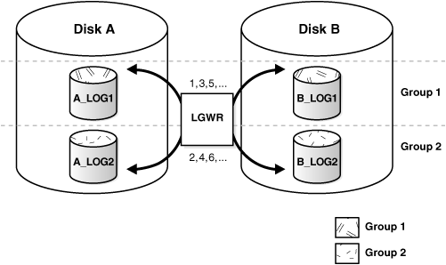
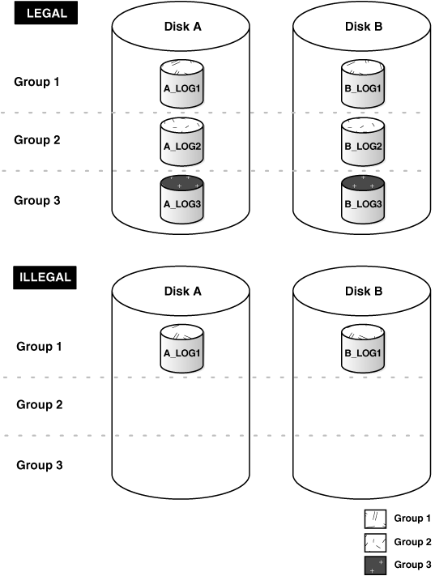

## Oracle log file parallel write 等待事件分析 - PostgreSQL的WAL异曲同工         
##### [TAG 21](../class/21.md)
                                                        
### 作者                                                       
digoal                                                        
                                                        
### 日期                                                      
2016-12-19                                                         
                                                        
### 标签                                                      
Oracle , PostgreSQL , log file parallel write , WAL 并行改进                                                                                                                   
                                                        
----                                                      
                                                        
## 背景          
数据库的可靠性是关系数据库的命脉之一，为了保证数据库的可靠性，重做日志是非常关键的技术，消除随机写，确保事务成功提交前，事务产生的日志都已经落盘。      
      
因为每个变更产生的REDO都要落盘，所以REDO WRITE在某些情况下也很容易成为瓶颈，REDO WRITE也产生了很多优化技术。     
     
## Oracle log file parallel write等待事件  
Oracle在统计信息中放了很多类似探针的东西，记录一些等待的次数，总时间。也就是常说的等待事件。     
  
关于Oracle redo的原理，请参考    
      
https://docs.oracle.com/cd/B28359_01/server.111/b28310/onlineredo002.htm#ADMIN11309    
  
    
  
    
      
log file parallel write等待事件分析      
      
http://www.toadworld.com/platforms/oracle/w/wiki/860.log-file-parallel-write    
      
log file parallel write 是指LGWR进程将redo buffer中的内容并行写入redofiles的事件，"并行"指写多份redo mirror(一个redo group可以配置多个member，镜像).     
    
```   
As the db file parallel write wait event belongs to the Oracle DBWR process, the log file parallel write wait event belongs to the Log Writer (LGWR) process.     
    
When it is time to write, the LGWR process writes the redo buffer to the online redo files in parallel and waits on the log file parallel write event until the last I/O is on disk.    
```  
  
### V$SESSION_WAIT Parameters:   
v$session_wait动态视图，记录了当前会话正在等待的事件，或者会话最后一次等待的事件的信息。    
  
http://docs.oracle.com/cd/B28359_01/server.111/b28320/dynviews_3023.htm    
    
SESSION_WAIT动态视图(每个会话一条)，如果会话正在等待log file parallel write，那么p1,p2,p3字段的含义如下          
    
P1 需要写多少份redo    
  
P1 = The number of online redo files Oracle is writing to. If there are two log members in the current group, then P1 shows 2.   
    
P2 需要写多少redo blocks(默认blocksize=512 bytes)    
  
P2 = The number of redo blocks to be written to each log member.    
    
P3 需求多少次IO请求，写完所有的redo blocks  
  
P3 = Total number of I/O requests needed to satisfy the write load (i.e. P2).  
    
### 分析log file parallel write等待事件  
#### 为什么会产生log file parallel write等待  
log file parallel write等待事件AVERAGE_WAIT这个指标可以很好的衡量REDO设备的I/O能力。    
  
AVERAGE_WAIT这个值最好能低于百分之一秒，（随着硬件的发展，未来这个值的期望应该会更低）  
  
如果你发现AVERAGE_WAIT这个值大于百分之3秒，则可能需要考虑使用IOPS更高，RT更低的块设备  
  
```
The log file parallel write latency is typically a symptom of poor placement of online redo log files, i.e. when files are placed on slow disks or LUNs bound in RAID 5.   
  
The AVERAGE_WAIT time of this event is a good indicator of the efficiency of the I/O device.   
  
Values less than 1 centisecond are desirable, although values up to 3 centiseconds are common and acceptable.   
  
If the average I/O wait time is an issue, the DBA needs to move the online redo log files to high speed disks, or disks with little or no I/O activities from external sources, or LUNs that are striped over many disks and not bound in RAID 5, or raw devices.     
```
  
与PostgreSQL的WAL Writer一样，Oracle LGWR也是有调度机制，先写buffer，LGWR会在REDO BUFFER写满1/3时，将OLD BUFFER写入文件，可以选择DIRECTIO或后台写。      
  
但是在事务提交时，必须确保其产生的COMMIT redo已落盘（通常需要FSYNC），如果写的小事务非常多，REDO BUFFER没有写到1/3就触发FSYNC，那么LGWR就会非常繁忙。      
  
log file parallel write等待怎么优化呢？  
  
1\. 修改应用程序，把小事务合成大事务  
  
2\. 使用分组提交  
  
3\. 把redo buffer size调小，尽量让LGWR刷BUFFER更频繁，从而backend process不需要频繁的等待刷buffer。  （副作用，不适合大吞吐的事务）  
  
4\. 尽量使用nologging操作(不保证事务的持久化和可靠性)  
  
```
A high commit frequency produces an over active LGWR process, and in a database where the online redo files are poorly placed, this increases the log file parallel write waits significantly.   
  
The application may be processing a large set of data in a loop and committing each change, which causes the log buffer to be flushed too frequently.   
  
In this case, modify the application code to commit at a lower frequency. There could also be many short sessions that log in, perform a small DML operation, and quickly log out.   
  
In this case, the application design may need to be reviewed. Hot backup that goes off during the peak hours generates a large amount of redo entries and may increase the log file parallel write waits.   
  
The DBA should schedule hot backup in off-peak hours and take tablespaces off the hot backup mode as soon as the backup completes.  
  
Reducing the amount of redo generation can minimize the log file parallel write waits, but the cure is proper placement of online redo files.   
  
One of the ways to reduce the amount of redo generation is to use the NOLOGGING option whenever possible.   
  
All indexes should be created or rebuilt with the NOLOGGING option. If application permits, CTAS operations should also use this option.  
```
  
#### Oracle LGWR如何写盘？   
_LOG_IO_SIZE默认为LOG_BUFFER的1/3，单位为log block size（通常为512字节）。   
  
1\. LGWR会在未落盘的LOG BUFFER大于_LOG_IO_SIZE，触发同步写  
  
2\. 或者每间隔3秒未执行同步写时执行同步写。   
  
如果_LOG_IO_SIZE很小（小于1/3  LOG_BUFFER），则LGWR会频繁的执行同步写，导致LGWR的log file parallel write等待事件变多。   
  
如果_LOG_IO_SIZE很大，则单次同步写的内容变多，导致单次sync write的时间变长，从而导致用户事务提交时的RT变高，事务响应变慢。   
  
通常的建议是将_LOG_IO_SIZE设置为REDO对应块设备的最大物理IO值。    
  
例如SSD，通常为4KiB。    
  
```
The _LOG_IO_SIZE parameter sets the threshold for the number of used log blocks in the Log Buffer.   
  
If the number of used log blocks is equal to or greater than the _LOG_IO_SIZE, the LGWR process will be posted to perform a background write if it is not already active.   
  
By default the _LOG_IO_SIZE is 1/3 of the LOG_BUFFER expressed in log blocks.   
  
Query the X$KCCLE.LEBSZ for the database's log block size. Typically it is 512 bytes.   
  
For example, if the LOG_BUFFER is 1,048,576 bytes (1MB), and the log block size is 512 bytes, then the default value for _LOG_IO_SIZE is 683 used log blocks.   
  
At this size, the LGWR process normally writes only on transaction terminations (sync writes) or when it wakes up from its 3-second timeouts.   
  
If the _LOG_IO_SIZE is much smaller (by means of a much smaller LOG_BUFFER or INIT.ORA setting), it can increase the number of background writes and subsequently increase the log file parallel write waits.   
  
While a larger _LOG_IO_SIZE reduces the number of background writes, it can slow down the commit response time because sync writes are longer.   
  
In other words, user processes wait longer on the log file sync event.   
  
Therefore the _LOG_IO_SIZE should not be too small that it creates a hyperactive LGWR or too large that it increases the log file sync waits.   
  
As a rule of thumb, the _LOG_IO_SIZE should be about the maximum physical I/O size (maxphys) of the platform.   
```
  
#### V$SYSTEM_EVENT诊断  
系统级的统计信息，通过V$SYSTEM_EVENT动态视图的AVERAGE_WAIT字段，判断整个系统的LOG file sync的平均等待时间。    
  
```
For system-level diagnosis, query the V$SYSTEM_EVENT view to determine if the AVERAGE_WAIT is an issue.   
  
Also look at the log file sync event.   
  
Each time a user session performs a commit or rollback, the LGWR process writes the redo buffer to disks and waits on the log file parallel write event for the I/O to complete, while the user session waits on the log file sync event for the transaction to complete.   
  
Therefore, reducing the log file parallel write wait time will also reduce the user wait time on the log file sync event.   
  
Check for high commit rate. As mentioned above, a high commit rate forces the LGWR process to be overactive. A database has a high commit rate when the average log I/O size is far smaller than _LOG_IO_SIZE, which defaults to 1/3 of the LOG_BUFFER size, expressed in log blocks.   
  
In other words, there are many small transactions and the LGWR process is forced to write before filling up to the _LOG_IO_SIZE threshold. The average log I/O size is obtained by dividing the statistics redo blocks written with redo writes.   
  
If the commit rate is high, the LOG_BUFFER need not be large. A larger LOG_BUFFER and lower commit rate can help improve the performance of imports, conventional loader, and concurrent inserts, but the gain may be diminished by the log file parallel write waits that are caused by poor placement of redo files.   
  
Writing redo records to the redo log files from the log buffer.   
```
  
### Wait Time  
```
Time it takes for the I/Os to complete. Even though redo records are written in parallel, the parallel write is not complete until the last I/O is on disk.   
```
  
## PostgreSQL wal writer  
PostgreSQL wal writer的调度  
  
wal writer进程不断的循环wal异步write，  
  
同时在达到两个阈值的任意一个后，触发fsync落盘。两个参数为（wal_writer_delay，wal_writer_flush_after）  
  
阈值一个为时间，另一个为SIZE。与Oracle的机制类似。  
    
（wal_writer_delay对应时间调度（Oracle为3秒，PG建议配置为10毫秒），wal_writer_flush_after对应（_LOG_IO_SIZE））。      
       
同时，同步提交的事务在提交时，也会触发wal fsync。  
  
分组提交和提交设置（on,off,local,remote_write,remote_apply）与WAL调度也有关，本文不讨论。    
  
src/backend/postmaster/walwriter.c  
  
```
        for (;;)  
        {  
                if (XLogBackgroundFlush())  
```
  
src/backend/access/transam/xlog.c  
  
```
bool  
XLogBackgroundFlush(void)  
{  
  
/*   
we only flush WAL every wal_writer_delay ms,   
or if there's more than wal_writer_flush_after unflushed blocks.  
*/  
  
#ifdef WAL_DEBUG  
        if (XLOG_DEBUG)  
                elog(LOG, "xlog bg flush request write %X/%X; flush: %X/%X, current is write %X/%X; flush %X/%X",  
                         (uint32) (WriteRqst.Write >> 32), (uint32) WriteRqst.Write,  
                         (uint32) (WriteRqst.Flush >> 32), (uint32) WriteRqst.Flush,  
                         (uint32) (LogwrtResult.Write >> 32), (uint32) LogwrtResult.Write,  
                   (uint32) (LogwrtResult.Flush >> 32), (uint32) LogwrtResult.Flush);  
#endif  
  
        START_CRIT_SECTION();  
  
        /* now wait for any in-progress insertions to finish and get write lock */  
        WaitXLogInsertionsToFinish(WriteRqst.Write);  
        LWLockAcquire(WALWriteLock, LW_EXCLUSIVE);  
        LogwrtResult = XLogCtl->LogwrtResult;  
        if (WriteRqst.Write > LogwrtResult.Write ||  
                WriteRqst.Flush > LogwrtResult.Flush)  
        {  
                XLogWrite(WriteRqst, flexible);  
        }  
        LWLockRelease(WALWriteLock);  
  
        END_CRIT_SECTION();  
```
  
src/backend/access/transam/xact.c  
  
```
static TransactionId  
RecordTransactionCommit(void)  
{  
  
...  
        if ((wrote_xlog && markXidCommitted &&  
                 synchronous_commit > SYNCHRONOUS_COMMIT_OFF) ||  
                forceSyncCommit || nrels > 0)  
        {  
                XLogFlush(XactLastRecEnd);  
  
                /*  
                 * Now we may update the CLOG, if we wrote a COMMIT record above  
                 */  
                if (markXidCommitted)  
                        TransactionIdCommitTree(xid, nchildren, children);  
        }  
...  
```
   
### PostgreSQL支持的WAL 块大小  
源码configure，编译时指定，大小为1KiB到64KiB    
  
```  
case ${wal_blocksize} in  
  1) XLOG_BLCKSZ=1024;;  
  2) XLOG_BLCKSZ=2048;;  
  4) XLOG_BLCKSZ=4096;;  
  8) XLOG_BLCKSZ=8192;;  
 16) XLOG_BLCKSZ=16384;;  
 32) XLOG_BLCKSZ=32768;;  
 64) XLOG_BLCKSZ=65536;;  
  *) as_fn_error $? "Invalid WAL block size. Allowed values are 1,2,4,8,16,32,64." "$LINENO" 5  
esac  
{ $as_echo "$as_me:${as_lineno-$LINENO}: result: ${wal_blocksize}kB" >&5  
$as_echo "${wal_blocksize}kB" >&6; }  
```  
    
对于SSD来说，建议将wal block size设置为4KiB  
    
## 参考  
[《PostgreSQL 源码性能诊断(perf profiling)指南》](../201611/20161129_01.md)  
  
[《Linux 性能诊断 perf使用指南》](../201611/20161127_01.md)  
  
[《PostgreSQL 可靠性分析 - 关于redo block原子写》](../201610/20161011_01.md)  
  
  
  
  

  
<a rel="nofollow" href="http://info.flagcounter.com/h9V1"  ></a>  
  
  
  
  
  
  
## [digoal's 大量PostgreSQL文章入口](https://github.com/digoal/blog/blob/master/README.md "22709685feb7cab07d30f30387f0a9ae")
  
