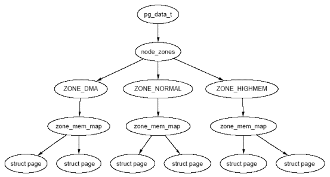

## Linux page allocation failure 的问题处理 - lowmem_reserve_ratio            
                                                            
### 作者                                                           
digoal                                                            
                                                            
### 日期                                                          
2016-12-21                                                             
                                                            
### 标签                                                          
Linux , PostgreSQL , page allocation failure , lowmem_reserve_ratio , OOM                                                                                                                  
                                                            
----                                                          
                                                            
## 背景              
Linux把物理内存划分为三个层次来管理：存储节点（Node）、管理区（Zone）和页面（Page）。       
       
每一个Node，系统又将其分为多个Zone，x86架构下，node被分为ZONE_DMA、ZONE_NORMAL、ZONE_HIGHMEM，而64位x86架构下有ZONE_DMA、ZONE_DMA32、ZONE_NORMAL。    
    
它们之间的是树状的包含关系：    
      
       
       
位于低位的ZONE，内存较少。    
    
对于x86架构的系统来说，物理内存被划分为：    
    
类型|	地址范围    
---|---    
ZONE_DMA|	前16MB内存    
ZONE_NORMAL|	16MB – 896MB    
ZONE_HIGHMEM|	896 MB以上    
    
ZONE_DMA位于低端的内存空间，用于某些旧的ISA设备。ZONE_NORMAL的内存直接映射到Linux内核线性地址空间的高端部分。    
    
对于x86_64架构的系统来说：    
    
类型|	地址范围    
---|---    
ZONE_DMA|	前16MB内存    
ZONE_DMA32|	16MB – 4G    
ZONE_NORMAL|	4G以上    
    
和x86相比，多了ZONE_DMA32，少了ZONE_HIGHMEM.    
    
分配物理内存时，kernel由high zone到low zone依次查找是否有足够的内存可以分配，找到可用的内存后映射到虚拟地址上。      
      
但是低位的ZONE内存较少，所以如果低位的ZONE被占满之后，就算剩余的物理内存很大，还是会出现oom的情况。对于linux2.6来说，oom之后会根据score杀掉一个进程（oom的话题这里不展开了）。    
    
这就引入了对低位ZONE的保护措施，lowmem_reserve_ratio。       
        
如果操作系统的内存很多(比如64GB以上)，可以将低位的ZONE的保护加到最大。       
   
例如  
  
```
sysctl -w vm.lowmem_reserve_ratio='1 1 1'

echo "vm.lowmem_reserve_ratio='1 1 1'" >/etc/sysctl.conf  
```
    
一台192G内存的机器，X86_64 OS，DMA=16MB，DMA32=4GB，NORMAL=剩余的内存。   
  
那么当设置了vm.lowmem_reserve_ratio='1 1 1'后，每一个ZONE的protection数组将变成如下，数组中的对应位置的值，表示当对应的高级ZONE来这个ZONE申请内存时，这个ZONE的剩余内存必须大于这个保护值。   
  
```
#free -m
             total       used       free     shared    buffers     cached
Mem:        193031     190099       2931          0        288     168877
-/+ buffers/cache:      20933     172098
Swap:            0          0          0

#cat /proc/zoneinfo |grep pro
dma:        protection: (0, 498744, 49625144, 49625144)
dma32:        protection: (0, 0, 49126400, 49126400)
normal:        protection: (0, 0, 0, 0)

由于normal已经是最高的ZONE，所以没有更高的ZONE会来它这里申请内存，它的保护值都是0，表示都可以申请.  
```
    
如DMA, 498744*4K表示DMA32来它这里申请的保护值，当DMA ZONE的剩余内存大于这个保护值时，才允许DMA32来它这里申请内存。      
   
49625144*4K表示NORMAL来它这里申请的保护值，当DMA ZONE的剩余内存大于这个保护值时，才允许NORMAL来它这里申请内存。   
   
这些值是怎么计算的？  根据对应保护位的高位ZONE的内存大小，除以被保护的系数。  如DMA的保护系数为1，即vm.lowmem_reserve_ratio的第一个元素值，那么DMA32来DMA申请内存的保护值=DMA32的内存大小/1，NORMAL来DMA申请内存的保护值=NORMAL的内存大小/1 。        
    
每个ZONE的内存大小(单位4K)：    
  
```
#cat /proc/zoneinfo |grep span
dma:        spanned  4095
dma32:        spanned  1044480
normal:        spanned  49807360
```
       
## 低位内存不足导致的page allocation failure    
例如，某台主机，发生了一些这样的报错，导致进程被OOM      
    
https://www.postgresql.org/message-id/flat/4301.138.23.210.20.1135194176.squirrel%40www.cs.ucr.edu#4301.138.23.210.20.1135194176.squirrel@www.cs.ucr.edu    
    
```    
Dec 20 17:14:57 server4 kernel:  postmaster: page allocation failure. order:0, mode:0xd0    
Dec 20 17:14:57 server4 kernel:  [<c0143271>] __alloc_pages+0x2e1/0x2f7    
Dec 20 17:14:57 server4 kernel:  [<c014329f>] __get_free_pages+0x18/0x24    
Dec 20 17:14:57 server4 kernel:  [<c0145bfc>] kmem_getpages+0x1c/0xbb    
Dec 20 17:14:57 server4 kernel:  [<c014674a>] cache_grow+0xab/0x138    
Dec 20 17:14:57 server4 kernel:  [<c014693c>] cache_alloc_refill+0x165/0x19d    
Dec 20 17:14:57 server4 kernel:  [<c0146b37>] kmem_cache_alloc+0x51/0x57    
Dec 20 17:14:57 server4 kernel:  [<c0142019>] mempool_alloc+0xb2/0x135    
Dec 20 17:14:57 server4 kernel:  [<c011fec9>] autoremove_wake_function+0x0/0x2d    
Dec 20 17:14:57 server4 kernel:  [<c011fec9>] autoremove_wake_function+0x0/0x2d    
Dec 20 17:14:57 server4 kernel:  [<c015de0e>] bio_alloc+0x15/0x168    
Dec 20 17:14:57 server4 kernel:  [<c026c48f>] sync_page_io+0x25/0xa2    
Dec 20 17:14:57 server4 kernel:  [<c026d97c>] write_disk_sb+0x5a/0x86    
Dec 20 17:15:01 server4 kernel:  [<c026d9ca>] sync_sbs+0x22/0x2f    
Dec 20 17:15:01 server4 kernel:  [<c026da5b>] md_update_sb+0x84/0xc6    
Dec 20 17:15:01 server4 kernel:  [<c02706b5>] md_write_start+0x5e/0x8c    
Dec 20 17:15:01 server4 kernel:  [<f882faf7>] make_request+0x22a/0x2b3 [raid1]    
Dec 20 17:15:01 server4 kernel:  [<c02232e4>] generic_make_request+0x18e/0x19e    
Dec 20 17:15:01 server4 kernel:  [<c02233be>] submit_bio+0xca/0xd2    
Dec 20 17:15:01 server4 kernel:  [<c0144812>] test_set_page_writeback+0xad/0xe1    
Dec 20 17:15:01 server4 kernel:  [<c0152ad7>] swap_writepage+0x9a/0xa3    
Dec 20 17:15:01 server4 kernel:  [<c01487ed>] pageout+0x8d/0xcc    
Dec 20 17:15:01 server4 kernel:  [<c0148a33>] shrink_list+0x207/0x3ed    
Dec 20 17:15:01 server4 kernel:  [<c0147cb4>] __pagevec_release+0x15/0x1d    
Dec 20 17:15:01 server4 kernel:  [<c0148df6>] shrink_cache+0x1dd/0x34d    
Dec 20 17:15:01 server4 kernel:  [<c01494b4>] shrink_zone+0xa7/0xb6    
Dec 20 17:15:01 server4 kernel:  [<c014950f>] shrink_caches+0x4c/0x57    
Dec 20 17:15:01 server4 kernel:  [<c0149606>] try_to_free_pages+0xc3/0x1a7    
Dec 20 17:15:01 server4 kernel:  [<c014318e>] __alloc_pages+0x1fe/0x2f7    
Dec 20 17:15:01 server4 kernel:  [<c014329f>] __get_free_pages+0x18/0x24    
Dec 20 17:15:01 server4 kernel:  [<c0145bfc>] kmem_getpages+0x1c/0xbb    
Dec 20 17:15:01 server4 kernel:  [<c014674a>] cache_grow+0xab/0x138    
```    
    
很可能就是低位内存不足导致的。    
    
## 一些概念(摘自互联网)    
http://blog.2baxb.me/archives/1065    
    
http://blog.csdn.net/kickxxx/article/details/8835733    
    
### lowmem与highmem    
    
关于lowmem和highmem的定义在这里就不详细展开了，推荐两篇文章：    
    
[Documentation/vm/highmem.txt](https://www.kernel.org/doc/Documentation/vm/highmem.txt)        
    
[Linux内核高端内存](http://ilinuxkernel.com/?p=1013)      
    
链接内讲的比较清楚，这里只说结论：    
    
1\. 当系统的物理内存 > 内核的地址空间范围时，才需要引入highmem概念。    
    
2\. x86架构下，linux默认会把进程的虚拟地址空间（4G）按3:1拆分，0~3G user space通过页表映射，3G-4G kernel space线性映射到进程高地址。就是说，x86机器的物理内存超过1G时，需要引入highmem概念。    
    
3\. 内核不能直接访问1G以上的物理内存（因为这部分内存没法映射到内核的地址空间），当内核需要访问1G以上的物理内存时，需要通过临时映射的方式，把高地址的物理内存映射到内核可以访问的地址空间里。    
    
4\. 当lowmem被占满之后，就算剩余的物理内存很大，还是会出现oom的情况。对于linux2.6来说，oom之后会根据score杀掉一个进程（oom的话题这里不展开了）。    
    
5\. x86_64架构下，内核可用的地址空间远大于实际物理内存空间，所以目前没有上面讨论的highmem的问题。    
    
### linux的物理内存管理    
    
接下来的问题是，linux是如何实现highmem的概念的？    
    
Linux把物理内存划分为三个层次来管理：存储节点（Node）、管理区（Zone）和页面（Page）。    
    
在NUMA架构下，系统根据CPU的物理颗数，将物理内存分成对应的Node，这里也不展开了，可以参考    
    
[NUMA (Non-Uniform Memory Access): An Overview](http://queue.acm.org/detail.cfm?id=2513149)       
    
每一个Node，系统又将其分为多个Zone，x86架构下，node被分为ZONE_DMA、ZONE_NORMAL、ZONE_HIGHMEM，而64位x86架构下有ZONE_DMA（ZONE_DMA32）和ZONE_NORMAL。它们之间的是树状的包含关系：    
    
       
    
可以通过以下命令查看numa node信息：    
    
```    
$ numactl --hardware    
available: 2 nodes (0-1)    
node 0 cpus: 0 2 4 6 8 10 12 14 16 18 20 22    
node 0 size: 8114 MB    
node 0 free: 2724 MB    
node 1 cpus: 1 3 5 7 9 11 13 15 17 19 21 23    
node 1 size: 8192 MB    
node 1 free: 818 MB    
node distances:    
node   0   1    
  0:  10  20    
  1:  20  10    
```    
    
可以通过以下命令查看zone信息，注意单位是page（4k）：    
    
```    
$ cat /proc/zoneinfo    
Node 0, zone      DMA    
  pages free     3933    
        min      20    
        low      25    
        high     30    
        scanned  0    
        spanned  4095    
        present  3834    
```    
    
结合之前关于highmem的说明，对于x86架构的系统来说，物理内存被划分为：    
    
类型|	地址范围    
---|---    
ZONE_DMA|	前16MB内存    
ZONE_NORMAL|	16MB – 896MB    
ZONE_HIGHMEM|	896 MB以上    
    
ZONE_DMA位于低端的内存空间，用于某些旧的ISA设备。ZONE_NORMAL的内存直接映射到Linux内核线性地址空间的高端部分。    
    
对于x86_64架构的系统来说：    
    
类型|	地址范围    
---|---    
ZONE_DMA|	前16MB内存    
ZONE_DMA32|	16MB – 4G    
ZONE_NORMAL|	4G以上    
    
和x86相比，多了ZONE_DMA32，少了ZONE_HIGHMEM.    
    
    
### linux如何分配内存    
    
这里也不详细展开了，推荐两篇文章：    
    
[Glibc内存管理–ptmalloc2源代码分析](http://mqzhuang.iteye.com/blog/1064966)      
    
[PageAllocation](http://linux-mm.org/PageAllocation)      
    
    
结论：    
    
1\. malloc属于glic的库函数，分配的是虚拟地址。    
    
2\. linux的malloc分配时，如果申请内存小于MMAP_THRESHOLD（默认128K），使用brk分配，否则使用mmap分配。    
    
3\. 通过brk分配的地址空间，当堆尾的空闲内存超过M_TRIM_THRESHOLD(默认128K)时，执行内存缩紧操作，这里指的也是虚拟地址。    
    
4\. 读写内存时，触发缺页中断，此时才会分配物理内存。    
    
5\. 分配物理内存时，kernel由high zone到low zone依次查找是否有足够的内存可以分配，找到可用的内存后映射到虚拟地址上。    
    
6\. 关于系统分配内存的详细介绍，可以参考：    
    
[Memory Mapping and DMA](http://lwn.net/images/pdf/LDD3/ch15.pdf)      
    
    
### lowmem_reserve_ratio    
这里主要是对vm.txt的解释，建议看原文      
    
#### 为什么要调整lowmem_reserve_ratio    
在有高端内存的机器上，从低端内存域给应用层进程分配内存是很危险的，因为这些内存可以通过mlock()系统锁定，或者变成不可用的swap空间。    
    
在有大量高端内存的机器上，缺少可以回收的低端内存是致命的。因此如果可以使用高端内存，Linux页面分配器不会使用低端内存。这意味着，内核会保护一定数量的低端内存，避免被用户空间锁定。“lowmem_reserve_ratio”参数可以调整内核对于lower zone的保护力度。    
    
#### lowmem_reserve_ratio参数的含义    
    
lowmem_reserve_ratio是一个数组，可以通过以下命令查看：    
    
```    
% cat /proc/sys/vm/lowmem_reserve_ratio    
256     256     32    
```    
    
数组的长度=内存zone数量-1，其中每个数并不是绝对值，而是一个比例，代表1/256或1/32。    
    
再次搬出zoneinfo，这里以zone_dma和zone_dma32举例：    
    
    
```    
$ cat /proc/zoneinfo    
Node 0, zone      DMA    
  pages free     3933    
        min      20    
        low      25    
        high     30    
        scanned  0    
        spanned  4095    
        present  3834    
        protection: (0, 3179, 7976, 7976)    
Node 0, zone    DMA32    
  pages free     639908    
        min      4456    
        low      5570    
        high     6684    
        scanned  0    
        spanned  1044480    
        present  813848    
        protection: (0, 0, 4797, 4797)    
……………………    
```    
    
linux尝试在zone中分配page时，会判断当前zone的page_free与高位zone的page_present的关系。    
    
例如在dma中尝试申请dma32的page时，会计算一个protection值：    
    
protection[dma,dma32] = zone_dma32.present/lowmem_reserve_ratio[dma(1)] = 813848/256 = 3179，这个结果对应上面DMA段中，protection数组的第二个元素。    
    
然后需要比较zone_dma.free的值(3933) 与 protectiondma,dma32 + zone_dma.watermarkhigh的大小：  
  
如果free>protection+watermark[high]，则可以分配page；否则不能分配，内核继续查找下一个lower zone。  
  
也就是说只有在higher zone内存不足时才会尝试从lower zone继续申请。    
    
更详细的文档可以参考:    
    
[Documentation/sysctl/vm.txt](https://www.kernel.org/doc/Documentation/sysctl/vm.txt)      
    
根据公式可以看出：    
    
lowmem_reserve_ratio越大，低级的zone中被保护的内存就越小；    
    
lowmem_reserve_ratio越小，低级的zone中被保护的内存就越大；    
    
当lowmem_reserve_ratio=1(100%)时代表对low zone的最大保护强度。    
    
## lowmem_reserve_ratio    
    
```  
For some specialised workloads on highmem machines it is dangerous for    
the kernel to allow process memory to be allocated from the "lowmem"    
zone.  This is because that memory could then be pinned via the mlock()    
system call, or by unavailability of swapspace.    
    
And on large highmem machines this lack of reclaimable lowmem memory    
can be fatal.    
    
So the Linux page allocator has a mechanism which prevents allocations    
which _could_ use highmem from using too much lowmem.  This means that    
a certain amount of lowmem is defended from the possibility of being    
captured into pinned user memory.    
    
(The same argument applies to the old 16 megabyte ISA DMA region.  This    
mechanism will also defend that region from allocations which could use    
highmem or lowmem).    
    
The `lowmem_reserve_ratio' tunable determines how aggressive the kernel is    
in defending these lower zones.    
    
If you have a machine which uses highmem or ISA DMA and your    
applications are using mlock(), or if you are running with no swap then    
you probably should change the lowmem_reserve_ratio setting.    
    
The lowmem_reserve_ratio is an array. You can see them by reading this file.    
-    
% cat /proc/sys/vm/lowmem_reserve_ratio    
256     256     32    
-    
Note: # of this elements is one fewer than number of zones. Because the highest    
      zone's value is not necessary for following calculation.    
    
But, these values are not used directly. The kernel calculates # of protection    
pages for each zones from them. These are shown as array of protection pages    
in /proc/zoneinfo like followings. (This is an example of x86-64 box).    
Each zone has an array of protection pages like this.    
    
-    
Node 0, zone      DMA    
  pages free     1355    
        min      3    
        low      3    
        high     4    
        :    
        :    
    numa_other   0    
        protection: (0, 2004, 2004, 2004)    
        ^^^^^^^^^^^^^^^^^^^^^^^^^^^^^^^^^    
  pagesets    
    cpu: 0 pcp: 0    
        :    
-    
These protections are added to score to judge whether this zone should be used    
for page allocation or should be reclaimed.    
    
In this example, if normal pages (index=2) are required to this DMA zone and    
watermark[WMARK_HIGH] is used for watermark, the kernel judges this zone should    
not be used because pages_free(1355) is smaller than watermark + protection[2]    
(4 + 2004 = 2008). If this protection value is 0, this zone would be used for    
normal page requirement. If requirement is DMA zone(index=0), protection[0]    
(=0) is used.    
    
zone[i]'s protection[j] is calculated by following expression.    
    
(i < j):    
  zone[i]->protection[j]    
  = (total sums of present_pages from zone[i+1] to zone[j] on the node)    
    / lowmem_reserve_ratio[i];    
(i = j):    
   (should not be protected. = 0;    
(i > j):    
   (not necessary, but looks 0)    
    
The default values of lowmem_reserve_ratio[i] are    
    256 (if zone[i] means DMA or DMA32 zone)    
    32  (others).    
As above expression, they are reciprocal number of ratio.    
256 means 1/256. # of protection pages becomes about "0.39%" of total present    
pages of higher zones on the node.    
    
If you would like to protect more pages, smaller values are effective.    
The minimum value is 1 (1/1 -> 100%).    
```  
    
## Linux老版本lowmem_reserve参数  
摘自 http://blog.csdn.net/kickxxx/article/details/8835733  
  
2.6内核的zone结构中一个成员变量 lowmem_reserve  
  
```  
struct zone {    
    /* Fields commonly accessed by the page allocator */    
    
    /* zone watermarks, access with *_wmark_pages(zone) macros */    
    unsigned long watermark[NR_WMARK];    
    
    /*   
     * We don't know if the memory that we're going to allocate will be freeable   
     * or/and it will be released eventually, so to avoid totally wasting several   
     * GB of ram we must reserve some of the lower zone memory (otherwise we risk   
     * to run OOM on the lower zones despite there's tons of freeable ram   
     * on the higher zones). This array is recalculated at runtime if the   
     * sysctl_lowmem_reserve_ratio sysctl changes.   
     */    
    unsigned long       lowmem_reserve[MAX_NR_ZONES];     
```  
kernel在分配内存时，可能会涉及到多个zone，分配会尝试从zonelist第一个zone分配，如果失败就会尝试下一个低级的zone（这里的低级仅仅指zone内存的位置，实际上低地址zone是更稀缺的资源）。我们可以想像应用进程通过内存映射申请Highmem 并且加mlock分配，如果此时Highmem zone无法满足分配，则会尝试从Normal进行分配。这就有一个问题，来自Highmem的请求可能会耗尽Normal zone的内存，而且由于mlock又无法回收，最终的结果就是Normal zone无内存提供给kernel的正常分配，而Highmem有大把的可回收内存无法有效利用。  
  
因此针对这个case，使得Normal zone在碰到来自Highmem的分配请求时，可以通过lowmem_reserve声明：可以使用我的内存，但是必须要保留lowmem_reserve[NORMAL]给我自己使用。  
  
同样当从Normal失败后，会尝试从zonelist中的DMA申请分配，通过lowmem_reserve[DMA]，限制来自HIGHMEM和Normal的分配请求。  
  
```  
/*   
 * results with 256, 32 in the lowmem_reserve sysctl:   
 *  1G machine -> (16M dma, 800M-16M normal, 1G-800M high)   
 *  1G machine -> (16M dma, 784M normal, 224M high)   
 *  NORMAL allocation will leave 784M/256 of ram reserved in the ZONE_DMA   
 *  HIGHMEM allocation will leave 224M/32 of ram reserved in ZONE_NORMAL   
 *  HIGHMEM allocation will (224M+784M)/256 of ram reserved in ZONE_DMA   
 *   
 * TBD: should special case ZONE_DMA32 machines here - in those we normally   
 * don't need any ZONE_NORMAL reservation   
 */    
 #ifdef CONFIG_ZONE_DMA    
     256,    
#endif    
#ifdef CONFIG_ZONE_DMA32    
     256,    
#endif    
#ifdef CONFIG_HIGHMEM    
     32,    
#endif    
     32,    
};    
```  
  
如果不希望低级zone被较高级分配使用，那么可以设置系数为1，得到最大的保护效果  
  
不过这个值的计算非常的奇怪，来自NORMAL的分配，lowmem_reserve[DMA] = normal_size / ratio，这里使用Normal zone size而不是DMA zone size，这点一直没有想明白。  
  
此外，较新的内核源码目录中/Documentation/sysctl/vm.txt，对lowmem_reserve做了非常准确的描述。  
  
## 参考    
https://www.cyberciti.biz/faq/linux-page-allocation-failure-erro/    
    
http://blog.csdn.net/kickxxx/article/details/8835733    
    
http://stackoverflow.com/questions/4984190/understanding-proc-sys-vm-lowmem-reserve-ratio    
    
http://blog.2baxb.me/archives/1065      
      
      
      
      

  
<a rel="nofollow" href="http://info.flagcounter.com/h9V1"  ></a>  
  
  
  
  
  
  
## [digoal's 大量PostgreSQL文章入口](https://github.com/digoal/blog/blob/master/README.md "22709685feb7cab07d30f30387f0a9ae")
  
