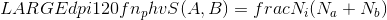
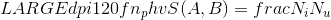
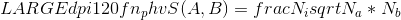
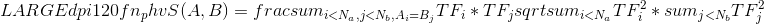
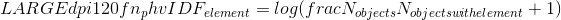
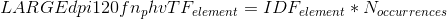
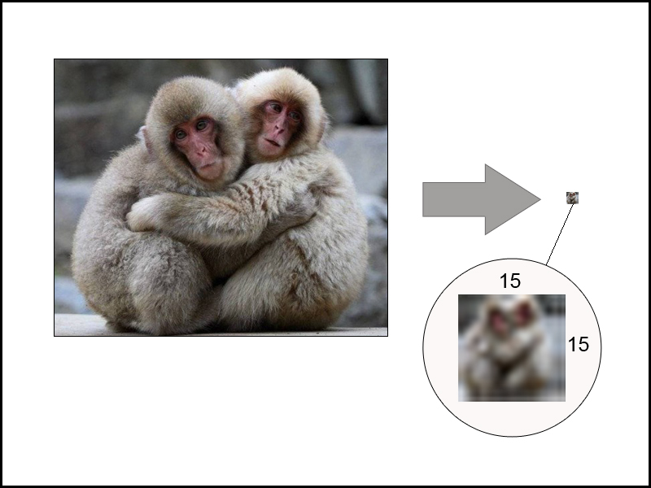
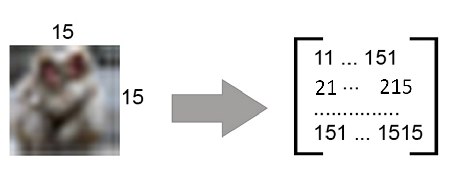
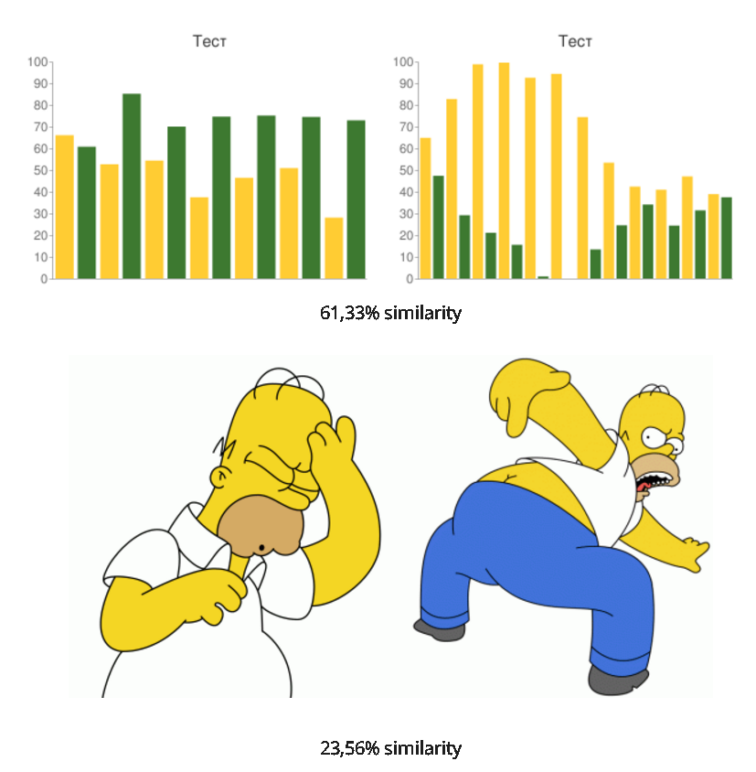

## 从相似度算法谈起 - Effective similarity search in PostgreSQL            
##### [TAG 15](../class/15.md)
                                                                
### 作者                                                               
digoal                                                                
                                                                
### 日期                                                              
2016-12-22                                                                 
                                                                
### 标签                                                              
PostgreSQL , 数组 , 相似度 , 文本分析 , 图像分析 , 字符串分析 , 婚姻介绍 , 精确配对                                                                                                                             
                                                                
----                                                              
                                                                
## 背景                
相似度分析是一个非常普遍的需求，例如根据用户提供的线索，从一堆文本数据、图片数据、视频数据中筛选一段与用户的描述相近的。     
     
我之前写过一系列的文章来介绍，文本、图片相似度搜索的技术和使用场景。     
    
[《PostgreSQL 在视频、图片去重，图像搜索业务中的应用》](../201611/20161126_01.md)    
         
[《弱水三千,只取一瓢,当图像搜索遇见PostgreSQL(Haar wavelet)》](https://yq.aliyun.com/articles/58246)      
    
[《聊一聊双十一背后的技术 - 毫秒分词算啥, 试试正则和相似度》](../201611/20161118_01.md)      
    
[《PostgreSQL 全文检索加速 快到没有朋友 - RUM索引接口(潘多拉魔盒)》](../201610/20161019_01.md)      
    
[《PostgreSQL 文本数据分析实践之 - 相似度分析》](../201608/20160817_01.md)      
      
为什么还要写本文呢？     
     
本文提到的技术实际上是很早以前的相似度计算的技术，现在已经改进了很多，但是旧的东西比较简单，也容易理解，了解一下初心未尝不可，还是挺有意思的。     
      
## 从最简单的说起 - 如何计算两个数组的相似度  
假设有两个数组，里面分别有一些元素，这些元素是用来表示用户的画像的。       
     
那么通过计算不同用户之间的数组的相似度，就可以知道他们是否有共同的癖好，有没有话题可聊。     
     
好像又扯到一些婚介网站啦，没错，确实可以用来配对呢。     
     
      
     
      
     
那么怎么计算这两个数组的相似度呢？      
     
### 算法介绍  
首先了解几个数组相关的术语。   
   
Na, Nb – the number of unique elements in the arrays  
  
Nu – the number of unique elements in the union of sets  
  
Ni – the number of unique elements in the intersection of arrays  
  
1\. 最简单的相似度算法如下    
  
   
  
  
  
好处    
  
- 容易理解  
    
- 速度=N*log(N)  
  
- 当Nb, Na很大时，也可以很好的支持  
  
2\. 另一种相似度算法  
  
  
  
好处    
  
- 速度=N*log(N)  
  
- 当Nb, Na很大时，也可以很好的支持  
  
注意以上两种方法都存在一定的问题  
  
- Few elements -> large scatter of similarity (当元素很少时，相似度可能会很分散)  
  
- Frequent elements -> weight below (当元素频繁出现时，没有词频的权重，无法得到合理的相似度)  
  
3\. TF/IDF系数，解决以上问题  
  
http://en.wikipedia.org/wiki/Tf*idf  
  
  
  
其中  
  
  
  
  
  
有了理论基础，就可以来实现相似度了的运算了，PostgreSQL很容易扩展，所以不需要担心大改PG内核，加个插件就行了。   
    
下面提到的smlar插件是一个古老的插件，但是它支持相似度公式，也就是说，你可以自定义相似度的算法公式，进行运算，同时还支持GiST和GIN的索引哦。     
    
### smlar相似度插件  
部署  
  
```  
git clone git://sigaev.ru/smlar  
cd smlar  
USE_PGXS=1 make   
USE_PGXS=1 make install  
```  
  
设置参数，相似度阈值（大于阈值返回TRUE，小于阈值返回FALSE）  
  
```  
smlar.threshold = 0.8  # or any other value >0 and <1  
```  
  
使用方法  
  
```  
psql  
  
test=# CREATE EXTENSION smlar;  
CREATE EXTENSION  
```
  
计算相似度  
   
```
test=# SELECT smlar('{1,4,6}'::int[], '{5,4,6}' );  
  smlar    
----------  
 0.666667  
(1 row)  
  
test=# SELECT smlar('{1,4,6}'::int[], '{5,4,6}', 'N.i / sqrt(N.a * N.b)' );  
  smlar    
----------  
 0.666667  
(1 row)  
```
  
根据相似度阈值，判断两者是否相似  
  
```
test=# SELECT '{1,4,6,5,7,9}'::int[] % '{1,5,4,6,7,8,9}'::int[] as similar;  
 similar  
---------  
 t  
(1 row)  
```  
  
索引支持，% 操作符支持索引检索，可以快速的得到你要查询的数据     
  
GiST/GIN support for % operation.   
  
The parameter "similar.type" allows you to specify what kind of formula used to calculate the similarity: cosine (default), overlap or tfidf.   
  
For "tfidf" need to make additional configuration, but I will not consider this in the article (all can be found in the README file).   
  
Now let's consider an example of using this extension.  
     
前面讲了，相似度的计算算法，有3个公式可以使用，所以这里也一样，用户可以自定义公式来计算相似度  
  
计算相似度时，用户可以提供计算公式。     
    
```  
test=# SELECT smlar('{1,4,6}'::int[], '{5,4,6}', 'N.i / sqrt(N.a * N.b)' );  
  smlar    
----------  
 0.666667  
(1 row)  
```  
  
  
## 由数组的相似度运算到字符串、图片、.....  的相似度运算  
前面分析了一同数组的相似度运算，马上会问了，字符串 怎么搞，图片，或者其他的特殊类型 怎么算相似度呢？     
  
### 字符串相似度  
字符串与字符串的相似度运算，其实也有思路的，比如PostgreSQL pg_trgm插件，将字符串打成很多的token，对tokens进行运算。(其实又回到了数组与数组的相似度计算)     
     
https://www.postgresql.org/docs/9.6/static/pgtrgm.html  
  
```  
postgres=# select similarity('hello digoal','hell digoal');  
 similarity   
------------  
   0.785714  
(1 row)  
```  
    
pg_trgm很好用，有很多的索引检索，排序的支持。     
     
包括对正则表达式的索引支持，有更详细的文本请参考。  
    
[《聊一聊双十一背后的技术 - 毫秒分词算啥, 试试正则和相似度》](../201611/20161118_01.md)     
    
### 图片相似度  
说完文本，该说说图片了，其实图片也可以数字化，比如有一张大图，  
    
  
    
    
首先压缩为15*15 pixel的小图，15*15一共225个小格子，每个小格子里面由RGB三原色组成。     
    
可以将每个格子的三原色计算成一个值，这样就组成了一个15*15的矩阵数组。    
  
例如某个格子的值为 0.299 * red + 0,587 * green + 0,114 * blue  
  
那么又回到了数组与数组的相似度计算上面了。     
  
  
  
  
以下是使用以上方法完成的，对两张图片的近似度运算  
  
  
  
  
  
是不是很神奇呢？  
  
例子    
  
```  
CREATE TABLE images (  
 id serial PRIMARY KEY,  
 name varchar(50),  
 image_array integer[]  
);  
  
INSERT into images(image_array) VALUES ('{1010257,...,2424257}');  
  
test=# SELECT count(*) from images;  
 count   
--------  
 200000  
(1 row)  
  
test=# EXPLAIN ANALYZE SELECT id FROM images WHERE images.image_array % '{1010259,...,2424252}'::int[];  
  
Aggregate  (cost=14.58..14.59 rows=1 width=0) (actual time=1.785..1.785 rows=1 loops=1)  
   -&gt;  Seq Scan on images  (cost=0.00..14.50 rows=33 width=0) (actual time=0.115..1.772 rows=20 loops=1)  
         Filter: (image_array % '{1010259,1011253,...,2423253,2424252}'::integer[])  
 Total runtime: 5152.819 ms  
(4 rows)  
  
CREATE INDEX image_array_gin ON images USING GIN(image_array _int4_sml_ops);  
  
or  
  
CREATE INDEX image_array_gist ON images USING GIST(image_array _int4_sml_ops);  
```  
  
索引的使用测试   
  
```  
test=# EXPLAIN ANALYZE SELECT id FROM images WHERE images.image_array % '{1010259,1011253,...,2423253,2424252}'::int[];  
   
 Aggregate  (cost=815.75..815.76 rows=1 width=0) (actual time=320.428..320.428 rows=1 loops=1)  
   -&gt;  Bitmap Heap Scan on images  (cost=66.42..815.25 rows=200 width=0) (actual time=108.127..304.524 rows=40000 loops=1)  
         Recheck Cond: (image_array % '{1010259,1011253,...,2424252}'::integer[])  
         -&gt;  Bitmap Index Scan on image_array_gist  (cost=0.00..66.37 rows=200 width=0) (actual time=90.814..90.814 rows=40000 loops=1)  
               Index Cond: (image_array % '{1010259,1011253,...,2424252}'::integer[])  
 Total runtime: 320.487 ms  
(6 rows)  
  
test=# SELECT count(*) from images;  
  count   
---------  
 1000000  
(1 row)  
   
test=# EXPLAIN ANALYZE SELECT count(*) FROM images WHERE images.image_array % '{1010259,1011253,...,2423253,2424252}'::int[];  
   
 Bitmap Heap Scan on images  (cost=286.64..3969.45 rows=986 width=4) (actual time=504.312..2047.533 rows=200000 loops=1)  
   Recheck Cond: (image_array % '{1010259,1011253,...,2423253,2424252}'::integer[])  
   -&gt;  Bitmap Index Scan on image_array_gist  (cost=0.00..286.39 rows=986 width=0) (actual time=446.109..446.109 rows=200000 loops=1)  
         Index Cond: (image_array % '{1010259,1011253,...,2423253,2424252}'::integer[])  
 Total runtime: 2152.411 ms  
(5 rows)  
  
EXPLAIN ANALYZE SELECT smlar(images.image_array, '{1010259,...,2424252}'::int[]) as similarity FROM images WHERE images.image_array % '{1010259,1011253, ...,2423253,2424252}'::int[] ORDER BY similarity DESC;   
   
 Sort  (cost=4020.94..4023.41 rows=986 width=924) (actual time=2888.472..2901.977 rows=200000 loops=1)  
   Sort Key: (smlar(image_array, '{...,2424252}'::integer[]))  
   Sort Method: quicksort  Memory: 15520kB  
   -&gt;  Bitmap Heap Scan on images  (cost=286.64..3971.91 rows=986 width=924) (actual time=474.436..2729.638 rows=200000 loops=1)  
         Recheck Cond: (image_array % '{...,2424252}'::integer[])  
         -&gt;  Bitmap Index Scan on image_array_gist  (cost=0.00..286.39 rows=986 width=0) (actual time=421.140..421.140 rows=200000 loops=1)  
               Index Cond: (image_array % '{...,2424252}'::integer[])  
 Total runtime: 2912.207 ms  
(8 rows)  
```  
    
## 文本的相似度分析  
文本的分析，是指将文本使用全文检索的方式，转换为ts_vector数据类型，然后对FTS进行相似度分析，详见我写的如下文章  
  
[《PostgreSQL 全文检索加速 快到没有朋友 - RUM索引接口(潘多拉魔盒)》](../201610/20161019_01.md)      
    
[《PostgreSQL 文本数据分析实践之 - 相似度分析》](../201608/20160817_01.md)      
  
## 更优秀的图片相似度分析方法  
其实图像搜索有更好的技术，相比前面简单粗暴的pixel 矩阵的运算更合理，Haar wavelet的算法，一样是嫁接到PostgreSQL里面，详见我写的如下文章  
  
[《PostgreSQL 在视频、图片去重，图像搜索业务中的应用》](../201611/20161126_01.md)    
         
[《弱水三千,只取一瓢,当图像搜索遇见PostgreSQL(Haar wavelet)》](https://yq.aliyun.com/articles/58246)      
    
### smlar readme  
```  
float4 smlar(anyarray, anyarray)  
        - computes similary of two arrays. Arrays should be the same type.  
  
float4 smlar(anyarray, anyarray, bool useIntersect)  
        -  computes similary of two arrays of composite types. Composite type looks like:  
                CREATE TYPE type_name AS (element_name anytype, weight_name FLOAT4);  
           useIntersect option points to use only intersected elements in denominator  
           see an exmaples in sql/composite_int4.sql or sql/composite_text.sql  
  
float4 smlar( anyarray a, anyarray b, text formula );  
        - computes similary of two arrays by given formula, arrays should   
        be the same type.   
        Predefined variables in formula:  
          N.i   - number of common elements in both array (intersection)  
          N.a   - number of uniqueelements in first array  
          N.b   - number of uniqueelements in second array  
        Example:  
        smlar('{1,4,6}'::int[], '{5,4,6}' )  
        smlar('{1,4,6}'::int[], '{5,4,6}', 'N.i / sqrt(N.a * N.b)' )  
        That calls are equivalent.  
  
anyarray % anyarray  
        - returns true if similarity of that arrays is greater than limit  
  
float4 show_smlar_limit()  - deprecated  
        - shows the limit for % operation  
  
float4 set_smlar_limit(float4) - deprecated  
        - sets the limit for % operation  
  
Use instead of show_smlar_limit/set_smlar_limit GUC variable   
smlar.threshold (see below)  
  
  
text[] tsvector2textarray(tsvector)  
        - transforms tsvector type to text array  
  
anyarray array_unique(anyarray)  
        - sort and unique array  
  
float4 inarray(anyarray, anyelement)  
        - returns zero if second argument does not present in a first one  
          and 1.0 in opposite case  
  
float4 inarray(anyarray, anyelement, float4, float4)  
        - returns fourth argument if second argument does not present in   
          a first one and third argument in opposite case  
  
GUC configuration variables:  
  
smlar.threshold  FLOAT  
        Array's with similarity lower than threshold are not similar   
        by % operation  
  
smlar.persistent_cache BOOL  
        Cache of global stat is stored in transaction-independent memory  
  
smlar.type  STRING  
        Type of similarity formula: cosine(default), tfidf, overlap  
  
smlar.stattable STRING  
        Name of table stored set-wide statistic. Table should be   
        defined as  
        CREATE TABLE table_name (  
                value   data_type UNIQUE,  
                ndoc    int4 (or bigint)  NOT NULL CHECK (ndoc>0)  
        );  
        And row with null value means total number of documents.  
        See an examples in sql/*g.sql files  
        Note: used on for smlar.type = 'tfidf'  
  
smlar.tf_method STRING  
        Calculation method for term frequency. Values:  
                "n"     - simple counting of entries (default)  
                "log"   - 1 + log(n)  
                "const" - TF is equal to 1  
        Note: used on for smlar.type = 'tfidf'  
  
smlar.idf_plus_one BOOL  
        If false (default), calculate idf as log(d/df),  
        if true - as log(1+d/df)  
        Note: used on for smlar.type = 'tfidf'  
  
Module provides several GUC variables smlar.threshold, it's highly  
recommended to add to postgesql.conf:  
custom_variable_classes = 'smlar'       # list of custom variable class names  
smlar.threshold = 0.6  #or any other value > 0 and < 1  
and other smlar.* variables  
  
GiST/GIN support for % and  && operations for:  
  Array Type   |  GIN operator class  | GiST operator class    
---------------+----------------------+----------------------  
 bit[]         | _bit_sml_ops         |   
 bytea[]       | _bytea_sml_ops       | _bytea_sml_ops  
 char[]        | _char_sml_ops        | _char_sml_ops  
 cidr[]        | _cidr_sml_ops        | _cidr_sml_ops  
 date[]        | _date_sml_ops        | _date_sml_ops  
 float4[]      | _float4_sml_ops      | _float4_sml_ops  
 float8[]      | _float8_sml_ops      | _float8_sml_ops  
 inet[]        | _inet_sml_ops        | _inet_sml_ops  
 int2[]        | _int2_sml_ops        | _int2_sml_ops  
 int4[]        | _int4_sml_ops        | _int4_sml_ops  
 int8[]        | _int8_sml_ops        | _int8_sml_ops  
 interval[]    | _interval_sml_ops    | _interval_sml_ops  
 macaddr[]     | _macaddr_sml_ops     | _macaddr_sml_ops  
 money[]       | _money_sml_ops       |   
 numeric[]     | _numeric_sml_ops     | _numeric_sml_ops  
 oid[]         | _oid_sml_ops         | _oid_sml_ops  
 text[]        | _text_sml_ops        | _text_sml_ops  
 time[]        | _time_sml_ops        | _time_sml_ops  
 timestamp[]   | _timestamp_sml_ops   | _timestamp_sml_ops  
 timestamptz[] | _timestamptz_sml_ops | _timestamptz_sml_ops  
 timetz[]      | _timetz_sml_ops      | _timetz_sml_ops  
 varbit[]      | _varbit_sml_ops      |   
 varchar[]     | _varchar_sml_ops     | _varchar_sml_ops  
```  
    
## 参考  
https://github.com/postgrespro/imgsmlr  
  
http://railsware.com/blog/2012/05/10/effective-similarity-search-in-postgresql/  
  
https://github.com/postgrespro/pg_trgm_pro  
  
https://www.postgresql.org/docs/9.6/static/pgtrgm.html  
  
  
  
  
  
          
          

  
<a rel="nofollow" href="http://info.flagcounter.com/h9V1"  ></a>  
  
  
  
  
  
  
## [digoal's 大量PostgreSQL文章入口](https://github.com/digoal/blog/blob/master/README.md "22709685feb7cab07d30f30387f0a9ae")
  
