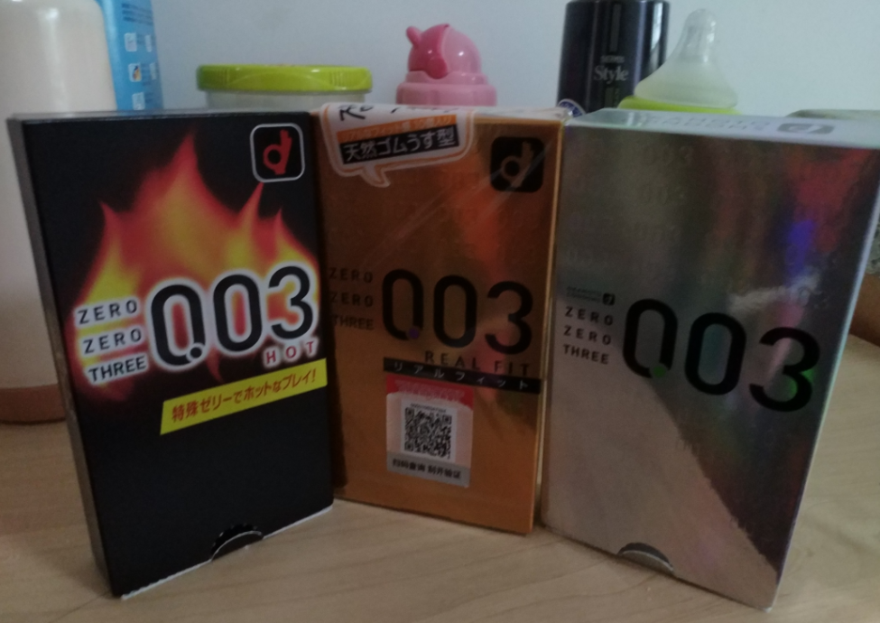
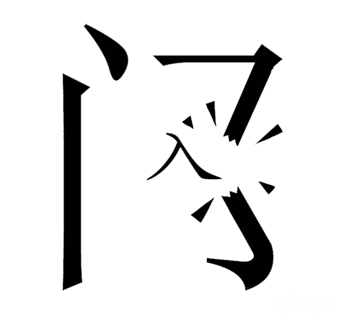

## DBA专供 冈本003系列 - 数据库安全第一,过个好年 
##### [TAG 27](../class/27.md) , [TAG 6](../class/6.md)
                                                                    
### 作者                                                                   
digoal                                                                    
                                                                    
### 日期                                                                  
2016-12-24                                                                     
                                                                    
### 标签                                                                  
PostgreSQL , 闪回 , flash back query , trigger , event trigger , 回收站 , recycle bin , pgtranshcan , hook , _PG_init , 事件触发器 , 审计 , 跟踪 , 逻辑复制 , DDL逻辑复制 , UDR , BDR , 数据库安全              
      
----                                                                  
                                                                    
## 背景     
快过年了，安全第一。先给DBA们的冈本003系列，请收好了，并提前祝大伙们过个好年。   
  
通常数据库在是企业中占据非常重要的位置，既然这么重要，当然要保护好，否则数据库被注入，数据被误删就不好看啦，不仅仅影响业务，还可能造成用户的信息被泄露。  
  
本文本的本意是想写PostgreSQL数据库的某些安全特性的，提起数据库里最常见的操作insert(插入), select(取出)，让我一下子想到了安全套。  
  
不过在DBA的世界里可没有广告词里说的那样    
  
"不是我不小心 只是真情难以抗拒"    
  
出了问题，是要背责任滴，带好安全套是很重要滴（为了减轻小伙伴们的压力，可以适当选择云数据库，比如阿里云RDS PgSQL）。  
  
     
  
为了减轻带套后的不真实感觉，提高品质，尽量选择一款超薄的。  
  
那么接下来我们看看如何打造属于DBA的冈本超薄003系列，你会喜欢什么味的呢？  
  
## 属于DBA的冈本003  
冈本003有很多口味可以选择哦，比如黄金、白金、HOT、多色、芦荟、。。。大伙应该比我懂的。。。。。。  
  
那么PostgreSQL数据库为DBA们准备了哪些体感的呢？  
  
听我娓娓道来。  
  
### 草莓味 - DML+TRUNCATE 闪回  
正如文章开头提到的，数据库是开放给应用程序使用的，但是应用程序本身可能存在漏洞，黑客可以利用应用程序的漏洞，对数据库进行注入。  
  
注入后，数据可能被误插入（INSERT）删除（DELETE）更新（UPDATE）或者（TRUNCATE），那么有了这道功能，我们可以快速的闪回被删除的数据。   
  
     
  
细节见：  
  
[《PostgreSQL 闪回 - flash back query emulate by trigger》](../201408/20140828_01.md)      
  
### 香蕉味 - DDL 回收站  
除了DML语句，黑客当然还可以肆无忌惮的进行DROP操作，即直接把表或者其他对象，那么被删除的表如何能快速的恢复呢？  
  
方法有2  
  
PostgreSQL的事件触发器可以用来保护DBA，防止表被真实的删除，而是放入回收站中。  
  
同时PostgreSQL的钩子特性，允许对PG进行插件化开发，在执行UTITILY QUERY时，触发钩子，被删除的表放入回收站。  
  
所以即使表被删除了，我们也能快速的在回收站将其取出来。  
  
  
  
细节见：  
  
[《PostgreSQL 事件触发器 - PostgreSQL 9.3 Event Trigger》](../201303/20130313_01.md)    
  
[《PostgreSQL 事件触发器 - 实现类似Oracle的回收站功能》](../201504/20150429_01.md)   
  
[《PostgreSQL 回收站功能 - 基于HOOK的recycle bin pgtrashcan》](../201404/20140403_01.md)   
  
事件触发器除了可以用来提供安全套的功能，还能用来进行审计，记录DDL语句从而实现DDL的逻辑复制等功能。  
  
细节见：  
  
[《PostgreSQL 事件触发器 - DDL审计 , DDL逻辑复制 , 打造DDL统一管理入》](../201412/20141211_01.md)    
  
[《PostgreSQL 逻辑复制插件 UDR, 可以愉快的玩类似MySQL的binlog复制了》](../201510/20151010_01.md)   
  
如果用户想实施基于时间点的恢复，那么也是有手段来实现的，是不是很棒呢？    
  
[《PostgreSQL 最佳实践 - pg_rman 以standby为源的备份浅析》](../201608/20160829_02.md)    
  
[《PostgreSQL 最佳实践 - pg_rman 数据库恢复示例 与 软件限制解说》](../201608/20160829_03.md)   
  
### 黄金甲 - 密码防盗防破解  
密码是开启数据库大门的钥匙，如果密码被暴力破解，或者被网络层截获，又或者泄露，是惨不忍睹的。  
  
     
   
如何防止暴力破解呢？PG里面提供了AUTH DELAY的模块，可以防止暴力破解，同时提供了密码的复杂度强制模块，强制了密码的复杂度，提高破解难度。  
  
细节见：  
  
[《PostgreSQL 密码安全指南》](../201410/20141009_01.md)    
  
以及  
  
http://blog.163.com/digoal@126/blog/static/16387704020149852941586/     
  
同时在PG中还提供了其他的认证组件支持，例如在企业中，密码是统一管理的，WINDOWS AD域, LINUX LDAP等。   
  
PostgreSQL可以把认证功能交给这些组件来完成，从而与企业的密码管理完美的结合，  
  
细节见：  
  
[《PostgreSQL Windows AD认证配置》](../201409/20140924_01.md)   
  
[《PostgreSQL LDAP认证之 simple bind配置》](../201406/20140606_02.md)  
  
[《PostgreSQL LDAP认证之 search bind配置》](../201406/20140609_01.md)   
     
### 白金甲 - 传输加密  
此山是我开，此树是我栽，若想从此过，留下买路财。  
  
  
  
数据在运送（传输）过程，一不留神，也可能被黑客盯上，如果你的数据传输不做任何保护就在公网上传输的话，那真的很容易完蛋，被脱裤。  
  
PostgreSQL的传输加密手段，可以将黑客拒之门外，即使被黑客盯上也没关系，被他们截取的都是加密后的数据，是很难破解的。  
  
细节见：  
  
[《PostgreSQL 如何实现网络压缩传输或加密传输(openssl)》](../201305/20130522_01.md)   
  
### 菠萝味 - 数据本身的加密  
一旦数据库被攻破，或者被SQL注入，将数据取走，那么数据就被曝光了。  
  
如何防止脱裤后的安全呢？  
  
这里就涉及到数据存在在数据库中的加密问题，加密后，即使被脱裤，黑客看到的不过是加密后的数据而已，只要加解密的方法没有泄露，黑客也无法获取有用的信息。  
  
将敏感数据加密后存储在数据库中，即使加密数据泄露，只要加解密方法没有泄露，也是相对安全的。    
  
  
    
加解密方法建议放在应用端实现，如果加解密在数据库端实现，用户一旦入侵数据库，更容易破解。（或者加密在数据库端实现，解密在应用程序端实现）   
  
细节见：  
  
http://blog.163.com/digoal@126/blog/static/1638770402013423101455507/   
  
### 水蜜桃味 - 透明加密  
透明加密属于数据库的高端功能，指对应用完全透明的，不需要应用在读取或写入数据时进行加密和解密了。   
  
但是这项技术会给数据库的性能带来一定的损耗，因为它是在数据库端完成的。  
  
比如数据库启动时，传入一个加密的秘钥，存在内存中，后面对数据库中的数据存取都使用这个秘钥进行加解密。  
  
现在比较流行的有数据类型的透明加密，以及块级别的透明加密。  
  
以块加密为例，数据文件如果被恶意拷贝走的话，实际上没有文件的解密秘钥，这堆文件也是没有什么用的。    
  
细节见：  
  
[《PostgreSQL 透明加密(TDE,FDE) - 块级加密》](../201610/20161031_01.md)    
  
https://postgrespro.com/docs/postgresproee/9.6/cfs.html    
  
而数据类型的透明加密则是类型层面的，PostgreSQL的数据类型都有统一的IO标准接口，所以在这方面可以完成透明加解密。  
  
### 青涩味 - 视图安全  
在一些企业的数据库设计中，同一个表可能存储了不同业务的数据，为了防止不同的应用的数据串扰，通常会使用视图来隔离不同的业务访问数据的边界。  
  
比如财务能访问的数据范围是A，HR能访问的数据范围是B，A也许能看到员工的收入情况，但是不能看到员工的一些家庭、手机号等信息。 而B则反之。  
  
但是视图其实是不安全的，黑客可以利用PostgreSQL的优化器原理，创建成本极低的函数，在函数中获取视图限制外的隐藏内容。    
  
  
    
如果用户没有创建函数的权限，用户就无法利用这个原理。    
    
或者使用安全栅栏来弥补。    
    
细节见：  
  
http://blog.163.com/digoal@126/blog/static/163877040201361031431669/    
    
http://blog.163.com/digoal@126/blog/static/163877040201431410032638    
    
或者使用基于安全策略来管理数据可见性。    
    
http://blog.163.com/digoal@126/blog/static/163877040201362402650341/    
    
http://blog.163.com/digoal@126/blog/static/16387704020153984016177/    
  
## 体感大荟萃  
PostgreSQL 能提供的安全手段还很多，对DBA来说是非常实用的。  
  
我整理了一些，大家可以参考一下  
  
  
  
[《PostgreSQL 数据库安全指南》](../201506/20150601_01.md)    
  
[《PostgreSQL cancel 安全漏洞》](../201509/20150925_01.md)     
  
[《Hacking PostgreSQL》](../201610/20161018_02.md)     
  
[《PostgreSQL AWR报告》](../201611/20161123_01.md)  
  
不管你喜欢什么味的，都可以在PostgreSQL中找到。  
  
     
              
              

  
  
  
  
  
  
  
  
## [digoal's 大量PostgreSQL文章入口](https://github.com/digoal/blog/blob/master/README.md "22709685feb7cab07d30f30387f0a9ae")
  
