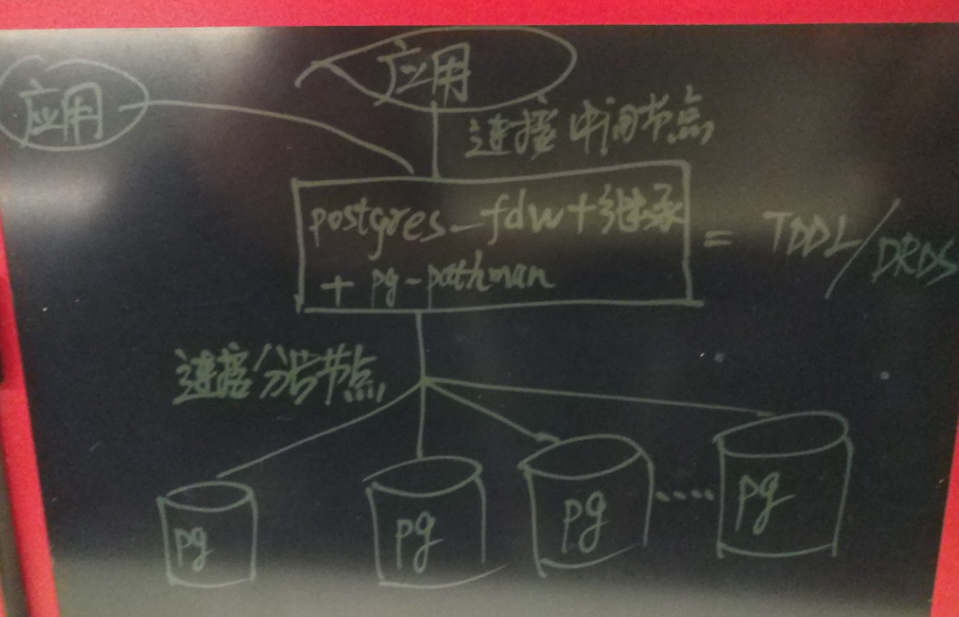

## 恭迎万亿级营销(圈人)潇洒的迈入毫秒时代 - 万亿user_tags级实时推荐系统数据库设计   
##### [TAG 15](../class/15.md)
                                                                        
### 作者                                                                       
digoal                                                                        
                                                                        
### 日期                                                                      
2016-12-25                                                                        
                                                                        
### 标签                                                                      
PostgreSQL , 标签 , 推荐系统 , 实时圈人 , 数组 , gin , gist , 索引 , rum , tsvector , tsquery , 万亿 , user , tag , 淘宝     
          
----                                                                      
              
## 背景    
**我们仅用了PostgreSQL的两个小特性，却解决了业务困扰已久的大问题。**    
  
推荐系统是广告营销平台的奶牛，其核心是精准、实时、高效。     
     
这么多广告平台，到底谁家强？谁的核心牛逼？      
      
1\. 精准，指对用户的描述精准，通常需要基于大量的用户行为数据，经历深度学习后形成的用户画像，或称之为标签系统。 标签的准确性关系到推荐的精准度，比如你可能不会对一个正常的年轻人推荐老花眼镜（当然如果有其他购买意向的标签来指出他有购买老花眼镜的欲望除外）。     
      
2\. 实时，指标签的更新实时性，很多标签是具有非常强的时效性的，比如一次营销的目标人群，又或者用户最近浏览的一些商品可能是有潜在购买欲望的商品，都具备时效性。如果你的标签生成是隔天，或者个很多天的，那么可能已经错过了推荐时机。因此实时性在推荐系统中是非常重要的。     
      
3\. 高效，指基于标签圈人的动作的效率与并发能力，作为购买广告的金主，当然是期望他们拿到数据的速度越快越好。并且会有很多人向你的平台购买广告，这考验的是并发能力。      
      
做到以上三点，这样的广告平台才具备一定的竞争力。     
       
除此之外还需要关注的是平台的成本，包括硬件的成本，开发成本，维护成本等。     
     
下面将以电商的推荐系统为例，介绍推荐系统的数据库设计与优化技巧。     
   
**以及如何让营销潇洒 (低成本，高并发，高效率) 的迈入毫秒时代**。   
      
## 电商推荐系统 部分需求介绍  
比如一家店铺，如何找到它的目标消费群体？     
      
要回答这个问题，首先我们需要收集一些数据，比如：      
     
1\. 这家店铺以及其他的同类店铺的浏览、购买群体。      
        
我们在逛电商时，会产生一些行为的记录，比如在什么时间，逛了哪些店铺，看了哪些商品，最后在哪家店铺购买了什么商品。       
      
然后，对于单个商店来说，有哪些用户逛过他们的商店，购买过哪些商品，可以抽取出一部分人群。      
     
2\. 得到这些用户群体后，筛选出有同类消费欲望、或者具备相同属性的群体。      
      
对这部分人群的属性进行分析，可以获得一个更大范围的群体，从而可以对这部分群体进行营销。       
      
以上是对电商推荐系统的两个简单的推理。     
      
      
      
### 量级  
电商的用户量级，放眼全球，可能会达到几十亿的级别。      
      
店铺数量，放眼全球，可能会达到千万级别。      
      
商品数量（细分种类，比如条形码），放眼全球，可能会达到亿级。      
     
店铺标签数量，针对单个用户而言，逛了哪些店，多少次，看了哪些商品，多少次，买了哪些商品等。通常一个人，在一定的时间范围内，会产生上千的这样的标签。           
     
用户标签，画像，10万级别，这个量级可以描述清楚人的属性。     
     
根据以上的估算，user_tags可能达到万亿（user几十亿, 店铺\商品浏览相关的标签数千级别）的级别。      
     
## 高效设计  
## 数据库设计  
我们首先整理一下关键因素    
     
用户ID、浏览过的店铺 以及浏览次数、浏览过的商品 以及浏览次数、购买的商品 以及购买数量。(次数\数量 可以根据区间，设置为枚举类型，比如0表示100次以下，1表示100到500次，。。。)         
     
这几个要素很容易从用户的行为数据中生成，从而当某家店铺需要做推广，或者针对某个产品做推广时，可以结合这些因素，产生一批目标人群。     
     
比如1周内浏览护手霜相关商品超过10次的人群。     
    
### 表结构设计  
1\. 店铺、商品编成ID     
      
2\. 浏览过多少次、购买了多少某个商品        
      
由于每个用户在某个时间段内，都可能浏览或者购买多个店铺或商品。如果每个商店，每个商品都使用一条记录来存储，会产生很多很多的记录。浪费空间，并且影响查询效率。      
      
PostgreSQL 支持数组类型，可以很好的完成这样的任务，减少存储，同时支持数组索引，提高查询效率。     
     
3\. 表结构如下     
  
3\.1 范围表，约几十或上百条记录  
  
字段和描述  
  
```  
class int,    -- 维度,对应用户标签表的s1,s2,s3,s4
id int,       -- 偏移量(或者叫枚举值)    
description   -- 描述(例如 1-10000,10001-100000，。。。。。)    
```  
  
3\.2 用户标签表  
  
```  
uid int primary key,  -- 用户ID  
s1 int[],  -- 浏览过的店铺以及次数范围(店铺ID哈希 + 范围表id)     
s2 int[],  -- 浏览过的商品以及次数范围(商品ID哈希 + 范围表id)  
s3 int[],  -- 购买的商品以及数量范围(商品ID哈希 + 范围表id)
s4 int[],   -- ....其他维度以此类推 
时间区间1,   -- 比如按天, 每天统计一次，写入该表
```  
     
3\.3 次数阶梯化   
   
浏览次数，购买个数都是连续值，为了更好的进行挖掘，建议将其阶梯化。  
  
对应3\.1的设计，例如1-10000一个阶级，10001-100000又一个阶级。  
   
例子  
  
```
轨迹 s1 对应的阶梯
1 -> 0
2 -> 1-10
3 -> 11-100
4 -> 101-500
5 -> 501-
...
9 -> 10000+
```
  
3\.4 将（商品、店铺ID）与阶梯组合成一个新的值 - 方法1          
     
使用text[]例如 店铺ID:OFFSET 表示。text[]数组效率可能不如整型数组INT[]，空间也比INT[]要大一点。     
     
如果业务方可以容忍，使用text[]开发工作量小点。    
  
例子  
    
userid|s1|s2|s3   
1|{'1:2', '109:9'}|{'2:2', '88:19'}|{'2:1', '88:2'}
  
含义解释:  
  
- 用户ID：1，   
  
- 浏览了店铺1（次数阶梯=2）、店铺109（次数阶梯9），  
  
- 浏览了商品2（次数阶梯=2）、商品88（次数阶梯19），  
   
- 购买了商品2（次数阶梯=1）、商品88（次数阶梯2）。   
   
3\.5 将（商品、店铺ID）与阶梯组合成一个新的值 - 方法2       
  
方法1用了text数组，方法2将使用int/int8数组，效率更高。    
  
要使用一个int/int8新值表达两层含义(原始店铺、商品ID，以及阶梯)，需要公式支持。   
  
公式设计如下，(公式、常量)。    
   
以流量店铺次数(s1)字段为例：   
    
```
新值起始ID = new_start_val = 1                  -- 常量，用户可以自由指定，但是固定下来了就不要变它
对应维度步长(比如流量店铺的阶梯数) = step = 9   -- 常量，用户可以自由指定(每个维度的阶数可以不一样)，但是固定下来了就不要变它
店铺ID = dp_id                                  -- 指原来的店铺ID
int/int8新值 = new_val                          -- 生成的，带有两层含义（店铺ID，阶数）的新值

已知店铺ID求new_val(写入、查询过程):

$new_val = new_start_val + (step+1)*(dp_id-1)

已知new_val求店铺ID(翻译过程):

$dp_id = 1 + (new_val-new_start_val)/(step+1)
```
  
例子(step=19阶, new_start_val=1)  
  
```
浏览店铺ID=1，1阶
浏览店铺ID=192，15阶

根据以上信息、常量、公式 生成new_val数组:  

{1, 3821}

根据以上数组、常量、公式 翻译出店铺ID:  

{1, 192}
```
        
4\. 分区    
    
例如，建议每500万或1000万一个分区，查询时，可以并行查询，提高效率。     
     
如果要快速圈得所有的用户，建议使用并行查询（plproxy，每个分区一个连接，并行查询）。     
     
如果要快速的得到用户，流式返回，建议使用继承（如果是多节点，可以使用postgres_fdw+pg_pathman，或者postgres_fdw+继承），使用游标返回。     
        
### 性能指标  
几十亿用户，每个用户将时间区间的浏览过的店铺、商品、购买过的商品以及数量级聚合成标签化的数组，产生万亿级别的user_tags组合。     
      
根据tags从几十亿的用户群体中圈选人群，能达到什么样的性能呢？     
     
由于使用了索引，如果使用流式返回的话可以控制在10毫秒左右。      
     
是不是顿时觉得分析型的业务进入了毫秒时代？      
     
如果你对PostgreSQL接触不多，可能会感到很惊奇，接触多了就习惯了，PostgreSQL有很多功能会帮你解决很多问题，有时候甚至给你大开脑洞的。    
    
## 实时设计  
前面讲了如何高效的获得用户，接下来我们要看看如何实时的更新TAG了。    
    
### 流处理  
目的是实时的更新用户的TAG，比如一个用户，一天可能产生几万比浏览的跟踪记录，这些记录要合并到他的标签中。     
     
如果活跃用户达到亿级别，那么一天产生的更新流水就达到了万亿级别，这个怎么能实时的在数据库中处理呢？估计很多用户会使用T+1的方式，放弃实时性。     
    
但是实际上，并不是做不到的，比如我们可以使用PostgreSQL数据库的流处理功能来实现这种超高流水的更新。     
     
你可能要疑问了，数据库能处理流吗？数据如何在数据库中完成实时的更新呢?     
     
PostgreSQL社区的一个开源产品pipelinedb，（基于postgresql，与postgresql全兼容），就是用来干这个的，它会帮你实时的进行合并，（用户可以设置合并的时间间隔，或者累计的ROWS变更数）达到阈值后，进行持久化的动作，否则会先持续的在内存中进行更新。     
    
有两篇文章可以参考     
     
[《"物联网"流式处理应用 - 用PostgreSQL实时处理(万亿每天)》](../201512/20151215_01.md)     
     
[《流计算风云再起 - PostgreSQL携PipelineDB力挺IoT》](./20161220_01.md)     
    
当然如果用户没有实时的要求，T+1 就能满足需求的话，你大可不必使用pipelinedb.    
     
### 为什么要在数据库中完成流式处理  
我们知道，标签数据最后都要进到数据库后，才能施展数据库的圈人功能，完成圈人的查询，如果不在数据库中实现流计算，而是使用类似JSTROM的框架的话，实际上是使用JSTROM挡了一层，比如将1000亿次的更新转化成了1亿的更新。  
  
但是使用外部的流处理会引入一些问题  
  
1\. 额外增加了JSTROM所需的计算资源，并行效率实际上还不如pipelinedb  
  
2\. 用户查数据的时效性不如直接放在数据库中的流计算  
  
3\. 增加了开发成本  
  
## 压测  
进入压测环节，我选择了一台32CORE，2块SSD卡，512GB的内存的机器进行压测。     
     
存放3.2亿用户，每个用户4个数组字段，每个字段包括1000个元素，即4000*3.2亿 = 1.28万亿 user_tags。     
     
### 用例1  
10张表，每张表存储1000万用户，4个标签字段，使用tsvector存储标签。     
     
使用rum索引。    
     
```  
postgres=# create tablespace tbs1 location '/u01/digoal/tbs1';  
CREATE TABLESPACE  
  
postgres=# create tablespace tbs2 location '/u02/digoal/tbs2';  
CREATE TABLESPACE  
  
do language plpgsql $$  
declare  
  i int;  
  suffix text;  
  tbs text;  
begin  
  for i in 0..10 loop  
    if i=0 then  
      suffix := '';  
      tbs := 'tbs1';  
    elsif i >=1 and i<=5 then  
      suffix := i::text;  
      tbs := 'tbs1';  
    else  
      suffix := i::text;  
      tbs := 'tbs2';  
    end if;  
    if i=0 then  
      execute 'create unlogged table test'||suffix||'(uid int primary key USING INDEX TABLESPACE '||tbs||', s1 tsvector, s2 tsvector, s3 tsvector, s4 tsvector) with (autovacuum_enabled=off, toast.autovacuum_enabled=off) tablespace '||tbs;  
    else  
      execute 'create unlogged table test'||suffix||'(uid int primary key USING INDEX TABLESPACE '||tbs||', s1 tsvector, s2 tsvector, s3 tsvector, s4 tsvector) inherits(test) with (autovacuum_enabled=off, toast.autovacuum_enabled=off) tablespace '||tbs;  
    end if;  
    execute 'create index idx_test'||suffix||'_s1 on test'||suffix||' using rum(s1 rum_tsvector_ops) tablespace '||tbs;  
    execute 'create index idx_test'||suffix||'_s2 on test'||suffix||' using rum(s2 rum_tsvector_ops) tablespace '||tbs;  
    execute 'create index idx_test'||suffix||'_s3 on test'||suffix||' using rum(s3 rum_tsvector_ops) tablespace '||tbs;   
    execute 'create index idx_test'||suffix||'_s4 on test'||suffix||' using rum(s4 rum_tsvector_ops) tablespace '||tbs;  
  end loop;  
end;  
$$;  
  
select relname,reltablespace from pg_class  where relname ~ 'test' order by 2,1;  
```  
    
产生测试数据的脚本    
    
```  
vi test.sql  
  
\set uid1 random(1,10000000)  
\set uid2 random(10000001,20000000)  
\set uid3 random(20000001,30000000)  
\set uid4 random(30000001,40000000)  
\set uid5 random(40000001,50000000)  
\set uid6 random(50000001,60000000)  
\set uid7 random(60000001,70000000)  
\set uid8 random(70000001,80000000)  
\set uid9 random(80000001,90000000)  
\set uid10 random(90000001,100000000)  
insert into test1 (uid,s1,s2,s3,s4) select :uid1+id, (select array_to_tsvector(array_agg(trunc(5000000*random())||'_'||trunc(20*random()))) from generate_series(1,1000)),(select array_to_tsvector(array_agg(trunc(5000000*random())||'_'||trunc(20*random()))) from generate_series(1,1000)),(select array_to_tsvector(array_agg(trunc(5000000*random())||'_'||trunc(20*random()))) from generate_series(1,1000)),(select array_to_tsvector(array_agg(trunc(5000000*random())||'_'||trunc(20*random()))) from generate_series(1,1000)) from generate_series(1,1000) t(id) on conflict do nothing;  
insert into test2 (uid,s1,s2,s3,s4) select :uid2+id, (select array_to_tsvector(array_agg(trunc(5000000*random())||'_'||trunc(20*random()))) from generate_series(1,1000)),(select array_to_tsvector(array_agg(trunc(5000000*random())||'_'||trunc(20*random()))) from generate_series(1,1000)),(select array_to_tsvector(array_agg(trunc(5000000*random())||'_'||trunc(20*random()))) from generate_series(1,1000)),(select array_to_tsvector(array_agg(trunc(5000000*random())||'_'||trunc(20*random()))) from generate_series(1,1000)) from generate_series(1,1000) t(id) on conflict do nothing;  
insert into test3 (uid,s1,s2,s3,s4) select :uid3+id, (select array_to_tsvector(array_agg(trunc(5000000*random())||'_'||trunc(20*random()))) from generate_series(1,1000)),(select array_to_tsvector(array_agg(trunc(5000000*random())||'_'||trunc(20*random()))) from generate_series(1,1000)),(select array_to_tsvector(array_agg(trunc(5000000*random())||'_'||trunc(20*random()))) from generate_series(1,1000)),(select array_to_tsvector(array_agg(trunc(5000000*random())||'_'||trunc(20*random()))) from generate_series(1,1000)) from generate_series(1,1000) t(id) on conflict do nothing;  
insert into test4 (uid,s1,s2,s3,s4) select :uid4+id, (select array_to_tsvector(array_agg(trunc(5000000*random())||'_'||trunc(20*random()))) from generate_series(1,1000)),(select array_to_tsvector(array_agg(trunc(5000000*random())||'_'||trunc(20*random()))) from generate_series(1,1000)),(select array_to_tsvector(array_agg(trunc(5000000*random())||'_'||trunc(20*random()))) from generate_series(1,1000)),(select array_to_tsvector(array_agg(trunc(5000000*random())||'_'||trunc(20*random()))) from generate_series(1,1000)) from generate_series(1,1000) t(id) on conflict do nothing;  
insert into test5 (uid,s1,s2,s3,s4) select :uid5+id, (select array_to_tsvector(array_agg(trunc(5000000*random())||'_'||trunc(20*random()))) from generate_series(1,1000)),(select array_to_tsvector(array_agg(trunc(5000000*random())||'_'||trunc(20*random()))) from generate_series(1,1000)),(select array_to_tsvector(array_agg(trunc(5000000*random())||'_'||trunc(20*random()))) from generate_series(1,1000)),(select array_to_tsvector(array_agg(trunc(5000000*random())||'_'||trunc(20*random()))) from generate_series(1,1000)) from generate_series(1,1000) t(id) on conflict do nothing;  
insert into test6 (uid,s1,s2,s3,s4) select :uid6+id, (select array_to_tsvector(array_agg(trunc(5000000*random())||'_'||trunc(20*random()))) from generate_series(1,1000)),(select array_to_tsvector(array_agg(trunc(5000000*random())||'_'||trunc(20*random()))) from generate_series(1,1000)),(select array_to_tsvector(array_agg(trunc(5000000*random())||'_'||trunc(20*random()))) from generate_series(1,1000)),(select array_to_tsvector(array_agg(trunc(5000000*random())||'_'||trunc(20*random()))) from generate_series(1,1000)) from generate_series(1,1000) t(id) on conflict do nothing;  
insert into test7 (uid,s1,s2,s3,s4) select :uid7+id, (select array_to_tsvector(array_agg(trunc(5000000*random())||'_'||trunc(20*random()))) from generate_series(1,1000)),(select array_to_tsvector(array_agg(trunc(5000000*random())||'_'||trunc(20*random()))) from generate_series(1,1000)),(select array_to_tsvector(array_agg(trunc(5000000*random())||'_'||trunc(20*random()))) from generate_series(1,1000)),(select array_to_tsvector(array_agg(trunc(5000000*random())||'_'||trunc(20*random()))) from generate_series(1,1000)) from generate_series(1,1000) t(id) on conflict do nothing;  
insert into test8 (uid,s1,s2,s3,s4) select :uid8+id, (select array_to_tsvector(array_agg(trunc(5000000*random())||'_'||trunc(20*random()))) from generate_series(1,1000)),(select array_to_tsvector(array_agg(trunc(5000000*random())||'_'||trunc(20*random()))) from generate_series(1,1000)),(select array_to_tsvector(array_agg(trunc(5000000*random())||'_'||trunc(20*random()))) from generate_series(1,1000)),(select array_to_tsvector(array_agg(trunc(5000000*random())||'_'||trunc(20*random()))) from generate_series(1,1000)) from generate_series(1,1000) t(id) on conflict do nothing;  
insert into test9 (uid,s1,s2,s3,s4) select :uid9+id, (select array_to_tsvector(array_agg(trunc(5000000*random())||'_'||trunc(20*random()))) from generate_series(1,1000)),(select array_to_tsvector(array_agg(trunc(5000000*random())||'_'||trunc(20*random()))) from generate_series(1,1000)),(select array_to_tsvector(array_agg(trunc(5000000*random())||'_'||trunc(20*random()))) from generate_series(1,1000)),(select array_to_tsvector(array_agg(trunc(5000000*random())||'_'||trunc(20*random()))) from generate_series(1,1000)) from generate_series(1,1000) t(id) on conflict do nothing;  
insert into test10 (uid,s1,s2,s3,s4) select :uid10+id, (select array_to_tsvector(array_agg(trunc(5000000*random())||'_'||trunc(20*random()))) from generate_series(1,1000)),(select array_to_tsvector(array_agg(trunc(5000000*random())||'_'||trunc(20*random()))) from generate_series(1,1000)),(select array_to_tsvector(array_agg(trunc(5000000*random())||'_'||trunc(20*random()))) from generate_series(1,1000)),(select array_to_tsvector(array_agg(trunc(5000000*random())||'_'||trunc(20*random()))) from generate_series(1,1000)) from generate_series(1,1000) t(id) on conflict do nothing;  
  
  
nohup pgbench -M prepared -n -r -P 1 -f ./test.sql -c 64 -j 64 -T 1000000 >/dev/null 2>&1 &  
```  
    
标签由500万个唯一ID+20个唯一ID的组合过程，每个tsvector中存放1000个这样的组合。    
  
### 用例2  
10张表，每张表存储1000万用户，4个标签字段，使用text[]存储标签。     
    
索引使用的是GIN索引，其他与用例1一致。     
  
```  
do language plpgsql $$  
declare  
  i int;  
  suffix text;  
  tbs text;  
begin  
  for i in 0..10 loop  
    if i=0 then  
      suffix := '';  
      tbs := 'tbs1';  
    elsif i >=1 and i<=5 then  
      suffix := i::text;  
      tbs := 'tbs1';  
    else  
      suffix := i::text;  
      tbs := 'tbs2';  
    end if;  
    if i=0 then  
      execute 'create unlogged table test'||suffix||'(uid int primary key USING INDEX TABLESPACE '||tbs||', s1 text[], s2 text[], s3 text[], s4 text[]) with (autovacuum_enabled=off, toast.autovacuum_enabled=off) tablespace '||tbs;  
    else  
      execute 'create unlogged table test'||suffix||'(uid int primary key USING INDEX TABLESPACE '||tbs||', s1 text[], s2 text[], s3 text[], s4 text[]) inherits(test) with (autovacuum_enabled=off, toast.autovacuum_enabled=off) tablespace '||tbs;  
    end if;  
    execute 'create index idx_test'||suffix||'_s1 on test'||suffix||' using gin(s1 ) tablespace '||tbs;  
    execute 'create index idx_test'||suffix||'_s2 on test'||suffix||' using gin(s2 ) tablespace '||tbs;  
    execute 'create index idx_test'||suffix||'_s3 on test'||suffix||' using gin(s3 ) tablespace '||tbs;   
    execute 'create index idx_test'||suffix||'_s4 on test'||suffix||' using gin(s4 ) tablespace '||tbs;  
  end loop;  
end;  
$$;  
  
select relname,reltablespace from pg_class  where relname ~ 'test' order by 2,1;  
```  
    
### 用例3以及压测  
64张分区表，每个分区500万记录，使用int数组存储标签，标签总量400万，每个用户4000个随机标签，确保圈人时可以圈到足够多的人群。     
     
同样使用GIN索引圈人。    
  
```  
alter role postgres set gin_pending_list_limit='128MB';  
  
do language plpgsql $$  
declare  
  i int;  
  suffix text;  
  tbs text;  
begin  
  for i in 0..64 loop  
    if i=0 then  
      suffix := '';  
      tbs := 'tbs1';  
    elsif i >=1 and i<=32 then  
      suffix := i::text;  
      tbs := 'tbs1';  
    else  
      suffix := i::text;  
      tbs := 'tbs2';  
    end if;  
    if i=0 then  
      execute 'create unlogged table test'||suffix||'(uid int primary key USING INDEX TABLESPACE '||tbs||', s1 int[], s2 int[], s3 int[], s4 int[]) with (autovacuum_enabled=off, toast.autovacuum_enabled=off) tablespace '||tbs;  
    else  
      execute 'create unlogged table test'||suffix||'(uid int primary key USING INDEX TABLESPACE '||tbs||', s1 int[], s2 int[], s3 int[], s4 int[]) inherits(test) with (autovacuum_enabled=off, toast.autovacuum_enabled=off) tablespace '||tbs;  
    end if;  
    execute 'create index idx_test'||suffix||'_s1 on test'||suffix||' using gin(s1 ) tablespace '||tbs;  
    execute 'create index idx_test'||suffix||'_s2 on test'||suffix||' using gin(s2 ) tablespace '||tbs;  
    execute 'create index idx_test'||suffix||'_s3 on test'||suffix||' using gin(s3 ) tablespace '||tbs;   
    execute 'create index idx_test'||suffix||'_s4 on test'||suffix||' using gin(s4 ) tablespace '||tbs;  
  end loop;  
end;  
$$;  
  
select relname,reltablespace from pg_class  where relname ~ 'test' order by 2,1;  
```  
    
生成测试数据的脚本    
    
```  
vi test1.sh  
  
for ((i=1;i<=64;i++))  
do  
echo "\set uid random($((($i-1)*5000000+1)),$(($i*5000000)))" > test$i.sql  
  
echo "insert into test$i (uid,s1,s2,s3,s4) select :uid, (select array_agg(trunc(random()*4000000)) from generate_series(1,1000)) s1,(select array_agg(trunc(random()*4000000)) from generate_series(1,1000)) s2,(select array_agg(trunc(random()*4000000)) from generate_series(1,1000)) s3, (select array_agg(trunc(random()*4000000)) from generate_series(1,1000)) s4 on conflict do nothing;" >> test$i.sql  
  
done  
  
. ./test1.sh  
```  
    
开始生成测试数据    
    
```  
vi test2.sh  
  
for ((i=1;i<=64;i++))  
do  
nohup pgbench -M prepared -n -r -P 1 -f ./test$i.sql -c 1 -j 1 -T 1000000 >/dev/null 2>&1 &  
done  
  
. ./test2.sh  
```  
     
输出插完后将pengding list 合并  
  
执行vacuum analyze或gin_clean_pending_list即可，参考    
  
https://www.postgresql.org/docs/9.6/static/functions-admin.html#FUNCTIONS-ADMIN-INDEX  
  
https://www.postgresql.org/docs/9.6/static/sql-vacuum.html  
  
https://www.postgresql.org/docs/9.6/static/gin-implementation.html#GIN-FAST-UPDATE  
  
  
### 圈人需求 - 性能测试  
对用例3进行压测  
  
1\. 圈人，10毫秒以内完成。     
  
比如查找s1包含3, s2包含4的人群  
   
```
postgres=# begin;
BEGIN
Time: 0.030 ms
postgres=# declare a cursor for select uid from test where s1 @> array[1] and s2 @> array[4];
DECLARE CURSOR
Time: 6.679 ms
postgres=# fetch 100 in a;
    uid    
-----------
  19246842
 118611240
 148504032
 185844649
(4 rows)
Time: 101.041 ms
```
  
这个人群太少，没有代表性，我们找一个人群多一点的   
  
```
postgres=# begin;
BEGIN
postgres=# declare a cursor for select uid from test where s1 @> array[1] or s2 @> array[4];
DECLARE CURSOR
Time: 3.484 ms
postgres=# fetch 100 in a;
   uid   
---------
 2911941
 2373506
 .....
   29713
 3353782
 2836804
 1602067
(100 rows)
Time: 3.892 ms

postgres=# fetch 100 in a;
   uid   
---------
  384170
 1332271
 4282941
 ......
 1190946
 4524861
 1110635
(100 rows)
Time: 4.005 ms
```
    
2\. 分页，前面已经提到了，使用游标。      
    
3\. 流式返回，前面的例子已经提到了。      
  
4\. 并行批量返回    
   
并行批量返回，可以使用plproxy插件，为每个分区指定一个并行，从而实现并行的批量返回。效果能好到什么程度呢？   
   
比如串行查询，所有的分片表是依次查询的，所以累加的时间比较长，例如，圈出15221个人，耗时113毫秒。       
  
```
postgres=# explain (analyze,verbose,timing,costs,buffers) select uid from test where s1 @> array[1];
                                                              QUERY PLAN                                                               
---------------------------------------------------------------------------------------------------------------------------------------
 Append  (cost=0.00..233541.24 rows=206876 width=4) (actual time=0.081..108.037 rows=15221 loops=1)
   Buffers: shared hit=60641
   ->  Seq Scan on public.test  (cost=0.00..0.00 rows=1 width=4) (actual time=0.001..0.001 rows=0 loops=1)
         Output: test.uid
         Filter: (test.s1 @> '{1}'::integer[])
   ->  Bitmap Heap Scan on public.test1  (cost=33.71..2901.56 rows=3188 width=4) (actual time=0.078..0.381 rows=242 loops=1)
         Output: test1.uid
         Recheck Cond: (test1.s1 @> '{1}'::integer[])
         Heap Blocks: exact=238
         Buffers: shared hit=243
         ->  Bitmap Index Scan on idx_test1_s1  (cost=0.00..32.91 rows=3188 width=0) (actual time=0.049..0.049 rows=242 loops=1)
               Index Cond: (test1.s1 @> '{1}'::integer[])
               Buffers: shared hit=5

...中间省略62个表

   ->  Bitmap Heap Scan on public.test64  (cost=34.00..2935.31 rows=3225 width=4) (actual time=0.068..0.327 rows=214 loops=1)
         Output: test64.uid
         Recheck Cond: (test64.s1 @> '{1}'::integer[])
         Heap Blocks: exact=211
         Buffers: shared hit=216
         ->  Bitmap Index Scan on idx_test64_s1  (cost=0.00..33.19 rows=3225 width=0) (actual time=0.041..0.041 rows=214 loops=1)
               Index Cond: (test64.s1 @> '{1}'::integer[])
               Buffers: shared hit=5
 Planning time: 2.016 ms
 Execution time: 109.400 ms
(519 rows)
Time: 113.216 ms
```
   
而并行查询的性能则相当于单个分区的耗时, 约0.几毫秒。   
    
```
postgres=# explain (analyze,verbose,timing,costs,buffers) select uid from test1 where s1 @> array[1];
                                                        QUERY PLAN                                                         
---------------------------------------------------------------------------------------------------------------------------
 Bitmap Heap Scan on public.test1  (cost=33.71..2901.56 rows=3188 width=4) (actual time=0.085..0.383 rows=242 loops=1)
   Output: uid
   Recheck Cond: (test1.s1 @> '{1}'::integer[])
   Heap Blocks: exact=238
   Buffers: shared hit=243
   ->  Bitmap Index Scan on idx_test1_s1  (cost=0.00..32.91 rows=3188 width=0) (actual time=0.051..0.051 rows=242 loops=1)
         Index Cond: (test1.s1 @> '{1}'::integer[])
         Buffers: shared hit=5
 Planning time: 0.097 ms
 Execution time: 0.423 ms
(10 rows)
Time: 1.011 ms
```
     
使用并行，可以大幅提升整体的性能。   
   
参考文档  
    
[《使用Plproxy设计PostgreSQL分布式数据库》](../201005/20100511_01.md)   
  
[《A Smart PostgreSQL extension plproxy 2.2 practices》](../201110/20111025_01.md)    
  
[《PostgreSQL 最佳实践 - 水平分库(基于plproxy)》](../201608/20160824_02.md)   
    
而如果你需要的是流式返回，则没有必要使用并行。   
    
### sharding  
当用户数达到几十亿时，我们可以按用户ID进行分片，使用多台主机。     
  
当然了，如果你的主机空间足够大，CPU核心足够多，可以满足业务的需求的话，完全没有必要使用多台主机。  
  
如果要使用多台主机，有哪些方法呢? 可以参考如下文章，也很简单，几步完成   
   
你就把postgres_fdw节点当成MySQL的TDDL或者DRDS就好了，支持跨节点JOIN，条件，排序，聚合 的下推等，用起来和TDDL DRDS一样的爽。   
  
postgres_fdw是无状态的，仅仅存储结构（分发规则），所以postgres_fdw节点本身也可以非常方便的横向扩展。   
   
  
    
[《PostgreSQL 9.6 单元化,sharding (based on postgres_fdw) - 内核层支持前传》](../201610/20161004_01.md)    
    
[《PostgreSQL 9.6 sharding + 单元化 (based on postgres_fdw) 最佳实践 - 通用水平分库场景设计与实践》](../201610/20161005_01.md)     
    
[《PostgreSQL 9.6 sharding based on FDW & pg_pathman》](../201610/20161027_01.md)    
    
[《PostgreSQL 9.5+ 高效分区表实现 - pg_pathman》](../201610/20161024_01.md)      
    
## 基于位置圈人的需求与性能
这个需求直接落入PostgreSQL的怀抱，其实就是基于位置的KNN查询，PostgreSQL可以通过GiST索引来支撑这个需求。     
    
在数据分片后，PostgreSQL通过归并排序，依旧可以快速的得到结果。     
     
例如，  
  
```
postgres=# explain (analyze,verbose,timing,costs,buffers) select * from t order by id limit 10;
                                                              QUERY PLAN                                                               
---------------------------------------------------------------------------------------------------------------------------------------
 Limit  (cost=0.72..1.13 rows=10 width=4) (actual time=0.158..0.165 rows=10 loops=1)
   Output: t.id
   Buffers: shared hit=3 read=4
   ->  Merge Append  (cost=0.72..819.74 rows=20001 width=4) (actual time=0.157..0.162 rows=10 loops=1)
         Sort Key: t.id
         Buffers: shared hit=3 read=4
         ->  Index Only Scan using idx on public.t  (cost=0.12..2.14 rows=1 width=4) (actual time=0.003..0.003 rows=0 loops=1)
               Output: t.id
               Heap Fetches: 0
               Buffers: shared hit=1
         ->  Index Only Scan using idx1 on public.t1  (cost=0.29..225.28 rows=10000 width=4) (actual time=0.107..0.107 rows=6 loops=1)
               Output: t1.id
               Heap Fetches: 6
               Buffers: shared hit=1 read=2
         ->  Index Only Scan using idx2 on public.t2  (cost=0.29..225.28 rows=10000 width=4) (actual time=0.043..0.044 rows=5 loops=1)
               Output: t2.id
               Heap Fetches: 5
               Buffers: shared hit=1 read=2
 Planning time: 0.181 ms
 Execution time: 0.219 ms
(20 rows)

postgres=# explain (analyze,verbose,timing,costs,buffers) select * from t order by id ;
                                                             QUERY PLAN                                                              
-------------------------------------------------------------------------------------------------------------------------------------
 Merge Append  (cost=0.72..819.74 rows=20001 width=4) (actual time=0.043..10.324 rows=20000 loops=1)
   Sort Key: t.id
   Buffers: shared hit=149
   ->  Index Only Scan using idx on public.t  (cost=0.12..2.14 rows=1 width=4) (actual time=0.004..0.004 rows=0 loops=1)
         Output: t.id
         Heap Fetches: 0
         Buffers: shared hit=1
   ->  Index Only Scan using idx1 on public.t1  (cost=0.29..225.28 rows=10000 width=4) (actual time=0.021..3.266 rows=10000 loops=1)
         Output: t1.id
         Heap Fetches: 10000
         Buffers: shared hit=74
   ->  Index Only Scan using idx2 on public.t2  (cost=0.29..225.28 rows=10000 width=4) (actual time=0.017..3.309 rows=10000 loops=1)
         Output: t2.id
         Heap Fetches: 10000
         Buffers: shared hit=74
 Planning time: 0.175 ms
 Execution time: 11.791 ms
(17 rows)
```
    
[《PostgreSQL 百亿地理位置数据 近邻查询性能》](https://yq.aliyun.com/articles/2999)  
    
12Core的机器，每次请求约0.8毫秒返回，TPS约8万。  
   
## 小结  
回到圈人系统的三个核心问题，  
  
精准，本文未涉及，属于数据挖掘系统的事情，我们可以在下一篇文章介绍（使用PostgreSQL, Greenplum 的 MADlib机器学习库）。     
  
实时，实时的更新标签，本文已给出了在数据库中进行流式处理的解决方案，相比外部流处理的方案，节约资源，减少开发成本，提高开发效率，提高时效性。     
  
高效，相比传统的方案，使用PostgreSQL以及数组的GIN索引功能，实现了本文在万亿USER_TAGS的情况下的毫秒级别的圈人功能。  
  
## 其他相关文章  
  
[《"物联网"流式处理应用 - 用PostgreSQL实时处理(万亿每天)》](../201512/20151215_01.md)     
    
[《为了部落 - 如何通过PostgreSQL基因配对，产生优良下一代》](../201606/20160621_01.md)    
    
[《流计算风云再起 - PostgreSQL携PipelineDB力挺IoT》](./20161220_01.md)     
    
[《分析加速引擎黑科技 - LLVM、列存、多核并行、算子复用 大联姻 - 一起来开启PostgreSQL的百宝箱》](./20161216_01.md)    
    
[《金融风控、公安刑侦、社会关系、人脉分析等需求分析与数据库实现 - PostgreSQL图数据库场景应用》](./20161213_01.md)     
    
[《实时数据交换平台 - BottledWater-pg with confluent》](./20161205_02.md)     
    
[《PostgreSQL 在视频、图片去重，图像搜索业务中的应用》](../201611/20161126_01.md)    
    
[《基于 阿里云 RDS PostgreSQL 打造实时用户画像推荐系统》](../201610/20161021_01.md)    
    
[《PostgreSQL 与 12306 抢火车票的思考》](../201611/20161124_02.md)     
    
[《门禁广告销售系统需求剖析 与 PostgreSQL数据库实现》](../201611/20161124_01.md)    
    
[《聊一聊双十一背后的技术 - 物流、动态路径规划》](../201611/20161114_01.md)      
    
[《聊一聊双十一背后的技术 - 分词和搜索》](../201611/20161115_01.md)      
    
[《聊一聊双十一背后的技术 - 不一样的秒杀技术, 裸秒》](../201611/20161117_01.md)      
    
[《聊一聊双十一背后的技术 - 毫秒分词算啥, 试试正则和相似度》](../201611/20161118_01.md)      
    
[《PostgreSQL 9.6 引领开源数据库攻克多核并行计算难题》](../201610/20161001_01.md)     
    
[《PostgreSQL 前世今生》](../201609/20160929_02.md)      
    
[《如何建立GIS测试环境 - 将openstreetmap的样本数据导入PostgreSQL PostGIS库》](../201609/20160906_01.md)      
    
[《PostgreSQL 9.6 单元化,sharding (based on postgres_fdw) - 内核层支持前传》](../201610/20161004_01.md)    
    
[《PostgreSQL 9.6 sharding + 单元化 (based on postgres_fdw) 最佳实践 - 通用水平分库场景设计与实践》](../201610/20161005_01.md)     
    
[《PostgreSQL 9.6 sharding based on FDW & pg_pathman》](../201610/20161027_01.md)    
    
[《PostgreSQL 9.5+ 高效分区表实现 - pg_pathman》](../201610/20161024_01.md)      
    
[《PostgreSQL 数据库安全指南》](../201506/20150601_01.md)     
    
[《PostgreSQL 9.6 黑科技 bloom 算法索引，一个索引支撑任意列组合查询》](../201605/20160523_01.md)     
    
[《PostgreSQL 使用递归SQL 找出数据库对象之间的依赖关系》](../201607/20160725_01.md)     
    
[《用PostgreSQL描绘人生的高潮、尿点、低谷 - 窗口/帧 or 斜率/导数/曲率/微积分?》](./20161203_01.md)     
    
[《用PostgreSQL找回618秒逝去的青春 - 递归收敛优化》](./20161201_01.md)     
    
[《PostGIS 在 O2O应用中的优势》](https://yq.aliyun.com/articles/50922)      
      
[《PostgreSQL 百亿地理位置数据 近邻查询性能》](https://yq.aliyun.com/articles/2999)    
  
[《使用Plproxy设计PostgreSQL分布式数据库》](../201005/20100511_01.md)   
  
[《A Smart PostgreSQL extension plproxy 2.2 practices》](../201110/20111025_01.md)    
  
[《PostgreSQL 最佳实践 - 水平分库(基于plproxy)》](../201608/20160824_02.md)   
   
  
<a rel="nofollow" href="http://info.flagcounter.com/h9V1"  ></a>  
  
  
  
  
  
  
## [digoal's 大量PostgreSQL文章入口](https://github.com/digoal/blog/blob/master/README.md "22709685feb7cab07d30f30387f0a9ae")
  
