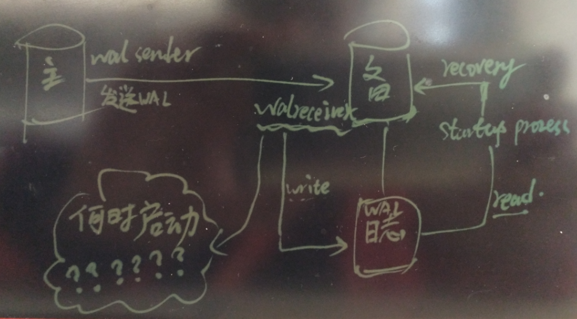
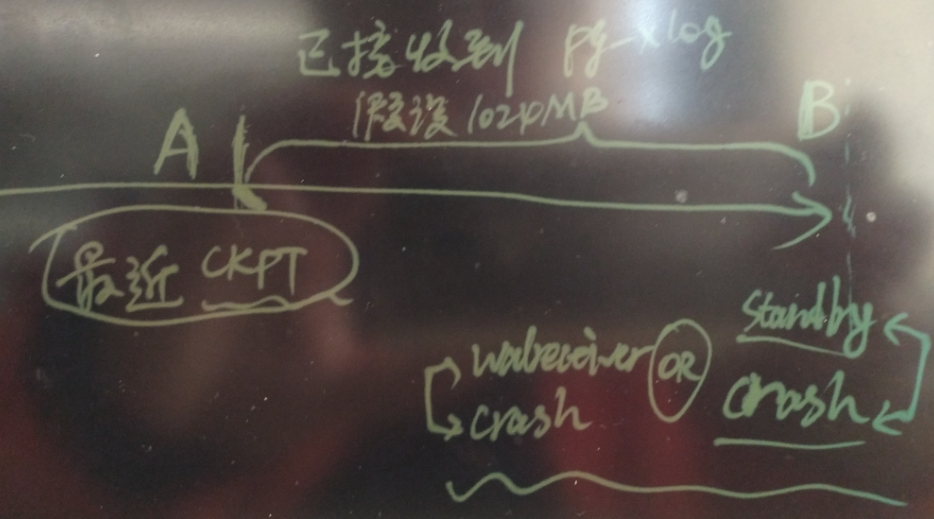
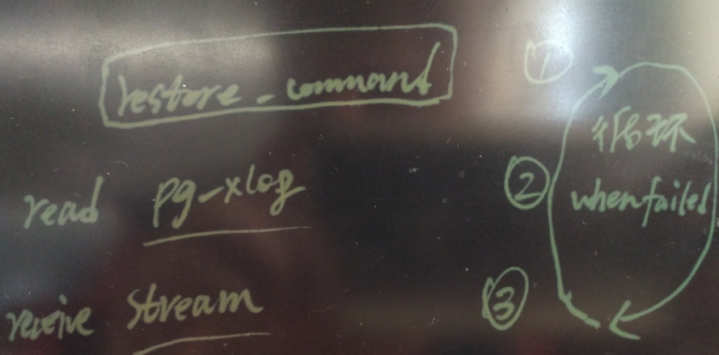
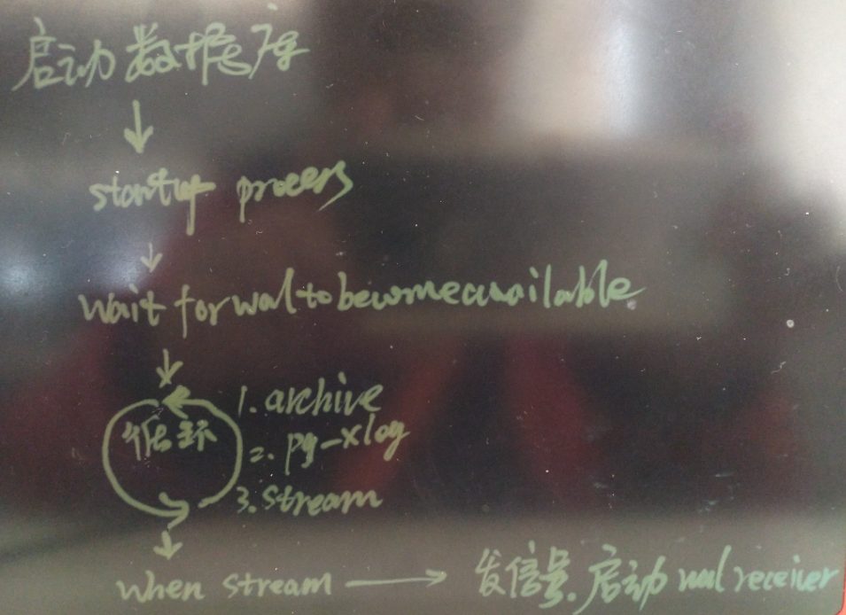
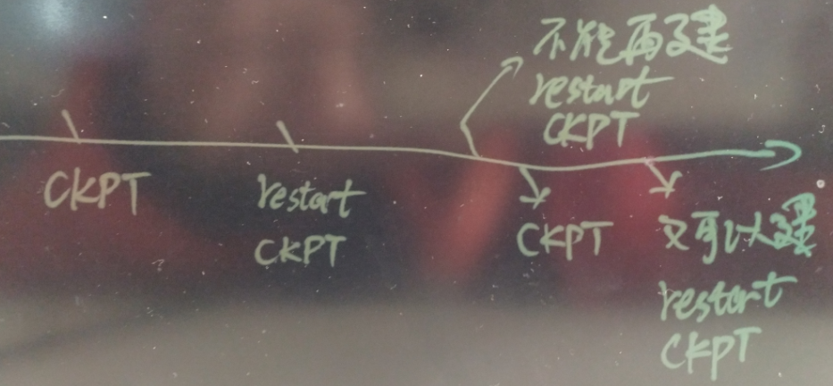

## PostgreSQL standby recover的源码分析 (walreceiver唤醒时机？ 为什么standby crash后walreceiver不会立即被唤醒?)          
                                                                                      
### 作者                                                                                     
digoal                                                                                      
                                                                                      
### 日期                                                                                    
2016-12-29                                                                                      
                                                                                      
### 标签                                                                                    
PostgreSQL , 流复制 , stream replication , wal receiver , 唤醒时机 , 状态机                                      
                        
----                                                                                    
                            
## 背景            
前段时间有位网友提的问题，  
  
当PostgreSQL数据库的standby节点crash后再启动，发现standby节点的wal receiver进程很久才启动并开始从主节点接收WAL。  
  
这段时间是在等待standby节点恢复pg_xlog目录中已有的xlog日志。  
  
    
  
这是为什么呢？  
  
## 数据库crash后从哪个WAL位置开始恢复  
PostgreSQL在crash后，需要从最近的一个检查点开始恢复，因为在每次检查点(如果是standby可能称为restart CKPT)开始后，发生变更的块都会记录对应的FULL PAGE到WAL日志文件中，从检查点恢复，可以保证不会因为操作系统的partial write 导致数据块的不一致。     
  
    
    
对于standby节点也是一样的，启动时，从最近的一次检查点开始恢复，它可以选择CKPT或者RESTART CKPT开始恢复，选最近的即可。  
  
在standby上也可以创建检查点（称为restart ckpt），后面会讲到。  
  
这里只解释了一个问题，就是数据库CRASH后从哪里开始恢复，还有一个问题没搞明白？  
  
为什么wal receiver进程很久才启动并开始从主节点接收WAL？    
  
## 什么时候启动wal receiver进程  
得先讲讲数据库有几种恢复来源：  
  
```  
/*  
 * Codes indicating where we got a WAL file from during recovery, or where  
 * to attempt to get one.  
 */  
typedef enum  
{  
        XLOG_FROM_ANY = 0,                      /* request to read WAL from any source */  
        XLOG_FROM_ARCHIVE,                      /* restored using restore_command */  
        XLOG_FROM_PG_XLOG,                      /* existing file in pg_xlog */  
        XLOG_FROM_STREAM                        /* streamed from master */  
} XLogSource;  
```  
  
3种恢复来源，  
  
restore_command@recovery.conf , $PGDATA/pg_xlog , 以及wal receiver 。     
     
然后我们再分析一下，它如何选择恢复来源的？  
  
1\. 首先会找pg_xlog目录有没有需要的日志（包括TLI），如果有，会从日志目录中直接读取pg_xlog进行恢复，直到PG_XLOG目录中没有需要的文件，则会将source置为下一个可用的source。  
  
2\. 当SOURCE=stream时，并且wal receiver进程没有启动时，发信号启动它。  
  
3\. 如果stream失败，会重新扫描tli，然后等待wal_retrieve_retry_interval这个时间间隔，  
  
循环往复。  
  
    
  
代码详见  
  
```  
/*  
 * Open the WAL segment containing WAL position 'RecPtr'.  
 *  
 * The segment can be fetched via restore_command, or via walreceiver having  
 * streamed the record, or it can already be present in pg_xlog. Checking  
 * pg_xlog is mainly for crash recovery, but it will be polled in standby mode  
 * too, in case someone copies a new segment directly to pg_xlog. That is not  
 * documented or recommended, though.  
 *  
 * If 'fetching_ckpt' is true, we're fetching a checkpoint record, and should  
 * prepare to read WAL starting from RedoStartLSN after this.  
 *  
 * 'RecPtr' might not point to the beginning of the record we're interested  
 * in, it might also point to the page or segment header. In that case,  
 * 'tliRecPtr' is the position of the WAL record we're interested in. It is  
 * used to decide which timeline to stream the requested WAL from.  
 *  
 * If the record is not immediately available, the function returns false  
 * if we're not in standby mode. In standby mode, waits for it to become  
 * available.  
 *  
 * When the requested record becomes available, the function opens the file  
 * containing it (if not open already), and returns true. When end of standby  
 * mode is triggered by the user, and there is no more WAL available, returns  
 * false.  
 */  
static bool  
WaitForWALToBecomeAvailable(XLogRecPtr RecPtr, bool randAccess,  
                                                        bool fetching_ckpt, XLogRecPtr tliRecPtr)  
{  
        static TimestampTz last_fail_time = 0;  
        TimestampTz now;  
  
        /*-------  
         * Standby mode is implemented by a state machine:  
         *  
         * 1. Read from either archive or pg_xlog (XLOG_FROM_ARCHIVE), or just  
         *        pg_xlog (XLOG_FROM_XLOG)  
         * 2. Check trigger file  
         * 3. Read from primary server via walreceiver (XLOG_FROM_STREAM)  
         * 4. Rescan timelines  
         * 5. Sleep wal_retrieve_retry_interval milliseconds, and loop back to 1.  
         *  
         * Failure to read from the current source advances the state machine to  
         * the next state.  
         *  
         * 'currentSource' indicates the current state. There are no currentSource  
         * values for "check trigger", "rescan timelines", and "sleep" states,  
         * those actions are taken when reading from the previous source fails, as  
         * part of advancing to the next state.  
         *-------  
         */  
        if (!InArchiveRecovery)  
                currentSource = XLOG_FROM_PG_XLOG;  
        else if (currentSource == 0)  
  
  
                currentSource = XLOG_FROM_ARCHIVE;  
  
        for (;;)  
        {  
                int                     oldSource = currentSource;  
  
                // 切换source  
                if (lastSourceFailed)  
                {  
                        switch (currentSource)  
                        {  
                                case XLOG_FROM_ARCHIVE:  
                                case XLOG_FROM_PG_XLOG:  
				......  
  
                                        /*  
                                         * If primary_conninfo is set, launch walreceiver to try  
                                         * to stream the missing WAL.  
                                         *  
                                         * If fetching_ckpt is TRUE, RecPtr points to the initial  
                                         * checkpoint location. In that case, we use RedoStartLSN  
                                         * as the streaming start position instead of RecPtr, so  
                                         * that when we later jump backwards to start redo at  
                                         * RedoStartLSN, we will have the logs streamed already.  
                                         */  
                                        if (PrimaryConnInfo)  
                                        {  
                                                XLogRecPtr      ptr;  
                                                TimeLineID      tli;  
  
                                                if (fetching_ckpt)  
                                                {  
                                                        ptr = RedoStartLSN;  
                                                        tli = ControlFile->checkPointCopy.ThisTimeLineID;  
                                                }  
                                                else  
                                                {  
                                                        ptr = tliRecPtr;  
                                                        tli = tliOfPointInHistory(tliRecPtr, expectedTLEs);  
  
                                                        if (curFileTLI > 0 && tli < curFileTLI)  
                                                                elog(ERROR, "according to history file, WAL location %X/%X belongs to timeline %u, but previous recovered WAL file came from timeline %u",  
                                                                         (uint32) (ptr >> 32), (uint32) ptr,  
                                                                         tli, curFileTLI);  
                                                }  
                                                curFileTLI = tli;  
                                                // 请求 fork walreceiver 进程  
						RequestXLogStreaming(tli, ptr, PrimaryConnInfo,  
                                                                                         PrimarySlotName);  
                                                receivedUpto = 0;  
                                        }  
  
....  
  
                // 根据source执行  
                /*  
                 * We've now handled possible failure. Try to read from the chosen  
                 * source.  
                 */  
                lastSourceFailed = false;  
  
                switch (currentSource)  
                {  
                        case XLOG_FROM_ARCHIVE:  
                        case XLOG_FROM_PG_XLOG:  
                                /* Close any old file we might have open. */  
                                if (readFile >= 0)  
                                {  
                                        close(readFile);  
                                        readFile = -1;  
                                }  
                                /* Reset curFileTLI if random fetch. */  
                                if (randAccess)  
                                        curFileTLI = 0;  
  
                                /*  
                                 * Try to restore the file from archive, or read an existing  
                                 * file from pg_xlog.  
                                 */  
                                readFile = XLogFileReadAnyTLI(readSegNo, DEBUG2,  
                                                 currentSource == XLOG_FROM_ARCHIVE ? XLOG_FROM_ANY :  
                                                                                          currentSource);  
                                if (readFile >= 0)      // 表示打开文件成功，继续在这个source里读下一个文件 ，直到失败  
                                        return true;    /* success! */  
  
                                /*  
                                 * Nope, not found in archive or pg_xlog.  
                                 */  
                                lastSourceFailed = true;  
                                break;  
  
                        case XLOG_FROM_STREAM:  
```  
  
整理一下启动wal receiver的流程如下  
  
    
  
相关代码  
  
src/include/storage/pmsignal.h  
  
```  
/*  
 * Reasons for signaling the postmaster.  We can cope with simultaneous  
 * signals for different reasons.  If the same reason is signaled multiple  
 * times in quick succession, however, the postmaster is likely to observe  
 * only one notification of it.  This is okay for the present uses.  
 */  
typedef enum  
{  
        PMSIGNAL_RECOVERY_STARTED,      /* recovery has started */  
        PMSIGNAL_BEGIN_HOT_STANDBY, /* begin Hot Standby */  
        PMSIGNAL_WAKEN_ARCHIVER,        /* send a NOTIFY signal to xlog archiver */  
        PMSIGNAL_ROTATE_LOGFILE,        /* send SIGUSR1 to syslogger to rotate logfile */  
        PMSIGNAL_START_AUTOVAC_LAUNCHER,        /* start an autovacuum launcher */  
        PMSIGNAL_START_AUTOVAC_WORKER,          /* start an autovacuum worker */  
        PMSIGNAL_BACKGROUND_WORKER_CHANGE,      /* background worker state change */  
        PMSIGNAL_START_WALRECEIVER, /* start a walreceiver */  
        PMSIGNAL_ADVANCE_STATE_MACHINE,         /* advance postmaster's state machine */  
  
        NUM_PMSIGNALS                           /* Must be last value of enum! */  
} PMSignalReason;  
```  
  
src/backend/postmaster/postmaster.c  
  
```  
#define StartupDataBase()               StartChildProcess(StartupProcess)  
#define StartBackgroundWriter() StartChildProcess(BgWriterProcess)  
#define StartCheckpointer()             StartChildProcess(CheckpointerProcess)  
#define StartWalWriter()                StartChildProcess(WalWriterProcess)  
#define StartWalReceiver()              StartChildProcess(WalReceiverProcess)  
  
  
/*  
 * sigusr1_handler - handle signal conditions from child processes  
 */  
static void  
sigusr1_handler(SIGNAL_ARGS)  
{  
....  
        if (CheckPostmasterSignal(PMSIGNAL_START_WALRECEIVER) &&  
                WalReceiverPID == 0 &&  
                (pmState == PM_STARTUP || pmState == PM_RECOVERY ||  
                 pmState == PM_HOT_STANDBY || pmState == PM_WAIT_READONLY) &&  
                Shutdown == NoShutdown)  
        {  
                /* Startup Process wants us to start the walreceiver process. */  
                WalReceiverPID = StartWalReceiver();  
        }  
....  
  
  
  
/*  
 * StartChildProcess -- start an auxiliary process for the postmaster  
 *  
 * "type" determines what kind of child will be started.  All child types  
 * initially go to AuxiliaryProcessMain, which will handle common setup.  
 *  
 * Return value of StartChildProcess is subprocess' PID, or 0 if failed  
 * to start subprocess.  
 */  
static pid_t  
StartChildProcess(AuxProcType type)  
{  
...  
#ifdef EXEC_BACKEND  
        pid = postmaster_forkexec(ac, av);  
#else                                                   /* !EXEC_BACKEND */  
        pid = fork_process();  
  
        if (pid == 0)                           /* child */  
        {  
                InitPostmasterChild();  
  
                /* Close the postmaster's sockets */  
                ClosePostmasterPorts(false);  
  
                /* Release postmaster's working memory context */  
                MemoryContextSwitchTo(TopMemoryContext);  
                MemoryContextDelete(PostmasterContext);  
                PostmasterContext = NULL;  
  
                AuxiliaryProcessMain(ac, av);  
                ExitPostmaster(0);  
        }  
```  
    
  
src/backend/replication/walreceiverfuncs.c  
  
```  
/*  
 * Request postmaster to start walreceiver.  
 *  
 * recptr indicates the position where streaming should begin, conninfo  
 * is a libpq connection string to use, and slotname is, optionally, the name  
 * of a replication slot to acquire.  
 */  
void  
RequestXLogStreaming(TimeLineID tli, XLogRecPtr recptr, const char *conninfo,  
                                         const char *slotname)  
{  
  
...  
        if (walrcv->walRcvState == WALRCV_STOPPED)  
        {  
                launch = true;  
                walrcv->walRcvState = WALRCV_STARTING;  
        }  
        else  
                walrcv->walRcvState = WALRCV_RESTARTING;  
        walrcv->startTime = now;  
...  
        if (launch)  
                SendPostmasterSignal(PMSIGNAL_START_WALRECEIVER);  
        else  
                SetLatch(&walrcv->latch);  
...  
  
```  
  
  
src/backend/access/transam/xlog.c  
  
```  
/*  
 * Codes indicating where we got a WAL file from during recovery, or where  
 * to attempt to get one.  
 */  
typedef enum  
{  
        XLOG_FROM_ANY = 0,                      /* request to read WAL from any source */  
        XLOG_FROM_ARCHIVE,                      /* restored using restore_command */  
        XLOG_FROM_PG_XLOG,                      /* existing file in pg_xlog */  
        XLOG_FROM_STREAM                        /* streamed from master */  
} XLogSource;  
  
  
/*  
 * Keeps track of which source we're currently reading from. This is  
 * different from readSource in that this is always set, even when we don't  
 * currently have a WAL file open. If lastSourceFailed is set, our last  
 * attempt to read from currentSource failed, and we should try another source  
 * next.  
 */  
static XLogSource currentSource = 0;    /* XLOG_FROM_* code */  
  
  
  
/*  
 * Open the WAL segment containing WAL position 'RecPtr'.  
 *  
 * The segment can be fetched via restore_command, or via walreceiver having  
 * streamed the record, or it can already be present in pg_xlog. Checking  
 * pg_xlog is mainly for crash recovery, but it will be polled in standby mode  
 * too, in case someone copies a new segment directly to pg_xlog. That is not  
 * documented or recommended, though.  
 *  
 * If 'fetching_ckpt' is true, we're fetching a checkpoint record, and should  
 * prepare to read WAL starting from RedoStartLSN after this.  
 *  
 * 'RecPtr' might not point to the beginning of the record we're interested  
 * in, it might also point to the page or segment header. In that case,  
 * 'tliRecPtr' is the position of the WAL record we're interested in. It is  
 * used to decide which timeline to stream the requested WAL from.  
 *  
 * If the record is not immediately available, the function returns false  
 * if we're not in standby mode. In standby mode, waits for it to become  
 * available.  
 *  
 * When the requested record becomes available, the function opens the file  
 * containing it (if not open already), and returns true. When end of standby  
 * mode is triggered by the user, and there is no more WAL available, returns  
 * false.  
 */  
static bool  
WaitForWALToBecomeAvailable(XLogRecPtr RecPtr, bool randAccess,  
                                                        bool fetching_ckpt, XLogRecPtr tliRecPtr)  
{  
        static TimestampTz last_fail_time = 0;  
        TimestampTz now;  
  
        /*-------  
         * Standby mode is implemented by a state machine:  
         *  
         * 1. Read from either archive or pg_xlog (XLOG_FROM_ARCHIVE), or just  
         *        pg_xlog (XLOG_FROM_XLOG)  
         * 2. Check trigger file  
         * 3. Read from primary server via walreceiver (XLOG_FROM_STREAM)  
         * 4. Rescan timelines  
         * 5. Sleep wal_retrieve_retry_interval milliseconds, and loop back to 1.  
         *  
         * Failure to read from the current source advances the state machine to  
         * the next state.  
         *  
         * 'currentSource' indicates the current state. There are no currentSource  
         * values for "check trigger", "rescan timelines", and "sleep" states,  
         * those actions are taken when reading from the previous source fails, as  
         * part of advancing to the next state.  
         *-------  
         */  
        if (!InArchiveRecovery)  
                currentSource = XLOG_FROM_PG_XLOG;  
        else if (currentSource == 0)  
  
  
                currentSource = XLOG_FROM_ARCHIVE;  
  
        for (;;)  
        {  
                int                     oldSource = currentSource;  
  
                // 切换source  
                if (lastSourceFailed)  
                {  
                        switch (currentSource)  
                        {  
                                case XLOG_FROM_ARCHIVE:  
                                case XLOG_FROM_PG_XLOG:  
				......  
  
                                        /*  
                                         * If primary_conninfo is set, launch walreceiver to try  
                                         * to stream the missing WAL.  
                                         *  
                                         * If fetching_ckpt is TRUE, RecPtr points to the initial  
                                         * checkpoint location. In that case, we use RedoStartLSN  
                                         * as the streaming start position instead of RecPtr, so  
                                         * that when we later jump backwards to start redo at  
                                         * RedoStartLSN, we will have the logs streamed already.  
                                         */  
                                        if (PrimaryConnInfo)  
                                        {  
                                                XLogRecPtr      ptr;  
                                                TimeLineID      tli;  
  
                                                if (fetching_ckpt)  
                                                {  
                                                        ptr = RedoStartLSN;  
                                                        tli = ControlFile->checkPointCopy.ThisTimeLineID;  
                                                }  
                                                else  
                                                {  
                                                        ptr = tliRecPtr;  
                                                        tli = tliOfPointInHistory(tliRecPtr, expectedTLEs);  
  
                                                        if (curFileTLI > 0 && tli < curFileTLI)  
                                                                elog(ERROR, "according to history file, WAL location %X/%X belongs to timeline %u, but previous recovered WAL file came from timeline %u",  
                                                                         (uint32) (ptr >> 32), (uint32) ptr,  
                                                                         tli, curFileTLI);  
                                                }  
                                                curFileTLI = tli;  
                                                // 请求 fork walreceiver 进程  
						RequestXLogStreaming(tli, ptr, PrimaryConnInfo,  
                                                                                         PrimarySlotName);  
                                                receivedUpto = 0;  
                                        }  
  
....  
  
                // 根据source执行  
                /*  
                 * We've now handled possible failure. Try to read from the chosen  
                 * source.  
                 */  
                lastSourceFailed = false;  
  
                switch (currentSource)  
                {  
                        case XLOG_FROM_ARCHIVE:  
                        case XLOG_FROM_PG_XLOG:  
                                /* Close any old file we might have open. */  
                                if (readFile >= 0)  
                                {  
                                        close(readFile);  
                                        readFile = -1;  
                                }  
                                /* Reset curFileTLI if random fetch. */  
                                if (randAccess)  
                                        curFileTLI = 0;  
  
                                /*  
                                 * Try to restore the file from archive, or read an existing  
                                 * file from pg_xlog.  
                                 */  
                                readFile = XLogFileReadAnyTLI(readSegNo, DEBUG2,  
                                                 currentSource == XLOG_FROM_ARCHIVE ? XLOG_FROM_ANY :  
                                                                                          currentSource);  
                                if (readFile >= 0)  
                                        return true;    /* success! */  
  
                                /*  
                                 * Nope, not found in archive or pg_xlog.  
                                 */  
                                lastSourceFailed = true;  
                                break;  
  
                        case XLOG_FROM_STREAM:  
```  
  
## standby的restart CKPT  
Standby创建的检查点称为restart ckpt, 目的是防止正常的停止STANDBY后，还要从正常的检查点位置开始恢复。    
  
建立了restart CKPT后，standby重启时，从restart CKPT开始恢复即可。  
  
    
  
代码详见  
  
src/backend/postmaster/checkpointer.c  
  
```  
bool		do_restartpoint;  
  
do_restartpoint = RecoveryInProgress();  
  
                        if (!do_restartpoint)  
			{  
				CreateCheckPoint(flags);  
				ckpt_performed = true;  
			}  
			else  
				ckpt_performed = CreateRestartPoint(flags);  
```  
  
  
src/backend/access/transam/xlog.c  
  
```  
/*  
 * This must be called ONCE during postmaster or standalone-backend shutdown  
 */  
void  
ShutdownXLOG(int code, Datum arg)  
{  
        /* Don't be chatty in standalone mode */  
        ereport(IsPostmasterEnvironment ? LOG : NOTICE,  
                        (errmsg("shutting down")));  
  
        if (RecoveryInProgress())  
                CreateRestartPoint(CHECKPOINT_IS_SHUTDOWN | CHECKPOINT_IMMEDIATE);  
        else  
        {  
                /*  
                 * If archiving is enabled, rotate the last XLOG file so that all the  
                 * remaining records are archived (postmaster wakes up the archiver  
                 * process one more time at the end of shutdown). The checkpoint  
                 * record will go to the next XLOG file and won't be archived (yet).  
                 */  
                if (XLogArchivingActive() && XLogArchiveCommandSet())  
                        RequestXLogSwitch();  
  
                CreateCheckPoint(CHECKPOINT_IS_SHUTDOWN | CHECKPOINT_IMMEDIATE);  
        }  
        ShutdownCLOG();  
        ShutdownCommitTs();  
        ShutdownSUBTRANS();  
        ShutdownMultiXact();  
}  
  
  
  
  
/*  
 * Establish a restartpoint if possible.  
 *  
 * This is similar to CreateCheckPoint, but is used during WAL recovery  
 * to establish a point from which recovery can roll forward without  
 * replaying the entire recovery log.  
 *  
 * Returns true if a new restartpoint was established. We can only establish  
 * a restartpoint if we have replayed a safe checkpoint record since last  
 * restartpoint.  
 */  
bool  
CreateRestartPoint(int flags)  
{  
...  
```  
  
## 问题与改进建议  
了解了原理，我们来想想现在的机制会存在什么问题。    
    
1\. 如果备库恢复速度较主慢，接收到的1024MB日志，只恢复到了512MB，然后wal receiver进程突然挂了。  
  
此时，standby会将恢复source切到pg_xlog或resotre_command，由于pg_xlog里面还有512MB没有恢复，那么会等这512MB恢复完后，才会发生source的切换，再次唤醒wal receiver。  
  
2\. standby crash，没有产生shutdown restart CKPT.  
  
crash后重启，需要从最近的restart ckpt或者ckpt进行恢复，如果这之间有许多PG_XLOG，那么也需要恢复一段时间，从而wal receiver的唤醒时间也会被拖长。  
  
带来的问题就是：主库和备库的sender wal位点差异会受到一定的影响。如果正好此时主库挂了，缺失的日志可能会比较多。        
  
### 改进建议  
1\. 备库在接收xlog时，记录xlog接收到的位点信息，从而XLOG不需要等apply位点来获取状态。  
  
2\. 并行接收，不要等APPLY请求唤醒WAL RECEIVER，使用独立的进程receive。  
  
但是可能引入另一个问题，比如备库就是APPLY较慢，导致没有APPLY的XLOG堆积在备库的pg_xlog目录。  
  
3\. 并行恢复，由于PostgreSQL是物理的备库，效率已经很高了，通常不需要并行恢复，首先要考虑的是备库的IOPS能力。  
		        
                                
                                
  
<a rel="nofollow" href="http://info.flagcounter.com/h9V1"  ></a>  
  
  
  
  
  
  
## [digoal's 大量PostgreSQL文章入口](https://github.com/digoal/blog/blob/master/README.md "22709685feb7cab07d30f30387f0a9ae")
  
