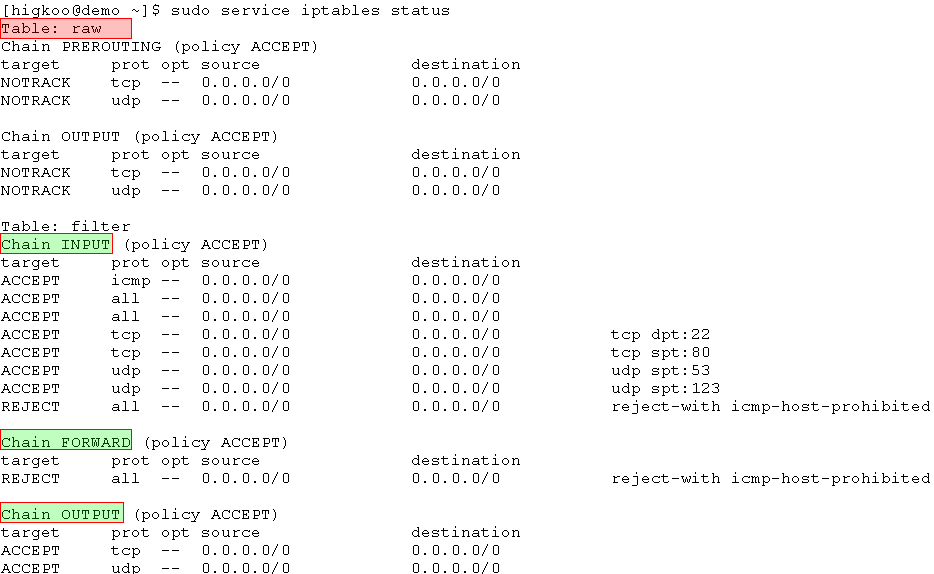

## 转载 - nf_conntrack: table full, dropping packet. 终结篇  
                                                                                        
### 作者                                                                                       
digoal                                                                                        
                                                                                        
### 日期                                                                                      
2016-12-29                                                                                        
                                                                                        
### 标签                                                                                      
Linux , iptables , nf_conntrack , nf_conntrack_max , table full , dropping packet              
                          
----                                                                                      
                              
## 背景     
讲述 “连接跟踪表已满，开始丢包” 问题的处理方法。    
  
原文链接 :   
  
http://www.cnblogs.com/higkoo/articles/iptables_tunning_for_conntrack.html  
  
https://my.oschina.net/kisops/blog/150995  
  
## 正文  
  
“连接跟踪表已满，开始丢包”！相信不少用iptables的同学都会见过这个错误信息吧，这个问题曾经也困扰过我好长一段时间。  
  
https://bugzilla.netfilter.org/show_bug.cgi?id=830  
  
此问题的解决办法有四种（nf_conntrack 在CentOS 5 / kernel <= 2.6.19中名为 ip_conntrack ）：  
  
### 一、关闭防火墙  
  
简单粗暴，直接有效  
  
```  
chkconfig iptables off  
chkconfig ip6tables off  
service iptables stop  
service ip6tables stop  
```  
  
切记：在防火墙关闭状态下，不要通过iptables指令（比如 iptables -nL）来查看当前状态！  
  
因为这样会导致防火墙被启动，而且规则为空。  
  
虽然不会有任何拦截效果，但所有连接状态都会被记录，浪费资源且影响性能并可能导致防火墙主动丢包！  
  
### 二、加大防火墙跟踪表的大小，优化对应的系统参数  
  
1、状态跟踪表的最大行数的设定，理论最大值 CONNTRACK_MAX = RAMSIZE (in bytes) / 16384 / (ARCH / 32)  
  
以64G的64位操作系统为例，CONNTRACK_MAX = 64*1024*1024*1024/16384/2 = 2097152  
  
即时生效请执行：   
    
```
sysctl -w net.netfilter.nf_conntrack_max=2097152  
```
  
2、其哈希表大小通常为总表的1/8，最大为1/2。CONNTRACK_BUCKETS = CONNTRACK_MAX / 8  
  
同样64G的64位操作系统，哈希最佳范围是 262144 ~ 1048576 。  
  
```
echo 262144 > /sys/module/nf_conntrack/parameters/hashsize
```
  
运行状态中通过 sysctl net.netfilter.nf_conntrack_buckets 进行查看，通过文件 /sys/module/nf_conntrack/parameters/hashsize 进行设置  
  
或者新建 /etc/modprobe.d/iptables.conf ，重新加载模块才生效：  
  
```  
vi /etc/modprobe.d/iptables.conf

options nf_conntrack hashsize=262144  
```  
  
3、还有些相关的系统参数`sysctl -a | grep nf_conntrack`可以调优（/etc/sysctl.conf ）：  
  
```  
vi /etc/sysctl.conf

net.netfilter.nf_conntrack_max = 1048576  
net.netfilter.ip_conntrack_tcp_timeout_established = 3600  
net.netfilter.nf_conntrack_tcp_timeout_close_wait = 60  
net.netfilter.nf_conntrack_tcp_timeout_fin_wait = 120  
net.netfilter.nf_conntrack_tcp_timeout_time_wait = 120  
```  
  
### 三、使用祼表，添加“不跟踪”标识。  
  
如下示例更适合桌面系统或随意性强的服务器。因为它开启了连接的状态机制，方便和外部通信。修改 /etc/sysconfig/iptables 文件：  
  
```  
*raw   
# 对TCP连接不启用追踪，解决ip_contrack满导致无法连接的问题   
-A PREROUTING -p tcp -m tcp --dport 80 -j NOTRACK   
-A PREROUTING -p tcp -m tcp --dport 22 -j NOTRACK   
-A PREROUTING -p tcp -m tcp --dport 21 -j NOTRACK   
-A PREROUTING -p tcp -m tcp --dport 11211 -j NOTRACK   
-A PREROUTING -p tcp -m tcp --dport 60000:60100 -j NOTRACK   
-A PREROUTING -p tcp -s 192.168.10.1 -j NOTRACK   
-A OUTPUT -p tcp -m tcp --sport 80 -j NOTRACK   
-A OUTPUT -p tcp -m tcp --sport 22 -j NOTRACK   
-A OUTPUT -p tcp -m tcp --sport 21 -j NOTRACK   
-A OUTPUT -p tcp -m tcp --sport 11211 -j NOTRACK   
-A OUTPUT -p tcp -m tcp --sport 60000:60100 -j NOTRACK   
-A OUTPUT -p tcp -s 192.168.10.1 -j NOTRACK   
COMMIT   
*filter   
# 允许ping   
-A INPUT -p icmp -j ACCEPT   
# 对本地回路、第5张网卡放行   
-A INPUT -i lo -j ACCEPT   
-A INPUT -i eth4 -j ACCEPT   
# 连接状态跟踪，已建立的连接允许传输数据   
-A INPUT -m state --state ESTABLISHED,RELATED,INVALID,UNTRACKED -j ACCEPT   
# filter表里存在但在raw里不存在的，默认会进行连接状态跟踪   
-A INPUT -s 192.168.10.31 -p tcp --dport 2669 -j ACCEPT   
-A INPUT -j REJECT --reject-with icmp-host-prohibited   
-A FORWARD -j REJECT --reject-with icmp-host-prohibited   
COMMIT  
```  
  
或者干脆对所有连接都关闭跟踪，不跟踪任何连接状态。不过规则就限制比较严谨，进出都需要显式申明。示例 /etc/sysconfig/iptables ：  
  
```  
*raw  
# 对TCP/UDP连接不启用追踪，解决nf_contrack满导致无法连接的问题  
-A PREROUTING -p tcp -j NOTRACK  
-A PREROUTING -p udp -j NOTRACK  
-A OUTPUT -p tcp -j NOTRACK  
-A OUTPUT -p udp -j NOTRACK  
COMMIT  
*filter  
# 允许ping  
-A INPUT -p icmp -j ACCEPT  
# 对本地回路和eth1放行  
-A INPUT -i lo -j ACCEPT  
-A INPUT -i eth1 -j ACCEPT  
# 只允许符合条件的连接进行传输数据  
-A INPUT -p tcp --dport 22 -j ACCEPT  
-A INPUT -p tcp --sport 80 -j ACCEPT  
-A INPUT -p udp --sport 53 -j ACCEPT  
-A INPUT -p udp --sport 123 -j ACCEPT  
# 出去的包都不限制  
-A OUTPUT -p tcp -j ACCEPT  
-A OUTPUT -p udp -j ACCEPT  
# 输入和转发的包不符合规则的全拦截  
-A INPUT -j REJECT --reject-with icmp-host-prohibited  
-A FORWARD -j REJECT --reject-with icmp-host-prohibited  
COMMIT  
```  
  
效果如下图：  
  
    
  
### 四、删除连接跟踪模块`lsmod | grep nf_conntrack`，不使用连接状态的跟踪功能。  
  
1、删除nf_conntrack和相关的依赖模块，示例：  
  
```  
rmmod nf_conntrack_ipv4   
rmmod nf_conntrack_ipv6   
rmmod xt_state   
rmmod xt_CT   
rmmod xt_conntrack   
rmmod iptable_nat   
rmmod ipt_REDIRECT   
rmmod nf_nat   
rmmod nf_conntrack  
```  
  
2、禁用跟踪模块，把它加到黑名单（/etc/modprobe.d/blacklist.conf ）：  
  
```  
# 禁用 nf_conntrack 模块   
blacklist nf_conntrack   
blacklist nf_conntrack_ipv6   
blacklist xt_conntrack   
blacklist nf_conntrack_ftp   
blacklist xt_state   
blacklist iptable_nat   
blacklist ipt_REDIRECT   
blacklist nf_nat   
blacklist nf_conntrack_ipv4  
```  
  
3、去掉防火墙里所有和状态相关的配置（比如state状态，NAT功能），示例：  
  
```  
*filter   
# 允许ping   
-A INPUT -p icmp -j ACCEPT   
# 对本地回路和第2张网卡放行   
-A INPUT -i lo -j ACCEPT   
-A INPUT -i eth1 -j ACCEPT   
# 对端口放行   
-A INPUT -p tcp --dport 1331 -j ACCEPT   
# 对IP放行   
-A INPUT -s 192.168.10.31 -j ACCEPT  
  
#允许本机进行DNS查询  
  
-A INPUT -p udp --sport 53 -j ACCEPT  
-A OUTPUT -p udp -j ACCEPT  
-A INPUT -j REJECT --reject-with icmp-host-prohibited   
-A FORWARD -j REJECT --reject-with icmp-host-prohibited   
COMMIT  
```  
    
另外，防火墙的配置文件最好也改下，不要加载任何额外模块（/etc/sysconfig/iptables-config）：  
  
```  
IPTABLES_MODULES="" # 不需要任何附加模块  
IPTABLES_MODULES_UNLOAD="no" # 避免iptables重启后sysctl中对应的参数被重置为系统默认值  
IPTABLES_SAVE_ON_STOP="no"  
IPTABLES_SAVE_ON_RESTART="no"  
IPTABLES_SAVE_COUNTER="no"  
IPTABLES_STATUS_NUMERIC="yes"  
IPTABLES_STATUS_VERBOSE="no"  
IPTABLES_STATUS_LINENUMBERS="no"  
```  
  
往往我们对连接的跟踪都是基于操作系统的（netstat / ss ），防火墙的连接状态完全是它自身实现产生的。  
  
## 总结  
  
防火墙有条件还是交给上层设备完成会更好，使用防火墙一定要做调优；如果不需要防火墙的跟踪功能，规则简单的可以开启NOTRACK选项，条件允许的情况下就删除它吧！  
  
		          
                                  
                                  
  
<a rel="nofollow" href="http://info.flagcounter.com/h9V1"  ></a>  
  
  
  
  
  
  
## [digoal's 大量PostgreSQL文章入口](https://github.com/digoal/blog/blob/master/README.md "22709685feb7cab07d30f30387f0a9ae")
  
