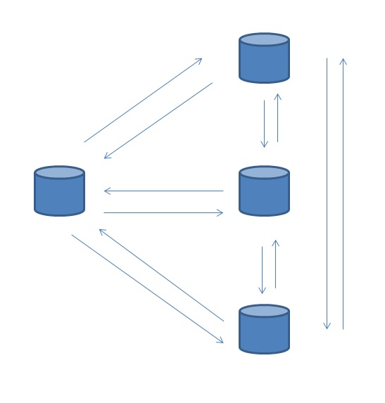

## 轻松打爆netfilter conntrack table的Greenplum SQL  
    
### 作者    
digoal    
    
### 日期    
2016-12-29    
    
### 标签    
PostgreSQL , Greenplum , udp , 重分布 , 内部链接     
    
----    
    
## 背景    
Greenplum 是一款MPP数据库，数据哈希打散存放在数据节点，当执行JOIN时，如果JOIN字段非分布键，那么数据会在数据节点之间重分布。重分布使用四阶段方法，参考如下：  
  
[《分布式DB(Greenplum)中数据倾斜的原因和解法 - 阿里云HybridDB for PostgreSQL最佳实践》](../201708/20170821_02.md)    
  
当数据重分布时，每个数据节点之间都会建立一对连接（默认为UDP连接），当数据节点很多时，这个内部连接可能特别多。  
  
  
  
例如：  
  
1024个segment的Greenplum集群，当某个QUERY涉及数据重分布时，每个segment会产生1023*2=2046个UDP连接(包括连接其他节点，以及其他节点连接自己的)。  
  
假设一台物理机有32个segment，那么这个主机会产生2046*32=65472个连接。假设有100个并发请求都产生了数据重分布，那么这台主机会产生6547200个连接。  
  
如果LINUX主机开启了iptables防火墙，并且开启了会话跟踪，那么会话跟踪表会被轻松打爆。导致报错：  
  
```  
dmesg  
  
nf_conntrack: table full, dropping packet  
```  
  
从而影响性能、甚至正常使用也会受到影响。  
   
产生重分布的SQL很多，包括查询、更新、写入等等(写入时，如果目标表的分布键与最终产生结果时的分布不一致，那么就会涉及重分布)。如果在一个函数中，涉及大量重分布的SQL(比如loop中调用多次)，同样道理，一次函数调用就可能把OS会话表打爆。   
  
例子   
  
```
postgres=# create table dist_1(id int, c1 int);
NOTICE:  Table doesn't have 'DISTRIBUTED BY' clause -- Using column named 'id' as the Greenplum Database data distribution key for this table.
HINT:  The 'DISTRIBUTED BY' clause determines the distribution of data. Make sure column(s) chosen are the optimal data distribution key to minimize skew.
CREATE TABLE
postgres=# create table dist_2(id int, c1 int) distributed by (c1);
CREATE TABLE

-- 两个表的分布键不一样，数据传输时重分布
postgres=# explain insert into dist_1 select * from dist_2;
                                        QUERY PLAN                                         
-------------------------------------------------------------------------------------------
 Insert (slice0; segments: 48)  (rows=1 width=8)
   ->  Redistribute Motion 48:48  (slice1; segments: 48)  (cost=0.00..0.00 rows=1 width=8)
         Hash Key: dist_2.id
         ->  Seq Scan on dist_2  (cost=0.00..0.00 rows=1 width=8)
 Settings:  enable_bitmapscan=off; enable_seqscan=off; optimizer=off
 Optimizer status: legacy query optimizer
(6 rows)

-- 两个表分布键不一样，但是查询中GROUP BY导致了一次重分布，并与写入的目标表分布键一致，从而写入时不需要再重分布
postgres=# explain insert into dist_1 select id,count(*) from dist_2 group by id;
                                               QUERY PLAN                                               
--------------------------------------------------------------------------------------------------------
 Insert (slice0; segments: 48)  (rows=1 width=12)
   ->  Subquery Scan "*SELECT*"  (cost=0.04..0.07 rows=1 width=12)
         ->  HashAggregate  (cost=0.04..0.05 rows=1 width=12)
               Group By: dist_2.id
               ->  Redistribute Motion 48:48  (slice1; segments: 48)  (cost=0.01..0.03 rows=1 width=12)
                     Hash Key: dist_2.id
                     ->  HashAggregate  (cost=0.01..0.01 rows=1 width=12)
                           Group By: dist_2.id
                           ->  Seq Scan on dist_2  (cost=0.00..0.00 rows=1 width=4)
 Settings:  enable_bitmapscan=off; enable_seqscan=off; optimizer=off
 Optimizer status: legacy query optimizer
(11 rows)
```
   
  
## 解决办法  
设置较大的nf_conntrack_max LINUX内核参数，可以缓解```nf_conntrack: table full, dropping packet```的问题。  
  
比较好的方法是：  
  
1、不启用nf_conntrack模块。  
  
2、使用raw表，关闭跟踪。  
  
具体的方法请参考末尾文章。  
  
3、第三种方法，在部署Greenplum时，每个主机不要部署太多的segment，从而降低单个主机的会话数。   
  
4、第四种方法，使用连接池，比如pgbouncer，减少连到GP的实际连接。   
  
[《Greenplum 连接池实践》](../201801/20180128_04.md)  
    
## 参考    
[《netfilter内核模块知识 - 解决nf_conntrack: table full, dropping packet》](../201612/20161229_04.md)    
    
[《[转载]解决 nf_conntrack: table full, dropping packet 的几种思路》](../201612/20161229_03.md)    
    
[《转载 - nf_conntrack: table full, dropping packet. 终结篇》](../201612/20161229_02.md)    
  
<a rel="nofollow" href="http://info.flagcounter.com/h9V1"  ></a>  
  
  
  
  
  
  
## [digoal's 大量PostgreSQL文章入口](https://github.com/digoal/blog/blob/master/README.md "22709685feb7cab07d30f30387f0a9ae")
  
