## 从难缠的模糊查询聊开 - PostgreSQL独门绝招之一 GIN , GiST , SP-GiST , RUM 索引原理与技术背景           
##### [TAG 15](../class/15.md)
                                                                                                    
### 作者                                                                                                   
digoal                                                                                                    
                                                                                                    
### 日期                                                                                                  
2016-12-31            
                                                                                                    
### 标签                                                                                                  
PostgreSQL , gist , sp-gist , gin , rum index , 模糊查询 , 搜索引擎 , token位置搜索 , pg_hint_plan , 自动优化 , 分词 , like '%xxx%'                                     
                                      
----                                                                                                  
                                          
## 背景  
模糊查询，是一个需求量很大，同时也是一个对数据库来说非常难缠的需求。       
     
对于前模糊(like '%xxx')，可以使用倒排B-TREE索引解决，对于后模糊(like 'xxx%')，可以使用B-TREE索引解决。    
  
B-TREE索引通常支持的查询包括 > , < , = , <= , >= 以及排序。  目前大多数数据库都支持B-TREE索引方法。       
  
但是对于前后模糊(like '%xxxx%')，对于以及前后模糊的正则表达式(~ '.*ab?cd[e-f]{1,10}-0.*')，则很多数据库无从下手，无法优化，只能全表扫描，对每条记录进行单独的处理。     
  
通常的暴力加速方法是开并行，比如基于CPU,GPU,FPGA的并行加速，在PG中还可以用上LLVM的加速方法，处理大批量的数据有很多倍的CPU能耗需求下降。  
       
但是本文要说的不是暴力加速，而是索引加速，在提倡节能减排的今天更加科学可取，同时更加适合OLTP系统。     
    
PostgreSQL数据库的开放性使得这一切成为了可能，在数据库中进行前后模糊，正则表达查询的索引检索成为可能。    
  
原因是PostgreSQL开放的索引接口，数据类型。（比如支持GIN, GIST, RUM, 自定义索引方法，你可以认为这是PG的独门绝技之一，目前还没有其他数据库支持这一特性）。    
  
其实我在之前介绍过很多模糊查询的索引优化方法，很多第一次接触的同学会认为打开了新世界的大门。   
  
[《PostgreSQL 9.3 pg_trgm imporve support multi-bytes char and gist,gin index for reg-exp search》](../201305/20130516_01.md)  
  
[《中文模糊查询性能优化 by PostgreSQL trgm》](../201605/20160506_02.md)  
  
[《PostgreSQL 全文检索加速 快到没有朋友 - RUM索引接口(潘多拉魔盒)》](../201610/20161019_01.md)   
  
[《聊一聊双十一背后的技术 - 毫秒分词算啥, 试试正则和相似度》](../201611/20161118_01.md)  
  
[PostgreSQL internal](20161231_01_pdf_002.pdf)  
  
[PostgreSQL index internal](20161231_01_pdf_001.pdf)    
  
目前有三种索引可以参与模糊查询的优化，到底用哪个好呢？  
  
本文将给大家分享一下 gin,gist,rum 索引背后的原理，大伙就知道该如何选择了，看好就该迎接2017新年啦，提前祝大家新年快乐，明年步步高升。   
  
## GIN  
gin索引，是将列(比如数组，全文检索类型)中的值拿出来，再存储到树形结构中（类似B+TREE，值+行号s），对于高频值，为了减少树的深度，行号s会存储在另外的页中。    
  
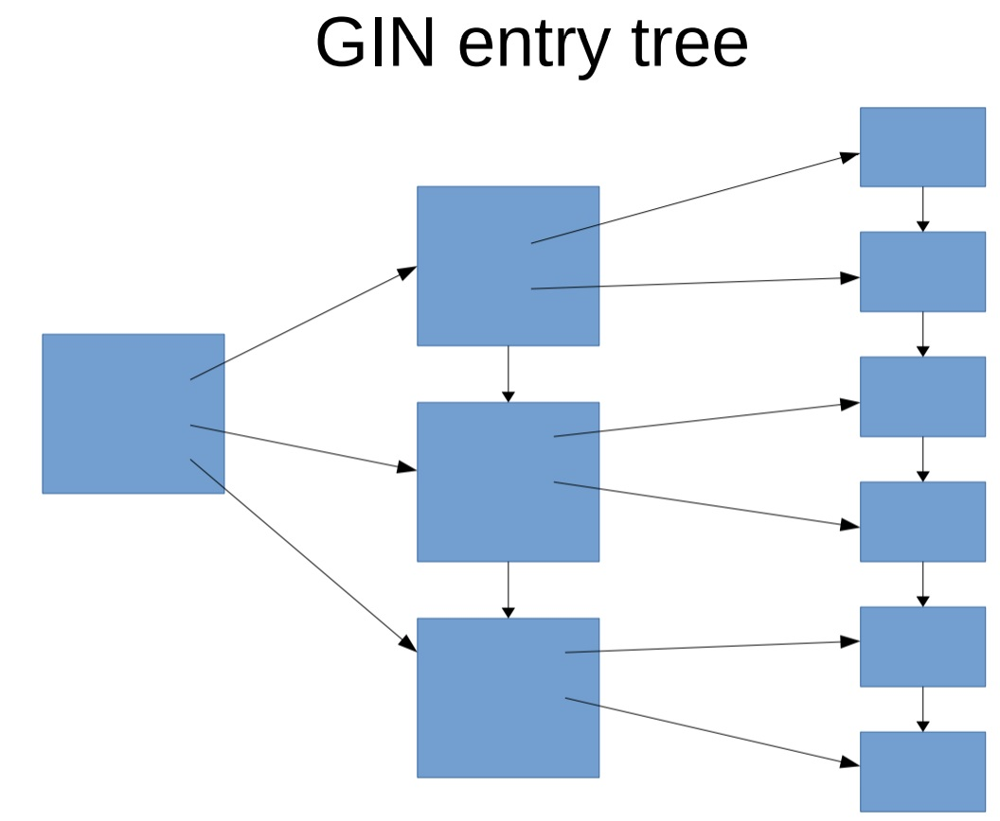    
  
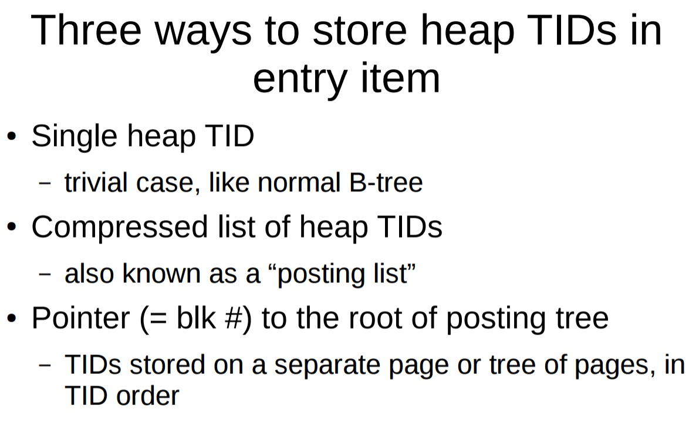    
  
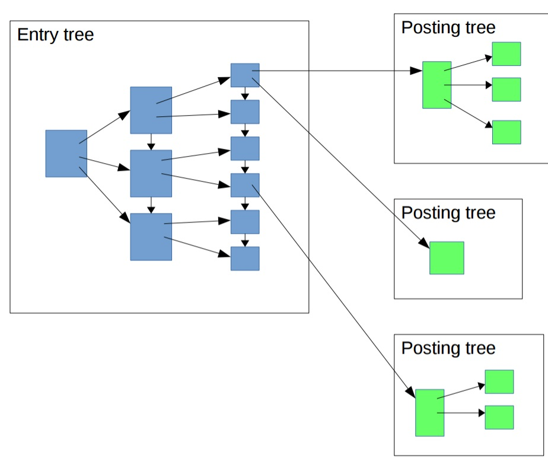    
  
### GIN fashupdate  
由于GIN存储的是元素索引，所以当一条记录被插入或更新时，可能涉及到很多个元素，对GIN索引来说，就会涉及到很多ITEM的变更。  
  
为了提升插入，更新，删除的性能，PostgreSQL支持类似MySQL的索引组织表类似的buffer ，先写入BUFFER，然后再合并到树里去。  
  
而相比MySQL索引组织表更优一些的地方是，查询不会堵塞合并，也不会堵塞写入。因为查询时不需要等待BUFFER中的数据合并到树中，而是直接查询BUFFER（如果BUFFER非常大，可能查询速度会受到一定的影响）。  、  
  
用户可通过参数来控制BUFFER的大小，GIN会在BUFFER增长到一定程度后自动进行合并。或者等VACUUM来合并。  
  
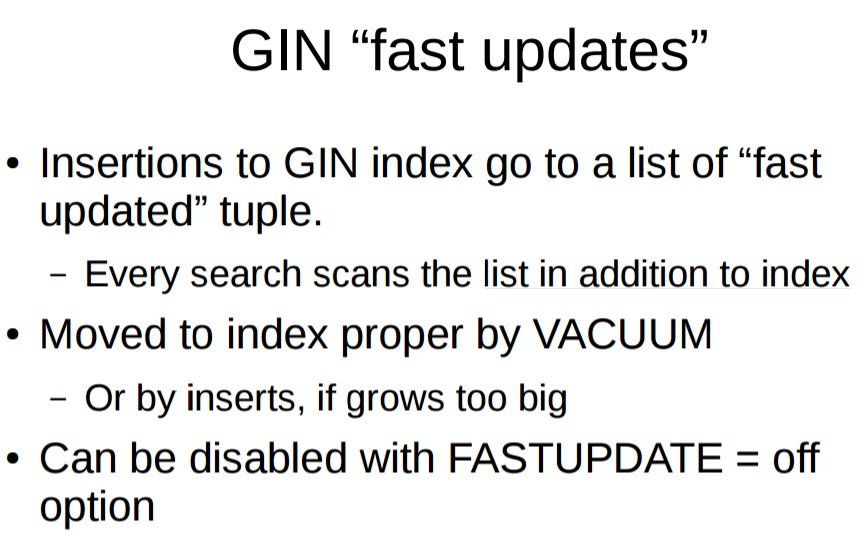    
  
所以一个完整的GIN索引长这样  
  
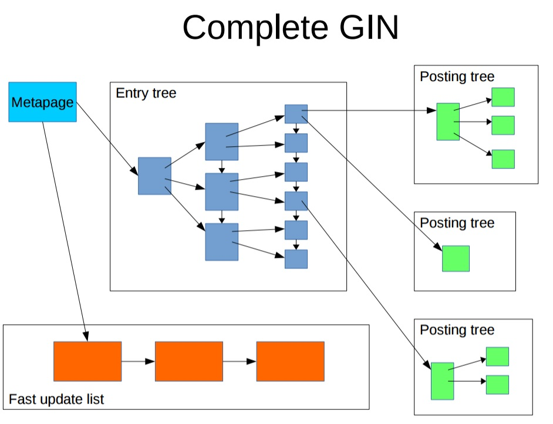    
  
### GIN使用注意  
  
1\. 为了提高更新速度，使用了FASTER UPDATE技术，当BUFFER很大时（可自己设置），查询速度可能会较慢。所以权衡插入和查询，建议设置合理的BUFFER大小。  
  
2\. 仅支持bitmap查询，也就是说取到所有的行号之后，排序，然后再去检索，好处显然是可以减少随机的HEAP PAGE扫描，但是坏处是，当涉及的行非常多（比如每行都包含了某个元素）很大时，排序耗费资源较多，耗时较长，从执行到获得第一条的时间较长，如果用户使用了LIMIT，也要等排序结束。  
  
### GIN应用举例  
[《恭迎万亿级营销(圈人)潇洒的迈入毫秒时代 - 万亿user_tags级实时推荐系统数据库设计》](./20161225_01.md)   
  
[《从相似度算法谈起 - Effective similarity search in PostgreSQL》](./20161222_02.md)  
  
  
## GiST  
Generalized Search Tree，或者叫归纳树，用于解决一些b-tree, gin难以解决的数据减少问题，例如，范围是否相交，是否包含，地理位置中的点面相交，或者按点搜索附近的点，当然，它能实现的功能还不仅于此。   
  
以范围类型为例，下图每一条线段表示某条记录，某个字段上面存储的范围类型所覆盖的范围。  
  
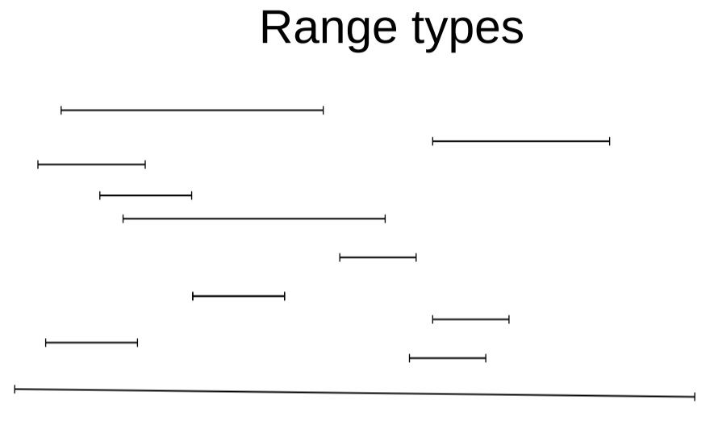    
  
找到存储的范围有相交的记录s  
  
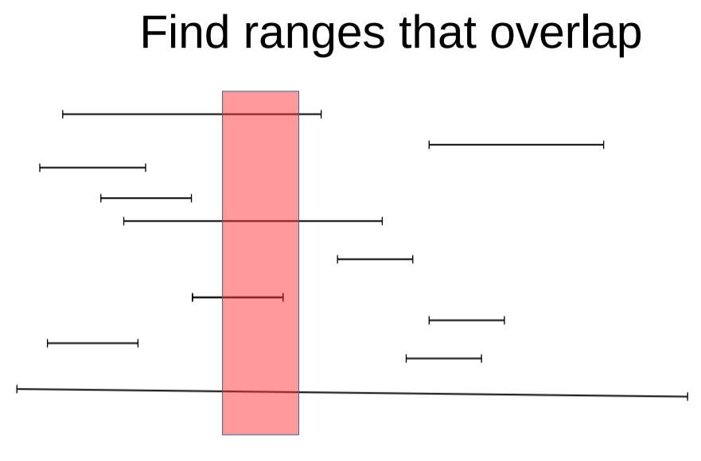    
  
按范围的最小值（左值）排序（请忽略红色框框的存在）  
  
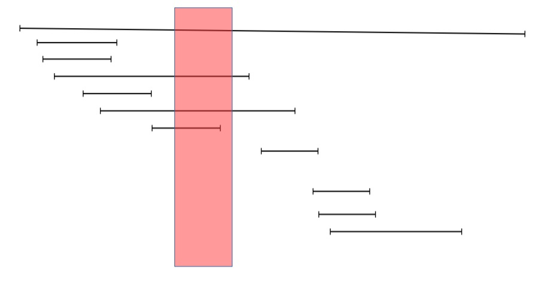    
  
按范围的最大值（右值）排序（请忽略红色框框的存在）  
  
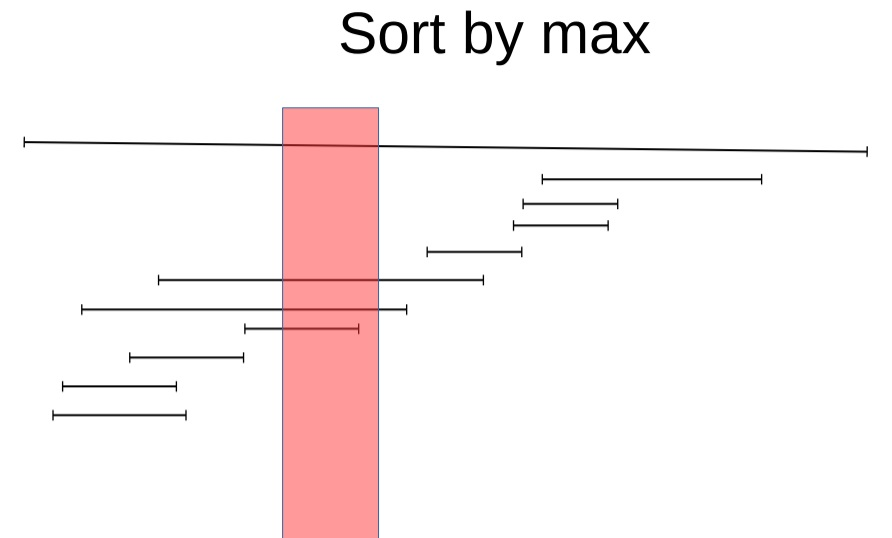    
  
### GiST 的组织形式  
首先把它们聚集到不同的分组（有点类似K-Means干的事情）（请忽略红色框框的存在）  
  
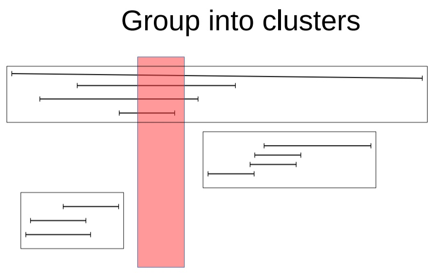    
  
聚集之后的数据，你可以理解为就是对应GiST的单个index page里包含的信息（可以多级聚集，即对应后面的2级结构）。  
  
GiST单个index page长这样：  
  
1. key + 行号 (索引和记录一一对应)  
  
2. 在index内无序存放。  
  
蓝色框框中，左边列的值代表KEY，右边列的值代表行号（第几个HEAP PAGE，里面的第几条记录）。   
  
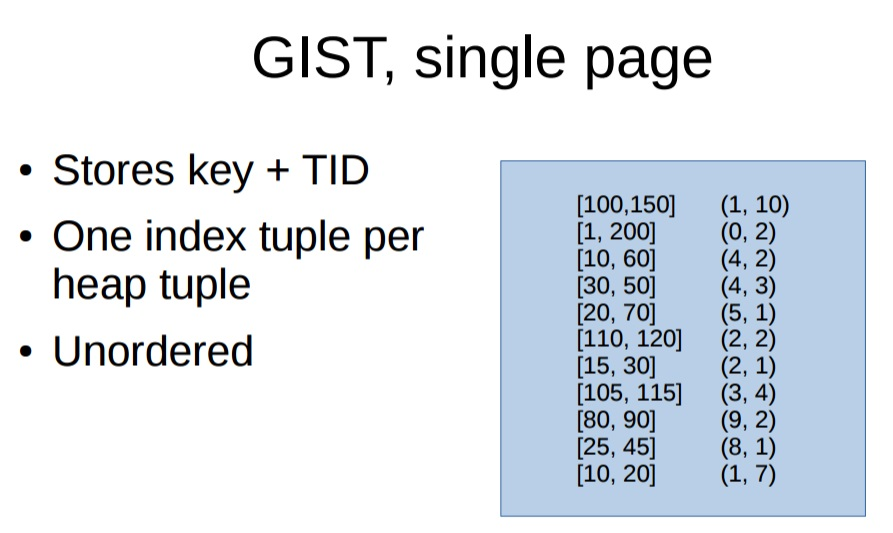    
  
GiST两级索引长这样，上一级代表下一级中单个INDEX PAGE的大范围。    
  
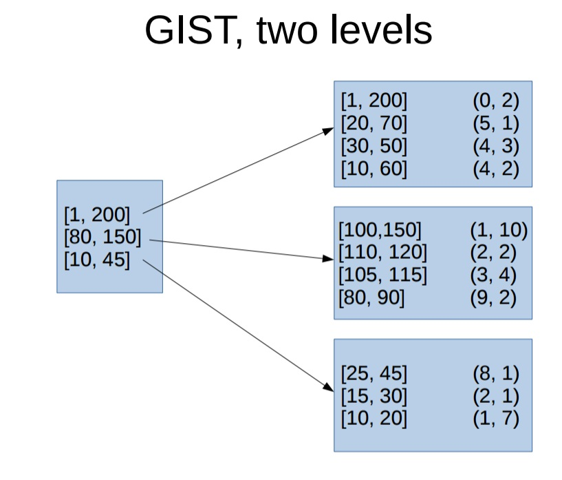    
  
例如搜索[55,60]这个范围，如何搜索的呢？  
  
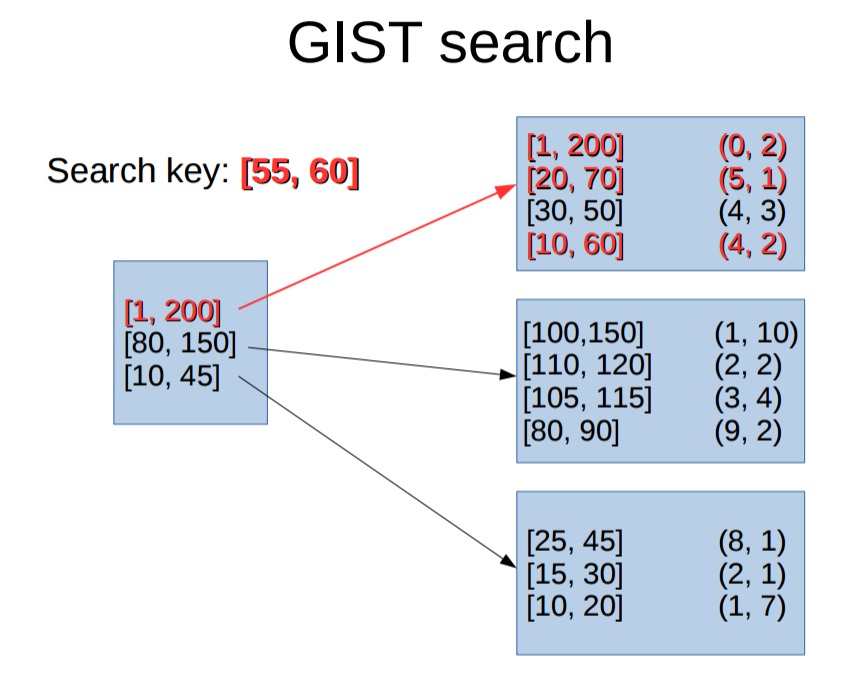    
  
### GiST 小结  
GiST的灵魂是聚集，所以首先是聚集的动作，聚集后，在单个组内包含的KEY+HEAP行号会放到单个INDEX PAGE中。  
  
聚集的范围作为一级结构，存储在GiST的entry 中，便于检索。  
  
既然灵魂是聚集，那么GiST的性能就和他的聚集算法息息相关，PostgreSQL把这个接口留给了用户，用户在自定义数据类型时，如果要自己实现对应的GIST索引，那么就好好考虑这个类型聚集怎么做吧。  
  
PostgreSQL内置的range, geometry等类型的GIST已经帮你做好了，你只需要做新增的类型，比如你新增了一个存储人体结构的类型，存储图片的类型，或者存储X光片的类型，怎么快速检索它们，那就是你要实现的GIST索引聚集部分了。  
  
```  
Performance depends on how well the userdefined  
Picksplit and Choose functions can  
group keys  
```  
  
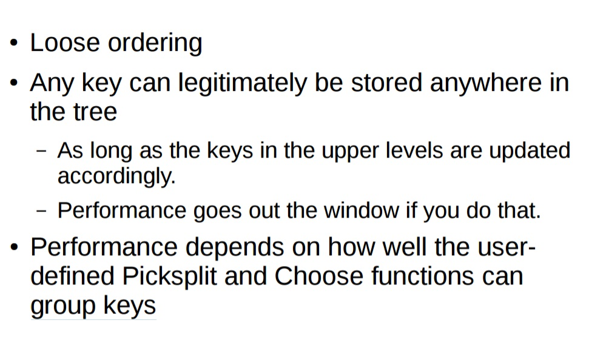    
  
    
  
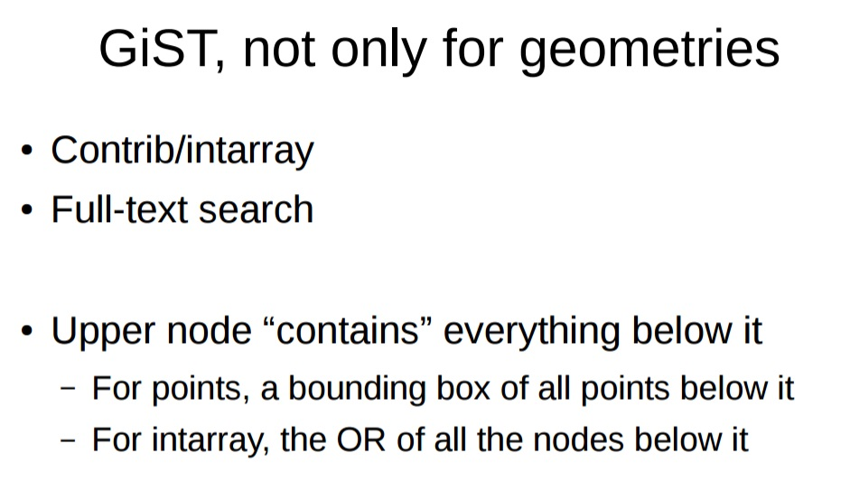    
  
### GiST 应用举例  
[《PostgreSQL 在视频、图片去重，图像搜索业务中的应用》](../201611/20161126_01.md)    
  
[《聊一聊双十一背后的技术 - 物流、动态路径规划》](../201611/20161114_01.md)    
  
[《PostgreSQL 百亿地理位置数据 近邻查询性能》](../201601/20160119_01.md)    
  
## SP-GiST  
Space-Partitioned GIST  
  
可以理解为GiST的扩展，有以下特点  
  
1\. nodes无交叉，（GiST是有交叉的，只是做了聚集，但是nodes（不同的index page)包含的内容是有交叉的）。  
  
2\. 索引深度是可变的  
  
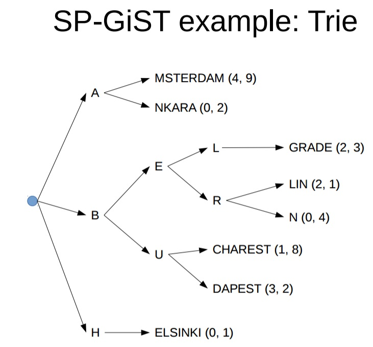    
  
3\. 每个物理的index page可能对应多个nodes  
  
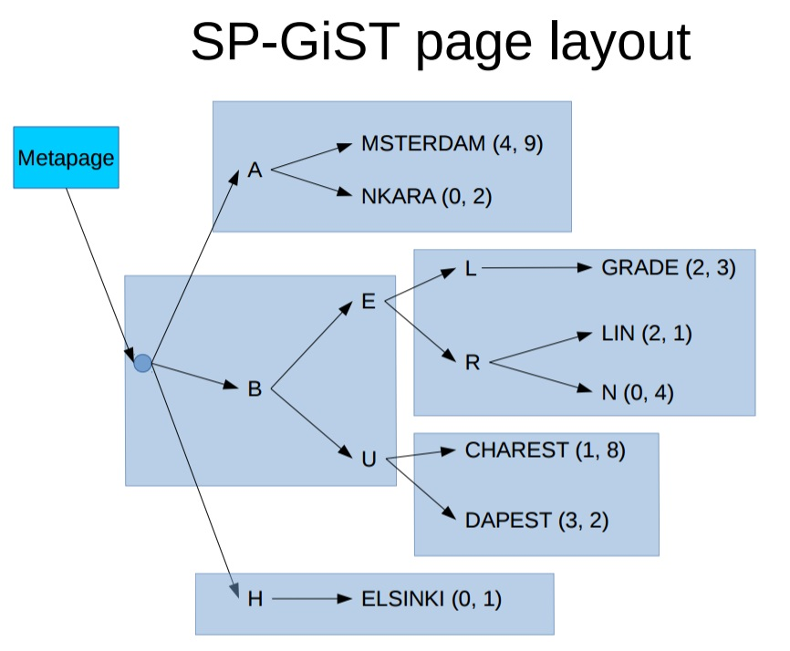    
  
SP-Gist支持的检索类型  
  
1\. Kd-tree , points only ; ( because shapes might overlap )   
  
2\. prefix tree for text  
  
### SP-GiST 应用举例  
与GiST的场景类似  
  
## RUM  
RUM 参考了GIN的实现，并改进了GIN在全文检索时的一些弱点，比如：  
  
1\. Slow ranking. (GIN没有存储全文检索的lexem位置信息，所以无法支持索引级的ranking，需要扫描HEAP PAGE后，通过CPU运算得到)  
  
It is need position information about lexems to ranking. GIN index doesn't store positions of lexems. So after index scan we need additional heap scan to retreive lexems positions.  
  
2\. Slow phrase search with GIN index. (同样由于GIN没有存储位置信息，所以无法支持索引级的phrase搜索，例如 '速度' <1> '激情' 不能支持，或者 '中国:100' 无法支持到索引级别的搜索. )  
  
This problem relates with previous problem. It is need position information to perform phrase search.  
  
3\. Slow ordering by timestamp. (因为GIN只存储了tsvector TOKEN，没有任何附带字段信息（例如全文检索+索引字段 双字段索引），所以一些炫酷或者业务扩展的功能，都需要heap page的扫描和CPU的处理)  
  
GIN index can't store some related information in index with lexemes. So it is necessary to perform additional heap scan.  
  
RUM的改进方法，在INDEX 中加入了附加信息，比如TOKEN位置，从而可以支持以上查询。  同时支持双字段索引（如 tsvector+timestamp）  
  
RUM solves this problems by storing additional information in posting tree.   
  
For example, positional information of lexemes or timestamps.   
  
You can get an idea of RUM by the following picture:  
  
    
  
RUM带来的问题，建立索引以及数据变更的时间，比GIN长，这个已经在RUM的TODO 中，会是后面的改进重点。    
  
Drawback of RUM is that it has slower build and insert time than GIN.   
  
It is because we need to store additional information besides keys and because RUM uses generic WAL.    
  
### RUM场景举例  
  
[《聊一聊双十一背后的技术 - 毫秒分词算啥, 试试正则和相似度》](../201611/20161118_01.md)    
  
[《聊一聊双十一背后的技术 - 分词和搜索》](../201611/20161115_01.md)    
  
## PostgreSQL目前支持哪些索引方法  
B-Tree  
  
HASH  
  
GIN  
  
GiST  
  
SP-GiST  
  
BRIN  
  
[《"物联网"流式处理应用 - 用PostgreSQL实时处理(万亿每天)》](../201512/20151215_01.md)  
  
[PostgreSQL 如何潇洒的处理每天上百TB的数据增量](../201603/20160320_01.md)  
  
[《PostgreSQL 9.5 new feature - BRIN (block range index) index》](../201504/20150419_01.md)  
  
[《PostgreSQL 9.5 new feature - lets BRIN be used with R-Tree-like indexing strategies For "inclusion" opclasses》](../201505/20150526_01.md)   
  
RUM  
  
[《PostgreSQL 全文检索加速 快到没有朋友 - RUM索引接口(潘多拉魔盒)》](../201610/20161019_01.md)    
  
BLOOM  
  
[《PostgreSQL 9.6 黑科技 bloom 算法索引，一个索引支撑任意列组合查询》](../201605/20160523_01.md)    
  
    
  
还有开放的接口，你可以自定义你的索引方法，请参考bloom索引的实现。   
  
## 回到模糊查询的需求  
  
介绍完PostgreSQL支持的索引方法，目前对于前模糊和后模糊，我们同样可以使用B-Tree来搜索。  
  
而对于前后模糊，以及正则表达式，我们也有了索引的支持  
  
前后模糊：  
  
gin, gist, rum  
  
正则表达：  
  
gin, gist  
  
有例子如下    
  
[《聊一聊双十一背后的技术 - 毫秒分词算啥, 试试正则和相似度》](../201611/20161118_01.md)    
  
接下来对比一下gin, gist, rum在不同输入条件下的性能，以及我们如何选择  
  
为了达到测试效果，我们需要在一个列上创建多个索引，需要使用pg_hint_plan选择合适的索引。  
  
### 一列可以建多个索引  
PostgreSQL允许你在一个列上面创建多个索引，比如我们接下来的测试，我们需要使用gin, gist, rum来创建不同的索引。  
  
### 自由选择索引, pg_hint_plan  
[《阿里云 PostgreSQL pg_hint_plan插件的用法》](../201604/20160401_01.md)    
  
[《关键时刻HINT出彩 - PG优化器的参数优化、执行计划固化CASE》](../201607/20160723_02.md)    
  
[《PostgreSQL SQL HINT的使用》](../201602/20160203_01.md)   
  
[《PostgreSQL 特性分析 Plan Hint》](../201605/20160523_02.md)    
  
### 将字符串转化为全文检索的lexeme  
  
为了达到测试rum支持模糊查询的目的，我们需要将字符串转换为全文检索类型，同时检索是需要输入tsquery，所以也需要转换为tsquery类型。  
  
找到转义字符\的ascii值  
  
```  
select chr(i) from generate_series(1,255) as t(i);   
```  
  
将字符串转换为带位置标记的tsvector  
  
```  
create or replace function string_to_tsvector(v text) returns tsvector as $$  
declare  
  x int := 1;  
  res text := '';  
  i text;  
begin  
  for i in select regexp_split_to_table(v,'')   
  loop  
    res := res||' '||chr(92)||i||':'||x;  
    x := x+1;  
  end loop;  
    return res::tsvector;  
end;  
$$ language plpgsql strict immutable;  
```  
  
将字符串转换为带位置标记的tsquery (<->符号是用来带上相邻信息的)  
  
```  
create or replace function string_to_tsquery(v text) returns tsquery as $$  
declare  
  x int := 1;  
  res text := '';  
  i text;  
begin  
  for i in select regexp_split_to_table(v,'')   
  loop  
    if x>1 then  
      res := res||' <-> '||chr(92)||i;   -- 这一句<->符号是用来带上相邻信息的  
    else  
      res := chr(92)||i;  
    end if;  
    x := x+1;  
  end loop;  
    return res::tsquery;  
end;  
$$ language plpgsql strict immutable;  
```  
  
### 准备环境  
安装插件啥的就不写了，需要三个插件pg_trgm, pg_hint_plan, rum    
  
```  
postgres=# \dx  
                                      List of installed extensions  
     Name     | Version |   Schema   |                            Description                              
--------------+---------+------------+-------------------------------------------------------------------  
 dblink       | 1.2     | public     | connect to other PostgreSQL databases from within a database  
 pg_hint_plan | 1.1.3   | hint_plan  |   
 pg_trgm      | 1.3     | public     | text similarity measurement and index searching based on trigrams  
 plpgsql      | 1.0     | pg_catalog | PL/pgSQL procedural language  
 rum          | 1.0     | public     | RUM index access method  
(5 rows)  
```  
  
### 测试表  
info字段的字符串就是我们接下来要进行模糊测试的字段    
  
```  
create table test(id int , info text);   
```  
  
### 测试数据  
写入100万测试数据  
  
```  
insert into test select id, md5(random()::text) from generate_series(1,1000000) t(id);   
```  
  
### 创建gin索引  
```  
CREATE INDEX trgm_idx1 ON test USING GIN (info gin_trgm_ops);  
  
耗时 19秒  
  
占用空间 102MB  
  
```  
  
### 创建gist索引  
```  
CREATE INDEX trgm_idx2 ON test USING GiST (info gist_trgm_ops);  
  
耗时 31秒   
  
占用空间 177MB   
  
```  
  
### 创建rum函数索引  
```  
CREATE INDEX rum_idx1 ON test USING rum ( string_to_tsvector(info) rum_tsvector_ops);  
  
耗时 133秒  
  
占用空间 86MB  
  
```  
  
转换后的tsvector长什么样？  
  
```  
create table test(id int , c1 text, c2 tsvector);   
  
  
insert into test select id, md5(rn), string_to_tsvector(md5(rn)) from (select random()::text as rn, id from generate_series(1,1000000) t(id)) t;   
  
  
select * from test limit 10;   
  
  
postgres=# select * from test limit 10;  
 id |                c1                |                                                                           c2                                                                             
----+----------------------------------+--------------------------------------------------------------------------------------------------------------------------------------------------------  
  1 | f09f48ac93fbb69169f63973a516dcd1 | '0':2 '1':16,27,32 '3':10,21,24 '4':5 '5':26 '6':14,17,20,28 '7':23 '8':6 '9':3,9,15,18,22 'a':7,25 'b':12,13 'c':8,30 'd':29,31 'f':1,4,11,19  
  2 | 7554a9e3b95c7ff01a54587f914ea9af | '0':16 '1':17,26 '3':8 '4':4,20,27 '5':2,3,11,19,21 '7':1,13,23 '8':22 '9':6,10,25,30 'a':5,18,29,31 'b':9 'c':12 'e':7,28 'f':14,15,24,32  
  3 | aa21991b6507275b86e43f2ec67ffc57 | '0':11 '1':4,7 '2':3,13,23 '3':21 '4':20 '5':10,15,31 '6':9,18,26 '7':12,14,27,32 '8':17 '9':5,6 'a':1,2 'b':8,16 'c':25,30 'e':19,24 'f':22,28,29  
  4 | c5e0ff17b63ab43c1b17d7a8c457c341 | '0':4 '1':7,17,19,32 '3':11,15,30 '4':14,26,31 '5':2,27 '6':10 '7':8,20,22,28 '8':24 'a':12,23 'b':9,13,18 'c':1,16,25,29 'd':21 'e':3 'f':5,6  
  5 | 70b83685fc0a4cbaf08423f686845977 | '0':2,11,18 '2':21 '3':5,22 '4':13,20,28 '5':8,29 '6':6,24,26 '7':1,31,32 '8':4,7,19,25,27 '9':30 'a':12,16 'b':3,15 'c':10,14 'f':9,17,23  
  6 | 98761ca17c8665787a11c1819a93cf44 | '1':5,8,19,20,22,24 '3':28 '4':31,32 '5':14 '6':4,12,13 '7':3,9,15,17 '8':2,11,16,23 '9':1,25,27 'a':7,18,26 'c':6,10,21,29 'f':30  
  7 | 9e432254f5de26ddd881709ac49f435b | '0':22 '1':20 '2':5,6,13 '3':4,30 '4':3,8,26,29 '5':7,10,31 '6':14 '7':21 '8':18,19 '9':1,23,27 'a':24 'b':32 'c':25 'd':11,15,16,17 'e':2,12 'f':9,28  
  8 | 383a710642cfe6ff9d65a587e3158371 | '0':7 '1':6,27,32 '2':10 '3':1,3,26,30 '4':9 '5':20,22,28 '6':8,14,19 '7':5,24,31 '8':2,23,29 '9':17 'a':4,21 'c':11 'd':18 'e':13,25 'f':12,15,16  
  9 | 9aa45e3355c7d0564e990466e06b9a49 | '0':14,21,26 '3':7,8 '4':4,17,22,31 '5':5,9,10,15 '6':16,23,24,27 '7':12 '9':1,19,20,29,32 'a':2,3,30 'b':28 'c':11 'd':13 'e':6,18,25  
 10 | f61a4af88c1e9f08af6597d9f93c25f4 | '0':15 '1':3,11 '2':29 '3':27 '4':5,32 '5':20,30 '6':2,19 '7':22 '8':8,9,16 '9':13,21,24,26 'a':4,6,17 'c':10,28 'd':23 'e':12 'f':1,7,14,18,25,31  
(10 rows)  
```  
  
### 一、test case1  
中间结果集很大（匹配精度低，满足条件的记录数多），返回结果也很大，未使用LIMIT  
  
#### 1. gin  
```  
postgres=# set pg_hint_plan.debug_print=on;  
postgres=# set client_min_messages ='log';  
```  
  
```  
postgres=# /*+ BitmapScan(test trgm_idx1) */ select count(*) from test where info ~ 'a';  
LOG:  available indexes for BitmapScan(test): trgm_idx1  
LOG:  pg_hint_plan:  
used hint:  
BitmapScan(test trgm_idx1)  
not used hint:  
duplication hint:  
error hint:  
  
 count    
--------  
 873555  
(1 row)  
Time: 3426.308 ms  
```  
  
完整执行计划，注意评估行数，评估成本，后期可作为我们可用于评估哪个索引方法好的判断标准。    
  
```  
postgres=# explain (analyze,verbose,timing,costs,buffers) /*+ BitmapScan(test trgm_idx1) */ select * from test where info ~ 'a';  
LOG:  available indexes for BitmapScan(test): trgm_idx1  
LOG:  pg_hint_plan:  
used hint:  
BitmapScan(test trgm_idx1)  
not used hint:  
duplication hint:  
error hint:  
  
                                                              QUERY PLAN                                                                 
---------------------------------------------------------------------------------------------------------------------------------------  
 Bitmap Heap Scan on public.test  (cost=28878.04..47944.37 rows=858586 width=37) (actual time=2393.340..3438.434 rows=873555 loops=1)  
   Output: id, info  
   Recheck Cond: (test.info ~ 'a'::text)  
   Rows Removed by Index Recheck: 126445  
   Heap Blocks: exact=8334  
   Buffers: shared hit=21335  
   ->  Bitmap Index Scan on trgm_idx1  (cost=0.00..28663.39 rows=858586 width=0) (actual time=2391.618..2391.618 rows=1000000 loops=1)  
         Index Cond: (test.info ~ 'a'::text)  
         Buffers: shared hit=13001  
 Planning time: 0.464 ms  
 Execution time: 3513.761 ms  
(11 rows)  
```  
  
#### 2. gist  
```  
postgres=# /*+ IndexScan(test trgm_idx2) */ select count(*) from test where info ~ 'a';  
LOG:  available indexes for IndexScan(test): trgm_idx2  
LOG:  pg_hint_plan:  
used hint:  
IndexScan(test trgm_idx2)  
not used hint:  
duplication hint:  
error hint:  
  
 count    
--------  
 873555  
(1 row)  
Time: 1692.881 ms  
```  
  
完整执行计划，注意评估行数，评估成本，后期可作为我们可用于评估哪个索引方法好的判断标准。    
  
```  
postgres=# explain (analyze,verbose,timing,costs,buffers) /*+ IndexScan(test trgm_idx2) */ select * from test where info ~ 'a';  
LOG:  available indexes for IndexScan(test): trgm_idx2  
LOG:  pg_hint_plan:  
used hint:  
IndexScan(test trgm_idx2)  
not used hint:  
duplication hint:  
error hint:  
  
                                                               QUERY PLAN                                                                  
-----------------------------------------------------------------------------------------------------------------------------------------  
 Index Scan using trgm_idx2 on public.test  (cost=0.41..42825.67 rows=858586 width=37) (actual time=0.328..1719.398 rows=873555 loops=1)  
   Output: id, info  
   Index Cond: (test.info ~ 'a'::text)  
   Rows Removed by Index Recheck: 126445  
   Buffers: shared hit=962577  
 Planning time: 0.353 ms  
 Execution time: 1798.426 ms  
(7 rows)  
```  
  
#### 3. rum  
```  
postgres=# /*+ IndexScan(test rum_idx1) */ select count(*) from test where string_to_tsvector(info) @@  string_to_tsquery('a');  
LOG:  pg_hint_plan:  
no hint  
 count    
--------  
 873555  
(1 row)  
Time: 623.930 ms  
```  
  
完整执行计划，注意评估行数，评估成本，后期可作为我们可用于评估哪个索引方法好的判断标准。    
  
```  
postgres=# explain (analyze,verbose,timing,costs,buffers) /*+ IndexScan(test rum_idx1) */ select * from test where string_to_tsvector(info) @@  string_to_tsquery('a');  
LOG:  pg_hint_plan:  
used hint:  
not used hint:  
IndexScan(test rum_idx1)  
duplication hint:  
error hint:  
  
LOG:  pg_hint_plan:  
used hint:  
not used hint:  
IndexScan(test rum_idx1)  
duplication hint:  
error hint:  
  
LOG:  pg_hint_plan:  
used hint:  
not used hint:  
IndexScan(test rum_idx1)  
duplication hint:  
error hint:  
  
LOG:  available indexes for IndexScan(test): rum_idx1  
LOG:  pg_hint_plan:  
used hint:  
IndexScan(test rum_idx1)  
not used hint:  
duplication hint:  
error hint:  
  
                                                              QUERY PLAN                                                                
--------------------------------------------------------------------------------------------------------------------------------------  
 Index Scan using rum_idx1 on public.test  (cost=4.00..3940.50 rows=5000 width=37) (actual time=303.718..606.763 rows=873555 loops=1)  
   Output: id, info  
   Index Cond: (string_to_tsvector(test.info) @@ '''a'''::tsquery)  
   Buffers: shared hit=9027, temp read=1315 written=1315  
 Planning time: 1.165 ms  
 Execution time: 674.612 ms  
(6 rows)  
```  
  
### 二、test case2  
中间结果集很大（匹配精度低，满足条件的记录数多），返回结果很少，使用LIMIT  
  
如果这个好，那么使用分页也很有效  
  
#### 1. gin  
完整执行计划，注意评估行数，评估成本，后期可作为我们可用于评估哪个索引方法好的判断标准。    
  
```  
postgres=# explain (analyze,verbose,timing,costs,buffers) /*+ BitmapScan(test trgm_idx1) */ select * from test where info ~ 'a' limit 100;  
LOG:  available indexes for BitmapScan(test): trgm_idx1  
LOG:  pg_hint_plan:  
used hint:  
BitmapScan(test trgm_idx1)  
not used hint:  
duplication hint:  
error hint:  
  
                                                                 QUERY PLAN                                                                    
---------------------------------------------------------------------------------------------------------------------------------------------  
 Limit  (cost=28878.04..28880.26 rows=100 width=37) (actual time=2404.025..2404.156 rows=100 loops=1)  
   Output: id, info  
   Buffers: shared hit=13002  
   ->  Bitmap Heap Scan on public.test  (cost=28878.04..47944.37 rows=858586 width=37) (actual time=2404.023..2404.139 rows=100 loops=1)  
         Output: id, info  
         Recheck Cond: (test.info ~ 'a'::text)  
         Rows Removed by Index Recheck: 10  
         Heap Blocks: exact=1  
         Buffers: shared hit=13002  
         ->  Bitmap Index Scan on trgm_idx1  (cost=0.00..28663.39 rows=858586 width=0) (actual time=2402.336..2402.336 rows=1000000 loops=1)  
               Index Cond: (test.info ~ 'a'::text)  
               Buffers: shared hit=13001  
 Planning time: 0.437 ms  
 Execution time: 2404.330 ms  
(14 rows)  
```  
  
#### 2. gist  
完整执行计划，注意评估行数，评估成本，后期可作为我们可用于评估哪个索引方法好的判断标准。    
  
```  
postgres=# explain (analyze,verbose,timing,costs,buffers) /*+ IndexScan(test trgm_idx2) */ select * from test where info ~ 'a' limit 100;   
LOG:  available indexes for IndexScan(test): trgm_idx2  
LOG:  pg_hint_plan:  
used hint:  
IndexScan(test trgm_idx2)  
not used hint:  
duplication hint:  
error hint:  
  
                                                               QUERY PLAN                                                                  
-----------------------------------------------------------------------------------------------------------------------------------------  
 Limit  (cost=0.41..5.40 rows=100 width=37) (actual time=0.304..0.610 rows=100 loops=1)  
   Output: id, info  
   Buffers: shared hit=125  
   ->  Index Scan using trgm_idx2 on public.test  (cost=0.41..42825.67 rows=858586 width=37) (actual time=0.301..0.593 rows=100 loops=1)  
         Output: id, info  
         Index Cond: (test.info ~ 'a'::text)  
         Rows Removed by Index Recheck: 12  
         Buffers: shared hit=125  
 Planning time: 0.359 ms  
 Execution time: 0.680 ms  
(10 rows)  
```  
  
#### 3. rum  
完整执行计划，注意评估行数，评估成本，后期可作为我们可用于评估哪个索引方法好的判断标准。    
  
```  
postgres=# explain (analyze,verbose,timing,costs,buffers) /*+ IndexScan(test rum_idx1) */ select * from test where string_to_tsvector(info) @@  string_to_tsquery('a') limit 100;  
LOG:  pg_hint_plan:  
no hint  
                                                               QUERY PLAN                                                                  
-----------------------------------------------------------------------------------------------------------------------------------------  
 Limit  (cost=4.00..82.73 rows=100 width=37) (actual time=299.327..299.392 rows=100 loops=1)  
   Output: id, info  
   Buffers: shared hit=693, temp read=2 written=1315  
   ->  Index Scan using rum_idx1 on public.test  (cost=4.00..3940.50 rows=5000 width=37) (actual time=299.323..299.371 rows=100 loops=1)  
         Output: id, info  
         Index Cond: (string_to_tsvector(test.info) @@ '''a'''::tsquery)  
         Buffers: shared hit=693, temp read=2 written=1315  
 Planning time: 0.353 ms  
 Execution time: 303.170 ms  
(9 rows)  
```  
  
### 三、test case3  
中间结果集很小（匹配精度高）  
  
```  
postgres=# select * from test where info ~ '2e9a2c';  
  id   |               info                 
-------+----------------------------------  
    31 | e5e51acb3802e9a2c6318f6f2554ee1e  
 47924 | b1562e9a2cced50c2ea8629d03b64416  
(2 rows)  
Time: 295.222 ms  
```  
  
#### 1. gin  
  
```  
postgres=# /*+ BitmapScan(test trgm_idx1) */ select count(*) from test where info ~ '2e9a2c';  
LOG:  available indexes for BitmapScan(test): trgm_idx1  
LOG:  pg_hint_plan:  
used hint:  
BitmapScan(test trgm_idx1)  
not used hint:  
duplication hint:  
error hint:  
  
 count   
-------  
     2  
(1 row)  
Time: 3.835 ms  
```  
  
完整执行计划，注意评估行数，评估成本，后期可作为我们可用于评估哪个索引方法好的判断标准。    
  
```  
postgres=# explain (analyze,verbose,timing,costs,buffers) /*+ BitmapScan(test trgm_idx1) */ select * from test where info ~ '2e9a2c';  
LOG:  available indexes for BitmapScan(test): trgm_idx1  
LOG:  pg_hint_plan:  
used hint:  
BitmapScan(test trgm_idx1)  
not used hint:  
duplication hint:  
error hint:  
  
                                                     QUERY PLAN                                                        
---------------------------------------------------------------------------------------------------------------------  
 Bitmap Heap Scan on public.test  (cost=20.77..122.03 rows=100 width=37) (actual time=2.488..2.494 rows=2 loops=1)  
   Output: id, info  
   Recheck Cond: (test.info ~ '2e9a2c'::text)  
   Heap Blocks: exact=2  
   Buffers: shared hit=26  
   ->  Bitmap Index Scan on trgm_idx1  (cost=0.00..20.75 rows=100 width=0) (actual time=2.467..2.467 rows=2 loops=1)  
         Index Cond: (test.info ~ '2e9a2c'::text)  
         Buffers: shared hit=24  
 Planning time: 0.549 ms  
 Execution time: 2.543 ms  
(10 rows)  
```  
  
#### 2. gist  
```  
postgres=# /*+ IndexScan(test trgm_idx2) */ select count(*) from test where info ~ '2e9a2c';  
LOG:  available indexes for IndexScan(test): trgm_idx2  
LOG:  pg_hint_plan:  
used hint:  
IndexScan(test trgm_idx2)  
not used hint:  
duplication hint:  
error hint:  
  
 count   
-------  
     2  
(1 row)  
Time: 296.805 ms  
```  
  
完整执行计划，注意评估行数，评估成本，后期可作为我们可用于评估哪个索引方法好的判断标准。    
  
```  
postgres=# explain (analyze,verbose,timing,costs,buffers) /*+ IndexScan(test trgm_idx2) */ select * from test where info ~ '2e9a2c';  
LOG:  available indexes for IndexScan(test): trgm_idx2  
LOG:  pg_hint_plan:  
used hint:  
IndexScan(test trgm_idx2)  
not used hint:  
duplication hint:  
error hint:  
  
                                                          QUERY PLAN                                                             
-------------------------------------------------------------------------------------------------------------------------------  
 Index Scan using trgm_idx2 on public.test  (cost=0.41..105.16 rows=100 width=37) (actual time=55.568..293.998 rows=2 loops=1)  
   Output: id, info  
   Index Cond: (test.info ~ '2e9a2c'::text)  
   Buffers: shared hit=15888  
 Planning time: 0.423 ms  
 Execution time: 294.103 ms  
(6 rows)  
Time: 295.444 ms  
```  
  
#### 3. rum  
```  
postgres=# /*+ IndexScan(test rum_idx1) */ select count(*) from test where string_to_tsvector(info) @@  string_to_tsquery('2e9a2c');  
LOG:  pg_hint_plan:  
no hint  
 count   
-------  
     2  
(1 row)  
Time: 891.093 ms  
```  
  
完整执行计划，注意评估行数，评估成本，后期可作为我们可用于评估哪个索引方法好的判断标准。    
  
```  
postgres=# explain (analyze,verbose,timing,costs,buffers) /*+ IndexScan(test rum_idx1) */ select * from test where string_to_tsvector(info) @@  string_to_tsquery('2e9a2c');  
LOG:  available indexes for IndexScan(test): rum_idx1  
LOG:  pg_hint_plan:  
used hint:  
IndexScan(test rum_idx1)  
not used hint:  
duplication hint:  
error hint:  
  
                                                         QUERY PLAN                                                            
-----------------------------------------------------------------------------------------------------------------------------  
 Index Scan using rum_idx1 on public.test  (cost=20.00..22.01 rows=1 width=37) (actual time=833.852..833.856 rows=2 loops=1)  
   Output: id, info  
   Index Cond: (string_to_tsvector(test.info) @@ '''2'' <-> ''e'' <-> ''9'' <-> ''a'' <-> ''2'' <-> ''c'''::tsquery)  
   Buffers: shared hit=5027  
 Planning time: 0.432 ms  
 Execution time: 864.190 ms  
(6 rows)  
```  
  
## 如何评估选哪个索引方法  
  
当中间结果集较少（输入条件的精确度高）时，建议使用GIN索引。  
  
当中间结果集较大（输入条件的精确度低）时，不管是不是分页输出，或者是否使用LIMIT，或者是否使用游标，都建议使用GIST索引。  
  
什么时候使用RUM呢？当真的需要全文检索时，或者需要tsvector+timestamp复合查询时，建议使用RUM。  
  
### 建议方法  
设置统计粒度  
  
```
alter table test alter column SET STATISTICS 1000;

vacuum analyze test;
```
  
找到对应的NODE，并评估中间结果数    
  
```
explain $QUERY;  
```
  
查看对应节点的rows, 如果没有LIMIT， 则选择顶级NODE的ROWS，如果是LIMIT，则选择第二个NODE的ROWS。  
  
如果是更复杂的查询，比如使用了多个条件查询时，则最好使用hint, 通过hint对应的索引，找到对应的node.  
  
如    
    
```
postgres=# explain /*+ BitmapScan(test trgm_idx1) */ select * from test where info ~ '2e9a2c';
LOG:  available indexes for BitmapScan(test): trgm_idx1
LOG:  pg_hint_plan:
used hint:
BitmapScan(test trgm_idx1)
not used hint:
duplication hint:
error hint:

                                QUERY PLAN                                 
---------------------------------------------------------------------------
 Bitmap Heap Scan on test  (cost=20.77..122.02 rows=100 width=37)
   Recheck Cond: (info ~ '2e9a2c'::text)
   ->  Bitmap Index Scan on trgm_idx1  (cost=0.00..20.75 rows=100 width=0)
         Index Cond: (info ~ '2e9a2c'::text)
(4 rows)


postgres=# explain /*+ BitmapScan(test trgm_idx1) */ select * from test where info ~ '2e9';
LOG:  available indexes for BitmapScan(test): trgm_idx1
LOG:  pg_hint_plan:
used hint:
BitmapScan(test trgm_idx1)
not used hint:
duplication hint:
error hint:

                                 QUERY PLAN                                 
----------------------------------------------------------------------------
 Bitmap Heap Scan on test  (cost=59.30..5079.87 rows=7006 width=37)
   Recheck Cond: (info ~ '2e9'::text)
   ->  Bitmap Index Scan on trgm_idx1  (cost=0.00..57.54 rows=7006 width=0)
         Index Cond: (info ~ '2e9'::text)
(4 rows)
```
    
跟进中间结果数，以及前面我给点建议，选择合适的HINT，开始执行QUERY。    
  
## 参考  
[《PostgreSQL 9.3 pg_trgm imporve support multi-bytes char and gist,gin index for reg-exp search》](../201305/20130516_01.md)  
  
[《中文模糊查询性能优化 by PostgreSQL trgm》](../201605/20160506_02.md)  
  
[《PostgreSQL 全文检索加速 快到没有朋友 - RUM索引接口(潘多拉魔盒)》](../201610/20161019_01.md)   
  
[《聊一聊双十一背后的技术 - 毫秒分词算啥, 试试正则和相似度》](../201611/20161118_01.md)  
  
[PostgreSQL internal](20161231_01_pdf_002.pdf)  
  
[PostgreSQL index internal](20161231_01_pdf_001.pdf)    
  
[Space-partitioning Trees in PostgreSQL: Realization and Performance](20161231_01_pdf_003.pdf)  
  
[K-nearest neighbour search for PostgreSQL](20161231_01_pdf_004.pdf)  
  
[《恭迎万亿级营销(圈人)潇洒的迈入毫秒时代 - 万亿user_tags级实时推荐系统数据库设计》](./20161225_01.md)   
  
[《从相似度算法谈起 - Effective similarity search in PostgreSQL》](./20161222_02.md)  
  
[《PostgreSQL 在视频、图片去重，图像搜索业务中的应用》](../201611/20161126_01.md)    
  
[《聊一聊双十一背后的技术 - 物流、动态路径规划》](../201611/20161114_01.md)    
  
[《PostgreSQL 百亿地理位置数据 近邻查询性能》](../201601/20160119_01.md)    
  
[《聊一聊双十一背后的技术 - 毫秒分词算啥, 试试正则和相似度》](../201611/20161118_01.md)    
  
[《聊一聊双十一背后的技术 - 分词和搜索》](../201611/20161115_01.md)    
  
[《"物联网"流式处理应用 - 用PostgreSQL实时处理(万亿每天)》](../201512/20151215_01.md)  
  
[PostgreSQL 如何潇洒的处理每天上百TB的数据增量](../201603/20160320_01.md)  
  
[《PostgreSQL 9.5 new feature - BRIN (block range index) index》](../201504/20150419_01.md)  
  
[《PostgreSQL 9.5 new feature - lets BRIN be used with R-Tree-like indexing strategies For "inclusion" opclasses》](../201505/20150526_01.md)   
  
[《PostgreSQL 全文检索加速 快到没有朋友 - RUM索引接口(潘多拉魔盒)》](../201610/20161019_01.md)    
  
[《PostgreSQL 9.6 黑科技 bloom 算法索引，一个索引支撑任意列组合查询》](../201605/20160523_01.md)    
  
[《聊一聊双十一背后的技术 - 毫秒分词算啥, 试试正则和相似度》](../201611/20161118_01.md)    
  
[《阿里云 PostgreSQL pg_hint_plan插件的用法》](../201604/20160401_01.md)    
  
[《关键时刻HINT出彩 - PG优化器的参数优化、执行计划固化CASE》](../201607/20160723_02.md)    
  
[《PostgreSQL SQL HINT的使用》](../201602/20160203_01.md)   
  
[《PostgreSQL 特性分析 Plan Hint》](../201605/20160523_02.md)    
               
  
<a rel="nofollow" href="http://info.flagcounter.com/h9V1"  ></a>  
  
  
  
  
  
  
## [digoal's 大量PostgreSQL文章入口](https://github.com/digoal/blog/blob/master/README.md "22709685feb7cab07d30f30387f0a9ae")
  
