## ApsaraDB的左右互搏(PgSQL+HybridDB+OSS) - 解决OLTP+OLAP混合需求
##### [TAG 15](../class/15.md)
                                                                                                          
### 作者                                                                                                         
digoal                                                                                                          
                                                                                                          
### 日期                                                                                                        
2017-01-01                  
                                                                                                          
### 标签                                                                                                        
PostgreSQL , HybridDB , HTAP , OLTP , OLAP , 混合场景 , Oracle , 企业痛点 , 数据库痛点                                                     
                                            
----                                                                                                        
                                                
## 背景    
随着IT行业在更多的传统行业渗透，我们正逐步的在进入DT时代，让数据发挥价值是企业的真正需求，否则就是一堆废的并且还持续消耗企业人力，财力的数据。    
    
传统企业可能并不像互联网企业一样，有大量的开发人员、有大量的技术储备，通常还是以购买IT软件，或者以外包的形式在存在。    
    
数据的核心 - 数据库，很多传统的行业还在使用传统的数据库。    
    
但是随着IT向更多行业的渗透，数据类型越来越丰富（诸如人像、X光片、声波、指纹、DNA、化学分子、图谱数据、GIS、三维、多维 等等。。。），数据越来越多，怎么处理好这些数据，怎么让数据发挥价值，已经变成了对IT行业，对数据库的挑战。    
    
对于互联网行业来说，可能对传统行业的业务并不熟悉，或者说互联网那一套技术虽然在互联网中能很好的运转，但是到了传统行业可不一定，比如说用于科研、军工的GIS，和互联网常见的需求就完全不一样。    
    
除了对数据库功能方面的挑战，还有一方面的挑战来自性能方面，随着数据的爆炸，分析型的需求越来越难以满足，主要体现在数据的处理速度方面，而常见的hadoop生态中的处理方式需要消耗大量的开发人员，同时并不能很好的支持品种繁多的数据类型，即使GIS可能也无法很好的支持，更别说诸如人像、X光片、声波、指纹、DNA、化学分子、图谱数据、GIS、三维、多维 等等。    
    
那么我们有什么好的方法来应对这些用户的痛处呢？    
      
## 传统的业务场景分析    
传统行业以Oracle数据库为例，系统具备以下特点    
    
### 1. 可靠性    
通过REDO日志提供可靠保障。    
    
支持同步和异步模式，同步模式可以做到已提交的事务不丢失。    
    
异步模式不保证已提交的事务不丢失，不保证一致性。适用于对可靠性和一致性都没有要求，但是对性能有要求的场景。    
    
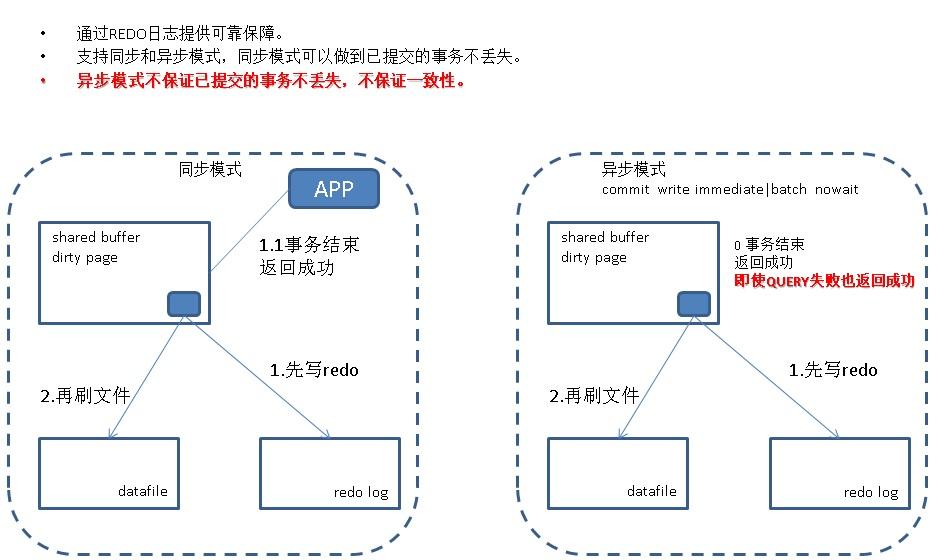    
    
### 2. 高可用    
通常支持三种高可用的架构。  
  
通过主备模式(data guard)以及集群套件提供高可用支持    
    
通过共享存储，RAC集群套件提供高可用支持, 注意应用连接设计时，不同的INSTANCE连接的应用应该访问不同的数据块，否则可能会因为GC锁带来性能严重下降。    
    
通过共享存储，主机集群套件提供高可用支持    
    
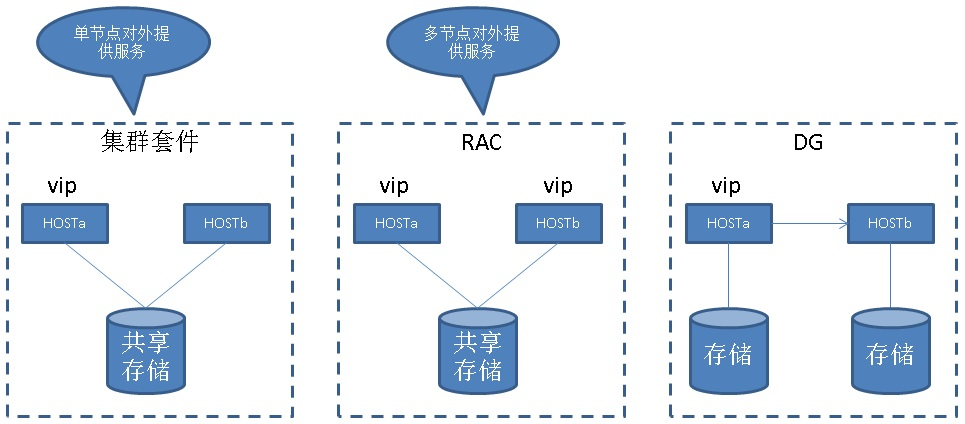    
    
### 3. 容灾    
通过存储层远程增量镜像提供异地容灾    
    
通过主备模式以及增量复制提供异地容灾    
    
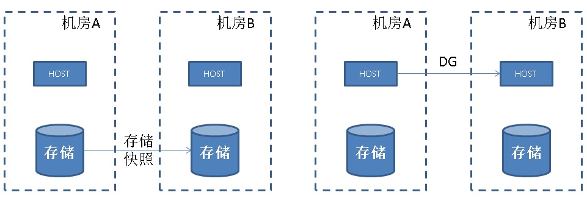    
    
### 4. 备份恢复    
通过归档和基础备份提供在线备份以及时间点恢复功能    
    
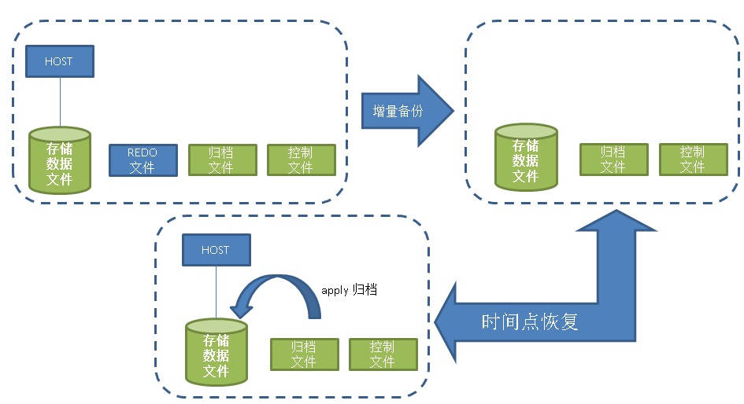    
    
### 5. 性能诊断    
AWR报告，通常包括    
    
TOP SQL、wait event stats、io time、db time    
    
### 6. 功能    
PL/SQL编程，C嵌入式SQL，SQL:2011标准    
    
#### 数据库编程    
许多传统企业，会使用PL/SQL开发语言，编写大量的存储过程、函数，处理复杂并且对一致性有强要求的业务逻辑。比如账务系统。  
    
支持C嵌入式开发    
    
#### SQL兼容性    
SQL: 2013    
    
GIS    
    
多种索引支持    
    
数据类型丰富    
    
#### 语法例子    
with, connect by, grouping set, rollup, cube    
    
许多内置的函数、操作符、聚合函数、窗口函数等    
    
SQL HINT、物化视图、RLS（行安全策略）    
    
### 7. 扩展性    
通过RAC和共享存储，扩展主机的方式扩展，支持CPU并行计算    
    
注意应用连接设计时，不同的INSTANCE连接的应用应该访问不同的数据块，否则可能会因为GC锁带来性能严重下降。    
    
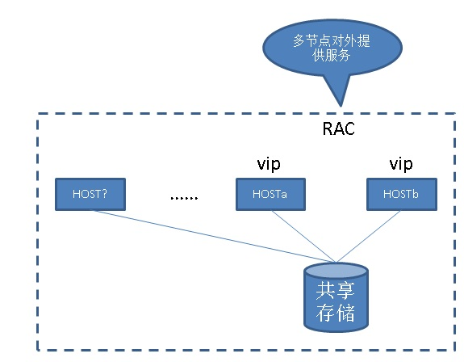    
  
12c开始支持sharding。  
    
### 8. 多租户隔离    
比如Oracle 12C提出的PDB    
    
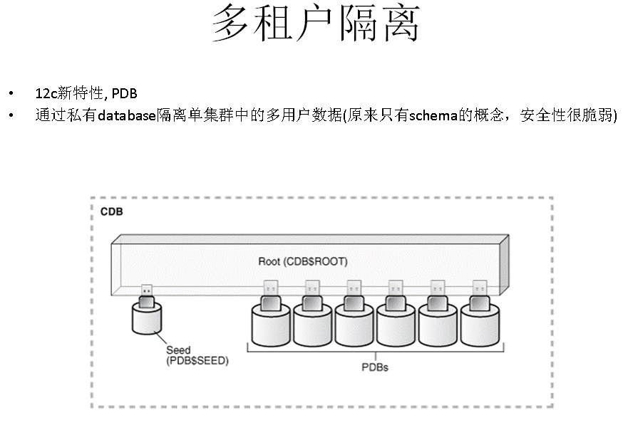    
    
### 9. 价格    
通常按核收费，按特性收费，LICENSE 昂贵    
    
## 用户痛点分析    
不管是传统企业，还是互联网企业，随着用户数据量的增长，数据库的处理能力逐渐成为瓶颈。    
    
### 1. 数据库的计算能力    
以ORACLE为例，传统的非MPP架构数据库，在执行大数据量运算时，受制于硬件限制，对于OLAP场景显得很吃力。    
    
### 2. 数据挖掘分析能力    
以ORACLE为例，传统的数据库没有机器学习套件，即使有，也受制于它的架构，无法发挥应对数据挖掘分析需求。    
    
### 3. 扩展能力    
RAC的扩展能力受到共享存储的限制，存储容易成为瓶颈    
    
RAC的模式下面，必须确保APP不会跨实例访问相同的数据块，否则GC锁冲突严重，性能比单节点下面明显。    
    
### 4. 可编程能力    
支持的服务端编程语言仅PL/SQL, C。    
    
不支持高级的类型扩展，函数扩展，OP扩展，索引扩展。    
    
不适合企业快速发展的IT需求。    
    
### 5. 价格    
昂贵    
    
## DT时代企业对数据的处理需求    
除了对数据库基本的增删改查需求，备份恢复容灾需求外。企业对数据处理的要求越来越高。    
    
比如很多时候，用户可能要实时的对数据进行清洗、分析、或者根据数据触发事件。    
    
随着更多的业务接入IT系统，用户需要存储越来越多的非结构化的数据、贴近实际需求的数据（比如人像、化学分子式、X光片、基因串、等等现实世界的数据属性），很多数据库在这种情况下显得力不从心，只能靠应用程序来处理，由于数据离计算单元越来越远，效率变得低下。    
    
     
  
总结起来，DT时代对数据处理的需求可以归为几类:  
  
1\. 流式计算  
  
2\. 传统OLTP需求  
  
3\. 离线分析  
  
4\. 在线分析  
  
5\. 图计算  
  
细分后，你会发现IT架构越来越庞大，已经不是单一产品能解决的问题了。  
  
数据类型也可以进一步的细分：  
  
1\. 数值、字符串、字节流、数组、分词、等常用类型  
  
2\. 文本  
  
3\. 图片、视频、等多媒体数据  
  
4\. 行业强相关数据，例如基因串、DNA、天文、地理、化学分子等。  
    
## 阿里云ApsaraDB OLTP+OLAP 解决方案剖析    
    
     
    
### 1. 通过以下PostgreSQL特性，可以支持OLTP + 本地的10TB量级OLAP需求。    
    
1\. LLVM   
  
llvm其实在分析场景用得比较多，但是在传统数据库中引入LLVM的不是很常见，特别是开源领域，目前能看到的有PostgreSQL。  
  
在重计算的SQL场景中，需要对大批量的数据进行运算，比如过滤数据，从代码层面来讲涉及到函数外的调用(get row后，需要对其进行filter涉及表达式的function调用)，interpretation耗费较大，通过profileing可以发现瓶颈出现在filter节点。  
  
针对性优化手段是尽量的减少函数切换，使用LLVM的接口可以帮你将这个部分的代码重新生成，在一个函数内完成所有的运算。  
  
2\. CPU并行计算  
  
搞Oracle的同学应该不陌生，调动多个CPU处理一个SQL请求。  
  
目前支持的场景包括全表扫描，JOIN，聚合，索引扫描。正在加入更多NODE的支持。  
  
3\. 向量运算与瓦片式存储、列存储插件  
  
传统的QUERY执行器在处理表达式时，是一行一行的处理模式。    
    
比如在处理(x+y)这个表达式时，首先读取一条记录的X值，然后读取这条记录的Y值，然后执行+操作符。然后将结果返回给上层node。    
    
然而，向量化执行器，一个操作符可以处理多个值，比如(x+y) ，x, y并不是scalar值，而是一批值的向量，向量化执行的结果也不是scalar值，而是向量。    
    
向量化执行模型的会引入一定的解释和函数调用overhead，但是对于OLAP场景的大批量数据处理，这个overhead可以忽略。    
    
既然向量化执行倾向于每次处理大批量的数据，那么在数据存放方面，也需要注意，比如OLAP经常需要对单列进行处理，使用列存储可以更好的和向量化执行模型结合起来。  
  
PostgreSQL 使用向量计算结合瓦片式存储后，TPC-H的Q1和Q6可以得到验证，性能有了10倍的提升。  
  
4\. GPU\FPGA加速  
  
PostgreSQL开放了 custom scan的编程接口，社区内有使用这个接口支持GPU或者FPGA来加速运算的插件，在OLAP场景，性能提升非常明显。  
    
5\. 聚合算子复用    
    
在统计学中，大多数的统计算法的中间结果都是可以共用的，例如sum,avg; 方差,相关性,count,sum等运算;      
    
PostgreSQL 很好的抓住了这样的特征，对初始条件一致，中间算法一致的聚合函数，在同一个分组中数据只需要计算一遍，大大降低了CPU的开销，提高了统计效率。    
  
6\. BRIN索引接口    
  
BRIN在流式数据，时序数据的检索中起到了巨大的作用，使用很小的索引就可以帮助用户快速的检索线性相关性很好的字段。   
    
### 2. 通过插件支持更多的业务数据类型需求    
    
比如JSONB、图片、人像、化学分子式、基因串、GIS、路由等。     
    
### 3. 流式数据处理方法    
使用PostgreSQL数据库的衍生产品-pipelineDB，可以与kafka, jstrom, PostgreSQL无缝结合，以及标准的SQL接口，兼容PostgreSQL.     
  
达到了单机（32C）每秒百万条记录的运算能力，除了支持简单的聚合，使用pipelinedb作为流计算引擎，依靠PG本身的特性和功能，可以支持更丰富的数据类型和处理逻辑。  
  
简化开发工作量，同时满足更多场景的需求，比如物联网的用户端、工厂等小型接入点，无法部署大量的jstrom集群，使用单台pipelinedb更加适合。  
    
### 4. PB级的分析、挖掘需求    
HybridDB基于开源的MPP数据库GPDB打造，继承了许多GPDB的特点，同时结合阿里云的云上组件，新增了一些功能。    
    
支持弹性的增加节点，扩容时按表分区粒度进行，因此不堵塞其他表分区的读写     
    
支持SQL标准以及诸多OLAP特性，    
    
支持行列混合存储、多级分区、块级压缩、多节点并行计算、多节点数据并行导入、    
    
支持丰富的数据类型，包括JSON、GIS、全文检索、语感、以及常见的文本、数值类型。    
    
支持MADLib机器学习库，有上百种常见的挖掘算法，通过SQL调用UDF训练数据集即可，结合MPP实现了多节点并行的挖掘需求    
    
支持数据节点间透明的数据重分布，广播，在进行多表JOIN时，支持任意列的JOIN，    
    
支持随机分布，或按列分布，支持多列哈希分布，    
    
支持哈希分区表、范围分区表、多级分区    
    
支持用户使用python \ java编写数据库端的UDF    
    
支持使用r客户端通过pivotalR包连接数据库，并将R的分析请求自动转换为MADlib库或SQL请求，实现R的隐式并行分析，同时数据和计算在一起，大幅提升了性能    
    
支持HLL估算数据类型，    
    
支持透明的访问阿里云高性能对象存储OSS，通过OSS EXT插件，可以透明的并行访问OSS的数据，    
    
支持PostgreSQL生态，吸纳更多已有的PostgreSQL生态中的特性    
    
### 5. 透明的冷热分离技术    
PostgreSQL, HybridDB结合云上OSS组件，可以支持更庞大业务数据需求。  
  
     
    
####  一份数据，共享分析需求    
在企业中，通常会有专门的分析师岗位，分析师在做建模前，需要经历很多次的试错，才能找到比较好的，可以固定的分析模型。    
    
试错期间，根据分析师的想法，结合业务表现，分析师可能需要对数据反复的训练，这就对数据库有两种要求    
    
1\. 实时响应    
    
2\. 不干扰正常业务    
    
实时响应对于MPP来说并不能，通常一个QUERY下去，毫秒级就可以响应，不需要等待任务调度。    
    
而不干扰正常业务，这一点，可能就需要好好商榷了，因为一个QUERY可能把资源用光，当然，我们可以通过HybridDB的资源组来进行控制，比如给分析师的QUERY资源优先级降到最低，尽量减少对业务的干扰。    
    
另外我们还有一种更加彻底的方法，数据共享，你可以把需要试错的数据集放到OSS中，然后启用一个空的PostgreSQL实例或者HybridDB实例，这些实例与生产实例完全无关，但是它可以去访问OSS的数据，建立外部表即可，分析师可以使用这些实例，对数据集进行分析，不会影响生产。    
    
### 6. 多个数据库的衔接    
通过rds_dbsync, dts, 或者云上BI、ETL厂商提供的ETL接口，几乎可以将任意数据源的数据实时的同步到HybridDB进行分析。    
    
通过 OSS 高速并行导入导出     
    
https://help.aliyun.com/document_detail/35457.html?spm=5176.8115115.382043.8.9YECO0    
    
https://github.com/aliyun/rds_dbsync    
    
https://yq.aliyun.com/articles/66902      
       
### 7. PostgreSQL, HybridDB 数据库可靠性分析    
原理与Oracle类似，同时支持用户自由选择同步或异步模式，异步模式牺牲了数据可靠性，提升性能，同时不影响一致性。    
    
     
    
### 8. 多副本    
     
    
用户可以根据事务对可靠性的要求，选择副本数。      
    
比如涉及用户账户的事务，至少要求2个副本。    
    
而对于与用户无关的日志事务，1个副本，甚至异步都可以。    
    
给用户设计应用时，提供了最大的灵活度。    
    
### 9. 高可用方案    
    
#### PostgreSQL高可用    
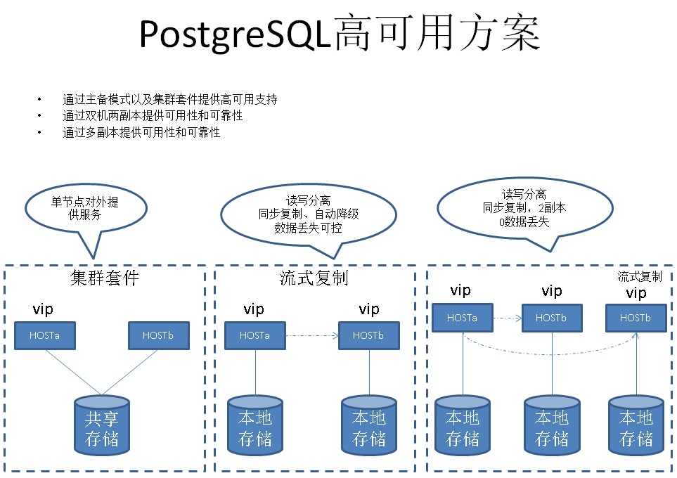     
    
PostgreSQL的高可用的方案与Oracle类似，支持共享存储的方案，同时还支持流式复制的多副本方案，可以做到数据的0丢失。    
    
#### HybridDB高可用    
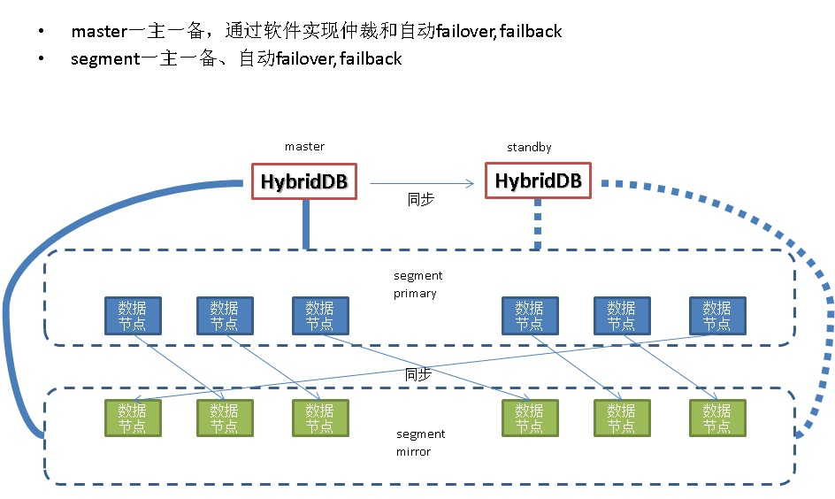     
    
HybridDB的高可用方案，为mirror的方式，同步复制，数据0丢失。      
    
master的fts负责数据节点的failover和failback。    
    
master节点的ha则交由上层的集群应用来解决。    
    
### 10. 容灾    
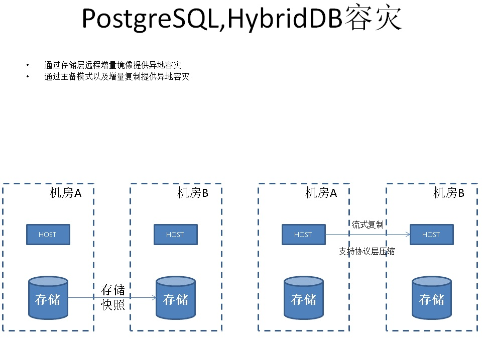     
    
对于多机房容灾，PostgreSQL和HybridDB在数据库层面支持流式的复制解决方案。    
    
同时还支持传统的存储或文件系统层面的镜像容灾。    
    
### 11. PostgreSQL备份与恢复    
对于存储在OSS对象存储中的数据，备份的只是DDL，即外部表的建表语句。    
    
而对于存储在数据库中的数据，使用的备份方法与Oracle类似，支持REDO的增量备份，也支持数据块级别的增量备份(具体见我写过的块级增量备份文档)。    
    
     
    
### 12. HybridDB备份与恢复    
每个节点并行的进行。    
    
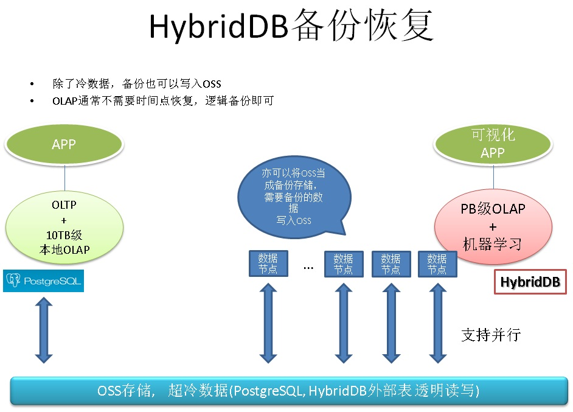     
    
### 13. 性能诊断和资源控制    
与Oracle类似，支持常见的指标TOP SQL、wait event stats、io time、db time    
    
同时支持对long query进行监控，包括long query的执行计划翻转，执行树中每个节点耗费的时间，对BUFFER产生的操作，物理读等    
    
对于HybridDB，使用resource queue控制不同用户对资源的使用    
    
### 14. 数据库功能(PostgreSQL)    
数据库功能方面，PostgreSQL超越了传统数据库所能COVER的数据类型、检索、和数据的运算。    
    
1\. 数据库编程    
    
服务端支持PLpgSQL、python、java、R、javascript、perl、tcl 等开发语言    
    
支持C嵌入式开发    
    
plpgsql与Oracle PL/SQL功能不相上下    
    
2\. SQL兼容性    
    
SQL: 2013    
    
3\. 语法例子    
    
with, connect by(用WITH支持), with, grouping set, rollup, cube    
    
many building functions, OP, aggs    
    
PostGIS、JSONB    
    
SQL PLAN HINT、物化视图、RLS（行安全策略）    
    
多种索引支持(btree, hash, brin, gin, gist, sp-gist, rum, bloom)    
    
支持全文检索、模糊查询、正则匹配（走索引）    
    
数据类型丰富（常用类型、数组、范围、估值类型、分词、几何、序列、地球、GIS、网络、大对象、比特串、字节流、UUID、XML、JSONB、复合、枚举、。。。。。。）    
    
4\. 支持ORACLE兼容包插件    
    
5\. 支持插件、支持FDW(透明访问外部数据)、支持LANGUAGE扩展    
    
6\. 支持多个聚合函数共用SFUNC，提升性能    
    
7\. 扩展能力    
    
支持用户自定义数据类型、操作符、索引、UDF、窗口、聚合    
    
### 15. 数据库功能(HybridDB)    
1\. 数据库编程    
    
服务端支持PLpgSQL、pljava等开发语言    
    
plpgsql与Oracle PL/SQL功能不相上下    
    
2\. SQL兼容性    
    
with, connect by(用WITH支持), with, grouping set, rollup, cube    
    
内置丰富的函数、操作符、聚合、窗口查询    
    
多种索引支持(btree)，支持函数索引，支持partial index    
    
支持全文检索、字符串模糊查询（fuzzystrmatch）    
    
数据类型丰富（数字、字符串、比特串、货币、字节流、时间、布尔、几何、网络地址、数组、GIS、XML、JSON、复合、枚举、。。。。。。）    
    
支持ORACLE兼容包插件orafunc    
    
3\. 支持列存、行存、混合存储    
    
4\. 支持隐式并行计算    
    
5\. 支持机器学习库    
    
6\. 支持支持OSS_EXT(透明访问OSS对象数据)    
    
7\. 支持HLL数据评估插件    
    
8\. 扩展能力    
    
支持用户自定义数据类型、操作符、索引、UDF、窗口、聚合    
    
### 16. 数据库扩展能力(PostgreSQL)    
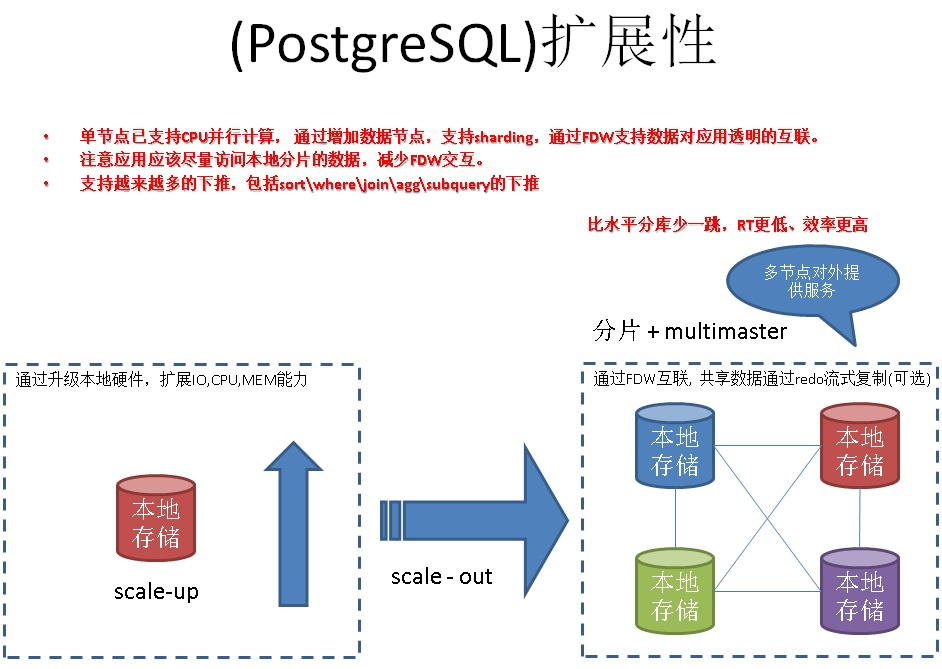     
    
### 17. 数据库扩展能力(HybridDB)    
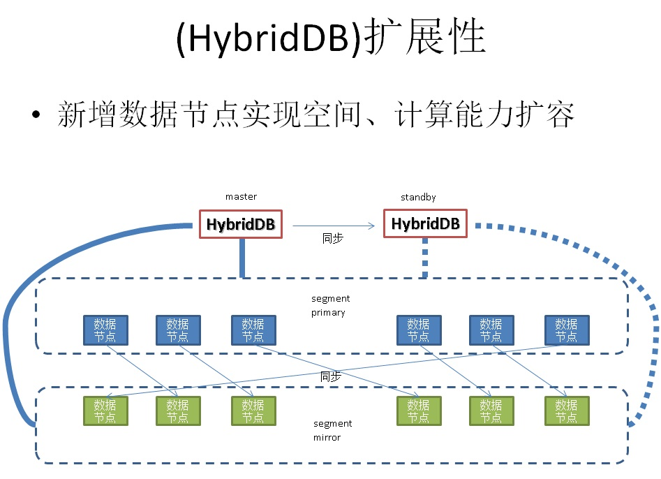     
    
### 18. 多租户功能    
    
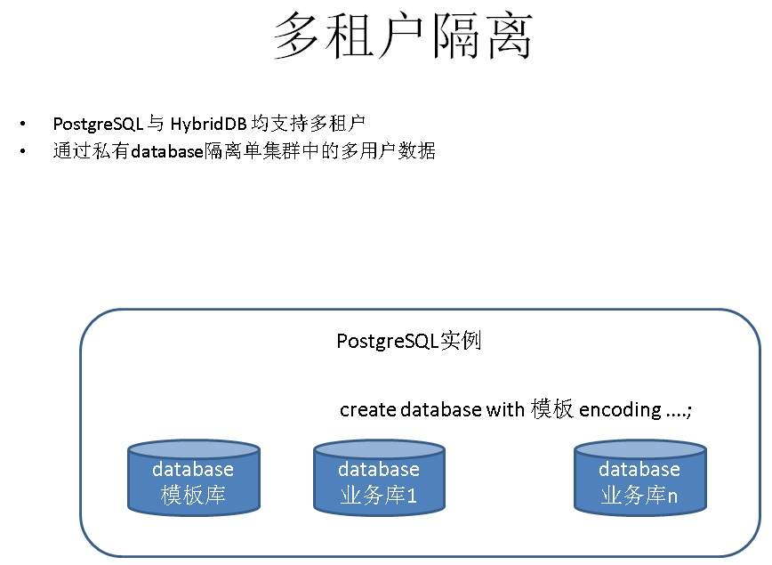     
    
## OLTP与OLAP的左右互博    
    
1\. 计算能力    
    
由于传统数据库，比如ORACLE并非MPP架构，在执行大数据量运算时，受制于硬件限制，以及设计理念的局限，对于10TB以上的OLAP场景很吃力。    
    
1\.1 解决办法    
    
PostgreSQL 多CPU并行计算、LLVM、向量计算、算子复用、BRIN等技术，解决TB级本地实时分析需求。    
    
PostgreSQL 数据通过REDO日志实时流式同步到HybridDB，解决PB级别OLAP场景需求。    
    
2\. 数据挖掘分析能力    
    
由于传统数据库，比如ORACLE没有机器学习套件，即使有，也受制于它的架构，无法发挥应对数据挖掘分析需求。    
    
2\.1 解决办法    
    
PostgreSQL和HybridDB都内置了MADLib机器学习库，支持几百种挖掘算法。    
    
通过R,Python数据库服务端编程，支持更多的挖掘需求。    
    
3\. 扩展能力    
    
RAC的扩展能力受到共享存储的限制，存储容易成为瓶颈    
    
RAC的模式下面，必须确保APP不会跨实例访问相同的数据块，否则GC锁冲突严重，性能比单节点下面明显。    
    
3\.1 解决办法    
    
PostgreSQL fdw based sharding + multimaster，支持单元化和水平扩展需求    
    
HybridDB MPP天然支持水平扩展    
    
4\. 可编程能力    
    
支持的服务端编程语言仅PL/SQL,C。    
    
不支持高级的类型扩展，函数扩展，OP扩展，索引扩展。    
    
不适合企业快速发展的IT需求。    
    
4\.1 解决办法    
    
PostgreSQL, HybridDB 支持plpgsql, C, python, java等多种语言的服务端编程。    
    
支持数据类型、索引、函数、操作符、聚合、窗口函数等扩展。    
    
## 一些不完全benchmark数据    
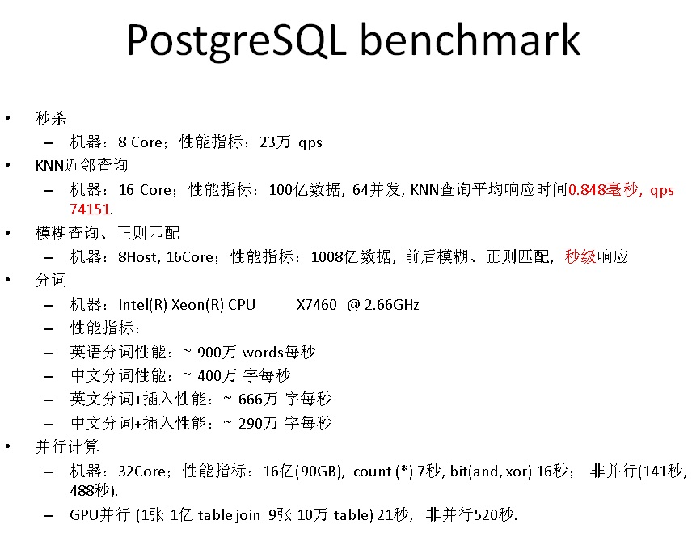     
      
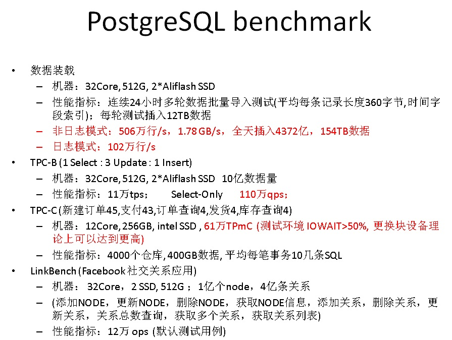     
      
## 一些不完全用户名单    
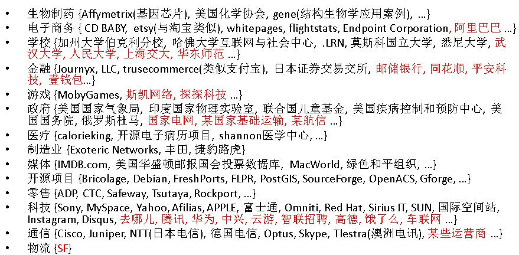     
    
## 方案小结    
在DT时代，让数据发挥价值是企业的真正需求，否则就是一堆废的并且还持续消耗企业人力，财力的数据。    
    
使用本方案，可以让企业更加轻松的驾驭暴增的数据，不管是什么数据类型，什么数据来源，是流式的还是在线或离线的数据分析需求，统统都能找到合理的方法来处置。    
    
1\. 高度兼容传统数据库，如Oracle    
    
包括数据类型，过程语言，语法，内置函数，自定义函数，自定义数据类型    
    
2\. 解决了传统数据库如Oracle方案的痛点    
    
3\. 计算能力    
    
PostgreSQL 多CPU并行计算、LLVM、向量计算、算子复用、BRIN等技术，解决TB级本地实时分析需求    
    
PostgreSQL 数据通过REDO日志实时流式同步到HybridDB，解决PB级别OLAP场景需求。    
    
4\. 数据挖掘分析能力    
    
PostgreSQL和HybridDB都内置了MADLib机器学习库，支持几百种挖掘算法。    
    
通过R,Python服务端编程，支持更多的挖掘需求。    
    
5\. 扩展能力    
    
PostgreSQL fdw based sharding + multimaster，支持单元化和水平扩展需求    
    
HybridDB MPP 天然支持水平扩展    
    
6\. 可编程能力    
    
PostgreSQL, HybridDB 支持plpgsql, C, python, java等多种语言的服务端编程。    
    
支持数据类型、索引、函数、操作符、聚合、窗口函数等扩展。    
    
7\. 支持估值类型    
    
快速的输出PV,UV,COUNT(DISTINCT)等估值。    
    
8\. 共享一份数据，构建多个分析实例    
    
通常在企业中有分析师的角色，分析师要对数据频繁的根据不同的分析框架进行分析，如果都发往主库，可能导致主库的计算压力变大。    
    
用户可以将历史数据，或者维度数据存放到共用的存储（如OSS），通过FDW共享访问，一份数据可以给多个实例加载分析。可以为分析师配备独立的计算实例，数据则使用FDW从共享存储（如OSS）加载，与主库分离。    
    
9\. HybridDB优势    
    
支持AO列存，块级压缩，机器学习，混合存储，MPP水平扩展，隐式并行，R，JAVA服务端编程语言支持，PB级别数据挖掘需求。    
    
    
## 参考文档    
    
PostgreSQL是一个 "很有爱" 的数据库，用心学习它，用心回报社会吧。             
             
           
    
[《元旦技术大礼包 - 2017金秋将要发布的PostgreSQL 10.0已装备了哪些核武器？》](./20170101_01.md)    
    
[《从天津滨海新区大爆炸、危化品监管聊聊 IT人背负的社会责任感》](../201612/20161228_01.md)      
    
[《PostgreSQL 重复 数据清洗 优化教程》](../201612/20161230_01.md)      
    
[《从难缠的模糊查询聊开 - PostgreSQL独门绝招之一 GIN , GiST , SP-GiST , RUM 索引原理与技术背景》](../201612/20161231_01.md)      
    
[《从真假美猴王谈起 - 让套牌车、克隆x 无处遁形的技术手段思考》](../201612/20161227_01.md)      
    
[《恭迎万亿级营销(圈人)潇洒的迈入毫秒时代 - 万亿user_tags级实时推荐系统数据库设计》](../201612/20161225_01.md)    
    
[《DBA专供 冈本003系列 - 数据库安全第一,过个好年》](../201612/20161224_01.md)      
    
[《聊一下PostgreSQL优化器 - in里面有重复值时PostgreSQL如何处理?》](../201612/20161223_01.md)    
    
[《从相似度算法谈起 - Effective similarity search in PostgreSQL》](../201612/20161222_02.md)    
            
[《一场IT民工 与 人贩子 之间的战争 - 只要人人都献出一点爱》](../201612/20161222_01.md)          
             
[《"物联网"流式处理应用 - 用PostgreSQL实时处理(万亿每天)》](../201512/20151215_01.md)             
            
[《为了部落 - 如何通过PostgreSQL基因配对，产生优良下一代》](../201606/20160621_01.md)            
            
[《流计算风云再起 - PostgreSQL携PipelineDB力挺IoT》](../201612/20161220_01.md)             
            
[《分析加速引擎黑科技 - LLVM、列存、多核并行、算子复用 大联姻 - 一起来开启PostgreSQL的百宝箱》](../201612/20161216_01.md)            
            
[《金融风控、公安刑侦、社会关系、人脉分析等需求分析与数据库实现 - PostgreSQL图数据库场景应用》](../201612/20161213_01.md)             
            
[《实时数据交换平台 - BottledWater-pg with confluent》](../201612/20161205_02.md)             
            
[《PostgreSQL 在视频、图片去重，图像搜索业务中的应用》](../201611/20161126_01.md)            
            
[《基于 阿里云 RDS PostgreSQL 打造实时用户画像推荐系统》](../201610/20161021_01.md)            
            
[《PostgreSQL 与 12306 抢火车票的思考》](../201611/20161124_02.md)             
            
[《门禁广告销售系统需求剖析 与 PostgreSQL数据库实现》](../201611/20161124_01.md)            
            
[《聊一聊双十一背后的技术 - 物流、动态路径规划》](../201611/20161114_01.md)              
            
[《聊一聊双十一背后的技术 - 分词和搜索》](../201611/20161115_01.md)              
            
[《聊一聊双十一背后的技术 - 不一样的秒杀技术, 裸秒》](../201611/20161117_01.md)              
            
[《聊一聊双十一背后的技术 - 毫秒分词算啥, 试试正则和相似度》](../201611/20161118_01.md)              
            
[《PostgreSQL 9.6 引领开源数据库攻克多核并行计算难题》](../201610/20161001_01.md)             
            
[《PostgreSQL 前世今生》](../201609/20160929_02.md)              
            
[《如何建立GIS测试环境 - 将openstreetmap的样本数据导入PostgreSQL PostGIS库》](../201609/20160906_01.md)              
            
[《PostgreSQL 9.6 单元化,sharding (based on postgres_fdw) - 内核层支持前传》](../201610/20161004_01.md)            
            
[《PostgreSQL 9.6 sharding + 单元化 (based on postgres_fdw) 最佳实践 - 通用水平分库场景设计与实践》](../201610/20161005_01.md)             
            
[《PostgreSQL 9.6 sharding based on FDW & pg_pathman》](../201610/20161027_01.md)            
            
[《PostgreSQL 9.5+ 高效分区表实现 - pg_pathman》](../201610/20161024_01.md)              
            
[《PostgreSQL 数据库安全指南》](../201506/20150601_01.md)             
            
[《PostgreSQL 9.6 黑科技 bloom 算法索引，一个索引支撑任意列组合查询》](../201605/20160523_01.md)             
            
[《PostgreSQL 使用递归SQL 找出数据库对象之间的依赖关系》](../201607/20160725_01.md)     
    
[《用PostgreSQL描绘人生的高潮、尿点、低谷 - 窗口/帧 or 斜率/导数/曲率/微积分?》](../201612/20161203_01.md)           
          
[《用PostgreSQL找回618秒逝去的青春 - 递归收敛优化》](../201612/20161201_01.md)             
            
[《PostGIS 在 O2O应用中的优势》](https://yq.aliyun.com/articles/50922)              
              
[《PostgreSQL 百亿地理位置数据 近邻查询性能》](https://yq.aliyun.com/articles/2999)          
    
[《HybridDB最佳实践,实现OLAP和OLTP一体化》](https://yq.aliyun.com/articles/66902)     
                     
                                            
  
  
  
  
  
  
  
  
## [digoal's 大量PostgreSQL文章入口](https://github.com/digoal/blog/blob/master/README.md "22709685feb7cab07d30f30387f0a9ae")
  
