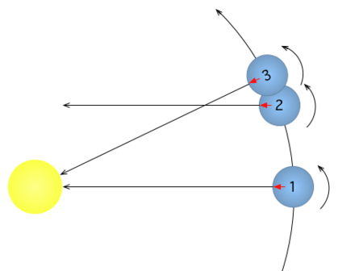
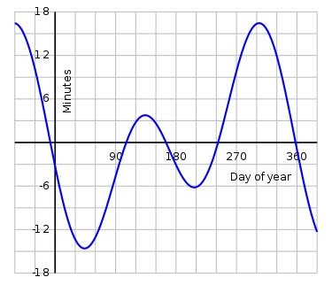
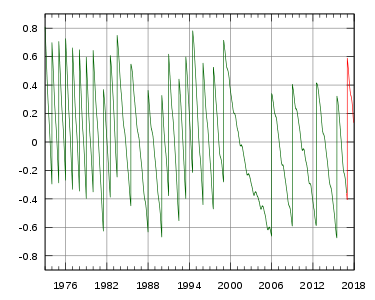
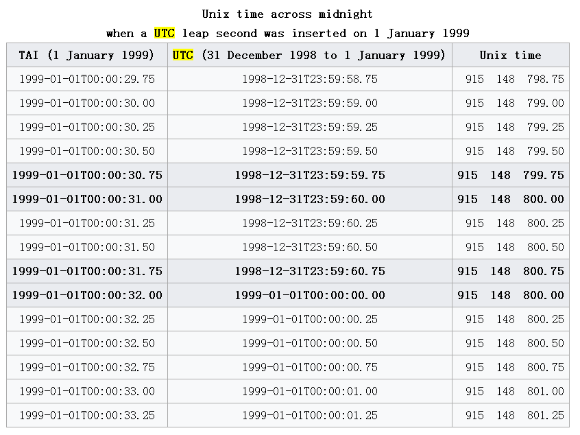
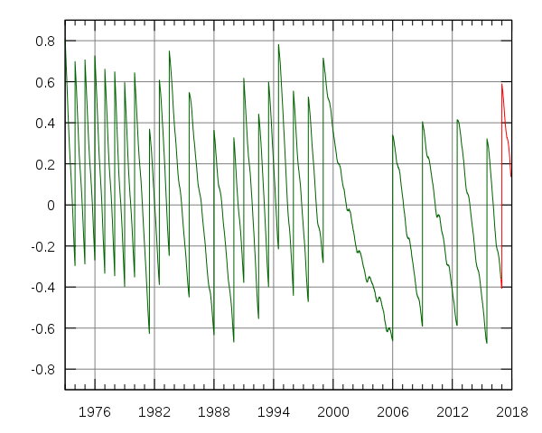

## Leap second , 闰秒 , 数据库 , PostgreSQL , Solar time , UNIX time , UTC , UT1     
                                                                                                          
### 作者                                                                                                         
digoal                                                                                                          
                                                                                                          
### 日期                                                                                                        
2017-01-02                  
                                                                                                          
### 标签                                                                                                        
PostgreSQL , Linux , POSIX , UT1 , UTC , leap second , 闰秒 , epoch , solar time , 太阳时 , unix time , Universal Time , Coordinated Universal Time , International Atomic Time                                                            
                                            
----                                                                                                        
                                                
## 背景       
什么是闰秒，为什么需要闰秒，闰秒会不会对数据库产生影响？    
    
要搞清楚这个问题，可以查一下维基百科，对闰秒的解释，牵扯出了一堆的概念，比如  
  
POSIX , UT1 , UTC , leap second , 闰秒 , epoch , solar time , 太阳时 , unix time , Universal Time , Coordinated Universal Time , International Atomic Time  
  
下面我小结一下。  
  
## 1. solar time , 太阳时  
https://en.wikipedia.org/wiki/Solar_time  
  
Solar time is a calculation of the passage of time based on the Sun's position in the sky.   
  
The fundamental unit of solar time is the day.   
  
Two types of solar time are apparent solar time (sundial time) and mean solar time (clock time).  
  
solar time是基于星体运转的时间，比如地球自转一周为一天。它的特点是很形象，但是不好在计算机中实施（或者说天体的运转受制于各种因素的影响并不稳定，目前的原子钟与之不能很好的对齐，这也是需要闰秒的开端）。  
  
The difference between this calculated mean solar time and Coordinated Universal Time (UTC) determines whether a leap second is needed.   
  
(The UTC time scale now runs on SI seconds, and the SI second, when adopted, was already a little shorter than the current value of the second of mean solar time.  
  
  
  
## 2. mean solar time , 平太阳时  
  
  
  
https://en.wikipedia.org/wiki/Solar_time  
  
http://baike.baidu.com/view/37435.htm  
  
平太阳时  
  
MT（mean solar time），简称“平时”，也就是我们日常生活中所使用的时间。  
  
太阳连续两次经过上中天的时间间隔，称为真太阳日。我们知道，地球沿着椭圆形轨道运动的，太阳位于该椭圆的一个焦点上，因此，在一年中，日地距离不断改变。根据开普勒第二定律，行星在轨道上运动的方式是它和太阳所联结的直线在相同时间内所划过的面积相等，可见，地球在轨道上做的是不等速运动，这样一来，一年之内真太阳日的长度便不断改变，不易选做计时单位，于是引进平太阳的概念。天文学上假定由一个太阳（平太阳）在天赤道上（而不是在黄赤道上）作等速运行，其速度等于运行在黄赤道上真太阳的平均速度，这个假想的太阳连续两次上中天的时间间隔，叫做一个平太阳日，这也相当于把一年中真太阳日的平均称为平太阳日[1]  ，并且把1/24平太阳日取为1平太阳时。通常所谓的“日”和“时”，就是平太阳日和平太阳时的简称。  
  
计时方法  
  
地球自转周期为基准的一种时间计量系统  
  
简称平时。由于真太阳的运行速度和时角变化率不均匀，不适于作为计量均匀时间的基准，在天文学中引入平太阳。它在天赤道上作匀速运动，其速度与真太阳的平均速度相一致。一个地方的平太阳时以平太阳对于该地子午圈的时角来度量。平太阳在该地下中天的瞬间作为平太阳时零时。平太阳时与平恒星时之间有相互换算关系。真太阳时与平太阳时的时刻之差即为时差。  
  
一年四季的真太阳日长短不等  
  
由于太阳在黄道上作变速运动，而黄道又向赤道倾斜，所以一年四季的真太阳日长短不等，在日常生活中使用不便。天文学上假设一个假想点，它每年和真太阳同时从春分点出发，也同时回到春分点来；不过它是从西向东在天球赤道上以均匀速度运行。这样的一个假想点叫平太阳。平太阳连续两次经过上中天的时间间隔，叫做平太阳日。1平太阳日有分为24平太阳时……等等。这个施加系统称为平太阳时，简称平时。平时是以平太阳下中天起算的，平太阳时定义为：平太阳的时角加12小时。  
  
虽然这样变化，但是生物钟可以很好的适应这种变化，但是电脑就不行了，这也是引出闰秒的原因之一，当然，指的不是日夜长短，而是日积月来带来的年的长度变化。  
  
## 3. UTC , Coordinated Universal Time  
目前全球应用最广泛的时间基准  
  
https://en.wikipedia.org/wiki/Coordinated_Universal_Time  
  
Coordinated Universal Time (French: Temps universel coordonné), abbreviated to UTC or CUT, is the primary time standard by which the world regulates clocks and time.   
  
It is within about 1 second of mean solar time at 0° longitude. it does not observe daylight saving time.   
  
It is one of several closely related successors to Greenwich Mean Time (GMT).   
  
For most purposes, UTC is considered interchangeable with GMT, but GMT is no longer precisely defined by the scientific community.  
  
虽然UTC基于平太阳时（静态的基于平太阳时），但是由于地球自转正在变慢，导致历年以来，UTC为了贴近平太阳时，已经出现过多次微调。  
  
   
  
Earth's rotational speed is very slowly decreasing because of tidal deceleration;   
  
this increases the length of the mean solar day.   
  
The length of the SI second was calibrated on the basis of the second of ephemeris time and can now be seen to have a relationship with the mean solar day observed between 1750 and 1892, analysed by Simon Newcomb.   
  
As a result, the SI second is close to 1/86400 of a mean solar day in the mid‑19th century.  
  
In earlier centuries, the mean solar day was shorter than 86,400 SI seconds, and in more recent centuries it is longer than 86,400 seconds.   
  
Near the end of the 20th century, the length of the mean solar day (also known simply as "length of day" or "LOD") was approximately 86,400.0013 s.  
  
For this reason, UT is now "slower" than TAI by the difference (or "excess" LOD) of 1.3 ms/day.  
  
  
  
## 4. UT1 , Universal Time  
https://en.wikipedia.org/wiki/Universal_Time  
  
UT1是基于地球自转（太阳时）的时间标准，注意UT里面除了UTC，其他都是基于太阳时的，UTC则是基于互联网原子时钟。    
  
Universal Time (UT) is a time standard based on Earth's rotation.   
  
It is a modern continuation of Greenwich Mean Time (GMT), i.e., the mean solar time on the Prime Meridian at Greenwich, London, UK.   
  
In fact, the expression "Universal Time" is ambiguous (when accuracy of better than a few seconds is required), as there are several versions of it, the most commonly used being Coordinated Universal Time (UTC) and UT1 (see below).   
  
All of these versions of UT, except for UTC, are based on Earth's rotation relative to distant celestial objects (stars and quasars), but with a scaling factor and other adjustments to make them closer to solar time.   
  
UTC is based on International Atomic Time, with leap seconds added to keep it within 0.9 second of UT1.  
  
因为UTC基于原子时钟，不受地球自转变慢的干扰，所以UTC会与UT1这种基于太阳时的计时标准产生偏差。  
  
UTC 需要通过闰秒，确保UTC与UT1之间的误差小于0.9秒。    
  
也就是互联网中所说的闰秒事件。    
  
## 5. International Atomic Time  
高精度时钟，全球通用的UTC就基于它。  
  
https://en.wikipedia.org/wiki/International_Atomic_Time  
  
International Atomic Time (TAI, from the French name Temps Atomique International) is a high-precision atomic coordinate time standard based on the notional passage of proper time on Earth's geoid。  
  
TAI as a time scale is a weighted average of the time kept by over 400 atomic clocks in over 50 national laboratories worldwide.  
  
The clocks are compared using GPS signals and two-way satellite time and frequency transfer.  
  
Due to the signal averaging it is an order of magnitude more stable than its best clock alone would be.  
  
The majority of the clocks are caesium clocks;   
  
the definition of the SI second is written in terms of caesium.   
  
## 6. unix time , POSIX time , Epoch time    
https://en.wikipedia.org/wiki/Unix_time  
  
为了计算机的使用，将时间数字化，以UTC为基准，计算偏移量，本质上也是基于互联网原子时钟，所以随着地球自转变慢，UTC与太阳时一定是会存在误差的。    
  
每天固定的86,400秒，基于UTC，UTC发生闰秒时，由于UNIX TIME的算法是固定的每天86,400秒，所以闰秒时会出现重复值。  
  
Unix time is a system for describing instants in time, defined as the number of seconds that have elapsed since 00:00:00 Coordinated Universal Time (UTC), Thursday, 1 January 1970, not counting leap seconds.  
  
It is used widely in Unix-like and many other operating systems and file formats.   
  
Because it does not handle leap seconds, it is neither a linear representation of time nor a true representation of UTC.  
  
Unix time may be checked on most Unix systems by typing date +%s on the command line.  
  
Example:   
  
1483297869 (ISO 8601: 2017-01-01T19:11:09Z)  
  
the Unix time when this page was last generated  
  
UTC中的闰秒例子，unix time的数字化表述为重复表现  
  
  
  
## leap second  
前面已经说了，由于地球自转变慢，导致UTC与UT1产生了误差，闰秒是一种修正UTC与太阳时偏差的一种手段，历史上已经经历过很多次的闰秒动作。  
  
  
  
Leap seconds are inserted or removed when necessary to keep UTC within one second of mean solar time (UT1).   
  
Irregularities in the rotation of the Earth cause mean solar time to deviate from UTC.   
  
Without leap seconds, UTC time would slowly drift apart from mean solar time.  
  
https://time.is/time_zone_news/2016_will_end_with_a_leap_second  
  
https://time.is/leapsecond  
  
https://en.wikipedia.org/wiki/Leap_second  
  
## PostgreSQL如何处理闰秒?  
PostgreSQL 基于UTC计时，所以UTC如何处理，它就如何处理，支持闰秒时60秒的写法。    
  
例如 '2016-12-31 23:59:60' 这种写法兼容，使用正常。       
  
https://www.postgresql.org/docs/9.1/static/functions-datetime.html  
  
测试  
  
```  
postgres=# create table leap_test(id int, ts timestamp, ut numeric, ts_text text);  
CREATE TABLE  
postgres=# insert into leap_test values (1, '2016-12-31 23:59:59 UTC', extract(epoch from timestamp '2016-12-31 23:59:59 UTC'), '2016-12-31 23:59:59 UTC');  
INSERT 0 1  
postgres=# insert into leap_test values (1, '2016-12-31 23:59:60 UTC', extract(epoch from timestamp '2016-12-31 23:59:60 UTC'), '2016-12-31 23:59:60 UTC');  
INSERT 0 1  
postgres=# insert into leap_test values (1, '2017-01-01 00:00:00 UTC', extract(epoch from timestamp '2017-01-01 00:00:00 UTC'), '2017-01-01 00:00:00 UTC');  
INSERT 0 1  
postgres=# select ctid,* from leap_test;  
 ctid  | id |         ts          |     ut     |         ts_text           
-------+----+---------------------+------------+-------------------------  
 (0,1) |  1 | 2016-12-31 23:59:59 | 1483228799 | 2016-12-31 23:59:59 UTC  
 (0,2) |  1 | 2017-01-01 00:00:00 | 1483228800 | 2016-12-31 23:59:60 UTC  // 闰秒识别   
 (0,3) |  1 | 2017-01-01 00:00:00 | 1483228800 | 2017-01-01 00:00:00 UTC  
(3 rows)  
```  
  
很显然，PostgreSQL的处理与UTC一致。  
  
如果你的系统需要识别闰秒，可以加一个触发器，对于闰秒的记录，包括Primary key记录下来。存储为TEXT即可。 这样就可以精准的还原当时的情况。     
     
当然，你也可以再添加一列TEXT来存储它，当闰秒是记录，当不是闰秒时设置为空.  
  
我们即能使用时间的索引，也能使用文本的索引, 还可以使用partial index, 表达式索引来达到特殊的目的。   
    
## MySQL 5.7 如何处理闰秒?  
  
MySQL目前还不支持60秒的写法，闰秒时必须使用unix time来表示时间，否则会报错。  

例如 '2008-12-31 23:59:60' 这种写法会报错    
  
如下  
  
http://dev.mysql.com/doc/refman/5.7/en/time-zone-leap-seconds.html  
  
Leap second values are returned with a time part that ends with :59:59.   
  
This means that a function such as NOW() can return the same value for two or three consecutive seconds during the leap second.   
  
It remains true that literal temporal values having a time part that ends with :59:60 or :59:61 are considered invalid.  
  
```  
mysql> CREATE TABLE t1 (  
         a INT,  
         ts TIMESTAMP DEFAULT NOW(),  
         PRIMARY KEY (ts)  
       );  
Query OK, 0 rows affected (0.01 sec)  
  
mysql> -- change to UTC  
mysql> SET time_zone = '+00:00';  
Query OK, 0 rows affected (0.00 sec)  
  
mysql> -- Simulate NOW() = '2008-12-31 23:59:59'  
mysql> SET timestamp = 1230767999;  
Query OK, 0 rows affected (0.00 sec)  
  
mysql> INSERT INTO t1 (a) VALUES (1);  
Query OK, 1 row affected (0.00 sec)  
  
mysql> -- Simulate NOW() = '2008-12-31 23:59:60'  
mysql> SET timestamp = 1230768000;  
Query OK, 0 rows affected (0.00 sec)  
  
mysql> INSERT INTO t1 (a) VALUES (2);  
Query OK, 1 row affected (0.00 sec)  
  
mysql> -- values differ internally but display the same  
mysql> SELECT a, ts, UNIX_TIMESTAMP(ts) FROM t1;  
+------+---------------------+--------------------+  
| a    | ts                  | UNIX_TIMESTAMP(ts) |  
+------+---------------------+--------------------+  
|    1 | 2008-12-31 23:59:59 |         1230767999 |  
|    2 | 2008-12-31 23:59:59 |         1230768000 |  
+------+---------------------+--------------------+  
2 rows in set (0.00 sec)  
  
mysql> -- only the non-leap value matches  
mysql> SELECT * FROM t1 WHERE ts = '2008-12-31 23:59:59';  
+------+---------------------+  
| a    | ts                  |  
+------+---------------------+  
|    1 | 2008-12-31 23:59:59 |  
+------+---------------------+  
1 row in set (0.00 sec)  
```  
  
MySQL 不支持60秒的写法，如果用户的应用程序使用UTC的话，就会因为闰秒产生问题。    
  
```  
mysql> -- the leap value with seconds=60 is invalid  
mysql> SELECT * FROM t1 WHERE ts = '2008-12-31 23:59:60';  
Empty set, 2 warnings (0.00 sec)  
To work around this, you can use a comparison based on the UTC value actually stored in column, which has the leap second correction applied:  
  
mysql> -- selecting using UNIX_TIMESTAMP value return leap value  
mysql> SELECT * FROM t1 WHERE UNIX_TIMESTAMP(ts) = 1230768000;  
+------+---------------------+  
| a    | ts                  |  
+------+---------------------+  
|    2 | 2008-12-31 23:59:59 |  
+------+---------------------+  
1 row in set (0.00 sec)  
```  
  
## 参考  
https://en.wikipedia.org/wiki/Universal_Time  
  
https://en.wikipedia.org/wiki/Coordinated_Universal_Time  
   
https://en.wikipedia.org/wiki/Unix_time  
  
https://en.wikipedia.org/wiki/Solar_time  
  
https://en.wikipedia.org/wiki/Leap_second  
  
https://time.is/time_zone_news/2016_will_end_with_a_leap_second  
  
https://time.is/leapsecond  
  
http://stackoverflow.com/questions/16539436/unix-time-and-leap-seconds  
  
https://en.wikipedia.org/wiki/Unix_time  
  
https://www.postgresql.org/docs/9.1/static/functions-datetime.html  
  
https://git.postgresql.org/gitweb/?p=postgresql.git;a=commit;h=675684fc23fd4287966694b1f108846bc14b6895  
  
https://git.postgresql.org/gitweb/?p=postgresql.git;a=commit;h=4fd8d6b3e77eb00cfd7bb8d3d130b147ba0d60f3   
  
https://www.postgresql.org/message-id/flat/84BC7AB0D621A74893EC9C9E151293B022653DDD%40ESESSMB207.ericsson.se#84BC7AB0D621A74893EC9C9E151293B022653DDD@ESESSMB207.ericsson.se  
    
http://dev.mysql.com/doc/refman/5.7/en/time-zone-leap-seconds.html  
  
                                            
                                                    
                   
  
<a rel="nofollow" href="http://info.flagcounter.com/h9V1"  ></a>  
  
  
  
  
  
  
## [digoal's 大量PostgreSQL文章入口](https://github.com/digoal/blog/blob/master/README.md "22709685feb7cab07d30f30387f0a9ae")
  
