## 想挑战AlphaGO吗？先和PostgreSQL玩一玩?? PostgreSQL与人工智能(AI)
##### [TAG 15](../class/15.md)
                                                                                
### 作者                                                                               
digoal                                                                                
                                                                                
### 日期                                                                               
2017-01-06                                                                                    
                                                                                
### 标签                                                                              
PostgreSQL , AI , 人工智能 , 神经网络 , 机器学习 , MADlib , Greenplum , 物联网 , IoT , pivotalR , R      
                                                                                
----                                                                              
                                           
## 背景          
想必很多朋友这几天被铺天盖地的AI战胜60位围棋高手的新闻，我们不得不承认，人工智能真的越来越强了。     
    
http://wallstreetcn.com/node/283152    
    
1月4日晚，随着古力认输，Master对人类顶尖高手的战绩停留在60胜0负1和，而令人尴尬的是这唯一一场和棋还是因为棋手掉线系统自动判和，并不是棋盘上的局势真的势均力敌了。包括聂卫平、柯洁、朴廷桓、井山裕太在内的数十位中日韩围棋高手，在30秒一手的快棋对决中落败。Master（最新版AlphaGo）网测以60战全胜的战绩收场！    
    
在横扫中日韩顶尖棋手，豪取47连胜之后，昨晚神秘的“Master”再战世界冠军棋手朴廷桓，元晟溱，和中国第一人柯洁。随着柯洁黯然投子，Master的连胜纪录已扩大至50盘，难逢敌手。    
    
今天早些时候，Master挑战人类顶尖高手第54局，中国棋圣、64岁的聂卫平出战。《新闻晨报》报道，本局“Master”特意把比赛用时调整为每方1分钟一手，以示对聂卫平的尊敬，最终执白的聂卫平以7目半的劣势落败。神秘AI围棋Master战胜棋圣聂卫平，54连胜。    
    
## 人工智能知识背景    
内容请参考  
    
http://mp.weixin.qq.com/s/Chln4htaCq1rQWTpPgFYZg    
  
### 参考以上文章萃取后的内容  
    
大概的思想就是通过模仿生物神经网络的学习和训练方法，让计算掌握学习能力。     
    
生物神经网络的学习过程是这样的，首先我们天生就有五官，能听到声音、看见世界、闻到气味、尝到酸甜苦辣、触摸到一切。  
  
五官是神经网络的输入之一，而另一方面，我们的长辈会教我们东西，比如你告诉小孩这是香蕉，小孩的神经会根据看到的形状、颜色等特征，以及你告诉他的（事实）做一个碰撞，调整连接这两个点之间的信号强弱，形成固定的模式，学习成功。  
    
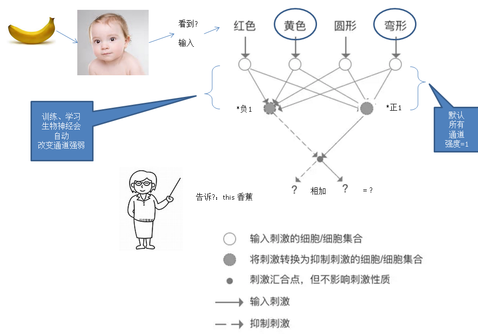  
    
人工神经网络和生物神经网络类似，也需要训练，从而修正通道的信号强弱，掌握知识（判断能力）。  
  
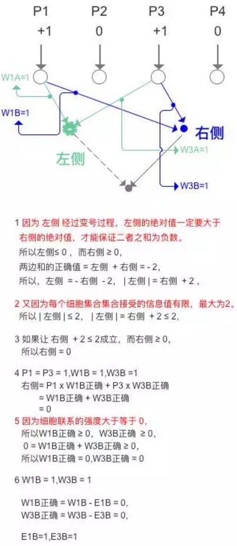  
  
比如我们有一批水果的照片，并且人工将这些照片设置属性，存入数据库大概是这样的。  
  
表1  
  
水果图片|水果名称|水果唯一编号  
---|---|---  
图片1|香蕉|2  
图片2|香蕉|2  
图片3|香蕉|2  
图片4|苹果|-2  
图片5|苹果|-2  
图片6|苹果|-2  
  
因为图片是数字化的，计算机可以读取（识别）图片的特征（比如每个像素的三原色等信息），同时第三个字段是水果的唯一编号，也就是说不通的香蕉图片，它们的编号都是一样的。  
  
1\. 图片就和小宝宝眼睛看到的东西一样。  
  
2\. 而水果编号就像大人教小宝宝的。  
  
从而形成了与生物神经网络类似的训练模式，通过这样的方式，来调整两个输入点之间通道的强弱，适配唯一编号，就达到了人工神经网络的学习过程。  
  
训练完成后，计算机就可以从输入（图片），就能识别它是什么（通过输入与不同通道相乘，在进行正负反馈相加得到结果），结果与已有的水果唯一编号对比，即可知道它是什么？  
  
训练过程有两个输入（图片、水果唯一编号），而处理过程是一个输入（图片），一个输出（计算得到的值，与水果编号进行比较从而知道它是什么）。  
    
上面介绍了最为简单的人工神经网络，那么它与机器学习和人工智能的关系是什么？  
  
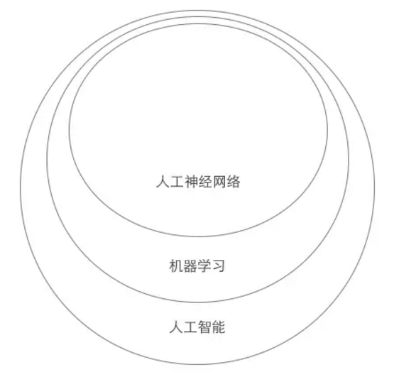  
  
人工神经网络是机器学习的一种技术，有关人工神经网络的我们了解了，那么不是人工神经网络的机器学习是什么呢？大数据这个词大家都不陌生，大数据技术依赖的是数据中的数据关系，通过大数据训练的算法中很多就是机器学习中不是人工神经网络的部分，比如根据你购物的时候购买特定商品的频率推送相应的广告。  
  
除了人工神经网络，深度学习也是经常被提起的名词，人工神经网络与深度学习又是什么关系？我们首先要对人工神经网络有一个粗浅的了解，如下图。  
  
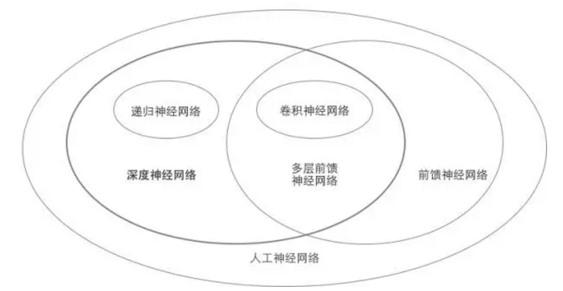  
  
在识别苹果和香蕉的例子中，我们构建的其实是趋近于两层的单层神经网络，甚至形成了部分侧向抑制的能力，如果四个输入信号都被刺激，那么最终的刺激为0。  
  
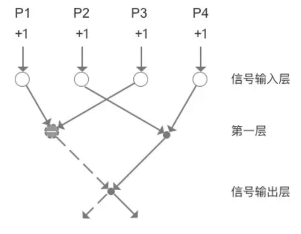  
  
人工神经网络有一个非常重要的部分，深度神经网络，是指含有多个隐层的神经网络，如下图。  
  
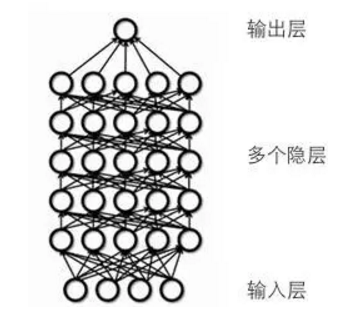  
  
依赖深度神经网络的机器学习被称为深度学习。深度神经网络本身有几个重要的类型：递归神经网络，卷积神经网络，前馈神经网络，这几种神经网络有不同的应用场景。深度学习又可以分为无监督学习和监督学习，如下图。  
  
  
  
我们知道神经网络是要通过数据来训练（学习）的，所以如果先要通过具有相关性的标签化的数据训练网络，那么这部分数据就是通过人的监督来筛选的，比如我们构建的简单的识别水果的神经网络，就是先把苹果和香蕉的数据准备好，再输入进去，这就是监督学习。假如不去告诉人工神经网络什么是对，什么是错，什么是苹果，什么是香蕉，而是通过神经网络自己进行聚类学习，除了识别出一般的香蕉苹果，甚至发现特殊品种，这种就是无监督学习，或者叫非监督学习。  
  
从人工智能到无监督学习，整体的概念联系图就是这样的。  
  
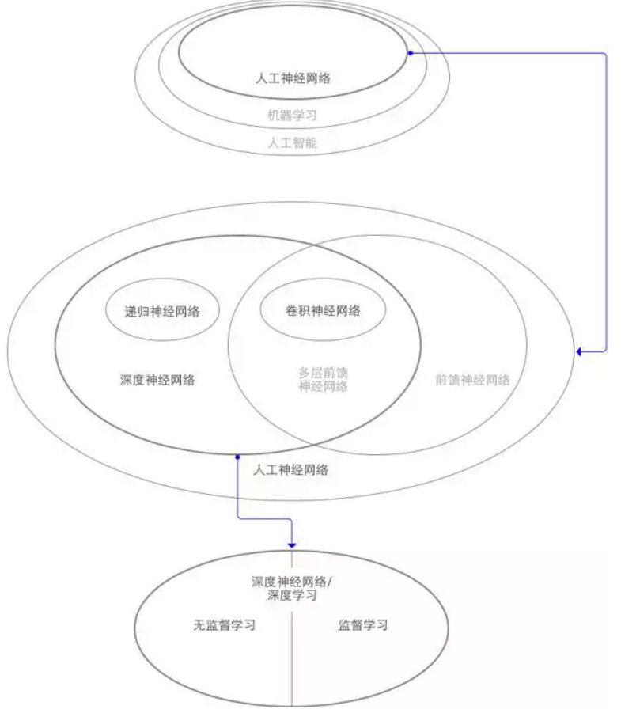  
  
人工神经网络的发展并非一帆风顺，从最早的单层神经网络到现在的多层神经网络经历了七十多年的研究，如下是人工神经网络的发展简史。  
  
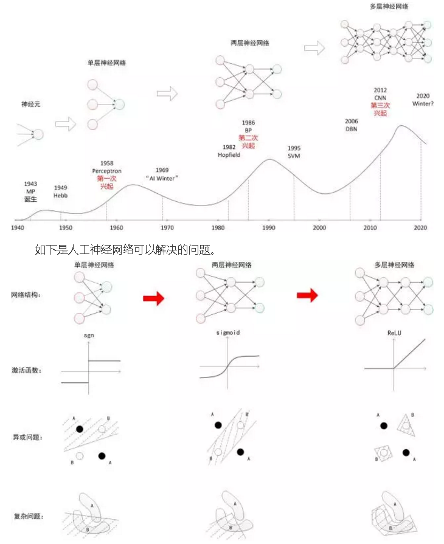  
  
如下是人工神经网络所使用的算法。  
  
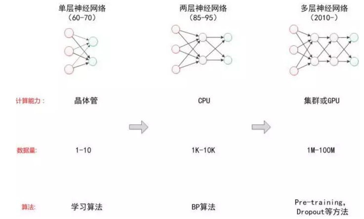  
  
### 深度神经网络的两个应用领域  
  
1\. CNN—图像识别（参考 [用CNN来识别鸟or飞机的图像](http://mp.weixin.qq.com/s?__biz=MzA3MzQwNzI3OA==&mid=2651381959&idx=1&sn=1b920dd476849d88b67a2ef1cf3ed8fc&chksm=84f3ce86b3844790627d2f15256aff0753be1f0b0623da64aaa7357d73e8ed14c415061acb27&scene=21#wechat_redirect) ）  
  
2\. RNN-语音/语义识别 （参考 [循环神经网络RNN打开手册](http://mp.weixin.qq.com/s?__biz=MzA3MzQwNzI3OA==&mid=2651381709&idx=1&sn=1697cba21960594b188cc5b53cbd108e&chksm=84f3f18cb384789a279a3c41e6d2c07fe7312f4bda82a1c0e5e1ff4243f34beea4ed0643056a&scene=21#wechat_redirect) ）  
  
3\. CNN与RNN的融合  
  
机器从获取到的数据集合，通过训练，达到一定程度后，智力超过人类也属于正常现象。甚至可能未来也能像人类一样进化，冥想。  
  
### 数据与建模  
  
我们知道深度学习所采用的技术关键点之一是通过数据训练网络，那么究竟需要多少数据？在2016年初，互联网出现了一个引爆性的新闻，谷歌收购的Deep Mind公司通过以CNN为基础的神经网络形成的人工智能Alphago在围棋上击败了李世石，在这个网络开始训练的时候已经相当于下了三千万的棋谱，而与李世石下棋的时候这个数据达到一亿，当然人类完成一局要一小时，而Alphago只要一秒。  
  
Alphago的示例是不是说一定要海量的数据才能训练神经网络？这样对于没有大量计算资源（分布式的Alphago调用了1202个CPU和176个GPU），以及庞大数据库（3000万棋谱）的小公司和个人是不是就意味着无法使用人工智能？  
  
有另一家公司在Deep Mind公司被收购前与其齐名，Vicarious，该公司的特点是大量借鉴神经科学家和脑科学家的科研成果进入人工智能领域，在其科研人员中有20%来自相关领域。我们在上文中提到了神经细胞的侧向抑制作用对轮廓识别和马太效应的影响，那么如果把这种能力模拟成神经网络中的某些函数会是什么结果？  
  
Vicarious在NIPS、神经信息处理系统大会(Conference and Workshop on Neural Information Processing Systems)上发表了这样一篇论文，利用了脑科学上非常成熟的成果：人类的神经系统系统普遍存在的侧向抑制的现象，在他们在模型上实现了侧向约束（Lateral Constraints），如下图。  
  
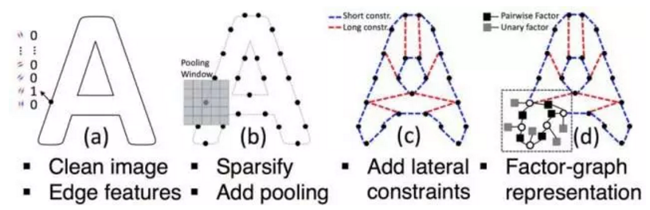  
  
注意右下角的放大小图中的灰色方块一元因子（Unary factor），这是与水平细胞相似的关键。在字母验证码识别这个具体问题上，Vicarious基于生成型形状模型的系统能够只用1406张图片作为训练集，就超越了利用深度学习的800万图片达到的效果。  
  
所以当模型足够优化的时候可以大大减少对数据的需求量，而借鉴神经科学的发展无疑是一个有效的途径。  
  
## 与PostgreSQL数据库下一场国际象棋    
虽然这个例子与AI无关，只是简单的自定义规则的棋类游戏。但是它反映的是PostgreSQL的开放性，以及扩展能力。  
  
PostgreSQL的用户有点疯狂，看看他们怎么让PostgreSQL和你玩国际象棋吧。    
    
http://pgxn.org/dist/pg2podg/    
    
http://pgxn.org/dist/pgchess/    
    
### 部署    
    
```    
wget http://api.pgxn.org/dist/pg2podg/0.1.3/pg2podg-0.1.3.zip     
wget http://api.pgxn.org/dist/pgchess/0.1.7/pgchess-0.1.7.zip    
    
unzip pg2podg-0.1.3.zip     
unzip pgchess-0.1.7.zip    
    
cd pg2podg-0.1.3    
make clean; make; make install    
    
cd ../pgchess-0.1.7    
make clean; make; make install    
```    
    
部署结束    
    
```    
-rw-r--r-- 1 digoal users   94 Jan  6 10:05 pg2podg.control    
-rw-r--r-- 1 digoal users  21K Jan  6 10:05 pg2podg--0.1.3.sql    
-rw-r--r-- 1 digoal users  131 Jan  6 10:05 pgchess.control    
-rw-r--r-- 1 digoal users  14K Jan  6 10:05 pgchess--0.1.7.sql    
    
-rwxr-xr-x 1 digoal users  22K Jan  6 10:05 chess.so    
```    
    
将游戏加载到PostgreSQL数据库中    
    
```    
psql -h 127.0.0.1    
psql (9.4.5)    
Type "help" for help.    
    
postgres=# create extension pgchess;    
CREATE EXTENSION    
postgres=# create extension pg2podg;    
CREATE EXTENSION    
```    
    
新增了3个数据类型    
    
```    
postgres=# \dT    
                                    List of data types    
 Schema |   Name   |                              Description                                  
--------+----------+-----------------------------------------------------------------------    
 public | game     | "moves" is encoded via the %% operators, which throughout this file  +    
        |          | represent a compact textual encoding of a game or a move.            +    
        |          |                                                                      +    
        |          | "board" could be computed from "moves", but only for standard games  +    
        |          | (e.g. not for chess problems). Also, remembering "board" is efficient+    
        |          | and simpler.                                                         +    
        |          |                                                                      +    
        |          | The first 64 characters of "board" represent the chessgame locations;+    
        |          | the next four characters encode castling information, and the last   +    
        |          | character is the piece captured in the last move (if any).    
 public | location |     
 public | move     |     
(3 rows)    
```    
    
玩法参考    
    
http://api.pgxn.org/src/pgchess/pgchess-0.1.7/doc/pgchess-QUICKSTART.md    
    
游戏在以下目录    
    
```    
pgchess-0.1.7/test/sql/play    
    
-rw-r--r-- 1 digoal users 160 Oct 19  2012 Human_v_PG.sql    
-rw-r--r-- 1 digoal users 148 Oct 19  2012 new-game.sql    
-rw-r--r-- 1 digoal users 160 Oct 19  2012 PG_v_Human.sql    
-rw-r--r-- 1 digoal users 160 Oct 19  2012 PG_v_PG.sql    
-rw-r--r-- 1 digoal users 242 Oct 19  2012 reset-stats.sql    
-rw-r--r-- 1 digoal users 933 Oct 19  2012 _.sql    
-rw-r--r-- 1 digoal users 854 Oct 19  2012 view-stats.sql    
```    
    
玩法如下      
    
Step 1    
    
```    
------    
    
Load a default game in the chessboard:    
    
    \i /home/digoal/pgchess-0.1.7/test/sql/play/new-game.sql    
```    
    
Step 2    
    
```    
------    
    
View the game in FEN notation    
    
    gianni=# select %% game from status;    
                             ?column?                             
    ----------------------------------------------------------    
     rnbqkbnr/pppppppp/8/8/8/8/PPPPPPPP/RNBQKBNR w KQkq - 0 1    
    (1 row)    
```    
    
Step 2a (optional)    
    
```    
------------------    
    
If you are using a VT100-compatible terminal, you can use an enhanced    
graphical display.    
    
First make sure that the background is lighter than the foreground (e.g.    
black on white); then issue    
    
    gianni=# \pset format unaligned    
    Output format is unaligned.    
    
and check that it is working by displaying the current game:    
    
gianni=# select # game from status;    
```    
    
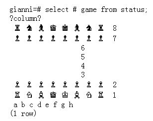      
    
    
Step 3    
    
```    
------    
    
Now you can start a CPU v CPU game:    
    
    \i play/PG_v_PG.sql    
    
you can interrupt the game with CTRL-C.     
    
Since each half-move is executed in a separate transaction, the game will be left in the state corresponding to the last completed move.    
```    
    
由于我的终端问题，无法正确的显示图标       
    
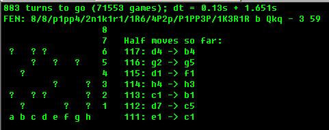      
    
    
请使用9.4来把玩，9.5以后这个接口有变，需要修改以上两个游戏模块的代码。    
    
```    
extern ArrayIterator array_create_iterator(ArrayType *arr, int slice_ndim);    
```    
    
一个小小的下棋插件，主要体现的是PostgreSQL的开放性，不要把它当成单纯的数据库，它是一个真正的面向对象数据库。    
    
可以实现很多有趣的特性，能帮助业务解决很多的问题，比如本文末尾有很有很实用的例子，已经帮到了很多用户。       
    
## Greenplum与PostgreSQL 的机器学习库MADlib    
    
### 数据库中的人工神经网络体现    
http://www.infoq.com/cn/articles/in-database-analytics-sdg-arithmetic    
    
PS:  这篇文档中有一些描述的点并不正确（比如UDFA实际上是支持并行的）。    
    
把机器学习库内置到database中（通过database的UDF）有许多优点，执行机器学习算法时只需要编写相应的SQL语句就可以了，同时database本身作为分析的数据源，使用非常方便，大大降低了机器学习的应用门槛。  
  
在数据库中，如何编写聚合，在Greenplum如何编写两阶段聚合：  
    
[《hll插件在Greenplum中的使用 以及 分布式聚合函数优化思路》](../201608/20160825_02.md)    
    
[《performance tuning about multi-rows query aggregated to single-row query》](../201212/20121217_01.md)    
    
[《PostgreSQL aggregate function customize》](../201212/20121218_02.md)    
    
实际上MADlib库中包含了大量的机器学习算法，可以通过已有的数据集合进行训练（比如前面提到的苹果、香蕉等水果的照片）。（类似前面提到的生物神经网络的学习过程）    
    
那么madlib是什么样的呢？    
  
### 一张图读懂madlib    
http://blog.163.com/digoal@126/blog/static/163877040201510119148173    
    
  
  
回归分析，决策树，随机森林，贝叶斯分类，向量机，风险模型，KMEAN聚集，文本挖掘，。。。等。  
  
一个线性回归的例子，对应上图  
  
supervised learning -> generalized linear models -> linear regression  
  
  
   
如果你是R的数据科学家，并且不习惯使用SQL的话，使用pivotalR的R包就可以了，左边是R的写法。右边对应的是SQL。  
  
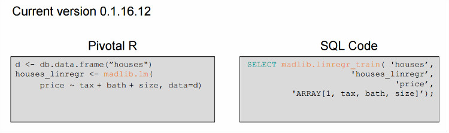  
  
话说如果要预测每个时间点的11.11销售额，可以用到它了。  
  
PostgreSQL用户来搞数据挖掘有天然优势。  
  
  
  
madlib的使用手册：  
  
http://doc.madlib.net/latest/index.html  
  
http://madlib.incubator.apache.org/docs/latest/group__grp__tsa.html    
  
pivotalR使用手册  
  
https://cran.r-project.org/web/packages/PivotalR/PivotalR.pdf  
     
### IoT、大数据与人工智能的结合    
人工智能的基础是数据、学习算法。  
  
1\. 人的数据来自哪里？  
  
五官  
  
2\. 人工智能的数据来自哪里？  
  
IoT，万物产生的数字化数据  
  
3\. 人的数据存哪里？如何处理？  
  
大脑？  
  
4\. 人工智能的数据存哪里？如何处理？  
  
为了提高数据传输的速度，数据和计算单元越近越好，否则不仅需要传输，还需要在计算端暂存，耗时耗力。   
  
所以数据库本身具备计算能力是最好的，否则一次运算需要的数据在网络上传输花的时间可能是无法想象的。   
    
有了菜谱，那么就开始找食材吧：  
  
Greenplum, PostgreSQL, MADLib, R, pivotalR 是不错的食材，可以烧出什么样的菜呢？  
    
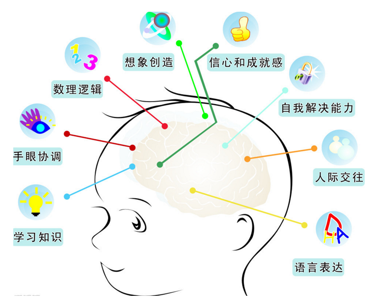      
    
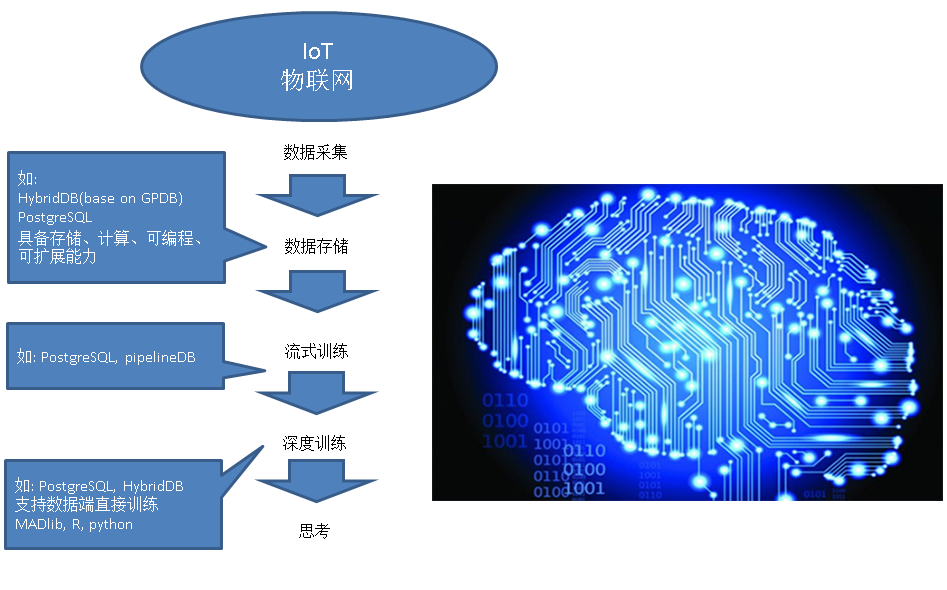      
  
阿里云已提供PostgreSQL(支持R, pivotalR, MADlib), HybridDB(base on GPDB, 支持R, pivotalR, MADlib), 用户只需要安心做好开发即可，不需要操心基础设施本身的维护问题了。   
   
## 参考文档      
PostgreSQL也是一个 "很有爱" 的数据库，用心学习它，用心回报社会吧。               
               
             
      
[《元旦技术大礼包 - ApsaraDB的左右互搏术 - 解决企业痛处 TP+AP混合需求 - 无须再唱《爱你痛到不知痛》》](./20170101_02.md)      
    
[《Leap second , 闰秒 , 数据库 , PostgreSQL , Solar time , UNIX time , UTC , UT1》](./20170102_01.md)     
    
[《元旦技术大礼包 - 2017金秋将要发布的PostgreSQL 10.0已装备了哪些核武器？》](./20170101_01.md)      
      
[《从天津滨海新区大爆炸、危化品监管聊聊 IT人背负的社会责任感》](../201612/20161228_01.md)        
      
[《PostgreSQL 重复 数据清洗 优化教程》](../201612/20161230_01.md)        
      
[《从难缠的模糊查询聊开 - PostgreSQL独门绝招之一 GIN , GiST , SP-GiST , RUM 索引原理与技术背景》](../201612/20161231_01.md)        
      
[《从真假美猴王谈起 - 让套牌车、克隆x 无处遁形的技术手段思考》](../201612/20161227_01.md)        
      
[《恭迎万亿级营销(圈人)潇洒的迈入毫秒时代 - 万亿user_tags级实时推荐系统数据库设计》](../201612/20161225_01.md)      
      
[《DBA专供 冈本003系列 - 数据库安全第一,过个好年》](../201612/20161224_01.md)        
      
[《聊一下PostgreSQL优化器 - in里面有重复值时PostgreSQL如何处理?》](../201612/20161223_01.md)      
      
[《从相似度算法谈起 - Effective similarity search in PostgreSQL》](../201612/20161222_02.md)      
              
[《一场IT民工 与 人贩子 之间的战争 - 只要人人都献出一点爱》](../201612/20161222_01.md)            
               
[《"物联网"流式处理应用 - 用PostgreSQL实时处理(万亿每天)》](../201512/20151215_01.md)               
              
[《为了部落 - 如何通过PostgreSQL基因配对，产生优良下一代》](../201606/20160621_01.md)              
              
[《流计算风云再起 - PostgreSQL携PipelineDB力挺IoT》](../201612/20161220_01.md)               
              
[《分析加速引擎黑科技 - LLVM、列存、多核并行、算子复用 大联姻 - 一起来开启PostgreSQL的百宝箱》](../201612/20161216_01.md)              
              
[《金融风控、公安刑侦、社会关系、人脉分析等需求分析与数据库实现 - PostgreSQL图数据库场景应用》](../201612/20161213_01.md)               
              
[《实时数据交换平台 - BottledWater-pg with confluent》](../201612/20161205_02.md)               
              
[《PostgreSQL 在视频、图片去重，图像搜索业务中的应用》](../201611/20161126_01.md)              
              
[《基于 阿里云 RDS PostgreSQL 打造实时用户画像推荐系统》](../201610/20161021_01.md)              
              
[《PostgreSQL 与 12306 抢火车票的思考》](../201611/20161124_02.md)               
              
[《门禁广告销售系统需求剖析 与 PostgreSQL数据库实现》](../201611/20161124_01.md)              
              
[《聊一聊双十一背后的技术 - 物流、动态路径规划》](../201611/20161114_01.md)                
              
[《聊一聊双十一背后的技术 - 分词和搜索》](../201611/20161115_01.md)                
              
[《聊一聊双十一背后的技术 - 不一样的秒杀技术, 裸秒》](../201611/20161117_01.md)                
              
[《聊一聊双十一背后的技术 - 毫秒分词算啥, 试试正则和相似度》](../201611/20161118_01.md)                
              
[《PostgreSQL 9.6 引领开源数据库攻克多核并行计算难题》](../201610/20161001_01.md)       
    
[《PostgreSQL 前世今生》](../201609/20160929_02.md)                
              
[《如何建立GIS测试环境 - 将openstreetmap的样本数据导入PostgreSQL PostGIS库》](../201609/20160906_01.md)                
              
[《PostgreSQL 9.6 单元化,sharding (based on postgres_fdw) - 内核层支持前传》](../201610/20161004_01.md)              
              
[《PostgreSQL 9.6 sharding + 单元化 (based on postgres_fdw) 最佳实践 - 通用水平分库场景设计与实践》](../201610/20161005_01.md)               
              
[《PostgreSQL 9.6 sharding based on FDW & pg_pathman》](../201610/20161027_01.md)              
              
[《PostgreSQL 9.5+ 高效分区表实现 - pg_pathman》](../201610/20161024_01.md)                
              
[《PostgreSQL 数据库安全指南》](../201506/20150601_01.md)               
              
[《PostgreSQL 9.6 黑科技 bloom 算法索引，一个索引支撑任意列组合查询》](../201605/20160523_01.md)               
              
[《PostgreSQL 使用递归SQL 找出数据库对象之间的依赖关系》](../201607/20160725_01.md)       
      
[《用PostgreSQL描绘人生的高潮、尿点、低谷 - 窗口/帧 or 斜率/导数/曲率/微积分?》](../201612/20161203_01.md)             
            
[《用PostgreSQL找回618秒逝去的青春 - 递归收敛优化》](../201612/20161201_01.md)               
              
[《PostGIS 在 O2O应用中的优势》](https://yq.aliyun.com/articles/50922)                
                
[《PostgreSQL 百亿地理位置数据 近邻查询性能》](https://yq.aliyun.com/articles/2999)            
      
[《HybridDB最佳实践, 实现OLAP和OLTP一体化》](https://yq.aliyun.com/articles/66902)       
    
[《hll插件在Greenplum中的使用 以及 分布式聚合函数优化思路》](../201608/20160825_02.md)    
  
[《performance tuning about multi-rows query aggregated to single-row query》](../201212/20121217_01.md)    
  
[《PostgreSQL aggregate function customize》](../201212/20121218_02.md)    
        
                                       
                              
  
<a rel="nofollow" href="http://info.flagcounter.com/h9V1"  ></a>  
  
  
  
  
  
  
## [digoal's 大量PostgreSQL文章入口](https://github.com/digoal/blog/blob/master/README.md "22709685feb7cab07d30f30387f0a9ae")
  
