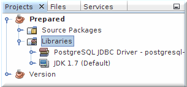

## PostgreSQL Java tutorial   
                                                                                  
### 作者                                                                                 
digoal                                                                                  
                                                                                  
### 日期                                                                                 
2017-01-06                                                                                       
                                                                                  
### 标签                                                                                
PostgreSQL , Java , php , ruby , python , C                                                                                                                                            
                                                                                  
----                                                                                
                                             
## 背景            
转自 http://zetcode.com/db/postgresqljavatutorial/  
  
## 正文  
This is a Java tutorial for the PostgreSQL database. It covers the basics of PostgreSQL programming with Java. In this tutorial, we use the PostgreSQL JDBC Driver driver. It is the official JDBC driver for PostgreSQL. The examples were created and tested on Ubuntu Linux. There is a similar MySQL Java tutorial, Spring JdbcTemplate tutorial, or Apache Derby tutorial on ZetCode.  
  
### JDBC  
  
JDBC is an API for the Java programming language that defines how a client may access a database. It provides methods for querying and updating data in a database. JDBC is oriented towards relational databases. From a technical point of view, the API is as a set of classes in the java.sql package. To use JDBC with a particular database, we need a JDBC driver for that database.  
  
### About PostgreSQL database  
  
PostgreSQL is a powerful, open source object-relational database system. It is a multi-user database management system. It runs on multiple platforms including Linux, FreeBSD, Solaris, Microsoft Windows, and Mac OS X. PostgreSQL is developed by the PostgreSQL Global Development Group.  
  
### Before we start  
  
We need to install postgresql package. We need to install the JDK, Java Development Kit, for compiling and running Java programs. Finally, we need the PostgreSQL Java driver. If we are using NetBeans IDE, than we have already the driver at hand. Inside the Projects tab, right click on the Libraries node and select Add Library option. From the list of options, select PostgreSQL JDBC Driver. Note that the driver may be older. Older driver may cause problems on newer PostgreSQL versions. In such a case, we can add the newest driver from by choosing add JAR/Folder and selecting a driver from the filesystem.  
  
    
  
Figure: NetBeans project libraries  
  
If we want to compile the examples from the command line, go to the site http://jdbc.postgresql.org/download.html and download the latest PostgreSQL Java Driver.  
  
```  
$ javac zetcode/Version.java  
$ java -cp .:lib/postgresql.jdbc4.jar zetcode/Version  
PostgreSQL 9.1.2 on i686-pc-linux-gnu, compiled by   
gcc-4.6.real (Ubuntu/Linaro 4.6.1-9ubuntu3) 4.6.1, 32-bit  
```  
  
Assuming that we have put the driver JAR file into the lib directory and using package zetcode, we compile and run the first example this way.  
  
If we don't already have PostgreSQL installed, we must install it.  
  
```  
$ sudo apt-get install postgresql  
```  
  
This command installs the PostgreSQL server and various other packages.  
  
```  
$ sudo update-rc.d -f postgresql remove  
 Removing any system startup links for /etc/init.d/postgresql ...  
   /etc/rc0.d/K21postgresql  
   /etc/rc1.d/K21postgresql  
   /etc/rc2.d/S19postgresql  
   /etc/rc3.d/S19postgresql  
   /etc/rc4.d/S19postgresql  
   /etc/rc5.d/S19postgresql  
   /etc/rc6.d/K21postgresql  
```  
  
If we install the PostgreSQL database from packages, it is automatically added to the start up scripts of the operating system. If we are only learning to work with the database, it is unnecessary to start the database each time we boot the system. The above command removes any system startup links for the PostgreSQL database.  
  
```  
$ /etc/init.d/postgresql status  
Running clusters: 9.1/main  
  
$ service postgresql status  
Running clusters: 9.1/main   
```  
  
We check if the PostgreSQL server is running. If not, we need to start the server.  
  
```  
$ sudo service postgresql start  
 * Starting PostgreSQL 9.1 database server        [ OK ]  
```  
  
On Ubuntu Linux we can start the server with the service postgresql start command.  
  
```  
$ sudo service postgresql stop  
[sudo] password for janbodnar:   
 * Stopping PostgreSQL 9.1 database server        [ OK ]   
```  
  
We use the service postgresql stop command to stop the PostgreSQL server.  
  
Next, we are going to create a new database user and a new database. We will use the createuser and createdb commands. These are installed with the PostgreSQL database.  
  
```  
$ sudo -u postgres createuser -W user12  
Shall the new role be a superuser? (y/n) n  
Shall the new role be allowed to create databases? (y/n) y  
Shall the new role be allowed to create more new roles? (y/n) n  
Password:   
```  
  
We create a new database user. The user is called user12 and it is created with a password (-W option).  
  
```  
$ sudo -u postgres createdb testdb -O user12  
```  
  
We create a new testdb database. We will use this database throughout the tutorial. We set the new user to be the owner of the database (the -O option).  
  
### PostgreSQL version  
  
If the following program runs OK, then we have everything installed OK. We check the version of the PostgreSQL server.  
  
```  
package zetcode;  
  
import java.sql.Connection;  
import java.sql.DriverManager;  
import java.sql.ResultSet;  
import java.sql.SQLException;  
import java.sql.Statement;  
import java.util.logging.Level;  
import java.util.logging.Logger;  
  
public class Version {  
  
    public static void main(String[] args) {  
  
        Connection con = null;  
        Statement st = null;  
        ResultSet rs = null;  
  
      
        String url = "jdbc:postgresql://localhost/testdb";  
        String user = "user12";  
        String password = "34klq*";  
  
        try {  
            con = DriverManager.getConnection(url, user, password);  
            st = con.createStatement();  
            rs = st.executeQuery("SELECT VERSION()");  
  
            if (rs.next()) {  
                System.out.println(rs.getString(1));  
            }  
  
        } catch (SQLException ex) {  
            Logger lgr = Logger.getLogger(Version.class.getName());  
            lgr.log(Level.SEVERE, ex.getMessage(), ex);  
  
        } finally {  
            try {  
                if (rs != null) {  
                    rs.close();  
                }  
                if (st != null) {  
                    st.close();  
                }  
                if (con != null) {  
                    con.close();  
                }  
  
            } catch (SQLException ex) {  
                Logger lgr = Logger.getLogger(Version.class.getName());  
                lgr.log(Level.WARNING, ex.getMessage(), ex);  
            }  
        }  
    }  
}  
```  
  
We connect to the database and get some info about the PostgreSQL server.  
  
```  
String url = "jdbc:postgresql://localhost/testdb";  
```  
  
This is the connection URL for the PostgreSQL database. Each driver has a different syntax for the URL. In our case, we provide a host, a port and a database name.  
  
```  
con = DriverManager.getConnection(url, user, password);  
```  
  
We establish a connection to the database, using the connection URL, user name and password.  
  
```  
st = con.createStatement();  
```  
  
The createStatement() method of the connection object creates a Statement object for sending SQL statements to the database.  
  
```  
rs = st.executeQuery("SELECT VERSION()");  
```  
  
The executeQuery() method of the connection object executes the given SQL statement, which returns a single ResultSet object. The ResultSet is a table of data returned by a specific SQL statement.  
  
```  
if (rs.next()) {  
    System.out.println(rs.getString(1));  
}  
```  
  
A ResultSet object maintains a cursor pointing to its current row of data. Initially the cursor is positioned before the first row. The next() method moves the cursor to the next row. If there are no rows left, the method returns false. The getString() method retrieves the value of a specified column. The first column has index 1.  
  
```  
} catch (SQLException ex) {  
    Logger lgr = Logger.getLogger(Version.class.getName());  
    lgr.log(Level.SEVERE, ex.getMessage(), ex);  
  
}  
```  
  
In case of an exception, we log the error message. For this console example, the message is displayed in the terminal.  
  
```  
try {  
    if (rs != null) {  
        rs.close();  
    }  
    if (st != null) {  
        st.close();  
    }  
    if (con != null) {  
        con.close();  
    }  
...  
```  
  
Inside the finally block, we close the database resources. We also check if the objects are not equal to null. This is to prevent null pointer exceptions. Otherwise we might get a NullPointerException, which would terminate the application and might leave the resources not cleaned up.  
  
```  
} catch (SQLException ex) {  
    Logger lgr = Logger.getLogger(Version.class.getName());  
    lgr.log(Level.WARNING, ex.getMessage(), ex);  
}  
```  
  
We log an error message when the resources could not be closed.  
  
```  
$ javac zetcode/Version.java  
$ java -cp .:lib/postgresql.jdbc4.jar zetcode.Version   
PostgreSQL 9.1.2 on i686-pc-linux-gnu, compiled by gcc-4.6.real   
(Ubuntu/Linaro 4.6.1-9ubuntu3) 4.6.1, 32-bit  
```  
  
This is a sample output of the program.  
  
### Creating and populating tables  
  
Next we are going to create database tables and fill them with data. These tables will be used throughout this tutorial.  
  
```  
DROP TABLE IF EXISTS books, authors, testing, images;  
  
CREATE TABLE IF NOT EXISTS authors (  
    id serial PRIMARY KEY,   
    name VARCHAR(25)  
);  
  
CREATE TABLE IF NOT EXISTS books (  
    id serial PRIMARY KEY,   
    author_id INT references authors(id), title VARCHAR(100)  
);  
  
CREATE TABLE IF NOT EXISTS testing(id INT);  
CREATE TABLE IF NOT EXISTS images(id serial, data bytea);  
  
INSERT INTO authors(id, name) VALUES(1, 'Jack London');  
INSERT INTO authors(id, name) VALUES(2, 'Honore de Balzac');  
INSERT INTO authors(id, name) VALUES(3, 'Lion Feuchtwanger');  
INSERT INTO authors(id, name) VALUES(4, 'Emile Zola');  
INSERT INTO authors(id, name) VALUES(5, 'Truman Capote');  
  
INSERT INTO books(id, author_id, title) VALUES(1, 1, 'Call of the Wild');  
INSERT INTO books(id, author_id, title) VALUES(2, 1, 'Martin Eden');  
INSERT INTO books(id, author_id, title) VALUES(3, 2, 'Old Goriot');  
INSERT INTO books(id, author_id, title) VALUES(4, 2, 'Cousin Bette');  
INSERT INTO books(id, author_id, title) VALUES(5, 3, 'Jew Suess');  
INSERT INTO books(id, author_id, title) VALUES(6, 4, 'Nana');  
INSERT INTO books(id, author_id, title) VALUES(7, 4, 'The Belly of Paris');  
INSERT INTO books(id, author_id, title) VALUES(8, 5, 'In Cold blood');  
INSERT INTO books(id, author_id, title) VALUES(9, 5, 'Breakfast at Tiffany');  
```  
  
We have a tables.sql file. It creates four database tables, authors, books, testing, and images. We place a foreign key constraint on the author_id column of the books table. We fill the authors and books tables with initial data.  
  
```  
$ psql testdb  
psql (9.1.2)  
Type "help" for help.  
  
testdb=#   
  
testdb=# \i tables.sql  
DROP TABLE  
psql:tables.sql:6: NOTICE:  CREATE TABLE will create implicit   
    sequence "authors_id_seq" for serial column "authors.id"  
psql:tables.sql:6: NOTICE:  CREATE TABLE / PRIMARY KEY will create   
    implicit index "authors_pkey" for table "authors"  
CREATE TABLE  
...  
```  
  
The psql is a terminal-based front-end to PostgreSQL. We can use it to perfom interactive queries, issue them to PostgreSQL, and see the query results. Inside the psql tool, we import and execute the tables.sql file.  
  
```  
testdb=# \dt  
          List of relations  
 Schema |  Name   | Type  |   Owner     
--------+---------+-------+-----------  
 public | authors | table | janbodnar  
 public | books   | table | janbodnar  
 public | images  | table | janbodnar  
 public | testing | table | janbodnar  
(4 rows)  
```  
  
We check the created tables.  
  
### Prepared statements  
  
Now we will concern ourselves with prepared statements. When we write prepared statements, we use placeholders instead of directly writing the values into the statements. Prepared statements increase security and performance.  
  
In Java a PreparedStatement is an object which represents a precompiled SQL statement.  
  
```  
package zetcode;  
  
import java.sql.Connection;  
import java.sql.DriverManager;  
import java.sql.PreparedStatement;  
import java.sql.SQLException;  
import java.util.logging.Level;  
import java.util.logging.Logger;  
  
public class Prepared {  
  
    public static void main(String[] args) {  
  
        Connection con = null;  
        PreparedStatement pst = null;  
  
        String url = "jdbc:postgresql://localhost/testdb";  
        String user = "user12";  
        String password = "34klq*";  
  
        try {  
  
            int id = 6;  
            String author = "Trygve Gulbranssen";  
            con = DriverManager.getConnection(url, user, password);  
  
            String stm = "INSERT INTO authors(id, name) VALUES(?, ?)";  
            pst = con.prepareStatement(stm);  
            pst.setInt(1, id);  
            pst.setString(2, author);                      
            pst.executeUpdate();  
  
        } catch (SQLException ex) {  
            Logger lgr = Logger.getLogger(Prepared.class.getName());  
            lgr.log(Level.SEVERE, ex.getMessage(), ex);  
  
        } finally {  
  
            try {  
                if (pst != null) {  
                    pst.close();  
                }  
                if (con != null) {  
                    con.close();  
                }  
  
            } catch (SQLException ex) {  
                Logger lgr = Logger.getLogger(Prepared.class.getName());  
                lgr.log(Level.SEVERE, ex.getMessage(), ex);  
            }  
        }  
    }  
}  
```  
  
We add a new author to the authors table.  
  
```  
String stm = "INSERT INTO authors(id, name) VALUES(?, ?)";  
pst = con.prepareStatement(stm);  
```  
  
Here we create a prepared statement. When we write prepared statements, we use placeholders instead of directly writing the values into the statements. Prepared statements are faster and guard against SQL injection attacks. The ? is a placeholder, which is going to be filled later. In our case we will fill two values. An integer id and a string name.  
  
```  
pst.setInt(1, id);  
```  
  
A value is bound to the placeholder.  
  
```  
pst.setString(2, author);   
```  
  
Another value is bound to the placeholder.  
  
```  
pst.executeUpdate();  
```  
  
The prepared statement is executed. We use the executeUpdate() method of the statement object when we do not expect any data to be returned. This is when we create databases or execute INSERT, UPDATE, and DELETE statements.  
  
```  
$ javac zetcode/Prepared.java   
$ java -cp .:lib/postgresql.jdbc4.jar zetcode.Prepared  
  
testdb=# SELECT * FROM authors;  
 id |        name          
----+--------------------  
  1 | Jack London  
  2 | Honore de Balzac  
  3 | Lion Feuchtwanger  
  4 | Emile Zola  
  5 | Truman Capote  
  6 | Trygve Gulbranssen  
(6 rows)  
```  
  
We have a new author inserted into the table.  
  
For the following two examples, we will use the Testing table. We will execute a normal statement and a prepared statement 1000 times. We check if there is some difference in execution time.  
  
```  
package zetcode;  
  
import java.sql.Connection;  
import java.sql.DriverManager;  
import java.sql.SQLException;  
import java.sql.Statement;  
import java.util.logging.Level;  
import java.util.logging.Logger;  
  
  
public class NotPrepared {  
  
    public static void main(String[] args) {  
  
        Connection con = null;  
        Statement st = null;  
  
        String url = "jdbc:postgresql://localhost/testdb";  
        String user = "user12";  
        String password = "34klq*";  
  
        try {  
  
            con = DriverManager.getConnection(url, user, password);  
  
            st = con.createStatement();  
  
            for (int i=1; i<=1000; i++) {  
                String query = "INSERT INTO Testing(Id) VALUES(" + 2*i + ")";  
                st.executeUpdate(query);  
            }  
  
        } catch (SQLException ex) {  
            Logger lgr = Logger.getLogger(NotPrepared.class.getName());  
            lgr.log(Level.SEVERE, ex.getMessage(), ex);  
  
        } finally {  
  
            try {  
                if (st != null) {  
                    st.close();  
                }  
                if (con != null) {  
                    con.close();  
                }  
  
            } catch (SQLException ex) {  
                Logger lgr = Logger.getLogger(NotPrepared.class.getName());  
                lgr.log(Level.SEVERE, ex.getMessage(), ex);  
            }  
        }  
    }  
}  
```  
  
The first example uses the normal Statement object.  
  
```  
for (int i=1; i<=1000; i++) {  
    String query = "INSERT INTO Testing(Id) VALUES(" + 2*i + ")";  
    st.executeUpdate(query);  
}  
```  
  
We build the query and execute it 1000 times.  
  
```  
$ javac zetcode/NotPrepared.java  
$ /usr/bin/time java -cp .:lib/postgresql.jdbc4.jar zetcode.NotPrepared  
0.81user 0.14system 0:32.27elapsed 2%CPU (0avgtext+0avgdata 89824maxresident)k  
960inputs+88outputs (1major+6008minor)pagefaults 0swaps  
```  
  
We use the time command to measure the time which the program ran. Note that we use a standard Linux command, not the built-in bash time command. It took 32s to insert 1000 rows into the table using the Statement object.  
  
```  
package zetcode;  
  
import java.sql.Connection;  
import java.sql.DriverManager;  
import java.sql.PreparedStatement;  
import java.sql.SQLException;  
import java.util.logging.Level;  
import java.util.logging.Logger;  
  
public class Prepared2 {  
  
    public static void main(String[] args) {  
  
        Connection con = null;  
        PreparedStatement pst = null;  
          
        String url = "jdbc:postgresql://localhost/testdb";  
        String user = "user12";  
        String password = "34klq*";  
  
        try {  
  
            con = DriverManager.getConnection(url, user, password);  
  
            pst = con.prepareStatement("INSERT INTO Testing(Id) VALUES(?)");  
  
            for (int i = 1; i <= 1000; i++) {  
                pst.setInt(1, i * 2);  
                pst.executeUpdate();  
            }  
  
        } catch (SQLException ex) {  
            Logger lgr = Logger.getLogger(Prepared2.class.getName());  
            lgr.log(Level.SEVERE, ex.getMessage(), ex);  
  
        } finally {  
  
            try {  
                if (pst != null) {  
                    pst.close();  
                }  
                if (con != null) {  
                    con.close();  
                }  
            } catch (SQLException ex) {  
                Logger lgr = Logger.getLogger(Prepared2.class.getName());  
                lgr.log(Level.SEVERE, ex.getMessage(), ex);  
            }  
        }  
    }  
}  
```  
  
Now we use the PreparedStatement to do the same task.  
  
```  
pst = con.prepareStatement("INSERT INTO Testing(Id) VALUES(?)");  
```  
  
We create the prepared statement using the prepareStatement() method.  
  
```  
for (int i = 1; i <= 1000; i++) {  
    pst.setInt(1, i * 2);  
    pst.executeUpdate();  
}  
```  
  
We bind a value to the prepared statement, execute it in a loop thousand times.  
  
```  
$ javac zetcode/Prepared2.java  
$ /usr/bin/time java -cp .:lib/postgresql.jdbc4.jar zetcode.Prepared2   
0.59user 0.11system 0:15.08elapsed 4%CPU (0avgtext+0avgdata 76912maxresident)k  
0inputs+64outputs (0major+4941minor)pagefaults 0swaps  
```  
  
This time it took 15s to insert 1000 rows. We have saved 17s using prepared statements.  
  
### Retrieving data  
  
Next we will show, how to retrieve data from a database table. We get all data from the authors table.  
  
```  
package zetcode;  
  
import java.sql.PreparedStatement;  
import java.sql.Connection;  
import java.sql.DriverManager;  
import java.sql.ResultSet;  
import java.sql.SQLException;  
import java.util.logging.Level;  
import java.util.logging.Logger;  
  
public class Retrieve {  
      
    public static void main(String[] args) {  
  
        Connection con = null;  
        PreparedStatement pst = null;  
        ResultSet rs = null;  
  
        String url = "jdbc:postgresql://localhost/testdb";  
        String user = "user12";  
        String password = "34klq*";  
  
        try {  
              
            con = DriverManager.getConnection(url, user, password);  
            pst = con.prepareStatement("SELECT * FROM authors");  
            rs = pst.executeQuery();  
  
            while (rs.next()) {  
                System.out.print(rs.getInt(1));  
                System.out.print(": ");  
                System.out.println(rs.getString(2));  
            }  
  
        } catch (SQLException ex) {  
                Logger lgr = Logger.getLogger(Retrieve.class.getName());  
                lgr.log(Level.SEVERE, ex.getMessage(), ex);  
  
        } finally {  
  
            try {  
                if (rs != null) {  
                    rs.close();  
                }  
                if (pst != null) {  
                    pst.close();  
                }  
                if (con != null) {  
                    con.close();  
                }  
  
            } catch (SQLException ex) {  
                Logger lgr = Logger.getLogger(Retrieve.class.getName());  
                lgr.log(Level.WARNING, ex.getMessage(), ex);  
            }  
        }  
    }  
}  
```  
  
We get all authors from the authors table and print them to the console.  
  
```  
pst = con.prepareStatement("SELECT * FROM authors");  
rs = pst.executeQuery();  
```  
  
We execute a query that selects all columns from the authors table. We use the executeQuery() method. The method executes the given SQL statement, which returns a single ResultSet object. The ResultSet is the data table returned by the SQL query.  
  
```  
while (rs.next()) {  
      System.out.print(rs.getInt(1));  
      System.out.print(": ");  
      System.out.println(rs.getString(2));  
}  
```  
  
The next() method advances the cursor to the next record. It returns false, when there are no more rows in the result set. The getInt() and getString() methods retrieve the value of the designated column in the current row of this ResultSet object as an int and String in the Java programming language.  
  
```  
$ javac zetcode/Retrieve.java  
$ java -cp .:lib/postgresql.jdbc4.jar zetcode/Retrieve  
1: Jack London  
2: Honore de Balzac  
3: Lion Feuchtwanger  
4: Emile Zola  
5: Truman Capote  
```  
  
We have ids and names of authors printed to the console.  
  
### Properties  
  
It is a common practice to put the configuration data outside the program in a separate file. This way the programmers are more flexible. We can change the user, the password or the connection URL without needing to recompile the program. It is especially useful in a dynamic environment, where is a need for a lot of testing, debugging, securing data etc.  
  
In Java, the Properties is a class used often for this. The class is used for easy reading and saving of key/value properties.  
  
```  
db.url=jdbc:postgresql://localhost/testdb  
db.user=user12  
db.passwd=34klq*  
```  
  
We have a database.properties file, in which we have three key/value pairs. These are dynamically loaded during execution of the program.  
  
  
```  
package zetcode;  
  
import java.io.FileInputStream;  
import java.io.FileNotFoundException;  
import java.io.IOException;  
import java.sql.Connection;  
import java.sql.DriverManager;  
import java.sql.ResultSet;  
import java.sql.SQLException;  
import java.sql.PreparedStatement;  
import java.util.Properties;  
import java.util.logging.Level;  
import java.util.logging.Logger;  
  
public class Retrieve2 {  
  
    public static void main(String[] args) {  
  
        Connection con = null;  
        PreparedStatement pst = null;  
        ResultSet rs = null;  
  
        Properties props = new Properties();  
        FileInputStream in = null;  
          
        try {  
            in = new FileInputStream("database.properties");  
            props.load(in);  
  
        } catch (IOException ex) {  
  
            Logger lgr = Logger.getLogger(Retrieve2.class.getName());  
            lgr.log(Level.SEVERE, ex.getMessage(), ex);  
  
        } finally {  
              
            try {  
                 if (in != null) {  
                     in.close();  
                 }  
            } catch (IOException ex) {  
                Logger lgr = Logger.getLogger(Retrieve2.class.getName());  
                lgr.log(Level.SEVERE, ex.getMessage(), ex);  
            }  
        }  
  
        String url = props.getProperty("db.url");  
        String user = props.getProperty("db.user");  
        String passwd = props.getProperty("db.passwd");  
  
        try {  
  
            con = DriverManager.getConnection(url, user, passwd);  
            pst = con.prepareStatement("SELECT * FROM Authors");  
            rs = pst.executeQuery();  
  
            while (rs.next()) {  
                System.out.print(rs.getInt(1));  
                System.out.print(": ");  
                System.out.println(rs.getString(2));  
            }  
  
  
        } catch (Exception ex) {  
            Logger lgr = Logger.getLogger(Retrieve2.class.getName());  
            lgr.log(Level.SEVERE, ex.getMessage(), ex);  
  
        } finally {  
  
            try {  
                if (rs != null) {  
                    rs.close();  
                }  
                if (pst != null) {  
                    pst.close();  
                }  
                if (con != null) {  
                    con.close();  
                }  
  
            } catch (SQLException ex) {  
                Logger lgr = Logger.getLogger(Retrieve2.class.getName());  
                lgr.log(Level.WARNING, ex.getMessage(), ex);  
            }  
        }  
    }  
}  
```  
  
We connect to the testdb database and print the contents of the authors table to the console. This time, we load the connection properties from a file. They are not hard coded in the proram.  
  
```  
Properties props = new Properties();  
FileInputStream in = null;  
  
try {  
    in = new FileInputStream("database.properties");  
    props.load(in);  
...  
```  
  
The Properties class is created. The data is loaded from the file called database.properties, where we have our configuration data.  
  
```  
String url = props.getProperty("db.url");  
String user = props.getProperty("db.user");  
String passwd = props.getProperty("db.passwd");  
```  
  
The values are retrieved with the getProperty() method.  
  
### Multiple statements  
  
It is possible to execute multiple SQL statements in one query.  
  
```  
package zetcode;  
  
import java.sql.Connection;  
import java.sql.DriverManager;  
import java.sql.PreparedStatement;  
import java.sql.ResultSet;  
import java.sql.SQLException;  
import java.util.logging.Level;  
import java.util.logging.Logger;  
  
public class Multiple {  
  
  
    public static void main(String[] args) {  
  
        Connection con = null;  
        PreparedStatement pst = null;  
        ResultSet rs = null;  
  
        String url = "jdbc:postgresql://localhost/testdb";  
        String user = "user12";  
        String password = "34klq*";  
  
        try {  
  
            con = DriverManager.getConnection(url, user, password);  
  
            String query = "SELECT id, name FROM authors WHERE Id=1;"  
                    + "SELECT id, name FROM authors WHERE Id=2;"  
                    + "SELECT id, name FROM authors WHERE Id=3";  
  
            pst = con.prepareStatement(query);  
            boolean isResult = pst.execute();  
  
            do {  
                rs = pst.getResultSet();  
  
                while (rs.next()) {  
                    System.out.print(rs.getInt(1));  
                    System.out.print(": ");  
                    System.out.println(rs.getString(2));  
                }  
  
                isResult = pst.getMoreResults();  
            } while (isResult);  
  
  
        } catch (SQLException ex) {  
            Logger lgr = Logger.getLogger(Multiple.class.getName());  
            lgr.log(Level.SEVERE, ex.getMessage(), ex);  
  
        } finally {  
  
            try {  
                if (rs != null) {  
                    rs.close();  
                }  
                if (pst != null) {  
                    pst.close();  
                }  
                if (con != null) {  
                    con.close();  
                }  
  
            } catch (SQLException ex) {  
  
                Logger lgr = Logger.getLogger(Multiple.class.getName());  
                lgr.log(Level.WARNING, ex.getMessage(), ex);  
            }  
        }  
    }  
}  
```  
  
In the code example, we retrieve three rows from the authors table. We use three SELECT statements to get three rows.  
  
```  
String query = "SELECT id, name FROM authors WHERE Id=1;"  
        + "SELECT id, name FROM authors WHERE Id=2;"  
        + "SELECT id, name FROM authors WHERE Id=3";  
```  
  
Here we have a query with multiple statements. The statements are separated by a semicolon.  
  
```  
boolean isResult = pst.execute();  
```  
  
We call the execute() method of the prepared statement object. The method returns a boolean value indicating if the first result is a ResultSet object. Subsequent results are called using the getMoreResults() method.  
  
```  
do {  
    rs = pst.getResultSet();  
  
    while (rs.next()) {  
        System.out.print(rs.getInt(1));  
        System.out.print(": ");  
        System.out.println(rs.getString(2));  
    }  
  
    isResult = pst.getMoreResults();  
} while (isResult);  
```  
  
The processing of the results is done inside the do/while loop. The ResultSet is retrieved with the getResultSet() method call. To find out if there are other results, we call the getMoreResults() method.  
  
```  
$ javac zetcode/Multiple.java  
$ java -cp .:lib/postgresql.jdbc4.jar zetcode.Multiple  
1: Jack London  
2: Honore de Balzac  
3: Lion Feuchtwanger  
```  
  
The output of the example. The first three rows were retrieved from the authors table.  
  
### Metadata  
  
Metadata is information about the data in the database. Metadata in a PostgreSQL database contains information about the tables and columns, in which we store data. Number of rows affected by an SQL statement is a metadata. Number of rows and columns returned in a result set belong to metadata as well.  
  
Metadata in PostgreSQL can be obtained by calling the getMetaData() method of the result set object or from the information_schema table.  
  
Next we will show, how to print column headers with the data from the database table.  
  
```  
package zetcode;  
  
import java.sql.Connection;  
import java.sql.DriverManager;  
import java.sql.PreparedStatement;  
import java.sql.ResultSet;  
import java.sql.ResultSetMetaData;  
import java.sql.SQLException;  
import java.util.Formatter;  
import java.util.logging.Level;  
import java.util.logging.Logger;  
  
  
public class ColumnHeaders {  
  
  
    public static void main(String[] args) {  
          
        Connection con = null;  
        PreparedStatement pst = null;  
        ResultSet rs = null;  
  
        String url = "jdbc:postgresql://localhost/testdb";  
        String user = "user12";  
        String password = "34klq*";  
  
        try {  
  
            con = DriverManager.getConnection(url, user, password);  
            String query = "SELECT name, title From authors, " +  
               "books WHERE authors.id=books.author_id";  
            pst = con.prepareStatement(query);  
  
            rs = pst.executeQuery();  
  
            ResultSetMetaData meta = rs.getMetaData();  
  
            String colname1 = meta.getColumnName(1);  
            String colname2 = meta.getColumnName(2);  
  
            Formatter fmt1 = new Formatter();  
            fmt1.format("%-21s%s", colname1, colname2);  
            System.out.println(fmt1);  
  
            while (rs.next()) {  
                Formatter fmt2 = new Formatter();  
                fmt2.format("%-21s", rs.getString(1));  
                System.out.print(fmt2);  
                System.out.println(rs.getString(2));  
            }  
  
        } catch (SQLException ex) {  
            Logger lgr = Logger.getLogger(ColumnHeaders.class.getName());  
            lgr.log(Level.SEVERE, ex.getMessage(), ex);  
  
        } finally {  
  
            try {  
                if (rs != null) {  
                    rs.close();  
                }  
                if (pst != null) {  
                    pst.close();  
                }  
                if (con != null) {  
                    con.close();  
                }  
  
            } catch (SQLException ex) {  
                  
                Logger lgr = Logger.getLogger(ColumnHeaders.class.getName());  
                lgr.log(Level.WARNING, ex.getMessage(), ex);  
            }  
        }  
    }  
}  
```  
  
In this program, we select authors from the authors table and their books from the books table. We print the names of the columns returned in the result set. We format the output.  
  
```  
String query = "SELECT name, title From authors, " +  
    "books WHERE authors.id=books.author_id";  
```  
  
This is the SQL statement which joins authors with their books.  
  
```  
ResultSetMetaData meta = rs.getMetaData();  
```  
  
To get the column names we need to get the ResultSetMetaData. It is an object that can be used to get information about the types and properties of the columns in a ResultSet object.  
  
```  
String colname1 = meta.getColumnName(1);  
String colname2 = meta.getColumnName(2);  
```  
  
From the obtained metadata, we get the column names.  
  
```  
Formatter fmt1 = new Formatter();  
fmt1.format("%-21s%s", colname1, colname2);  
System.out.println(fmt1)  
```  
  
We print the column names to the console. We use the Formatter object to format the data.  
  
```  
while (rs.next()) {  
    Formatter fmt2 = new Formatter();  
    fmt2.format("%-21s", rs.getString(1));  
    System.out.print(fmt2);  
    System.out.println(rs.getString(2));  
}  
```  
  
We print the data to the console. We again use the Formatter object to format the data. The first column is 21 characters wide and is aligned to the left.  
  
```  
$ javac zetcode/ColumnHeaders.java  
$ java -cp .:lib/postgresql.jdbc4.jar zetcode/ColumnHeaders  
name                 title  
Jack London          Call of the Wild  
Jack London          Martin Eden  
Honore de Balzac     Old Goriot  
Honore de Balzac     Cousin Bette  
Lion Feuchtwanger    Jew Suess  
Emile Zola           Nana  
Emile Zola           The Belly of Paris  
Truman Capote        In Cold blood  
Truman Capote        Breakfast at Tiffany  
```  
  
This is the output of the program.  
  
In the following example we will list all tables in the testdb database.  
  
```  
package zetcode;  
  
import java.sql.Connection;  
import java.sql.DriverManager;  
import java.sql.PreparedStatement;  
import java.sql.ResultSet;  
import java.sql.SQLException;  
import java.util.logging.Level;  
import java.util.logging.Logger;  
  
  
public class ListTables {  
  
  
    public static void main(String[] args) {  
          
        Connection con = null;  
        PreparedStatement pst = null;  
        ResultSet rs = null;  
  
        String url = "jdbc:postgresql://localhost/testdb";  
        String user = "user12";  
        String password = "34klq*";  
   
        try {  
  
            con = DriverManager.getConnection(url, user, password);  
            String query = "SELECT table_name FROM information_schema.tables "  
                    + "WHERE table_schema = 'public'";  
            pst = con.prepareStatement(query);  
  
            rs = pst.executeQuery();  
  
            while (rs.next()) {  
                System.out.println(rs.getString(1));  
            }  
  
        } catch (SQLException ex) {  
            Logger lgr = Logger.getLogger(ListTables.class.getName());  
            lgr.log(Level.SEVERE, ex.getMessage(), ex);  
  
        } finally {  
  
            try {  
                if (rs != null) {  
                    rs.close();  
                }  
                if (pst != null) {  
                    pst.close();  
                }  
                if (con != null) {  
                    con.close();  
                }  
  
            } catch (SQLException ex) {  
                  
                Logger lgr = Logger.getLogger(ListTables.class.getName());  
                lgr.log(Level.WARNING, ex.getMessage(), ex);  
            }  
        }  
    }  
}  
```  
  
The code example prints all available tables in the current database to the terminal.  
  
```  
String query = "SELECT table_name FROM information_schema.tables "  
        + "WHERE table_schema = 'public'";  
```  
  
The table names are stored inside the system information_schema table.  
  
```  
$ javac zetcode/ListTables.java  
$ java -cp .:lib/postgresql.jdbc4.jar zetcode.ListTables  
authors  
books  
testing  
images  
```  
  
Listing available tables in the testdb database.  
  
### Writing images  
  
Some people prefer to put their images into the database, some prefer to keep them on the file system for their applications. Technical difficulties arise when we work with lots of images. Images are binary data. PostgreSQL database has a special data type to store binary data called bytea. This is a non-standard data type. The standard data type in databases is BLOB.  
  
For this example, we use the images table.  
  
```  
package zetcode;  
  
import java.io.File;  
import java.io.FileInputStream;  
import java.io.FileNotFoundException;  
import java.io.IOException;  
import java.sql.Connection;  
import java.sql.DriverManager;  
import java.sql.PreparedStatement;  
import java.sql.SQLException;  
import java.util.logging.Level;  
import java.util.logging.Logger;  
  
public class WriteImage {  
  
    public static void main(String[] args) {  
  
        Connection con = null;  
        PreparedStatement pst = null;  
        FileInputStream fin = null;  
  
        String url = "jdbc:postgresql://localhost/testdb";  
        String user = "user12";  
        String password = "34klq*";                 
  
        try {  
  
            File img = new File("woman.jpg");  
            fin = new FileInputStream(img);  
  
            con = DriverManager.getConnection(url, user, password);  
  
            pst = con.prepareStatement("INSERT INTO images(data) VALUES(?)");  
            pst.setBinaryStream(1, fin, (int) img.length());  
            pst.executeUpdate();  
  
        } catch (FileNotFoundException | SQLException ex) {  
            Logger lgr = Logger.getLogger(WriteImage.class.getName());  
            lgr.log(Level.SEVERE, ex.getMessage(), ex);  
  
        } finally {  
  
            try {  
                if (pst != null) {  
                    pst.close();  
                }  
                if (con != null) {  
                    con.close();  
                }  
                if (fin != null) {  
                    fin.close();  
                }  
  
            } catch (IOException | SQLException ex) {  
                Logger lgr = Logger.getLogger(WriteImage.class.getName());  
                lgr.log(Level.WARNING, ex.getMessage(), ex);  
  
            }  
        }  
    }  
}  
```  
  
In the preceding example, we read a JPG image from the current working directory and insert in into the images table.  
  
```  
pst = con.prepareStatement("INSERT INTO images(data) VALUES(?)");  
```  
  
This is the SQL to insert an image.  
  
```  
File img = new File("woman.jpg");  
fin = new FileInputStream(img);  
```  
  
We create a File object for the image file. To read bytes from this file, we create a FileInputStream object.  
  
```  
pst.setBinaryStream(1, fin, (int) img.length());  
```  
  
The binary stream is set to the prepared statement. The parameters of the setBinaryStream() method are the parameter index to bind, the input stream and the number of bytes in the stream.  
  
```  
pst.executeUpdate();  
```  
  
We execute the statement.  
  
### Reading images  
  
In the previous example, we have inserted an image into the database table. Now we are going to read the image back from the table.  
  
Warning: if we are using PostgreSQL 9 and later, we must also use the latest JDBC driver. PostgreSQL has changed the way bytea data is stored. Therefore we run into troubles when using older driver with the PostgreSQL 9.x. Notice that NetBeans or other applications might use older drivers.  
  
```  
package zetcode;  
  
import java.io.FileOutputStream;  
import java.io.IOException;  
import java.io.InputStream;  
import java.io.OutputStream;  
import java.sql.Connection;  
import java.sql.DriverManager;  
import java.sql.PreparedStatement;  
import java.sql.ResultSet;  
import java.sql.SQLException;  
import java.util.logging.Level;  
import java.util.logging.Logger;  
  
public class ReadImage {  
  
    public static void main(String[] args) {  
  
        Connection con = null;  
        PreparedStatement pst = null;  
        FileOutputStream fos = null;  
  
        String url = "jdbc:postgresql://localhost/testdb";  
        String user = "user12";  
        String password = "34klq*";  
  
        try {  
  
            con = DriverManager.getConnection(url, user, password);  
  
            String query = "SELECT data, LENGTH(data) FROM images WHERE id = 1";  
            pst = con.prepareStatement(query);  
  
            ResultSet result = pst.executeQuery();  
            result.next();  
  
            fos = new FileOutputStream("woman2.jpg");  
  
            int len = result.getInt(2);  
            byte[] buf = result.getBytes("data");  
            fos.write(buf, 0, len);  
  
  
        } catch (IOException | SQLException ex) {  
            Logger lgr = Logger.getLogger(ReadImage.class.getName());  
            lgr.log(Level.SEVERE, ex.getMessage(), ex);  
  
        } finally {  
  
            try {  
                if (pst != null) {  
                    pst.close();  
                }  
                if (con != null) {  
                    con.close();  
                }  
                if (fos != null) {  
                    fos.close();  
                }  
  
            } catch (IOException | SQLException ex) {  
                Logger lgr = Logger.getLogger(ReadImage.class.getName());  
                lgr.log(Level.WARNING, ex.getMessage(), ex);  
  
            }  
        }  
    }  
}  
```  
  
We read one image from the images table.  
  
```  
String query = "SELECT data, LENGTH(data) FROM images WHERE id = 1";  
```  
  
We select the data and the size of the image from the database table.  
  
```  
fos = new FileOutputStream("woman2.jpg");  
```  
  
The FileOutputStream object is created to write to a file. It is meant for writing streams of raw bytes such as image data.  
  
```  
int len = result.getInt(2);  
```  
  
We get the length of the image data. In other words, we get the number of bytes.  
  
```  
byte[] buf = result.getBytes("data");  
```  
  
The getBytes() method retrieves all bytes from the result set, as an array of bytes.  
  
```  
fos.write(buf, 0, len);  
```  
  
The bytes are written to the output stream. The image is created on the filesystem.  
  
### Transaction support  
  
A transaction is an atomic unit of database operations against the data in one or more databases. The effects of all the SQL statements in a transaction can be either all committed to the database or all rolled back.  
  
When a connection is created, it is in autocommit mode. This means that each individual SQL statement is treated as a transaction and is automatically committed right after it is executed. This is true for all JDBC drivers, including the PostgreSQL's one. To start a new transaction, we turn the autocommit off.  
  
In direct SQL, a transaction is started with BEGIN TRANSACTION statement and ended with END TRANSACTION, COMMIT statement. In PostgreSQL these statements are BEGIN and COMMIT. However, when working with drivers these statements are omitted. They are handled by the driver. Exact details are specific to the driver. For example the psycopg2 Python driver starts a transaction after the first SQL statement. The autocommit mode must be set by setting the autocommit property to True. In constrast, JDBC driver is by default in the autocommit mode. And to start a new transaction, the autocommit must be turned off.  
  
```  
package zetcode;  
  
import java.sql.Connection;  
import java.sql.DriverManager;  
import java.sql.SQLException;  
import java.sql.Statement;  
import java.util.logging.Level;  
import java.util.logging.Logger;  
  
public class Transaction {  
  
    public static void main(String[] args) {  
  
        Connection con = null;  
        Statement st = null;  
  
        String url = "jdbc:postgresql://localhost/testdb";  
        String user = "user12";  
        String password = "34klq*";  
  
        try {  
  
            con = DriverManager.getConnection(url, user, password);  
            st = con.createStatement();  
  
            con.setAutoCommit(false);  
  
            st.executeUpdate("UPDATE authors SET name = 'Leo Tolstoy' "  
                    + "WHERE Id = 1");  
            st.executeUpdate("UPDATE books SET title = 'War and Peace' "  
                    + "WHERE Id = 1");  
            st.executeUpdate("UPDATE books SET titl = 'Anna Karenina' "  
                    + "WHERE Id = 2");  
  
            con.commit();  
  
        } catch (SQLException ex) {  
  
            if (con != null) {  
                try {  
                    con.rollback();  
                } catch (SQLException ex1) {  
                    Logger lgr = Logger.getLogger(Transaction.class.getName());  
                    lgr.log(Level.WARNING, ex1.getMessage(), ex1);  
                }  
            }  
  
            Logger lgr = Logger.getLogger(Transaction.class.getName());  
            lgr.log(Level.SEVERE, ex.getMessage(), ex);  
              
        } finally {  
  
            try {  
                if (st != null) {  
                    st.close();  
                }  
                if (con != null) {  
                    con.close();  
                }  
  
            } catch (SQLException ex) {  
  
                Logger lgr = Logger.getLogger(Transaction.class.getName());  
                lgr.log(Level.WARNING, ex.getMessage(), ex);  
            }  
        }  
    }  
}  
```  
  
In this program, we want to change the name of the author in the first row of the authors table. We must also change the books associated with this author. A good example where a transaction is necessary. If we change the author and do not change the author's books, the data is corrupted.  
  
```  
con.setAutoCommit(false);  
```  
  
To work with transactions, we must set the autocommit to false. By default, a database connection is in autocommit mode. In this mode each statement is committed to the database, as soon as it is executed. A statement cannot be undone. When the autocommit is turned off, we commit the changes by calling the commit() or roll it back by calling the rollback() method.  
  
```  
st.executeUpdate("UPDATE books SET titl = 'Anna Karenina' "  
        + "WHERE Id = 2");  
```  
  
The third SQL statement has an error. There is no titl column in the table.  
  
```  
con.commit();  
```  
  
If there is no exception, the transaction is committed. If the autocommit is turned off, we must explicitly call the commit() method.  
  
```  
if (con != null) {  
    try {  
        con.rollback();  
    } catch (SQLException ex1) {  
        Logger lgr = Logger.getLogger(Transaction.class.getName());  
        lgr.log(Level.WARNING, ex1.getMessage(), ex1);  
    }  
}  
```  
  
In case of an exception, the transaction is rolled back. No changes are committed to the database.  
  
```  
$ javac zetcode/Transaction.java  
$ java -cp .:lib/postgresql.jdbc4.jar zetcode.Transaction  
Feb 03, 2012 1:48:51 PM zetcode.Transaction main  
SEVERE: ERROR: column "titl" of relation "books" does not exist  
  Position: 18  
org.postgresql.util.PSQLException: ERROR: column "titl" of   
  relation "books" does not exist  
...  
  
testdb=# SELECT name, title FROM authors, books WHERE authors.id=books.author_id;  
       name        |        title           
-------------------+----------------------  
 Jack London       | Call of the Wild  
 Jack London       | Martin Eden  
 Honore de Balzac  | Old Goriot  
 Honore de Balzac  | Cousin Bette  
 Lion Feuchtwanger | Jew Suess  
 Emile Zola        | Nana  
 Emile Zola        | The Belly of Paris  
 Truman Capote     | In Cold blood  
 Truman Capote     | Breakfast at Tiffany  
(9 rows)  
```  
  
An exception was thrown. The transaction was rolled back and no changes took place.  
  
However, without a transaction, the data is not safe.  
  
```  
package zetcode;  
  
import java.sql.Connection;  
import java.sql.DriverManager;  
import java.sql.SQLException;  
import java.sql.Statement;  
import java.util.logging.Level;  
import java.util.logging.Logger;  
  
  
public class NonTransaction {  
  
    public static void main(String[] args) {  
  
        Connection con = null;  
        Statement st = null;  
  
        String url = "jdbc:postgresql://localhost/testdb";  
        String user = "user12";  
        String password = "34klq*";  
  
        try {  
  
            con = DriverManager.getConnection(url, user, password);  
            st = con.createStatement();  
  
            st.executeUpdate("UPDATE authors SET name = 'Leo Tolstoy' "  
                    + "WHERE Id = 1");  
            st.executeUpdate("UPDATE books SET title = 'War and Peace' "  
                    + "WHERE Id = 1");  
            st.executeUpdate("UPDATE books SET titl = 'Anna Karenina' "  
                    + "WHERE Id = 2");  
  
            con.close();  
              
        } catch (SQLException ex) {  
            Logger lgr = Logger.getLogger(NonTransaction.class.getName());  
            lgr.log(Level.SEVERE, ex.getMessage(), ex);  
  
        } finally {  
  
            try {  
                if (st != null) {  
                    st.close();  
                }  
                if (con != null) {  
                    con.close();  
                }  
  
            } catch (SQLException ex) {  
  
                Logger lgr = Logger.getLogger(NonTransaction.class.getName());  
                lgr.log(Level.WARNING, ex.getMessage(), ex);  
            }  
        }  
    }  
}  
```  
  
We have the same example. This time, without the transaction support.  
  
```  
$ javac zetcode/NonTransaction.java  
$ java -cp .:lib/postgresql.jdbc4.jar zetcode.NonTransaction   
Feb 03, 2012 1:59:04 PM zetcode.NonTransaction main  
SEVERE: ERROR: column "titl" of relation "books" does not exist  
  Position: 18  
...  
  
testdb=# SELECT name, title FROM authors, books WHERE authors.id=books.author_id;  
       name        |        title           
-------------------+----------------------  
 Leo Tolstoy       | Martin Eden  
 Honore de Balzac  | Old Goriot  
 Honore de Balzac  | Cousin Bette  
 Lion Feuchtwanger | Jew Suess  
 Emile Zola        | Nana  
 Emile Zola        | The Belly of Paris  
 Truman Capote     | In Cold blood  
 Truman Capote     | Breakfast at Tiffany  
 Leo Tolstoy       | War and Peace  
(9 rows)  
```  
  
An exception is thrown again. Leo Tolstoy did not write Martin Eden. The data is corrupted.  
  
### Batch updates  
  
When we need to update data with multiple statements, we can use batch updates. Batch updates are available for INSERT, UPDATE, and DELETE statements as well as for CREATE TABLE and DROP TABLE statements.  
  
```  
package zetcode;  
  
import java.sql.Connection;  
import java.sql.DriverManager;  
import java.sql.SQLException;  
import java.sql.Statement;  
import java.util.logging.Level;  
import java.util.logging.Logger;  
  
  
public class BatchUpdate {  
  
        public static void main(String[] args) {  
  
        Connection con = null;  
        Statement st = null;  
  
        String url = "jdbc:postgresql://localhost/testdb";  
        String user = "user12";  
        String password = "34klq*";  
  
        try {  
  
          con = DriverManager.getConnection(url, user, password);  
  
          st = con.createStatement();  
            
          con.setAutoCommit(false);  
            
          st.addBatch("DROP TABLE IF EXISTS friends");  
          st.addBatch("CREATE TABLE friends(id serial, name VARCHAR(10))");  
          st.addBatch("INSERT INTO friends(name) VALUES ('Jane')");  
          st.addBatch("INSERT INTO friends(name) VALUES ('Tom')");  
          st.addBatch("INSERT INTO friends(name) VALUES ('Rebecca')");  
          st.addBatch("INSERT INTO friends(name) VALUES ('Jim')");  
          st.addBatch("INSERT INTO friends(name) VALUES ('Robert')");                   
  
          int counts[] = st.executeBatch();  
  
          con.commit();  
  
          System.out.println("Committed " + counts.length + " updates");  
  
        } catch (SQLException ex) {  
  
            System.out.println(ex.getNextException());  
              
            if (con != null) {  
                try {  
                    con.rollback();  
                } catch (SQLException ex1) {  
                    Logger lgr = Logger.getLogger(BatchUpdate.class.getName());  
                    lgr.log(Level.WARNING, ex1.getMessage(), ex1);  
                }  
            }  
  
            Logger lgr = Logger.getLogger(BatchUpdate.class.getName());  
            lgr.log(Level.SEVERE, ex.getMessage(), ex);  
  
        } finally {  
  
            try {  
   
                if (st != null) {  
                    st.close();  
                }  
                if (con != null) {  
                    con.close();  
                }  
  
            } catch (SQLException ex) {  
                Logger lgr = Logger.getLogger(BatchUpdate.class.getName());  
                lgr.log(Level.WARNING, ex.getMessage(), ex);  
            }  
        }  
    }  
}  
```  
  
This is an example program for a batch update. We create a new table called friends and insert five rows into it.  
  
```  
con.setAutoCommit(false);  
```  
  
Autocommit should always be turned off when doing batch updates.  
  
```  
st.addBatch("DROP TABLE IF EXISTS friends");  
st.addBatch("CREATE TABLE friends(id serial, name VARCHAR(10))");  
st.addBatch("INSERT INTO friends(name) VALUES ('Jane')");  
st.addBatch("INSERT INTO friends(name) VALUES ('Tom')");  
...  
```  
  
We use teh addBatch() method to add a new command to the statement.  
  
```  
int counts[] = st.executeBatch();  
```  
  
After adding all commands, we call the executeBatch() to perform a batch update. The method returns an array of committed changes.  
  
```  
con.commit();  
```  
  
Batch updates are committed in a transaction.  
  
```  
$ javac zetcode/BatchUpdate.java  
$ java -cp .:lib/postgresql.jdbc4.jar zetcode.BatchUpdate   
Committed 7 updates  
  
testdb=# SELECT * FROM friends;  
 id |  name     
----+---------  
  1 | Jane  
  2 | Tom  
  3 | Rebecca  
  4 | Jim  
  5 | Robert  
(5 rows)  
```  
  
We execute the BatchUpdate program. We have created a new friends table and successfully inserted 5 rows.  
  
### Export and import of data  
  
PostgreSQL has a COPY statement which can be used to copy data between a table and a file. From the JDBC point of view, it is an extension to the standard.  
  
```  
package zetcode;  
  
import java.io.FileWriter;  
import java.io.IOException;  
import java.sql.PreparedStatement;  
import java.sql.Connection;  
import java.sql.DriverManager;  
import java.sql.ResultSet;  
import java.sql.SQLException;  
import java.util.logging.Level;  
import java.util.logging.Logger;  
import org.postgresql.copy.CopyManager;  
import org.postgresql.core.BaseConnection;  
  
public class CopyTo {  
  
    public static void main(String[] args) {  
  
        Connection con = null;  
        PreparedStatement pst = null;  
        ResultSet rs = null;  
        FileWriter fw = null;  
  
        String url = "jdbc:postgresql://localhost/testdb";  
        String user = "user12";  
        String password = "34klq*";  
  
        try {  
  
            con = DriverManager.getConnection(url, user, password);  
             
            CopyManager cm = new CopyManager((BaseConnection) con);  
  
            fw = new FileWriter("friends.txt");  
            cm.copyOut("COPY friends TO STDOUT WITH DELIMITER AS '|'", fw);  
  
        } catch (SQLException | IOException ex) {  
            Logger lgr = Logger.getLogger(CopyTo.class.getName());  
            lgr.log(Level.SEVERE, ex.getMessage(), ex);  
  
        } finally {  
  
            try {  
                if (rs != null) {  
                    rs.close();  
                }  
                if (pst != null) {  
                    pst.close();  
                }  
                if (con != null) {  
                    con.close();  
                }  
                if (fw != null) {  
                    fw.close();  
                }  
  
            } catch (SQLException | IOException ex) {  
                Logger lgr = Logger.getLogger(CopyTo.class.getName());  
                lgr.log(Level.WARNING, ex.getMessage(), ex);  
            }  
        }  
    }  
}  
```  
  
In the previous example a simple friends table was created. In the above code, we will copy the friends table to a file.  
  
```  
CopyManager cm = new CopyManager((BaseConnection) con);  
```  
  
Here we create an instance of the CopyManager. The CopyManager is the API for PostgreSQL COPY bulk data transfer.  
  
```  
fw = new FileWriter("friends.txt");  
```  
  
We will write the data to the friends.txt file.  
  
```  
cm.copyOut("COPY friends TO STDOUT WITH DELIMITER AS '|'", fw);  
```  
  
We pass the results of a COPY TO STDOUT query from database into a Writer using the copyOut() method. The columns will be delimited with the | character.  
  
```  
$ javac -cp .:lib/postgresql.jdbc4.jar zetcode/CopyTo.java  
$ java -cp .:lib/postgresql.jdbc4.jar zetcode.CopyTo  
$ cat friends.txt   
1|Jane  
2|Tom  
3|Rebecca  
4|Jim  
5|Robert  
```  
  
This is the file created.  
  
In the second example, we do the reverse operation. We copy the data from the file into the database table.  
  
```  
package zetcode;  
  
import java.io.FileReader;  
import java.io.IOException;  
import java.sql.PreparedStatement;  
import java.sql.Connection;  
import java.sql.DriverManager;  
import java.sql.ResultSet;  
import java.sql.SQLException;  
import java.util.logging.Level;  
import java.util.logging.Logger;  
import org.postgresql.copy.CopyManager;  
import org.postgresql.core.BaseConnection;  
  
public class CopyFrom {  
  
    public static void main(String[] args) {  
  
        Connection con = null;  
        PreparedStatement pst = null;  
        ResultSet rs = null;  
        FileReader fr = null;  
  
        String url = "jdbc:postgresql://localhost/testdb";  
        String user = "user12";  
        String password = "34klq*";  
  
        try {  
  
            con = DriverManager.getConnection(url, user, password);  
             
            CopyManager cm = new CopyManager((BaseConnection) con);  
  
            fr = new FileReader("friends.txt");  
            cm.copyIn("COPY friends FROM STDIN WITH DELIMITER '|'", fr);  
              
        } catch (SQLException | IOException ex) {  
            Logger lgr = Logger.getLogger(CopyFrom.class.getName());  
            lgr.log(Level.SEVERE, ex.getMessage(), ex);  
  
        } finally {  
  
            try {  
                if (rs != null) {  
                    rs.close();  
                }  
                if (pst != null) {  
                    pst.close();  
                }  
                if (con != null) {  
                    con.close();  
                }  
                if (fr != null) {  
                    fr.close();  
                }  
  
            } catch (SQLException | IOException ex) {  
                Logger lgr = Logger.getLogger(CopyFrom.class.getName());  
                lgr.log(Level.WARNING, ex.getMessage(), ex);  
            }  
        }  
    }  
}  
```  
  
The example uses the FileReader class to read the contents of the friends.txt table and the COPY statement to transfer the data to the friends class.  
  
```  
fr = new FileReader("friends.txt");  
```  
  
We will read from the friends.txt file.  
  
```  
cm.copyIn("COPY friends FROM STDIN WITH DELIMITER '|'", fr);  
```  
  
We copy the data from the file using the COPY statement.  
  
```  
testdb=# DELETE FROM friends;  
DELETE 5  
  
$ javac -cp .:lib/postgresql.jdbc4.jar zetcode/CopyFrom.java  
$ java -cp .:lib/postgresql.jdbc4.jar zetcode.CopyFrom  
  
testdb=# SELECT * FROM friends;  
 id |  name     
----+---------  
  1 | Jane  
  2 | Tom  
  3 | Rebecca  
  4 | Jim  
  5 | Robert  
(5 rows)  
```  
  
First we delete the rows from the friends table. Then we compile and run the CopyFrom application. Finally, we check the contents of the friends table.  
  
  
          
                                         
                       
  
<a rel="nofollow" href="http://info.flagcounter.com/h9V1"  ></a>  
  
  
  
  
  
  
## [digoal's 大量PostgreSQL文章入口](https://github.com/digoal/blog/blob/master/README.md "22709685feb7cab07d30f30387f0a9ae")
  
