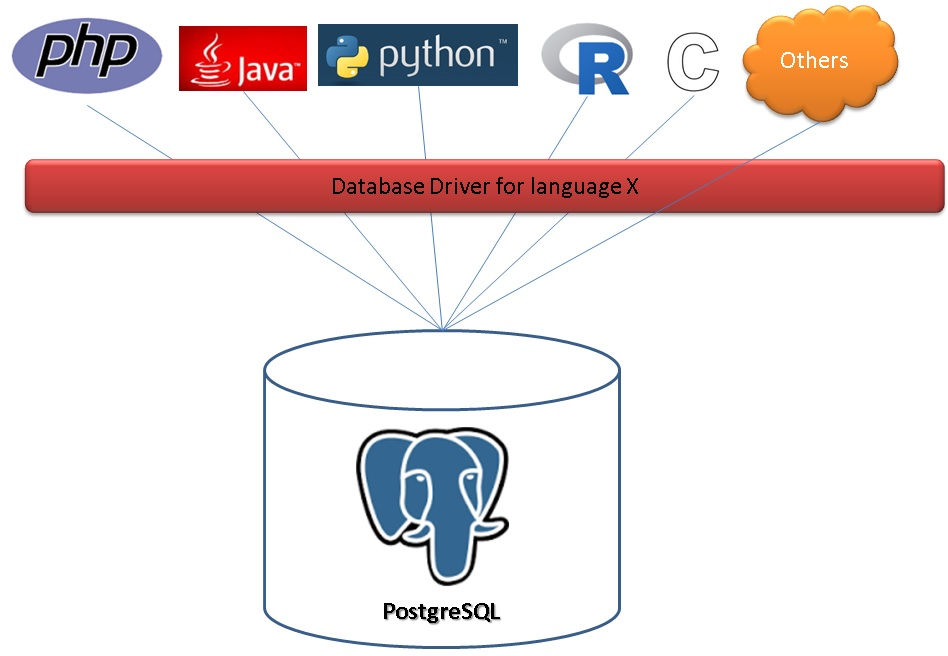
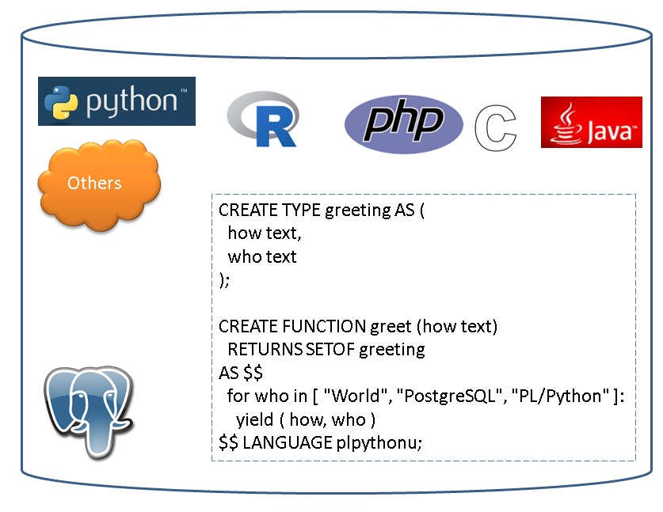

## PostgreSQL 数据库扩展语言编程 之 plpgsql - 1     
                      
### 作者     
digoal                                                                                            
                 
### 日期                                                                                           
2017-01-10                                                                                                 
                   
### 标签     
PostgreSQL , plpgsql , server programming , 存储过程 , 函数 , UDF , create language , plpython , pljava , plr , plperl , pltcl      
                                                                                            
----                                                                                          
                                                       
## 背景                      
PostgreSQL是一个开放的数据库，开发性表现在支持自定义数据类型、索引方法、索引、操作符、聚合、窗口、服务端编程语言等等。    
    
所以我们可以看到在PostgreSQL的生态中有很多贴近业务的用法，比如在PostgreSQL中存储和处理化学分子、存储和处理图像、存储和处理基因数据、存储和处理文本（包括正则、模糊、全文检索等技术）、访问外部任意数据源等。    
    
接下来我会花一些时间给大家介绍一下PostgreSQL的服务端编程，这也是PostgreSQL开放性的表现之一。  
  
通常我们的用法可能是这样的，编程语言，通过对应的数据库驱动，连接到数据库，如果要实现一些数据的处理时，需要将数据下拉到客户端，在客户端的语言中进行处理。  
  
  
  
而PostgreSQL还可以这样使用，把编程语言和数据库融为一体，你可以把程序放到数据库里面去执行，这样的话数据库几乎可以做任何事情（只要程序能做的事情，数据库都可以做）。  
  
  
  
它的好处是非常明显的，你可以把任何编程语言（只要是地球语言），作为它的服务端语言，你可以用它在数据库中做任何事情，以前你可能总觉得数据库就是select, update, insert, delete，现在你要改变一下你的想法了。  
  
比如你需要处理一大批的数据，原来从数据库拉取到程序端处理，可能把程序跑挂（比如内存溢出），又或者网络传输需要花费太多的时间。  
  
又比如你原来的一次业务逻辑需要与数据库交互几十次，总体开销可能达到了几秒（在线业务的用户完全忍受不了），现在，你把业务逻辑和数据结合在一起，不需要交互几十次，一次就够了，延迟一下就降低了。  
  
那么PostgreSQL是如何支持这么多的语言的呢？  
  
## 安装扩展语言  
https://www.postgresql.org/docs/devel/static/xplang.html  
  
安装扩展语言很简单，通常只需要 create extension language_name 即可，目前系统自带的语言包括python, perl, tcl, plpgsql.    
    
编译时带上对应的参数  
  
```  
  --with-tcl              build Tcl modules (PL/Tcl)  
  --with-tclconfig=DIR    tclConfig.sh is in DIR  
  --with-perl             build Perl modules (PL/Perl)  
  --with-python           build Python modules (PL/Python)  
```  
  
这样的话，软件安装好后，就会带对应的扩展语言，例如  
  
```  
$PGHOME/lib  
  
-rwxr-xr-x 1 digoal users 63K Jan 10 14:19 pltcl.so  
```  
  
在需要使用该语言的数据库中创建扩展语言，也可以在模板库中创建，这样的话以后通过模板库创建的数据库就默认带有这个扩展语言了  
  
```  
postgres=# create extension pltcl;  
CREATE EXTENSION  
  
postgres=# create extension pltclu;  
CREATE EXTENSION  
  
postgres=# CREATE or REPLACE FUNCTION tcl_max(integer, integer) RETURNS integer AS $$  
    if {$1 > $2} {return $1}  
    return $2  
$$ LANGUAGE pltcl STRICT;  
CREATE FUNCTION  
  
postgres=# select tcl_max(1,2);  
 tcl_max   
---------  
       2  
(1 row)  
```  
  
扩展语言包括如下几个部分，其中language_handler为必须的  
  
1\. language_handler，必须为扩展语言创建一个对应的language_handler  
  
```  
CREATE FUNCTION handler_function_name()  
    RETURNS language_handler  
    AS 'path-to-shared-object'  
    LANGUAGE C;  
```  
  
2\. 当这个扩展语言需要使用do的语法（即不创建函数，直接跑代码）时，则需要实现一个对应的inline_function  
  
```  
CREATE FUNCTION inline_function_name(internal)  
    RETURNS void  
    AS 'path-to-shared-object'  
    LANGUAGE C;  
```  
  
3\. 如果需要让数据库支持这个语言的函数，在创建函数时检查内部的代码，则需要实现对应的validator  
  
PostgreSQL 参数 check_function_bodies = on 时，如果这个扩展语言实现了validator，那么使用这个扩展语言create function时会自动检查函数体的内容，比如语法是否正确。  
  
```  
CREATE FUNCTION validator_function_name(oid)  
    RETURNS void  
    AS 'path-to-shared-object'  
    LANGUAGE C STRICT;  
```  
  
4\. 创建扩展语言  
  
```  
CREATE [TRUSTED] [PROCEDURAL] LANGUAGE language-name  
    HANDLER handler_function_name  
    [INLINE inline_function_name]  
    [VALIDATOR validator_function_name] ;  
```  
  
例子  
  
```  
CREATE FUNCTION plperl_call_handler() RETURNS language_handler AS  
    '$libdir/plperl' LANGUAGE C;  
  
CREATE FUNCTION plperl_inline_handler(internal) RETURNS void AS  
    '$libdir/plperl' LANGUAGE C;  
  
CREATE FUNCTION plperl_validator(oid) RETURNS void AS  
    '$libdir/plperl' LANGUAGE C STRICT;  
  
CREATE TRUSTED PROCEDURAL LANGUAGE plperl  
    HANDLER plperl_call_handler  
    INLINE plperl_inline_handler  
    VALIDATOR plperl_validator;  
```  
  
## trusted 与 untrusted 扩展语言  
The optional key word TRUSTED specifies that the language does not grant access to data that the user would not otherwise have.   
  
Trusted languages are designed for ordinary database users (those without superuser privilege) and allows them to safely create functions and trigger procedures.   
  
Since PL functions are executed inside the database server, the TRUSTED flag should only be given for languages that do not allow access to database server internals or the file system.   
  
The languages PL/pgSQL, PL/Tcl, and PL/Perl are considered trusted;   
  
the languages PL/TclU, PL/PerlU, and PL/PythonU are designed to provide unlimited functionality and should not be marked trusted.  
  
trusted 指 这个语言不能访问越权的数据（如数据库服务器的文件、数据库内部（包括直接访问共享内存））  
  
untrusted 指 这个语言没有任何限制，允许访问任何数据（包括文件，网络，共享LIB库等，危害性较大），但是功能更加强大。  
  
## 编写扩展语言  
编写扩展语言主要就是实现前面讲的几个内容，包括call handler, inline handler, validator。     
  
范例可以参考PostgreSQL内置的几个语言的代码，比如python  
  
postgresql-9.6.1/src/pl/plpython  
  
```  
Datum  
plpython_call_handler(PG_FUNCTION_ARGS)  
{  
        Datum           retval;  
        PLyExecutionContext *exec_ctx;  
        ErrorContextCallback plerrcontext;  
  
        PLy_initialize();  
  
        /* Note: SPI_finish() happens in plpy_exec.c, which is dubious design */  
        if (SPI_connect() != SPI_OK_CONNECT)  
                elog(ERROR, "SPI_connect failed");  
  
        /*  
         * Push execution context onto stack.  It is important that this get  
         * popped again, so avoid putting anything that could throw error between  
         * here and the PG_TRY.  (plpython_error_callback expects the stack entry  
         * to be there, so we have to make the context first.)  
         */  
        exec_ctx = PLy_push_execution_context();  
  
        /*  
         * Setup error traceback support for ereport()  
         */  
        plerrcontext.callback = plpython_error_callback;  
        plerrcontext.previous = error_context_stack;  
        error_context_stack = &plerrcontext;  
  
        PG_TRY();  
        {  
                Oid                     funcoid = fcinfo->flinfo->fn_oid;  
                PLyProcedure *proc;  
  
                if (CALLED_AS_TRIGGER(fcinfo))  
                {  
                        Relation        tgrel = ((TriggerData *) fcinfo->context)->tg_relation;  
                        HeapTuple       trv;  
  
                        proc = PLy_procedure_get(funcoid, RelationGetRelid(tgrel), true);  
                        exec_ctx->curr_proc = proc;  
                        trv = PLy_exec_trigger(fcinfo, proc);  
                        retval = PointerGetDatum(trv);  
                }  
                else  
                {  
                        proc = PLy_procedure_get(funcoid, InvalidOid, false);  
                        exec_ctx->curr_proc = proc;  
                        retval = PLy_exec_function(fcinfo, proc);  
                }  
        }  
        PG_CATCH();  
        {  
                PLy_pop_execution_context();  
                PyErr_Clear();  
                PG_RE_THROW();  
        }  
        PG_END_TRY();  
  
        /* Pop the error context stack */  
        error_context_stack = plerrcontext.previous;  
        /* ... and then the execution context */  
        PLy_pop_execution_context();  
  
        return retval;  
}  
```  
  
## 创建扩展语言与数据库的类型转换  
https://www.postgresql.org/docs/devel/static/sql-createtransform.html  
  
因为数据库有自己的类型定义和表达方法，而扩展语言有自己的类型支持。  
  
比如PostgreSQL支持hstore数据类型，而python没有这个类型，那么默认情况下python就只能使用text来表达数据库的hstore.  
  
PostgreSQL允许用户自定义数据类型转换方法，将数据库支持的类型与扩展语言支持的类型桥梁建立起来。  
  
语法如下  
  
```  
CREATE [ OR REPLACE ] TRANSFORM FOR type_name LANGUAGE lang_name (  
    FROM SQL WITH FUNCTION from_sql_function_name (argument_type [, ...]),  
    TO SQL WITH FUNCTION to_sql_function_name (argument_type [, ...])  
);  
```  
  
例子  
  
varchar_transform(internal) : 将数据库类型转换为SQL类型。  
  
int4recv(internal) : 将SQL语言类型转换为数据库类型。  
  
假设我们使用sql语言创建了一个数据库函数  
  
当函数参数类型为INT时，那么调用varchar_transform，将用户传入的数据库INT值 转换为 SQL函数支持的类型，在SQL函数内部处理转换后的值。  
  
当函数返回类型为INT时，那么在SQL函数内部，返回结果前，需要调用int4recv，将SQL函数内的return result值 转换为 数据库INT类型输出。  
  
```  
CREATE TRANSFORM FOR int LANGUAGE sql (  
        FROM SQL WITH FUNCTION varchar_transform(internal),  
        TO SQL WITH FUNCTION int4recv(internal));  
```  
  
### C扩展语言类型映射  
https://www.postgresql.org/docs/9.6/static/xfunc-c.html#XFUNC-C-BASETYPE  
  
C扩展语言的数据库类型与C语言类型映射关系如下  
  
SQL Type|	C Type|	Defined In  
---|---|---  
abstime|	AbsoluteTime|	utils/nabstime.h  
bigint (int8)|	int64|	postgres.h  
boolean|	bool|	postgres.h (maybe compiler built-in)  
box|	BOX*|	utils/geo_decls.h  
bytea|	bytea*|	postgres.h  
"char"|	char|	(compiler built-in)  
character|	BpChar*|	postgres.h  
cid|	CommandId|	postgres.h  
date|	DateADT|	utils/date.h  
smallint (int2)|	int16|	postgres.h  
int2vector|	int2vector*|	postgres.h  
integer (int4)|	int32|	postgres.h  
real (float4)|	float4*|	postgres.h  
double precision (float8)|	float8*|	postgres.h  
interval|	Interval*|	datatype/timestamp.h  
lseg|	LSEG*|	utils/geo_decls.h  
name|	Name|	postgres.h  
oid|	Oid|	postgres.h  
oidvector|	oidvector*|	postgres.h  
path|	PATH*|	utils/geo_decls.h  
point|	POINT*|	utils/geo_decls.h  
regproc|	regproc|	postgres.h  
reltime|	RelativeTime|	utils/nabstime.h  
text|	text*|	postgres.h  
tid|	ItemPointer|	storage/itemptr.h  
time|	TimeADT|	utils/date.h  
time with time zone|	TimeTzADT|	utils/date.h  
timestamp|	Timestamp*|	datatype/timestamp.h  
tinterval|	TimeInterval|	utils/nabstime.h  
varchar|	VarChar*|	postgres.h  
xid|	TransactionId|	postgres.h  
  
### transform 例子代码  
下面是一个transform的例子  
  
```  
CREATE TRANSFORM FOR int LANGUAGE SQL (  
        FROM SQL WITH FUNCTION varchar_transform(internal),  
        TO SQL WITH FUNCTION int4recv(internal));  
```  
  
varchar_transform@src/backend/utils/adt/varchar.c  
  
```  
/*  
 * varchar_transform()  
 * Flatten calls to varchar's length coercion function that set the new maximum  
 * length >= the previous maximum length.  We can ignore the isExplicit  
 * argument, since that only affects truncation cases.  
 */  
Datum  
varchar_transform(PG_FUNCTION_ARGS)  
{  
        FuncExpr   *expr = (FuncExpr *) PG_GETARG_POINTER(0);  
        Node       *ret = NULL;  
        Node       *typmod;  
  
        Assert(IsA(expr, FuncExpr));  
        Assert(list_length(expr->args) >= 2);  
  
        typmod = (Node *) lsecond(expr->args);  
  
        if (IsA(typmod, Const) &&!((Const *) typmod)->constisnull)  
        {  
                Node       *source = (Node *) linitial(expr->args);  
                int32           old_typmod = exprTypmod(source);  
                int32           new_typmod = DatumGetInt32(((Const *) typmod)->constvalue);  
                int32           old_max = old_typmod - VARHDRSZ;  
                int32           new_max = new_typmod - VARHDRSZ;  
  
                if (new_typmod < 0 || (old_typmod >= 0 && old_max <= new_max))  
                        ret = relabel_to_typmod(source, new_typmod);  
        }  
  
        PG_RETURN_POINTER(ret);  
}  
```  
  
int4recv@src/backend/utils/adt/int.c  
  
```  
/*  
 *              int4recv                        - converts external binary format to int4  
 */  
Datum  
int4recv(PG_FUNCTION_ARGS)  
{  
        StringInfo      buf = (StringInfo) PG_GETARG_POINTER(0);  
  
        PG_RETURN_INT32((int32) pq_getmsgint(buf, sizeof(int32)));  
}  
```  
    
## 创建服务端函数  
函数是数据库的扩展基础，比如你要在PostgreSQL上扩展新的数据类型，以及新的数据库索引方法、操作符等，必须先创建FUNCTION。  
  
https://www.postgresql.org/docs/devel/static/sql-createfunction.html  
  
当我们使用create extension plxx;创建好了数据库扩展语言后，就可以使用对应的扩展语言创建对应的数据库函数了。  
  
目前PostgreSQL内置的包括C, plpgsql, SQL, plpython, plperl, pltcl。  
  
固定的创建函数格式如下  
    
```  
create or replace function 函数名(参数名 参数类型,....) returns [setof] 返回类型 as   
$$  
  
...扩展语言的代码, 根据对应的语言语法来写...  
  
$$  
language 扩展语言(如plpgsql) ;   
```  
  
例子  
  
```  
CREATE FUNCTION stamp_user(id int, comment text) RETURNS void AS   
$$  
    #variable_conflict use_variable  
    DECLARE  
        curtime timestamp := now();  
    BEGIN  
        UPDATE users SET last_modified = curtime, comment = comment  
          WHERE users.id = id;  
    END;  
$$ LANGUAGE plpgsql;  
```  
  
创建函数的完整语法如下  
  
```  
CREATE [ OR REPLACE ] FUNCTION  
    name ( [ [ argmode ] [ argname ] argtype [ { DEFAULT | = } default_expr ] [, ...] ] )  
    [ RETURNS rettype  
      | RETURNS TABLE ( column_name column_type [, ...] ) ]  
  { LANGUAGE lang_name  
    | TRANSFORM { FOR TYPE type_name } [, ... ]  
    | WINDOW  
    | IMMUTABLE | STABLE | VOLATILE | [ NOT ] LEAKPROOF  
    | CALLED ON NULL INPUT | RETURNS NULL ON NULL INPUT | STRICT  
    | [ EXTERNAL ] SECURITY INVOKER | [ EXTERNAL ] SECURITY DEFINER  
    | PARALLEL { UNSAFE | RESTRICTED | SAFE }  
    | COST execution_cost  
    | ROWS result_rows  
    | SET configuration_parameter { TO value | = value | FROM CURRENT }  
    | AS 'definition'  
    | AS 'obj_file', 'link_symbol'  
  } ...  
    [ WITH ( attribute [, ...] ) ]  
```  
  
### 普通函数  
例子  
  
```  
CREATE FUNCTION stamp_user(id int, comment text) RETURNS void AS   
$$  
    #variable_conflict use_variable  
    DECLARE  
        curtime timestamp := now();  
    BEGIN  
        UPDATE users SET last_modified = curtime, comment = comment  
          WHERE users.id = id;  
    END;  
$$ LANGUAGE plpgsql;  
```  
  
### 窗口函数  
窗口函数可用于支持窗口查询，窗口查询的例子可以参考  
  
[《用PostgreSQL找回618秒逝去的青春 - 递归收敛优化》](../201612/20161201_01.md)  
  
例子  
  
```  
CREATE FUNCTION nth_value_def(val anyelement, n integer = 1) RETURNS anyelement  
  LANGUAGE internal WINDOW IMMUTABLE STRICT AS 'window_nth_value';  
```  
  
src/backend/utils/adt/windowfuncs.c  
  
```  
/*  
 * nth_value  
 * return the value of VE evaluated on the n-th row from the first  
 * row of the window frame, per spec.  
 */  
Datum  
window_nth_value(PG_FUNCTION_ARGS)  
{  
        WindowObject winobj = PG_WINDOW_OBJECT();  
        bool            const_offset;  
        Datum           result;  
        bool            isnull;  
        int32           nth;  
  
        nth = DatumGetInt32(WinGetFuncArgCurrent(winobj, 1, &isnull));  
        if (isnull)  
                PG_RETURN_NULL();  
        const_offset = get_fn_expr_arg_stable(fcinfo->flinfo, 1);  
  
        if (nth <= 0)  
                ereport(ERROR,  
                                (errcode(ERRCODE_INVALID_ARGUMENT_FOR_NTH_VALUE),  
                                 errmsg("argument of nth_value must be greater than zero")));  
  
        result = WinGetFuncArgInFrame(winobj, 0,  
                                                                  nth - 1, WINDOW_SEEK_HEAD, const_offset,  
                                                                  &isnull, NULL);  
        if (isnull)  
                PG_RETURN_NULL();  
  
        PG_RETURN_DATUM(result);  
}  
```  
  
### 聚合函数  
聚合在数据分析，统计的应用场景中非常场景，比如count, avg, sum, ...。  
  
聚合函数开发的例子  
  
[《performance tuning about multi-rows query aggregated to single-row query》](../201212/20121217_01.md)  
  
[《PostgreSQL aggregate function customize》](../201212/20121218_02.md)   
  
[《hll插件在Greenplum中的使用 以及 分布式聚合函数优化思路》](../201608/20160825_02.md)  
  
[《Postgres-XC customized aggregate introduction》](../201305/20130502_01.md)  
  
PostgreSQL代码中的自定义聚合例子  
  
```  
CREATE AGGREGATE newavg (  
   sfunc = int4_avg_accum, basetype = int4, stype = _int8,  
   finalfunc = int8_avg,  
   initcond1 = '{0,0}'  
);  
```  
  
其中sfunc int4_avg_accum和finalfunc int8_avg函数如下  
  
int4_avg_accum用于累加（包括计数和sum），int8_avg则在最后一步时做了一次除法得到avg    
  
src/backend/utils/adt/numeric.c  
  
```  
Datum  
int4_avg_accum(PG_FUNCTION_ARGS)  
{  
        ArrayType  *transarray;  
        int32           newval = PG_GETARG_INT32(1);  
        Int8TransTypeData *transdata;  
  
        /*  
         * If we're invoked as an aggregate, we can cheat and modify our first  
         * parameter in-place to reduce palloc overhead. Otherwise we need to make  
         * a copy of it before scribbling on it.  
         */  
        if (AggCheckCallContext(fcinfo, NULL))  
                transarray = PG_GETARG_ARRAYTYPE_P(0);  
        else  
                transarray = PG_GETARG_ARRAYTYPE_P_COPY(0);  
  
        if (ARR_HASNULL(transarray) ||  
                ARR_SIZE(transarray) != ARR_OVERHEAD_NONULLS(1) + sizeof(Int8TransTypeData))  
                elog(ERROR, "expected 2-element int8 array");  
  
        transdata = (Int8TransTypeData *) ARR_DATA_PTR(transarray);  
        transdata->count++;  
        transdata->sum += newval;  
  
        PG_RETURN_ARRAYTYPE_P(transarray);  
}  
  
Datum  
int8_avg(PG_FUNCTION_ARGS)  
{  
        ArrayType  *transarray = PG_GETARG_ARRAYTYPE_P(0);  
        Int8TransTypeData *transdata;  
        Datum           countd,  
                                sumd;  
  
        if (ARR_HASNULL(transarray) ||  
                ARR_SIZE(transarray) != ARR_OVERHEAD_NONULLS(1) + sizeof(Int8TransTypeData))  
                elog(ERROR, "expected 2-element int8 array");  
        transdata = (Int8TransTypeData *) ARR_DATA_PTR(transarray);  
  
        /* SQL defines AVG of no values to be NULL */  
        if (transdata->count == 0)  
                PG_RETURN_NULL();  
  
        countd = DirectFunctionCall1(int8_numeric,  
                                                                 Int64GetDatumFast(transdata->count));  
        sumd = DirectFunctionCall1(int8_numeric,  
                                                           Int64GetDatumFast(transdata->sum));  
  
        PG_RETURN_DATUM(DirectFunctionCall2(numeric_div, sumd, countd));  
}  
```  
  
### 触发器函数  
使用扩展语言，除了可以用来编写普通函数，聚合、窗口函数，还可以用于编写触发器函数，事件触发器函数。  
  
下面是使用plpgsql编写触发器函数的例子  
  
[《PostgreSQL 触发器 用法详解 1》](../201303/20130311_01.md)  
  
[《PostgreSQL 触发器 用法详解 2》](../201303/20130311_02.md)  
  
### 事件触发器函数  
下面是使用plpgsql编写事件触发器的例子  
  
[《PostgreSQL 事件触发器 - PostgreSQL 9.3 Event Trigger》](../201303/20130313_01.md)  
  
## plpgsql的使用  
下一篇文章开始介绍plpgsql的使用  
  
                    
                                                   
                                 
  
<a rel="nofollow" href="http://info.flagcounter.com/h9V1"  ></a>  
  
  
  
  
  
  
## [digoal's 大量PostgreSQL文章入口](https://github.com/digoal/blog/blob/master/README.md "22709685feb7cab07d30f30387f0a9ae")
  
