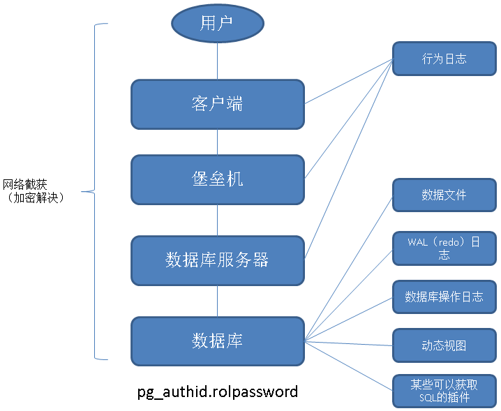

## PostgreSQL psql 安全设置数据库用户密码的方法之一    
##### [TAG 6](../class/6.md)
                                
### 作者               
digoal                                                                                                      
                           
### 日期                                                                                                     
2017-01-12                                                                                                           
                             
### 标签               
PostgreSQL , psql , 安全 , 密码 , 日志 , password                    
                                                                                                      
----                                                                                                    
                                                                 
## 背景   
密码有多重要就不需要多说了，但是你知道密码有多少可能泄露的渠道吗？  
  
大多数人可能觉得在设置好密码后，保管好不被泄露就可以了。  
  
但是你有没有想过，在设置密码的过程中就泄露了呢？  
  
比如数据库中设置用户密码，有多少种可能泄露的渠道？  
  
比如，我们在修改数据库用户密码时，可能经历这么长的流程才能最终将新的密码写入数据库的元数据pg_authid中.  
  
    
  
这么多环节，都有可能被不法分子有机可乘。是不是不能简单的认为设置好密码之后就万事大吉了呢？很有可能在你设置的过程中就被截获了。  
  
即使MD5被截获或者泄露，也是危险的，详见  
  
[《PostgreSQL 对比 MySQL - 秘钥认证》](../201610/20161009_01.md)  
  
当然，现在PostgreSQL已经意识到这个问题，在进行协议层认证方面的改造，如下：  
  
[《元旦技术大礼包 - 2017金秋将要发布的PostgreSQL 10.0已装备了哪些核武器？》](../201701/20170101_01.md)    
  
所以为了你的安全，我建议你仔细阅读以下数据库的安全加固方法  
  
[《PostgreSQL 密码安全指南》](../201410/20141009_01.md)    
  
[《PostgreSQL 数据库安全指南》](../201506/20150601_01.md)    
  
[《DBA专供 冈本003系列 - 数据库安全第一,过个好年》](../201612/20161224_01.md)   
  
本文主要介绍以下psql这个客户端做的一个改进，在设置密码时，隐藏掉明文。(但是你要知道，即使这样，也是不够安全的，安全都是相对的)    
  
## psql \password  
psql 新增的一个指令如下  
  
```  
  \password [USERNAME]   securely change the password for a user  
```  
  
对应的源码如下，会将用户输入的文本通过PQencryptPassword函数转换为md5，然后调用PSQLexec执行该ALTER USER XX PASSWORD 'MD5XX';  
  
src/bin/psql/command.c  
  
```  
        /* \password -- set user password */  
        else if (strcmp(cmd, "password") == 0)  
        {  
                char       *pw1;  
                char       *pw2;  
  
                pw1 = simple_prompt("Enter new password: ", 100, false);  
                pw2 = simple_prompt("Enter it again: ", 100, false);  
  
                if (strcmp(pw1, pw2) != 0)  
                {  
                        psql_error("Passwords didn't match.\n");  
                        success = false;  
                }  
                else  
                {  
                        char       *opt0 = psql_scan_slash_option(scan_state, OT_SQLID, NULL, true);  
                        char       *user;  
                        char       *encrypted_password;  
  
                        if (opt0)  
                                user = opt0;  
                        else  
                                user = PQuser(pset.db);  
  
                        encrypted_password = PQencryptPassword(pw1, user);  
  
                        if (!encrypted_password)  
                        {  
                                psql_error("Password encryption failed.\n");  
                                success = false;  
                        }  
                        else  
                        {  
                                PQExpBufferData buf;  
                                PGresult   *res;  
  
                                initPQExpBuffer(&buf);  
                                printfPQExpBuffer(&buf, "ALTER USER %s PASSWORD ",  
                                                                  fmtId(user));  
                                appendStringLiteralConn(&buf, encrypted_password, pset.db);  
                                res = PSQLexec(buf.data);  
                                termPQExpBuffer(&buf);  
                                if (!res)  
                                        success = false;  
                                else  
                                        PQclear(res);  
                                PQfreemem(encrypted_password);  
                        }  
  
                        if (opt0)  
                                free(opt0);  
                }  
                free(pw2);  
        }  
```  
  
src/bin/psql/common.c  
  
```  
/*  
 * PSQLexec  
 *  
 * This is the way to send "backdoor" queries (those not directly entered  
 * by the user). It is subject to -E but not -e.  
 *  
 * Caller is responsible for handling the ensuing processing if a COPY  
 * command is sent.  
 *  
 * Note: we don't bother to check PQclientEncoding; it is assumed that no  
 * caller uses this path to issue "SET CLIENT_ENCODING".  
 */  
PGresult *  
PSQLexec(const char *query)  
{  
        PGresult   *res;  
  
        if (!pset.db)  
        {  
                psql_error("You are currently not connected to a database.\n");  
                return NULL;  
        }  
  
        if (pset.echo_hidden != PSQL_ECHO_HIDDEN_OFF)  
        {  
                printf(_("********* QUERY **********\n"  
                                 "%s\n"  
                                 "**************************\n\n"), query);  
                fflush(stdout);  
                if (pset.logfile)  
                {  
                        fprintf(pset.logfile,  
                                        _("********* QUERY **********\n"  
                                          "%s\n"  
                                          "**************************\n\n"), query);  
                        fflush(pset.logfile);  
                }  
  
                if (pset.echo_hidden == PSQL_ECHO_HIDDEN_NOEXEC)  
                        return NULL;  
        }  
  
        SetCancelConn();  
  
        res = PQexec(pset.db, query);  
  
        ResetCancelConn();  
  
        if (!AcceptResult(res))  
        {  
                ClearOrSaveResult(res);  
                res = NULL;  
        }  
  
        return res;  
}  
```  
  
## 测试  
为什么说它不是绝对安全呢？因为MD5本身就不安全，另外同样会有诸多渠道可能泄露这个MD5。  
   
不过任何数据库都一样，没有绝对的安全，都是相对的安全，所以非常建议大伙参考一下文章末尾的几篇文章来加固你的数据库。   
   
```  
postgres=# set log_statement='all';  
postgres=# set client_min_messages ='log';  
postgres=# \password digoal  
Enter new password:   
Enter it again:   
LOG:  statement: ALTER USER digoal PASSWORD 'md5462f71c79368ccf422f8a773ef40074d'  
  
postgres=# select * from pg_authid where rolname='digoal';  
LOG:  statement: select * from pg_authid where rolname='digoal';  
 rolname | rolsuper | rolinherit | rolcreaterole | rolcreatedb | rolcanlogin | rolreplication | rolbypassrls | rolconnlimit |             rolpassword             | rolvaliduntil   
---------+----------+------------+---------------+-------------+-------------+----------------+--------------+--------------+-------------------------------------+---------------  
 digoal  | f        | t          | f             | f           | t           | f              | f            |           -1 | md5462f71c79368ccf422f8a773ef40074d |   
(1 row)  
```  
  
## 源码层思考
从源码层面如何杜绝单一的加密方法呢？  
  
比如引入可以识别instance的UUID，例如systemid，多重加密，这样的话可能破解难度会进一步加大，或者避免一些重复的密码问题。  
  
## 参考  
[《PostgreSQL 对比 MySQL - 秘钥认证》](../201610/20161009_01.md)  
  
[《元旦技术大礼包 - 2017金秋将要发布的PostgreSQL 10.0已装备了哪些核武器？》](../201701/20170101_01.md)    
  
[《PostgreSQL 密码安全指南》](../201410/20141009_01.md)    
  
[《PostgreSQL 数据库安全指南》](../201506/20150601_01.md)    
  
[《DBA专供 冈本003系列 - 数据库安全第一,过个好年》](../201612/20161224_01.md)   
  
            
                               
  
  
  
  
  
  
  
  
  
  
  
  
  
  
  
  
  
  
  
  
  
  
  
  
  
  
  
  
  
  
  
  
  
  
  
  
  
  
  
  
  
  
  
  
  
  
  
  
  
  
  
  
  
  
  
  
  
  
  
  
  
  
  
  
  
  
  
  
  
  
  
  
  
#### [PostgreSQL 许愿链接](https://github.com/digoal/blog/issues/76 "269ac3d1c492e938c0191101c7238216")
您的愿望将传达给PG kernel hacker、数据库厂商等, 帮助提高数据库产品质量和功能, 说不定下一个PG版本就有您提出的功能点. 针对非常好的提议，奖励限量版PG文化衫、纪念品、贴纸、PG热门书籍等，奖品丰富，快来许愿。[开不开森](https://github.com/digoal/blog/issues/76 "269ac3d1c492e938c0191101c7238216").  
  
  
#### [9.9元购买3个月阿里云RDS PostgreSQL实例](https://www.aliyun.com/database/postgresqlactivity "57258f76c37864c6e6d23383d05714ea")
  
  
#### [PostgreSQL 解决方案集合](https://yq.aliyun.com/topic/118 "40cff096e9ed7122c512b35d8561d9c8")
  
  
#### [德哥 / digoal's github - 公益是一辈子的事.](https://github.com/digoal/blog/blob/master/README.md "22709685feb7cab07d30f30387f0a9ae")
  
  

  
  
#### [PolarDB 学习图谱: 训练营、培训认证、在线互动实验、解决方案、生态合作、写心得拿奖品](https://www.aliyun.com/database/openpolardb/activity "8642f60e04ed0c814bf9cb9677976bd4")
  
  
#### [购买PolarDB云服务折扣活动进行中, 55元起](https://www.aliyun.com/activity/new/polardb-yunparter?userCode=bsb3t4al "e0495c413bedacabb75ff1e880be465a")
  
  
#### [About 德哥](https://github.com/digoal/blog/blob/master/me/readme.md "a37735981e7704886ffd590565582dd0")
  
