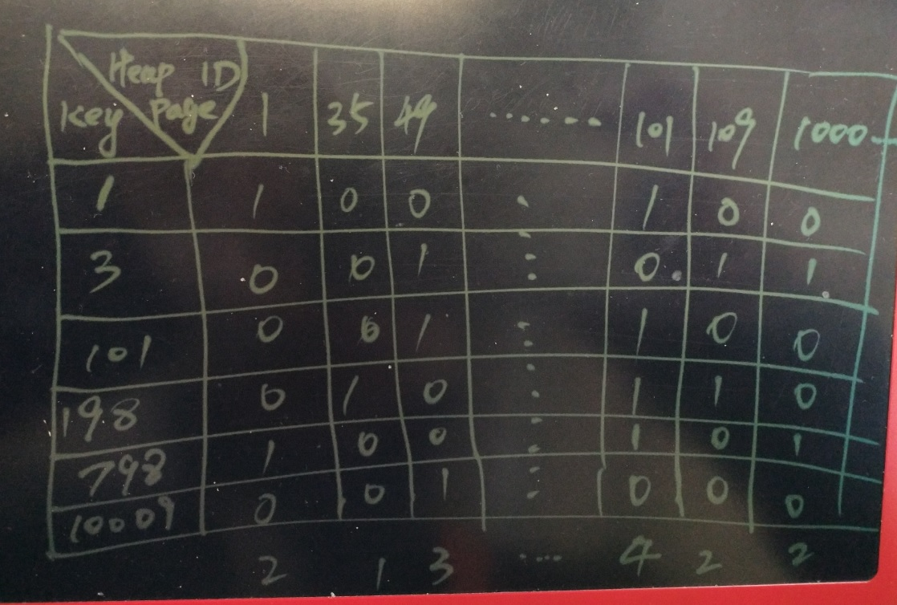

## 导购系统 - 电商内容去重\内容筛选应用(实时识别转载\盗图\侵权?) - 文本、图片集、商品集、数组相似判定的优化和索引技术  
##### [TAG 15](../class/15.md)
                     
### 作者                 
digoal     
      
### 日期                                                                                                       
2017-01-12                                                                                                             
            
### 标签                 
PostgreSQL , rum , tsvector , array , smlar , 相似度 , 内容去重 , 内容筛选 , 转载 , 盗图 , 侵权 , 内容过滤              
      
----     
        
## 背景    
同一个热点事件，可能有很多的媒体报道。  
  
同一篇好的文章，可能被多人转载。  
  
一个商品、或者同一堆商品，可能会被诸多广告平台、导购平台推送。  
  
导购网站、新闻媒体、技术论坛、搜索引擎，充斥着各种李逵、李鬼。相似甚至内容完全相同的文章或者图片集等。  
  
不涉及利益时，这些都不是大问题。一旦涉及利益，这些问题可能会困扰利益方。  
  
比如  
  
1\. 导购网站，接收来自社会各界的推荐文章，推荐文章中会有诸多的商品，以及商品的体验、介绍性的内容。  
  
为了避免内容相似或者相同的文章，通常需要请人审核推荐的内容，如果发现大部分商品与已发表的其他导购文章内容类似，可能被拒绝发表。  
  
不过人为审核存在严重瓶颈，如果是机器审核，目前比较多见的可能是异步的批量审核（因为每接收一篇新的文章，都要和所有历史文章进行比较）。  
  
2\. 新闻媒体，同一个事件，避免多次被报道或者爆料。  
  
还有好多类似的社会需求。  
  
前面提到，每接收一篇新的文章，都要和所有历史文章进行比较，那么有什么技术能做到实时的内容相似度审核呢？  
  
到PostgreSQL的剑冢挑一柄绝世好剑吧。  
  
  
  
## 相关文章  
1\. 文本相似  
  
通常需要算出每篇文章的关键词（比如平均每篇文章20个关键词），然后算出新提交文章的关键词（假设有若干个）  
  
然后去根据比对新建文章关键词，与历史文章关键词，找到相似的文章。  
  
[《PostgreSQL结合余弦、线性相关算法 在文本、图片、数组相似 等领域的应用 - 1 文本(关键词)分析理论基础 - TF(Term Frequency 词频)/IDF(Inverse Document Frequency 逆向文本频率)》](../201701/20170116_02.md)  
  
[《PostgreSQL结合余弦、线性相关算法 在文本、图片、数组相似 等领域的应用 - 3 rum, smlar应用场景分析》](../201701/20170116_04.md)    
  
[《PostgreSQL结合余弦、线性相关算法 在文本、图片、数组相似 等领域的应用 - 2 smlar插件详解》](../201701/20170116_03.md)    
  
[《PostgreSQL 文本数据分析实践之 - 相似度分析》](../201608/20160817_01.md)  
  
优化的海量文本相似分析算法，例如  
  
将关键词哈希（生成一个64位BIT串），对BIT位置为1的，关键词都有一个tfidf数值，对BIT位为0的，设置为负tfidf, BIT位为1的设置为正tfidf。一个关键词会生成64个正负值。  
  
将所有关键词生成的64个正负值，每一个对应位置，例如，第一个BIT，对应所有关键词的64个正负值中的第一个正负tfidf值。以此类推，最后会生成64个新的正负值。  
  
对于新的64个正负值，大于0的改成1，小于等于0的改成0，那么就变成了64个0、1的BIT串。  
  
这个BIT串就是根据这篇文章关键词算出来的指纹。  
  
每篇文章都有这样的指纹，通过对比两篇文章的指纹（bit串），有多少个BIT位置是不一样的，来判断相似性。  
  
详见，海量数据相似度计算之simhash和海明距离  
  
http://www.lanceyan.com/tech/arch/simhash_hamming_distance_similarity.html   
  
2\. 对于图像去重，则可以利用这篇文章的技术  
  
[《PostgreSQL 在视频、图片去重，图像搜索业务中的应用》](../201611/20161126_01.md)  
  
[《从相似度算法谈起 - Effective similarity search in PostgreSQL》](../201612/20161222_02.md)    
  
[《弱水三千,只取一瓢,当图像搜索遇见PostgreSQL(Haar wavelet)》](../201607/20160726_01.md)  
  
3\. 对于模糊查询、正则匹配、全文检索等，则可以参考这几篇文档  
  
[《从难缠的模糊查询聊开 - PostgreSQL独门绝招之一 GIN , GiST , SP-GiST , RUM 索引原理与技术背景》](../201612/20161231_01.md)    
  
[《PostgreSQL 全文检索加速 快到没有朋友 - RUM索引接口(潘多拉魔盒)》](../201610/20161019_01.md)  
  
4\. 数组、图片集、关键词集合相似，可以参考这篇文档，也是本文要讲的重点  
  
[《从相似度算法谈起 - Effective similarity search in PostgreSQL》](../201612/20161222_02.md)    
  
http://railsware.com/blog/2012/05/10/effective-similarity-search-in-postgresql/  
  
下面来讲一个内容去重的案例。  
  
## 实时去重 案例  
某导购平台，平均每篇文章可能会有几十个被推荐的商品以及一些商品介绍内容。  
  
例如你可以打开一个导购平台体验一下，一篇推荐玩具的导购文章，里面可能涉及几十个玩具类的商品。  
  
http://post.smzdm.com/p/525280/  
  
在历史推荐中，可能会堆积几千万甚至上亿的导购文章。  
  
每篇文章可能有几十个被推荐的商品，整个被推荐的商品库可能有千万级。  
  
而且一定会存在被多篇文章推荐的热点商品。  
  
比如畅销品，或者某些商品的卖家通过推荐费来提高被推荐的频度等。我们假设在整个导购文章库中，存在1/5的热点商品。  
  
下面将使用PostgreSQL smlar插件，实现对导购文章的实时去重。  
  
smlar插件的介绍请参考  
  
[《PostgreSQL结合余弦、线性相关算法 在文本、图片、数组相似 等领域的应用 - 2 smlar插件详解》](../201701/20170116_03.md)    
  
http://www.pgcon.org/2012/schedule/attachments/252_smlar-2012.pdf  
  
根据以上模型，构建测试库，一共6000万导购文章，设计1000万个商品，每篇导购文章11 - 50个商品，其中商品ID 1-50万 的为热点商品被1000万篇文章推荐过。  
  
1\. 创建smlar插件，  
  
```  
create extension smlar;  
```  
  
2\. 创建测试表  
  
```  
create unlogged table test (  
  id serial,   -- 文章ID  
  arr int8[]   -- 商品ID组成的数组，假设商品ID为int8类型，那么数组就是int8[]  
);   
```  
  
3\. 插入5000万记录，要求如下  
  
int8 取值范围1~1000万 ， 即历史上被推荐的商品有1000万个。  
  
int8[] 数组长度 11 ~ 50 ， 即每篇导购文章，包含11到50个商品。  
  
均匀分布。  
  
插入测试数据的函数如下，调用一次插入40条记录。  
  
```  
create or replace function f() returns void as $$  
declare  
begin  
  for i in 11..50 loop  
    insert into test (arr) select array_agg((10000000*random())::int8) from generate_series(1,i);  
  end loop;  
end;  
$$ language plpgsql strict;  
```  
  
使用pgbench调用以上函数，将生成5000万测试数据  
  
```  
vi test.sql  
select f();  
  
pgbench -M prepared -n -r -P 1 -f ./test.sql -c 100 -j 100 -t 12500  
```  
  
4\. 生成1000万热点商品的推荐数据  
  
假设商品ID范围在 1 ~ 50万 的为热点商品，被1000万篇文章推荐过。  
  
修改以上函数  
  
```  
create or replace function f() returns void as $$  
declare  
begin  
  for i in 11..50 loop  
    insert into test (arr) select array_agg((500000*random())::int8) from generate_series(1,i);  
  end loop;  
end;  
$$ language plpgsql strict;  
```  
  
使用pgbench调用以上函数，生成1000万测试数据  
  
```  
pgbench -M prepared -n -r -P 1 -f ./test.sql -c 100 -j 100 -t 2500  
```  
  
总共生成了6000万推荐文章的数据。  
  
5\. 创建gin索引，使用smlar提供的OPS  
  
```  
set maintenance_work_mem='64GB';  
  
create index on test using gin ( arr _int8_sml_ops );  
  
虽然smlar插件还支持 gist 索引，但是本文的CASE不建议使用gist索引  
  
--  create index on test using gist ( arr _int8_sml_ops );  
```  
  
6\. 相似计算算法  
  
smlar插件支持几种默认算法，同时支持自定义公式。  
  
注意，全部指数组元素去重后的结果  
  
N.i : 相交的元素个数(被比较的两数组会先去重)  
  
N.a : 第一个数组的元素个数(去重后)  
  
N.b : 第二个数组的元素个数(去重后)  
  
默认算法如下  
  
6\.1 cosine  
  
N.i / sqrt(N.a * N.b)  
  
6\.2 overlap  
  
N.i  
  
6\.3 tfidf  
  
较复杂，参考  
  
[《PostgreSQL结合余弦、线性相关算法 在文本、图片、数组相似 等领域的应用 - 2 smlar插件详解》](../201701/20170116_03.md)  
  
设置方法  
  
```  
允许普通用户设置，会话级别，会话之间互不干扰。

set smlar.type='cosine';   
-- set smlar.type='overlap';   
-- set smlar.type='tfidf';   
```  
  
自定义公式以及用法  
  
```    
float4 smlar( anyarray a, anyarray b, text formula );    
        - computes similary of two arrays by given formula, arrays should     
        be the same type.     
        Predefined variables in formula:    
          N.i   - number of common elements in both array (intersection)    
          N.a   - number of uniqueelements in first array    
          N.b   - number of uniqueelements in second array    
        Example:    
          
        smlar('{1,4,6}'::int[], '{5,4,6}' )    
        smlar('{1,4,6}'::int[], '{5,4,6}', 'N.i / sqrt(N.a * N.b)' )  -- 第三个参数为自定义公式  
        That calls are equivalent.    
```   
  
7\. 测试性能  
  
对于导购网站，一篇导购文章推荐了10个商品，结果其中有9个商品和另一篇导购文章中一样。这种判定为重复文章，审核不通过。  
  
当然你可以设置为9，或者8或者更低，看运营的心情?  
  
而对于一篇文章，10个商品，如果这10个商品是分别出现在已有导购文章的10篇文档各一个，那么可以通过审核。  
  
以上例子指的是通过overlap的公式来判定相似性。  
  
找出一部分已有记录，根据这些记录造一些进行判断    
  
```  
select arr from test limit 100;   
```  
  
7\.1 通过函数，简化SQL   
  
```  
create or replace function ff(  
  v_type text,         -- 使用什么公式, tfidf or overlap or cosine  
  v_threshold float8,  -- 设置对应公式的阈值   
  v_arr int8[]         -- 要比较的数组  
) returns boolean as $$                                                  
declare  
begin   
  set enable_seqscan = off;                                 -- 关闭全表扫描, 强制使用索引  
  execute format('set smlar.type=%L', v_type);              -- 设置公式, overlap  
  -- threshold允许普通用户设置，会话之间互不干扰
  execute format('set smlar.threshold=%s', v_threshold);    -- 设置相交元素个数的阈值, 这个阈值可以程序计算，也可以程序提供一个百分比，在PG中计算。建议程序自己算，减少数据库开销。  
    
  perform 1 from test where arr % v_arr limit 1;            -- 搜索test表中arr字段与传入的v_arr值，判断是否有相似记录  
  if found then  
    set enable_seqscan = on;  -- 退出函数时，恢复设置  
    return false;             -- found similar array，表示找到了相似文章  
  else  
    set enable_seqscan = on;  -- 退出函数时，恢复设置  
    return true;              -- 表示没有找到相似文章  
  end if;  
end;  
$$ language plpgsql strict;   
```  
  
7\.2 普通商品40个  
  
高相似，4毫秒响应  
  
```  
set enable_seqscan=off;  
set smlar.type='overlap';  
set smlar.threshold=39;  
  
select id,arr,smlar(arr,'{9824126,8385751,3431657,4702366,536881,4432069,4646244,8071695,9493653,576176,343683,920351,505115,492412,3517002,8301249,1851489,3729325,5420033,9366936,9553716,4903162,2840830,965295,1125073,3061027,1831144,9210503,5385795,8519636,5369934,5209921,6905387,8801592,9912287,7442268,3233661,4558531,5513963,2727314,5134707,5857647,3647665,5639822,6350059,7164667,3941070,8201548,893992,9361104}'::int8[], 'N.i') as overlap   
from test  
where arr % '{9824126,8385751,3431657,4702366,536881,4432069,4646244,8071695,9493653,576176,343683,920351,505115,492412,3517002,8301249,1851489,3729325,5420033,9366936,9553716,4903162,2840830,965295,1125073,3061027,1831144,9210503,5385795,8519636,5369934,5209921,6905387,8801592,9912287,7442268,3233661,4558531,5513963,2727314,5134707,5857647,3647665,5639822,6350059,7164667,3941070,8201548,893992,9361104}'::int8[] limit 1;  
  
postgres=# explain (analyze,verbose,timing,costs,buffers) select id,arr,smlar(arr,'{9824126,8385751,3431657,4702366,536881,4432069,4646244,8071695,9493653,576176,343683,920351,505115,492412,3517002,8301249,1851489,3729325,5420033,9366936,9553716,4903162,2840830,965295,1125073,3061027,1831144,9210503,5385795,8519636,5369934,5209921,6905387,8801592,9912287,7442268,3233661,4558531,5513963,2727314,5134707,5857647,3647665,5639822,6350059,7164667,3941070,8201548,893992,9361104}'::int8[], 'N.i') as overlap   
from test                                                                                                                                                                                                                                    where arr % '{9824126,8385751,3431657,4702366,536881,4432069,4646244,8071695,9493653,576176,343683,920351,505115,492412,3517002,8301249,1851489,3729325,5420033,9366936,9553716,4903162,2840830,965295,1125073,3061027,1831144,9210503,5385795,8519636,5369934,5209921,6905387,8801592,9912287,7442268,3233661,4558531,5513963,2727314,5134707,5857647,3647665,5639822,6350059,7164667,3941070,8201548,893992,9361104}'::int8[] limit 1;  
                                                                                                                                                                                                                               QUERY PLAN      
-------------------------------------------------------------------------------  
 Limit  (cost=1013.60..1014.85 rows=1 width=274) (actual time=4.875..4.876 rows=1 loops=1)  
   Output: id, arr, (smlar(arr, '{9824126,8385751,3431657,4702366,536881,4432069,4646244,8071695,9493653,576176,343683,920351,505115,492412,3517002,8301249,1851489,3729325,5420033,9366936,9553716,4903162,2840830,965295,1125073,3061027,18  
31144,9210503,5385795,8519636,5369934,5209921,6905387,8801592,9912287,7442268,3233661,4558531,5513963,2727314,5134707,5857647,3647665,5639822,6350059,7164667,3941070,8201548,893992,9361104}'::bigint[], 'N.i'::text))  
   Buffers: shared hit=202  
   ->  Bitmap Heap Scan on public.test  (cost=1013.60..76009.06 rows=60000 width=274) (actual time=4.874..4.874 rows=1 loops=1)  
         Output: id, arr, smlar(arr, '{9824126,8385751,3431657,4702366,536881,4432069,4646244,8071695,9493653,576176,343683,920351,505115,492412,3517002,8301249,1851489,3729325,5420033,9366936,9553716,4903162,2840830,965295,1125073,30610  
27,1831144,9210503,5385795,8519636,5369934,5209921,6905387,8801592,9912287,7442268,3233661,4558531,5513963,2727314,5134707,5857647,3647665,5639822,6350059,7164667,3941070,8201548,893992,9361104}'::bigint[], 'N.i'::text)  
         Recheck Cond: (test.arr % '{9824126,8385751,3431657,4702366,536881,4432069,4646244,8071695,9493653,576176,343683,920351,505115,492412,3517002,8301249,1851489,3729325,5420033,9366936,9553716,4903162,2840830,965295,1125073,3061027  
,1831144,9210503,5385795,8519636,5369934,5209921,6905387,8801592,9912287,7442268,3233661,4558531,5513963,2727314,5134707,5857647,3647665,5639822,6350059,7164667,3941070,8201548,893992,9361104}'::bigint[])  
         Heap Blocks: exact=1  
         Buffers: shared hit=202  
         ->  Bitmap Index Scan on test_arr_idx  (cost=0.00..998.60 rows=60000 width=0) (actual time=4.810..4.810 rows=1 loops=1)  
               Index Cond: (test.arr % '{9824126,8385751,3431657,4702366,536881,4432069,4646244,8071695,9493653,576176,343683,920351,505115,492412,3517002,8301249,1851489,3729325,5420033,9366936,9553716,4903162,2840830,965295,1125073,306  
1027,1831144,9210503,5385795,8519636,5369934,5209921,6905387,8801592,9912287,7442268,3233661,4558531,5513963,2727314,5134707,5857647,3647665,5639822,6350059,7164667,3941070,8201548,893992,9361104}'::bigint[])  
               Buffers: shared hit=201  
 Planning time: 0.099 ms  
 Execution time: 4.910 ms  
(13 rows)  
```  
  
低相似，4毫秒响应  
  
```  
set smlar.threshold=20;  
  
select id,arr,smlar(arr,'{}'::int8[],'N.i') as overlap   
from test  
where arr % '{}'::int8[] limit 1;  
```  
  
不存在，4毫秒响应  
  
```  
set smlar.threshold=40;  
  
select id,arr,smlar(arr,'{}'::int8[],'N.i') as overlap   
from test  
where arr % '{}'::int8[] limit 1;  
```  
  
7\.3 热点商品10个,普通商品30个  
  
```  
8790997,6822070,9034458,7045729,7426339,4870927,9298344,9841045,9653498,5049021,592665,9202806,6141445,534620,5208898,2370105,9546145,7383597,5658020,3118646,4081961,8268545,4748855,3798658,1595104,5408571,5865833,5432299,5893431,1814110,477735,220233,401904,426917,64745,266448,156966,27816,258082,138729  
```  
  
高相似，6毫秒  
  
```  
set smlar.threshold=39;  
  
select id,arr,smlar(arr,'{8790997,6822070,9034458,7045729,7426339,4870927,9298344,9841045,9653498,5049021,592665,9202806,6141445,534620,5208898,2370105,9546145,7383597,5658020,3118646,4081961,8268545,4748855,3798658,1595104,5408571,5865833,5432299,5893431,1814110,477735,220233,401904,426917,64745,266448,156966,27816,258082,138729}'::int8[],'N.i') as overlap   
from test  
where arr % '{8790997,6822070,9034458,7045729,7426339,4870927,9298344,9841045,9653498,5049021,592665,9202806,6141445,534620,5208898,2370105,9546145,7383597,5658020,3118646,4081961,8268545,4748855,3798658,1595104,5408571,5865833,5432299,5893431,1814110,477735,220233,401904,426917,64745,266448,156966,27816,258082,138729}'::int8[] limit 1;  
```  
  
低相似，6毫秒  
  
```  
set smlar.threshold=20;  
```  
  
不存在，6毫秒  
  
```  
set smlar.threshold=40;  
```  
  
7\.4 热点商品40个  
  
```  
267238,262959,96771,64156,264782,344608,162583,240894,206902,434057,378718,395427,342928,102342,69040,400565,360688,351453,160160,144552,420616,137895,364785,322520,64812,429531,88969,221778,457346,347051,360506,224584,110011,457277,288740,374792,301885,451323,115687,8788  
```  
  
高相似，15毫秒  
  
```  
set smlar.threshold=39;  
  
select id,arr,smlar(arr,'{267238,262959,96771,64156,264782,344608,162583,240894,206902,434057,378718,395427,342928,102342,69040,400565,360688,351453,160160,144552,420616,137895,364785,322520,64812,429531,88969,221778,457346,347051,360506,224584,110011,457277,288740,374792,301885,451323,115687,8788}'::int8[],'N.i') as overlap   
from test  
where arr % '{267238,262959,96771,64156,264782,344608,162583,240894,206902,434057,378718,395427,342928,102342,69040,400565,360688,351453,160160,144552,420616,137895,364785,322520,64812,429531,88969,221778,457346,347051,360506,224584,110011,457277,288740,374792,301885,451323,115687,8788}'::int8[] limit 1;  
```  
  
低相似，15毫秒  
  
```  
set smlar.threshold=20;  
```  
  
不存在，15毫秒  
  
```  
set smlar.threshold=40;  
```  
  
7\.5 压测  
  
普通商品35个，热点商品5个，overlap=35，压测  
  
```  
create or replace function bench() returns boolean as $$  
declare  
  v_arr int8[];  
begin  
  -- 生成40个商品的数组，其中普通商品35个，热点商品5个  
  select array_agg(id) into v_arr from (select (500000+random()*9500000)::int8 id from generate_series(1,35) union all select (random()*500000)::int8 id from generate_series(1,5) ) t;  
    
  -- 调用ff, 并返回结果, overlap=35，即满足35个相似的为相似文本  
  return ff('overlap', 35, v_arr);  
end;  
$$ language plpgsql strict;  
```  
  
使用pgbench压测  
  
```  
vi test.sql  
select bench();  
  
pgbench -M prepared -n -r -P 1 -f ./test.sql -c 64 -j 64 -T 100  
```  
  
压测结果，约9400 tps，CPU耗光。    
  
```  
progress: 97.0 s, 9513.0 tps, lat 6.726 ms stddev 1.495  
progress: 98.0 s, 9556.0 tps, lat 6.695 ms stddev 1.441  
progress: 99.0 s, 9501.0 tps, lat 6.731 ms stddev 1.524  
progress: 100.0 s, 9659.3 tps, lat 6.626 ms stddev 1.203  
transaction type: ./test.sql  
scaling factor: 1  
query mode: prepared  
number of clients: 64  
number of threads: 64  
duration: 100 s  
number of transactions actually processed: 945643  
latency average = 6.762 ms  
latency stddev = 1.515 ms  
tps = 9455.190803 (including connections establishing)  
tps = 9460.748975 (excluding connections establishing)  
script statistics:  
 - statement latencies in milliseconds:  
         6.766  select bench();  
```  
  
8\. 其他测试query  
  
```  
set smlar.type='overlap';  
  
set smlar.threshold=2;  
  
explain (analyze,verbose,timing,costs,buffers)   
  select    
    *,    
    smlar( arr, '{1,2,3,4,5}'::int8[], 'N.i' )    
  from    
    test    
  where    
    arr % '{1,2,3,4,5}'::int8[]                -- where cosine similarity >= smlar.threshold    
  order by    
    smlar( arr, '{1,2,3,4,5}'::int8[] , 'N.i' ) desc    
  limit 10;    
  
                                                              QUERY PLAN                                                                 
---------------------------------------------------------------------------------------------------------------------------------------  
 Limit  (cost=76837.64..76837.66 rows=10 width=274) (actual time=0.523..0.523 rows=0 loops=1)  
   Output: id, arr, (smlar(arr, '{1,2,3,4,5}'::bigint[], 'N.i'::text))  
   Buffers: shared hit=21  
   ->  Sort  (cost=76837.64..76987.64 rows=60000 width=274) (actual time=0.521..0.521 rows=0 loops=1)  
         Output: id, arr, (smlar(arr, '{1,2,3,4,5}'::bigint[], 'N.i'::text))  
         Sort Key: (smlar(test.arr, '{1,2,3,4,5}'::bigint[], 'N.i'::text)) DESC  
         Sort Method: quicksort  Memory: 25kB  
         Buffers: shared hit=21  
         ->  Bitmap Heap Scan on public.test  (cost=545.60..75541.06 rows=60000 width=274) (actual time=0.514..0.514 rows=0 loops=1)  
               Output: id, arr, smlar(arr, '{1,2,3,4,5}'::bigint[], 'N.i'::text)  
               Recheck Cond: (test.arr % '{1,2,3,4,5}'::bigint[])  
               Buffers: shared hit=21  
               ->  Bitmap Index Scan on test_arr_idx  (cost=0.00..530.60 rows=60000 width=0) (actual time=0.509..0.509 rows=0 loops=1)  
                     Index Cond: (test.arr % '{1,2,3,4,5}'::bigint[])  
                     Buffers: shared hit=21  
 Planning time: 0.100 ms  
 Execution time: 0.566 ms  
  
  
set smlar.threshold=1;  
  
postgres=# select                  
    *,    
    smlar( arr, '{1,2,3,4,5}'::int8[], 'N.i' )    
  from    
    test    
  where    
    arr % '{1,2,3,4,5}'::int8[]                -- where cosine similarity >= smlar.threshold    
  order by    
    smlar( arr, '{1,2,3,4,5}'::int8[] , 'N.i' ) desc    
  limit 10;   
   id    |                                                                                                                                                                                           arr                                       
                                                                                                                                                      | smlar   
---------+-----------------------------------------------------------------------------------------------------------------------------------------------------------------------------------------------------------------------------------  
------------------------------------------------------------------------------------------------------------------------------------------------------+-------  
  247838 | {237675,4661601,7866637,1488686,6727125,4429671,1737244,1298649,5000070,3005575,5226803,3932647,2649001,8069658,6161176,8361766,2525409,8765570,326152,2701673,3359631,2,1779920,2302730,1790402,4052782,5309527,9050565,5105087,5  
147167,7750613,5342762,9808768,5617250,6831448,6535893,46921,8568692,7834542,5046991,1574267,3061345,8979638,4223268,1131003,5140814,2585034,3656412} |     1  
  599383 | {2236159,1910889,8347171,9808321,984302,9879937,8323590,8329741,3659904,5927698,3313023,3700527,5,1379483,624821,2545660,1107329,1008684,5866894,6913711,1219153,9289175,219848}                                                    
                                                                                                                                                      |     1  
  651912 | {2169145,395443,7203159,4,1483408,1120127,6826670,3833242,6593556,9610959,6037787,3663295,3832153,3011352,59413,4805726,2928469,1346520,8866551,4802519,6669386,9989045,4906640,5515378}                                            
                                                                                                                                                      |     1  
  917170 | {5533700,8089318,3041627,7271777,8265739,1327529,8297258,4216273,4787578,7353886,3309096,1256584,2658659,9234522,8992017,3716316,8041219,434949,5098162,3389473,4639068,1073895,9440283,8107232,71786,7042329,6710428,9191641,3}    
                                                                                                                                                      |     1  
 1029696 | {3265253,7656164,8567524,2652267,3168337,4980160,6712196,2,5902105,3649837,1030683,8693620,7325769,8948287,1392751,2025064}                                                                                                         
                                                                                                                                                      |     1  
 1061817 | {1096653,3653819,9251346,6068360,8292737,603196,8884739,8447750,135140,7614256,8759570,328858,4176508,7602119,42971,5118033,3188444,2,2115724,9115069,4817618}                                                                      
                                                                                                                                                      |     1  
 1134245 | {6530421,6214242,6395054,9258718,8725118,4983503,9810497,5607732,8881705,5471907,4089655,9255985,5546890,3130739,7958510,1857659,2265983,6924058,5347269,9948938,7998525,8490561,7620058,4026548,1767506,6669122,4,6825812,4389614  
,4807713,3707007,920035,1021955,102061,178752,9747073,5085565,9989250,5354805,3967269,5461156,9444459,3223254,1008046,2575199,1181764,2865706}        |     1  
 1293841 | {6304557,4210279,3,38877,1218015,3484369,3730857,2397837,1043963,1445075,8266792,3945016,5239953,8634247,3817106,8527009,1330729,7244838,1698105,8424011,2576912,8464701,9057905,9677858,5535620,914864,856093,3177092,9996328,188  
841}                                                                                                                                                  |     1  
 1346505 | {9032400,4389590,650321,7262898,1704250,8295282,9849186,5449984,357623,4597835,1815568,7895683,8041120,4764576,3046330,2,8880797,7835529,6114696,4749228,7791711,4044832}                                                           
                                                                                                                                                      |     1  
  240060 | {4931779,4329891,8609630,624826,5139777,2945988,5850613,5479581,965198,8512392,9838013,5090273,721891,437386,4901686,7505060,9649984,2944743,9557274,2422698,6636513,6762844,538118,1,1727268,2164825,2070053,3387449}              
                                                                                                                                                      |     1  
(10 rows)  
  
按相似度排序，输出10条  
  
postgres=# explain (analyze,verbose,timing,costs,buffers)   
  select    
    *,    
    smlar( arr, '{1,2,3,4,5}'::int8[], 'N.i' )    
  from    
    test    
  where    
    arr % '{1,2,3,4,5}'::int8[]                -- where cosine similarity >= smlar.threshold    
  order by    
    smlar( arr, '{1,2,3,4,5}'::int8[] ) desc    
  limit 10;   
                                                                QUERY PLAN                                                                  
------------------------------------------------------------------------------------------------------------------------------------------  
 Limit  (cost=76987.64..76987.66 rows=10 width=278) (actual time=66.506..66.510 rows=10 loops=1)  
   Output: id, arr, (smlar(arr, '{1,2,3,4,5}'::bigint[], 'N.i'::text)), (smlar(arr, '{1,2,3,4,5}'::bigint[]))  
   Buffers: shared hit=3741  
   ->  Sort  (cost=76987.64..77137.64 rows=60000 width=278) (actual time=66.504..66.507 rows=10 loops=1)  
         Output: id, arr, (smlar(arr, '{1,2,3,4,5}'::bigint[], 'N.i'::text)), (smlar(arr, '{1,2,3,4,5}'::bigint[]))  
         Sort Key: (smlar(test.arr, '{1,2,3,4,5}'::bigint[])) DESC  
         Sort Method: top-N heapsort  Memory: 28kB  
         Buffers: shared hit=3741  
         ->  Bitmap Heap Scan on public.test  (cost=545.60..75691.06 rows=60000 width=278) (actual time=1.743..65.204 rows=3725 loops=1)  
               Output: id, arr, smlar(arr, '{1,2,3,4,5}'::bigint[], 'N.i'::text), smlar(arr, '{1,2,3,4,5}'::bigint[])  
               Recheck Cond: (test.arr % '{1,2,3,4,5}'::bigint[])  
               Heap Blocks: exact=3720  
               Buffers: shared hit=3741  
               ->  Bitmap Index Scan on test_arr_idx  (cost=0.00..530.60 rows=60000 width=0) (actual time=1.062..1.062 rows=3725 loops=1)  
                     Index Cond: (test.arr % '{1,2,3,4,5}'::bigint[])  
                     Buffers: shared hit=21  
 Planning time: 0.102 ms  
 Execution time: 66.551 ms  
(18 rows)  
  
  
postgres=# set enable_seqscan=off;  
SET  
postgres=# explain (analyze,verbose,timing,costs,buffers)   
  select    
    *,    
    smlar( arr, '{1,2,3,4,5}'::int8[], 'N.i' )    
  from    
    test    
  where    
    arr % '{1,2,3,4,5}'::int8[]                -- where cosine similarity >= smlar.threshold    
  limit 1;   
                                                             QUERY PLAN                                                               
------------------------------------------------------------------------------------------------------------------------------------  
 Limit  (cost=545.60..546.85 rows=1 width=274) (actual time=1.699..1.699 rows=1 loops=1)  
   Output: id, arr, (smlar(arr, '{1,2,3,4,5}'::bigint[], 'N.i'::text))  
   Buffers: shared hit=22  
   ->  Bitmap Heap Scan on public.test  (cost=545.60..75541.06 rows=60000 width=274) (actual time=1.697..1.697 rows=1 loops=1)  
         Output: id, arr, smlar(arr, '{1,2,3,4,5}'::bigint[], 'N.i'::text)  
         Recheck Cond: (test.arr % '{1,2,3,4,5}'::bigint[])  
         Heap Blocks: exact=1  
         Buffers: shared hit=22  
         ->  Bitmap Index Scan on test_arr_idx  (cost=0.00..530.60 rows=60000 width=0) (actual time=1.057..1.057 rows=3725 loops=1)  
               Index Cond: (test.arr % '{1,2,3,4,5}'::bigint[])  
               Buffers: shared hit=21  
 Planning time: 0.092 ms  
 Execution time: 1.729 ms  
(13 rows)  
```  
  
## gin索引的优化  
1\. 创建优化，创建GIN索引时，设置较大的maintenance_work_mem可以加快创建索引的速度  
  
```  
视实际的主机环境设置  
  
set maintenance_work_mem='32GB';  
```  
  
2\. UPDATE, INSERT, DELETE优化  
  
由于GIN是元素展开索引，当插入一个条新数组，或者更新、删除某些记录时，可能会涉及多个GIN条目的变更。因此GIN索引的变更非常频繁。所以PostgreSQL设计了一个pending list，允许异步的将pending list的信息更新到GIN索引中。从而减少GIN的频繁更新。提升DML效率。  
  
https://www.postgresql.org/docs/9.6/static/gin-tips.html  
  
https://www.postgresql.org/docs/9.6/static/sql-createindex.html  
  
```  
create index idx on table using gin (column,,,,,) with (fastupdate=on, gin_pending_list_limit=32767);  -- pending list=32 MB  
  
pending list会在autovacuum或者手工vacuum时合并到gin索引中  
```  
  
3\. 查询优化  
  
由于pending list的存在，可能会影响一定的查询效率，因为pending list不是树结构的。  
  
所以在DML和查询之间建议权衡利弊。  
  
或者发现慢之后，执行一下vacuum，将pengding list合并到tree中。  
    
## gin搜索原理讲解  
### gin索引的结构，应用请参考以下文章  
  
[《PostgreSQL GIN 单列聚集索引 应用》](../201702/20170221_01.md)  
  
[《PostgreSQL GIN索引实现原理》](../201702/20170204_01.md)  
  
[《PostgreSQL GIN multi-key search 优化》](../201702/20170203_01.md)    
  
[《宝剑赠英雄 - GIN任意组合字段等效查询, 探探PostgreSQL多列展开式B树》](../201702/20170205_01.md)  
  
[《从难缠的模糊查询聊开 - PostgreSQL独门绝招之一 GIN , GiST , SP-GiST , RUM 索引原理与技术背景》](../201612/20161231_01.md)  
  
### 在本文的案例中，以 smlar.type=overlap 相似算法为例，解释整个数据检索的过程如下。  
  
GIN索引会构建一颗 "以商品ID为KEY" 的B树，VALUE则是由 "堆表行号ctid" 组成的 posting list或者posting tree。  
  
在来了一篇新的导购文章时，根据导购文章涉及的商品IDs，首先在树中进行搜索，每命中一个KEY则CNT++1，当CNT小于设置的smlar.threshold阈值时，说明不满足条件，直接返回空结果，不需要进入下一层搜索。  
  
当大于等于设置的阈值时，进行下一层的搜索(即GIN索引支持的通用bitmap scan搜索，分为bitmap index scan和bitmap heap scan两个阶段)   
  
1\. bitmap index scan阶段，从key对应的posting list或posting tree，取出CTID对应的HEAP PAGE ID(即堆表的页号)，比如 (1,1), (1,2), (1,5), (1000,32) 得到1, 1000。   
   
1和1000分别对应一个CNT，计数。 例如 CNT[1]=1, CNT[1000]=1 。       
  
遍历 "导购文章涉及的商品IDs" 对应的所有KEY，HEAP PAGE ID对应的CNT[heap_page_id]++1    
  
比如 ( 导购文章商品ids={1,3,101,198,798,10009} ) 最终得到 CNT[1]=2, CNT[35]=1, CNT[49]=3, CNT[101]=4, CNT[109]=2, CNT[1000]=2。  
  
  
  
接下来，根据smlar.threshold，排除不符合条件的heap page id，比如smlar.threshold=3, 则heap page id=49,101 符合条件。   
  
接下来，生成bitmap(每个bit位对应堆表的一页，所以BITMAP的长度取决于表有多少页)，根据前面取得的满足条件的HEAP PAGE ID ： 49, 101， 将对应BIT位设置为1，其他位为0。   
  
然后进入bitmap heap scan阶段，  
   
2\. bitmap heap scan阶段，到bitmap中bit位=1的对应HEAP PAGE（即49, 101）取出所有记录，然后根据SQL提供的索引查询条件 用CPU去recheck。   
   
### 验证   
1\. 调整为overlap模式  
  
```
postgres=# set smlar.type='overlap';
SET
```
  
2\. 设置阈值=1，生成heap page对应的bitmap前，会使用阈值过滤不满足条件的heap page id。  
  
```
postgres=# set smlar.threshold=1;
SET
```
  
2\.1 查看Heap Blocks: exact=4011，说明满足条件的块有4011个。     
  
```
postgres=# explain (analyze,verbose,timing,costs,buffers)   
  select    
    *,    
    smlar( arr, '{1,2,3,4,5,7262898,650321}'::int8[], 'N.i' )    
  from    
    test    
  where    
    arr % '{1,2,3,4,5,7262898,650321}'::int8[]                -- where cosine similarity >= smlar.threshold    
  ; 
                                                          QUERY PLAN                                                          
------------------------------------------------------------------------------------------------------------------------------
 Bitmap Heap Scan on public.test  (cost=566.40..75561.86 rows=60000 width=274) (actual time=1.982..57.561 rows=4017 loops=1)
   Output: id, arr, smlar(arr, '{1,2,3,4,5,7262898,650321}'::bigint[], 'N.i'::text)
   
   // heap scan阶段，需要recheck
   Recheck Cond: (test.arr % '{1,2,3,4,5,7262898,650321}'::bigint[])
   
   // 扫描了多少heap page
   Heap Blocks: exact=4011

   // 扫描了多少heap page+index page
   Buffers: shared hit=4040
   
   // 以下是bitmap index scan阶段，过滤不满足条件的heap page id，生成bitmap
   ->  Bitmap Index Scan on test_arr_idx  (cost=0.00..551.40 rows=60000 width=0) (actual time=1.282..1.282 rows=4017 loops=1)
         Index Cond: (test.arr % '{1,2,3,4,5,7262898,650321}'::bigint[])
         Buffers: shared hit=29
 Planning time: 0.083 ms
 Execution time: 57.852 ms
(10 rows)
```
  
2\.2 看我前面的解释，后面的就很好理解了。  
  
```
postgres=# set smlar.threshold=2;  -- 设置为2，说明 CNT[heap_page_id] >= 2  
SET

postgres=# explain (analyze,verbose,timing,costs,buffers)   
  select    
    *,    
    smlar( arr, '{1,2,3,4,5,7262898,650321}'::int8[], 'N.i' )    
  from    
    test    
  where    
    arr % '{1,2,3,4,5,7262898,650321}'::int8[]                -- where cosine similarity >= smlar.threshold    
  ; 
                                                        QUERY PLAN                                                         
---------------------------------------------------------------------------------------------------------------------------
 Bitmap Heap Scan on public.test  (cost=566.40..75561.86 rows=60000 width=274) (actual time=0.603..0.604 rows=1 loops=1)
   Output: id, arr, smlar(arr, '{1,2,3,4,5,7262898,650321}'::bigint[], 'N.i'::text)
   Recheck Cond: (test.arr % '{1,2,3,4,5,7262898,650321}'::bigint[])
   
   // 设置了threshold=2后，只扫描了1个heap page，是不是很开心呢？
   Heap Blocks: exact=1

   Buffers: shared hit=30
   
   // index scan的page不变，因为条件没有变化。但是生成的bitmap中bit=1的只有1个heap page了。
   ->  Bitmap Index Scan on test_arr_idx  (cost=0.00..551.40 rows=60000 width=0) (actual time=0.559..0.559 rows=1 loops=1)
         Index Cond: (test.arr % '{1,2,3,4,5,7262898,650321}'::bigint[])
         Buffers: shared hit=29
 Planning time: 0.084 ms
 Execution time: 0.635 ms
(10 rows)
```
  
2\.3 继续举例  
  
```
postgres=# set smlar.threshold=3;
SET
postgres=# explain (analyze,verbose,timing,costs,buffers)   
  select    
    *,    
    smlar( arr, '{1,2,3,4,5,7262898,650321}'::int8[], 'N.i' )    
  from    
    test    
  where    
    arr % '{1,2,3,4,5,7262898,650321}'::int8[]                -- where cosine similarity >= smlar.threshold    
  ; 
                                                        QUERY PLAN                                                         
---------------------------------------------------------------------------------------------------------------------------
 Bitmap Heap Scan on public.test  (cost=566.40..75561.86 rows=60000 width=274) (actual time=0.495..0.496 rows=1 loops=1)
   Output: id, arr, smlar(arr, '{1,2,3,4,5,7262898,650321}'::bigint[], 'N.i'::text)
   Recheck Cond: (test.arr % '{1,2,3,4,5,7262898,650321}'::bigint[])
   Heap Blocks: exact=1
   Buffers: shared hit=30
   ->  Bitmap Index Scan on test_arr_idx  (cost=0.00..551.40 rows=60000 width=0) (actual time=0.452..0.452 rows=1 loops=1)
         Index Cond: (test.arr % '{1,2,3,4,5,7262898,650321}'::bigint[])
         Buffers: shared hit=29
 Planning time: 0.083 ms
 Execution time: 0.526 ms
(10 rows)
```
  
2\.4 当threshold=4时，在bitmap index scan阶段，组成的BITMAP没有任何一个BIT=1，所以bitmap heap scan阶段，扫描的PAGE数=0。   
  
```
postgres=# set smlar.threshold=4;
SET
postgres=# explain (analyze,verbose,timing,costs,buffers)   
  select    
    *,    
    smlar( arr, '{1,2,3,4,5,7262898,650321}'::int8[], 'N.i' )    
  from    
    test    
  where    
    arr % '{1,2,3,4,5,7262898,650321}'::int8[]                -- where cosine similarity >= smlar.threshold    
  ; 
                                                        QUERY PLAN                                                         
---------------------------------------------------------------------------------------------------------------------------
 Bitmap Heap Scan on public.test  (cost=566.40..75561.86 rows=60000 width=274) (actual time=0.370..0.370 rows=0 loops=1)
   Output: id, arr, smlar(arr, '{1,2,3,4,5,7262898,650321}'::bigint[], 'N.i'::text)
   Recheck Cond: (test.arr % '{1,2,3,4,5,7262898,650321}'::bigint[])
   Buffers: shared hit=29
   ->  Bitmap Index Scan on test_arr_idx  (cost=0.00..551.40 rows=60000 width=0) (actual time=0.368..0.368 rows=0 loops=1)
         Index Cond: (test.arr % '{1,2,3,4,5,7262898,650321}'::bigint[])
         Buffers: shared hit=29
 Planning time: 0.083 ms
 Execution time: 0.404 ms
(9 rows)
```
   
如果你想查看行号或者heap page id的话，很简单   
  
```
postgres=# set smlar.threshold=1;
SET
postgres=# select                
    ctid,   -- 行号
    split_part(ctid::text, ',', 1)   -- heap page id
  from    
    test    
  where    
    arr % '{1,2,3,4,5,7262898,650321}'::int8[]                -- where cosine similarity >= smlar.threshold    
  ; 
     ctid     | split_part 
--------------+------------
 (1165,10)    | (1165
 (1487,6)     | (1487
 (9038,12)    | (9038
 (9300,15)    | (9300
 (13926,18)   | (13926
 (22472,24)   | (22472
......
```
  
### bitmap scan 概念参考  
  
[《PostgreSQL bitmapAnd, bitmapOr, bitmap index scan, bitmap heap scan》](../201702/20170221_02.md)   
   
至于效率，前面已经验证了。6000万（其中5000万普通，1000万热点），40个商品（其中5个热点，35个普通）的相似度实时判定，TPS将近1万。  
   
## gin和gist哪个更适合  
下次再细聊smlar的gin和gist实现。  
  
## 参考  
1\. 相似度  
  
[《从相似度算法谈起 - Effective similarity search in PostgreSQL》](../201612/20161222_02.md)    
  
2\. wavelet  
  
[《PostgreSQL 在视频、图片去重，图像搜索业务中的应用》](../201611/20161126_01.md)  
  
3\. rum  
  
[《从难缠的模糊查询聊开 - PostgreSQL独门绝招之一 GIN , GiST , SP-GiST , RUM 索引原理与技术背景》](../201612/20161231_01.md)   
  
[《PostgreSQL 全文检索加速 快到没有朋友 - RUM索引接口(潘多拉魔盒)》](../201610/20161019_01.md)  
  
[《PostgreSQL 文本数据分析实践之 - 相似度分析》](../201608/20160817_01.md)    
  
https://github.com/postgrespro/rum  
  
距离(相似度)算法参考   
  
src/rum_ts_utils.c   
  
4\. 数组(文本)相似度算法  
  
[《从相似度算法谈起 - Effective similarity search in PostgreSQL》](../201612/20161222_02.md)   
  
http://railsware.com/blog/2012/05/10/effective-similarity-search-in-postgresql/  
  
5\. KNN with TF-IDF based Framework for Text Categorization  
  
http://www.sciencedirect.com/science/article/pii/S1877705814003750  
  
6\. 数据挖掘-基于贝叶斯算法及KNN算法的newsgroup18828文本分类器的JAVA实现（上）  
  
http://blog.csdn.net/yangliuy/article/details/7400984  
  
7\. TF-IDF与余弦相似性的应用（一）：自动提取关键词  
  
http://www.ruanyifeng.com/blog/2013/03/tf-idf.html  
  
8\. TF-IDF与余弦相似性的应用（二）：找出相似文章  
  
http://www.ruanyifeng.com/blog/2013/03/cosine_similarity.html  
  
9\. TF-IDF  
  
http://baike.baidu.com/view/1228847.htm  
  
10\. hll  
  
https://research.neustar.biz/2013/02/04/open-source-release-postgresql-hll/  
  
http://docs.pipelinedb.com/probabilistic.html#hyperloglog  
  
https://www.citusdata.com/blog/2016/10/12/count-performance/  
  
11\. excluding 约束  
  
https://www.postgresql.org/docs/9.6/static/sql-createtable.html  
  
12\. pg_trgm  
  
https://www.postgresql.org/docs/9.6/static/pgtrgm.html  
  
13\. 中文分词  
  
https://github.com/jaiminpan/pg_jieba.git  
  
14\. 海量数据相似度计算之simhash和海明距离  
  
http://www.lanceyan.com/tech/arch/simhash_hamming_distance_similarity.html   
        
        
  
  
<a rel="nofollow" href="http://info.flagcounter.com/h9V1"  ></a>  
  
  
  
  
  
  
## [digoal's 大量PostgreSQL文章入口](https://github.com/digoal/blog/blob/master/README.md "22709685feb7cab07d30f30387f0a9ae")
  
