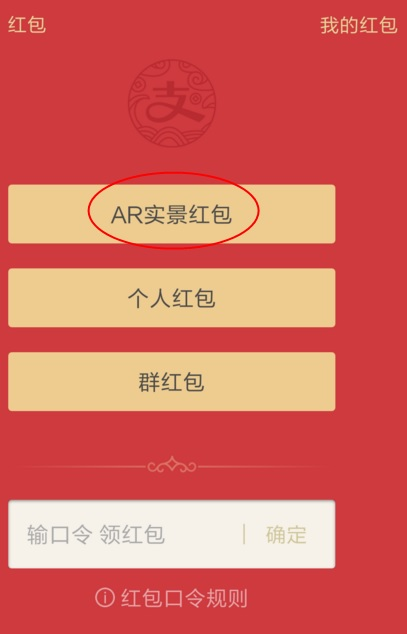
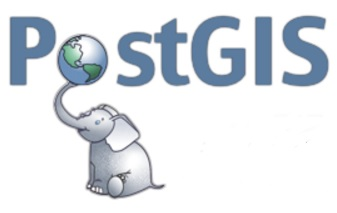
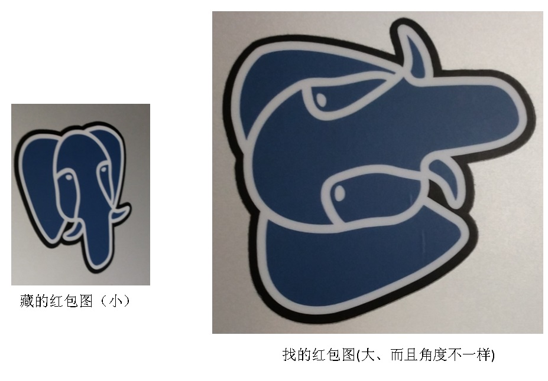
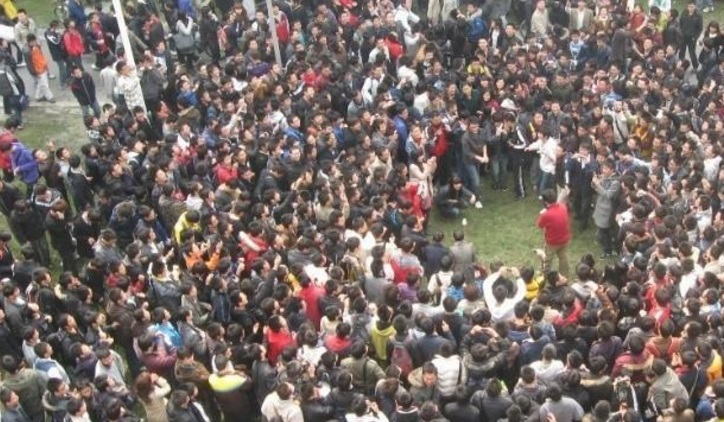

## (AR虚拟现实)红包 技术思考 - GIS与图像识别的完美结合  
##### [TAG 15](../class/15.md)
   
### 作者   
digoal  
    
### 日期                                                                                                       
2017-01-13                                                                                                             
   
### 标签                 
PostgreSQL , Haar wavelet , PostGIS , KNN , 近邻查询 , 图像识别 , 图像去重 , 虚拟现实 , AR , 藏红包 , 秒杀      
      
----     
    
## 背景    
作为搞IT的小伙伴们，对虚拟现实（AR）应该并不陌生，这次带来了一个很有趣的功能，虚拟现实与藏红包结合起来。  
  
简单介绍一下这个业务，然后我们再来思考背后的技术。  
  
## (AR虚拟现实)藏红包、找红包 玩法介绍  
想象一下，你可以把你的红包藏在世界各地的任意角落，让全世界的人来找红包，是不是一件很有趣的事情。  
  
比如你可以把红包藏在你家的小狗身上，又或者你可以把它藏在某个建筑物、某个房间、某一本书中。。。。。。  
  
藏的方法很简单，首先需要打开客户端，然后选择红包->AR红包  
  
  
  
然后你可以选择藏红包  
  
  
  
对准你要藏的地点，把手机的摄像头对准它，这个地方就是你要藏红包的地点。  
  
  
  
你可以选择红包是对所有人可见，还是对好友可见，那么一起来找红包吧！  
  
找红包其实很简单，只要点中AR红包，如果你离藏红包的地点足够近（才能抢）的话，就会弹出一张被模糊化的图片，你需要以这张被模糊化的图片为线索，找到它，同时拿起手机扫描这个地方，那么就找到啦。  
  
  
  
好像这个功能已经很火爆了，我周围就有好多小伙伴已经藏了好多红包呢，目前应该限制了"用户必须在藏红包的限定距离内"才能抢，否则只能发现到周围有哪些红包，但是是无法开始找滴。  
  
比如你发现距离你1公里的地方藏了个红包，赶紧裸奔前往抢红包吧，即锻炼了身体，又能抢到红包，何乐而不为呢？  
  
为什么要限定距离才能抢呢？

1\. 防止作弊，比如我发现5公里外有一个红包是对着一瓶牛奶拍的，而我刚好也有这样的牛奶，没有距离的限制，你就可以在远程刷红包了。  
  
（当然，这也可能是业务层面的限制，兴许将来会开放这样的功能呢，比如允许多少公里以内的人和你一起找，比如你家里收藏了一张老唱片，通过AR红包有机会找出附近还有哪些同好，那不是很好玩么？）  
  
看样子今年过年这个游戏会很火爆，以后不一定是藏红包，还可以藏别的啥？？感觉脑洞不够用啦。       
  
### 附加价值  
个人认为这个功能的附加价值非常大，玩法多样，暗藏巨大商机。  
  
## AR红包背后的技术思考
介绍完功能，我们该来了解一下这项功能背后的技术啦。  
  
我们来分解一下，有几个要素，首先说一下藏红包：  
  
1\. 藏红包的地点，即地球坐标（经纬度），在藏红包时会记录下这个红包的经纬度。  
  
2\. 藏红包的标识（图片），即藏红包现场拍的照片，在藏红包时，会存下这张图。  
  
全世界有很多人藏红包的话，就会产生很多的红包地理坐标、红包标识（图片）  
  
找红包：  
  
1\. 将你附近的红包展示出来，比如方圆2公里有哪些人藏了红包，并且把他们的坐标信息也在地图上展示出来，方便你前往找红包  
  
2\. 当你抵达红包坐标附近（比如50米内）时，你就可以拿起手机，根据红包提供的模糊化图片线索，扫描物体（即藏红包的图片），当你扫描的图片和藏红包时拍的图片完全匹配时，找红包成功，  
  
所以这里涉及到多项技术  
  
1\. 地理位置信息的处理：红包位置的展示（将你的位置以及附近藏的红包位置分别在地图上展示出来），近邻查询（根据你所在的经纬度，查找你附近的红包）  
  
2\. 图片相似度比较，也就是找红包的人拍的照片 与 藏红包时拍下的照片 进行比对，相似度达到一定程度时，表示红包被找到了。  
    
3\. 秒杀特性，例如你在一处藏了很多个红包，那么可能有很多人同时在抢（不过这个秒杀应该比不上双十一，因为是小范围秒杀，除非开通全球可找（不受地域限制））。  
  
这几个功能在PostgreSQL数据库中都可以高效的实现，是不是很棒？  
  
你是不是也想做一个类似功能的应用了呢？  
  
那么接下来我们来看看PostgreSQL如何处理这两项需求的吧，顺便看看性能如何？  
  
## 地理位置信息处理, 军工\科研\民用领域霸主 PostGIS插件  
在AR红包的业务中，地理位置信息的处理包括  
  
1\. 按你的位置，搜索附近的红包。即KNN搜索（如 select * from table where loc <-> $poc <1公里 order by loc <-> $poc）    
  
2\. 根据用户的位置，红包的位置，计算用户与红包的距离  
  
PostgreSQL 最为常用和流行的外围插件之一 - PostGIS。  
  
   
  
在军工、科研、民用场景都非常的流行，包括我们常见的精细地表raster探测，天文研究、地图、路径规划等应用中都可以看到PostGIS的影子，本文可能不会用到这么深入的功能，其实这个AR藏红包的业务只用到了PostGIS的一小部分功能：GIS数据类型、GIST索引、近邻查询。  
  
  
  
我这里测一组point的数据（性能与PostGIS的经纬度表示相当）  
  
假设地球上布满了横竖各100000个点组成的100亿个点阵，随机往里面插入100亿记录，根据任意点，查出附近的点。  
  
12核的机器，每秒可以处理将近8万次这样的请求，随着硬件的发展，现在32核的机器成为了主流，而且处理效率比以前的机器要高，每秒处理50万次请求也不为过。  
  
详细的用法和测试方法参考  
  
[《PostgreSQL 百亿地理位置数据 近邻查询性能》](../201601/20160119_01.md)    
  
更多文章和详细的PostGIS功能可以参考  
  
[《如何建立GIS测试环境 - 将openstreetmap的样本数据导入PostgreSQL PostGIS库》](../201609/20160906_01.md)   
  
[《聊一聊双十一背后的技术 - 物流、动态路径规划》](../201611/20161114_01.md)   
  
https://en.wikipedia.org/wiki/PostGIS  
  
http://postgis.net/  
  
## 图像近似度处理  
图像近似度的处理，则更有意思了，需要根据已有图像匹配出相似的图像。  
  
类似领奖，当你扫描的图片与藏红包的图片进行对比时，如果相似度高大99%(假设这是业务限定的值），领奖成功，否则继续找吧。  
  
在PostgreSQL的的生态圈中，有很多这样的插件来满足图片搜索的需求，同时也支持图像相似度值的计算  
  
1\. 使用Haar wavelet算法的imgsmlr插件  
  
https://github.com/postgrespro/imgsmlr  
  
   
  
2\. 使用图片RGB点阵组成的数组来计算相似度的插件1, smlar  
  
[《从相似度算法谈起 - Effective similarity search in PostgreSQL》](../201612/20161222_02.md)  
  
    
  
git://sigaev.ru/smlar   
  
参考  
  
[《从相似度算法谈起 - Effective similarity search in PostgreSQL》](../201612/20161222_02.md)  
  
[《PostgreSQL 在视频、图片去重，图像搜索业务中的应用》](../201611/20161126_01.md)    
  
git://sigaev.ru/smlar    
  
https://github.com/postgrespro/imgsmlr  
  
3\. 使用图片RGB点阵组成的数组转成tsvector来计算相似度的插件2, RUM  
  
RUM计算相似度时带上了位置信息，精确度更高。   
  
比如（0,1,2,3,4,5与0,0,2,3,4,5与5,1,4,2,3,0与2,3,4,5,0,1）  
  
其中0,1,2,3,4,5是原始点阵的值，那么0,0,2,3,4,5可能是有一定误差的值(因为依旧是线性相关的)，而2,3,4,5,0,1出现了角度偏差（可以通过技术手段比如rum，把数据拉成环状修正），可能是图片拍摄角度造成的。但是5,1,4,2,3,0可能就不是那个图像了。   
  
可以消除拍摄角度、图片大小（拍摄距离）造成的误差   
    
   
    
不过貌似业务层面，目前还没有支持距离偏差的修正，以及拍摄角度的修正，也许将来会做，用户体验可能更好。   
    
详见  
  
[《从难缠的模糊查询聊开 - PostgreSQL独门绝招之一 GIN , GiST , SP-GiST , RUM 索引原理与技术背景》](../201612/20161231_01.md)      
  
  
    
以上是PG开源生态中的图像相似度处理手段，如果其他的图像匹配需求，可以改进相应的算法，并将其合并到PostgreSQL中，PG提供的是坚实的底盘和丰富的扩展能力。    
   
### AR 藏红包如何计算图片匹配  
我们在AR藏红包的业务中，只需要用到计算近似值的功能即可，以上两个插件都可以很好的满足。  
  
比如使用RGB点阵时，在应用程序端生成RGB点阵，发送给数据库，与存储在数据库中的点阵进行相似度计算即可。  
  
藏红包时的图像数字化流程如下：  
  
1\. 拍照，点阵RGB串成数组或转换为tsvector（带距离计算，相似度更加准确），将红包的位置信息、图片RGB点阵存储到数据库中  
  
找红包，匹配图像时的流程如下：  
  
1\. 拍照，生成点阵，提交给服务端，进行图像匹配，匹配方法参考前面的三种方法之一即可，当然也可以考虑更高效的方法，搞进PostgreSQL的插件里面来。   
  
注意，如果从服务端提取点阵，在客户端比对，这种做法虽然节省了服务端开销，但是这种做法可能存在漏洞，客户端可以被HACK，直接匹配上。  
  
## 秒杀
目前业务层面只支持近距离找红包，也就是说，不可能出现大量人涌现刷红包的情况，当然你如果对着蓝天白云藏红包，那就另当别论了，但是由于限定了位置（比如方圆500米）才能抢，也不可能出现大量人涌现刷红包的情况。  
  
所以通常来说，抢一个红包的人群不会太多，比如这张图已经是极限了，而且只有 "一环" 的人在同时抢。  
      
     
    
那么如果有上亿人同时秒杀一个红包怎么做呢？PostgreSQL同样有独门秘技来支持秒杀。    
  
参考   
  
[《聊一聊双十一背后的技术 - 不一样的秒杀技术, 裸秒》](../201611/20161117_01.md)    
    
[《PostgreSQL 使用advisory lock或skip locked消除行锁冲突, 提高几十倍并发更新效率》](../201610/20161018_01.md)  
  
## 小结
AR的技术会越来越流行，地理位置、图像、视频、声音等特殊数据类型的处理会越来越常见，数据库应该与时俱进，不能再仅仅存储和处理文本、数字这么简单的功能了。   
   
PostgreSQL的高扩展能力，为AR提供了坚实的技术基础，不仅能存，更能高效处理。    
   
比如在PostgreSQL中高效的存储、检索、处理： 基因、化学分子、文本、分词、图像、指纹、声波、GIS等数据类型，都得益于PostgreSQL的高扩展能力，支持新的数据类型的存取、索引、函数、操作符也是易如反掌的事情。   
    
## 参考  
[《PostgreSQL 百亿地理位置数据 近邻查询性能》](../201601/20160119_01.md)    
  
[《如何建立GIS测试环境 - 将openstreetmap的样本数据导入PostgreSQL PostGIS库》](../201609/20160906_01.md)    
  
[《聊一聊双十一背后的技术 - 物流、动态路径规划》](../201611/20161114_01.md)    
  
https://en.wikipedia.org/wiki/PostGIS  
  
http://postgis.net/  
  
[《从相似度算法谈起 - Effective similarity search in PostgreSQL》](../201612/20161222_02.md)  
  
[《PostgreSQL 在视频、图片去重，图像搜索业务中的应用》](../201611/20161126_01.md)    
    
## 更多PostgreSQL的应用文章  
[《元旦技术大礼包 - ApsaraDB的左右互搏术 - 解决企业痛处 TP+AP混合需求 - 无须再唱《爱你痛到不知痛》》](./20170101_02.md)        
      
[《Leap second , 闰秒 , 数据库 , PostgreSQL , Solar time , UNIX time , UTC , UT1》](./20170102_01.md)       
      
[《元旦技术大礼包 - 2017金秋将要发布的PostgreSQL 10.0已装备了哪些核武器？》](./20170101_01.md)        
        
[《从天津滨海新区大爆炸、危化品监管聊聊 IT人背负的社会责任感》](../201612/20161228_01.md)          
        
[《PostgreSQL 重复 数据清洗 优化教程》](../201612/20161230_01.md)          
        
[《从难缠的模糊查询聊开 - PostgreSQL独门绝招之一 GIN , GiST , SP-GiST , RUM 索引原理与技术背景》](../201612/20161231_01.md)          
        
[《从真假美猴王谈起 - 让套牌车、克隆x 无处遁形的技术手段思考》](../201612/20161227_01.md)          
        
[《恭迎万亿级营销(圈人)潇洒的迈入毫秒时代 - 万亿user_tags级实时推荐系统数据库设计》](../201612/20161225_01.md)        
        
[《DBA专供 冈本003系列 - 数据库安全第一,过个好年》](../201612/20161224_01.md)          
        
[《聊一下PostgreSQL优化器 - in里面有重复值时PostgreSQL如何处理?》](../201612/20161223_01.md)        
        
[《从相似度算法谈起 - Effective similarity search in PostgreSQL》](../201612/20161222_02.md)        
                
[《一场IT民工 与 人贩子 之间的战争 - 只要人人都献出一点爱》](../201612/20161222_01.md)              
                 
[《"物联网"流式处理应用 - 用PostgreSQL实时处理(万亿每天)》](../201512/20151215_01.md)                 
                
[《为了部落 - 如何通过PostgreSQL基因配对，产生优良下一代》](../201606/20160621_01.md)                
                
[《流计算风云再起 - PostgreSQL携PipelineDB力挺IoT》](../201612/20161220_01.md)                 
                
[《分析加速引擎黑科技 - LLVM、列存、多核并行、算子复用 大联姻 - 一起来开启PostgreSQL的百宝箱》](../201612/20161216_01.md)                
                
[《金融风控、公安刑侦、社会关系、人脉分析等需求分析与数据库实现 - PostgreSQL图数据库场景应用》](../201612/20161213_01.md)                 
                
[《实时数据交换平台 - BottledWater-pg with confluent》](../201612/20161205_02.md)                 
                
[《PostgreSQL 在视频、图片去重，图像搜索业务中的应用》](../201611/20161126_01.md)                
                
[《基于 阿里云 RDS PostgreSQL 打造实时用户画像推荐系统》](../201610/20161021_01.md)                
                
[《PostgreSQL 与 12306 抢火车票的思考》](../201611/20161124_02.md)                 
                
[《门禁广告销售系统需求剖析 与 PostgreSQL数据库实现》](../201611/20161124_01.md)                
                
[《聊一聊双十一背后的技术 - 物流、动态路径规划》](../201611/20161114_01.md)                  
                
[《聊一聊双十一背后的技术 - 分词和搜索》](../201611/20161115_01.md)                  
                
[《聊一聊双十一背后的技术 - 不一样的秒杀技术, 裸秒》](../201611/20161117_01.md)          
  
[《聊一聊双十一背后的技术 - 毫秒分词算啥, 试试正则和相似度》](../201611/20161118_01.md)                  
                
[《PostgreSQL 9.6 引领开源数据库攻克多核并行计算难题》](../201610/20161001_01.md)         
      
[《PostgreSQL 前世今生》](../201609/20160929_02.md)                  
                
[《如何建立GIS测试环境 - 将openstreetmap的样本数据导入PostgreSQL PostGIS库》](../201609/20160906_01.md)                  
                
[《PostgreSQL 9.6 单元化,sharding (based on postgres_fdw) - 内核层支持前传》](../201610/20161004_01.md)                
                
[《PostgreSQL 9.6 sharding + 单元化 (based on postgres_fdw) 最佳实践 - 通用水平分库场景设计与实践》](../201610/20161005_01.md)                 
                
[《PostgreSQL 9.6 sharding based on FDW & pg_pathman》](../201610/20161027_01.md)                
                
[《PostgreSQL 9.5+ 高效分区表实现 - pg_pathman》](../201610/20161024_01.md)                  
                
[《PostgreSQL 数据库安全指南》](../201506/20150601_01.md)                 
                
[《PostgreSQL 9.6 黑科技 bloom 算法索引，一个索引支撑任意列组合查询》](../201605/20160523_01.md)                 
                
[《PostgreSQL 使用递归SQL 找出数据库对象之间的依赖关系》](../201607/20160725_01.md)         
        
[《用PostgreSQL描绘人生的高潮、尿点、低谷 - 窗口/帧 or 斜率/导数/曲率/微积分?》](../201612/20161203_01.md)               
              
[《用PostgreSQL找回618秒逝去的青春 - 递归收敛优化》](../201612/20161201_01.md)                 
                
[《PostGIS 在 O2O应用中的优势》](https://yq.aliyun.com/articles/50922)                  
                  
[《PostgreSQL 百亿地理位置数据 近邻查询性能》](https://yq.aliyun.com/articles/2999)              
        
[《HybridDB最佳实践, 实现OLAP和OLTP一体化》](https://yq.aliyun.com/articles/66902)         
      
[《hll插件在Greenplum中的使用 以及 分布式聚合函数优化思路》](../201608/20160825_02.md)      
    
[《performance tuning about multi-rows query aggregated to single-row query》](../201212/20121217_01.md)      
    
[《PostgreSQL aggregate function customize》](../201212/20121218_02.md)      
  
[《想挑战AlphaGO吗？先和PostgreSQL玩一玩?? PostgreSQL与人工智能(AI)》](./20170106_01.md)   
  
[《PostgreSQL 全表 全字段 模糊查询的毫秒级高效实现 - 搜索引擎颤抖了》](./20170106_04.md)    
  
  
  
  
  
        
                            
  
  
  
  
  
  
  
  
## [digoal's 大量PostgreSQL文章入口](https://github.com/digoal/blog/blob/master/README.md "22709685feb7cab07d30f30387f0a9ae")
  
