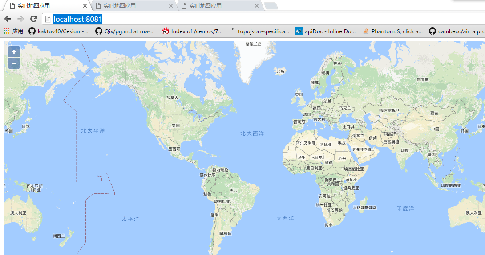
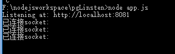
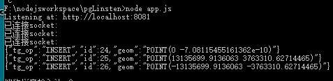
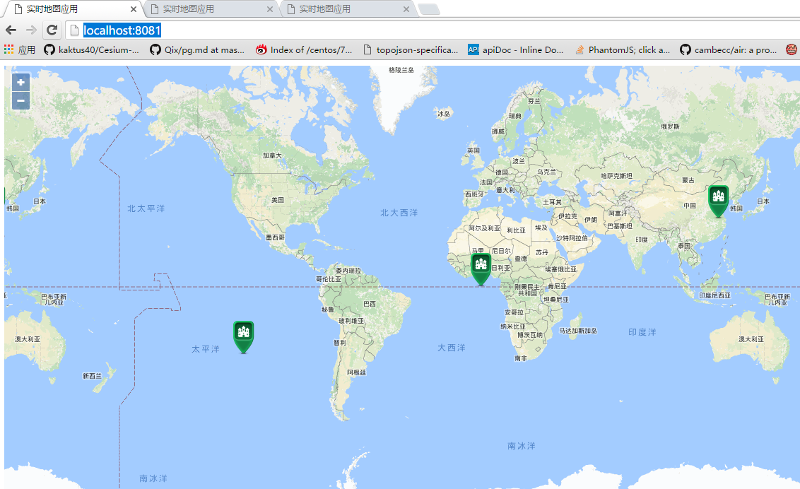
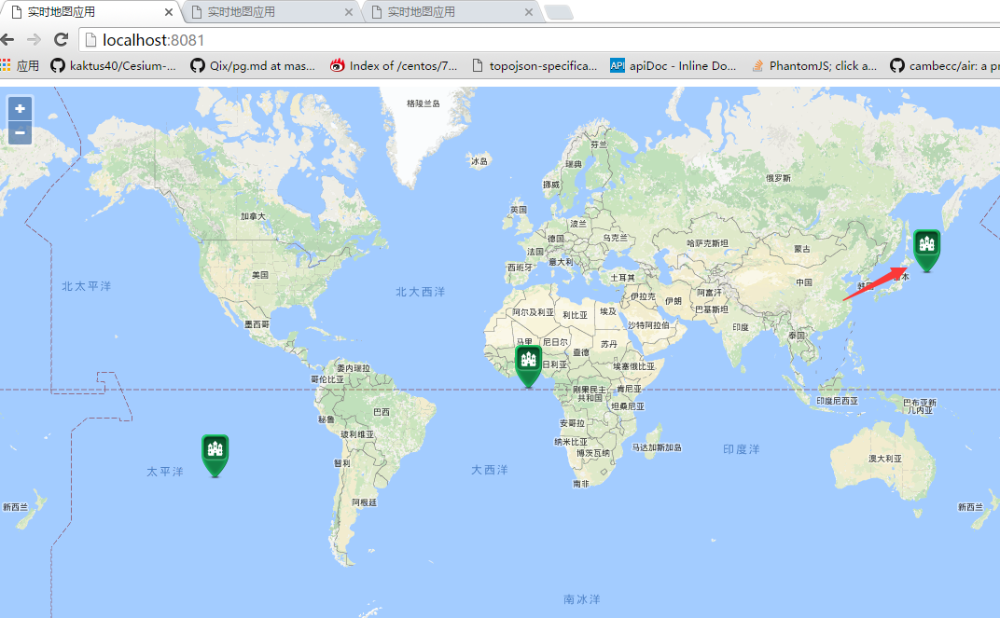
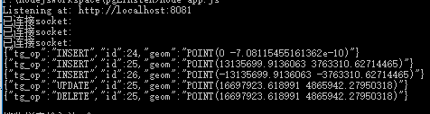
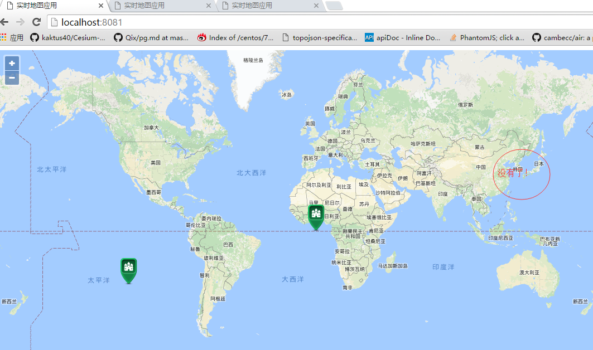

## [转载]postgres+socket.io+nodejs实时地图应用实践
##### [TAG 15](../class/15.md)
   
### 作者   
digoal  
    
### 日期  
2017-01-13                                                                                         
   
### 标签                 
PostgreSQL , 服务端编程接口 , pl language , 小程序 , PostGIS , 异步消息 , notify , listen , nodejs , socket.io   
      
----     
      
## 背景 
转载自：

https://my.oschina.net/freegis/blog/761713

是使用PostgreSQL+node.js+socket.io实现的一个实时地图，其中用到了PostgreSQL的异步消息通知机制（notify/listen），以及数据库的触发器，PostGIS地理库插件等。

## 正文
nodejs一直以异步io著称，其语言特性尤其擅长于在realtime应用中，如聊天室等。在进行实时应用开发时，必不可少的需要用到 [socket.io](http://socket.io/docs/) 库，可以说，nodejs+socket.io在实时应用中具有较好的表现能力。 本文既然选择以实时地图应用做个小例子，那么选择经典的PostgreSQL/PostGIS作为地图的数据库。希望实现的是模拟数据库数据插入了新的GPS坐标，而一旦数据发生改变，立刻将插入的GPS坐标广播到服务端，服务端广播到所有的客户端地图上，进行定位展示。早期作者使用的是redis的广播/订阅机制，最近发现Pg数据库的listen/notify也具备这种消息传递机制。 

本文主要的socke.io广播/订阅参考官网，Pg的listen/notify自行谷歌，作者仅简述一下自己如何考虑应用的。

## 一 服务器端
```
var fs = require('fs');
var http = require('http');
var socket = require('socket.io');
var pg = require('pg');
var util=require('util');

var constr=util.format('%s://%s:%s@%s:%s/%s', 'postgres','postgres','123456','192.168.43.125',5432,'Test');
var server = http.createServer(function(req, res) {
    res.writeHead(200, { 'Content-type': 'text/html'});
    res.end(fs.readFileSync(__dirname + '/index.html'));
}).listen(8081, function() {
    console.log('Listening at: http://localhost:8081');
});

var pgClient = new pg.Client(constr);//数据库连接
var socketio=socket.listen(server);//socketio
socketio.on('connection', function (socketclient) {
    console.log('已连接socket:');
    //socketclient.broadcast.emit('GPSCoor', data.payload);//广播给别人
    //socketclient.emit('GPSCoor', data.payload);//广播给自己

});
var sql = 'LISTEN gps'; //监听数据库的gps消息
var query = pgClient.query(sql);//开始数据库消息监听
    //数据库一旦获取通知，将通知消息通过socket.io发送到各个客户端展示。
pgClient.on('notification', function (data) {
    console.log(data.payload);
    //socketio.sockets.emit('GPSCoor', data.payload); //与下面的等价
    socketio.emit('GPSCoor', data.payload);//广播给所有的客户端

});
pgClient.connect();
```

## 二 数据库端
假设你已经安装了PostGIS插件，可以参考安装手册自行安装或者（购买阿里云RDS PostgreSQL，已内置PostGIS）。

建立一个测试表如下：

```
create table t_gps(
          id serial not null,
          geom geometry(Point,4326),
          constraint t_gps_pkey primary key (id)
);
```

建立索引

```
create index t_gps_geom_idx on t_gps using gist(geom);
```

对表的增删改建立一个触发器，触发器中发送变化数据出去:

```
CREATE OR REPLACE FUNCTION process_t_gps() RETURNS TRIGGER AS $body$
    DECLARE
        rec record;
    BEGIN
        IF (TG_OP = 'DELETE') THEN
            --插入的GPS都是4326的经纬度，我们将在3857的谷歌底图上显示数据，发送转换后的3857出去
            select TG_OP TG_OP,OLD.id,ST_AsText(ST_Transform(OLD.geom,3857)) geom into rec;
            perform pg_notify('gps',row_to_json(rec)::text);
            RETURN OLD;
        ELSIF (TG_OP = 'UPDATE') THEN 
            select TG_OP TG_OP,NEW.id,ST_AsText(ST_Transform(NEW.geom,3857)) geom into rec;
            perform pg_notify('gps',row_to_json(rec)::text);
            RETURN NEW;
        ELSIF (TG_OP = 'INSERT') THEN
            select TG_OP TG_OP,NEW.id,ST_AsText(ST_Transform(NEW.geom,3857)) geom into rec;
            perform pg_notify('gps',row_to_json(rec)::text);
            RETURN NEW;
        END IF;
        RETURN NULL;
    END;
$body$ LANGUAGE plpgsql;


CREATE TRIGGER T_GPS_TRIGGER
AFTER INSERT OR UPDATE OR DELETE ON T_GPS
    FOR EACH ROW EXECUTE PROCEDURE process_t_gps();
```

关于触发器的用法详解可以参考 

[《PostgreSQL 触发器 用法详解 1》](../201303/20130311_01.md)

[《PostgreSQL 触发器 用法详解 2》](../201303/20130311_02.md)  

## 三 客户端

```
<html>
<head>
    <meta charset='utf-8'>
    <title>实时地图应用</title>
    <link rel="stylesheet" href="http://openlayers.org/en/v3.18.2/css/ol.css" type="text/css">
    <script src="http://openlayers.org/en/v3.18.2/build/ol.js"></script>
    <script src="/socket.io/socket.io.js"></script>
    <script>
            var wktform=new ol.format.WKT();//wkt解析
            var gpsSource=new ol.source.Vector();
            function init(){
                var gpsLayer=new ol.layer.Vector({
                    source:gpsSource,
                    style:new ol.style.Style({
                        image: new ol.style.Icon(({
                            anchor: [0.5, 1],
                            src: 'http://openlayers.org/en/v3.18.2/examples/data/icon.png'
                        }))
                    })
                });
                var map = new ol.Map({
                    layers : [
                        new ol.layer.Tile({
                            title : '街道图',
                            visible : true,
                            source : new ol.source.XYZ({
                                url : 'http://www.google.cn/maps/vt?pb=!1m5!1m4!1i{z}!2i{x}!3i{y}!4i256!2m3!1e0!2sm!3i342009817!3m9!2szh-CN!3sCN!5e18!12m1!1e47!12m3!1e37!2m1!1ssmartmaps!4e0&token=32965'
                            })
                        }),
                        gpsLayer
                    ],
                    target : 'map',
                    controls : ol.control.defaults({
                        attributionOptions : 
                        ({
                            collapsible : false
                        })
                    }),
                    view : new ol.View({
                        center : [0, 0],
                        zoom : 2
                    })
                });
                var iosocket = io.connect();
                //接受服务端消息
                iosocket.on('GPSCoor', function(data) {
                    data=JSON.parse(data);
                    switch(data.tg_op){
                        case 'INSERT':
                            var feature=new ol.Feature({
                                geometry:wktform.readGeometry(data.geom)
                            });
                            feature.setId(data.id);
                            gpsSource.addFeature(feature);//地图新增点
                            break;
                        case 'UPDATE':
                            var geom=wktform.readGeometry(data.geom);
                            var feature=gpsSource.getFeatureById(data.id);
                            if(feature)
                                feature.setGeometry(geom);//修改已有点
                            break;
                        case 'DELETE':
                            var feature=gpsSource.getFeatureById(data.id);
                            if(feature)
                                gpsSource.removeFeature(feature);//删除点
                            break;
                    }
                });
            }


    </script>
</head>
<body onload="init()">
    <div id="map"></div>
</body>
</html>
```

客户端接收到消息后，改变当前地图上的图标gps坐标位置。

## 四 测试与结果
连开三个客户端连接如下：

  

  

### 4.1 数据库新增GPS坐标
```
insert into t_gps(geom) values (st_geomfromtext('Point(0 0)',4326));
insert into t_gps(geom) values (st_geomfromtext('Point(118 32)',4326));
insert into t_gps(geom) values (st_geomfromtext('Point(-118 -32)',4326));
```

页面自动响应效果如下：

  

  

### 4.2 数据库修改GPS坐标

查看下当前的数据如下：

```
Test=# select id,st_astext(geom) from t_gps;
 id |    st_astext    
----+-----------------
 24 | POINT(0 0)
 25 | POINT(118 32)
 26 | POINT(-118 -32)
(3 rows)
```

将id=25的坐标改成 150,40:

```
Test=# update t_gps set geom=st_geomfromtext('Point(150 40)',4326) where id=25;
UPDATE 1
```

服务器端打印如下：

  

  

### 4.3 数据库删除GPS坐标
```
Test=# delete from t_gps where id=25;
DELETE 1
```

  

  

所有以上操作，只是数据的增删改指令，服务器和客户端都是自动响应的。

## 结论
本文实现了，数据库一旦广播了消息，服务器端监听，并继续以sockeio广播到客户端。

全部过程，只是数据库发送了一个坐标消息无任何其他操作。

pg的notify和listen消息机制，真实应用一般比如写在触发器中，触发器监听是否有数据采集终端将新坐标写入或者更新，然后在触发器中notify消息，这样，前端实时响应。

可以做到将终端应用位置无任何操作的一波流发送到全部客户端实时展示。
    
      
      
  
<a rel="nofollow" href="http://info.flagcounter.com/h9V1"  ></a>  
  
  
  
  
  
  
## [digoal's 大量PostgreSQL文章入口](https://github.com/digoal/blog/blob/master/README.md "22709685feb7cab07d30f30387f0a9ae")
  
