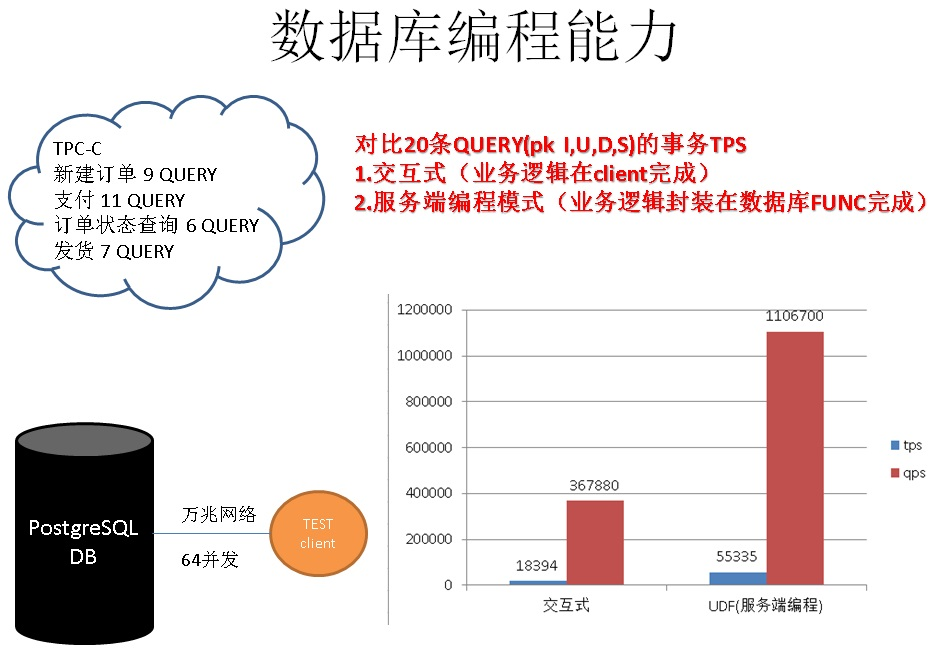

## 从微信小程序 到 数据库"小程序" , 鬼知道我经历了什么 
##### [TAG 15](../class/15.md)
     
### 作者     
digoal    
      
### 日期    
2017-01-13                                                                                           
     
### 标签                   
PostgreSQL , 服务端编程接口 , pl language , 小程序 , 地球语言 , java , perl , python , php , tcl , R , go , JULIA      
        
----       
        
## 背景   
微信小程序最近比较火，大概以后大家都不需要安装程序了，直接在微信中调用运行。跑在微信里的小程序类似一个虚拟机或者一个Docker容器，这是腾讯要分APP store蛋糕的节奏吗？  
   
从技术角度来看，微信小程序带来了几个好处，不需要安装软件，用户不需要进行软件的版本管理，节省了一点点手机的空间，同时还降低了流氓软件的可能，确实还不错对吧。     
   
不过接下来本文要给大家带来的是数据库"小程序"，这是个什么鬼呢？  
  
在讲数据库"小程序"前，看一副喜闻乐见的图，好像大多数情况下也是这样用的对吧：  
  
  
  
随着云计算的普及，云为我们提供了越来越多的便利，降低了开发和运维的成本。    
    
但是也必须思考一个问题，我们的云组件之间的网络延迟有多大（是否可控？），和以前在局域网是一样的吗（相比较局域网的服务器和服务器之间）？    
    
我可能无法给出一个标准的答案，但是你可以用各种方法测试验证一下。    
    
以往我们把数据放在数据库，数据库只担当了简单的增删改查功能，大部分的业务逻辑放在应用服务器来完成，一个事务可能需要与数据库进行多次的交互。    
    
那么应用服务器和数据库间如果多次交互，会不会浪费大量的时间在网络上面呢？这个问题会不会因为网络延迟而被放大呢？　　    
    
有几份测试数据仅供参考(这里指的服务端编程均指: 数据库编程(比如plpgsql函数,C函数,pljava, plperl, plpython, pltcl, plR等数据库函数))    
  
    
  
    
  
  
   
看完以上几组测试数据，知道为什么要写"数据库小程序"了吧。尽量的让数据和运算靠近，避免多次交互造成的网络RT放大问题。(当然了，并不是推荐大伙一切都丢给数据库，还是要有个度的，从图1我们可以了解到，随着硬件的发展和SHARDING技术的普及，尺度越来越大可能是个趋势呢，嘿嘿。)     
  
数据库小程序也许是这样的，水乳交融、天人合一，是不是功力大增呢？     
  
  
   
那么如何编写"数据库小程序"呢？  
  
## 一、什么样的数据库能编写"数据库小程序"  
大家可能觉得，只要数据库支持函数语言，或者过程语言，就可以编写"数据库小程序"了。    
    
这个想法固然没错，但是要知道通常数据库提供的过程语言是比较简陋的，包括Oracle的PL/SQL，PostgreSQL的plpgsql在内，虽然它们强大，它也无法与常用的编程语言例如GO, Java, Python, R等相提并论，特别是在一些非常专的领域，可能就有非常专业的语言来支撑，比如数据分析领域R语言就首当其冲。  
  
那么要让"数据库小程序"能够担当起真正的程序左右，看样子仅支持数据库的"简陋"语言是不够的。能不能在数据库中直接支持Java, Python, perl, tcl, R等流行的编程语言呢？  
  
如果有这样的数据库，肯定可以欢快的编写"数据库小程序"是不是呢。  
  
### 1 支持地球语言  
PostgreSQL是这样一个数据库，理论上你可以把任何编程语言（只要是地球语言），作为它的数据库端编程语言，目前已支持的语言就已经好多好多了，以语言插件的方式提供。  
  
C, plpgsql, plpython, plperl, pltcl, plR, pljava, plv8, ..... 恕我叫得出名字的编程语言较少，实际上支持的语言数不胜数啊    
  
除了考虑编程语言的支持，我们还需要考虑点其他的吗？  
  
### 2 底盘扎实、扩展能力强、（可靠性、HA、性能等就不说了，都是底盘技术）  
PostgreSQL的开放性不仅仅表现在编程能力的扩展方面，在PostgreSQL的生态中有很多贴近业务的用法，比如在PostgreSQL中存储和处理化学分子、存储和处理图像、存储和处理基因数据、存储和处理文本（包括高效正则、模糊、全文检索等技术，文本相似度查询等）、访问外部任意数据源等。  
  
一些比较有意思的特性如下  
  
1\. 支持使用常见的C, plpgsql, plpython, plperl, pltcl, plR, pljava, plv8等语言编写数据库端函数，  
  
同时你还可以根据PostgreSQL提供的扩展接口，扩展更多的编程语言  
  
https://www.postgresql.org/docs/devel/static/xplang.html    
    
2\. 数据类型支持丰富，例如支持传统数据类型外的包括 数组、序列, UUID , jsonb, GIS, text, 异构类型，Key-Value类型(hstore), 全文检索 , 化学 , 图像 , 基因 , 外部数据源 ... 等，同时支持自定义扩展类型      
    
3\. 支持btree, hash, gin , gist, spgist, brin , rum , bloom等索引类型，  
  
这些索引可以用于支持常见的排序，大于，小于，等于，任意列等于查询，同时也可以支持异构类型如数组、全文检索的匹配，图片文本的相似度排序，交叠查询，地理位置的运算，KNN等，支持块级索引（在IoT场景很好用）等。    
  
同时允许用户自定义索引接口，支持更多的数据类型。  
    
4\. SQL语法层面支持大部分2013 SQL标准，以及扩展的SQL用法： returning, 游标, 异步消息, ECPG, 窗口查询，递归查询，grouping set, upsert, skip lock, ad lock 等高级语法。    
    
5\. JOIN方面，支持hash join , merge join , nestloop join ，    
    
6\. 优化器方面，支持自定义成本因子， CBO ， 遗传算法等。    
    
7\. 另外可以利用GPU加速运算，包括隐式加速，也可以显示加速。    
    
隐式指数据库自身提供的custom scan provider编程接口，已经有实现了的插件。    
    
显式，指的是过程语言和CUDA的结合，例如PyCUDA。    
    
8\. 还可以用支持并行编程的语言来方便的实现多核处理，（目前PostgreSQL 9.6已经支持内置的并行计算(包括全表扫描、哈希JOIN，哈希聚合等操作)）。    
  
9\. 通过FDW接口，访问几乎任意外部数据  
  
https://wiki.postgresql.org/wiki/Fdw  
  
https://wiki.postgresql.org/wiki/Foreign_data_wrapper  
    
还有很多特性就不一一介绍了，用到的时候就知道它的好了（来自很多用户的切身感受）。    
    
PostgreSQL完全可以满足大多数业务的需求。  
  
更详细的介绍，请参考  
  
[《PostgreSQL 前世今生》](../201609/20160929_02.md)  
  
## 二、如何安装PostgreSQL"地球编程语言"  
前面说了，理论上你可以把任何编程语言（只要是地球语言），作为PostgreSQL的数据库端编程语言。  
  
那么如何安装呢？  
  
安装扩展语言很简单，通常只需要 create extension language_name 即可，目前PostgreSQL系统自带的语言包括C, python, perl, tcl, plpgsql.      
      
编译PostgreSQL时带上对应的参数即可，如果你是通过YUM或者RPM安装的PostgreSQL，那么下载并安装对应的扩展语言包就可以了    
    
```    
  --with-tcl              build Tcl modules (PL/Tcl)    
  --with-tclconfig=DIR    tclConfig.sh is in DIR    
  --with-perl             build Perl modules (PL/Perl)    
  --with-python           build Python modules (PL/Python)    
```    
    
软件安装好后，就会带对应的扩展语言，例如    
    
```    
$PGHOME/lib    
    
-rwxr-xr-x 1 digoal users 63K Jan 10 14:19 pltcl.so    
```    
    
在需要使用该语言的数据库中创建扩展语言，也可以在模板库中创建，以后通过模板库创建的数据库就默认带有这个扩展语言了    
    
以pltcl为例  
  
```    
postgres=# create extension pltcl;    
CREATE EXTENSION    
    
postgres=# create extension pltclu;    
CREATE EXTENSION    
    
postgres=# CREATE or REPLACE FUNCTION tcl_max(integer, integer) RETURNS integer AS $$    
    if {$1 > $2} {return $1}    
    return $2    
$$ LANGUAGE pltcl STRICT;    
CREATE FUNCTION    
    
postgres=# select tcl_max(1,2);    
 tcl_max     
---------    
       2    
(1 row)    
```    
  
是不是很简单呢  
  
## 三、如何搜索已有的PostgreSQL扩展编程语言?  
通常在pgxn.org, git.postgresql.org, github会比较多。  
  
但是还有一个好的搜索方法，搜索pl+语言即可，例如在谷歌搜索 "pljava postgresql"，马上就搜索到了  
  
PostgreSQL PL/Java – PL/Java: stored procedures, triggers, and ...  
https://tada.github.io/pljava/  
PL/Java is a free open-source extension for PostgreSQL? that allows stored ... files can use Java annotations from the org.postgresql.pljava.annotation package ...  
  
Home · tada/pljava Wiki · GitHub  
https://github.com/tada/pljava/wiki  
pljava - PL/Java is a free add-on module that brings Java? Stored Procedures, Triggers, and Functions to the PostgreSQL? backend.  
  
## 四、如何开发PostgreSQL"地球编程语言"  
你除了搜索现有的数据库编程语言使用，其实还可以贡献，比如你发现julia语言目前PostgreSQL还不支持作为数据库内置的编程语言怎么办？  
  
那也很好办哦，根据PostgreSQL提供的语言扩展接口，就可以把julia加进来了。  
  
扩展语言包括如下几个部分，其中language_handler为必须的    
    
1\. language_handler，必须为扩展语言创建一个对应的language_handler    
    
```    
CREATE FUNCTION handler_function_name()    
    RETURNS language_handler    
    AS 'path-to-shared-object'    
    LANGUAGE C;    
```    
    
2\. 当这个扩展语言需要使用do的语法（即不创建函数，直接跑代码）时，则需要实现一个对应的inline_function    
    
```    
CREATE FUNCTION inline_function_name(internal)    
    RETURNS void    
    AS 'path-to-shared-object'    
    LANGUAGE C;    
```    
    
3\. 如果需要让数据库支持这个语言的函数，在创建函数时检查内部的代码，则需要实现对应的validator    
    
PostgreSQL 参数 check_function_bodies = on 时，如果这个扩展语言实现了validator，那么使用这个扩展语言create function时会自动检查函数体的内容，比如语法是否正确。    
    
```    
CREATE FUNCTION validator_function_name(oid)    
    RETURNS void    
    AS 'path-to-shared-object'    
    LANGUAGE C STRICT;    
```    
    
4\. 创建扩展语言    
    
```    
CREATE [TRUSTED] [PROCEDURAL] LANGUAGE language-name    
    HANDLER handler_function_name    
    [INLINE inline_function_name]    
    [VALIDATOR validator_function_name] ;    
```    
  
编写扩展语言主要就是实现这几个内容，包括call handler, inline handler, validator。       
    
范例可以参考PostgreSQL内置的几个语言的代码，比如python    
    
postgresql-9.6.1/src/pl/plpython    
    
```    
Datum    
plpython_call_handler(PG_FUNCTION_ARGS)    
{    
        Datum           retval;    
        PLyExecutionContext *exec_ctx;    
        ErrorContextCallback plerrcontext;    
....  
        }    
        PG_END_TRY();    
    
        /* Pop the error context stack */    
        error_context_stack = plerrcontext.previous;    
        /* ... and then the execution context */    
        PLy_pop_execution_context();    
    
        return retval;    
}    
```  
  
## 五、如何编写"数据库小程序"  
编写"数据库小程序"，和你用对应的编程语言写程序是一样的，只是数据库有固定的格式  
  
例如  
  
```  
create or replace function 函数名(参数类型 参数名, .... ) returns [setof] void|返回类型  
as $$  
        // 这是代码部分，对应的代码如java,python，尽情发挥吧  
$$  
language 函数语言;  
```  
  
这里指的参数类型，返回类型，都是数据库的数据类型。  
  
create function的语法详细参考  
  
https://www.postgresql.org/docs/devel/static/sql-createfunction.html  
  
例子  
  
```  
CREATE or REPLACE FUNCTION tcl_max(integer, integer) RETURNS integer   
AS $$    
    if {$1 > $2} {return $1}    
    return $2    
$$ LANGUAGE pltcl STRICT;   
```  
  
是不是觉得我举例太少了，因为编写"数据库小程序"确实就是这么简单，嘿嘿，代码的内容完全取决于你的需求。  
  
## 六、扩展语言与数据库的类型转换  
因为数据库有自己的类型定义和表达方法，而扩展语言有自己的类型支持。    
    
比如PostgreSQL支持hstore数据类型，而python没有这个类型，那么默认情况下python就只能使用text来表达数据库的hstore.    
    
PostgreSQL允许用户自定义数据类型转换方法，将数据库支持的类型与扩展语言支持的类型桥梁建立起来。    
  
详见  
  
[《PostgreSQL 数据库扩展语言编程 之 plpgsql - 1》](./20170110_01.md)   
  
## 七、论"数据库小程序"健壮性  
不用我说，你一定在担心一个问题，如果"数据库小程序"写得烂或者写的"小程序"有BUG，会不会把数据库搞死？  
  
如果不加控制，是很危险的。不过还好PostgreSQL是进程模式的，要死也只死调用"小程序"的进程。  
  
同时由于进程模式，我们可以使用cgroup，对每个会话隔离资源，不会因为一个小程序写得有问题，把资源全部耗光。   
  
cgroup参考  
  
[《Linux cgroup - cpu与cpuset子系统讲解》](../201606/20160613_01.md)   
  
[《Linux cgroup - memory子系统讲解》](./20170111_02.md)  
  
同时数据库还对语言进行了比较明确的区分，可信和不可信语言。  
  
所谓可信指不会带来破坏性的语言，比如不会越权访问包括数据，数据文件，操作系统文件等，也没有import外部库的功能。  
  
不可信语言，需要超级用户才能创建，因为它不受任何限制，可以访问文件，IMPORT外部库，执行系统调用等。  
  
### trust & untrust 语言  
The optional key word TRUSTED specifies that the language does not grant access to data that the user would not otherwise have.     
    
Trusted languages are designed for ordinary database users (those without superuser privilege) and allows them to safely create functions and trigger procedures.     
    
Since PL functions are executed inside the database server, the TRUSTED flag should only be given for languages that do not allow access to database server internals or the file system.     
    
The languages PL/pgSQL, PL/Tcl, and PL/Perl are considered trusted;     
    
the languages PL/TclU, PL/PerlU, and PL/PythonU are designed to provide unlimited functionality and should not be marked trusted.    
    
trusted 指 这个语言不能访问越权的数据（如数据库服务器的文件、数据库内部（包括直接访问共享内存））    
    
untrusted 指 这个语言没有任何限制，允许访问任何数据（包括文件，网络，共享LIB库等，危害性较大），但是功能更加强大。    
  
## 八、一个例子(虽然没有用到宇宙第一流行语言php or java?不要打我,我真的不知道)  
这个例子使用PostgreSQL的异步消息通知机制（notify/listen），以及数据库的触发器，PostGIS地理库插件，结合nodejs, socket.io实现了一个实时的客户端GPS坐标更新的小业务。  
  
1\. 在数据库中新增GPS坐标，数据库端编写的"小程序"会自动发送异步消息给客户端，客户端马上就展示了当前新增的坐标  
  
    
  
2\. 修改GPS坐标，数据库端编写的"小程序"会自动发送异步消息给客户端，客户端刷新了当前坐标  
  
    
  
3\. 删除GPS坐标，数据库端编写的"小程序"会自动发送异步消息给客户端，客户端刷新了当前坐标  
  
   
  
详见   
   
[《[转载] postgres + socket.io + nodejs 实时地图应用实践》](./20170113_02.md)   
  
## 小结  
1\. PostgreSQL通过开放的语言接口，支持了目前地球上大部分的编程语言，你可以使用这些语言在数据库内部直接编写业务代码，是不是很神奇，是不是不再需要担心数据来回搬运了呢，是不是一下把交互扁平化了呢？  
  
2\. PostgreSQL以其开放的 数据类型、操作符、索引接口 支持了目前为止我见到的最为丰富的数据类型（数组、序列, UUID , jsonb, GIS, text, 异构类型，Key-Value类型(hstore), 全文检索 , 化学 , 图像 , 基因 ,）。  
  
也就是说，你在PostgreSQL里面操作这些数据，有如神助。  
  
比如  
  
[《从天津滨海新区大爆炸、危化品监管聊聊 数据库如何支持化学分子类型》](../201612/20161228_01.md)       
  
[《恭迎万亿级营销(圈人)潇洒的迈入毫秒时代 - 万亿user_tags级实时推荐系统数据库设计》](../201612/20161225_01.md)  
  
[《流计算风云再起 - PostgreSQL携PipelineDB力挺IoT》](../201612/20161220_01.md)        
  
[《金融风控、公安刑侦、社会关系、人脉分析等需求分析与数据库实现 - PostgreSQL图数据库场景应用》](../201612/20161213_01.md)  
  
[《基于 阿里云 RDS PostgreSQL 打造实时用户画像推荐系统》](../201610/20161021_01.md)              
  
还有很多可以从这里阅读  
  
[《想挑战AlphaGO吗？先和PostgreSQL玩一玩?? PostgreSQL与人工智能(AI)》](./20170106_01.md)    
  
3\. PostgreSQL还支持外部访问泵，可以扩展，可以访问目前几乎所有的外部数据源，你甚至可以用它来做冷热数据分层，数据的异构融合等。  
  
是不是对PostgreSQL心动了呢？快点来创建属于你的"数据库小程序吧"。  
    
## 参考  
[《PostgreSQL 数据库扩展语言编程 之 plpgsql - 1》](./20170110_01.md)   
  
[《iperf 测试网络性能指标》](../201604/20160426_01.md)   
  
[《PostgreSQL 网络延迟 瓶颈定量分析》](../201604/20160428_01.md)   
  
[《论云数据库编程能力的重要性》](../201605/20160505_01.md)   
  
[《[转载]postgres+socket.io+nodejs实时地图应用实践》](./20170113_02.md)  
    
[《Linux cgroup - cpu与cpuset子系统讲解》](../201606/20160613_01.md)   
  
[《Linux cgroup - memory子系统讲解》](./20170111_02.md)  
  
[《PostgreSQL 前世今生》](../201609/20160929_02.md)  
  
[《[转载]postgres + socket.io + nodejs实时地图应用实践》](./20170113_02.md)  
  
https://www.postgresql.org/docs/devel/static/xplang.html    
  
https://wiki.postgresql.org/wiki/Fdw  
  
https://wiki.postgresql.org/wiki/Foreign_data_wrapper  
  
https://www.postgresql.org/docs/devel/static/sql-createfunction.html  
  
      
  
<a rel="nofollow" href="http://info.flagcounter.com/h9V1"  ></a>  
  
  
  
  
  
  
## [digoal's 大量PostgreSQL文章入口](https://github.com/digoal/blog/blob/master/README.md "22709685feb7cab07d30f30387f0a9ae")
  
