## 蜂巢的艺术与技术价值 - PostgreSQL PostGIS's hex-grid
    
### 作者         
digoal    
      
### 日期          
2017-01-24    
          
### 标签    
PostgreSQL , vector grid , polygon grid , square grid , Hexagon grid , 矢量网格 , 几何网格 , 线段网格 , 多边形网格 , 四边形网格 , 六边形网格 , 蜂巢 , PostGIS , 地图 , 转换       
        
----          
        
## 背景    
人们为了更好的描述一个东西，有一种将大化小的思路，比如时钟被分为了12个区域，每个区域表示一个小时，然后每个小的区域又被划分为更小的区域表示分钟。  
  
  
  
在GIS系统中，也有类似的思想，比如将地图划分成网格。通过编码来简化地理位置的判断（比如相交，包含，距离计算等），但是请注意使用网格带来的问题，比如精度的问题，网格的大小决定了精度，又比如相对坐标的问题，可能无法描述清楚边界的归属。  
  
PS：  
  
1\. 在PostGIS中虽然也支持网格对象的描述方式，但是并不是使用这种方法来进行几何运算（比如相交，包含，距离计算等），所以不存在类似的精度问题，个人建议没有强需求的话，不必做这样的网格转换。  
  
PostgreSQL GIS索引的原理请参考  
  
[《从难缠的模糊查询聊开 - PostgreSQL独门绝招之一 GIN , GiST , SP-GiST , RUM 索引原理与技术背景》](../201612/20161231_01.md)  
  
2\. 如果是多种精度地图的切换（比如多个图层，每个图层代表一种地图精度），建议使用辐射的方式逐渐展开更精细的图层，以点为中心，逐渐辐射。（很多专业的地图软件是这样做的）    
  
回到主题，还记得最强大脑的蜂巢迷宫吗？   
   
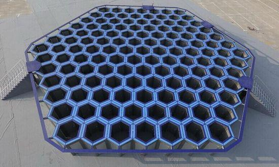   
  
还有勤劳的蜜蜂兄弟  
   
   
  
我们接下来要做的就是如何将几何图形转换为网格对象。  
  
## 回忆一下六边形的几何特性  
首先要了解一下六边形的几何特性，提供转换的计算基础。  
  
六边形可以切分为6个等边三角形  
  
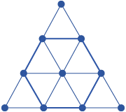   
  
所以它的边长关系如下  
  
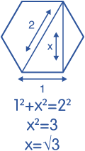   
  
面积计算  
  
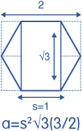   
  
更多细节详见  
  
https://hexnet.org/content/hexagonal-geometry  
  
## 将几何图形（sharp）转换为六边形网格  
  
比如要将澳大利亚的版图，转换为六边形网格，  
  
   
  
有两种方法，一种使用geotools的JAVA 类（在程序中转换），另一种是使用PostGIS插件的UDF（在数据库中转换）。  
  
当然，如果PostgreSQL安装了pljava插件的话，那么也可以在PostgreSQL中调用geotools提供的java类进行转换。  
  
下面是例子  
  
### 1 geotools Vector grids class  
http://docs.geotools.org/latest/userguide/extension/grid.html  
  
使用geotools vector grids class生成网格，返回 SimpleFeatureSource 类型。  
  
geotools Vector grids class支持将几何图形转换为 polygon网格 或者 line网格 。  
  
#### 1 Polygon grids  
举几个例子  
  
1\. 将澳大利亚地图转换为10度边长的正方形网格  
  
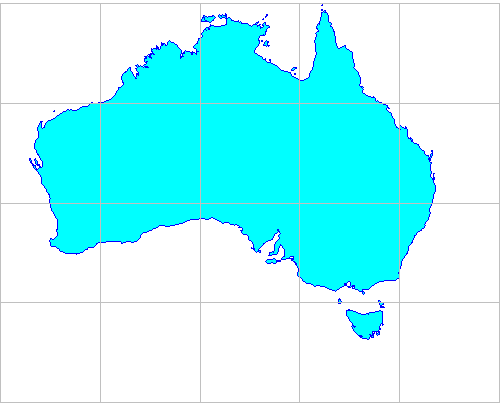   
  
输入澳大利亚的经纬度范围，转换  
  
```  
    ReferencedEnvelope gridBounds = new ReferencedEnvelope(  
            110.0, 150.0, -45.0, -5.0, DefaultGeographicCRS.WGS84);  
      
    SimpleFeatureSource grid = Grids.createSquareGrid(gridBounds, 10.0);  
```  
  
2\. 将澳大利亚地图转换为最大20度边长的扇形网格  
  
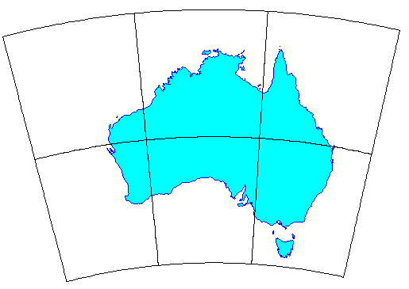   
  
```  
    ReferencedEnvelope gridBounds = new ReferencedEnvelope(  
            110, 160, -45, -8, DefaultGeographicCRS.WGS84);  
      
    double squareWidth = 20.0;  
  
    // max distance between vertices  
    double vertexSpacing = squareWidth / 20;  
      
    SimpleFeatureSource grid = Grids.createSquareGrid(gridBounds, squareWidth, vertexSpacing);  
```  
  
3\. 创建纵横宽100，变长为5.0的六边形网格  
  
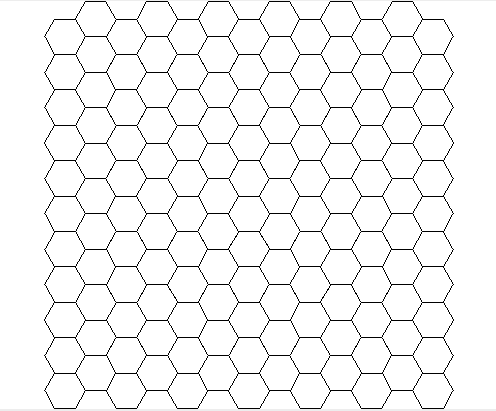   
  
```  
    ReferencedEnvelope gridBounds = new ReferencedEnvelope(0, 100, 0, 100, null);  
  
    // length of each hexagon edge  
    double sideLen = 5.0;  
    SimpleFeatureSource grid = Grids.createHexagonalGrid(gridBounds, sideLen);  
```  
  
4\. 导入图形、将澳大利亚地图转换为边长1度的六边形网格  
  
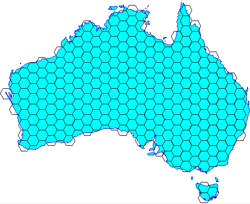   
  
自定义图形边界判断的类    
  
```  
import com.vividsolutions.jts.geom.Coordinate;  
import com.vividsolutions.jts.geom.Geometry;  
import com.vividsolutions.jts.geom.GeometryFactory;  
import java.io.IOException;  
import java.util.Map;  
import org.geotools.data.simple.SimpleFeatureSource;  
import org.geotools.factory.CommonFactoryFinder;  
import org.geotools.geometry.jts.JTSFactoryFinder;  
import org.opengis.feature.simple.SimpleFeatureType;  
import org.opengis.filter.Filter;  
import org.opengis.filter.FilterFactory2;  
  
  
public class IntersectionBuilder extends GridFeatureBuilder {  
    final FilterFactory2 ff2 = CommonFactoryFinder.getFilterFactory2();  
    final GeometryFactory gf = JTSFactoryFinder.getGeometryFactory();  
  
    final SimpleFeatureSource source;  
    int id = 0;  
  
    public IntersectionBuilder(SimpleFeatureType type, SimpleFeatureSource source) {  
        super(type);  
        this.source = source;  
    }  
  
    public void setAttributes(GridElement el, Map<String, Object> attributes) {  
        attributes.put("id", ++id);  
    }  
  
    @Override  
    public boolean getCreateFeature(GridElement el) {  
        Coordinate c = ((PolygonElement) el).getCenter();  
        Geometry p = gf.createPoint(c);  
        Filter filter = ff2.intersects(ff2.property("the_geom"), ff2.literal(p));  
        boolean result = false;  
  
        try {  
            result = !source.getFeatures(filter).isEmpty();  
        } catch (IOException ex) {  
            throw new IllegalStateException(ex);  
        }  
  
        return result;  
    }  
}  
```  
  
导入地图，在createHexagonalGrid中使用边界判断的类，生成六边形网格    
  
```  
    // Load the outline of Australia from a shapefile  
    URL url = getClass().getResource("oz.shp");  
    FileDataStore dataStore = FileDataStoreFinder.getDataStore(url);  
    SimpleFeatureSource ozMapSource = dataStore.getFeatureSource();  
  
    // Set the grid size (1 degree) and create a bounding envelope  
    // that is neatly aligned with the grid size  
    double sideLen = 1.0;  
    ReferencedEnvelope gridBounds =  
            Envelopes.expandToInclude(ozMapSource.getBounds(), sideLen);  
  
    // Create a feature type  
    SimpleFeatureTypeBuilder tb = new SimpleFeatureTypeBuilder();  
    tb.setName("grid");  
    tb.add(GridFeatureBuilder.DEFAULT_GEOMETRY_ATTRIBUTE_NAME,  
            Polygon.class, gridBounds.getCoordinateReferenceSystem());  
    tb.add("id", Integer.class);  
    SimpleFeatureType TYPE = tb.buildFeatureType();  
  
    // Build the grid the custom feature builder class  
    GridFeatureBuilder builder = new IntersectionBuilder(TYPE, ozMapSource);  
    SimpleFeatureSource grid = Grids.createHexagonalGrid(gridBounds, sideLen, -1, builder);  
```  
    
5\. 生成的六边形网格的摆放参数，横(flat)的还是竖(angled)的？    
  
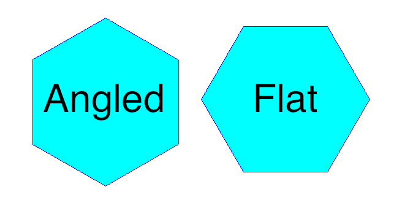   
  
默认为flat网格，如果要生成angled网格，如下  
  
```  
    ReferencedEnvelope gridBounds = new ReferencedEnvelope(0, 100, 0, 100, null);  
    double sideLen = 5.0;  
    GridFeatureBuilder builder = new DefaultGridFeatureBuilder();  
    SimpleFeatureSource grid = Hexagons.createGrid(  
            gridBounds, sideLen, HexagonOrientation.ANGLED, builder);  
```  
  
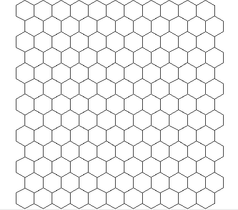   
  
#### 2 line grids  
转换为line 网格  
  
例子  
  
```  
    ReferencedEnvelope gridBounds = new ReferencedEnvelope(  
            110.0, 150.0, -45.0, -5.0, DefaultGeographicCRS.WGS84);  
      
    /*  
     * Line definitions:   
     * major lines at 10 degree spacing are indicated by level = 2  
     * minor lines at 2 degree spacing are indicated by level = 1  
     * (level values are arbitrary; only rank order matters)  
     */  
    List<OrthoLineDef> lineDefs = Arrays.asList(  
            // vertical (longitude) lines  
            new OrthoLineDef(LineOrientation.VERTICAL, 2, 10.0),  
            new OrthoLineDef(LineOrientation.VERTICAL, 1, 2.0),  
      
            // horizontal (latitude) lines  
            new OrthoLineDef(LineOrientation.HORIZONTAL, 2, 10.0),  
            new OrthoLineDef(LineOrientation.HORIZONTAL, 1, 2.0));  
      
    // Specify vertex spacing to get "densified" polygons  
    double vertexSpacing = 0.1;  
    SimpleFeatureSource grid = Lines.createOrthoLines(gridBounds, lineDefs, vertexSpacing);  
```  
  
### 2 PostGIS UDF hex-grid  
https://github.com/minus34/postgis-scripts/tree/master/hex-grid  
  
PostGIS不需要多介绍了，几十年的老牌GIS插件，在军方、科研、民用等各个领域有着非常广泛对应用。  
  
如果你使用了PostGIS插件的话，在里面存储了不管是geometry, polygon还是其他的地图类型，都可以转换为六边形网格。  
  
转换时使用这些定义好的UDF即可。  
  
UDF使用方法  
  
See the 2 sample usage scripts to see how to create a national hex grid, using the function.  
  
UDF输入参数  
  
Parameter|	Description  
---|---  
areakm2|	Area of each hexagon in square km. Note: output hexagon sizes can be off slightly due to coordinate rounding in the calcs.  
xmin,ymin|	Minimum coordinates of the grid extents (i.e. bottom, left).  
xmax,ymax|	Maximum coordinates of the grid extents (i.e. top, right).  
inputsrid|	The coordinate system (SRID) of the min/max coordinates.  
workingsrid|	The SRID used to process the hexagons:  
-| SRID must be a projected coord sys (i.e. in metres) as the calcs require ints. Degrees are out.  
-| Should be an equal area SRID - i.e. Albers or Lambert Azimuthal (e.g. Australia = 3577, US = 2163).  
-| Using a Mercator projection will NOT return hexagons of equal area (don't try it in Greenland).  
ouputsrid|	The SRID of the output hexagons.  
  
输出  
  
A set of hexagonal polygons as PostGIS geometries  
  
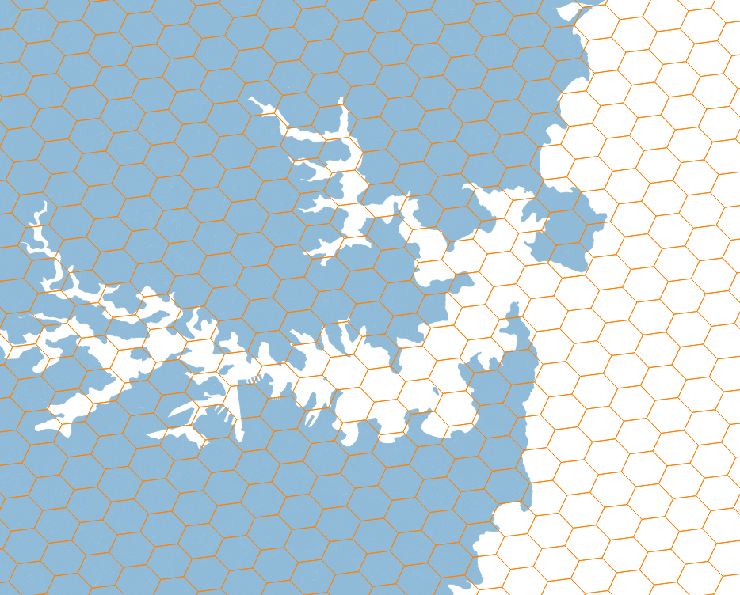   
  
转换基础，参考如下  
  
https://trac.osgeo.org/postgis/wiki/UsersWikiGenerateHexagonalGrid  
  
## 小结  
1\. 在PostGIS中虽然也支持网格对象的描述方式，但是并不是使用网格编码的方法来进行几何运算（比如相交，包含，距离计算等），而是类似矢量的计算方法，因此不存在网格的精度问题，个人建议没有强需求的话，不必将几何图形转换为网格。  
  
PostgreSQL GIS索引的原理请参考  
  
[《从难缠的模糊查询聊开 - PostgreSQL独门绝招之一 GIN , GiST , SP-GiST , RUM 索引原理与技术背景》](../201612/20161231_01.md)  
  
2\. 如果是多种精度地图的切换（比如多个图层，每个图层代表一种地图精度），建议使用辐射的方式逐渐展开更精细的图层，以点为中心，逐渐辐射。（很多专业的地图软件是这样做的）   
  
3\. 如果要将图形转换为网格，可以使用geotools提供的java class来转换，也可以使用PostGIS的UDF来转换，当然PostgreSQL如果安装了pljava过程语言的话，可以直接在数据库中调用geotools提供的java class对图形进行转换。  
  
## 参考  
1\. geotools vector grid包  
  
http://docs.geotools.org/latest/userguide/extension/grid.html  
  
2\. PostGIS 生成六边形网格的UDF  
  
https://github.com/minus34/postgis-scripts/tree/master/hex-grid  
  
3\. PostGIS 生成六边形网格的算法基础  
  
https://trac.osgeo.org/postgis/wiki/UsersWikiGenerateHexagonalGrid  
  
4\. 六边形几何公式  
  
https://hexnet.org/content/hexagonal-geometry  
  
5\. pljava  
  
https://tada.github.io/pljava/   
  
                                                              
                                                                      
                            
  
<a rel="nofollow" href="http://info.flagcounter.com/h9V1"  ></a>  
  
  
  
  
  
  
## [digoal's 大量PostgreSQL文章入口](https://github.com/digoal/blog/blob/master/README.md "22709685feb7cab07d30f30387f0a9ae")
  
