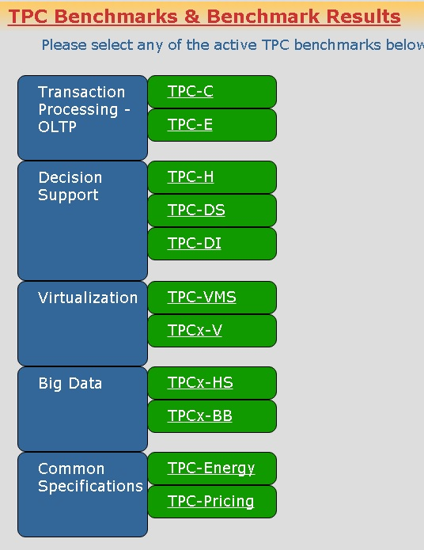
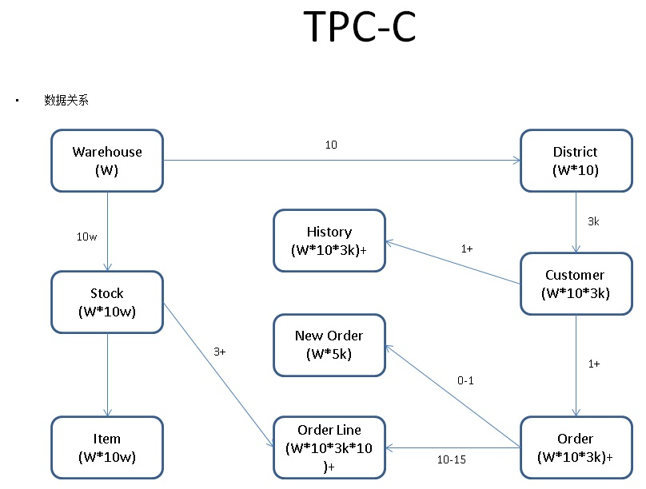

## 数据库界的华山论剑 tpc.org  
##### [TAG 23](../class/23.md)
        
### 作者   
digoal        
    
### 日期    
2017-01-25    
              
### 标签   
PostgreSQL , 工业标准 , 性能测试 , TPC-C , TPC-H , 列存储 , LLVM , 多核并行 , pgbench , sysbench    
    
----              
    
## 背景   
飞雪连天射白鹿，笑书神侠倚碧鸳。  
  
  
  
金庸老先生果然好功夫，武侠名著的首字串起来也是一首好湿。  
  
  
  
在很多的武侠小说中，都有武林盟主的角色（虽然通常为反派），既然是武林，武林盟主除了综合素质，人脉，武功当然也不能差。  
  
很多小说中武林盟主通常就是比武决出的，比如耳熟能详的华山论剑。  
  
  
  
玩过金庸群侠传的朋友，把主角的武功练到这样，当上武林盟主肯定是没有问题了。  
  
### 数据库界的华山论剑  
性能是衡量数据库的一项重要指标，正如华山论剑一样，也有类似的比武组织，根据数据库行业特点、应用场景制定了一系列的公开评判标准，如非常有代表性的tpc.org，大多数的硬件、数据库厂商(hp,ibm,oracle,teradata,微软 等)都混迹其中。  
  
  
  
全球公认的华山论剑，通常设计时会考虑真实的业务系统、能从各个层面评测数据库的性能（除了数据库本身的功能（ACID，PK，外键，约束等），还有简单的增删改查、关联查询，等），所以华山论剑更加具备公平性、更能体现数据库、硬件的综合能力。    
  
http://tpc.org/  
  
  
  
最为常见评测包括 在线业务系统评测(TPC-C, TPC-E), 分析系统评测(TPC-H, TPC-DS)。    
  
tpc-c和tpc-h是数十年来数据库、硬件产品的兵家必争之地。  
   
众所周知华数论剑是整个武林的比武盛会，就和现今的奥运会一样，每个国家都会派代表参加，比的是国家的综合能力。除了全球性的赛事，还有很多小范围的赛事，比如小学里面的学生运动会，范围较小，比拼的项目也较少。   
   
数据库行业也一样，除了全球公认的华山论剑，还有一些比试，通常是由数据库产品或社区根据被评测产品自身的特点设计的测试方法（显然这种评测会有一些偏颇，比如sysbench就是针对性的测试产品，它常用的oltp.lua测试场景比较单一），估计和很多人认为小米的安兔兔评测分数有失偏颇一样。   
   
### 华山论剑看不到的超能力  
当然了，还有很多数据库的能力是华山论剑的比拼规则无法发挥出来的，比如PostgreSQL这种非常强大的数据库，除了满足最为常见的在线处理型业务，还有很多独门秘技，能够在关键时刻使出大招，解决业务的痛点。  
  
我把召唤口诀编成了小故事如下，方便大家记住**召唤神龙**的方法。  
  
[《小鸡吉吉 小象P吉(PostgreSQL) 大象吉P(GPDB) 祝大大们吉祥如意，幸福安康，阖家欢乐!》](./20170120_01.md)   
  
### 三英战吕布  
由于全球的数据库市场份额还是很大的，并且单一的数据库产品很难解决所有的业务问题，所以数据库行业出现了很多细分的新兴产品，比如分析型数据库、图数据库、时序数据库、文档数据库、KV数据库等。  
  
而关系数据库由于相对较复杂，而且关系数据库的应用通常为核心应用，对数据库本身的可靠性、稳定性、性能等要求也高于其他类型的数据库。所以新兴的产品较少，往往是一些老牌的产品在进行技术攻关（比如真正的分布式、多核并行计算、动态编译、动态执行计划、GPU\FPGA加速、多副本等等）。  
  
PostgreSQL是开源关系数据库的代表产品之一，以可靠性、稳定性、性能、扩展能力、开源许可、大生态 等特征闻名。在功能方面一直引领开源数据库的发展，不愧为"最高级"的开源数据库。  
  
另外也有许多基于PostgreSQL的产品，包括在OLAP领域最为有名的开源MPP产品GPDB。  
  
使用PG + GP可以很好的满足企业的在线业务、在线分析、离线分析等最常见的需求。  
  
[《元旦技术大礼包 - ApsaraDB的左右互搏术 - 解决企业痛处 TP+AP混合需求 - 无须再唱《爱你痛到不知痛》》](./20170101_02.md)  
  
对于中小企业，如果没有专业的技术团队，相信很难搞定这么多的数据库产品（从关系数据库到分析型数据库、图数据库、时序数据库、文档数据库、KV数据库等）。  
  
云弥补了这一问题，给中小企业解决了这样的痛点，让企业更关注业务本身，而不是基础设施的投入上面。  
  
### 本文重点将介绍一下tpc-c，同时应许多朋友的要求，也简单的对比一下sysbench oltp.lua  
  
## 一、tpc-c 测试模型介绍  
tpc-c是一个交易系统的模型，包括下单、付款、订单查询、发货、查询库存等五个逻辑。  
  
涉及10个表（涉及变定长字符串、整型、浮点、高精度数值、时间、自增序列等类型）、数十个索引、以及数十个主外键约束。  
  
涉及查询，更新，删除，插入等操作，涉及JOIN操作，涉及排序，COUNG,SUM,COUNT DISTINCT，max等聚合操作，涉及select for update操作，涉及多层子查询，等操作。  
  
由于设计了主外键约束、以及并行的UPDATE操作，还会涉及到死锁的检测和回滚。  
  
共计31条SQL。    
  
  
  
  
  
### tpc-c 表、序列 结构  
  
10张表，一个序列  
  
```  
create table bmsql_config (  
  cfg_name    varchar(30) primary key,  
  cfg_value   varchar(50)  
);  
  
create table bmsql_warehouse (  
  w_id        integer   not null,  
  w_ytd       decimal(12,2),  
  w_tax       decimal(4,4),  
  w_name      varchar(10),  
  w_street_1  varchar(20),  
  w_street_2  varchar(20),  
  w_city      varchar(20),  
  w_state     char(2),  
  w_zip       char(9)  
);  
  
create table bmsql_district (  
  d_w_id       integer       not null,  
  d_id         integer       not null,  
  d_ytd        decimal(12,2),  
  d_tax        decimal(4,4),  
  d_next_o_id  integer,  
  d_name       varchar(10),  
  d_street_1   varchar(20),  
  d_street_2   varchar(20),  
  d_city       varchar(20),  
  d_state      char(2),  
  d_zip        char(9)  
);  
  
create table bmsql_customer (  
  c_w_id         integer        not null,  
  c_d_id         integer        not null,  
  c_id           integer        not null,  
  c_discount     decimal(4,4),  
  c_credit       char(2),  
  c_last         varchar(16),  
  c_first        varchar(16),  
  c_credit_lim   decimal(12,2),  
  c_balance      decimal(12,2),  
  c_ytd_payment  decimal(12,2),  
  c_payment_cnt  integer,  
  c_delivery_cnt integer,  
  c_street_1     varchar(20),  
  c_street_2     varchar(20),  
  c_city         varchar(20),  
  c_state        char(2),  
  c_zip          char(9),  
  c_phone        char(16),  
  c_since        timestamp,  
  c_middle       char(2),  
  c_data         varchar(500)  
);  
  
create sequence bmsql_hist_id_seq;  
  
create table bmsql_history (  
  hist_id  integer,  
  h_c_id   integer,  
  h_c_d_id integer,  
  h_c_w_id integer,  
  h_d_id   integer,  
  h_w_id   integer,  
  h_date   timestamp,  
  h_amount decimal(6,2),  
  h_data   varchar(24)  
);  
  
create table bmsql_new_order (  
  no_w_id  integer   not null,  
  no_d_id  integer   not null,  
  no_o_id  integer   not null  
);  
  
create table bmsql_oorder (  
  o_w_id       integer      not null,  
  o_d_id       integer      not null,  
  o_id         integer      not null,  
  o_c_id       integer,  
  o_carrier_id integer,  
  o_ol_cnt     integer,  
  o_all_local  integer,  
  o_entry_d    timestamp  
);  
  
create table bmsql_order_line (  
  ol_w_id         integer   not null,  
  ol_d_id         integer   not null,  
  ol_o_id         integer   not null,  
  ol_number       integer   not null,  
  ol_i_id         integer   not null,  
  ol_delivery_d   timestamp,  
  ol_amount       decimal(6,2),  
  ol_supply_w_id  integer,  
  ol_quantity     integer,  
  ol_dist_info    char(24)  
);  
  
create table bmsql_item (  
  i_id     integer      not null,  
  i_name   varchar(24),  
  i_price  decimal(5,2),  
  i_data   varchar(50),  
  i_im_id  integer  
);  
  
create table bmsql_stock (  
  s_w_id       integer       not null,  
  s_i_id       integer       not null,  
  s_quantity   integer,  
  s_ytd        integer,  
  s_order_cnt  integer,  
  s_remote_cnt integer,  
  s_data       varchar(50),  
  s_dist_01    char(24),  
  s_dist_02    char(24),  
  s_dist_03    char(24),  
  s_dist_04    char(24),  
  s_dist_05    char(24),  
  s_dist_06    char(24),  
  s_dist_07    char(24),  
  s_dist_08    char(24),  
  s_dist_09    char(24),  
  s_dist_10    char(24)  
);  
```  
  
### 索引  
  
10个唯一索引、主键、联合唯一、联合主键  
  
```  
alter table bmsql_warehouse add constraint bmsql_warehouse_pkey  
  primary key (w_id);  
  
alter table bmsql_district add constraint bmsql_district_pkey  
  primary key (d_w_id, d_id);  
  
alter table bmsql_customer add constraint bmsql_customer_pkey  
  primary key (c_w_id, c_d_id, c_id);  
  
create index bmsql_customer_idx1  
  on  bmsql_customer (c_w_id, c_d_id, c_last, c_first);  
  
alter table bmsql_oorder add constraint bmsql_oorder_pkey  
  primary key (o_w_id, o_d_id, o_id);  
  
create unique index bmsql_oorder_idx1  
  on  bmsql_oorder (o_w_id, o_d_id, o_carrier_id, o_id);  
  
alter table bmsql_new_order add constraint bmsql_new_order_pkey  
  primary key (no_w_id, no_d_id, no_o_id);  
  
alter table bmsql_order_line add constraint bmsql_order_line_pkey  
  primary key (ol_w_id, ol_d_id, ol_o_id, ol_number);  
  
alter table bmsql_stock add constraint bmsql_stock_pkey  
  primary key (s_w_id, s_i_id);  
  
alter table bmsql_item add constraint bmsql_item_pkey  
  primary key (i_id);  
```  
  
### 外键约束  
  
10个外键约束  
  
```  
alter table bmsql_district add constraint d_warehouse_fkey  
    foreign key (d_w_id)  
    references bmsql_warehouse (w_id);  
  
alter table bmsql_customer add constraint c_district_fkey  
    foreign key (c_w_id, c_d_id)  
    references bmsql_district (d_w_id, d_id);  
  
alter table bmsql_history add constraint h_customer_fkey  
    foreign key (h_c_w_id, h_c_d_id, h_c_id)  
    references bmsql_customer (c_w_id, c_d_id, c_id);  
alter table bmsql_history add constraint h_district_fkey  
    foreign key (h_w_id, h_d_id)  
    references bmsql_district (d_w_id, d_id);  
  
alter table bmsql_new_order add constraint no_order_fkey  
    foreign key (no_w_id, no_d_id, no_o_id)  
    references bmsql_oorder (o_w_id, o_d_id, o_id);  
  
alter table bmsql_oorder add constraint o_customer_fkey  
    foreign key (o_w_id, o_d_id, o_c_id)  
    references bmsql_customer (c_w_id, c_d_id, c_id);  
  
alter table bmsql_order_line add constraint ol_order_fkey  
    foreign key (ol_w_id, ol_d_id, ol_o_id)  
    references bmsql_oorder (o_w_id, o_d_id, o_id);  
alter table bmsql_order_line add constraint ol_stock_fkey  
    foreign key (ol_supply_w_id, ol_i_id)  
    references bmsql_stock (s_w_id, s_i_id);  
  
alter table bmsql_stock add constraint s_warehouse_fkey  
    foreign key (s_w_id)  
    references bmsql_warehouse (w_id);  
alter table bmsql_stock add constraint s_item_fkey  
    foreign key (s_i_id)  
    references bmsql_item (i_id);  
```  
  
### 业务逻辑1 - 新建订单  
取自benchmarksql 代码 jTPCCConnection.java  
  
事务内容：对于任意一个客户端,从固定的仓库随机选取  5-15 件商品,创建新订单.其中 1%的订单要由假想的用户操作失败而回滚。  
  
占比 : 45%  
  
```  
        // PreparedStataments for NEW_ORDER  
        stmtNewOrderSelectWhseCust = dbConn.prepareStatement(  
                "SELECT c_discount, c_last, c_credit, w_tax " +  
                "    FROM bmsql_customer " +  
                "    JOIN bmsql_warehouse ON (w_id = c_w_id) " +  
                "    WHERE c_w_id = ? AND c_d_id = ? AND c_id = ?");  
        stmtNewOrderSelectDist = dbConn.prepareStatement(  
                "SELECT d_tax, d_next_o_id " +  
                "    FROM bmsql_district " +  
                "    WHERE d_w_id = ? AND d_id = ? " +  
                "    FOR UPDATE");  
        stmtNewOrderUpdateDist = dbConn.prepareStatement(  
                "UPDATE bmsql_district " +  
                "    SET d_next_o_id = d_next_o_id + 1 " +  
                "    WHERE d_w_id = ? AND d_id = ?");  
        stmtNewOrderInsertOrder = dbConn.prepareStatement(  
                "INSERT INTO bmsql_oorder (" +  
                "    o_id, o_d_id, o_w_id, o_c_id, o_entry_d, " +  
                "    o_ol_cnt, o_all_local) " +  
                "VALUES (?, ?, ?, ?, ?, ?, ?)");  
        stmtNewOrderInsertNewOrder = dbConn.prepareStatement(  
                "INSERT INTO bmsql_new_order (" +  
                "    no_o_id, no_d_id, no_w_id) " +  
                "VALUES (?, ?, ?)");  
        stmtNewOrderSelectStock = dbConn.prepareStatement(  
                "SELECT s_quantity, s_data, " +  
                "       s_dist_01, s_dist_02, s_dist_03, s_dist_04, " +  
                "       s_dist_05, s_dist_06, s_dist_07, s_dist_08, " +  
                "       s_dist_09, s_dist_10 " +  
                "    FROM bmsql_stock " +  
                "    WHERE s_w_id = ? AND s_i_id = ? " +  
                "    FOR UPDATE");  
        stmtNewOrderSelectItem = dbConn.prepareStatement(  
                "SELECT i_price, i_name, i_data " +  
                "    FROM bmsql_item " +  
                "    WHERE i_id = ?");  
        stmtNewOrderUpdateStock = dbConn.prepareStatement(  
                "UPDATE bmsql_stock " +  
                "    SET s_quantity = ?, s_ytd = s_ytd + ?, " +  
                "        s_order_cnt = s_order_cnt + 1, " +  
                "        s_remote_cnt = s_remote_cnt + ? " +  
                "    WHERE s_w_id = ? AND s_i_id = ?");  
        stmtNewOrderInsertOrderLine = dbConn.prepareStatement(  
                "INSERT INTO bmsql_order_line (" +  
                "    ol_o_id, ol_d_id, ol_w_id, ol_number, " +  
                "    ol_i_id, ol_supply_w_id, ol_quantity, " +  
                "    ol_amount, ol_dist_info) " +  
                "VALUES (?, ?, ?, ?, ?, ?, ?, ?, ?)");  
```  
  
### 业务逻辑2 - 支付订单  
  
事务内容：对于任意一个客户端,从固定的仓库随机选取一个辖区及其内用户,采用随机的金额支付一笔订单,并作相应历史纪录.  
  
占比 : 43%  
  
```  
        // PreparedStatements for PAYMENT  
        stmtPaymentSelectWarehouse = dbConn.prepareStatement(  
                "SELECT w_name, w_street_1, w_street_2, w_city, " +  
                "       w_state, w_zip " +  
                "    FROM bmsql_warehouse " +  
                "    WHERE w_id = ? ");  
        stmtPaymentSelectDistrict = dbConn.prepareStatement(  
                "SELECT d_name, d_street_1, d_street_2, d_city, " +  
                "       d_state, d_zip " +  
                "    FROM bmsql_district " +  
                "    WHERE d_w_id = ? AND d_id = ?");  
        stmtPaymentSelectCustomerListByLast = dbConn.prepareStatement(  
                "SELECT c_id " +  
                "    FROM bmsql_customer " +  
                "    WHERE c_w_id = ? AND c_d_id = ? AND c_last = ? " +  
                "    ORDER BY c_first");  
        stmtPaymentSelectCustomer = dbConn.prepareStatement(  
                "SELECT c_first, c_middle, c_last, c_street_1, c_street_2, " +  
                "       c_city, c_state, c_zip, c_phone, c_since, c_credit, " +  
                "       c_credit_lim, c_discount, c_balance " +  
                "    FROM bmsql_customer " +  
                "    WHERE c_w_id = ? AND c_d_id = ? AND c_id = ? " +  
                "    FOR UPDATE");  
        stmtPaymentSelectCustomerData = dbConn.prepareStatement(  
                "SELECT c_data " +  
                "    FROM bmsql_customer " +  
                "    WHERE c_w_id = ? AND c_d_id = ? AND c_id = ?");  
        stmtPaymentUpdateWarehouse = dbConn.prepareStatement(  
                "UPDATE bmsql_warehouse " +  
                "    SET w_ytd = w_ytd + ? " +  
                "    WHERE w_id = ?");  
        stmtPaymentUpdateDistrict = dbConn.prepareStatement(  
                "UPDATE bmsql_district " +  
                "    SET d_ytd = d_ytd + ? " +  
                "    WHERE d_w_id = ? AND d_id = ?");  
        stmtPaymentUpdateCustomer = dbConn.prepareStatement(  
                "UPDATE bmsql_customer " +  
                "    SET c_balance = c_balance - ?, " +  
                "        c_ytd_payment = c_ytd_payment + ?, " +  
                "        c_payment_cnt = c_payment_cnt + 1 " +  
                "    WHERE c_w_id = ? AND c_d_id = ? AND c_id = ?");  
        stmtPaymentUpdateCustomerWithData = dbConn.prepareStatement(  
                "UPDATE bmsql_customer " +  
                "    SET c_balance = c_balance - ?, " +  
                "        c_ytd_payment = c_ytd_payment + ?, " +  
                "        c_payment_cnt = c_payment_cnt + 1, " +  
                "        c_data = ? " +  
                "    WHERE c_w_id = ? AND c_d_id = ? AND c_id = ?");  
        stmtPaymentInsertHistory = dbConn.prepareStatement(  
                "INSERT INTO bmsql_history (" +  
                "    h_c_id, h_c_d_id, h_c_w_id, h_d_id, h_w_id, " +  
                "    h_date, h_amount, h_data) " +  
                "VALUES (?, ?, ?, ?, ?, ?, ?, ?)");  
```  
  
### 业务逻辑3 - 查询订单状态  
事务内容：对于任意一个客户端,从固定的仓库随机选取一个辖区及其内用户,读取其最后一条订单,显示订单内每件商品的状态.  
  
占比 : 4%  
  
```  
        // PreparedStatements for ORDER_STATUS  
        stmtOrderStatusSelectCustomerListByLast = dbConn.prepareStatement(  
                "SELECT c_id " +  
                "    FROM bmsql_customer " +  
                "    WHERE c_w_id = ? AND c_d_id = ? AND c_last = ? " +  
                "    ORDER BY c_first");  
        stmtOrderStatusSelectCustomer = dbConn.prepareStatement(  
                "SELECT c_first, c_middle, c_last, c_balance " +  
                "    FROM bmsql_customer " +  
                "    WHERE c_w_id = ? AND c_d_id = ? AND c_id = ?");  
        stmtOrderStatusSelectLastOrder = dbConn.prepareStatement(  
                "SELECT o_id, o_entry_d, o_carrier_id " +  
                "    FROM bmsql_oorder " +  
                "    WHERE o_w_id = ? AND o_d_id = ? AND o_c_id = ? " +  
                "      AND o_id = (" +  
                "          SELECT max(o_id) " +  
                "              FROM bmsql_oorder " +  
                "              WHERE o_w_id = ? AND o_d_id = ? AND o_c_id = ?" +  
                "          )");  
        stmtOrderStatusSelectOrderLine = dbConn.prepareStatement(  
                "SELECT ol_i_id, ol_supply_w_id, ol_quantity, " +  
                "       ol_amount, ol_delivery_d " +  
                "    FROM bmsql_order_line " +  
                "    WHERE ol_w_id = ? AND ol_d_id = ? AND ol_o_id = ? " +  
                "    ORDER BY ol_w_id, ol_d_id, ol_o_id, ol_number");  
```  
  
### 业务逻辑4 - 发货  
事务内容：对于任意一个客户端,随机选取一个发货包,更新被处理订单的用户余额,并把该订单从新订单中删除.  
  
占比 : 4%  
  
```  
        // PreparedStatements for STOCK_LEVEL  
        switch (dbType)  
        {  
            case jTPCCConfig.DB_POSTGRES:  
                stmtStockLevelSelectLow = dbConn.prepareStatement(  
                    "SELECT count(*) AS low_stock FROM (" +  
                    "    SELECT s_w_id, s_i_id, s_quantity " +  
                    "        FROM bmsql_stock " +  
                    "        WHERE s_w_id = ? AND s_quantity < ? AND s_i_id IN (" +  
                    "            SELECT ol_i_id " +  
                    "                FROM bmsql_district " +  
                    "                JOIN bmsql_order_line ON ol_w_id = d_w_id " +  
                    "                 AND ol_d_id = d_id " +  
                    "                 AND ol_o_id >= d_next_o_id - 20 " +  
                    "                 AND ol_o_id < d_next_o_id " +  
                    "                WHERE d_w_id = ? AND d_id = ? " +  
                    "        ) " +  
                    "    ) AS L");  
                break;  
  
            default:  
                stmtStockLevelSelectLow = dbConn.prepareStatement(  
                    "SELECT count(*) AS low_stock FROM (" +  
                    "    SELECT s_w_id, s_i_id, s_quantity " +  
                    "        FROM bmsql_stock " +  
                    "        WHERE s_w_id = ? AND s_quantity < ? AND s_i_id IN (" +  
                    "            SELECT ol_i_id " +  
                    "                FROM bmsql_district " +  
                    "                JOIN bmsql_order_line ON ol_w_id = d_w_id " +  
                    "                 AND ol_d_id = d_id " +  
                    "                 AND ol_o_id >= d_next_o_id - 20 " +  
                    "                 AND ol_o_id < d_next_o_id " +  
                    "                WHERE d_w_id = ? AND d_id = ? " +  
                    "        ) " +  
                    "    )");  
                break;  
        }  
```  
  
### 业务逻辑5 - 查询库存  
  
事物内容：对于任意一个客户端,从固定的仓库和辖区随机选取最后 20 条订单,查看订单中所有的货物的库存,计算并显示所有库存低于随机生成域值的商品数量.  
  
占比 : 4%  
  
```  
        // PreparedStatements for DELIVERY_BG  
        stmtDeliveryBGSelectOldestNewOrder = dbConn.prepareStatement(  
                "SELECT no_o_id " +  
                "    FROM bmsql_new_order " +  
                "    WHERE no_w_id = ? AND no_d_id = ? " +  
                "    ORDER BY no_o_id ASC");  
        stmtDeliveryBGDeleteOldestNewOrder = dbConn.prepareStatement(  
                "DELETE FROM bmsql_new_order " +  
                "    WHERE no_w_id = ? AND no_d_id = ? AND no_o_id = ?");  
        stmtDeliveryBGSelectOrder = dbConn.prepareStatement(  
                "SELECT o_c_id " +  
                "    FROM bmsql_oorder " +  
                "    WHERE o_w_id = ? AND o_d_id = ? AND o_id = ?");  
        stmtDeliveryBGUpdateOrder = dbConn.prepareStatement(  
                "UPDATE bmsql_oorder " +  
                "    SET o_carrier_id = ? " +  
                "    WHERE o_w_id = ? AND o_d_id = ? AND o_id = ?");  
        stmtDeliveryBGSelectSumOLAmount = dbConn.prepareStatement(  
                "SELECT sum(ol_amount) AS sum_ol_amount " +  
                "    FROM bmsql_order_line " +  
                "    WHERE ol_w_id = ? AND ol_d_id = ? AND ol_o_id = ?");  
        stmtDeliveryBGUpdateOrderLine = dbConn.prepareStatement(  
                "UPDATE bmsql_order_line " +  
                "    SET ol_delivery_d = ? " +  
                "    WHERE ol_w_id = ? AND ol_d_id = ? AND ol_o_id = ?");  
        stmtDeliveryBGUpdateCustomer = dbConn.prepareStatement(  
                "UPDATE bmsql_customer " +  
                "    SET c_balance = c_balance + ?, " +  
                "        c_delivery_cnt = c_delivery_cnt + 1 " +  
                "    WHERE c_w_id = ? AND c_d_id = ? AND c_id = ?");  
```  
  
## 二、sysbench介绍  
  
### sysbench oltp.lua 测试表 结构  
相比tpc-c，sysbench的oltp.lua测试结构显得非常单一。  
  
https://github.com/akopytov/sysbench  
  
https://github.com/akopytov/sysbench/blob/master/sysbench/lua/oltp_common.lua  
  
只涉及一张或数张结构一样的表，包含了4个字段。  
  
表中没有涉及主外键，没有涉及浮点或高精度数值类型，没有涉及时间类型。  
  
```  
   query = string.format([[  
CREATE TABLE sbtest%d(  
  id %s,  
  k INTEGER DEFAULT '0' NOT NULL,  
  c CHAR(120) DEFAULT '' NOT NULL,  
  pad CHAR(60) DEFAULT '' NOT NULL,  
  %s (id)  
) %s %s]],  
      table_num, id_def, id_index_def, engine_def, extra_table_options)   
```  
  
### sysbench oltp.lua SQL  
oltp.lua的测试SQL也非常单一，仅涉及的QUERY包括插入、查询、删除、修改。  
  
没有涉及JOIN，没有涉及子查询以及嵌套子查询，没有涉及SELECT FOR UPDATE。  
  
没有涉及业务逻辑，不需要考虑数据冲突、业务死锁的问题等。  
  
https://github.com/akopytov/sysbench/blob/master/sysbench/lua/oltp_common.lua  
  
```  
local stmt_defs = {  
   point_selects = {  
      "SELECT c FROM sbtest%u WHERE id=?",  
      t.INT},  
   simple_ranges = {  
      "SELECT c FROM sbtest%u WHERE id BETWEEN ? AND ?",  
      t.INT, t.INT},  
   sum_ranges = {  
      "SELECT SUM(k) FROM sbtest%u WHERE id BETWEEN ? AND ?",  
       t.INT, t.INT},  
   order_ranges = {  
      "SELECT c FROM sbtest%u WHERE id BETWEEN ? AND ? ORDER BY c",  
       t.INT, t.INT},  
   distinct_ranges = {  
      "SELECT DISTINCT c FROM sbtest%u WHERE id BETWEEN ? AND ? ORDER BY c",  
      t.INT, t.INT},  
   index_updates = {  
      "UPDATE sbtest%u SET k=k+1 WHERE id=?",  
      t.INT},  
   non_index_updates = {  
      "UPDATE sbtest%u SET c=? WHERE id=?",  
      {t.CHAR, 120}, t.INT},  
   deletes = {  
      "DELETE FROM sbtest%u WHERE id=?",  
      t.INT},  
   inserts = {  
      "INSERT INTO sbtest%u (id, k, c, pad) VALUES (?, ?, ?, ?)",  
      t.INT, t.INT, {t.CHAR, 120}, {t.CHAR, 60}},  
}  
```  
  
另外，oltp.lua里有几条用到了between and，而实际上这个QUERY在PostgreSQL有更好的解法，请参考  
  
[《聊聊between and的坑 和 神奇的解法》](./20170126_02.md)   
  
接下来聊一聊tpc-c的测试方法  
  
## 三、PostgreSQL tpc-c 测试方法  
  
### 测试环境介绍    
benchmarksql 测试机、数据库测试机，（并没有找到空闲的测试机，数据库测试机上还跑了几十个GPDB的数据节点）。  
  
本文以介绍tpc-c的测试方法为主，并未对测试环境、数据库进行优化后进行测试。  
  
```  
  E5-2682  
  512GB 内存  
  1GB 网卡  
  SATA 磁盘  
  EXT4 文件系统  
  CentOS 6.x x64  
  PostgreSQL 9.6 / 10.0  
```  
  
挂载tmpfs数据盘, wal日志放在sata盘上。    
  
```  
# mkdir /data01  
# mount -t tmpfs -o size=384G tmpfs /data01  
```  
  
目前有很多纯内存数据库，他们同样可以满足数据库的ACID特性，比如voltdb，通过多副本来实现ACID的D即持久化。  
  
PostgreSQL同样支持同步多副本，可以指定任意副本数，从而PostgreSQL数据库作为内存数据库依旧能满足ACID的D即持久化特性。  
  
再一次感受到了PostgreSQL的贴心设计，任意多副本同步不仅可以实现内存数据库的ACID，同样可用于HA、容灾等应用场景。  
  
我这里测试场景使用的是数据盘在内存，而日志盘在SATA磁盘的设计。  
  
### 下载 benchmarksql    
https://sourceforge.net/projects/benchmarksql/      
  
[《benchmarksql-5.0.zip》](20170125_01_benchmarksql-5.0.zip)  
  
unzip benchmarksql-5.0.zip   
  
### 阅读HOW-TO-RUN.txt, TimedDriver.odt  
  
[《HOW-TO-RUN.txt》](20170125_01_HOW-TO-RUN.txt)  
  
[《TimedDriver.odt》](20170125_01_TimedDriver.odt)  
    
### 下载安装 JDK8      
  
```    
http://www.oracle.com/technetwork/cn/java/javase/downloads/jdk7-downloads-1880260.html    
  
wget http://download.oracle.com/otn-pub/java/jdk/8u121-b13/e9e7ea248e2c4826b92b3f075a80e441/jdk-8u121-linux-x64.rpm?AuthParam=1485240242_0f9ef043f7dff0c1b663c1189202317e  
  
rpm -ivh jdk-8u121-linux-x64.rpm  
```    
    
检查包安装位置 (使用rpm安装时也可以直接指定位置)      
  
```    
rpm -ql jdk1.8.0_121  
...    
/usr/java/jdk1.8.0_121/bin/java   
...    
```    
    
配置JAVA环境变量      
  
```    
$  export JAVA_HOME=/usr/java/jdk1.8.0_121   
$  export PATH=$JAVA_HOME/bin:$PATH       
```    
    
### 下载安装ant  
  
```  
yum install -y ant  
  
rpm -ql ant  
```  
  
### 编译并打包benchmarksql  
  
```  
export CLASSPATH=/usr/share/java/ant-launcher.jar  
  
cd benchmarksql-5.0  
  
ant -buildfile ./build.xml  
```  
  
### 下载postgresql jdbc驱动  
下载最新java版本对应的postgresql jdbc jar，替换旧版本      
  
```    
wget https://jdbc.postgresql.org/download/postgresql-9.4.1212.jar  
  
mv postgresql-9.4.1212.jar benchmarksql-5.0/lib/postgres/  
  
rm -f benchmarksql-5.0/lib/postgres/postgresql-9.3-1102.jdbc41.jar  
```    
    
### 配置log4j  
修改log4j，减少日志打印量。priority改成info，只输出最终结果，不输出产生订单的日志。      
  
```    
$ vi log4j.properties  
  
log4j.rootLogger=INFO, CONSOLE  
  
log4j.appender.CONSOLE=org.apache.log4j.ConsoleAppender  
log4j.appender.CONSOLE.Threshold=INFO  
log4j.appender.CONSOLE.layout=org.apache.log4j.PatternLayout  
log4j.appender.CONSOLE.layout.ConversionPattern= %d{HH:mm:ss,SSS} [%t] %-5p %x %C{1} : %m%n  
```    
  
### 安装与配置PostgreSQL    
安装和配置PostgreSQL参考  
  
[《PostgreSQL on Linux 最佳部署手册》](../201611/20161121_01.md)  
  
```  
export PS1="$USER@`/bin/hostname -s`-> "  
export PGPORT=1921  
export PGDATA=/data01/pgdata/pg_root1921  
export JAVA_HOME=/usr/java/jdk1.8.0_121  
export CLASSPATH=/usr/share/java/ant-launcher.jar  
export LANG=en_US.utf8  
export PGHOME=/home/digoal/pgsql10  
export LD_LIBRARY_PATH=/home/digoal/llvm/lib:/home/digoal/python2.7.12/lib:/home/digoal/gcc6.2.0/lib64:$PGHOME/lib:/lib64:/usr/lib64:/usr/local/lib64:/lib:/usr/lib:/usr/local/lib:$LD_LIBRARY_PATH  
export LD_RUN_PATH=$LD_LIBRARY_PATH  
export DATE=`date +"%Y%m%d%H%M"`  
export PATH=$JAVA_HOME/bin:/home/digoal/llvm/bin:/home/digoal/cmake3.6.3/bin:/home/digoal/python2.7.12/bin:/home/digoal/gcc6.2.0/bin:$PGHOME/bin:$PATH:.  
export MANPATH=$PGHOME/share/man:$MANPATH  
export PGHOST=127.0.0.1  
export PGUSER=postgres  
export PGDATABASE=postgres  
alias rm='rm -i'  
alias ll='ls -lh'  
unalias vi  
```  
  
### 初始化PostgreSQL数据库  
  
```  
initdb -D $PGDATA -E SQL_ASCII -U postgres --locale=C -X /disk2/digoal/pg_xlog1921  
```  
  
### 配置数据库参数  
  
vi $PGDATA/pg_hba.conf  
  
```  
host all postgres 0.0.0.0/0 reject  
host all all 0.0.0.0/0 trust  
```  
  
vi $PGDATA/postgresql.conf  
  
```  
listen_addresses = '0.0.0.0'  
port = 1921    
max_connections = 1000  
superuser_reserved_connections = 13  
unix_socket_directories = '.'  
shared_buffers = 96GB  
maintenance_work_mem = 2GB  
autovacuum_work_mem = 2GB  
dynamic_shared_memory_type = posix  
vacuum_cost_delay = 0  
bgwriter_delay = 10ms  
bgwriter_lru_maxpages = 1000  
bgwriter_lru_multiplier = 10.0  
bgwriter_flush_after = 0  
max_parallel_workers_per_gather = 0  
old_snapshot_threshold = -1  
backend_flush_after = 0  
wal_level = minimal  
synchronous_commit = off # 异步提交，不影响一致性  
full_page_writes = off   # 有备份有HA时可以关闭, 使用cow文件系统时可以关闭, 其他情况建议不要关闭  
wal_buffers = 2000MB  
wal_writer_delay = 10ms  # 异步提交的wal flush延迟, 10ms通常可以忍受, Mysql innodb的异步提交redo flush的最小粒度为1秒, 相比之下PG的异步粒度控制更精细.   
wal_writer_flush_after = 0   
checkpoint_timeout = 55min   
max_wal_size = 128GB  
min_wal_size = 32GB  
checkpoint_completion_target = 0.1  
checkpoint_flush_after = 0  
random_page_cost = 1.0  
parallel_tuple_cost = 0  
parallel_setup_cost = 0  
min_parallel_relation_size = 8MB  
effective_cache_size = 128GB  
force_parallel_mode = off  
log_destination = 'csvlog'  
logging_collector = on  
log_directory = 'pg_log'  
log_truncate_on_rotation = on  
log_timezone = 'PRC'  
update_process_title = off  
autovacuum = on  
autovacuum_max_workers = 8  
autovacuum_naptime = 5s  
autovacuum_vacuum_scale_factor = 0.02  
autovacuum_analyze_scale_factor = 0.01  
autovacuum_freeze_max_age = 1500000000  
vacuum_freeze_min_age = 50000000  
vacuum_freeze_table_age = 1500000000  
vacuum_multixact_freeze_min_age = 5000000  
vacuum_multixact_freeze_table_age = 1500000000  
datestyle = 'iso, mdy'  
timezone = 'PRC'  
lc_messages = 'C'  
lc_monetary = 'C'  
lc_numeric = 'C'  
lc_time = 'C'  
default_text_search_config = 'pg_catalog.english'  
```  
    
如果你要测10.0，可以用这套参数  
  
```  
grep "^[a-z]" postgresql.conf|awk -F "#" '{print $1}'  
listen_addresses = '0.0.0.0'  
port = 1921    
max_connections = 800  
superuser_reserved_connections = 13  
unix_socket_directories = '.'  
row_security = off  
shared_buffers = 96GB  
maintenance_work_mem = 2GB  
autovacuum_work_mem = 2GB  
dynamic_shared_memory_type = posix  
bgwriter_delay = 10ms  
bgwriter_lru_maxpages = 1000  
bgwriter_flush_after = 0  
max_parallel_workers_per_gather = 0  
max_parallel_workers = 0              
max_logical_replication_workers = 0  
old_snapshot_threshold = -1  
backend_flush_after = 0  
wal_level = minimal  
synchronous_commit = off  
full_page_writes = off  
wal_buffers = 2000MB  
wal_writer_delay = 10ms  
wal_writer_flush_after = 0   
checkpoint_timeout = 55min  
max_wal_size = 128GB  
min_wal_size = 32GB  
checkpoint_completion_target = 0.1  
checkpoint_flush_after = 0  
max_wal_senders = 0  
max_replication_slots = 0  
random_page_cost = 1.0  
effective_cache_size = 128GB  
log_destination = 'csvlog'  
logging_collector = on  
log_truncate_on_rotation = on  
log_timezone = 'PRC'  
update_process_title = off  
autovacuum = on  
autovacuum_max_workers = 10  
autovacuum_naptime = 5s  
autovacuum_vacuum_scale_factor = 0.02  
autovacuum_analyze_scale_factor = 0.01  
autovacuum_freeze_max_age = 1500000000  
autovacuum_multixact_freeze_max_age = 1600000000  
autovacuum_vacuum_cost_delay = 0  
vacuum_freeze_min_age = 50000000  
vacuum_freeze_table_age = 1500000000  
vacuum_multixact_freeze_min_age = 5000000  
vacuum_multixact_freeze_table_age = 1500000000  
datestyle = 'iso, mdy'  
timezone = 'PRC'  
lc_messages = 'en_US.utf8'  
lc_monetary = 'en_US.utf8'  
lc_numeric = 'en_US.utf8'  
lc_time = 'en_US.utf8'  
default_text_search_config = 'pg_catalog.english'  
```  
  
### 创建数据库  
  
```  
postgres=# create role benchmarksql superuser login encrypted password '123';  
CREATE ROLE  
  
postgres=# create database db0 template template0 owner benchmarksql;  
  
postgres=# \c db0 benchmarksql   
  
db0=> create schema benchmarksql;  
CREATE SCHEMA  
```  
  
### 编辑benchmarksql连接配置和压测配置       
初始化3000个仓库，300GB，约15亿初始记录。      
  
测试时长30分钟，不限事务数      
  
```    
cd benchmarksql-5.0/run/  
  
$ vi props.pg     
  
db=postgres  
driver=org.postgresql.Driver  
conn=jdbc:postgresql://xxx.xxx.xxx.xxx:1921/db0  
user=benchmarksql  
password=123  
  
warehouses=3000  
loadWorkers=256  
  
terminals=256  
//To run specified transactions per terminal- runMins must equal zero  
runTxnsPerTerminal=0  
//To run for specified minutes- runTxnsPerTerminal must equal zero  
runMins=30  
//Number of total transactions per minute  
limitTxnsPerMin=0  
  
//Set to true to run in 4.x compatible mode. Set to false to use the  
//entire configured database evenly.  
terminalWarehouseFixed=false  
  
//The following five values must add up to 100  
//The default percentages of 45, 43, 4, 4 & 4 match the TPC-C spec  
newOrderWeight=45  
paymentWeight=43  
orderStatusWeight=4  
deliveryWeight=4  
stockLevelWeight=4  
  
// Directory name to create for collecting detailed result data.  
// Comment this out to suppress.  
//resultDirectory=my_result_%tY-%tm-%td_%tH%tM%tS  
//osCollectorScript=./misc/os_collector_linux.py  
//osCollectorInterval=1  
// osCollectorSSHAddr=user@dbhost  
//osCollectorDevices=net_eth0 blk_sda  
```    
    
### 生成测试数据    
  
创建用于存放生成CSV的目录      
  
```    
$ mkdir /disk1/digoal/benchcsv    
```     
    
生成CSV  文件  
  
```    
$ ./runLoader.sh ./props.pg numWarehouses 3000 fileLocation /disk1/digoal/benchcsv/  
```    
  
3000个仓库的测试数据生成完成：    
  
```    
total 209G  
-rw-r--r-- 1 digoal users   64 Jan 26 18:55 config.csv  
-rw-r--r-- 1 digoal users 6.4G Jan 26 18:55 cust-hist.csv  
-rw-r--r-- 1 digoal users  49G Jan 26 18:55 customer.csv  
-rw-r--r-- 1 digoal users 2.8M Jan 26 18:55 district.csv  
-rw-r--r-- 1 digoal users 7.3M Jan 26 18:55 item.csv  
-rw-r--r-- 1 digoal users 303M Jan 26 18:55 new-order.csv  
-rw-r--r-- 1 digoal users 4.0G Jan 26 18:55 order.csv  
-rw-r--r-- 1 digoal users  63G Jan 26 18:55 order-line.csv  
-rw-r--r-- 1 digoal users  87G Jan 26 18:55 stock.csv  
-rw-r--r-- 1 digoal users 269K Jan 26 18:55 warehouse.csv  
```    
    
  
### 建立表结构    
  
```    
$ cd benchmarksql-5.0/run    
$ ./runSQL.sh ./props.pg ./sql.common/tableCreates.sql   
```   
  
### 导入数据库     
  
```    
ln -s /disk1/digoal/benchcsv /tmp/csv  
  
$ ./runSQL.sh ./props.pg ./sql.postgres/tableCopies.sql  
```    
  
### 创建约束、索引、外键  
  
有些数据库并不支持外键，所以可能它们并不能完美的呈现TPC-C。  
  
```    
./runSQL.sh ./props.pg ./sql.common/indexCreates.sql  
  
./runSQL.sh ./props.pg ./sql.common/foreignKeys.sql  
  
创建表时表的存储风格默认是fillfactor=100, 如果设置为90的话，可以更多的使用HOT更新。  
```    
  
### 初始时数据库的空间占用情况如下  
  
```  
postgres=# \l+  
                                                                 List of databases  
   Name    |    Owner     | Encoding  | Collate | Ctype |   Access privileges   |  Size   | Tablespace |                Description                   
-----------+--------------+-----------+---------+-------+-----------------------+---------+------------+--------------------------------------------  
 db0       | benchmarksql | SQL_ASCII | C       | C     |                       | 297 GB  | pg_default |   
```  
  
### 逻辑备份       
  
```    
$ pg_dump -f /disk1/digoal/benchmarksql.dmp -F c db0    
```    
  
### 物理备份      
  
```  
pg_ctl stop -m fast  
  
  
cp -r $PGDATA /disk1/digoal/pgdata_backup  
```  
  
### 修复os_collector_linux.py  
  
在我的测试环境os_collector_linux.py有个小问题(也许作者不是在centos 6下面写的)  
  
vi benchmarksql-5.0/run/misc/os_collector_linux.py  
  
```  
    procStatFD = open("/proc/stat", "r", buffering = 0)  
    for line in procStatFD:  
        line = line.split()  
        if line[0] == "cpu":  
            lastStatData = [int(x) for x in line[1:]]  
            break  
    if len(lastStatData) != 10:  
        raise Exception("cpu line in /proc/stat too short");  
  
  
  
    if len(lastStatData) != 10:  
改成  
    if len(lastStatData) != 9:  
```  
  
### tpc-c 压测以及性能指标  
```  
cd benchmarksql-5.0/run  
  
./runBenchmark.sh ./props.pg  
```  
  
虽然没有对测试环境以及数据库进行优化，而且数据库测试机上面还跑了几十个GPDB的数据节点，所以本测试数据没有实际参考价值。  
  
不过为了满足各位看官的好奇心，还是提供一下本次试验环境的测试结果。  
  
tpmTotal : 约84.5万。  
  
在这样恶劣的环境下测试，是一个非常不错的结果。    
  
tpc-c压测30分钟后的结果  
  
```  
08:54:57,345 [main] INFO   jTPCC : Term-00, 
08:54:57,348 [main] INFO   jTPCC : Term-00, +-------------------------------------------------------------+
08:54:57,348 [main] INFO   jTPCC : Term-00,      BenchmarkSQL v5.0
08:54:57,348 [main] INFO   jTPCC : Term-00, +-------------------------------------------------------------+
08:54:57,348 [main] INFO   jTPCC : Term-00,  (c) 2003, Raul Barbosa
08:54:57,349 [main] INFO   jTPCC : Term-00,  (c) 2004-2016, Denis Lussier
08:54:57,350 [main] INFO   jTPCC : Term-00,  (c) 2016, Jan Wieck
08:54:57,351 [main] INFO   jTPCC : Term-00, +-------------------------------------------------------------+
08:54:57,351 [main] INFO   jTPCC : Term-00, 
08:54:57,351 [main] INFO   jTPCC : Term-00, db=postgres
08:54:57,351 [main] INFO   jTPCC : Term-00, driver=org.postgresql.Driver
08:54:57,351 [main] INFO   jTPCC : Term-00, conn=jdbc:postgresql://xxx.xxx.xxx.xxx:1921/db0
08:54:57,351 [main] INFO   jTPCC : Term-00, user=benchmarksql
08:54:57,351 [main] INFO   jTPCC : Term-00, 
08:54:57,351 [main] INFO   jTPCC : Term-00, warehouses=3000
08:54:57,351 [main] INFO   jTPCC : Term-00, terminals=256
08:54:57,353 [main] INFO   jTPCC : Term-00, runMins=30
08:54:57,353 [main] INFO   jTPCC : Term-00, limitTxnsPerMin=0
08:54:57,353 [main] INFO   jTPCC : Term-00, terminalWarehouseFixed=false
08:54:57,354 [main] INFO   jTPCC : Term-00, 
08:54:57,354 [main] INFO   jTPCC : Term-00, newOrderWeight=45
08:54:57,354 [main] INFO   jTPCC : Term-00, paymentWeight=43
08:54:57,354 [main] INFO   jTPCC : Term-00, orderStatusWeight=4
08:54:57,354 [main] INFO   jTPCC : Term-00, deliveryWeight=4
08:54:57,354 [main] INFO   jTPCC : Term-00, stockLevelWeight=4
08:54:57,354 [main] INFO   jTPCC : Term-00, 
08:54:57,354 [main] INFO   jTPCC : Term-00, resultDirectory=null
08:54:57,354 [main] INFO   jTPCC : Term-00, osCollectorScript=null
08:54:57,355 [main] INFO   jTPCC : Term-00, 
08:54:57,439 [main] INFO   jTPCC : Term-00, C value for C_LAST during load: 223
08:54:57,440 [main] INFO   jTPCC : Term-00, C value for C_LAST this run:    138
08:54:57,440 [main] INFO   jTPCC : Term-00, 
Term-00, Running Average tpmTOTAL: 844890.82    Current tpmTOTAL: 167348820    Memory Usage: 267MB / 637MB           
09:24:58,011 [Thread-46] INFO   jTPCC : Term-00, 
09:24:58,012 [Thread-46] INFO   jTPCC : Term-00, 
09:24:58,012 [Thread-46] INFO   jTPCC : Term-00, Measured tpmC (NewOrders) = 380234.68
09:24:58,012 [Thread-46] INFO   jTPCC : Term-00, Measured tpmTOTAL = 844858.82
09:24:58,012 [Thread-46] INFO   jTPCC : Term-00, Session Start     = 2017-01-27 08:54:57
09:24:58,012 [Thread-46] INFO   jTPCC : Term-00, Session End       = 2017-01-27 09:24:58
09:24:58,012 [Thread-46] INFO   jTPCC : Term-00, Transaction Count = 25346862
```  
  
### 统计信息和瓶颈分析  
  
#### dstat  
CPU, 磁盘读写, 网络吞吐, 中断, 上下文切换  
  
```  
dstat  
  
  
----total-cpu-usage---- -dsk/total- -net/total- ---paging-- ---system--  
usr sys idl wai hiq siq| read  writ| recv  send|  in   out | int   csw   
 58  11  27   0   0   4| 122M  257M|  50M  133M|   0     0 | 544k  586k  
 57  11  28   0   0   4| 122M  256M|  49M  137M|   0     0 | 538k  577k  
 59  11  26   0   0   4| 120M  261M|  49M  134M|   0     0 | 545k  583k  
 57  11  28   0   0   4| 126M  270M|  49M  137M|   0     0 | 546k  592k  
 57  11  28   0   0   4| 124M  265M|  49M  136M|   0     0 | 544k  590k  
 57  11  27   0   0   4| 144M  280M|  50M  132M|   0     0 | 549k  599k  
 57  11  28   0   0   4| 139M  274M|  49M  136M|   0     0 | 545k  593k  
 58  11  26   0   0   4| 132M  271M|  49M  134M|   0     0 | 543k  583k  
 56  11  29   0   0   4| 129M  268M|  48M  127M|   0     0 | 536k  570k  
 57  11  27   0   0   4| 134M  271M|  49M  134M|   0     0 | 543k  587k  
```  
  
  
#### perf  
[《PostgreSQL 源码性能诊断(perf profiling)指南》](../201611/20161129_01.md)    
  
perf 的测试数据，需要在编译PostgreSQL时这样做  
  
```  
cd postgresql-9.6.1  
export USE_NAMED_POSIX_SEMAPHORES=1  
CFLAGS="-g -ggdb -fno-omit-frame-pointer" ./configure --prefix=/home/digoal/pgsql9.6  
CFLAGS="-g -ggdb -fno-omit-frame-pointer" make world -j 64  
CFLAGS="-g -ggdb -fno-omit-frame-pointer" make install-world  
```  
  
本次编译没有使用以上编译项，perf的数据仅作参考，没有实际的分析意义。  
  
1\. perf top -agv -F 1000  
  
```  
 samples  pcnt         RIP        function                                  DSO  
 _______ _____ ________________ _________________________________________ __________________________________  
  
25229.00  4.5% 00000000004dc080 GetSnapshotData                           /home/digoal/pgsql10/bin/postgres   
17605.00  3.1% 00000000005088e0 hash_search_with_hash_value.constprop.748 /home/digoal/pgsql10/bin/postgres   
15313.00  2.7% 0000000000494360 _bt_compare                               /home/digoal/pgsql10/bin/postgres   
13462.00  2.4% ffffffff8150edb0 page_fault                                [kernel.kallsyms]                   
13236.00  2.4% 0000000000219cf0 SearchCatCache                            /home/digoal/pgsql10/bin/postgres   
13171.00  2.4% 00000000000c5f20 AllocSetAlloc.lto_priv.1076               /home/digoal/pgsql10/bin/postgres   
 9345.00  1.7% 0000000000149120 ExecInitExpr                              /home/digoal/pgsql10/bin/postgres   
 8048.00  1.4% 00000000004cbc00 PinBuffer.isra.3                          /home/digoal/pgsql10/bin/postgres   
 7988.00  1.4% 00000000005085a0 LWLockAcquire.constprop.749               /home/digoal/pgsql10/bin/postgres   
 7405.00  1.3% ffffffff812729d0 radix_tree_lookup_slot                    [kernel.kallsyms]                   
 7204.00  1.3% ffffffff8150e8b0 _spin_lock                                [kernel.kallsyms]                   
 6720.00  1.2% ffffffff8111e530 find_get_page                             [kernel.kallsyms]                   
 6080.00  1.1% 00000000004350f0 LWLockRelease                             /home/digoal/pgsql10/bin/postgres   
 4565.00  0.8% 0000000000447400 PostgresMain                              /home/digoal/pgsql10/bin/postgres   
 4266.00  0.8% 00000000000e7140 hash_search_with_hash_value               /home/digoal/pgsql10/bin/postgres   
 4017.00  0.7% ffffffff81278a60 copy_user_generic_string                  [kernel.kallsyms]                   
 3713.00  0.7% 00000000004850f0 _bt_checkpage                             /home/digoal/pgsql10/bin/postgres   
 3671.00  0.7% 00000000004aa040 heap_page_prune                           /home/digoal/pgsql10/bin/postgres   
 3282.00  0.6% 00000000000ddaa0 FunctionCall2Coll                         /home/digoal/pgsql10/bin/postgres   
 3049.00  0.5% 00000000000e9880 fmgr_info_cxt_security.lto_priv.1376      /home/digoal/pgsql10/bin/postgres   
 2998.00  0.5% 0000000000508260 LWLockAcquire.constprop.750               /home/digoal/pgsql10/bin/postgres   
 2980.00  0.5% 00000000004afa60 heap_hot_search_buffer                    /home/digoal/pgsql10/bin/postgres   
 2848.00  0.5% ffffffff8150bb50 schedule                                  [kernel.kallsyms]                   
 2770.00  0.5% 0000000000493a10 _bt_checkkeys                             /home/digoal/pgsql10/bin/postgres   
 2655.00  0.5% ffffffff81278810 clear_page_c_e                            [kernel.kallsyms]                   
 2574.00  0.5% 000000000017a090 ExecIndexBuildScanKeys                    /home/digoal/pgsql10/bin/postgres   
 2572.00  0.5% 00000000000d6b70 AllocSetFree.lto_priv.1077                /home/digoal/pgsql10/bin/postgres   
 2507.00  0.4% 00000000004f05d0 ResourceArrayRemove.lto_priv.1156         /home/digoal/pgsql10/bin/postgres   
 2502.00  0.4% 00000000004f6c90 palloc                                    /home/digoal/pgsql10/bin/postgres   
 2338.00  0.4% 00000000004aaa50 heap_page_prune_opt                       /home/digoal/pgsql10/bin/postgres   
 2259.00  0.4% 0000000000186100 IndexOnlyNext.lto_priv.2139               /home/digoal/pgsql10/bin/postgres   
 2185.00  0.4% 0000000000459e30 slot_deform_tuple.lto_priv.1169           /home/digoal/pgsql10/bin/postgres   
 2069.00  0.4% ffffffff8150e790 _spin_lock_irqsave                        [kernel.kallsyms]                   
 2029.00  0.4% 00000000004e5f00 ReadBuffer_common.lto_priv.1121           /home/digoal/pgsql10/bin/postgres   
 2017.00  0.4% 00000000004a3360 hash_any                                  /home/digoal/pgsql10/bin/postgres   
 2015.00  0.4% 000000000050a360 TupleDescInitEntry.constprop.896          /home/digoal/pgsql10/bin/postgres   
 1996.00  0.4% 00000000002d01c0 _bt_moveright.constprop.552               /home/digoal/pgsql10/bin/postgres   
 1985.00  0.4% 00000000002174f0 AcquireExecutorLocks                      /home/digoal/pgsql10/bin/postgres  
```  
  
2\. perf record -avg -- sleep 60  
  
3\. perf report -v -n --showcpuutilization -g --stdio  
  
```  
略  
```  
  
### 绘图
结合R和os_collector_linux.py收集的统计信息，可以绘制测试期间的统计信息图形。  
  
```
benchmarksql/run/misc/

-rw-r--r-- 1 digoal users 2195 Jan 24 16:02 blk_device_iops.R
-rw-r--r-- 1 digoal users 2152 Jan 24 16:02 blk_device_kbps.R
-rw-r--r-- 1 digoal users 2188 Jan 24 16:02 cpu_utilization.R
-rw-r--r-- 1 digoal users 1557 Jan 24 16:02 dirty_buffers.R
-rw-r--r-- 1 digoal users 5995 Jan 24 16:02 latency.R
-rw-r--r-- 1 digoal users 2186 Jan 24 16:02 net_device_iops.R
-rw-r--r-- 1 digoal users 2150 Jan 24 16:02 net_device_kbps.R
-rwxr-xr-x 1 digoal users 9183 Jan 24 16:02 os_collector_linux.py
-rw-r--r-- 1 digoal users 2329 Jan 24 16:02 tpm_nopm.R
```
  
### 对比商业数据库tpc-c性能  
用户可以自行到tpc.org网站下载其他商业数据库厂商的测试报告。  
  
如果要进行对比测试，建议参考相似的测试硬件。  
  
## 小结  
1\. tpc-c是非常贴近现实的在线业务系统测试模型，业务模型较为复杂，涉及的表很多，关系层次较深，包括下单、付款、订单查询、发货、查询库存等五个逻辑。  
  
涉及10个表(涉及变定长字符串、整型、浮点、高精度数值、时间、自增序列等类型)、数十个索引、以及数十个主外键约束(包括联合唯一、联合主键、联合外键)。  
  
涉及查询，更新，删除，插入等操作，涉及JOIN、排序、COUNG,SUM,COUNT DISTINCT,max等聚合操作，涉及select for update操作，涉及多层子查询操作等。  
  
由于设计了主外键约束、以及并行的UPDATE操作，还会涉及到数据库的死锁检测和处理能力。  
  
共计31条SQL，大部分商业数据库都能完整的支持tpc-c的测试模型，但是目前完整支持tpc-c的开源数据库不多，PostgreSQL是其中之一。    
  
2\. sysbench的oltp.lua测试则相对简单  
  
只涉及一张或数张结构一样的表，包含了4个字段。  
  
表中没有涉及主外键，没有涉及浮点或高精度数值类型，没有涉及时间类型。  
  
测试SQL也非常单一，仅涉及的QUERY包括插入、查询、删除、修改。  
  
没有涉及JOIN，没有涉及子查询以及嵌套子查询，没有涉及SELECT FOR UPDATE。  
  
没有涉及业务逻辑，不需要考虑数据冲突、业务死锁的问题等。  
  
3\. tpc-c更能反映数据库、硬件的综合能力，是公认的测试标准之一。  
  
随着更多业务的兴起，又出现了如tpc-e的测试模型。  
  
PostgreSQL 数据库作为开源数据库的典型代表，它不仅具备开源数据库的灵活性、扩展性，同时还具备了大型商业数据库的功能、性能。是不可多得的开源数据库产品。  
  
## 参考  
https://github.com/akopytov/sysbench  
  
https://sourceforge.net/projects/benchmarksql/      
  
[《小鸡吉吉 小象P吉(PostgreSQL) 大象吉P(GPDB) 祝大大们吉祥如意，幸福安康，阖家欢乐!》](./20170120_01.md)   
  
[《元旦技术大礼包 - ApsaraDB的左右互搏术 - 解决企业痛处 TP+AP混合需求 - 无须再唱《爱你痛到不知痛》》](./20170101_02.md)  
  
[《分析加速引擎黑科技 - LLVM、列存、多核并行、算子复用 大联姻 - 一起来开启PostgreSQL的百宝箱》](../201612/20161216_01.md)    
  
[《PostgreSQL 使用 pgbench 测试 sysbench 一致性case》](../201610/20161031_02.md)    
  
[《PostgreSQL,Greenplum 基准测试和最佳实践》](20170125_01_pdf_001.pdf)    
  
[《数据库选型的关键指标》](20170125_01_pdf_002.pdf)    
  
[《PostgreSQL on Linux 最佳部署手册》](../201611/20161121_01.md)    
  
[《从微信小程序 到 数据库"小程序" , 鬼知道我经历了什么》](./20170113_03.md)    
  
[《从电波表到数据库小程序之 - 数据库异步广播(notify/listen)》](./20170116_01.md)    
  
[《论云数据库编程能力的重要性》](../201605/20160505_01.md)    
  
[《log4j 配置》](./20170126_01.md)  
  
[《PostgreSQL 源码性能诊断(perf profiling)指南》](../201611/20161129_01.md)    
  
最后，还要特别感谢姜sir一直以来对PostgreSQL的鞭策和鼓励，祝姜老师新年快乐，希望新的一年有更多的人了解PostgreSQL。  
  
  
   
PostgreSQL加油，阿里云ApsaraDB加油，祝各位大大鸡年吉祥如意，阖家欢乐。     
                                                                   
                                                                          
          
  
<a rel="nofollow" href="http://info.flagcounter.com/h9V1"  ></a>  
  
  
  
  
  
  
## [digoal's 大量PostgreSQL文章入口](https://github.com/digoal/blog/blob/master/README.md "22709685feb7cab07d30f30387f0a9ae")
  
