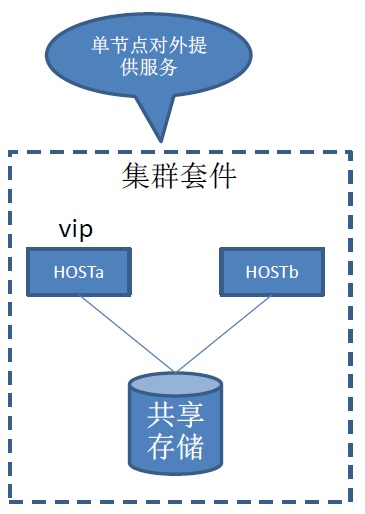
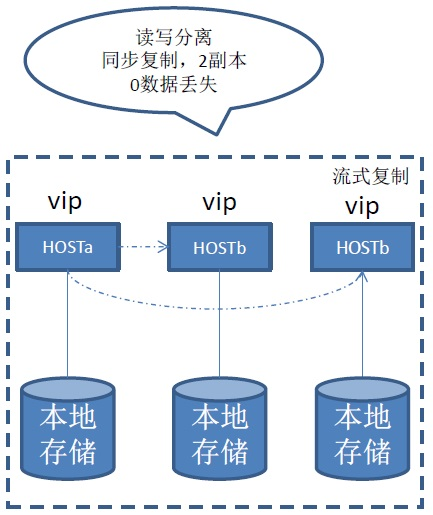
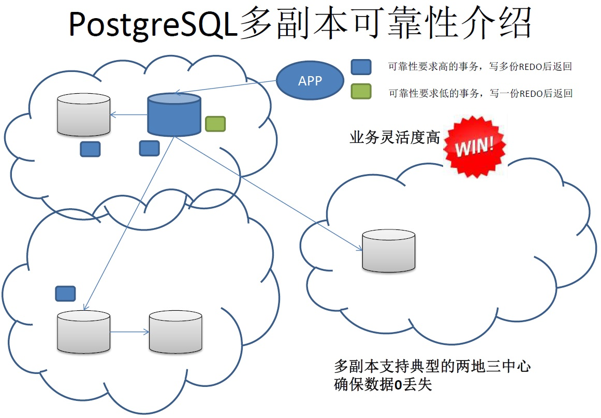
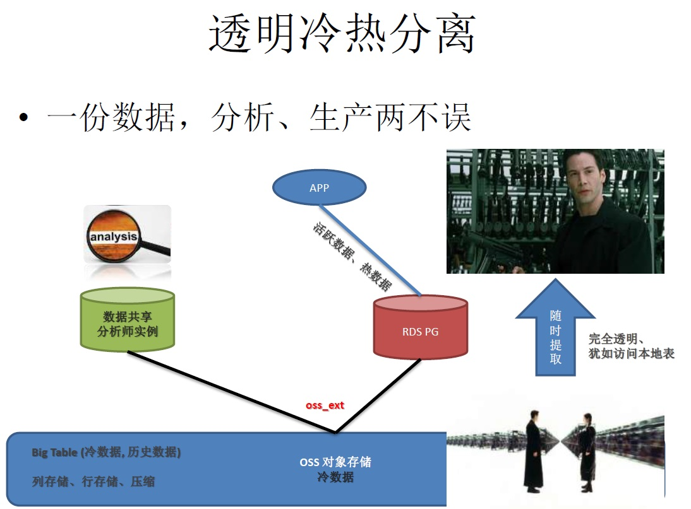
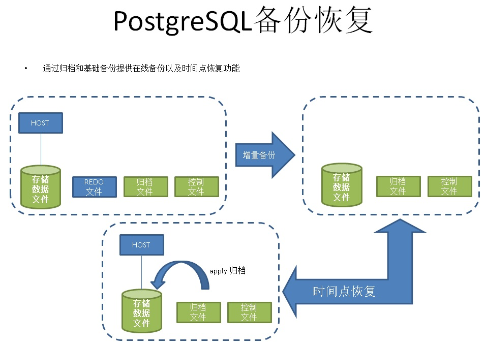
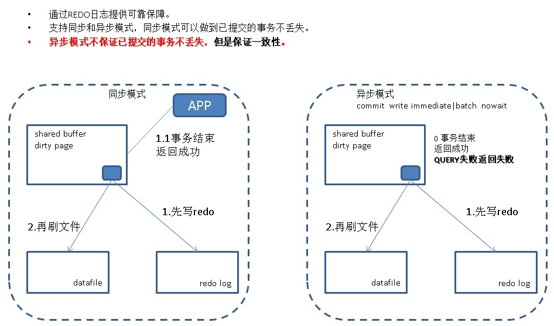

## Gitlab从删库到恢复 - 数据库备份\恢复\容灾\HA的靠谱姿势      
       
### 作者       
digoal        
          
### 日期        
2017-02-01                                  
        
### 标签                                                                                                                        
PostgreSQL , 节假日巡检 , 监控 , 闪回 , flash back query , trigger , event trigger , 回收站 , recycle bin , pgtranshcan , hook , _PG_init , 事件触发器 , 审计 , 跟踪 , 逻辑复制 , DDL逻辑复制 , UDR , BDR , 数据库安全      
      
----        
      
## 背景      
如果你是身处数据库行业的朋友，最近可能被朋友圈的各种关于 "炉石数据被删" 、 "mongoDB遭黑客勒索" 的事件刷屏。    
    
而就在今天（2017-02-01）事情再一次升华， "gitlab 数据库的数据文件被rm -rf误删"，数据库的恢复过程和细节有直播视频，请参考gitlab的官方解释，以免以讹传讹。      
       
数据库在是企业中占据非常重要的位置，发生数据库被SQL注入，数据被误删的事情，不仅仅影响业务，还可能造成用户的信息被泄露。      
    
DBA一族就像IT行业的边防战士，守卫数据是DBA的重要职责之一。    
    
     
    
但是总有防不胜防的时候，比如失恋了，喝多了，又或者操作界面太多，来回切换过多导致人为失误率上升。    
     
     
          
如何让数据文件被rm -rf后还能愉快的玩耍呢？     
         
## 多副本 - 可以抵御rm -rf的HA  
在很多传统企业中，常见的HA手段是通过多主机挂载共享存储来实现的，实际上数据只有一份，因为存储的可用性相比服务器高很多。     
    
    
  
这种HA方式的弱点很明显，存储存在单点（当然你也可以使用多个存储，物理镜像来解决类似单点），另一方面，由于存储只有一份，或者通过镜像产生的多分，因此数据删除时具备传染性，一删全删，因此无法抵御gitlab的rm -rf操作。    
    
这种HA方式的优点，结构比较简单，数据一致性比较好保证。  
  
### 多副本HA与容灾  
PostgreSQL 从9.1开始就支持了双副本的同步模式流复制，多副本异步的流复制模式，9.6新增了多副本同步模式。    
    
使用这种方式，即使主库的数据文件被rm -rf了，由于同步是基于REDO的，所以操作系统的命令并不会被传染，可以抵御rm -rf的误操作。  
  
    
  
    
  
参考  
  
[《PostgreSQL 数据库HA》](https://github.com/digoal/PostgreSQL_HA_with_primary_standby_2vip)    
  
[《PostgreSQL 金融行业高可用和容灾解决方案》](../201512/20151224_01.md)      
  
[《ApsaraDB的左右互搏术 - 解决企业痛处 TP+AP混合需求》](../201701/20170101_02.md)    
  
另外还有一重需要注意的点，一定要有异地的备份，以及异地的容灾节点，这样才能抵御单一机房存在的故障隐患。  
  
## 阿里云 ApsaraDB for PostgreSQL 冷热分离插件  
你可以把不会变化的历史数据存储到阿里云提供的外部对象存储中，即节省数据库空间，同时这部分数据又可以免去备份（对象存储本身就是多副本的，当然话虽如此，作为管理员，备份一份到异地或者其他平台也是有必要的）。  
   
    
  
## 正确的备份姿势  
### 1 逻辑备份  
库级一致性，备份只能恢复到单一时间点，无法做到增量恢复，无法做到增量的备份。    
  
另一方面还要注意，由于大版本不同的数据库，往往catalog也可能不一样，所以逻辑备份使用的备份客户端pg_dump的版本，建议与数据库的版本一致。否则是可能会有备份异常或者失败的可能(如果没有注意到这一点，就有可能导致逻辑备份失败哦)。    
  
[《PostgreSQL 最佳实践 - 在线逻辑备份与恢复介绍》](../201608/20160823_01.md)    
  
### 2 在线全量+归档备份  
最为常见的备份方式，可以在线进行，可以恢复到任意时间点（事务粒度）。  
  
如果忽视了这一点，在使用pg_basebackup备份时，如果目标备份目录已存在，同时目录不为空，备份也会异常。     
  
请参考pg_basebackup手册，已经写明(这么做也许是为了保证每次备份的稳定性，不会受到已有文件的干扰或打断，作为备份工具设计者，鬼知道非空目录会不会有文件冲突呢)，平时多看手册还是有帮助的。    
  
```
       -D directory
       --pgdata=directory
           Directory to write the output to.  pg_basebackup will create the directory and any parent directories if necessary. The directory may already exist, but it is an error if the directory already exists
           and is not empty.

           When the backup is in tar mode, and the directory is specified as - (dash), the tar file will be written to stdout.

           This option is required.
```
  
  
  
  
  
[《PostgreSQL 最佳实践 - 在线增量备份与任意时间点恢复》](../201608/20160823_03.md)      
  
### 3 块级增量+归档  
因为每个数据块的头部都有LSN标记，所以PostgreSQL支持数据文件的块级增量，只备份上一次备份以来，变更过的数据块。同样支持恢复到任意时间点（事务粒度）。相比全量+归档，更节约空间。       
   
[《PostgreSQL 最佳实践 - 块级别增量备份(pg_rman baseon LSN)源码浅析与使用》](../201608/20160826_01.md)      
    
[《PostgreSQL 最佳实践 - pg_rman 以standby为源的备份浅析》](../201608/20160829_02.md)      
    
[《PostgreSQL 最佳实践 - pg_rman 数据库恢复示例 与 软件限制解说》](../201608/20160829_03.md)      
  
https://github.com/postgrespro/pg_probackup  
  
### 4 文件系统、逻辑卷镜像  
除了数据库本身支持的数据文件块级增量备份，如果你使用了支持快照的文件系统或者逻辑卷管理的存储，那么你还有一种增量备份的选择，打快照，注意打快照时需要先执行pg_start_backup('')，让数据库进入在线备份状态，打完快照执行pg_stop_backup()。  
  
[《PostgreSQL 最佳实践 - 块级增量备份(ZFS篇)方案与实战》](../201608/20160823_05.md)      
    
[《PostgreSQL 最佳实践 - 块级增量备份(ZFS篇)备份集自动校验》](../201608/20160823_06.md)      
    
[《PostgreSQL 最佳实践 - 块级增量备份(ZFS篇)单个数据库采用多个zfs卷(如表空间)时如何一致性备份》](../201608/20160823_07.md)      
    
[《PostgreSQL 最佳实践 - 块级增量备份(ZFS篇)双机HA与块级备份部署》](../201608/20160823_08.md)      
  
### 5 对象存储  
把不会变化的历史数据存储到阿里云提供的外部对象存储中，即节省数据库空间，同时对象存储本身就是多副本的。  
   
oss_fdw插件用法参考  
  
https://help.aliyun.com/document_detail/44461.html  
  
### 异地备份
备份如果只放在数据库的同一机房，是无法抵御单一机房的风险的，许多公司会将在异地机房有一份备份的存档或者镜像。   
   
对于PostgreSQL数据库，异地备份非常的简便和多样，比如    
  
1\. 方法1, 对已经在异地的流式standby节点进行备份，   
   
2\. 方法2, 通过文件系统如zfs或存储的快照，将备份传输到异地机房   
  
3\. 方法3, 将本地的全量备份异步的传输到异地机房，同时将主机房数据库的redo流式的传输到异地机房，保证两个机房的数据延迟极低，当主机房发生险情（如地震）时，数据丢失率通常能控制在KB或者毫秒内的级别（视带宽和业务情况，即REDO产生的速率与带宽的匹配）。  如果你希望做到异地的0丢失，可以拉专线，使用异地同步流复制，这样的话即使主机房完全挂掉，也不会丢数据了。    
    
4\. 方法4, 将本地机房的备份数据，异步或者通过调度的方式，定时的同步到异地机房的存储中。   
   
## 备份集校验 与 任意时间点恢复(事务粒度)  
除了有效的备份，还要保证备份的有效性，例如，可以使用以下方法检验备份+归档，以及快照方法备份的有效性。  
  
[《PostgreSQL 最佳实践 - 在线增量备份与任意时间点恢复》](../201608/20160823_03.md)      
  
[《PostgreSQL 最佳实践 - 任意时间点恢复源码分析》](../201608/20160823_04.md)   
  
[《PostgreSQL 最佳实践 - 块级增量备份(ZFS篇)备份集自动校验》](../201608/20160823_06.md)    
  
## 九阳神功秘籍  
除了要有日常的备份，HA，异地备份，异地容灾，备份集合的校验机制。  
  
制定规范，养成良好的习惯也是很重要的。奉上 [《DBA一族九阳神功秘籍》](../201701/20170120_02.md)  希望对大家有一丝帮助。    
  
### DBA一族九阳神功 1 日常篇  
作为DBA一族，首当其冲的是守卫数据，让数据库正常运转，所以有些事情是骨子里就应该遵循的。    
    
1\. 制定并执行数据库安全规范    
    
2\. 制定并执行数据库管理规范    
    
3\. 制定并执行数据库开发规范    
    
4\. 建立自动化监控系统    
    
5\. 建立自动化巡检、备份、HA、异地容灾、异地备份系统、(还有很重要的备份集可用性校验，特别是在磁带库时代)    
    
6\. 制定节假日的封网机制、应急机制    
    
这样就建立了一道强有力的封印，可以有效的防止外族入侵。    
    
#### 细节请打开如下文档阅读     
    
[《DBA专供 冈本003系列 - 数据库安全第一,过个好年》](../201612/20161224_01.md)     
    
[《PostgreSQL 数据库安全指南》](../201506/20150601_01.md)     
    
[《PostgreSQL 数据库开发与管理规范》](../201609/20160926_01.md)    
  
[《PostgreSQL 数据库在上市公司重要应用中的SOX审计》](../201409/20140930_01.md)     
    
### DBA一族九阳神功 2 重大节假日前篇    
1\. 春节前，建议增加一次例行的巡检，就好像我们出远门检查一下车子一样。    
     
参考 [《PostgreSQL 数据库巡检》](https://raw.githubusercontent.com/digoal/pgsql_admin_script/master/generate_report.sh)     
    
2\. 对可预知的业务数据库、（当然还包括应用服务器等）进行扩容，这个是很有必要的，通常许多业务会在节假日时迎接高峰，例如游戏类业务、社交类业务、电商类业务等。    
    
3\. 预备一批硬件standby，以便应对春节的即时需要    
    
4\. 封网，停止变更，通常需要提前数天停止变更，减少因为变更带来的潜在问题。    
    
例如应用程序变更后，可能新增了一些SQL语句，这些SQL语句本身可能没有优化好，又或者无法预知业务对这些SQL语句的请求量并发量等，导致数据库在重大节假日存在潜在的炸弹。    
    
5\. 排班。安排好值日，做到7*24小时有DBA可以响应，保持手机畅通，同时确保值班的童鞋可以连接网络。    
    
6\. 通常值日生在节假日期间一个人要负责的业务比平时负责的业务更广泛，所以对值日生进行值班内容、业务的培训也是很有必要的。    
    
因此平时的DBA轮岗机制也是很重要的，要绝对避免这样的现象：一个业务只有一位DBA熟悉。    
    
7\. 宣导，向公司业务方敲锣打鼓的宣导，要进入封网期间了，请大家遵循封网规则，不要在封网期间做越界的事情（比如变更、发布）。    
    
虽然在制度上和某些IT手段上控制了封网期间的行为，但是难免有漏网之鱼，所以宣导也是很重要的。    
    
### DBA一族九阳神功 3 重大节假日中篇   
1\. 值班，通常分为在线和离线值班，在线和上班差不多，可能要随时关注一些NOC平台的指标，间歇性的填写一些值班报告。    
    
离线值班指被动的接收告警短信，邮件，发生问题时上线处理。    
    
2\. 交接班，交接班是非常重要的，通常上一个班的同事会发现一些异常，交代给下一位值班的同事，如果真的遇到问题响应速度和判断效率也更高。    
    
### DBA一族九阳神功 4 重大节假日后篇    
封网结束后，一切又回归正常了。但是有一件很重要的事情别忘记了。    
    
1\. 复盘    
    
复盘通常指对封网期间的系统状态进行回顾，要达到几个目的    
    
1\.1 扩容预估是否合理，同时建议反馈给业务方相应的数据    
    
1\.2 是否有故障，什么原因导致的，将来如何避免    
    
1\.3 监控系统是否存在疏漏，将来如何避免    
    
1\.4 是否有违规变更、发布，将来如何避免    
    
## 小结    
相信很多公司都有类似的制度，DBA一族加油，做到尽量的避免rm -rf事件，即使真的发生了，也可以做到心里不慌，用户不慌。    
   
关于《gitlab从删库到恢复》事件，就不作评论了，大家有兴趣的话，建议参考Gitlab的官方回应，以免以讹传讹。 
  
同时，在任何时候，建立健全的制度，都是非常重要的。操作时也务必保持清醒的头脑，尽量少犯人为的错误。    
    
如果有哪些写得不对或者不够完善，也感谢指出。    
                                                            
                                                                    
                         
  
<a rel="nofollow" href="http://info.flagcounter.com/h9V1"  ></a>  
  
  
  
  
  
  
## [digoal's 大量PostgreSQL文章入口](https://github.com/digoal/blog/blob/master/README.md "22709685feb7cab07d30f30387f0a9ae")
  
