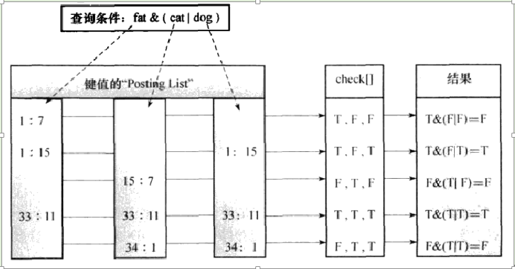
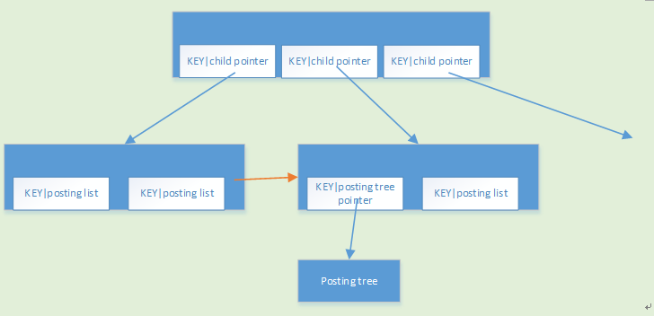
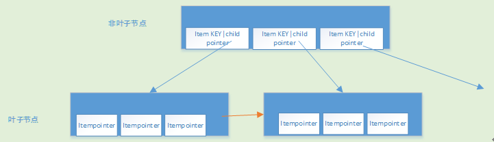
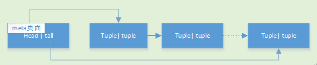
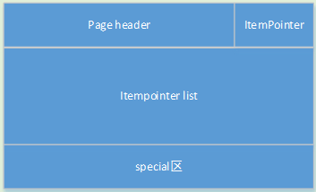
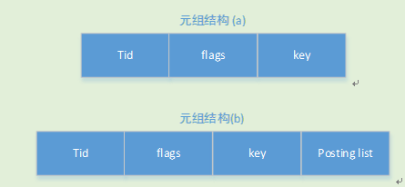
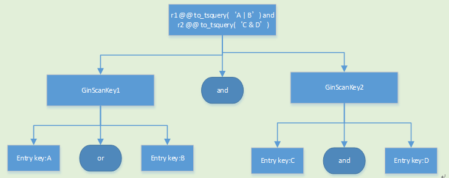
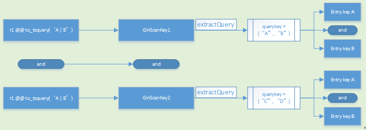

## PostgreSQL GIN索引实现原理    
           
### 作者           
digoal            
              
### 日期            
2017-02-04                                      
            
### 标签                                                                                                                            
PostgreSQL , GIN , 内核 , 实现原理 , PostgreSQL数据库内核分析      
          
----            
          
## 背景    
本文参考并扩展自如下文档，修正了一些内容(大多数是由于版本不同造成的差异)   
  
《PostgreSQL数据库内核分析》 ( 成书较早,大量内容基于8.4的代码编写 )    
  
以及    
  
http://zisedeqing.blog.163.com/blog/static/95550871201621623458216/   ( 大量内容参考自 PostgreSQL数据库内核分析 )    
  
## 术语  
本文适用的一些术语  
  
属性 - 可能取自pg_attribute，指的是列。  
  
```  
postgres=# \d pg_attribute  
              Table "pg_catalog.pg_attribute"  
    Column     |   Type    | Collation | Nullable | Default   
---------------+-----------+-----------+----------+---------  
 attrelid      | oid       |           | not null |   
 attname       | name      |           | not null |   
 atttypid      | oid       |           | not null |   
 attstattarget | integer   |           | not null |   
 attlen        | smallint  |           | not null |   
 attnum        | smallint  |           | not null |   
 attndims      | integer   |           | not null |   
 attcacheoff   | integer   |           | not null |   
 atttypmod     | integer   |           | not null |   
 attbyval      | boolean   |           | not null |   
 attstorage    | "char"    |           | not null |   
 attalign      | "char"    |           | not null |   
 attnotnull    | boolean   |           | not null |   
 atthasdef     | boolean   |           | not null |   
 attisdropped  | boolean   |           | not null |   
 attislocal    | boolean   |           | not null |   
 attinhcount   | integer   |           | not null |   
 attcollation  | oid       |           | not null |   
 attacl        | aclitem[] |           |          |   
 attoptions    | text[]    |           |          |   
 attfdwoptions | text[]    |           |          |   
Indexes:  
    "pg_attribute_relid_attnam_index" UNIQUE, btree (attrelid, attname)  
    "pg_attribute_relid_attnum_index" UNIQUE, btree (attrelid, attnum)  
```  
  
元组 - tuple，指的是行(包括heap tuple, index tuple等，都可以叫元组)。  
  
tid, ctid - 指行号(block_number, item pointer)，包括HEAP表的BLOCK NUMBER，以及在BLOCK中指向行的item pointer。  
  
键值 - 指索引结构中的KEY  
  
基表 - 创建索引的表  
  
## 1 概述  
GIN(Generalized Inverted Index, 通用倒排索引) 是一个存储对(key, posting list)集合的索引结构，其中key是一个键值，而posting list 是一组出现过key的位置。如(‘hello', '14:2 23:4')中，表示hello在14:2和23:4这两个位置出现过，在PG中这些位置实际上就是元组的tid(行号，包括数据块ID（32bit）,以及item point(16 bit) )。  
  
在表中的每一个属性，在建立索引时，都可能会被解析为多个键值，所以同一个元组的tid可能会出现在多个key的posting list中。  
  
通过这种索引结构可以快速的查找到包含指定关键字的元组，因此GIN索引特别适用于多值类型的元素搜索，比如支持全文搜索，数组中元素的搜索，而PG的GIN索引模块最初也是为了支持全文搜索而开发的。  
  
说到这里，你可能会觉得GIN的结构有点像b+tree，包括KEY和对应的值(posting list)。别急，请继续往下看。      
  
## 2 GIN索引的扩展开发  
GIN是一个开放的索引接口，所以它不仅适用于已经存在的如数组、全文检索等数据类型，同样也可以扩展支持更多的数据类型。  
  
请用户参考扩展指南如下，现在可能已经不止实现5种接口了。  
  
https://www.postgresql.org/docs/9.6/static/gin-extensibility.html  
  
GIN索引具有很好的可扩展性，允许在开发自定义数据类型时由该数据类型的领域专家（而非数据库专家）设计适当的访问方法，这些访问方法只需考虑对于数据类型本身的语义处理，GIN索引自身可以处理并发控制、日志记录、搜索树结构等操作。  
  
定义一个GIN访问方法所要做的就是实现5个用户定义的方法，这些方法定义了键值、键值与键值之间的关系、被索引值、能够使用索引的查询以及部分匹配。  
  
这些方法是：  
  
1\. compare方法：比较两个键值a和b，然后返回一个整数值，返回负值表示a < b，返回0表示a = b，返回正值表示a > b。  
  
其函数原型如下：  
  
```  
int compare(Datum a, Datum b)  
```  
  
2\. extractValue方法：根据参数inputValue生成一个键值数组，并返回其指针，键值数组中元素的个数存放在另一个参数nkeys中。  
  
其函数原型如下：  
  
```  
Datum *extractValue(Datum inputValue, int32 *nkeys)  
```  
  
3\. extractQuery方法：根据参数query生成一个用于查询的键值数组，并返回其指针。  
  
函数原型如下：  
  
```  
Datum *extractQuery(Datum query, int32 *nkeys, StrategyNumber n, bool **pmatch, Pointer **extra_data)  
```  
  
extractQuery通过参数n指定的操作符策略号来决定query的数据类型以及需要提取的键值，返回键值数组的长度存放在nkeys参数中。  
  
如果query中不包含键值，则nkeys可以为0或者-1：  
  
nkeys = 0 表示索引中所有值都满足查询，将执行完全索引扫描(查询null时是这样); nkeys = -1 表示索引中没有键值满足查询，跳过索引扫描。  
  
在部分匹配时，输出参数pmatch记录返回的键值数组中的每一个键值是否请求部分匹配。  
  
输出参数extra_data用来向consistent和comparPartial方法传递用户自定义需要的数据。  
  
4\. consistent方法：用于检查索引值是否满足查询，  
  
其函数原型如下：  
  
```  
bool consistent(bool check[], StrategyNumber n, Datum query, int32 nkeys, Pointer extra_data[], bool *recheck)  
```  
  
如果索引值满足查询则返回true，如果recheck = true，则返回true的索引还需要进一步的检查。  
  
recheck: 精确比较时recheck = false；否则recheck = true，通过索引找到的基表元组还需要进行是否满足操作符的检查（在TSVector类型时，如果key带有权值，则recheck = true）。  
  
PS ：   
  
如果索引KEY中区分了权值，则recheck依旧=false。 用户需要看看各个版本的release notes或者跟踪代码的迭代，比如PostgreSQL 9.6, postgrespro rum索引接口。     
  
[《PostgreSQL 全文检索加速 快到没有朋友 - RUM索引接口(潘多拉魔盒)》](../201610/20161019_01.md)  
  
[《从难缠的模糊查询聊开 - PostgreSQL独门绝招之一 GIN , GiST , SP-GiST , RUM 索引原理与技术背景》](../201612/20161231_01.md)  
  
以查询 fat & (cat | dog)为例，consistent的执行：  
  
    
  
PostgreSQL 9.4对GIN的扫描，存储都进行了优化，例如可以跳过一些posting list的检查或者一些ctid的检查。（从最短的posting tree/list开始，跳过其他更小的ctid），请参考  
  
[《PostgreSQL GIN multi-key search 优化》](../201702/20170203_01.md)  
  
5\. comparePartial方法：将部分匹配的查询与索引值进行比较，返回值为负值表示两者不匹配，但继续索引扫描；返回值为0表示两者匹配；返回值为正值表示停止扫描。  
  
其函数原型如下：  
  
```  
int comparePartial(Datum partial_key, Datum key, StrategyNumber n, Pointer extra_data)  
```  
   
第6种接口为可选接口，用于partial match，类似lossy index.    
  
```  
int comparePartial(Datum partial_key, Datum key, StrategyNumber n, Pointer extra_data)  
```  
  
所以在PG中添加一种新的数据类型并且让GIN支持该数据类型，则需要完成以下步骤：  
  
1\. 添加数据类型  
  
2\. 为新数据类型实现并注册各种操作符所需要的函数，然后创建新类型的操作符  
  
3\. 用CREATE OPERATOR CLASS为新的数据类型创建一个操作符类，该语句需要指定GIN索引所需要的5个支持函数  
   
PG的GIN索引，内部实现了对于TSVector数据类型的支持，并提供了把TEXT类型转换成TSVector的接口，所以可以说PG的GIN索引支持TSVector和TEXT的数据类型。  
  
## 3 GIN索引结构  
  
### 逻辑结构  
  
GIN索引在逻辑上可以看成一个relation，该relation有两种结构：  
  
1\. 只索引基表的一列  
  
key | value  
---|---  
Key1 | Posting list( or posting tree)  
Key2 | Posting list( or posting tree)  
… | …  
    
2\. 索引基表的多列(复合、多列索引)  
  
column_id | key | value  
---|---|---  
Column1 num | Key1 | Posting list( or posting tree)  
Column2 num | Key1 | Posting list( or posting tree)  
Column3 num | Key1 | Posting list( or posting tree)  
... | ... | ...  
  
这种结构，对于基表中不同列的相同的key，在GIN索引中也会当作不同的key来处理。  
  
### 物理结构  
  
GIN索引在物理存储上包含如下内容：  
  
1\. Entry：GIN索引中的一个元素，可以认为是一个词位，也可以理解为一个key  
  
2\. Entry tree：在Entry上构建的B树  
  
3\. posting list：一个Entry出现的物理位置(heap ctid, 堆表行号)的链表  
  
4\. posting tree：在一个Entry出现的物理位置链表(heap ctid, 堆表行号)上构建的B树，所以posting tree的KEY是ctid，而entry tree的KEY是被索引的列的值   
  
5\. pending list：索引元组的临时存储链表，用于fastupdate模式的插入操作  
    
从上面可以看出GIN索引主要由Entry tree和posting tree（or posting list）组成，其中Entry tree是GIN索引的主结构树，posting tree是辅助树。   
   
entry tree类似于b+tree，而posting tree则类似于b-tree。   
  
另外，不管entry tree还是posting tree，它们都是按KEY有序组织的。   
  
#### 1 Entry tree  
entry tree是一个B树，与Btree索引类似，用来组织和存储(key, posting list)对，其树结构如下：  
  
  
  
从上图可以看出非叶子节点的每个元组都有一个指向孩子节点的指针(child pointer)，该指针由索引元组结构的tid(表示下层数据块ID，即下层GIN索引数据块ID)来表示，中间节点和叶子节点还有一个右兄弟节点指针，指向其右兄弟节点，该指针记录在GinPageOpaqueData的rightlink内(即索引页的special部分，在页面的尾部)。  
  
src/include/access/gin_private.h  
  
```  
/*  
 * Page opaque data in an inverted index page.  
 *  
 * Note: GIN does not include a page ID word as do the other index types.  
 * This is OK because the opaque data is only 8 bytes and so can be reliably  
 * distinguished by size.  Revisit this if the size ever increases.  
 * Further note: as of 9.2, SP-GiST also uses 8-byte special space, as does  
 * BRIN as of 9.5.  This is still OK, as long as GIN isn't using all of the  
 * high-order bits in its flags word, because that way the flags word cannot  
 * match the page IDs used by SP-GiST and BRIN.  
 */  
typedef struct GinPageOpaqueData  
{  
        BlockNumber rightlink;          /* next page if any */  
        OffsetNumber maxoff;            /* number of PostingItems on GIN_DATA &  
                                                                 * ~GIN_LEAF page. On GIN_LIST page, number of  
                                                                 * heap tuples. */  
        uint16          flags;                  /* see bit definitions below */  
} GinPageOpaqueData;  
  
typedef GinPageOpaqueData *GinPageOpaque;  
  
#define GIN_DATA                  (1 << 0)  
#define GIN_LEAF                  (1 << 1)  
#define GIN_DELETED               (1 << 2)  
#define GIN_META                  (1 << 3)  
#define GIN_LIST                  (1 << 4)  
#define GIN_LIST_FULLROW  (1 << 5)              /* makes sense only on GIN_LIST page */  
#define GIN_INCOMPLETE_SPLIT (1 << 6)   /* page was split, but parent not  
                                                                                 * updated */  
#define GIN_COMPRESSED    (1 << 7)  
  
/* Page numbers of fixed-location pages */  
#define GIN_METAPAGE_BLKNO      (0)  // meta数据块固定为0号
#define GIN_ROOT_BLKNO          (1)  // root数据块固定为1号
```  
  
entry tree的非叶子节点与普通的btree树的非叶子节点类似。  
  
其叶子节点与普通btree的叶子节点不同，普通btree的叶子节点指向其索引的元组，而entry tree的叶子节点指向posting list，或者是posting tree。该指针用索引元组结构的tid表示。   
  
具体如何区分posting list和posting tree将在页面结构中介绍。  
  
从上图可以看出，如果posting list退化成单个item pointer，则GIN索引的结构就与B树索引完全一样(其实也不完全一样，如下)。  
  
PS :   
  
gin 的btree和PostgreSQL的nbtree不一样，相比nbtree更简化，(比如nbtree的同级PAGE包含了双向链接，而gin btree只有right link)。  
  
参考  
  
[《深入浅出PostgreSQL B-Tree索引结构》](../201605/20160528_01.md)  
  
[《B-Tree和B+Tree》](../201606/20160610_01.md)    
  
#### 2 posting tree  
posting tree与entry tree 类似，也是一个B树，其树结构与entry tree完全一样，不同之处就是posting tree页面存储的元组内容与entry tree不同，如下：  
  
  
  
posting tree 非叶子节点，KEY是堆表行号，VALUE是下层节点的块ID。  
  
posting tree 叶子节点，是堆表行号list, 即posting list，（PostgreSQL使用了segment进行管理，将posting list中存储的item point(堆表行号)有序分段，压缩存储）。     
   
暂时无法理解的话，可以继续往下看，有细节介绍。  
  
#### 3 pending list  
pending list是在fastupdate时，用来临时缓存GIN索引元组的，该链表把索引的插入操作推迟到一定条件时，批量处理。其结构是一个单向链表，如下：  
  
  
  
从上图可以看出，pending list的meta页面用来指示pending list的头和尾的页面号，没有pending list的数据页面，存放的是新的索引元组。  
  
```
Index entries that appear in "pending list" pages work a tad differently as
well.  The optional column number, key datum, and null category byte are as
for other GIN index entries.  However, there is always exactly one heap
itempointer associated with a pending entry, and it is stored in the t_tid
header field just as in non-GIN indexes.  There is no posting list.
Furthermore, the code that searches the pending list assumes that all
entries for a given heap tuple appear consecutively in the pending list and
are sorted by the column-number-plus-key-datum.  The GIN_LIST_FULLROW page
flag bit tells whether entries for a given heap tuple are spread across
multiple pending-list pages.  If GIN_LIST_FULLROW is set, the page contains
all the entries for one or more heap tuples.  If GIN_LIST_FULLROW is clear,
the page contains entries for only one heap tuple, *and* they are not all
the entries for that tuple.  (Thus, a heap tuple whose entries do not all
fit on one pending-list page must have those pages to itself, even if this
results in wasting much of the space on the preceding page and the last
page for the tuple.)
```
  
## 4 GIN索引的页面和元组结构  
  
### 页面结构  
  
GIN索引共有6种类型的页面：  
  
类型 | 说明  
---|---  
GIN_DATA             (1 << 0) | 存放posting tree的页面  
GIN_LEAF             (1 << 1) | 叶子页面  
GIN_DELETED          (1 << 2) | 被标志删除的页面  
GIN_META             (1 << 3) | Gin索引的元页面  
GIN_LIST             (1 << 4) | Pending list页面  
GIN_LIST_FULLROW     (1 << 5) | 被填满的GIN_LIST页面  
  
PS :   
  
实际上现在的版本已经有8种页面类型  
  
src/include/access/gin_private.h  
  
```  
#define GIN_DATA                  (1 << 0)  
#define GIN_LEAF                  (1 << 1)  
#define GIN_DELETED               (1 << 2)  
#define GIN_META                  (1 << 3)  
#define GIN_LIST                  (1 << 4)  
#define GIN_LIST_FULLROW  (1 << 5)              /* makes sense only on GIN_LIST page */  
#define GIN_INCOMPLETE_SPLIT (1 << 6)   /* page was split, but parent not  
                                                                                 * updated */  
#define GIN_COMPRESSED    (1 << 7)  
```  
  
#### 1 meta页面  
GIN索引的元信息页面，其页面保留区的flags有GIN_META标记。GIN索引的元信息页面的blocknum为0，meta页面的结构如下：  
  
```  
typedef struct GinMetaPageData  
{  
        /*  
         * Pointers to head and tail of pending list, which consists of GIN_LIST  
         * pages.  These store fast-inserted entries that haven't yet been moved  
         * into the regular GIN structure.  
         */  
        BlockNumber head;  
        BlockNumber tail;  
	// 在fast-inserted时使用，用来存储由GIN_LIST页面组成的pending list的头和尾的页面号。这些pending list是还没有插入到GIN索引树上的页面。  
  
        /*  
         * Free space in bytes in the pending list's tail page.  
         */  
        uint32          tailFreeSize;  
	// pending list尾部页面的空闲空间  
  
        /*  
         * We store both number of pages and number of heap tuples that are in the  
         * pending list.  
         */  
        BlockNumber nPendingPages;  
	// pending list的页面个数  
  
        int64           nPendingHeapTuples;  
	// pending list的heap 元组个数  
  
        /*  
         * Statistics for planner use (accurate as of last VACUUM)  
         */  
        BlockNumber nTotalPages;  
        BlockNumber nEntryPages;  
        BlockNumber nDataPages;  
        int64           nEntries;  
	// 静态统计信息，由最近的一次VACUUM计算得出  
  
        /*  
         * GIN version number (ideally this should have been at the front, but too  
         * late now.  Don't move it!)  
         *  
         * Currently 2 (for indexes initialized in 9.4 or later)  
         *  
         * Version 1 (indexes initialized in version 9.1, 9.2 or 9.3), is  
         * compatible, but may contain uncompressed posting tree (leaf) pages and  
         * posting lists. They will be converted to compressed format when  
         * modified.  
         *  
         * Version 0 (indexes initialized in 9.0 or before) is compatible but may  
         * be missing null entries, including both null keys and placeholders.  
         * Reject full-index-scan attempts on such indexes.  
         */  
        int32           ginVersion;  
	// GIN索引的版本号  
} GinMetaPageData;  
```  
  
目前GIN索引的元数据页面主要记录pending list的相关信息、统计信息和版本号。  
  
#### 2 GIN索引page的 special区  
GIN索引页面的special区，用来存储GIN索引相关的信息，与BTree的BTPageOpaqueData类似，主要是建立树形结构。  
  
GIN索引页面的special区结构如下：  
  
```  
/*  
 * Page opaque data in an inverted index page.  
 *  
 * Note: GIN does not include a page ID word as do the other index types.  
 * This is OK because the opaque data is only 8 bytes and so can be reliably  
 * distinguished by size.  Revisit this if the size ever increases.  
 * Further note: as of 9.2, SP-GiST also uses 8-byte special space, as does  
 * BRIN as of 9.5.  This is still OK, as long as GIN isn't using all of the  
 * high-order bits in its flags word, because that way the flags word cannot  
 * match the page IDs used by SP-GiST and BRIN.  
 */  
typedef struct GinPageOpaqueData  
{  
        BlockNumber rightlink;          /* next page if any */  
        // 右兄弟节点的页面号，用来建立兄弟链表，把所有处于同一层次的节点连接成一个单向链表  
  
        OffsetNumber maxoff;            /* number of PostingItems on GIN_DATA & ~GIN_LEAF page.   // 记录PostingItems的长度  
					 * On GIN_LIST page, number of heap tuples. */  // 记录posting list的长度  
  
        uint16          flags;                  /* see bit definitions below */  
	// 页面标记，用来标记页面的类型  
} GinPageOpaqueData;  
  
页面类型flag定义如下  
#define GIN_DATA                  (1 << 0)  
#define GIN_LEAF                  (1 << 1)  
#define GIN_DELETED               (1 << 2)  
#define GIN_META                  (1 << 3)  
#define GIN_LIST                  (1 << 4)  
#define GIN_LIST_FULLROW  (1 << 5)              /* makes sense only on GIN_LIST page */  
#define GIN_INCOMPLETE_SPLIT (1 << 6)   /* page was split, but parent not  
                                                                                 * updated */  
#define GIN_COMPRESSED    (1 << 7)  
```  
  
#### 3 entry tree页面  
src/backend/access/gin/ginentrypage.c  
  
entry tree是GIN索引的主树，用来组织和存储entry。  
   
1\. entry tree 非叶子页面  
  
非叶子页面不带任何标记信息，entry tree的非叶子页面结构与普通btree的非叶子页面结构基本上是一样的(但实际上与PostgreSQL nbtree有差异，如, 并非双向链表)，如下：  
  
  
  
2\. entry tree 叶子页面  
  
叶子页面带有GIN_LEAF标记，表示是entry tree的叶子页面。entry tree的叶子页面与普通btree叶子页面结构类似，只是在元组结构上有所不同，(实际上与PostgreSQL nbtree有差异，如, 并非双向链表)，如下：  
  
  
  
具体不同的地方参见元组结构的介绍  
  
PS :   
  
构建indextuple，注意单列索引和多列索引的区别  
  
```
        /* Build the basic tuple: optional column number, plus key datum */
        if (ginstate->oneCol)
        {
                datums[0] = key;
                isnull[0] = (category != GIN_CAT_NORM_KEY);
        }
        else
        {
                datums[0] = UInt16GetDatum(attnum);
                isnull[0] = false;
                datums[1] = key;
                isnull[1] = (category != GIN_CAT_NORM_KEY);
        }
```
  
#### 4 posting tree页面  
src/backend/access/gin/gindatapage.c   
  
posting tree 是gin的辅助树，用来组织超长的posting list，以加快其查询速度。该树的页面是由GIN_DATA标记。  
  
```  
/*  
 * Data (posting tree) pages  
 *  
 * Posting tree pages don't store regular tuples. Non-leaf pages contain  
 * PostingItems, which are pairs of ItemPointers and child block numbers.  
 * Leaf pages contain GinPostingLists and an uncompressed array of item  
 * pointers.  
 *  
 * In a leaf page, the compressed posting lists are stored after the regular  
 * page header, one after each other. Although we don't store regular tuples,  
 * pd_lower is used to indicate the end of the posting lists. After that, free  
 * space follows.  This layout is compatible with the "standard" heap and  
 * index page layout described in bufpage.h, so that we can e.g set buffer_std  
 * when writing WAL records.  
 *  
 * In the special space is the GinPageOpaque struct.  
 */  
```  
  
1\. posting tree 非叶子页面  
  
非叶子页面只有GIN_DATA标记，其页面结构如下：  
  
  
  
PageHeader后面紧跟的一个ItemPointer是指该PAGE的right bound，即它所指引的所有下级节点中，最大指向的HEAP tid。      
    
比如你抓了一手扑克牌，按牌面从小到大顺序分成了若干堆牌，你有指向每一堆牌的方法（PostingItem），同时也知道最大的牌是什么(PageHeader后面紧跟的一个ItemPointer)    
  
src/backend/access/gin/README  
  
请仔细阅读  
  
```  
Posting tree  
------------  
  
If a posting list is too large to store in-line in a key entry, a posting tree  
is created. A posting tree is a B-tree structure, where the ItemPointer is  
used as the key.  
  
Internal posting tree pages use the standard PageHeader and the same "opaque"  
struct as other GIN page, but do not contain regular index tuples. Instead,  
the contents of the page is an array of PostingItem structs. Each PostingItem  
consists of the block number of the child page, and the right bound of that  
child page, as an ItemPointer. The right bound of the page is stored right  
after the page header, before the PostingItem array.  
```  
  
与普通btree的页面类似，不同是其存储的元组是PostingItem，PostingItem格式为：  
  
```  
/*  
 * Posting item in a non-leaf posting-tree page  
 */  
typedef struct  
{  
        /* We use BlockIdData not BlockNumber to avoid padding space wastage */  
        BlockIdData child_blkno;  
	// 是孩子节点的页面号，用于建立posting tree的层次关系。使用BlockIdData类型而不是BlockNumber的原因是避免空间浪费。  
  
        ItemPointerData key;  
	// 是posting list中的key，实际上就是该孩子节点的最小?heap tid  
} PostingItem;  
  
/*  
 * ItemPointer:  // 即tid or ctid  
 *  
 * This is a pointer to an item within a disk page of a known file  
 * (for example, a cross-link from an index to its parent table).  
 * blkid tells us which block, posid tells us which entry in the linp  
 * (ItemIdData) array we want.  
 *  
 * Note: because there is an item pointer in each tuple header and index  
 * tuple header on disk, it's very important not to waste space with  
 * structure padding bytes.  The struct is designed to be six bytes long  
 * (it contains three int16 fields) but a few compilers will pad it to  
 * eight bytes unless coerced.  We apply appropriate persuasion where  
 * possible, and to cope with unpersuadable compilers, we try to use  
 * "SizeOfIptrData" rather than "sizeof(ItemPointerData)" when computing  
 * on-disk sizes.  
 */  
typedef struct ItemPointerData  
{  
        BlockIdData ip_blkid;  
        OffsetNumber ip_posid;  
}  
```  
  
2\. posting tree 叶子页面  
  
叶子页面的标记为GIN_DATA|GIN_LEAF，其页面结构如下：  
  
  
  
与正常的索引页面类似，开始是页面头信息，结尾是special区，不同的是中间区用来记录posting list(即HEAP CTID)。  
  
注意posting list会分段压缩存储，包括用于SKIP优化等。  
  
src/backend/access/gin/README  
  
请仔细阅读  
  
```  
Posting tree leaf pages also use the standard PageHeader and opaque struct,  
and the right bound of the page is stored right after the page header, but  
the page content comprises of a number of compressed posting lists. The  
compressed posting lists are stored one after each other, between page header  
and pd_lower. The space between pd_lower and pd_upper is unused, which allows  
full-page images of posting tree leaf pages to skip the unused space in middle  
(buffer_std = true in XLogRecData).  
  
The item pointers are stored in a number of independent compressed posting  
lists (also called segments), instead of one big one, to make random access  
to a given item pointer faster: to find an item in a compressed list, you  
have to read the list from the beginning, but when the items are split into  
multiple lists, you can first skip over to the list containing the item you're  
looking for, and read only that segment. Also, an update only needs to  
re-encode the affected segment.  
```  
  
#### 5 pending list 页面  
与entry tree的页面类似，如下：  
  
  
  
不同之处是元组的结构，将在元组结构中介绍。  
  
special区有一个指针，用来指向页面的下一个页面，这样就把所有的pending list页面以单链表的方式组织起来。  
  
### 元组结构  
  
#### 1 entry tree 内的 indextuple 元组  
entry tree的元组依然使用IndexTuple来表示，其结构为：  
  
src/include/access/itup.h  
  
```  
/*  
 * Index tuple header structure  
 *  
 * All index tuples start with IndexTupleData.  If the HasNulls bit is set,  
 * this is followed by an IndexAttributeBitMapData.  The index attribute  
 * values follow, beginning at a MAXALIGN boundary.  
 *  
 * Note that the space allocated for the bitmap does not vary with the number  
 * of attributes; that is because we don't have room to store the number of  
 * attributes in the header.  Given the MAXALIGN constraint there's no space  
 * savings to be had anyway, for usual values of INDEX_MAX_KEYS.  
 */  
  
typedef struct IndexTupleData  
{  
        ItemPointerData t_tid;          /* reference TID to heap tuple */  
  
        /* ---------------  
         * t_info is laid out in the following fashion:  
         *  
         * 15th (high) bit: has nulls  
         * 14th bit: has var-width attributes  
         * 13th bit: unused  
         * 12-0 bit: size of tuple  
         * ---------------  
         */  
  
        unsigned short t_info;          /* various info about tuple */  
} IndexTupleData;   
```  
  
但是对于不同的节点，其t_tid和后面的key会有所不同。  
  
1\. 非叶子节点  
  
  
  
与普通索引的元组结构一样，由IndexTupleData + key组成，KEY存储的都是被索引列的值，不同的是，其t_tid不是指向heap 元组，而是指向孩子页面。  
  
2\. 叶子节点  
  
叶子节点的元组是由IndexTupleData + key 或者是IndexTupleData + key + posting list表示的，对于posting list超长的情况，元组只记录posting list对于的posting tree的root 节点页面号，所以其元组结构如下：  
  
  
  
注意entry tree 叶子节点的tid已经没有指向意义(指向KEY对应的heap的ctid)了，因为具有指向意义的内容存储在VALUE里面:  即posting list, 或者指向posting tree root page的pointer。   
  
那么entry tree 叶子节点的tid用来干什么呢？如下。      
  
元组结构a(posting list) :   
  
src/backend/access/gin/ginpostinglist.c  
  
该结构的元组，由于posting list太长，无法存储在元组内部，所以把posting list采用外部存储，索引元组只记录posting tree的root页面号。  
  
为了区分这两种结构，使用元组中的tid中的ip_posid(tid ItemPointerData结构的后半部，只有2字节)来区分，  
  
ip_posid == GIN_TREE_POSTING，则表示记录的是posting tree，此时tid的ip_blkid用来存储posting tree的root页面号。    
  
元组结构b(posting tree) :   
  
src/backend/access/gin/gindatapage.c  
  
该结构的元组，把posting list直接存储到key后面的连续空间中，使用tid的ip_posid(2字节)来存储posting list的长度，tid的ip_blkid(4字节)来存储posting list在元组内部的偏移?。  
  
注：  
  
GIN索引页面至少要存储3个索引元组(实际上有改进空间，nbtree双向链表才有这个限制)，所以对于8K的数据块，indextuple(索引元组)的最大值大约是8192/3 = 2730, 每个itempointer为48bit，所以一个索引元组最多可以存储(2730*8)/48 = 455个ctid，(如果是32K的数据块呢，算一算，数据块大小编译PostgreSQL软件时使用configure指定), GIN_TREE_POSTING定义为0xffff(保证与ip_posid 类型长度一致 2 bytes)。  
  
#### 2 posting tree 内的 indextuple 元组  
posting tree的元组格式比较简单，就是itempointer或者postingitem：  
  
非叶子节点：  
  
```  
[child pointer (指向孩子节点)] [item pointer (孩子节点的最小?heap ctid)]  
```  
  
叶子节点：  
  
```  
[item pointer list]  (posting list分段压缩存储)
```  
  
实际上posting tree的叶子节点物理结构没有这么简单，item pointer list在叶子节点中可能分段，压缩，以posting list形式存储，见src/backend/access/gin/README。  
  
#### 3 pending list 内的 indextuple 元组  
pending list的页面存储的是临时的索引元组，其元组格式为：  
  
```  
[tid] [flags] [key]  
```  
  
其中tid指向的是heap元组，这与普通元组一样。  
  
key 为被索引的列值(row tuple)  
  
## 5 GIN索引的构建  
  
GIN索引的构建是根据基表构建GIN索引，在PG中通过index_build接口调用索引注册的build函数完成GIN索引的构建。index_build是一个通用接口，该接口会根据索引的不同类型，自动调用合适的build函数，GIN索引的build接口是ginbuild接口。  
  
GIN索引在构建时，会调用用户定义的compare接口和extractValue接口，compare接口用来实现entry的比较，而extractValue接口用来把基表的属性值提取出对应的entry。  
  
GIN索引在构建时为了提高性能，使用了一种RB二叉树的结构来缓存索引元组，然后在RB二叉树大于maintenance_work_mem时，批量的把RB树中的索引元组插入到GIN的entry tree中。  
  
GIN索引的构建流程是：  
  
1\. 初始化GinState结构  
  
主要是从系统表中读取GIN索引支持的那5个用户自定义函数：compare、extractValue、extractQuery、consistent、comparePartial  
  
2\. 初始化meta和root页面  
  
其中meta页面的blkno是0，root页面的blkno是1  
  
3\. 记录构建日志  
  
4\. 初始化构建时的临时内存上下文和用于缓存的RB树  
  
5\. 调用IndexBuildHeapScan扫描基表，并调用ginBuildCallback对每个基表的索引属性处理  
  
ginBuildCallback实现对每个基表列的处理：  
  
a) 对每一个索引列，调用extractValue接口提取entry值  
  
b) 把所有的<entry, colno, heap tid>对插入到RB树中  
  
c) 如果RB树大于maintenance_work_mem，则把RB树中的<entry, colno, heap tid>对插入到GIN索引中  
  
此处在查找entry的插入位置时，会调用compare接口比较两个entry之间的大小  
  
6\. 把RB树中的所有索引元组插入到GIN的entry tree中  
  
7\. 结束  
  
## 6 GIN索引的扫描  
  
GIN索引的扫描是根据扫描条件，同GIN索引中查询满足条件的基表元组，GIN索引的扫描接口与btree索引类似：ginbeginscan/ ginrescan/ ginendscan/ gingetbitmap，不同之处是GIN索引没有提供返回单条基表元组的接口(即类似于btgettuple的接口)。  
  
GIN索引扫描的基本用法是：  
  
```  
gscan = ginbeginscan(heap, nkeys);  
  
ginrescan(gscan, scankey);  
  
ntids = gingetbitmap(gscan, &btmap);  
  
while(BitmapHeapNext(btmap))  
  
{  
  
         // do something;  
  
}  
  
ginendscan(gscan)  
```  
  
从上面可以看出GIN索引的扫描结果是一个bitmap，里面存储的是所有满足条件的基表元组的tid。  
  
### ScanKey TO GinScanKey (where 转换)  
  
scankey描述了SQL语句的where的条件，pg中使用ScanKeyData来描述，每一个ScanKeyData描述一个条件，ScanKeyData[]的数组描述了所有ScanKeyData的AND操作。而每一个ScanKeyData[]数组对应于一次扫描，所以对于有OR的查询，在执行时至少分成两个扫描，输出结果是两个扫描结果集的并集。对于如下的where条件A and B or C，分成两个扫描A and B 和C。我们研究的重点在于对索引的一次扫描。  
  
对应于全文检索，如下的查询：  
  
```  
r1 @@ to_tsquery('A | B') and r2 @@ to_tsquery('C & D') or r3 @@ to_tsquery('E| F')  
```  
  
其会分成：  
  
```  
scan1： r1 @@ to_tsquery('A | B') and r2 @@ to_tsquery('C & D')  
  
scan2： r3 @@ to_tsquery('E| F')  
```  
  
结果是：scan1 U(并集) scan2  
  
以一次扫描为例，在GIN扫描时，系统会先把scankey转换成GinScanKey，然后根据GinScanKey进行索引的过滤。一个scankey会转换成一个GinScanKey，而每个GinScanKey又会包含多个GinScanEntry，每个GinScanEntry表示scankey中的to_tsquery中的每一项。以r1 @@ to_tsquery('A | B') and r2 @@ to_tsquery('C & D')为例，其scankey为：  
  
```  
ScanKey[0] : r1 @@ to_tsquery('A | B')  
  
ScanKey[1] : r2 @@ to_tsquery('C & D')  
```  
  
其转换后的结构是：  
  
  
  
转换的实现是通过用户定义函数extractQuery来完成的，还以上面的查询为例，系统对每一to_tsquery('A | B')类型的查询调用extractQuery，提取出每个用于查询的键值（对于to_tsquery('A | B')提取后的键值是querykey = {"A", "B"}），然后对每个查询键值创建一个GinScanEntry。GIN索引的每个GinScanEntry就是对GIN索引的一次扫描。  
  
如下：  
  
  
  
### gingetbitmap GIN扫描接口  
  
gingetbitmap是实现GIN扫描的接口，该接口根据GinScanKey把满足过滤条件的所有基表元组的tid存储到bitmap中。  
  
bitmap的大小由work_mem参数控制，如果gin索引扫描出过多元组，则bitmap会自动的根据需要选择lossy存储。bitmap的lossy存储是不再存储元组的tid而是直接存储元组所在页面的blkno。由于此种存储bitmap没有存储具体元组，所以在执行层必须对bitmap返回的元组做recheck。  
  
对于GIN索引，除了上面的情况下gin返回的元组需要做recheck外，还有一种情况需要做recheck：consistent方法会根据查询设置是否需要做recheck。  
  
我们还以查询r1 @@ to_tsquery('A | B') and r2 @@ to_tsquery('C & D')来说明gingetbitmap实现原理。查询r1 @@ to_tsquery('A | B') and r2 @@ to_tsquery('C & D')，会分解为2个GinScanKey：GinScanKey1(r1 @@ to_tsquery('A | B'))和GinScanKey2(r2 @@ to_tsquery('C & D'))，这两个条件的关系是∩，而GinScanKey1又分解为2个entry scan：entryA ∪entryB；GinScanKey2分解为entryC  ∩ entryD。每个entry scan扫描的结果都是一个posting list(posting tree也是posting list)，因此r1 @@ to_tsquery('A | B') and r2 @@ to_tsquery('C & D')就转化为：  
  
(plA ∪ plB) ∩ (plC ∩ plD), 其中pl是posting list的缩写  
  
即对posting list集合的逻辑运算，运算的结果构成的集合就是查询的结果。  
  
gingetbitmap会调用用户4个自定义的接口：compare、extractQuery、consistent、comparePartial。compare在entry scan时用于比较两个entry key的大小；extractQuery用来把查询字符串转换成entry key；consistent用来合并每一个GinScanKey的结果集；comparePartial用来实现部分匹配。gingetbitmap的流程如下：  
  
1\. 把ScanKey转换成GinScanKey  
  
会调用extractQuery把查询字符串转换成entry key，然后对每个entry key创建一个GinEntryScan  
  
2\. 扫描pending list，把满足条件的基表元组tid加入到bitmap中  
  
3\. 对每个GinEntryScan进行扫描，找到GinEntryScan的key对应的叶子节点  
  
a) 如果是部分匹配，则把所有满足部分匹配的基表元组存储GinEntryScan的临时bitmap中  
  
会调用comparePartial进行索引entry 与查询key之间的部分匹配  
  
b) 如果是精确查找，则把索引元组的posting list或者posting tree的root页面的posting list，存储到GinEntryScan的list中  
  
4\. 循环获取满足查询条件的基表元组：  
  
a) 对每一个GinScanKey，调用consistent，合并GinScanKey中所有GinEntryScan的结果  
  
b) 把所有GinScanKey的结果合并，一次一条的返回  
  
c) 把满足条件的基表元组tid插入到bitmap中  
  
5\. 返回查询到的基表元组个数  
  
## 7 GIN索引的insert和fastupdate优化  
  
GIN索引的插入操作与btree索引不同，对于btree索引，基表增加一行，btree索引也是增加一个索引项。而对于GIN索引基表增加一行，GIN索引可能需要增加多个索引项。所以GIN索引的插入是低效的。所以PG为了解决这个问题，实现了两种插入模式：  
  
1\. 正常模式  
  
在该模式下，基表元组产生的新的GIN索引，会被立即插入到GIN索引  
  
2\. fastupdate模式  
  
在该模式下，基表元组产生的新的GIN索引，会被插入到pending list中，而pending list会在一定条件下批量的插入到GIN索引中  
  
下面就说明一下fastupdate模式的插入。  
  
2\.1 开启和关闭fastupdate模式  
  
可以通过create index 的WITH FASTUPDATE = OFF来关闭fastupdate模式，默认情况下是开启fastupdate模式  
  
2\.2 对索引扫描的影响  
  
在fastupdate模式下，新的索引元组以追加的方式插入到pending list中，不会进行任何的排序和去重操作，所以，在扫描时，只能顺序扫描，因此pending list的扫描效率是非常低的，必须保证pending list的大小不要太大  
  
2\.3 对插入的影响  
  
通常情况下，在fastupdate模式下，基表的更新效率是比较高的，但是如果一个事务的更新刚好让pending list到达临界点，而导致合并操作，则会使该事务比正常的事务慢很多  
  
2\.4 pending list的合并  
  
把pending list的索引元组合并到GIN索引树上有2种触发条件：  
  
1) 当pending list所占空间大于work_mem时  
  
PS  
  
(有gin_pending_list_limit参数的版本，通过gin_pending_list_limit参数来控制，而非work_mem)  
  
2) 在vacuum 索引的基表时（包括autovacuum在内）  
  
因此可以根据autovacuum的间隔时间和work_mem来控制pending list的大小，避免其过大而拖慢扫描速度  
  
在pending list合并时，其采用与GIN索引构建时相同的方式，即先把pending list内的数据，组织成一个RB树，然后再把RB树合并到GIN索引上。RB树可以把pending list中无序的数据变成有序，并且可以合并重复key的项，提高插入效率。  
  
## 8 GIN索引的vacuum  
  
GIN索引的vacuum是用来清理无用的posting list或者posting tree的，GIN索引的vacuum与btree索引的vacuum一样，提供了两个接口ginbulkdelete和ginvacuumcleanup。  
  
GIN索引的vacuum主要是清理entry tree和posting tree，如果entry的posting list为空了，vacuum依然不会删除该entry，说明entry tree中的entry永远不会被删除；对于posting tree，如果posting tree也空了，在系统依然会把posting tree的root页面保留，并关联到entry上面。  
  
## 9 GIN索引的并发控制  
参考 《PostgreSQL数据库内核分析》  
  
## 10 GIN索引的日志  
参考 《PostgreSQL数据库内核分析》  
  
## 11 TSVector类型的GIN索引  
  
PG默认提供了对TSVector数据类型的GIN索引的支持，并提供了对TEXT类型转换TSVector类型的接口，因此PG在对TEXT类型的属性建立GIN索引时，需要使用to_tsvector接口把TEXT类型转换成TSVector。  
  
### TSVector  
  
TSVector是PG中的一种数据类型，用来实现全文搜索。它实际上是一个<key, pos list>的数组，其中key是一个关键词，pos list是key在字符串中出现的位置列表。如字符串:  
  
```  
'Before you can use PostgreSQL you need to install it'  
```  
  
在转换成TSVector后的值为：  
  
```  
[Before, 1] [you, 2:6] [can, 3] [use, 4] [PostgreSQL, 5] [need, 7] [to, 8] [install, 9] [it, 10]  
```  
  
因此TSVector实际上就是一组key和其出现位置的集合。  
  
在代码中使用如下结构表示TSVector：  
  
```  
typedef struct  
  
{  
  
         int32                  vl_len_;  
  
         int32                  size;  
  
         WordEntry        entries[1];                  /* var size */  
  
         /* lexemes follow */  
  
} TSVectorData;  
```  
  
其中WordEntry为：  
  
```  
typedef struct  
  
{  
  
         uint32  
  
                                     haspos:1,  
  
                                     len:11,                        /* MAX 2Kb */  
  
                                     pos:20;                        /* MAX 1Mb */  
  
} WordEntry;  
```  
  
从WordEntry的定义可以看出PG中每个key的最大长度是2Kb，而每个TSVector的最大长度是1MB。  
  
根据定义，TSVector的内存结构为：  
  
```  
[vl_len_] [size] [entry array] {[lexeme][pos num][pos array], … , [lexeme][pos num][pos array]}  
```  
   
对于TEXT类型，在更新索引时，会先调用to_tsvector把基表的索引列的字符串转换成TSVector表示的key和位置列表的集合，然后在使用用户自定义的extractValue把TSVector中所有的key提取出来，对每个key创建一个索引元组，然后插入到GIN索引中。  
  
### TSQuery  
  
TSQuery用来表示全文搜索的查询，PG提供了一个to_tsquery和plainto_tsquery接口把待查询的字符串格式化成TSQuery，其结构如下：  
  
```  
typedef struct  
  
{  
  
         int32                  vl_len_;  
  
         int4           size;                    /* number of QueryItems */  
  
         char          data[1];  
  
} TSQueryData;  
```  
  
其中QueryItem的结构为：  
  
```  
typedef union  
  
{  
  
         QueryItemType type;  
  
         QueryOperator qoperator;  
  
         QueryOperand qoperand;  
  
} QueryItem;  
```  
  
QueryItem是一个操作符和操作数的联合体，对于to_tsquery中的每一项都会转换成一个QueryItem。  
  
在GIN扫描之前会把TSQuery中的key使用函数extractQuery提取出来，并为每个key创建一个GinScanEntry。在GIN扫描时，会对每个GinScanKey调用consistent接口根据TSQuery中记录的key之间的关系(&、|、！)合并每个GinScanEntry的结果集。  
  
  
## 参考   
src/backend/access/gin/README  
  
src/backend/access/gin/*  
  
src/include/access/gin*  
  
《PostgreSQL数据库内核分析》 ( 成书较早,大量内容基于8.4的代码编写 )    
  
http://zisedeqing.blog.163.com/blog/static/95550871201621623458216/   
  
[《深入浅出PostgreSQL B-Tree索引结构》](../201605/20160528_01.md)  
  
[《B-Tree和B+Tree》](../201606/20160610_01.md)  
  
     
  
<a rel="nofollow" href="http://info.flagcounter.com/h9V1"  ></a>  
  
  
  
  
  
  
## [digoal's 大量PostgreSQL文章入口](https://github.com/digoal/blog/blob/master/README.md "22709685feb7cab07d30f30387f0a9ae")
  
