## 数据库选型之 - 大象十八摸 - 致 架构师、开发者    
##### [TAG 22](../class/22.md)
       
### 作者                                     
digoal                                      
                                        
### 日期                                      
2017-02-09                                                              
                                      
### 标签                                                                                                                                                      
PostgreSQL , 数据库特性 , 数据库应用场景分析 , 数据库选型            
                                  
----                                      
                                    
## 背景         
数据库对于一家企业来说，相比其他基础组件占据比较核心的位置。    
    
有很多企业由于最初数据库选型问题，导致一错再错，甚至还有为此付出沉痛代价的。    
    
数据库的选型一定要慎重，但是这么多数据库，该如何选择呢？    
    
我前段时间写过一篇关于数据库选型的文章，可以参考如下    
    
[《数据库选型思考》](../201702/20170208_03.md)     
    
另外，PostgreSQL这个数据库这些年的发展非常的迅猛，虽然国内还跟不上国外的节奏，但是相信国人逐渐会融合进去。    
    
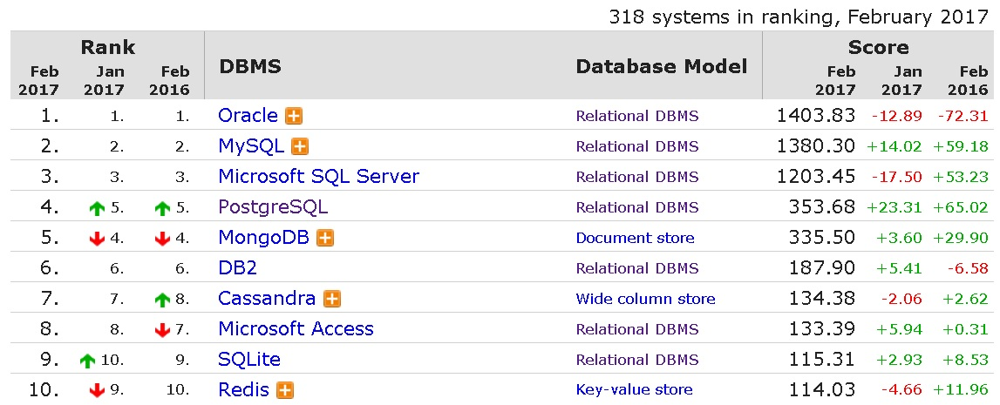      
    
所以我专门针对PostgreSQL提炼了它的一些应用场景（普通的应用场景就不举例了），希望对你的选型可以起到一定的参考作用。    
    
## 1 任意字段组合查询 - ERP、电商、网站、手机APP 等业务场景    
在一些前端的人机交互页面中，经常会有很多选择框，让用户进行选择，这些选择框可能对应的是数据库表中的不同字段。    
    
这种画面经常出现在ERP，电商，网站，手机APP等场景中。    
    
对于开发人员来说是一件很头疼的事情，因为不知道该对哪些字段创建索引，或者干脆对所有字段都建立索引，给数据库带来较大的性能和维护的问题。    
    
PostgreSQL中有两个技术(gin, bloom索引)，可以完美的解决这类业务场景的问题。    
    
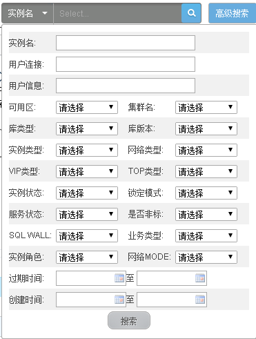    
    
[《宝剑赠英雄 - 任意组合字段等效查询, 探探PostgreSQL多列展开式B树》](../201702/20170205_01.md)    
    
[《PostgreSQL 9.6 黑科技 bloom 算法索引，一个索引支撑任意列组合查询》](../201605/20160523_01.md)      
    
## 2 高并发、高效率范围查询 - 金融、物联网、智能DNS 等业务场景    
    
有些场景，经常要对值进行范围的比对。比如    
    
物联网，对传感器上传的值，进行范围比对。    
    
智能DNS，需要对来源IP进行判断，并找出其落在哪个IP地址段内。    
    
金融行业，经常要设置一些指标范围，时刻判断指数是否落在某个区间，当一些指数落在某个范围区间时，触发下一步的操作（比如买入或卖出）。    
    
传统的两个字段+复合B树的索引，效率低下，通常8核的机器只能达到3000多的QPS。    
    
PostgreSQL通过(range类型和gist,sp-gist索引)，可以将效率提升20多备，8核的机器可以达到8万的QPS。    
    
    
    
[《聊聊between and的坑 和 神奇的解法》](../201701/20170126_02.md)    
    
[《PostgreSQL 黑科技 range 类型及 gist index 20x+ speedup than Mysql index combine query》](../201206/20120607_01.md)     
    
[《PostgreSQL 黑科技 range 类型及 gist index 助力物联网(IoT)》](../201205/20120517_01.md)     
    
[《从难缠的模糊查询聊开 - PostgreSQL独门绝招之一 GIN , GiST , SP-GiST , RUM 索引原理与技术背景》](../201612/20161231_01.md)    
    
## 3 网格化、矢量化地图 - 地理类应用、LBS社交、导航 等业务场景    
人们为了更好的描述一个东西，有一种将大化小的思路，比如时钟被分为了12个区域，每个区域表示一个小时，然后每个小的区域又被划分为更小的区域表示分钟。      
      
      
      
在GIS系统中，也有类似的思想，比如将地图划分成网格。通过编码来简化地理位置的判断（比如相交，包含，距离计算等），但是请注意使用网格带来的问题，比如精度的问题，网格的大小决定了精度，又比如相对坐标的问题，可能无法描述清楚边界的归属。      
      
PostgreSQL可以提供给你更好的选择，矢量化的运算。    
    
    
    
    
      
1\. 在PostGIS中虽然也支持网格对象的描述方式，但是并不是使用这种方法来进行几何运算（比如相交，包含，距离计算等），所以不存在类似的精度问题，个人建议没有强需求的话，不必做这样的网格转换。      
        
2\. 如果是多种精度地图的切换（比如多个图层，每个图层代表一种地图精度），建议使用辐射的方式逐渐展开更精细的图层，以点为中心，逐渐辐射。（很多专业的地图软件是这样做的）        
    
[《蜂巢的艺术与技术价值 - PostgreSQL PostGIS's hex-grid》](../201701/20170124_01.md)    
    
[《PostGIS 地理信息数据 多核并行处理》](../201703/20170307_03.md)      
    
## 4 异步消息 - 物联网、WEB、金融 等业务场景    
电波表是一个非常典型的广播应用，类似的还有组播（注意不是主播哦），类似的应用也很多，比如广播电视，电台等。      
      
在数据库中，其实也有类似的应用，比如利用PostgreSQL数据库的异步消息机制，往数据库的消息通道发送数据，应用程序可以监听对应的消息通道，获取异步消息数据。      
      
通过异步消息在数据库中实现了一对多的广播效果。      
    
在物联网中，也可以有类似的应用，例如结合PostgreSQL的流式计算，当传感器上报的数据达到触发事件的条件时，往异步消息通道发送一则消息，应用程序实时的接收异步消息，发现异常。    
    
这样做的好处很多，即节省了空间（结合流式处理，完全可以轻量化部署），又能提高传播的效率（一对多的传播），程序设计也可以简单化。     
    
在金融行业，也可以有类似的实现，比如对数据的实时流式监测，数据流经一系列的规则，触发异步消息。    
    
    
      
[《从电波表到数据库小程序之 - 数据库异步广播(notify/listen)》](../201701/20170116_01.md)     
    
[《从微信小程序 到 数据库"小程序" , 鬼知道我经历了什么》](../201701/20170113_03.md)    
    
一个例子    
    
这个例子使用PostgreSQL的异步消息通知机制（notify/listen），以及数据库的触发器，PostGIS地理库插件，结合nodejs, socket.io实现了一个实时的客户端GPS坐标更新的小业务。    
    
1\. 在数据库中新增GPS坐标，数据库端编写的"小程序"会自动发送异步消息给客户端，客户端马上就展示了当前新增的坐标    
    
      
    
2\. 修改GPS坐标，数据库端编写的"小程序"会自动发送异步消息给客户端，客户端刷新了当前坐标    
    
      
    
3\. 删除GPS坐标，数据库端编写的"小程序"会自动发送异步消息给客户端，客户端刷新了当前坐标    
    
     
    
详见     
     
[《[转载] postgres + socket.io + nodejs 实时地图应用实践》](../201701/20170113_02.md)     
    
## 5 流式实时数据处理 - 物联网、金融 等业务场景    
在物联网、金融行业中，有大量的数据产生，同时需要实时的对数据进行处理。    
    
pipelinedb是基于PostgreSQL的一个流式计算数据库，纯C代码，效率极高(**32c机器,单机日处理流水达到了250.56亿条**)。同时它具备了PostgreSQL强大的功能基础，正在掀起一场流计算数据库制霸的腥风血雨。          
          
在物联网(IoT)有非常广泛的应用场景，越来越多的用户开始从其他的流计算平台迁移到pipelineDB。            
         
pipelinedb的用法非常简单，首先定义stream(流)，然后基于stream定义对应的transform(事件触发模块)，以及Continuous Views(实时统计模块)            
          
数据往流里面插入，transform和Continuous Views就在后面实时的对流里的数据进行处理，对开发人员来说很友好，很高效。        
         
值得庆祝的还有，所有的接口都是SQL操作，非常的方便，大大降低了开发难度。        
     
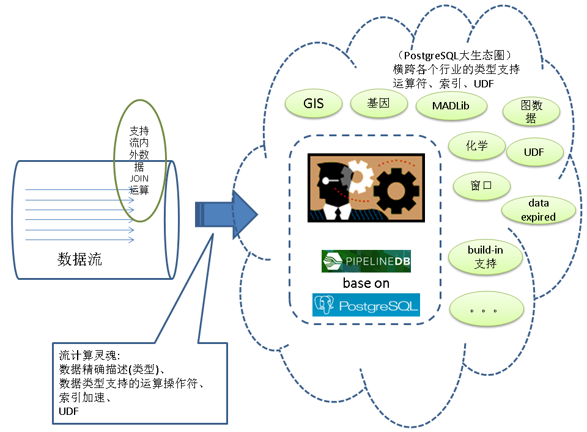    
    
[《流计算风云再起 - PostgreSQL携PipelineDB力挺IoT》](../201612/20161220_01.md)      
    
除此之外，PostgreSQL的undo table，batch调度, 异步消息结合，也能达到与pipeline一样的效果。    
    
[《PostgreSQL 流式数据处理(聚合、过滤、转换...)系列 - 9》](../201701/20170105_09.md)    
    
[《基于PostgreSQL的流式PipelineDB, 1000万/s实时统计不是梦》](../201510/20151015_01.md)      
    
[《"物联网"流式处理应用 - 用PostgreSQL实时处理(万亿每天)》](../201512/20151215_01.md)      
    
## 6 GIS、图像近似度运算 - 互联网、AR红包、虚拟现实与GIS结合、广告营销 等业务场景    
AR红包是GIS与图像、社交、广告等业务碰撞产生的一个全新业务场景。    
    
需要做广告投放的公司，可以对着广告牌，或者店铺中的某个商品拍照，然后藏AR红包。    
    
要找红包的人，需要找到这家店，并且也对准藏红包的物体拍摄，比较藏红包和找红包的两张图片，就可以实现抢红包的流程。    
    
可以想象的空间很多。    
    
使用的核心技术是GIS（地理位置）与图像近似度比较。    
    
PostgreSQL对于这两项技术都可以很好的支持。    
    
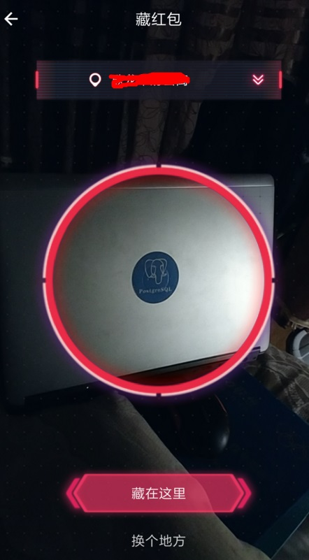    
    
    
    
[《(AR虚拟现实)红包 技术思考 - GIS与图像识别的完美结合》](../201701/20170113_01.md)      
    
## 7 相似内容搜索、去重 - 互联网、数据公司、搜索引擎 等业务场景    
在搜索引擎、数据公司、互联网中都会有网络爬虫的产品，或者有人机交互的产品。    
    
有人的地方就有江湖，盗文、盗图的现象屡见不鲜，而更惨的是，盗图和盗文还会加一些水印。    
    
也就是说，你在判断盗图、盗文的时候，不能光看完全一致，可能要看的是相似度。    
    
这给内容去重带来了很大的麻烦，不过还好，PostgreSQL数据库整合了相似度去重的算法和索引接口，可以方便的处理相似数据。    
    
比如相似的数组、相似的文本、相似的分词、相似的图像的搜索和去重等等。    
    
又比如鉴黄。      
    
    
    
    
      
[《电商内容去重\内容筛选应用(如何高效识别转载\盗图\侵权?) - 文本相似、图片集相似、数组相似的优化和索引技术》](../201701/20170112_02.md)    
    
[《PostgreSQL 在视频、图片去重，图像搜索业务中的应用》](../201611/20161126_01.md)    
    
[《从相似度算法谈起 - Effective similarity search in PostgreSQL》](../201612/20161222_02.md)     
    
## 8 任意字段模糊查询 - 互联网、前端页面、搜索引擎 等业务场景    
在一些应用程序中，可能需要对表的所有字段进行检索，有些字段可能需要精准查询，有些字段可能需要模糊查询或全文检索。          
         
比如一些前端页面下拉框的勾选和选择。        
          
比如一些域名的模糊查询。    
    
这种需求对于应用开发人员来说，会很蛋疼，因为写SQL很麻烦，例子：          
         
之前写过一篇文章来解决这个问题      
        
[《PostgreSQL 行级 全文检索》](../201604/20160419_01.md)        
        
使用的是全文检索，而当用户的需求为模糊查询时？ 如何来解决呢？       
    
PostgreSQL中可以很好的解决这个问题，适用于任意字符（包括英文、中文、等等）。    
    
[《PostgreSQL 全表 全字段 模糊查询的毫秒级高效实现 - 搜索引擎颤抖了》](../201701/20170106_04.md)     
    
[《从难缠的模糊查询聊开 - PostgreSQL独门绝招之一 GIN , GiST , SP-GiST , RUM 索引原理与技术背景》](../201612/20161231_01.md)    
    
## 9 在线处理、离线分析、在线分析混合需求 - 互联网、传统企业、金融 等业务场景    
随着IT行业在更多的传统行业渗透，我们正逐步的在进入DT时代，让数据发挥价值是企业的真正需求，否则就是一堆废的并且还持续消耗企业人力，财力的数据。      
      
传统企业可能并不像互联网企业一样，有大量的开发人员、有大量的技术储备，通常还是以购买IT软件，或者以外包的形式在存在。      
      
数据的核心 - 数据库，很多传统的行业还在使用传统的数据库。      
      
随着IT向更多行业的渗透，数据类型越来越丰富（诸如人像、X光片、声波、指纹、DNA、化学分子、图谱数据、GIS、三维、多维 等等。。。），数据越来越多，怎么处理好这些数据，怎么让数据发挥价值，已经变成了对IT行业，对数据库的挑战。      
      
对于互联网行业来说，可能对传统行业的业务并不熟悉，或者说互联网那一套技术虽然在互联网中能很好的运转，但是到了传统行业可不一定，比如说用于科研、军工的GIS，和互联网常见的需求就完全不一样。      
      
除了对数据库功能方面的挑战，还有一方面的挑战来自性能方面，随着数据的爆炸，分析型的需求越来越难以满足，主要体现在数据的处理速度方面，而常见的hadoop生态中的处理方式需要消耗大量的开发人员，同时并不能很好的支持品种繁多的数据类型，即使GIS可能也无法很好的支持，更别说诸如人像、X光片、声波、指纹、DNA、化学分子、图谱数据、GIS、三维、多维 等等。      
      
那么我们有什么好的方法来应对这些用户的痛处呢？      
      
且看ApsaraDB产品线的PostgreSQL与HybridDB如何来一招左右互搏，左手在线事务处理，右手数据分析挖掘，解决企业痛处。      
    
对传统企业来说，OLTP系统大多数使用的是Oracle等商业数据库，使用PostgreSQL可以与Oracle的功能、性能、SQL语法等做到高度兼容。    
    
而对于分析场景，使用MPP产品HybridDB(基于GPDB)，则可以很好的解决PB级以上的AP需求。    
      
    
    
    
    
[《ApsaraDB的左右互搏术 - PostgreSQL+HybridDB解决企业痛处 TP+AP混合需求》](../201701/20170101_02.md)    
    
对于中小型企业，数据量在10TB量级的，分析型的事务甚至也可以交给PostgreSQL来处理。    
    
因为它具备了多核并行处理的能力、列存储、JIT、算子复用、甚至向量化执行等技术，相比传统的数据库，在OLTP方面有10倍以上的性能提升。(同时还可以使用LLVM技术，GPU卡\FPGA卡来 硬件加速分析)    
      
    
    
[《分析加速引擎黑科技 - LLVM、列存、多核并行、算子复用 大联姻 - 一起来开启PostgreSQL的百宝箱》](../201612/20161216_01.md)     
    
[《PostgreSQL 9.6 引领开源数据库攻克多核并行计算难题》](../201610/20161001_01.md)      
    
[《PostgreSQL 向量化执行插件(瓦片式实现) 10x提速OLAP》](../201702/20170225_01.md)      
    
## 10 用户群体搜索、根据标签圈人 - 电商、广告投放 等业务场景    
电商推荐系统 部分需求介绍      
    
比如一家店铺，如何找到它的目标消费群体？         
          
要回答这个问题，首先我们需要收集一些数据，比如：          
         
1\. 这家店铺以及其他的同类店铺的浏览、购买群体。          
            
我们在逛电商时，会产生一些行为的记录，比如在什么时间，逛了哪些店铺，看了哪些商品，最后在哪家店铺购买了什么商品。           
          
然后，对于单个商店来说，有哪些用户逛过他们的商店，购买过哪些商品，可以抽取出一部分人群。          
         
2\. 得到这些用户群体后，筛选出有同类消费欲望、或者具备相同属性的群体。          
          
对这部分人群的属性进行分析，可以获得一个更大范围的群体，从而可以对这部分群体进行营销。           
          
以上是对电商推荐系统的两个简单的推理。      
    
PostgreSQL, HybridDB解决了推荐系统的三个核心问题    
    
精准，属于数据挖掘系统的事情，使用PostgreSQL, Greenplum 的 MADlib机器学习库可以实现。         
      
实时，实时的更新标签，在数据库中进行流式处理，相比外部流处理的方案，节约资源，减少开发成本，提高开发效率，提高时效性。         
      
高效，使用PostgreSQL以及数组的GIN索引功能，实现在万亿USER_TAGS的情况下的毫秒级别的圈人功能。      
    
    
    
[《恭迎万亿级营销(圈人)潇洒的迈入毫秒时代 - 万亿user_tags级实时推荐系统数据库设计》](../201612/20161225_01.md)      
    
## 11 位置信息处理、点面判断、按距离搜索、化学数据处理 - 危化品监管 等业务场景    
危化品的种类繁多。包括如常见的易爆、易燃、放射、腐蚀、剧毒、等等。    
    
由于危化品的危害极大，所以监管显得尤为重要，    
    
1\. 生产环节      
      
将各个原来人工监控的环节数字化，使用 传感器、流计算、规则（可以设置为动态的规则） 代替人的监管和经验。      
      
2\. 销售环节      
      
利用社会关系分析，在销售环节挖掘不法分子，挖掘骗贷、骗保的虚假交易。利用地理位置跟踪，掌控整个交易的货物运输过程。      
      
3\. 仓储环节      
      
仓储环节依旧使用传感器、流计算、应急机制对仓管的产品进行实时的监管，而对于危化品本身，我们已经不能使用普通的数据类型来存储，很幸运的是在PostgreSQL的生态圈中，有专门支持化学行业的RDKit支持，支持存储化合物类型，以及基于化合物类型的数据处理    
（包括化学反应，分解等等）。      
      
4\. 运输环节      
      
小结一下，在危化品的运输环节，使用传感器对货车、集装箱内的危化品的指标进行实时的监控，使用流式数据库pipelineDB流式的处理传感器实时上报的数据；使用PostgreSQL+PostGIS+pgrouting 对于货车的形式路径进行管理，绕开禁行路段、拥堵路段。      
      
当出现事故时，使用PostgreSQL的GIS索引，快速的找出附近的应急救助资源（如交警、消防中队、医院、120）。      
      
同时对危化品的货物存储，使用化学物类型存储，可以对这些类型进行更多的约束和模拟的合成，例如可以发现化学反应，防止出现类似天津爆炸事件。      
            
5\. 消耗环节      
      
增加剩余量的监控，在闭环中起到很好的作用，达到供需平衡，避免供不应求，或者供过于求的事情发生。         
      
6\. 动态指挥中心      
      
在给生产、仓库、物流配送、消耗环节添加了终端、传感器后，就建立了一个全面的危化品监管数据平台。 构建实时的监管全图。           
        
7\. 缉毒、发现不法分子等      
      
通过社会关系学分析，结合RDKit插件，在数据库中存储了人的信息，存储了人与化学物的关系（比如购买过），然后，根据社会关系学分析，将一堆的化合物（原材料）结合起来，看看会不会发生反应，生成毒品或危化品。       
        
从而发现不法分子。      
      
    
     
    
    
[《从天津滨海新区大爆炸、危化品监管聊聊 IT人背负的社会责任感》](../201612/20161228_01.md)    
    
## 12 图式数据搜索 - 金融风控、公安刑侦、社会关系、人脉分析 等业务场景    
人类是群居动物，随着人口的增长，联络方式越来越无界化，人与人，人与事件，人与时间之间形成了一张巨大的关系网络。       
       
有许多场景就是基于这张巨大的关系网络的，比如。       
      
1\. 猎头挖人         
      
作为IT人士或者猎头、HR，对Linkedin一定不陌生，领英网实际上就是一个维护人际关系的网站。        
        
       
       
通过搜索你的一度人脉，可以找到与你直接相关的人，搜索2度人脉，可以搜索到与你间接相关的人。       
        
当然你还可以继续搜索N度人脉，不过那些和你可能就不那么相关了。        
       
如果你知道和美女范冰冰隔了几度人脉，是不是有点心动了呢？        
       
其实在古代，就有这种社会关系学，还有这种专门的职业，买官卖官什么的，其实都是人脉关系网。看过红楼梦的话，你会发现那家子人怎么那么多亲戚呢？         
       
2\. 公安破案       
       
公安刑侦学也是一类人脉相关的应用，只是现在的关系和行为越来越复杂，这种关系也越来越复杂，原来的人能接触的范围基本上就靠2条腿，顶多加匹马。      
      
现在，手机，电脑，ATM机，超时，摄像头，汽车等等，都通过公路网、互联网连接在一起。      
        
一个人的行为，产生的关系会更加的复杂，单靠人肉的关系分析，刑侦难度变得越来越复杂。       
            
3\. 金融风控        
       
比如银行在审核贷款资格时，通常需要审核申请人是否有偿还能力，是否有虚假消息，行为习惯，资产，朋友圈等等。  同样涉及到复杂的人物关系，人的行为关系分析等等。       
      
图片来自互联网      
         
        
       
        
          
此类围绕人为中心，事件为关系牵连的业务催生了图数据库的诞生。       
        
目前比较流行的图数据库比如neo4j，等。      
        
详见       
      
https://en.wikipedia.org/wiki/Graph_database       
       
PostgreSQL是一个功能全面的数据库，其中就有一些图数据库产品的后台是使用PostgreSQL的，例如OpenCog， Cayley等。          
       
除了这些图数据库产品，PostgreSQL本身在关系查询，关系管理方面也非常的成熟，十亿量级的关系网数据，3层关系运算仅需毫秒。     
    
还可以用于运算人与人之间的最短关系，穷举关系等。    
    
主要用到的技术plpgsql服务端编程、异步消息、数组、游标等。    
    
[《金融风控、公安刑侦、社会关系、人脉分析等需求分析与数据库实现 - PostgreSQL图数据库场景应用》](../201612/20161213_01.md)    
    
## 13 大量数据的求差集、最新数据搜索, 最新日志数据与全量数据的差异比对, 递归收敛扫描 - 物联网、数据同步、数据清洗、数据合并 等业务场景    
有一个这样的场景，一张小表A，里面存储了一些ID，大约几百个到万个。    
      
（比如说巡逻车辆ID，环卫车辆的ID，公交车，微公交的ID）。      
    
另外有一张日志表B，每条记录中的ID是来自前面那张小表的，但不是每个ID都出现在这张日志表中，比如说一天可能只有几十个ID会出现在这个日志表的当天的数据中。    
    
（比如车辆的行车轨迹数据，每秒上报轨迹，数据量就非常庞大，但是每天出勤的车辆有限）。      
    
那么我怎么快速的找出今天没有出现的ID呢。    
    
（哪些巡逻车辆没有出现在这个片区，是不是偷懒了？哪些环卫车辆没有出行，哪些公交或微公交没有出行）？     
    
    
    
select id from A where id not in (select id from B where time between ? and ?);    
    
select a.id from a left join b on (a.id=b.aid) where b.* is null;    
    
这个QUERY会很慢，通常需要几百秒到几十秒，有什么优化方法呢。    
    
通过PostgreSQL的递归查询，可以高效的解决这个问题(在几亿记录中筛选出与几万记录的逻辑差集)。     
    
优化后只需要10毫秒左右。    
    
[《用PostgreSQL找回618秒逝去的青春 - 递归收敛优化》](../201612/20161201_01.md)      
    
同样的方法，还可以用于数据清洗与合并的场景，比如在物联网的环境中，每个传感器，每个小时会上报若干条数据（有新增的，有更新的，有删除的指标等），对于同一个KEY，后台的应用程序只关心最后一条记录。    
    
使用PostgreSQL的递归收敛，每秒可以清洗或合并千万量级的数据。    
    
除了物联网，同样适用于数据库之间的数据逻辑同步。      
    
[《时序数据合并场景加速分析和实现 - 复合索引，窗口分组查询加速，变态递归加速》](../201611/20161128_01.md)     
    
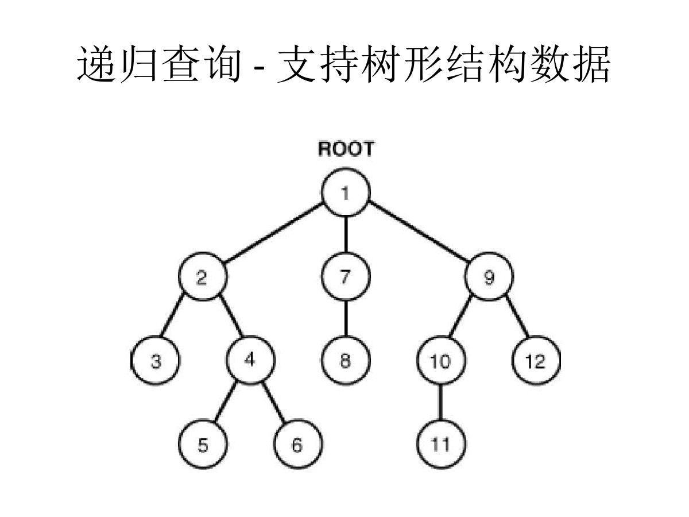    
    
    
    
## 14 数据一致性分享、数据泵 - 跨业务平台实时分享数据 等业务场景    
在IoT的场景中，有流式分析的需求，也有存储历史数据的需求，同时还有数据挖掘的需求，搜索引擎可能也需要同一份数据，还有一些业务可能也要用到同一份数据。       
      
但是如果把数据统统放到一个地方，这么多的业务，它们有的要求实时处理，有的要求批量处理，有的可能需要实时的更新数据，有的可能要对大数据进行分析。       
      
显然一个产品可能无法满足这么多的需求。       
       
就好比数据库就分了关系数据库，NOSQL，OLTP场景，OLAP场景一样。   也是因为一个产品无法满足所有的业务需求。        
      
在企业中通常是借助数据冗余来解决各类场景的需求。         
      
那么如何才能够更好的分享数据，保证数据的一致性，提高分享的实时性呢？       
    
10万级别左右的机器，PostgreSQL 的数据吞吐量可以达到100万条/s以上，同时数据库本身具备了严格的可靠性和一致性保证。    
    
PostgreSQL为分享数据提供了插槽的概念，每个插槽对应一个目标端，支持断点续传，支持多个目标端。用于流式的分享数据是非常好的选择。    
    
    
    
[《实时数据交换平台 - BottledWater-pg with confluent》](../201612/20161205_02.md)      
    
## 15 分词搜索、模糊搜索、相似度搜索 - 电商、公安、传统企业 等业务场景    
看刑侦剧经常有看到人物拼图，然后到图库搜索的，以前可能靠的是人肉，使用PG，可以靠数据库的图形近似度搜索功能。      
      
[《弱水三千,只取一瓢,当图像搜索遇见PostgreSQL (Haar wavelet)》](https://yq.aliyun.com/articles/58246)        
    
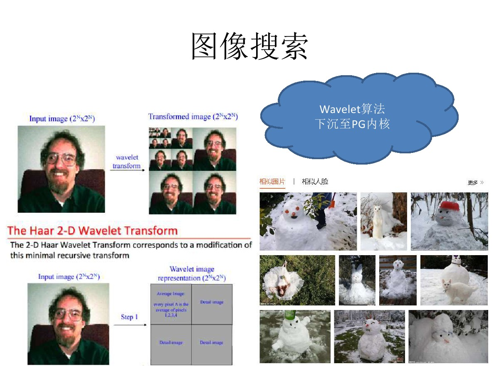    
      
而对于文本搜索，大家一定会想到分词，比如搜索引擎、淘宝的商品内容搜索、文章的关键字搜索等等。       
    
PostgreSQL内置了分词引擎，可以很好的满足这类搜索的需求。    
    
[《聊一聊双十一背后的技术 - 分词和搜索》](../201611/20161115_01.md)      
    
[《PostgreSQL 全文检索加速 快到没有朋友 - RUM索引接口(潘多拉魔盒)》](../201610/20161019_01.md)      
    
[《PostgreSQL 如何高效解决 按任意字段分词检索的问题 - case 1》](../201607/20160725_05.md)      
          
但是千万不要以为分词可以搞定一切需求，比如这样的需求就搞不定。       
       
hello world打成了hello word或者hello w0rld，你要让数据库匹配出来，怎么搞？        
       
又或者你的业务需要写正则进行匹配，怎么搞？比如一些域名的查询，```www.firefoxcn.org``` 可能你只想输入其中的一个部分来搜索，如果firefox可以匹配。       
       
甚至更变态的 fi[a-z]{1}e.*?\.?? ，这样的查询。       
        
数据量小，并发小时，这种查询是可以忍受全表扫描和CPU处理过滤的。      
      
但是想想一下，你是一个日请求过亿的业务，或者数据量亿级别的，全表扫描和CPU的开销会让你疯掉的。       
      
PostgreSQL完美的解决了这类变态的需求。    
    
1\. 使用PostgreSQL regexp库，将正则转换为NFA样式（图形化词组）。       
      
2\. 将NFA样式再进行转换，转换为扩展的图形样式(trigrams)，包括拆分后的查询词组与NOT词组。        
      
3\. 简化，过滤不必要的trigrams。       
      
4\. 打包为TrgmPackedGraph结构，支持GIN,GIST索引的检索。     
    
[《聊一聊双十一背后的技术 - 毫秒分词算啥, 试试正则和相似度》](../201611/20161118_01.md)      
    
[《中文模糊查询性能优化 by PostgreSQL trgm》](../201605/20160506_02.md)      
    
    
    
[《PostgreSQL 百亿数据 秒级响应 正则及模糊查询》](../201603/20160302_01.md)      
    
[《PostgreSQL 1000亿数据量 正则匹配 速度与激情》](../201603/20160307_01.md)      
    
还有一种场景，比如口音纠正、口音相似度搜索。    
    
## 16 文本分析、人物画像 - 电商、公安、传统企业、广告商 等业务场景    
在日常的生活中，我们可能会经常需要一些像相近、相仿、距离接近、性格接近等等类似这样的需求，对数据进行筛选。       
    
在PostgreSQL中，这些场景都支持索引排序和检索。    
    
比如收集了人群的各种喜好的数据，通过对关联数据的聚类分析，或者按喜好的重叠度进行排序，找出目标人群。      
    
这里就涉及到文本的近似度分析，PostgreSQL的文本分析功能可以很好的支持此类场景。    
    
    
    
[《PostgreSQL 文本数据分析实践之 - 相似度分析》](../201608/20160817_01.md)      
    
## 17 高并发更新少量记录 - 电商、票务系统 等业务场景    
秒杀在商品交易中是一个永恒的话题，从双十一，到一票难求，比的仅仅是手快吗？       
        
其实对于交易平台来说，面对的不仅仅是人肉，还有很多脚本，外挂自动化的抢购系统，压力可想而知。       
        
秒杀的优化手段很多，就拿数据库来说，有用排队机制的，有用异步消息的，有用交易合并的。       
        
今天我要给大家介绍一种更极端的秒杀应对方法，裸秒。       
        
目前可能只有PostgreSQL可以做到裸秒，也即是说，来吧，一起上。     
        
PostgreSQL提供了一种ad lock，可以让用户尽情的释放激情，以一台32核64线程的机器为例，每秒可以获取、探测约130万次的ad lock。        
        
试想一下，对单条记录的秒杀操作，达到了单机100万/s的处理能力后，秒杀算什么？100台机器就能处理1亿/s的秒杀请求。    
    
    
    
[《聊一聊双十一背后的技术 - 不一样的秒杀技术, 裸秒》](../201611/20161117_01.md)      
    
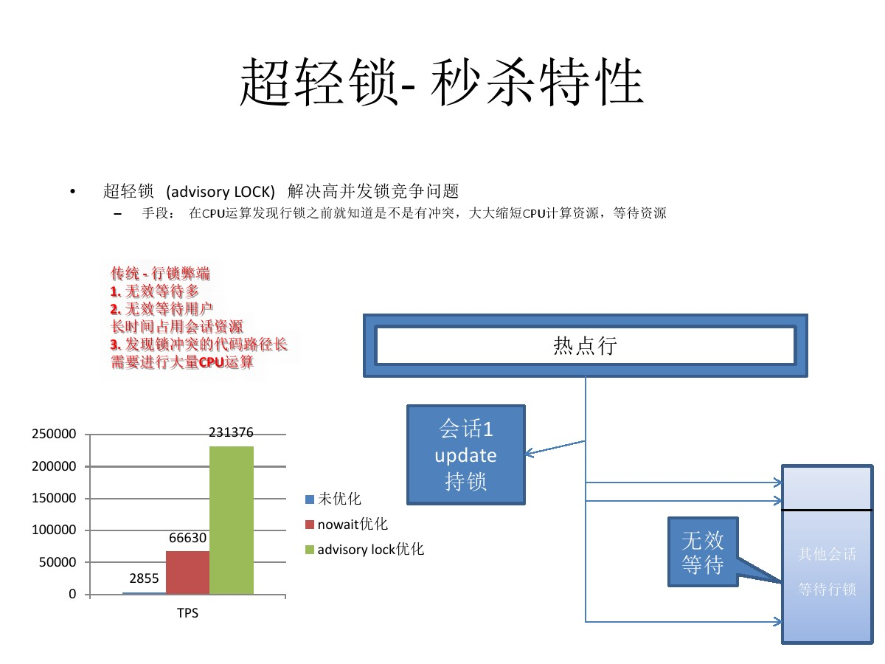    
    
[《PostgreSQL 使用advisory lock或skip locked消除行锁冲突, 提高几十倍并发更新效率》](../201610/20161018_01.md)     
    
## 18 实时用户画像 - 电商、实时广告、实时营销、金融 等业务场景    
用户画像在市场营销的应用重建中非常常见，已经不是什么新鲜的东西，比较流行的解决方案是给用户贴标签，根据标签的组合，圈出需要的用户。      
      
通常画像系统会用到宽表，以及分布式的系统。      
      
宽表的作用是存储标签，例如每列代表一个标签，但是通常数据库到2000个列基本就是极限了，上万TAG的话，只能使用多表JOIN来实现，效率较差。    
    
另一方面，使用宽表(甚至列存储)，标签的筛选性能也比较差（无法达到实时级别）。    
      
以PostgreSQL数据库为基础，给大家讲解一下更加另类的设计思路，以BIT来存储用户，每行一个TAG的方式。     
    
10万亿级TAG/users，毫秒级圈人。    
    
[《基于 阿里云 RDS PostgreSQL 打造实时用户画像推荐系统》](../201610/20161021_01.md)      
    
## 19 动态规划 - 物流配送、打车软件、导航软件、出行软件、高速、高铁 等业务场景    
每年双十一的交易额都创新高，今年也不例外，双十一几乎成了各种IT系统的大考，物流也不例外。       
      
每次双十一快递几乎都被爆仓，但是随着技术的发展，今年，听说双十一刚过，小伙伴们的包裹都快收到了。      
      
今天，来给大家分享一下物流与背后的数据库技术，当然我讲的还是PostgreSQL, Greenplum, PostGIS一类，大伙了解我的。       
      
物流行业是被电子商务催生的产业之一。      
        
快件的配送和揽件的调度算法是物流行业一个非常重要的课题，直接关系到配送或揽件的时效，以及物流公司的运作成本。        
       
好的算法，可以提高时效，降低成本，甚至可以更好的调动社会资源，就像滴滴打车一样，也许能全民参与哦。        
       
以后也许上班路途还能顺路提供快递服务呢。        
       
以物流行业为例，PostgreSQL与Greenplum为物流行业应用提供了包括机器学习、路径规划、地理位置信息存储和处理等基础服务。    
    
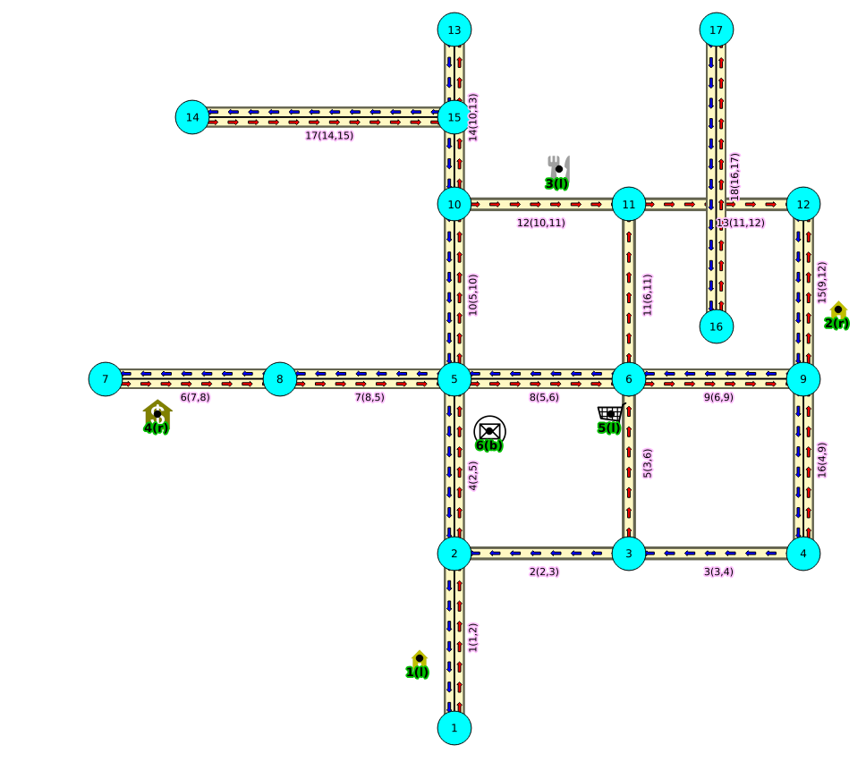    
    
    
    
[《聊一聊双十一背后的技术 - 物流、动态路径规划》](../201611/20161114_01.md)      
    
## 20 流式同步多副本、极致数据可靠性 - 金融、传统企业、互联网 等业务场景    
传统的金融行业高度依赖共享存储来解决数据库的高可用，数据0丢失以及异地容灾的场景。      
    
共享存储的解决方案价格昂贵，对厂商的依赖较大。    
      
PostgreSQL基于同步流复制的 任意副本 解决方案，在解决0丢失，高可用以及容灾的问题的同时，还可以提供只读的功能。相比传统的存储解决方案，优势更加明显。      
       
    
    
[《PostgreSQL 金融行业高可用和容灾解决方案》](../201512/20151224_01.md)      
    
[《PostgreSQL 9.6 同步多副本 与 remote_apply事务同步级别》](../201610/20161006_02.md)      
    
[《2017金秋将要发布的PostgreSQL 10.0已装备了哪些核武器？》](../201701/20170101_01.md)    
    
## 21 块级瘦索引 - 物联网、金融、日志、行为轨迹类数据 等业务场景    
在物联网、金融、日志类型场景中，数据持续不断的产生，对于堆存储来说，有线性相关的特点。    
    
例如，时间字段往往和物理存储的顺序具有线性相关性。    
    
例如，有一些自增字段，也和堆存储的物理顺序线性相关。    
    
对与物理存储线性相关的字段（时间，自增字段），PostgreSQL提供了一种BRIN块级范围索引，索引中存储了对应数据块中的字段统计信息（例如最大值，最小值，平均值，记录数、SUM，空值个数等）    
    
这种索引很小，因为索引的粒度是连续的块，而不是每条记录。    
    
通常比BTREE索引小几百倍。    
    
如果字段的线性相关性很好，进行范围查询或者精确检索时，效率非常高。    
    
对于统计查询，也可以使用BRIN索引，提高分析统计的效率。    
    
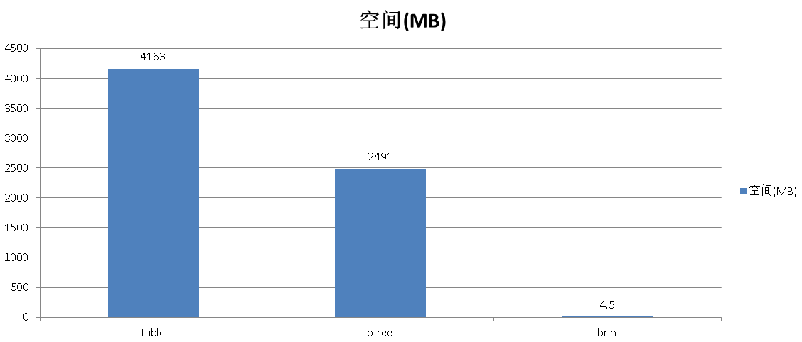    
    
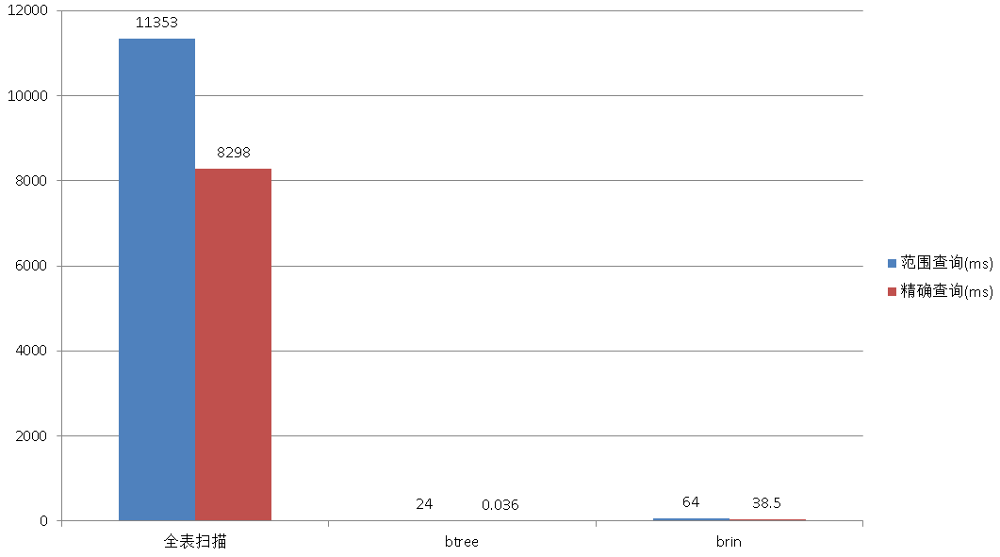    
    
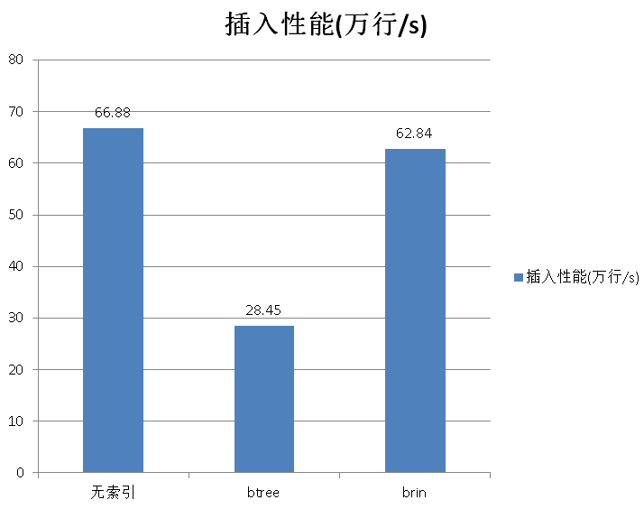    
    
[《PostgreSQL 物联网黑科技 - 瘦身几百倍的索引(BRIN index)》](../201604/20160414_01.md)      
    
[《PostgreSQL 9.5 new feature - BRIN (block range index) index》](../201504/20150419_01.md)      
    
[《PostgreSQL 聚集存储 与 BRIN索引 - 高并发行为、轨迹类大吞吐数据查询场景解说》](../201702/20170219_01.md)    
    
## 22 持续数据写入，高效、0丢失 - 运营商网关、物联网、IT系统FEED 等业务场景    
在运营商网关、物联网的工业数据采集和处理，IT系统的FEED等业务场景中，数据产生的量非常庞大，这些数据要在保证可靠性的情况下，快速的入库。    
    
对于PostgreSQL来说，使用中端x86服务器(通常在10万以内，32核，SSD+SATA结合)上的数据插入速度（目标表包含一个brin索引），实际测试可以达到每天上百TB的写入。        
    
从而以较高的性价比，满足此类业务场景的需求。    
    
[《PostgreSQL 如何潇洒的处理每天上百TB的数据增量》](../201603/20160320_01.md)      
    
## 23 时序数据有损压缩 - 时序、物联网、FEED数据、金融 等业务场景    
在物联网、金融、FEED等场景中，往往有大批量的指标数据产生并进入数据库，通常包含 时间、值 两个字段。    
    
这些数据由于量非常庞大，而且就像音频一样，实际上是可以对其进行有损的压缩存储的。    
    
最为流行的是旋转门的压缩算法，在PostgreSQL中可以使用UDF，方便的实现这个功能。    
    
从而实现流式\时序数据的有损压缩。    
    
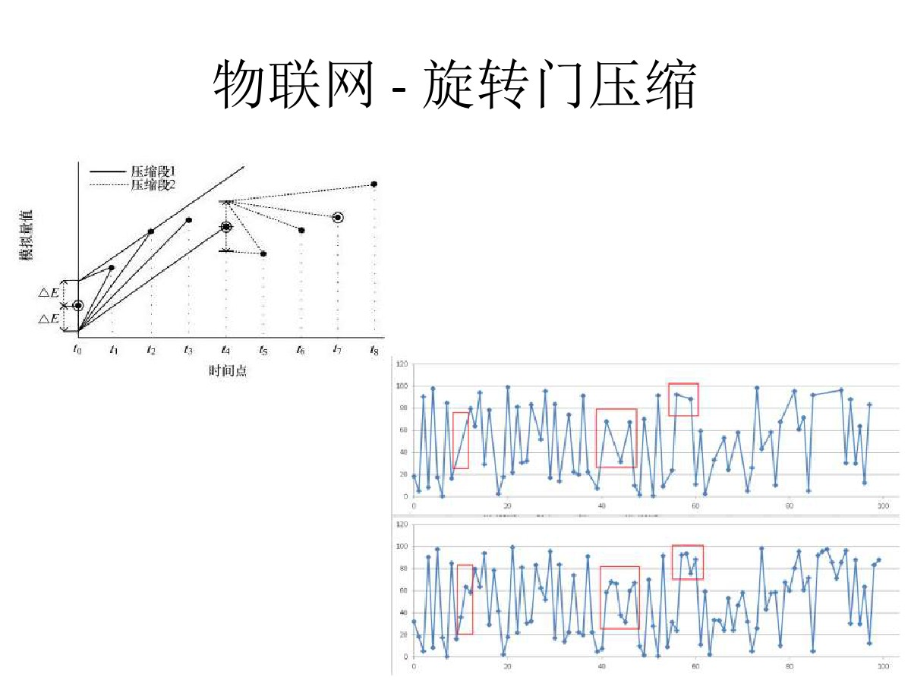    
    
[《旋转门数据压缩算法在PostgreSQL中的实现 - 流式压缩在物联网、监控、传感器等场景的应用》](../201608/20160813_01.md)      
    
## 24 会话级资源隔离 - 多租户、云、混合业务资源控制 等业务场景    
在很多场景中，用户希望可以控制每个连接（会话）的资源使用情况，例如CPU\IOPS\MEMORY等。      
      
PostgreSQL是进程结构，可以通过cgroup很好的实现这个需求，不需要对数据库内核进行改造。    
    
另一方面，基于PostgreSQL的产品GPDB，则是在数据库的内核层面实施的控制。    
    
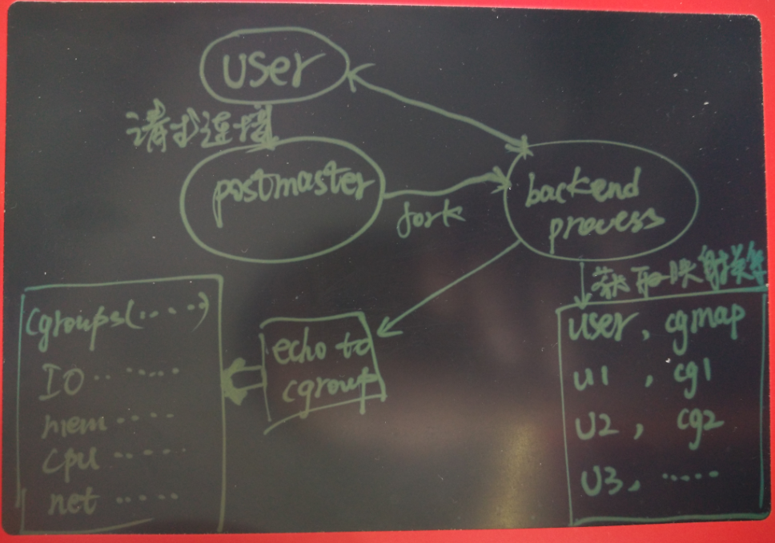    
    
[《PostgreSQL 会话级资源隔离探索》](../201607/20160727_01.md)      
    
## 25 基因工程 - 生命科学、医疗 等业务场景    
PostgreSQL凭借良好的扩展性，不仅仅是一个数据库，同时也是具备非常强大的数据处理能力的数据平台。    
    
很多垂直行业的用户拿它来做各种和业务贴合非常紧密的事情。     
         
例如PostgreSQL在生命科学领域的应用案例 - 基因工程。        
      
通常的思维可能是这样的，把数据存在数据库，需要运算的时候，再把数据取出进行运算（例如配对），需要花费非常多的网络传输时间。        
    
    
      
PostgreSQL提供了基因工程相关的数据类型，操作类型，索引。满足基因工程业务的需求。      
    
用户可以直接在数据库中对基因数据进行处理。同时还可以利用MPP来解决更大数据量的问题（例如压缩后百TB级别）。        
    
    
    
    
    
    
     
[《为了部落 - 如何通过PostgreSQL基因配对，产生优良下一代》](../201606/20160621_01.md)      
    
## 26 数据预测、挖掘 - 金融数据分析、机器学习 等业务场景    
PostgreSQL、以及HybridDB(基于GPDB)，等PostgreSQL相关的数据库，都支持MADlib机器学习库，这个库支持机器学习领域常见的算法（例如聚类、线性回归、贝叶斯、文本处理等等）    
    
其中在数据领域用得较多的数据预测，可以使用MADLib的多元回归库，进行数据的预测。    
    
结合plR语言 或者R + pivotalR 、 python + pythonR插件，可以自动将R\python语言的命令转换为MADlib库函数，对数据进行分析。    
    
非常适合使用R或者python对数据进行分析的数据科学家使用。    
    
其特点是高效（数据与运算一体，可以使用LLVM\向量计算等技术优化，同时不需要传播数据，节约了传播的开销）、易用（支持常见的SQL、r, python等编程）。    
    
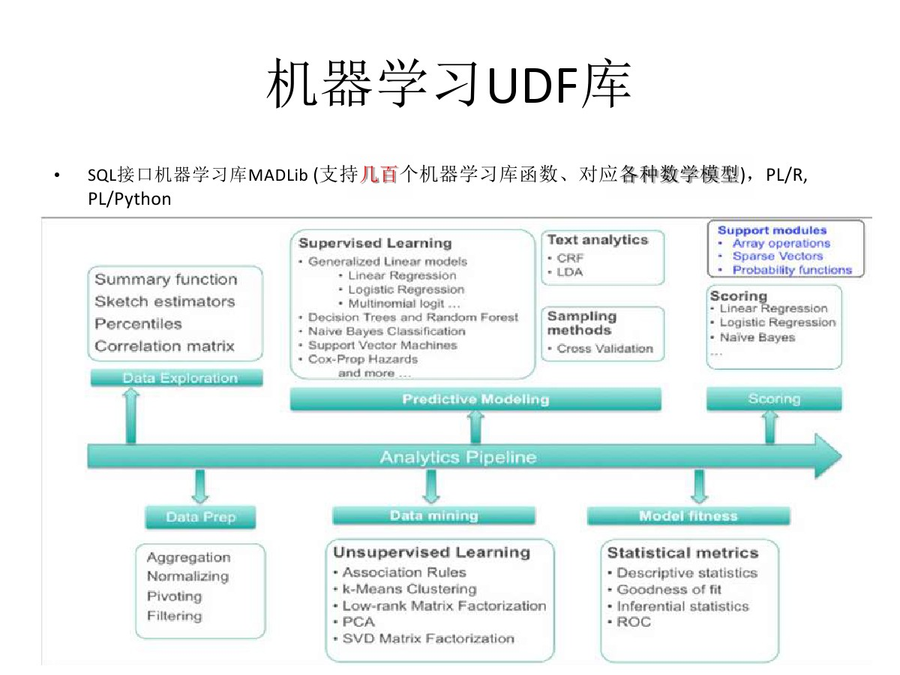    
    
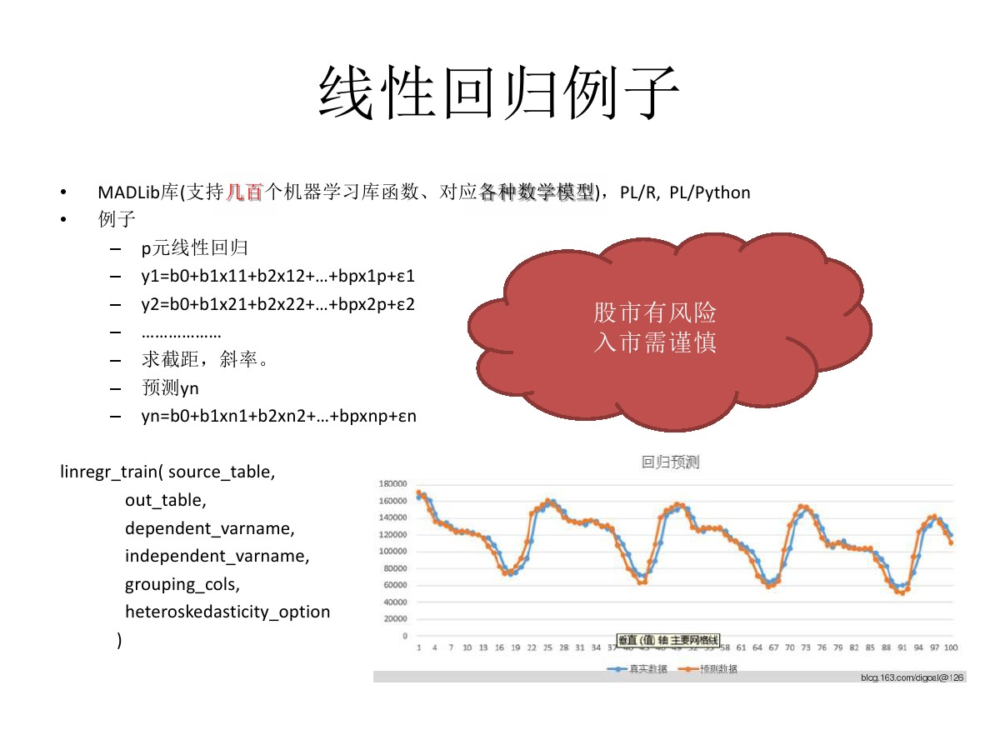    
    
[《PostgreSQL 线性回归 - 股价预测 1》](../201503/20150304_01.md)      
    
[《在PostgreSQL中用线性回归分析linear regression做预测 - 例子2, 预测未来数日某股收盘价》](../201503/20150305_01.md)      
    
## 27 数据库端编程 - ERP、电商、传统企业、电商、运营商 等业务场景    
在传统企业、电商、运营商等涉及用户交互、或者多个系统交互的业务场景中，通常一个事务涉及到很复杂的业务逻辑，需要保证数据的一致性，同时还需要与数据库多次交互。    
    
比如 银行开户 ， 涉及的业务系统多，逻辑复杂。    
    
在传统企业中，通常使用商业数据库的过程函数，实现此类复杂的逻辑。    
    
PostgreSQL的数据库过程函数支持的语言非常丰富，比如plpgsql（可与Oracle pl/sql功能比肩)，另外还支持语言的扩展，例如支持python,perl,java,c,r等等作为数据库的过程函数语言。    
    
对于开发人员来说，几乎可以在PostgreSQL数据库中处理任何业务逻辑。    
    
[《论云数据库编程能力的重要性》](../201605/20160505_01.md)      
    
    
    
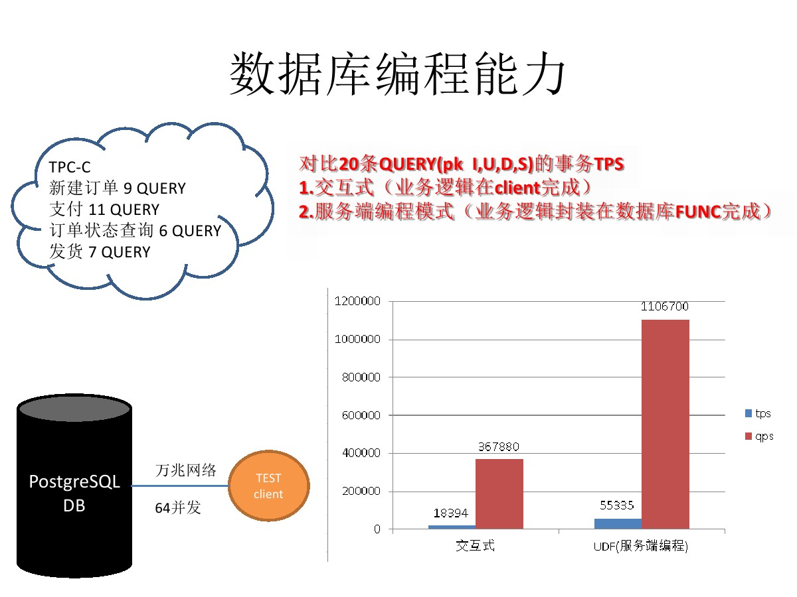    
    
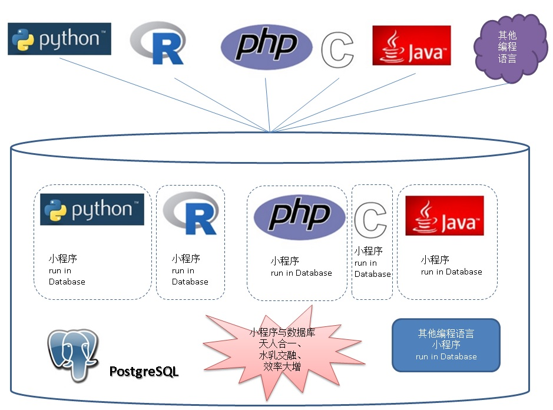    
    
[《PostgreSQL 数据库扩展语言编程 之 plpgsql - 1》](../201701/20170110_01.md)     
    
## 28 ECPG，C嵌入式开发 - 金融 等业务场景    
在金融行业中，用得非常多的是嵌入式SQL开发，可能为了处理复杂的逻辑，同时还需要非常高的效率、以及方便的代码管理。    
    
所以此类场景就会用到嵌入式SQL开发，取代部分数据库过程语言的代码。    
    
PostgreSQL 的ECPG，与Oracle的Pro*C功能对齐，是个非常好的选择。    
    
https://www.postgresql.org/docs/9.6/static/ecpg.html    
    
## 29 数据库水平拆分、跨平台数据融合 - 金融、电商、互联网、物联网 等业务场景    
PostgreSQL 从 2011年的9.1版本引入FDW开始，发展到现在已经支持几乎所有的外部数据源读写操作，例如mysql,oracle,pgsql,redis,mongo,hive,jdbc,odbc,file,sqlserver,es,S3,......。      
      
https://wiki.postgresql.org/wiki/Fdw      
      
开放的接口，允许用户自己添加外部数据源的支持。      
      
9.6针对postgres_fdw（即PostgreSQL外部数据源）再次增强，开始支持对sort, where, join的下推，支持remote cancel query, 用户使用FDW可以对应用透明的实现数据库的sharding，单元化需求。      
      
内核层支持sharding，这种分片技术相比中间件分片技术的好处：     
    
1\. 支持跨库JOIN        
    
2\. 支持绑定变量        
    
3\. 支持master(coordinator)节点水平扩展      
    
4\. 支持segment(datanode)节点水平扩展      
    
5\. 支持函数和存储过程       
    
6\. 支持sort, where, join的下推，支持remote cancel query，10.x支持聚合算子的下推。    
      
ps: 目前还不支持分布式事务（需要用户干预2PC） ，10.x的版本会增加内核层面的分布式事务控制。     
    
[《PostgreSQL 9.6 单元化,sharding (based on postgres_fdw) - 内核层支持前传》](../201610/20161004_01.md)      
    
[《PostgreSQL 9.6 sharding + 单元化 (based on postgres_fdw) 最佳实践 - 通用水平分库场景设计与实践》](../201610/20161005_01.md)      
    
    
    
除了postgres_fdw，PostgreSQL还有很多FDW，也就是说，你可以在PostgreSQL数据库中，访问几乎任何外部数据。就像访问本地的表效果一样。    
    
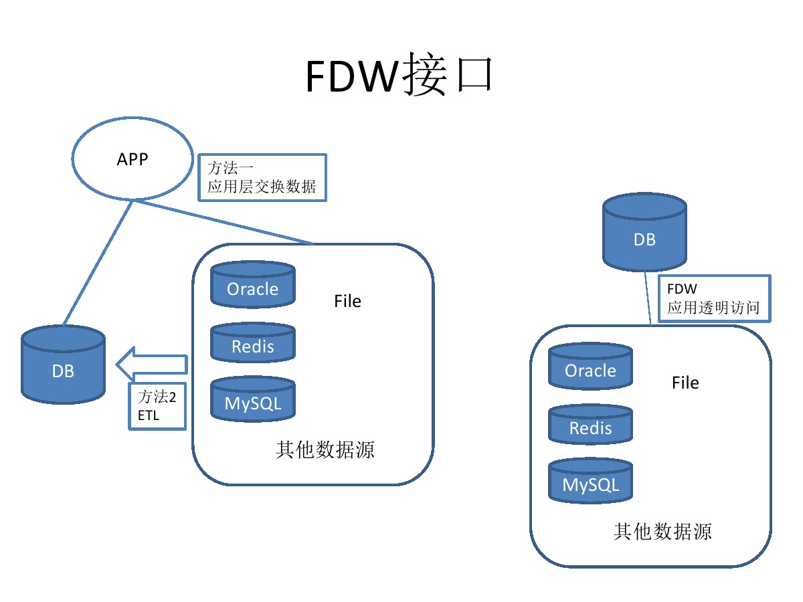    
    
https://wiki.postgresql.org/wiki/Fdw    
    
## 31 地理位置信息查询 - LBS、社交、物流、出行、导航 等业务场景    
在LBS、社交、物流、出行、导航等场景中，最为常见的一个需求是基于位置的搜索，比如搜索附近的人，并按距离由近到远排序。    
    
在PostgreSQL中，有专门的GiST, SP-GiST索引支持，可以做到非常高效的检索，100亿地理位置数据，查询某个点附近的点，普通硬件，单个数据库响应时间在1毫秒以内。    
    
PostgreSQL在位置信息近邻（KNN）查询方面的性能参考。    
    
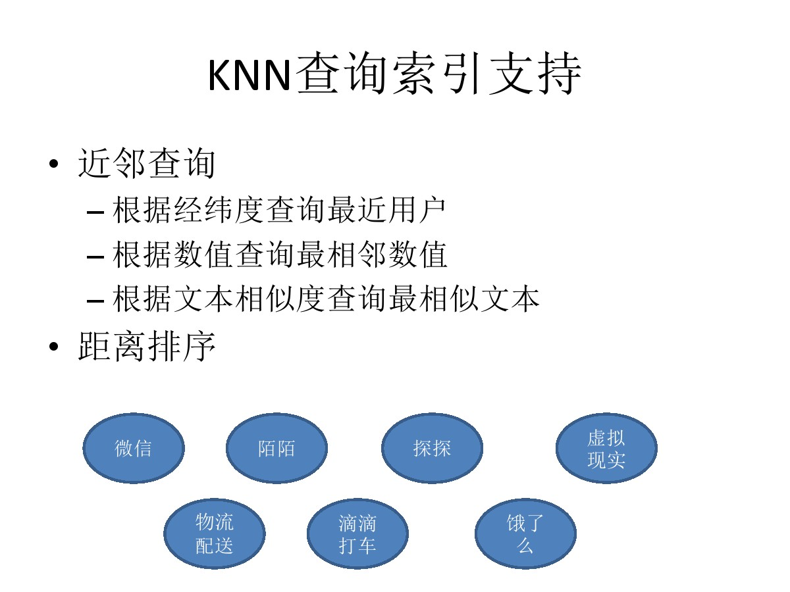    
    
[《PostgreSQL 百亿地理位置数据 近邻查询性能》](../201601/20160119_01.md)      
    
## 32 Oracle兼容性    
毫无疑问，Oracle在企业市场的份额依旧是老大哥的地位，市面上也有很多数据库对这块市场虎视眈眈。    
    
拥有43年开源历史的PostgreSQL数据库，是目前与Oracle兼容最为完美的数据库。业界也有许多非常成功的案例。    
    
比如 丰田汽车、平安银行、邮储银行 等。       
    
兼容性细节请参考    
    
http://vschart.com/compare/oracle-database/vs/postgresql    
    
https://wiki.postgresql.org/wiki/Oracle_to_Postgres_Conversion    
  
https://www.postgresql.org/about/featurematrix/  
    
[《数据库选型思考》](../201702/20170208_03.md)     
    
[《Oracle 迁移至 PostgreSQL 文档、工具大集合》](../201702/20170217_02.md)      
    
[《PostgreSQL Oracle 兼容性之 - RATIO_TO_REPORT 分析函数》](../201703/20170302_01.md)      
    
[《PostgreSQL Oracle 兼容性之 - SQL OUTLINE插件sr_plan (保存、篡改、固定 执行计划)》](../201702/20170228_01.md)      
    
[《PostgreSQL Oracle 兼容性之 - 函数、类型、多国语言》](../201702/20170217_01.md)      
    
[《PostgreSQL Oracle 兼容性之 - 内核自带的兼容函数》](../201702/20170207_01.md)      
    
[《Oracle log file parallel write 等待事件分析 - PostgreSQL的WAL异曲同工》](../201612/20161219_01.md)      
    
[《PostgreSQL Oracle 兼容性之 - plpgsql 自治事务(autonomous_transaction)补丁》](../201611/20161104_01.md)      
    
[《PostgreSQL Oracle 兼容性之 - PL/SQL FORALL, BULK COLLECT》](../201610/20161018_04.md)      
    
[《PostgreSQL Oracle 兼容性之 - 字符编码转换 CONVERT》](../201609/20160921_02.md)      
    
[《PostgreSQL Oracle 兼容性之 - COMPOSE , UNISTR , DECOMPOSE》](../201609/20160921_01.md)      
    
[《PostgreSQL Oracle 兼容性之 - BIT_TO_NUM , BITAND , 比特运算 , 比特与整型互相转换》](../201609/20160920_06.md)      
    
[《PostgreSQL Oracle 兼容性之 - ASCIISTR》](../201609/20160920_05.md)      
    
[《PostgreSQL Oracle 兼容性之 - TZ_OFFSET》](../201609/20160920_03.md)      
    
[《PostgreSQL Oracle 兼容性之 - NEW_TIME , SYS_EXTRACT_UTC》](../201609/20160920_02.md)      
    
[《PostgreSQL Oracle 兼容性之 - REMAINDER》](../201609/20160920_01.md)      
    
[《PostgreSQL Oracle 兼容性之 - 锁定执行计划(Outline system)》](../201607/20160725_04.md)      
    
[《PostgreSQL Oracle 兼容性之 - PL/SQL record, table类型定义》](../201607/20160714_01.md)      
    
[《为什么用 PostgreSQL 绑定变量 没有 Oracle pin S 等待问题》](../201606/20160617_02.md)      
    
[《PostgreSQL Oracle 兼容性之 - connect by》](../201606/20160614_03.md)      
    
[《PostgreSQL Oracle 兼容性之 - 如何篡改插入值(例如NULL纂改为其他值)》](../201605/20160527_01.md)      
    
[《PostgreSQL Oracle 兼容性之 - add_months》](../201605/20160507_01.md)      
    
[《PostgreSQL Oracle 兼容性之 - psql prompt like Oracle SQL*Plus》](../201605/20160503_01.md)      
    
[《PostgreSQL Oracle 兼容性之 - PL/SQL pipelined》](../201603/20160318_01.md)      
    
[《PostgreSQL Oracle 兼容性之 - sys_guid() UUID》](../201603/20160315_01.md)      
    
[《PostgreSQL Oracle 兼容性之 - WM_SYS.WM_CONCAT》](../201602/20160204_01.md)      
    
[《EnterpriseDB & PostgreSQL RLS & Oracle VPD》](../201602/20160203_03.md)      
    
[《PostgreSQL Oracle 兼容性之 - 函数 自治事务 的写法和实现》](../201602/20160203_02.md)      
    
[《PostgreSQL Oracle 兼容性之 - WITH 递归 ( connect by )》](../201512/20151221_02.md)      
    
[《PostgreSQL Oracle 兼容性之 - orafce介绍》](../201512/20151221_01.md)      
    
[《PostgreSQL Oracle 兼容性之 - orafce (包、函数、DUAL)》](../201507/20150703_01.md)      
    
[《PostgreSQL Oracle 兼容性之 - 事件触发器实现类似Oracle的回收站功能》](../201504/20150429_01.md)      
    
[《PostgreSQL 函数封装 - Wrap Function code like Oracle package》](../201206/20120606_01.md)      
    
[《PostgreSQL Oracle 兼容性之 - Support GROUPING SETS, CUBE and ROLLUP.》](../201505/20150526_02.md)    
    
[《数据库界的华山论剑 tpc.org》](../201701/20170125_01.md)    
    
[《BenchmarkSQL 测试PostgreSQL 9.5.0 TPC-C 性能》](../201601/20160109_01.md)      
    
[《BenchmarkSQL 测试Oracle 12c TPC-C 性能》](../201512/20151223_02.md)      
    
## 33 强大的社区力量  
PostgreSQL 的开源许可非常友好，开发者遍布世界各地，各个行业，这也是PostgreSQL数据库用户行业覆盖面非常广的原因之一。  
  
https://wiki.postgresql.org/wiki/Development_information  
  
https://en.wikipedia.org/wiki/PostgreSQL  
  
PostgreSQL 社区的内核研发实力非常强大，在功能方面一直引领开源数据库。  
  
开发节奏非常好，每年发布一个大版本，每个大版本都可以看到许多前沿的大特性。  
  
https://commitfest.postgresql.org/  
  
PostgreSQL 用户组也非常活跃，几乎全年无休世界各地都能看到PostgreSQL用户组的活动。  
  
https://www.postgresql.org/about/events/  
  
PostgreSQL 的外围生态也非常的活跃，这也得益于友好的开源许可。比如 :     
  
衍生产品  
  
GPDB, Greenplum, HAWQ, AWS Redshift, 许多国产数据库, Postgres-XC, Postgres-XL, AsterData、matrixDB、Paraclle、Illustra, Informix, Netezza、EDB、PipelineDB、Postgres-XZ       
  
外围提交的特性  
  
LLVM、向量化执行引擎、列存储、内存引擎、图数据处理、指纹数据处理、化学数据处理、生物数据处理 等。  
  
外围提交的插件  
  
块级增量备份、RAFT协议与PG的多副本整合、逻辑复制、近似度搜索插件、等待事件采样、网格化插件、分布式插件 等。  
  
## 案例、用户    
不完全名单    
    
生物制药 {Affymetrix(基因芯片), 美国化学协会, gene(结构生物学应用案例), …}    
    
电子商务 { CD BABY,  etsy(与淘宝类似), whitepages, flightstats, Endpoint Corporation …}    
    
学校 {加州大学伯克利分校, 哈佛大学互联网与社会中心, .LRN, 莫斯科国立大学, 悉尼大学, 武汉大学, 人民大学, 上海交大, 华东师范 …}    
    
金融 {Journyx, LLC, trusecommerce(类似支付宝), 日本证券交易交所, 邮储银行, 同花顺, 平安科技…}    
    
游戏 {MobyGames, 斯凯网络 …}    
    
政府 {美国国家气象局, 印度国家物理实验室, 联合国儿童基金, 美国疾病控制和预防中心, 美国国务院, 俄罗斯杜马, 国家电网, 某铁路运输…}    
    
医疗 {calorieking, 开源电子病历项目, shannon医学中心, …}    
    
制造业 {Exoteric Networks, 丰田, 捷豹路虎}    
    
媒体 {IMDB.com, 美国华盛顿邮报国会投票数据库, MacWorld, 绿色和平组织, …}    
    
开源项目 {Bricolage, Debian, FreshPorts, FLPR, LAMP, PostGIS, SourceForge, OpenACS, Gforge …}    
    
零售 {ADP, CTC, Safeway, Tsutaya, Rockport, …}    
    
科技 {GITlab, Sony, MySpace, Yahoo, Afilias, APPLE, 富士通, Omniti, Red Hat, Sirius IT, SUN, 国际空间站, Instagram, Disqus, AWS Redshift, 阿里巴巴, 去哪儿, 腾讯, 华为, 中兴, 云游, 智联招聘, 高德, 饿了么 …}    
    
通信 {Cisco, Juniper, NTT(日本电信), 德国电信, Optus, Skype, Tlestra(澳洲电讯), 某运营商…}    
    
物流 {第一物流}    
    
## 开发手册    
    
[《PostgreSQL Java tutorial》](../201701/20170106_05.md)      
    
[《PostgreSQL Python tutorial》](../201701/20170106_06.md)      
    
[《PostgreSQL Ruby tutorial》](../201701/20170106_07.md)      
    
[《PostgreSQL PHP tutorial》](../201701/20170106_08.md)      
    
[《PostgreSQL C tutorial》](../201701/20170106_09.md)     
    
[《PostgreSQL GO tutorial 1》](http://go-database-sql.org/index.html)    
    
[《PostgreSQL GO tutorial 2》](https://godoc.org/github.com/lib/pq)    
    
## 适应场景    
适应广泛的行业与业务场景    
    
GIS, 物联网, 互联网, 企业, ERP, 多媒体, ......    
    
TP + AP    
    
单库 20 TB 毫无压力    
    
要求主备严谨一致的场景不二之选    
    
## 其他文档    
    
[《数据库选型思考》](../201702/20170208_03.md)     
    
[《PostgreSQL 前世今生》](../201609/20160929_02.md)      
    
[《PostgreSQL 数据库开发管理规范》](../201609/20160926_01.md)     
    
[《PostgreSQL 特性小故事》](../201701/20170120_01.md)     
    
PostgreSQL 比较鲜明的特性表述      
    
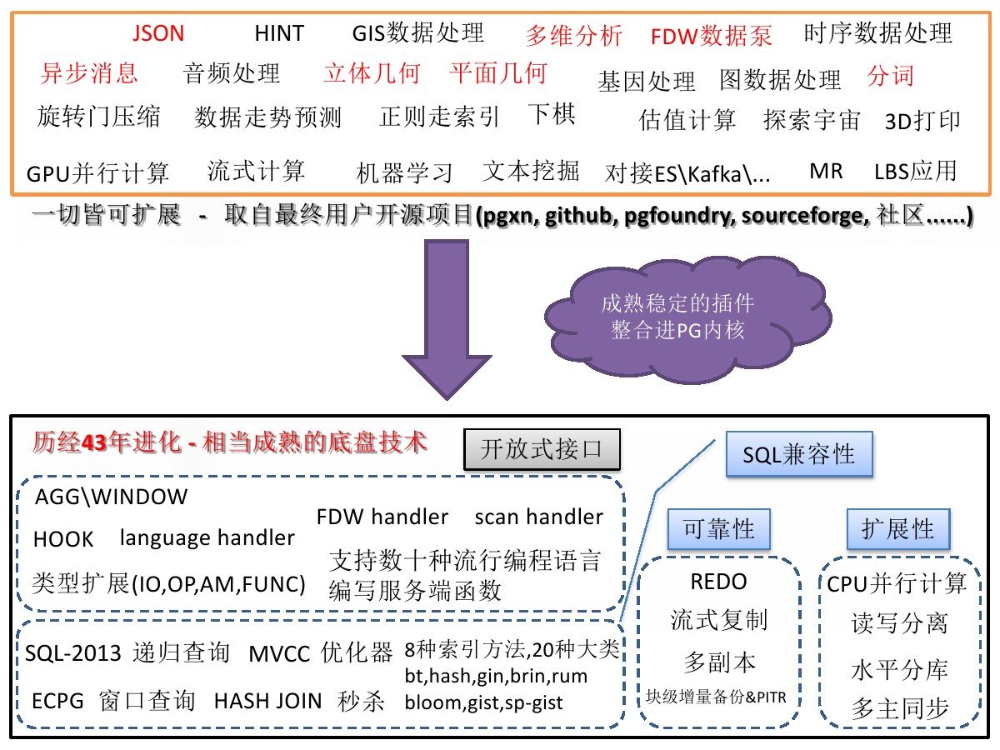    
    
    
    
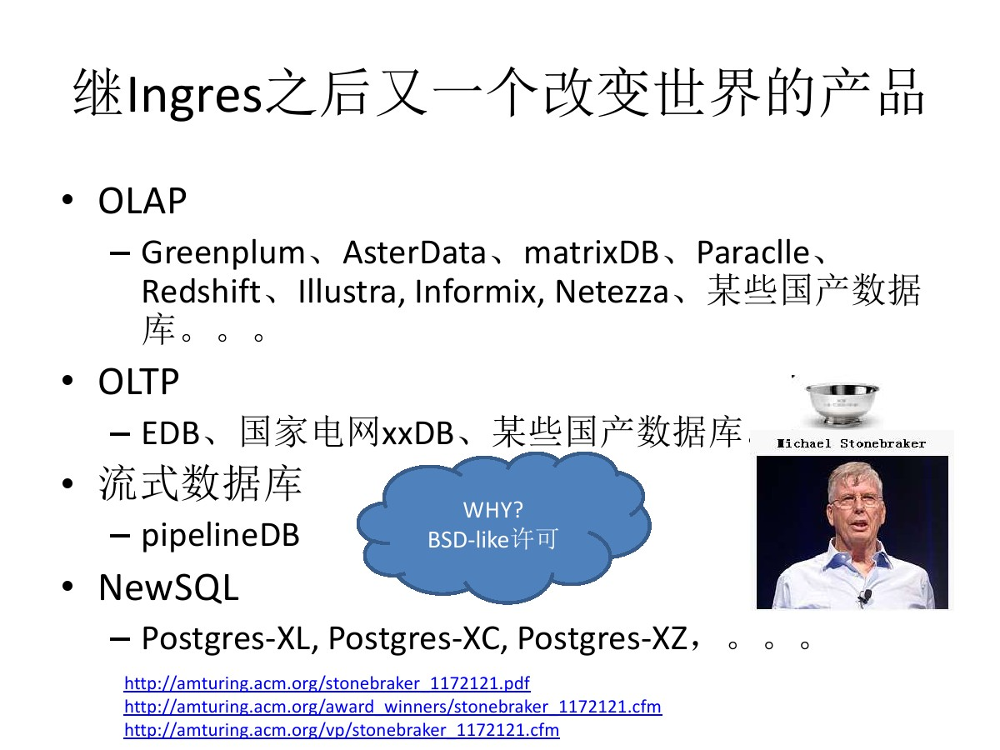    
    
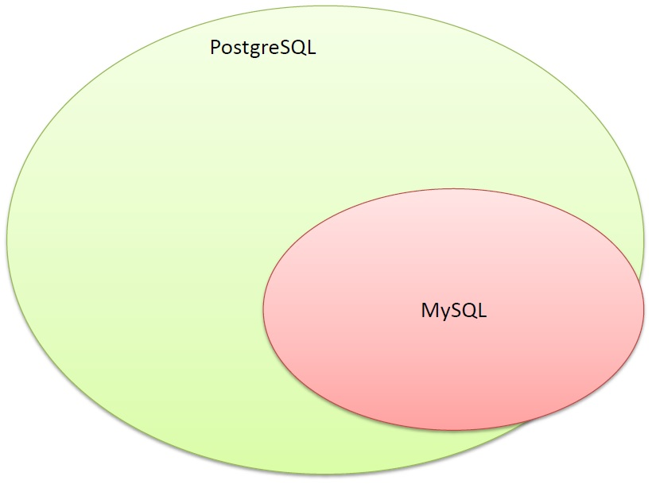    
    
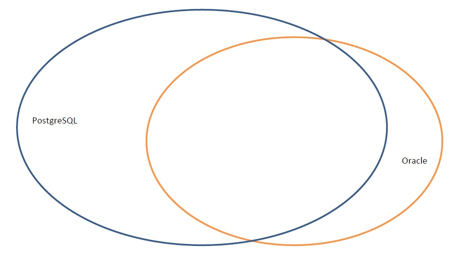    
    
## 小结  
如果把玩转数据库比作打怪升级，打小怪或者普通怪物适合赚经验升级，打BOSE则有更多的几率爆出更多的装备或者宝贝，等级低的时候打小怪也能赚经验，等级高的时候就必须打等级高的怪物，否则打小怪可能永远都升不了级。  
  
PostgreSQL就是游戏里等级高的怪物，甚至是BOSE级别的怪物。  
  
如果你看斗破苍穹的话，则可以把PostgreSQL当成你的炼药师，它可以陪伴你从低段位快速的提升到高段位。  
  
围绕在PostgreSQL身边的生态非常之庞大，当你的能力越来越强，视野越来越广阔，对业务，对行业越来越了解的话，你可以玩得越来越转。  
    
当你玩转它的时候，就不是数据库玩你了，你可以让PG陪你一起玩。   
  
[《找对业务G点, 体验酸爽 - PostgreSQL内核扩展指南》](../201606/20160626_01.md)    
  
  
<a rel="nofollow" href="http://info.flagcounter.com/h9V1"  ></a>  
  
  
  
  
  
  
## [digoal's 大量PostgreSQL文章入口](https://github.com/digoal/blog/blob/master/README.md "22709685feb7cab07d30f30387f0a9ae")
  
