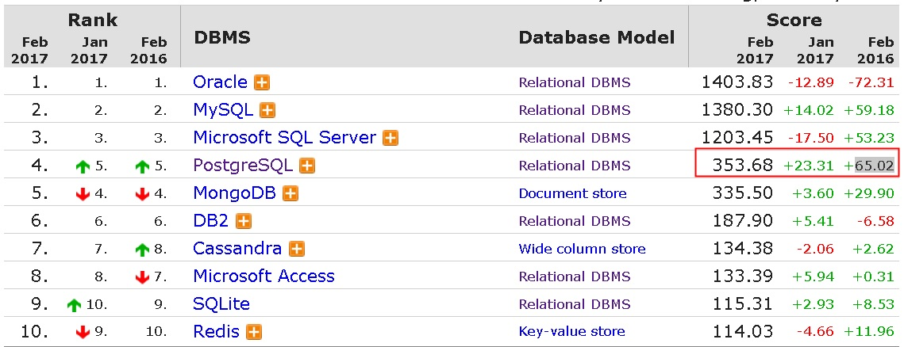
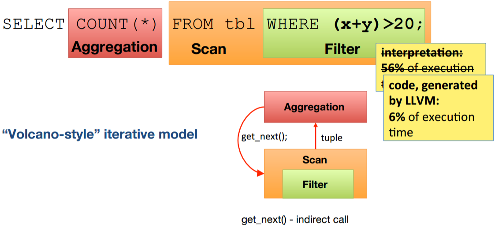
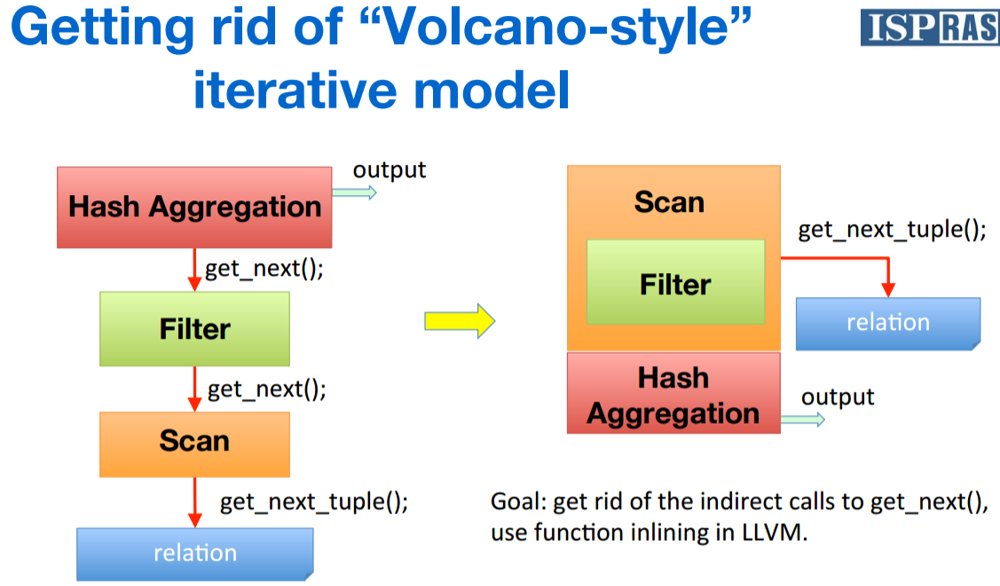
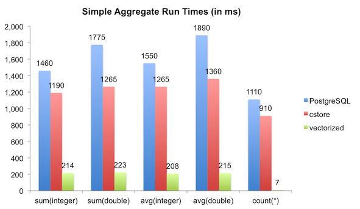
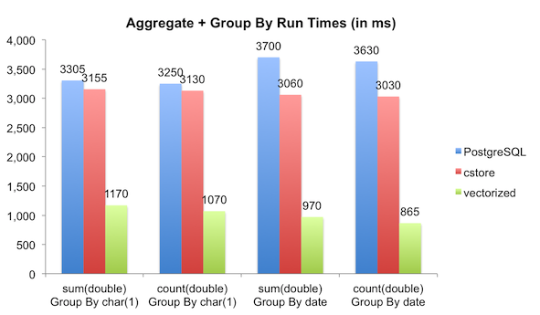
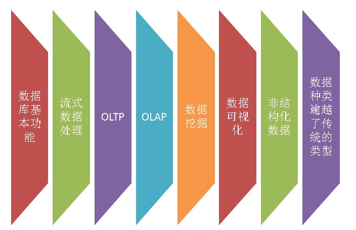
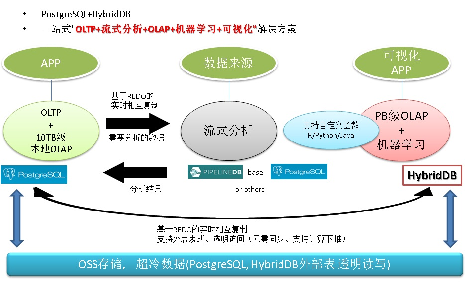
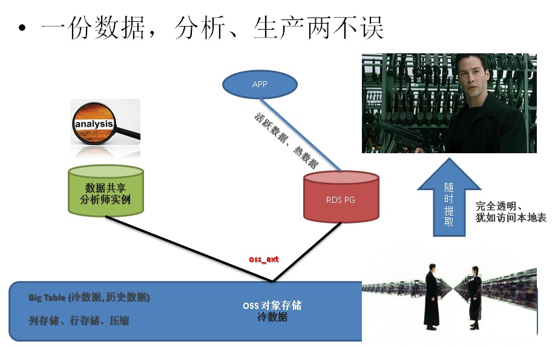

## PostgreSQL 2017 2月份 相关新闻  
                                                   
### 作者                                                   
digoal                                                    
                                                      
### 日期                                                    
2017-02-14                                                                           
                                                    
### 标签                                                                                                                                                                    
PostgreSQL , 新闻                     
                
----                                                    
                                                  
## 背景              
PostgreSQL近几年的发展有目共睹，从GIS到物联网、流式计算、多维分析、高并发在线事务处理、服务端编程、任意数据类型的抽象处理、扩展索引方法、GPU运算能力的利用等各个方面体现了PostgreSQL的强大功能和性能。从dbranking的分值也可以得到证明，毫无疑问是2016年度发展最快的数据库。  
  
2016年发布的PostgreSQL 9.6新特性还历历在目，比如多核并行计算、针对流式数据的块级索引、同步多副本等等。2017年将要发布的10.0又装配了更多的核武器，到底有些啥呢？  
  
PostgreSQL在向量化运算、列存储、动态编译等极致优化的领域又有什么新动作呢？  
  
AWS、阿里云等众多云厂商在PostgreSQL这块又有什么样的布局呢？  
  
### 1 PostgreSQL成为2016年度增速最快的数据库  
  
  
  
http://db-engines.com/en/ranking  
  
### 2 AWS 推出Aurora for PostgreSQL预览版本  
  
https://aws.amazon.com/cn/blogs/aws/amazon-aurora-update-postgresql-compatibility/  
  
https://pages.awscloud.com/amazon-aurora-with-postgresql-compatibility-preview-form.html  
  
### 3 PostgreSQL 推出小版本更新 9.6.2, 9.5.6, 9.4.11, 9.3.16, 9.2.20  
  
https://www.postgresql.org/about/news/1733/  
  
### 4 PostgreSQL 10.0 新武器预览  
  
[《2017金秋将要发布的PostgreSQL 10.0已装备了哪些核武器？》](../201701/20170101_01.md)   
  
- 并行计算专属动态共享内存区，（加速索引扫描\外部表并行的支持步伐）  
  
- 多副本新增 "任意节点、顺序" 两种模式自由选择  
  
- 添加会话级临时replication slots支持  
  
- 认证协议安全改进(SCRAM-SHA-256)  
  
- 内置分区、多级分区支持  
  
- 聚合运算减少context切换  
  
- hash index性能增强  
  
- 支持进程级条件变量，简化sleep\wakeup设计  
  
- 支持聚合运算下推至sharding节点  
  
- 支持流式备份时，同时备份数据文件与REDO文件  
  
- 分布式事务   
  
- 二阶段事务on slave  
  
- Scan key push down to heap  
  
- 间接索引  
  
- 内置逻辑复制  
  
- WAL流式接收，在线压缩  
  
### 5 PostgreSQL 迎来全球用户组会议高峰期  
  
https://www.postgresql.org/about/events/  
  
```  
Prague PostgreSQL Developer Days 2017  
Date: 2017-02-15 – 2017-02-16  
Location: Prague, Czech Republic  
Language: Czech  
  
pgDay Israel 2017  
Date: 2017-03-02  
Location: Tel Aviv, Other, Israel  
Language: Hebrew  
  
PostgreSQL@SCaLE15x  
Date: 2017-03-02 – 2017-03-03  
Location: Pasadena, California, United States  
Language: English  
  
PGConf India 2017  
Date: 2017-03-03  
Location: Bengaluru, India  
Language: English  
  
PgConf.Russia 2017  
Date: 2017-03-15 – 2017-03-17  
Location: Moscow, Russia  
Language: Russian  
  
pgDay Asia 2017  
Date: 2017-03-17 – 2017-03-18  
Location: Singapore, Singapore  
Language: English  
  
Nordic PGDay 2017  
Date: 2017-03-21  
Location: Stockholm, Sweden  
Language: English  
  
pgDay Paris 2017  
Date: 2017-03-23  
Location: Paris, France  
Language: English  
  
PgCuba Conferencia de PostgreSQL en Cuba  
Date: 2017-03-27 – 2017-03-31  
Location: La Habana, La Habana, Cuba  
Language: Spanish; Castilian  
  
PGConf US 2017  
Date: 2017-03-28 – 2017-03-31  
Location: Jersey City, NJ, United States  
Language: English  
```  
  
### 6 PostgreSQL LLVM开源版本发布，OLAP场景性能提升非常明显  
  
https://github.com/ispras/postgres  
  
[《分析加速引擎黑科技 - LLVM、列存、多核并行、算子复用 大联姻 - 一起来开启PostgreSQL的百宝箱》](../201612/20161216_01.md)  
  
  
  
  
  
### 7 PostgreSQL 列存+向量化优化开源版本预览，性能提升非常明显  
  
https://github.com/citusdata/postgres_vectorization_test  
  
  
  
  
  
### 8 阿里云ApsaraDB发布基于开源Greenplum版本的HybridDB数据仓库产品。  
  
https://www.aliyun.com/product/gpdb  
  
[《左右互搏术 - 解决企业痛处 TP+AP 混合需求》](../201701/20170101_02.md)  
  
  
  
  
  
    
  
### 9 跨平台数据同步开源产品rds_dbsync发布小版本升级，支持MySQL -> PostgreSQL, HybridDB(GPDB) 实时同步。  
  
https://github.com/aliyun/rds_dbsync  
  
其他同类产品   
  
https://wiki.postgresql.org/wiki/Converting_from_other_Databases_to_PostgreSQL  
      
                            
  
<a rel="nofollow" href="http://info.flagcounter.com/h9V1"  ></a>  
  
  
  
  
  
  
## [digoal's 大量PostgreSQL文章入口](https://github.com/digoal/blog/blob/master/README.md "22709685feb7cab07d30f30387f0a9ae")
  
