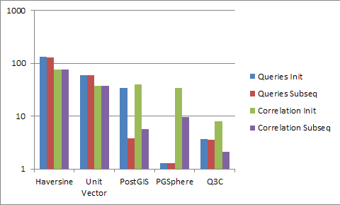

## PostgreSQL 天文插件 - pg_sphere    
             
### 作者             
digoal              
                
### 日期              
2017-02-15                                        
              
### 标签                                                                                                                              
PostgreSQL , 天文台 , pg_sphere , q3c , postgis    
            
----              
            
## 背景      
在天文或GIS领域，找出某个位置附近的对象，或者找到两张表的位置互相关的数据，是非常普遍的需求。  
  
在PostgreSQL中有很多方法可以实现以上需求。  
  
比如  
  
http://skyview.gsfc.nasa.gov/xaminblog/index.php/tag/pgsphere/  
  
- Haversine: Using the Haversine formula with tables clustered on an index in declination.  A simple constraint on declination is included to make the index useful.  
  
```  
select count(*) from swiftdec a, xmmdec b  
    where  
a.dec between b.dec - .01 and b.dec + .01 and  
( sin(radians(b.dec-a.dec)/2)^2 + cos(radians(a.dec))*cos(radians(b.dec))*sin(radians(b.ra-a.ra)/2)^2  
      <  
  sin(radians(.01)/2)^2  
)  
```  
  
- Unit Vector: Using the dot product of unit vectors with tables clustered on an index on Dec.  A simple constraint on declination is included to make the index useful.  
  
```  
select count(*) from swiftunit a, xmmunit b  
where   
   a.dec between b.dec -.01 and b.dec+.01 and  
   a.__x*b.__x + a.__y*b.__y + a.__z*b.__z > 0.999999984769129  
```  
  
- PostGIS: Using ST_DWithin with tables where a PostGIS geography object has been added representing the RA/Dec of each row.  Tables are clustered on an index using the geography object.  
  
```  
select count(*) from swiftgeog a, xmmgeog b   
where  
    st_dwithin(a.geog,b.geog,1111.950792, false)  
```  
  
- PGSphere: Using the includes operator (~) in PGSphere with tables where an spoint object has been added representing  the position of each row.  Tables are clustered on an index on the spoint object.  
  
```  
select count(*) from swiftpgs a, xmmpgs b   
where   
    scircle(a.pnt, radians(.01))~b.pnt  
```  
  
- Q3C: Using the q3c_join  function in Q3C with tables clustered on an index on the q3c_ang2ipix(ra,dec).  In this case no column was added to the table.  
  
```  
select count(*) from swiftq3c a, xmmq3c b   
where q3c_join(a.ra,a.dec,b.ra,b.dec,.01)  
```  
  
    
  
Much greater reductions are possible using specialized indices. Of the three possibilities studied, Q3C has generally good performance, running about twice as fast the the PostGIS geography type.  
  
The PGSphere library is very fast in doing point queries and but a bit slower than both Q3C and PostGIS for cross-correlations. The slight disagreement in cross-corrleation counts is a bit disconcerting but it’s possible that it is due to the kind of rounding issues we discovered in the positional queries.  
  
For correlations all of the methods using spherical indexing seem to have some startup/caching cost.  The second and subsequent iterations run about three times as fast as the first.  The implication on an operational system are unclear and presumably depend critically upon the query mix.  
  
For the positional queries PostGIS still shows strong evidence of caching, but PGSphere and Q3C do not. Note that the results for the positional queries are for an aggregate 162 queries. The averaged times for individual queries ranged from about 10-300 milliseconds.  
  
Although one should be cautious extrapolating from any small number of tests, it does appear that spatial indices substantially improve performance.  We see an improvement of somewhere between a factor of 2-15 in the time taken for queries.  
  
Either Q3C or PostGIS seem like reasonable choices. Q3C gives the better performance and has a more transparent syntax for astronomers. However PostGIS has a much broader community and far greater certainty of continued support. PGSphere’s performance in positional queries is remarkably good but the lack of clear support and variance in results in the cross-correlation are worrying.  
    
## pgSphere  
如上所述，pgSphere是一个天文相关的PostgreSQL数据库插件，包括针对天文数据新增的数据类型，操作符，函数等。      
    
      
    
1\. What is pgSphere?    
    
pgSphere is an extra module for PostgreSQL which adds spherical data types.     
    
It provides:    
    
- input and output of data    
    
- containing, overlapping, and other operators    
    
- various input and converting functions and operators    
    
- circumference and area of an object    
    
- spherical transformation    
    
- indexing of spherical data types    
    
- several input and output formats    
    
Hence, you can do a fast search and analysis for objects with spherical attributes as used in geographical, astronomical, or other applications using PostgreSQL.     
    
For instance, you can manage data of geographical objects around the world and astronomical data like star and other catalogs conveniently using an SQL interface.    
    
The aim of pgSphere is to provide uniform access to spherical data.     
    
Because PostgreSQL itself supports a lot of software interfaces, you can now use the same database with different utilities and applications.    
    
```    
3. Data types    
3.1. Overview    
3.2. Point    
3.3. Euler transformation    
3.4. Circle    
3.5. Line    
3.6. Ellipses    
3.7. Path    
3.8. Polygon    
3.9. Coordinates range    
4. Constructors    
4.1. Point    
4.2. Euler transformation    
4.3. Circle    
4.4. Line    
4.5. Ellipse    
4.6. Polygon    
4.7. Path    
4.8. Coordinates range    
5. Operators    
5.1. Casting    
5.2. Equality    
5.3. Contain and overlap    
5.4. Crossing of lines    
5.5. Distance    
5.6. Length and circumference    
5.7. Center    
5.8. Change the direction    
5.9. Turn the path of a line    
5.10. Transformation    
6. Functions    
6.1. Area function    
6.2. spoint functions    
6.3. strans functions    
6.4. scircle functions    
6.5. sellipse functions    
6.6. sline functions    
6.7. spath functions    
6.8. spoly functions    
6.9. sbox functions    
7. Create an index    
7.1. Spherical index    
8. Usage examples    
8.1. General    
8.2. Geographical    
8.3. Astronomical    
```    
    
详见手册    
    
http://pgsphere.projects.pgfoundry.org/index.html    
    
## 安装    
注意，1.1.1是老版本，现在请使用1.0，2017年开始重新拉的分支.  
  
下面的安装和下载请自行修改为  
  
https://github.com/pgsphere  
  
http://pgsphere.github.io/  
  
http://pgsphere.github.io/download.html  
  
```
Beginning of 2017 
The pgSphere development team is working towards a new release of pgSphere to replace the outdated latest release 1.1.1. 

In the meantime, we recommend using the development version that is linked on the download page. 

Watch this space or the mailing list for announcements.

https://groups.google.com/forum/#!forum/pgsphere
```  
  
https://github.com/mnullmei/pgsphere/releases    
    
```    
wget https://github.com/mnullmei/pgsphere/archive/version-1-1-1-p3.tar.gz    
    
tar -zxvf version-1-1-1-p3.tar.gz    
    
cd pgsphere-version-1-1-1-p3    
    
export PATH=/home/digoal/pgsql9.4/bin:$PATH    
    
USE_PGXS=1 make clean    
    
USE_PGXS=1 make     
    
USE_PGXS=1 make install    
    
start database and then installcheck    
    
USE_PGXS=1 make crushtest    
```    
    
可能因为浮点精度的问题，会有几个CHECK不一定能通过    
    
## 生成extension文件    
pgSphere开发比较早，所以没有打包成extension。    
    
稍作调整就可以了。    
    
```    
cd pgsphere-version-1-1-1-p3    
    
cp pg_sphere.sql pg_sphere--1.1.1.sql    
    
vi pg_sphere--1.1.1.sql    
去除begin;commit;    
    
vi pg_sphere.control    
comment = 'R-Tree implementation using GiST for spherical objects like spherical points and spherical circles with useful functions and operators.'    
default_version = '1.1.1'    
relocatable = true    
```    
    
将pg_sphere--1.1.1.sql和pg_sphere.control拷贝到$PGHOME/share/extension目录    
    
将pg_sphere.so拷贝到$PGHOME/lib目录    
    
然后就可以使用 create extension pg_sphere; 创建这个模块了    
    
修改Makefile，略。      
  
## 注意
pg_sphere，2017年开始重新拉的分支.

https://github.com/pgsphere

http://pgsphere.github.io/

http://pgsphere.github.io/download.html
    
## 参考    
http://pgsphere.projects.pgfoundry.org/index.html    
    
http://skyview.gsfc.nasa.gov/xaminblog/index.php/tag/pgsphere/    
    
https://github.com/mnullmei/pgsphere/tree/fixes-1-1-1    
  
[pg_sphere 1.1.5手册](20170215_03_pdf_001.pdf)  
    
                                            
  
  
  
  
  
  
  
  
  
  
  
  
  
  
  
  
  
  
  
  
  
  
  
  
  
  
  
  
  
  
  
  
  
  
  
  
  
  
  
  
  
  
  
  
  
  
  
  
  
  
  
  
  
  
  
  
  
  
  
  
  
  
  
  
  
  
  
  
  
  
  
  
  
#### [PostgreSQL 许愿链接](https://github.com/digoal/blog/issues/76 "269ac3d1c492e938c0191101c7238216")
您的愿望将传达给PG kernel hacker、数据库厂商等, 帮助提高数据库产品质量和功能, 说不定下一个PG版本就有您提出的功能点. 针对非常好的提议，奖励限量版PG文化衫、纪念品、贴纸、PG热门书籍等，奖品丰富，快来许愿。[开不开森](https://github.com/digoal/blog/issues/76 "269ac3d1c492e938c0191101c7238216").  
  
  
#### [9.9元购买3个月阿里云RDS PostgreSQL实例](https://www.aliyun.com/database/postgresqlactivity "57258f76c37864c6e6d23383d05714ea")
  
  
#### [PostgreSQL 解决方案集合](https://yq.aliyun.com/topic/118 "40cff096e9ed7122c512b35d8561d9c8")
  
  
#### [德哥 / digoal's github - 公益是一辈子的事.](https://github.com/digoal/blog/blob/master/README.md "22709685feb7cab07d30f30387f0a9ae")
  
  

  
  
#### [PolarDB 学习图谱: 训练营、培训认证、在线互动实验、解决方案、生态合作、写心得拿奖品](https://www.aliyun.com/database/openpolardb/activity "8642f60e04ed0c814bf9cb9677976bd4")
  
  
#### [购买PolarDB云服务折扣活动进行中, 55元起](https://www.aliyun.com/activity/new/polardb-yunparter?userCode=bsb3t4al "e0495c413bedacabb75ff1e880be465a")
  
  
#### [About 德哥](https://github.com/digoal/blog/blob/master/me/readme.md "a37735981e7704886ffd590565582dd0")
  
