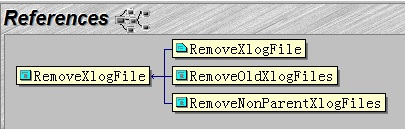

## PostgreSQL 清理redo(xlog,wal,归档)的机制 及 如何手工清理  
                       
### 作者                       
digoal                        
                          
### 日期                        
2017-02-16                                             
                        
### 标签                                                                                                                                        
PostgreSQL , redo , xlog , 归档 , wal , 清理 , pg_controldata , pg_archivecleanup    
                      
----                        
                      
## 背景                
PostgreSQL 的REDO文件被称为WAL文件或XLOG文件，在$PGDATA/pg_xlog目录中。  
  
比如  
  
```
-rw------- 1 digoal users  16M Feb 15 21:09 000000010000002C000000A2  
-rw------- 1 digoal users  16M Feb 15 21:10 000000010000002C000000A3  
-rw------- 1 digoal users  16M Feb 15 21:10 000000010000002C000000A4  
-rw------- 1 digoal users  16M Feb 15 21:08 000000010000002C000000A5  
-rw------- 1 digoal users  16M Feb 15 21:07 000000010000002C000000A6  
-rw------- 1 digoal users  16M Feb 15 20:59 000000010000002C000000A7  
-rw------- 1 digoal users  16M Feb 15 21:10 000000010000002C000000A8  
-rw------- 1 digoal users  16M Feb 15 21:00 000000010000002C000000A9  
-rw------- 1 digoal users  16M Feb 15 20:59 000000010000002C000000AA  
-rw------- 1 digoal users  16M Feb 15 21:07 000000010000002C000000AB  
-rw------- 1 digoal users  16M Feb 15 21:08 000000010000002C000000AC  
-rw------- 1 digoal users  16M Feb 15 21:11 000000010000002C000000AD  
-rw------- 1 digoal users  16M Feb 15 21:10 000000010000002C000000AE  
-rw------- 1 digoal users  16M Feb 15 21:08 000000010000002C000000AF  
-rw------- 1 digoal users  16M Feb 15 21:10 000000010000002C000000B0  
-rw------- 1 digoal users  16M Feb 15 21:09 000000010000002C000000B1  
```
  
如果开启了归档，则在archive_status目录中，会有类似000000010000002C000000B1.ready, 000000010000002C000000B1.done结尾的文件。  
  
.ready表示XLOG文件已写满，可以调用归档命令了，.done表示已归档完成。  
  
drwx------ 2 digoal users 4.0K Feb 15 10:24 archive_status  
  
那么这些文件什么时候被清理，或者被复用呢？  
  
## 相关postgresql.conf参数  
  
```  
#wal_keep_segments = 0          # in logfile segments, 16MB each; 0 disables  
#checkpoint_completion_target = 0.5     # checkpoint target duration, 0.0 - 1.0  
checkpoint_segments = 2048              # in logfile segments, min 1, 16MB each  
  
or  
  
#max_wal_size = 1GB  
#min_wal_size = 80MB  
```  
  
先说没有开启归档的情况。  
  
以上参数会影响wal文件的复用，早期的版本通过checkpoint_segments控制复用，也就是说pg_xlog目录中，最多可能保留的文件数为：  
  
```  
not be more than (2 + checkpoint_completion_target) * checkpoint_segments + 1  
  
or checkpoint_segments + wal-keep-segments + 1  
```  
  
然后说一下开启了归档的情况，开启了归档后，只有归档成功的pg_xlog文件才会被清除。  
  
## 源码分析  
1\. 清除pg_xlog中的xlog文件，调用的是RemoveXlogFile  
  
它同时会根据实际情况，清除xlog文件对应归档的.ready和.done标签文件  
  
src/backend/access/transam/xlog.c  
  
```  
/*  
 * Recycle or remove a log file that's no longer needed.  
 *  
 * endptr is current (or recent) end of xlog; this is used to determine  
 * whether we want to recycle rather than delete no-longer-wanted log files.  
 */  
static void  
RemoveXlogFile(const char *segname, XLogRecPtr endptr)  
{  
	char		path[MAXPGPATH];  
#ifdef WIN32  
	char		newpath[MAXPGPATH];  
#endif  
	struct stat statbuf;  
	XLogSegNo	endlogSegNo;  
	int			max_advance;  
  
	/*  
	 * Initialize info about where to try to recycle to.  We allow recycling  
	 * segments up to XLOGfileslop segments beyond the current XLOG location.  
	 */  
	XLByteToPrevSeg(endptr, endlogSegNo);  
	max_advance = XLOGfileslop;  
  
	snprintf(path, MAXPGPATH, XLOGDIR "/%s", segname);  
  
	/*  
	 * Before deleting the file, see if it can be recycled as a future log  
	 * segment. Only recycle normal files, pg_standby for example can create  
	 * symbolic links pointing to a separate archive directory.  
	 */  
	if (lstat(path, &statbuf) == 0 && S_ISREG(statbuf.st_mode) &&  
		InstallXLogFileSegment(&endlogSegNo, path,  
							   true, &max_advance, true))  
	{  
		ereport(DEBUG2,  
				(errmsg("recycled transaction log file \"%s\"", segname)));  
		CheckpointStats.ckpt_segs_recycled++;  
		/* Needn't recheck that slot on future iterations */  
		if (max_advance > 0)  
		{  
			endlogSegNo++;  
			max_advance--;  
		}  
	}  
	else  
	{  
		/* No need for any more future segments... */  
		int			rc;  
  
		ereport(DEBUG2,  
				(errmsg("removing transaction log file \"%s\"", segname)));  
  
#ifdef WIN32  
		/*  
		 * On Windows, if another process (e.g another backend) holds the file  
		 * open in FILE_SHARE_DELETE mode, unlink will succeed, but the file  
		 * will still show up in directory listing until the last handle is  
		 * closed. To avoid confusing the lingering deleted file for a live  
		 * WAL file that needs to be archived, rename it before deleting it.  
		 *  
		 * If another process holds the file open without FILE_SHARE_DELETE  
		 * flag, rename will fail. We'll try again at the next checkpoint.  
		 */  
		snprintf(newpath, MAXPGPATH, "%s.deleted", path);  
		if (rename(path, newpath) != 0)  
		{  
			ereport(LOG,  
					(errcode_for_file_access(),  
					 errmsg("could not rename old transaction log file \"%s\": %m",  
							path)));  
			return;  
		}  
		rc = unlink(newpath);   // 删除xlog文件  
#else    
		rc = unlink(path);      // 删除xlog文件  
#endif  
		if (rc != 0)  
		{  
			ereport(LOG,  
					(errcode_for_file_access(),  
					 errmsg("could not remove old transaction log file \"%s\": %m",  
							path)));  
			return;  
		}  
		CheckpointStats.ckpt_segs_removed++;  
	}  
  
	XLogArchiveCleanup(segname);  // 清除.ready, .done标签  
}  
```  
  
2\. 那么什么时候调用清除xlog的函数呢？  
  
启动数据库时、以及实施检查点时  
  
  
  
其中RemoveOldXlogFiles是在创建检查点（或者在standby创建restart检查点）时被调用的。  
  
RemoveNonParentXlogFiles是在启动startup进程时调用的，用于清除比当前时间线更早的xlog。  
  
  
  
3\. 清除检查点以前的XLOG文件  
  
数据库CRASH后，是从最后一次完成的检查点开始恢复的，所以只需要那次检查点开始之后的XLOG即可。  
  
这个值可以在pg_controldata中读取控制文件得到。  
  
```  
pg_controldata $PGDATA  
  
Latest checkpoint location:           1/E000028  
Prior checkpoint location:            1/D18C068  
Latest checkpoint's REDO location:    1/E000028  
Latest checkpoint's REDO WAL file:    00000001000000010000000E  
  
表示00000001000000010000000E之前的xlog文件可以删除  
```  
  
对应源码和解释  
  
```  
/*  
 * Recycle or remove all log files older or equal to passed segno.  
 *  
 * endptr is current (or recent) end of xlog; this is used to determine  
 * whether we want to recycle rather than delete no-longer-wanted log files.  
 */  
static void  
RemoveOldXlogFiles(XLogSegNo segno, XLogRecPtr endptr)  
{  
  
...  
	while ((xlde = ReadDir(xldir, XLOGDIR)) != NULL)  // 遍历pg_xlog目录  
	{  
		/* Ignore files that are not XLOG segments */  
		if (strlen(xlde->d_name) != 24 ||  
			strspn(xlde->d_name, "0123456789ABCDEF") != 24)  
			continue;  
  
		/*  
		 * We ignore the timeline part of the XLOG segment identifiers in  
		 * deciding whether a segment is still needed.  This ensures that we  
		 * won't prematurely remove a segment from a parent timeline. We could  
		 * probably be a little more proactive about removing segments of  
		 * non-parent timelines, but that would be a whole lot more  
		 * complicated.  
		 *  
		 * We use the alphanumeric sorting property of the filenames to decide  
		 * which ones are earlier than the lastoff segment.  
		 */  
		if (strcmp(xlde->d_name + 8, lastoff + 8) <= 0)  
		{  
			if (XLogArchiveCheckDone(xlde->d_name))  // 如果开启了归档，归档没有完成的xlog(有.ready 但是没有.done的文件)不会被删除。  
			{  
				/* Update the last removed location in shared memory first */  
				UpdateLastRemovedPtr(xlde->d_name);  
  
				RemoveXlogFile(xlde->d_name, endptr);  // 遍历xlog目录，删除检查点之前的xlog文件。  
			}  
		}  
	}  
  
...  
```  
  
4\. 另一个调用是启动startup进程时，自动清理当前时间线以前的XLOG文件。  
  
```  
/*  
 * This must be called ONCE during postmaster or standalone-backend startup  
 */  
void  
StartupXLOG(void)  
{  
...  
				if (switchedTLI)  
				{  
					/*  
					 * Before we go further on the new timeline, clean up any  
					 * (possibly bogus) future WAL segments on the old one.  
					 */  
					RemoveNonParentXlogFiles(EndRecPtr, ThisTimeLineID);  
  
					/*  
					 * Wake up any walsenders to notice that we are on a new  
					 * timeline.  
					 */  
					if (AllowCascadeReplication())  
						WalSndWakeup();  
				}  
  
...  
	/*  
	 * Clean up any (possibly bogus) future WAL segments on the old timeline.  
	 */  
	if (ArchiveRecoveryRequested)  
		RemoveNonParentXlogFiles(EndOfLog, ThisTimeLineID);  
```  
  
```  
/*  
 * Remove WAL files that are not part of the given timeline's history.  
 *  
 * This is called during recovery, whenever we switch to follow a new  
 * timeline, and at the end of recovery when we create a new timeline. We  
 * wouldn't otherwise care about extra WAL files lying in pg_xlog, but they  
 * can be pre-allocated or recycled WAL segments on the old timeline that we  
 * haven't used yet, and contain garbage. If we just leave them in pg_xlog,  
 * they will eventually be archived, and we can't let that happen. Files that  
 * belong to our timeline history are valid, because we have successfully  
 * replayed them, but from others we can't be sure.  
 *  
 * 'switchpoint' is the current point in WAL where we switch to new timeline,  
 * and 'newTLI' is the new timeline we switch to.  
 */  
static void  
RemoveNonParentXlogFiles(XLogRecPtr switchpoint, TimeLineID newTLI)  
{  
  
...  
	while ((xlde = ReadDir(xldir, XLOGDIR)) != NULL)  
	{  
		/* Ignore files that are not XLOG segments */  
		if (strlen(xlde->d_name) != 24 ||  
			strspn(xlde->d_name, "0123456789ABCDEF") != 24)  
			continue;  
  
		/*  
		 * Remove files that are on a timeline older than the new one we're  
		 * switching to, but with a segment number >= the first segment on  
		 * the new timeline.  
		 */  
		if (strncmp(xlde->d_name, switchseg, 8) < 0 &&  
			strcmp(xlde->d_name + 8, switchseg + 8) > 0)  
		{  
			/*  
			 * If the file has already been marked as .ready, however, don't  
			 * remove it yet. It should be OK to remove it - files that are  
			 * not part of our timeline history are not required for recovery  
			 * - but seems safer to let them be archived and removed later.  
			 */  
			if (!XLogArchiveIsReady(xlde->d_name))  
				RemoveXlogFile(xlde->d_name, switchpoint);  
		}  
	}  
  
...  
```  
  
5\. 什么时候标记.ready, .done呢？  
  
如果开启了归档，当切换xlog时，会记录.ready和.done  
  
什么时候清除.ready, .done归档标记呢？  
  
在每次归档命令被执行后，会触发清除标签的动作，在执行检查点时，也会在调用remove xlog函数时触发清除归档标签文件的动作。  
  
5\.1 清除归档标记文件，  
  
src/backend/postmaster/pgarch.c  
  
```  
/*  
 * pgarch_ArchiverCopyLoop  
 *  
 * Archives all outstanding xlogs then returns  
 */  
static void  
pgarch_ArchiverCopyLoop(void)  
{  
	char		xlog[MAX_XFN_CHARS + 1];  
  
	/*  
	 * loop through all xlogs with archive_status of .ready and archive  
	 * them...mostly we expect this to be a single file, though it is possible  
	 * some backend will add files onto the list of those that need archiving  
	 * while we are still copying earlier archives  
	 */  
	while (pgarch_readyXlog(xlog))  
	{  
		int			failures = 0;  
  
		for (;;)  
		{  
			/*  
			 * Do not initiate any more archive commands after receiving  
			 * SIGTERM, nor after the postmaster has died unexpectedly. The  
			 * first condition is to try to keep from having init SIGKILL the  
			 * command, and the second is to avoid conflicts with another  
			 * archiver spawned by a newer postmaster.  
			 */  
			if (got_SIGTERM || !PostmasterIsAlive())  
				return;  
  
			/*  
			 * Check for config update.  This is so that we'll adopt a new  
			 * setting for archive_command as soon as possible, even if there  
			 * is a backlog of files to be archived.  
			 */  
			if (got_SIGHUP)  
			{  
				got_SIGHUP = false;  
				ProcessConfigFile(PGC_SIGHUP);  
			}  
  
			/* can't do anything if no command ... */  
			if (!XLogArchiveCommandSet())   // 如果设置了archive_mod=on, 但是没有设置archive_command,则不会进行拷贝，也不会清理pg_xlog目录下的旧文件  
			{  
				ereport(WARNING,  
						(errmsg("archive_mode enabled, yet archive_command is not set")));  
				return;  
			}  
  
			if (pgarch_archiveXlog(xlog))  
			{  
				/* successful */  
				pgarch_archiveDone(xlog);   // 如果归档成功，则紧接着会清理pg_xlog目录中归档成功的文件.    
  
				/*  
				 * Tell the collector about the WAL file that we successfully  
				 * archived  
				 */  
				pgstat_send_archiver(xlog, false);  
  
				break;			/* out of inner retry loop */  
			}  
			else  
			{  
				/*  
				 * Tell the collector about the WAL file that we failed to  
				 * archive  
				 */  
				pgstat_send_archiver(xlog, true);  
  
				if (++failures >= NUM_ARCHIVE_RETRIES)  
				{  
					ereport(WARNING,  
							(errmsg("archiving transaction log file \"%s\" failed too many times, will try again later",  
									xlog)));  
					return;		/* give up archiving for now */  
				}  
				pg_usleep(1000000L);	/* wait a bit before retrying */  
			}  
		}  
	}  
}  
```  
  
src/backend/access/transam/xlogarchive.c  
  
```  
/*  
 * XLogArchiveCheckDone  
 *  
 * This is called when we are ready to delete or recycle an old XLOG segment  
 * file or backup history file.  If it is okay to delete it then return true.  
 * If it is not time to delete it, make sure a .ready file exists, and return  
 * false.  
 *  
 * If <XLOG>.done exists, then return true; else if <XLOG>.ready exists,  
 * then return false; else create <XLOG>.ready and return false.  
 *  
 * The reason we do things this way is so that if the original attempt to  
 * create <XLOG>.ready fails, we'll retry during subsequent checkpoints.  
 */  
bool  
XLogArchiveCheckDone(const char *xlog)  
{  
        char            archiveStatusPath[MAXPGPATH];  
        struct stat stat_buf;  
  
        /* Always deletable if archiving is off */  
        if (!XLogArchivingActive())  
                return true;  
  
        /* First check for .done --- this means archiver is done with it */  
        StatusFilePath(archiveStatusPath, xlog, ".done");  
        if (stat(archiveStatusPath, &stat_buf) == 0)  
                return true;  
  
        /* check for .ready --- this means archiver is still busy with it */  
        StatusFilePath(archiveStatusPath, xlog, ".ready");  
        if (stat(archiveStatusPath, &stat_buf) == 0)  
                return false;  
  
        /* Race condition --- maybe archiver just finished, so recheck */  
        StatusFilePath(archiveStatusPath, xlog, ".done");  
        if (stat(archiveStatusPath, &stat_buf) == 0)  
                return true;  
  
        /* Retry creation of the .ready file */  
        XLogArchiveNotify(xlog);  
        return false;  
}  
  
  
/*  
 * pgarch_archiveDone  
 *  
 * Emit notification that an xlog file has been successfully archived.  
 * We do this by renaming the status file from NNN.ready to NNN.done.  
 * Eventually, a checkpoint process will notice this and delete both the  
 * NNN.done file and the xlog file itself.  
 */  
static void  
pgarch_archiveDone(char *xlog)  
{  
        char            rlogready[MAXPGPATH];  
        char            rlogdone[MAXPGPATH];  
  
        StatusFilePath(rlogready, xlog, ".ready");  // 清理.ready文件  
        StatusFilePath(rlogdone, xlog, ".done");    
        (void) durable_rename(rlogready, rlogdone, WARNING);  
}  
```  
  
## 如何人为清理xlog文件  
如果你的数据库配置不当，导致xlog文件堆积的话，如何人为的处理呢？  
  
比如你配置了archive_mode=on，但是没有配置archive_command，那么xlog文件会一直堆积（xlog写完后，会写.ready，但是由于没有配置archive_command，也就是说不会触发归档命令，所以一直都不会写.done）。  
  
从而导致xlog一直不会被清理。  
  
手工清理的方法很简单，只要找到那些XLOG是可以被删除的就好了。  
  
然后使用pg_archivecleanup命令来清理  
  
1\. 读取控制文件，找到哪个文件是可以被清理的？  
  
```  
pg_controldata $PGDATA  
  
Latest checkpoint location:           1/E000028  
Prior checkpoint location:            1/D18C068  
Latest checkpoint's REDO location:    1/E000028  
Latest checkpoint's REDO WAL file:    00000001000000010000000E  
  
表示00000001000000010000000E之前的xlog文件可以删除  
```  
  
2\. 使用pg_archivecleanup清理pg_xlog目录  
  
```  
pg_archivecleanup -d $PGDATA/pg_xlog 00000001000000010000000E  
pg_archivecleanup: keep WAL file "/disk1/digoal/pgdata/pg_root1921/pg_xlog/00000001000000010000000E" and later  
pg_archivecleanup: removing file "/disk1/digoal/pgdata/pg_root1921/pg_xlog/00000001000000010000000D"  
```  
  
用法参考  
  
https://www.postgresql.org/docs/9.6/static/pgarchivecleanup.html  
  
## 参考  
https://www.postgresql.org/docs/9.6/static/pgarchivecleanup.html  
  
src/backend/access/transam/xlogarchive.c  
  
src/backend/postmaster/pgarch.c  
  
    
                                                      
  
<a rel="nofollow" href="http://info.flagcounter.com/h9V1"  ></a>  
  
  
  
  
  
  
## [digoal's 大量PostgreSQL文章入口](https://github.com/digoal/blog/blob/master/README.md "22709685feb7cab07d30f30387f0a9ae")
  
