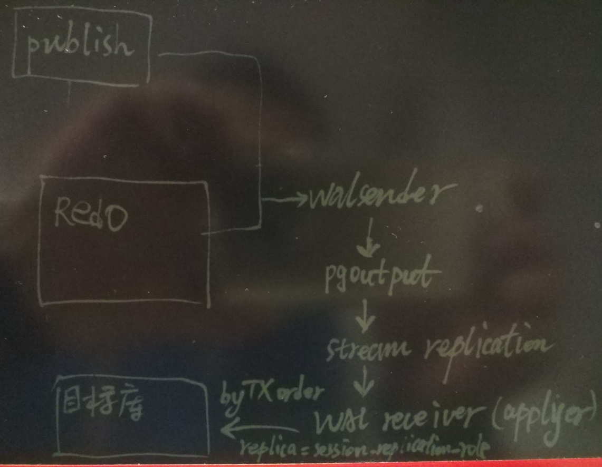

## PostgreSQL 10.0 preview 逻辑订阅 - 原理与最佳实践  
##### [TAG 13](../class/13.md) , [TAG 24](../class/24.md)
            
### 作者            
digoal            
            
### 日期            
2016-02-27            
            
### 标签            
PostgreSQL , logical replication , 逻辑复制 , 最佳实践     
            
----            
            
## 背景       
PostgreSQL 从2010年发布的9.0开始支持流式物理复制，从此备库可以作为只读库打开（使用的同时不堵塞实时流式恢复(自带冲突检测和处理机制)），提供给用户只读使用。  
  
从2014年发布的9.4开始，PostgreSQL具备了流式逻辑复制的能力，有很多第三方的插件可以选择，2017年，不再需要这些插件了，因为PG已经把逻辑复制的功能加入了10的内核。    
  
### 物理复制的好处  
1\. 物理层面完全一致，这是许多商业数据库的惯用手段。例如Oracle的DG。  
  
2\. 延迟低，事务执行过程中产生REDO record，实时的在备库apply，事务结束时，备库立马能见到数据。不论事务多大，都一样。  
  
3\. 物理复制的一致性、可靠性达到了金融级的需求，不必担心数据逻辑层面不一致。  
  
但是物理复制要求主备块级完全一致，所以有一些无法覆盖的应用场景，例如备库不仅要只读，还要可写。又比如备库不需要完全和主库一致，只需要复制部分数据，或者备库要从多个数据源复制数据，等等。  
  
### 物理复制无法覆盖的场景  
1\. 数据库实例的部分，例如单个数据库或者某些表的复制需求。  
  
例如某个游戏业务，账号体系是一套数据库，如果全国各地有多个接入点，全部都连到中心数据库进行认证可能不太科学。那么就希望将登陆需要用到的一些数据表同步到多个数据中心，而不是整个数据库实例。  
  
2\. 数据到达subcriber后，针对不同数据，设置触发器。  
  
3\. 将多个数据库实例的数据，同步到一个目标数据库。  
  
例如多个数据库同步到一个大的数据仓库。  
  
4\. 在不同的数据库版本之间，复制数据。  
  
5\. 将一个数据库实例的不同数据，复制到不同的目标库。  
  
例如省级数据库的数据，按地区划分，分别复制到不同的地区。  
  
6\. 在多个数据库实例之间，共享部分数据。  
  
例如某个业务按用户ID哈希，拆分成了8个数据库，但是有些小的维度表，需要在多个数据库之间共享。  
  
以上场景是物理复制无法覆盖的。  
  
逻辑复制应运而生，实际上，从2014年发布的9.4版本开始，PostgreSQL就支持逻辑复制了，只是一直没有将其引入内核。  
  
2017年即将发布的10.0，将会在内核层面支持基于REDO流的逻辑复制。  
  
另一个好消息是，你可以针对同一个数据库实例，同时使用逻辑复制和物理复制，因为他们都是基于REDO的。  
  
下面我们来看一下逻辑复制的概念、架构、监控、安全、最佳实践。  
  
## 逻辑复制概念  
PostgreSQL 逻辑复制是事务级别的复制，引入了几个概念  
  
### publication - 发布者  
发布者指数据上游节点，你需要将哪些表发布出去？  
  
上游节点需要配置这些东西  
  
1\. 需要将数据库的REDO的wal_level配置为logical。(support minimal, replica, or logical)    
  
2\. 需要发布逻辑复制的表，必须配置表的REPLICA IDENTITY，即如何标示老的记录。  
  
被复制的表，建议有PK约束。  
  
```  
alter table table_name  
    REPLICA IDENTITY { DEFAULT | USING INDEX index_name | FULL | NOTHING }  
```  
  
解释  
  
```  
REPLICA IDENTITY  
  
This form changes the information which is written to the write-ahead log to identify rows which are updated or deleted.   
  
This option has no effect except when logical replication is in use.   
  
记录PK列的  
1. DEFAULT (the default for non-system tables) records the old values of the columns of the primary key, if any.   
  
记录指定索引列（索引的所有列须是not null列，其实和PK一样，但是某些情况下，你可以选一个比PK更小的UK）  
2. USING INDEX records the old values of the columns covered by the named index, which must be unique, not partial, not deferrable, and include only columns marked NOT NULL.   
  
记录完整记录  
3. FULL records the old values of all columns in the row.   
  
啥也不记录，这样做是否不支持update, delete?   
系统表，默认为replica identity nothing啥也不记录。
4. NOTHING records no information about the old row (This is the default for system tables.)   
  
仅仅当数据有变更时才会记录old value，比如delete。 或者update前后old.*<>new.*。      
In all cases, no old values are logged unless at least one of the columns that would be logged differs between the old and new versions of the row.  
```  
  
test decoding 观察变化量  
  
```
postgres=# select pg_create_logical_replication_slot('abc','test_decoding');
 pg_create_logical_replication_slot 
------------------------------------
 (abc,3A/28CAB200)
(1 row)

postgres=# create table tbl_sys_nonkey (id int, info text);
CREATE TABLE
postgres=# insert into tbl_sys_nonkey values (1,'test');
INSERT 0 1
postgres=# update tbl_sys_nonkey set info='test123' where id=1;
UPDATE 1
postgres=# delete from tbl_sys_nonkey;
DELETE 1
postgres=# SELECT * FROM pg_logical_slot_get_changes('abc', NULL, NULL, 'include-xids', '0');
     lsn     |    xid    |                                  data                                   
-------------+-----------+-------------------------------------------------------------------------
 3A/28CBA668 | 210387691 | BEGIN
 3A/28CBE198 | 210387691 | COMMIT
 3A/28CBE1D0 | 210387692 | BEGIN
 3A/28CBE1D0 | 210387692 | table public.tbl_sys_nonkey: INSERT: id[integer]:1 info[text]:'test'
 3A/28CBE240 | 210387692 | COMMIT
 3A/28CBE278 | 210387693 | BEGIN
 3A/28CBE278 | 210387693 | table public.tbl_sys_nonkey: UPDATE: id[integer]:1 info[text]:'test123'
 3A/28CBE2F8 | 210387693 | COMMIT
 3A/28CBE330 | 210387694 | BEGIN
 3A/28CBE330 | 210387694 | table public.tbl_sys_nonkey: DELETE: (no-tuple-data) -- 未记录old key
 3A/28CBE398 | 210387694 | COMMIT
(11 rows)

postgres=# drop table tbl_sys_nonkey ;
DROP TABLE
postgres=# create table tbl_sys_nonkey (id int, info text) with (user_catalog_table=true);;
CREATE TABLE
postgres=# insert into tbl_sys_nonkey values (1,'test');
INSERT 0 1
postgres=# update tbl_sys_nonkey set info='test123' where id=1;
UPDATE 1
postgres=# delete from tbl_sys_nonkey;
DELETE 1
postgres=# SELECT * FROM pg_logical_slot_get_changes('abc', NULL, NULL, 'include-xids', '0');
     lsn     |    xid    |                                  data                                   
-------------+-----------+-------------------------------------------------------------------------
 3A/28CBE3D0 | 210387695 | BEGIN
 3A/28CBF808 | 210387695 | COMMIT
 3A/28CBF870 | 210387696 | BEGIN
 3A/28CC30C0 | 210387696 | COMMIT
 3A/28CC30C0 | 210387697 | BEGIN
 3A/28CC3100 | 210387697 | table public.tbl_sys_nonkey: INSERT: id[integer]:1 info[text]:'test'
 3A/28CC3170 | 210387697 | COMMIT
 3A/28CC3170 | 210387698 | BEGIN
 3A/28CC31F0 | 210387698 | table public.tbl_sys_nonkey: UPDATE: id[integer]:1 info[text]:'test123'
 3A/28CC3270 | 210387698 | COMMIT
 3A/28CC3270 | 210387699 | BEGIN
 3A/28CC32B0 | 210387699 | table public.tbl_sys_nonkey: DELETE: (no-tuple-data)  -- 未记录old key
 3A/28CC3318 | 210387699 | COMMIT
(13 rows)

postgres=# alter table tbl_sys_nonkey replica identity full;
ALTER TABLE
postgres=# insert into tbl_sys_nonkey values (1,'test');
INSERT 0 1
postgres=# update tbl_sys_nonkey set info='test123' where id=1;
UPDATE 1
postgres=# delete from tbl_sys_nonkey;
DELETE 1
postgres=# SELECT * FROM pg_logical_slot_get_changes('abc', NULL, NULL, 'include-xids', '0');
     lsn     |    xid    |                                                            data                                                             
-------------+-----------+-----------------------------------------------------------------------------------------------------------------------------
 3A/28CC3430 | 210387700 | BEGIN
 3A/28CC3598 | 210387700 | COMMIT
 3A/28CC35D0 | 210387701 | BEGIN
 3A/28CC3610 | 210387701 | table public.tbl_sys_nonkey: INSERT: id[integer]:1 info[text]:'test'
 3A/28CC3680 | 210387701 | COMMIT
 3A/28CC3680 | 210387702 | BEGIN
 3A/28CC3700 | 210387702 | table public.tbl_sys_nonkey: UPDATE: old-key: id[integer]:1 info[text]:'test' new-tuple: id[integer]:1 info[text]:'test123'
 3A/28CC3790 | 210387702 | COMMIT
 3A/28CC3790 | 210387703 | BEGIN
 3A/28CC37D0 | 210387703 | table public.tbl_sys_nonkey: DELETE: id[integer]:1 info[text]:'test123'  -- 记录了old key
 3A/28CC3848 | 210387703 | COMMIT
(11 rows)
```
   
如果你要让逻辑复制的表支持insert,update,delete操作，建议必须有primary KEY，如果没有primary KEY，则需要配置 replica identity full，（当然这个性能会很差很差，因为回放和DML都会很慢，并且存在不一致的风险（例如使用物理行号更新了重复行的其中一行，在订阅端这些重复行会被全部更新，导致不一致））。   
  
关于user_catalog_table，主要目的是让WAL记录CID (比事务更细粒度的ID，一个事务中的一条SQL被给予一个顺序ID) ，以便将来可以回放出被设置为user_catalog_table的表的过去的任意一个状态(即使在同一个事务快照中，也能回放出他的不同状态)。     
  
https://git.postgresql.org/gitweb/?p=postgresql.git;a=commit;h=66abc2608c7c00fcd449e00a9e23f13f02e65d04   
  
```
Add a new reloption, user_catalog_table.

When this reloption is set and wal_level=logical is configured,
we'll record the CIDs stamped by inserts, updates, and deletes to
the table just as we would for an actual catalog table.  This will
allow logical decoding to use historical MVCC snapshots to access
such tables just as they access ordinary catalog tables.

Replication solutions built around the logical decoding machinery
will likely need to set this operation for their configuration
tables; it might also be needed by extensions which perform table
access in their output functions.

Andres Freund, reviewed by myself and others.
```
    
```
postgres=# begin;
BEGIN
postgres=# insert into another_catalog_table values ('1');
INSERT 0 1
postgres=# insert into another_catalog_table values ('1');
INSERT 0 1
postgres=# select ctid,cmin,cmax,* from another_catalog_table ;
  ctid  | cmin | cmax | data 
--------+------+------+------
 (0,11) |    0 |    0 | 1
 (0,12) |    1 |    1 | 1
(2 rows)

postgres=# insert into another_catalog_table values ('1');
INSERT 0 1
postgres=# select ctid,cmin,cmax,* from another_catalog_table ;
  ctid  | cmin | cmax | data 
--------+------+------+------
 (0,11) |    0 |    0 | 1
 (0,12) |    1 |    1 | 1
 (0,13) |    2 |    2 | 1
(3 rows)

postgres=# select ctid,cmin,cmax,xmin,xmax,* from another_catalog_table ;
  ctid  | cmin | cmax |   xmin    | xmax | data 
--------+------+------+-----------+------+------
 (0,11) |    0 |    0 | 210387706 |    0 | 1
 (0,12) |    1 |    1 | 210387706 |    0 | 1
 (0,13) |    2 |    2 | 210387706 |    0 | 1
(3 rows)
```
  
同时被设置为user_catalog_table的表，不允许query rewrite.   
  
https://git.postgresql.org/gitweb/?p=postgresql.git;a=blobdiff;f=src/backend/commands/tablecmds.c;h=b9cd88d57015416066c7f3db70d9c681708426ff;hp=1d9f29a7b7c18742cc3c2639e20c4ba4bd0763fe;hb=66abc2608c7c00fcd449e00a9e23f13f02e65d04;hpb=e55704d8b2fe522fbc9435acbb5bc59033478bd5  
  
```
postgres=# alter table another_catalog_table add column info text default 'abc';
ERROR:  0A000: cannot rewrite table "another_catalog_table" used as a catalog table
LOCATION:  ATRewriteTables, tablecmds.c:4154
```
     
3\. output plugin  
  
发布者还需要一个output plugin，将redo按发布的定义，解析成需要的格式，等待订阅者的订阅。  
  
https://www.postgresql.org/docs/devel/static/logicaldecoding-output-plugin.html  
  
是不是有点像这个呢？  
  
[《PostgreSQL 闪回 - flash back query emulate by trigger》](../201408/20140828_01.md)  
  
#### 发布语法  
创建发布  
  
```  
Command:     CREATE PUBLICATION
Description: define a new publication
Syntax:
CREATE PUBLICATION name
    [ FOR TABLE [ ONLY ] table_name [ * ] [, ...]
      | FOR ALL TABLES ]
    [ WITH ( publication_parameter [= value] [, ... ] ) ]

publication_parameter:
  publish (string)

value: 
  'insert, update, delete'
   
例子

           CREATE PUBLICATION insert_only FOR TABLE mydata
               WITH (publish = 'insert');

默认发布insert,update,delete。  
```  
  
修改发布  
  
```  
Command:     ALTER PUBLICATION
Description: change the definition of a publication
Syntax:
ALTER PUBLICATION name ADD TABLE [ ONLY ] table_name [ * ] [, ...]
ALTER PUBLICATION name SET TABLE [ ONLY ] table_name [ * ] [, ...]
ALTER PUBLICATION name DROP TABLE [ ONLY ] table_name [ * ] [, ...]
ALTER PUBLICATION name SET ( publication_parameter [= value] [, ... ] )
ALTER PUBLICATION name OWNER TO { new_owner | CURRENT_USER | SESSION_USER }
ALTER PUBLICATION name RENAME TO new_name
```  
  
#### 发布者小结  
1\. 目前仅仅支持发布表，不允许发布其他对象。  
  
2\. 同一张表，可以发布多次。  
  
3\. 在同一个数据库中，可以创建多个publication，但是不能重名，通过系统表查看已创建的publication  
  
```  
postgres=# \d pg_publication  
            Table "pg_catalog.pg_publication"  
    Column    |  Type   | Collation | Nullable | Default   
--------------+---------+-----------+----------+---------  
 pubname      | name    |           | not null |   
 pubowner     | oid     |           | not null |   
 puballtables | boolean |           | not null |   
 pubinsert    | boolean |           | not null |   
 pubupdate    | boolean |           | not null |   
 pubdelete    | boolean |           | not null |   
Indexes:  
    "pg_publication_oid_index" UNIQUE, btree (oid)  
    "pg_publication_pubname_index" UNIQUE, btree (pubname)  
```  
  
4\. 允许使用all tables发布所有表。  
  
5\. 一个publication允许有多个订阅者。  
  
6\. 目前publication仅支持insert, update, delete。  
  
7\. 允许发布时，选择发布insert、update、delete，比如只发布insert，而不发布update, delete。  
  
8\. 当发布了表的update, delete时，表必须设置replica identity，即如何标示OLD TUPLE，通过pk或者uk或者full。如果设置了nothing，则执行update,delete时会报错  
  
```  
alter table table_name  
    REPLICA IDENTITY { DEFAULT | USING INDEX index_name | FULL | NOTHING }  
```  
  
报错例子  
  
```  
postgres=# delete from c;  
ERROR:  cannot delete from table "c" because it does not have replica identity and publishes deletes  
HINT:  To enable deleting from the table, set REPLICA IDENTITY using ALTER TABLE.  
```  
  
9\. create publication或者alter publication，发布或者修改发布内容中添加或者删除表时，都是事务级别，不会出现复制了部分事务的情况。 so the table will start or stop replicating at the correct snapshot once the transaction has committed。  
  
10\. 发布者需要设置wal_level=logical，同时开启足够的worker，设置足够大的replication slot，设置足够多的sender。  
  
因为每一个订阅，都要消耗掉一个replication slot，需要消耗一个wal sender，一个worker进程。  
  
发布者的pg_hba.conf需要设置replication条目，允许订阅者连接。(更正：逻辑订阅不需要,请普通设置)    
  
[《PostgreSQL 10.0 preview 变化 - 逻辑复制pg_hba.conf变化,不再使用replication条目》](../201704/20170405_02.md)  
  
发布者的数据库中，必须有replication角色的用户，或者超级用户，并且订阅者要使用它通过流复制协议连接到发布者。  
  
### subscription - 订阅者  
订阅者，需要指定发布者的连接信息，以及 publication name，同时指定需要在publication数据库中创建的slot name。  
  
在同一个数据库中，可以创建多个订阅。  
  
订阅者和发布者的角色可以同时出现在同一个实例的同一个数据库中。  
   
注意，订阅者一样需要设置：   
  
```
max_replication_slots

max_logical_replication_workers

max_worker_processes
```
  
The subscriber also requires the max_replication_slots to be set.    
  
In this case it should be set to at least the number of subscriptions that will be added to the subscriber.    
   
max_logical_replication_workers must be set to at least the number of subscriptions, again plus some reserve for the table synchronization.    
   
Additionally the max_worker_processes may need to be adjusted to accommodate for replication workers,    
  
at least (max_logical_replication_workers + 1).    
  
Note that some extensions and parallel queries also take worker slots from max_worker_processes.   
    
#### 订阅语法  
创建订阅  
  
```  
Command:     CREATE SUBSCRIPTION
Description: define a new subscription
Syntax:
CREATE SUBSCRIPTION subscription_name
    CONNECTION 'conninfo'
    PUBLICATION publication_name [, ...]
    [ WITH ( subscription_parameter [= value] [, ... ] ) ]

       WITH ( subscription_parameter [= value] [, ... ] )
           This clause specifies optional parameters for a subscription. 
           
           The following parameters are supported:

           copy_data (boolean)
               Specifies whether the existing data in the publications that are being subscribed to should be copied once the replication starts. 
               The default is true.

           create_slot (boolean)
               Specifies whether the command should create the replication slot on the publisher. 
               The default is true.

           enabled (boolean)
               Specifies whether the subscription should be actively replicating, or whether it should be just setup but not started yet. 
               The default is true.

           slot_name (string)
               Name of the replication slot to use. 
               The default behavior is to use the name of the subscription for the slot name.

               When slot_name is set to NONE, there will be no replication slot associated with the subscription. 
               This can be used if the replication slot will be created later manually. 
               Such subscriptions must also have both enabled and create_slot set to false.

           synchronous_commit (enum)
               The value of this parameter overrides the synchronous_commit setting. 
               The default value is off.

               It is safe to use off for logical replication: 
               If the subscriber loses transactions because of missing synchronization, the data will be resent from the publisher.

               A different setting might be appropriate when doing synchronous logical replication. 
               The logical replication workers report the positions of writes and flushes to the publisher, 
               and when using synchronous replication, the publisher will wait for the actual flush. 
               This means that setting synchronous_commit for the subscriber to off when the subscription is used for synchronous 
               replication might increase the latency for COMMIT on the publisher. 
               In this scenario, it can be advantageous to set synchronous_commit to local or higher.

           connect (boolean)
               Specifies whether the CREATE SUBSCRIPTION should connect to the publisher at all. 
               Setting this to false will change default values of enabled, create_slot and copy_data to false.

               It is not allowed to combine connect set to false and enabled, create_slot, or copy_data set to true.

               Since no connection is made when this option is set to false, the tables are not subscribed, 
               and so after you enable the subscription nothing will be replicated. 
               It is required to run ALTER SUBSCRIPTION ... REFRESH PUBLICATION in order for tables to be subscribed.
```  
  
修改订阅  
  
```  
Command:     ALTER SUBSCRIPTION
Description: change the definition of a subscription
Syntax:
ALTER SUBSCRIPTION name CONNECTION 'conninfo'
ALTER SUBSCRIPTION name SET PUBLICATION publication_name [, ...] [ WITH ( set_publication_option [= value] [, ... ] ) ]
ALTER SUBSCRIPTION name REFRESH PUBLICATION [ WITH ( refresh_option [= value] [, ... ] ) ]
ALTER SUBSCRIPTION name ENABLE
ALTER SUBSCRIPTION name DISABLE
ALTER SUBSCRIPTION name SET ( subscription_parameter [= value] [, ... ] )
ALTER SUBSCRIPTION name OWNER TO { new_owner | CURRENT_USER | SESSION_USER }
ALTER SUBSCRIPTION name RENAME TO new_name
```  
  
#### 订阅者小结  
1\. 订阅者需要通过流复制协议连接到发布者，同时需要在发布者创建replication slot。  
  
因此发布者的pg_hba.conf中需要配置相应的replication条目，允许订阅者通过流复制协议连接。(更正：逻辑订阅不需要，请使用普通设置)    
  
[《PostgreSQL 10.0 preview 变化 - 逻辑复制pg_hba.conf变化,不再使用replication条目》](../201704/20170405_02.md)  
  
同时连接发布者的用户，必须具备replication权限，或者具备超级用户权限。  
  
2\. 同一个数据库中，可以创建多个subscription，这些subscription可以连自一个或多个发布者。  
  
3\. 当同一个数据库中有多个subscription时，如果这些subscriptions是来自同一个发布者，那么他们之间发布的表不能重叠。  
  
也就是说，订阅者的同一张表，不能接受来自同一个源的多个发布。  
  
例如  
  
发布者  
  
```  
create table public.a (id int primary key, info text);  
  
create publication pub1 for table a;  
  
create publication pub2 for table a;  
```  
  
订阅者  
  
A表接受了同一个源的多次发布，会报错。  
  
```  
create table public.a (id int primary key, info text);  
  
create subscription sub1 connection 'hostaddr=127.0.0.1 port=1922 user=postgres dbname=postgres' publication pub1;  
  
create subscription sub2 connection 'hostaddr=127.0.0.1 port=1922 user=postgres dbname=postgres' publication pub2;  
```  
  
4\. 每一个订阅，都需要在发布端创建一个slot，可以使用slot name = ?指定，或者默认为subscription name。  
  
即使是同一个发布端，只要订阅了多次，就需要创建多个SLOT，因为slot中记录了同步的LSN信息。  
  
例如  
  
```  
create table public.a (id int primary key, info text);  
create table public.b (id int primary key, info text);  
  
create publication pub1 for table a;  
  
create publication pub2 for table b;  
```  
  
订阅者  
  
```  
create table public.a (id int primary key, info text);  
create table public.b (id int primary key, info text);  
  
create subscription sub1 connection 'hostaddr=127.0.0.1 port=1922 user=postgres dbname=postgres' publication pub1;  
  
create subscription sub2 connection 'hostaddr=127.0.0.1 port=1922 user=postgres dbname=postgres' publication pub2;  
```  
  
这种情况，对于这个订阅者，建议合并成一个，例如  
  
```  
create subscription sub1 connection 'hostaddr=127.0.0.1 port=1922 user=postgres dbname=postgres' publication pub1, pub2;  
```  
  
5\. pg_dump导出数据库逻辑数据时，默认不会导出subscription的定义，除非使用选项 --include-subscriptions  
  
6\. 在创建subscription或者alter subscription时，可以使用enable来启用该订阅，或者使用disable暂停该订阅。  
  
7\. 如果要完全删除订阅，使用drop subscription，注意，删除订阅后，本地的表不会被删除，数据也不会清除，仅仅是不在接收该订阅的上游信息。  
  
这个也很好理解，因为同一个表可能接收多个订阅。删订阅和删表是两码事。  
  
8\. 删除订阅后，如果要重新使用该订阅，数据需要resync，比如订阅的上游节点有100万数据，resync会将这100万数据同步过来。随后进入增量同步。  
  
将来10.0正式发布时，也许会提供一个选项，选择要不要resync。  
  
(目前来说，一次订阅，意味着这些被订阅的表会和发布端一模一样（只要发布端发布了insert,update,delete语句）。如果发布端只发布了insert，那么源表的update和delete不会被订阅)  
  
9\. 订阅时，不会自动创建发布端的表，所以表需要在订阅端先创建好。  
  
将来10.0正式发布时，也许会填补这个功能。  
  
目前发布端和订阅端的表定义必须完全一致，包括  
  
schema，表名必须一致。  
  
字段名和字段类型必须一致。  
  
字段顺序可以不一致。  
  
除了表，其他对象都不能被订阅，例如你不能将表订阅到一张视图中。  
  
10\. 必须使用超级用户创建订阅  
  
### 逻辑复制的冲突  
逻辑复制，本质上是事务层级的复制，需要在订阅端执行SQL。  
  
如果订阅端执行SQL失败（或者说引发了任何错误，包括约束等），都会导致该订阅暂停。  
  
注意，update, delete没有匹配的记录时，不会报错，也不会导致订阅暂停。  
  
用户可以在订阅端数据库日志中查看错误原因。  
  
#### 冲突修复方法  
1\. 通过修改订阅端的数据，解决冲突。例如insert违反了唯一约束时，可以删除订阅端造成唯一约束冲突的记录先DELETE掉。然后使用ALTER SUBSCRIPTION name ENABLE让订阅继续。  
  
2\. 在订阅端调用pg_replication_origin_advance(node_name text, pos pg_lsn)函数，node_name就是subscription name，pos指重新开始的LSN，从而跳过有冲突的事务。  
  
```  
pg_replication_origin_advance(node_name text, pos pg_lsn)         
  
Set replication progress for the given node to the given position.   
  
This primarily is useful for setting up the initial position or a new position after configuration changes and similar.   
  
Be aware that careless use of this function can lead to inconsistently replicated data.  
```  
  
当前的lsn通过pg_replication_origin_status.remote_lsn查看。  
  
https://www.postgresql.org/docs/devel/static/view-pg-replication-origin-status.html  
  
## 逻辑复制架构  
  
  
  
  
1\. 在创建subscription后，订阅者会在发布端创建一个快照，同时将发布端的数据，在同一个快照内的视角，发送给订阅端。  
  
例如订阅了发布端的A,B,C三张表，那么这三张表的当前快照下的数据，会发送给订阅端。  
  
2\. 订阅端接收完快照后，发布端会从快照的这个LSN开始，从WAL（REDO）日志中，根据发布定义的表以及过滤条件（INSERT\UPDATE\DELETE），按事务组装复制的消息包，通过流复制协议发送给订阅端的apply（wal receiver）进程。  
  
3\. 订阅端接收到消息包之后，对于同一个订阅(wal reciever或applyer进程)来说，会按照事务的先后顺序，按事务apply。所以在订阅端，apply也是事务一致的。   
  
将来可能会考虑组复制，提高并发性。  
  
PS  
  
其实你可以把不同的表分别放在不同的订阅中，这样就是并行的了。但是消耗的wal sender进程与连接会多一些。  
  
4\. 在订阅端，wal receiver(applyer)的session_replication_role会设置为replica。  
  
这个影响数据库的trigger和rule。  
  
参考  
  
[《PostgreSQL trigger/rule based replication configure, DISABLE/ENABLE [ REPLICA | ALWAYS ] TRIGGER | RULE》](../201506/20150615_01.md)  
  
[《Can session_replication_role used like MySQL's BlackHole Engine?》](../201102/20110209_01.md)  
  
## 逻辑复制的监控  
逻辑复制依旧使用的是2010年推出的流复制协议，所以监控手段差别不大。  
  
订阅端视图pg_stat_subscription  
  
```  
                      View "pg_catalog.pg_stat_subscription"  
        Column         |           Type           | Collation | Nullable | Default   
-----------------------+--------------------------+-----------+----------+---------  
 subid                 | oid                      |           |          |   
 subname               | name                     |           |          |   
 pid                   | integer                  |           |          |   
 received_lsn          | pg_lsn                   |           |          |   
 last_msg_send_time    | timestamp with time zone |           |          |   
 last_msg_receipt_time | timestamp with time zone |           |          |   
 latest_end_lsn        | pg_lsn                   |           |          |   
 latest_end_time       | timestamp with time zone |           |          |   
```  
  
每一个subcription有一条记录，一个订阅可能有多个active subscription workers。  
  
对于一个已激活(enabled)的订阅，对应有1个apply进程，所以在这个视图中有一条记录。  
  
一个暂停或者crash的订阅，在这个视图中不会有记录。  
  
## 逻辑复制安全、权限  
发布端  
  
1\. 必须设置pg_hba.conf，允许订阅端通过流复制连接发布端(更正：逻辑订阅不需要，请使用普通设置)    
  
[《PostgreSQL 10.0 preview 变化 - 逻辑复制pg_hba.conf变化,不再使用replication条目》](../201704/20170405_02.md)  
  
2\. wal_level必须设置为logical，记录逻辑复制的一些额外信息  
  
3\. 订阅端配置的conninfo中，发布端的角色必须具备replication权限，或者超级用户权限  
  
4\. 使用某个用户在某个数据库中创建publication，这个用户必须对该数据库具备create权限。  
  
订阅端  
  
1\. 订阅端创建subscription的用户，必须是超级用户  
  
权限检测仅仅在连接发布端的时候，后期不会检测，比如从发布端获取数据，或者apply数据时，不再检测是否为超级用户。  
  
## 逻辑复制的postgresql.conf配置  
发布端  
  
1\. wal_level=logical  
  
2\. max_replication_slots，每一个订阅需要消耗一个slot，每一个指定了slot的流式物理复制也要消耗一个slot。  
  
3\. max_wal_senders，每一个slot要使用一个wal sender，每一个流式物理复制也要使用一个wal sender。  
  
4\. max_worker_processes，必须大于等于max_wal_senders加并行计算进程，或者其他插件需要fork的进程数。  
  
订阅端  
  
1\. max_replication_slots，大于等于该实例总共需要创建的订阅数  
  
2\. max_logical_replication_workers，大于等于该实例总共需要创建的订阅数  
  
3\. max_worker_processes，  大于等于max_logical_replication_workers + 1 + CPU并行计算 + 其他插件需要fork的进程数.  
  
## 逻辑复制最佳实践case  
1\. 部署PostgreSQL 10.0  
  
```  
wget https://ftp.postgresql.org/pub/snapshot/dev/postgresql-snapshot.tar.bz2  
  
tar -jxvf postgresql-snapshot.tar.bz2  
  
cd postgresql-10devel  
  
export USE_NAMED_POSIX_SEMAPHORES=1  
LIBS=-lpthread CC="/home/digoal/gcc6.2.0/bin/gcc" CFLAGS="-O3 -flto" ./configure --prefix=/home/digoal/pgsql10  
LIBS=-lpthread CC="/home/digoal/gcc6.2.0/bin/gcc" CFLAGS="-O3 -flto" make world -j 64  
LIBS=-lpthread CC="/home/digoal/gcc6.2.0/bin/gcc" CFLAGS="-O3 -flto" make install-world  
```  
  
2\. 规划数据目录  
  
```  
mkdir /disk1/digoal/pgdata/pg_root1922  
```  
  
3\. 配置环境变量  
  
```  
vi env_pg10.sh   
export PS1="$USER@`/bin/hostname -s`-> "  
export PGPORT=1922  
export PGDATA=/disk1/digoal/pgdata/pg_root1922  
export LANG=en_US.utf8  
export PGHOME=/home/digoal/pgsql10  
export LD_LIBRARY_PATH=/home/digoal/python2.7.12/lib:/home/digoal/gcc6.2.0/lib64:$PGHOME/lib:/lib64:/usr/lib64:/usr/local/lib64:/lib:/usr/lib:/usr/local/lib:$LD_LIBRARY_PATH  
export LD_RUN_PATH=$LD_LIBRARY_PATH  
export DATE=`date +"%Y%m%d%H%M"`  
export PATH=/home/digoal/python2.7.12/bin:/home/digoal/gcc6.2.0/bin:$PGHOME/bin:$PATH:.  
export MANPATH=$PGHOME/share/man:$MANPATH  
export PGHOST=$PGDATA  
export PGUSER=postgres  
export PGDATABASE=postgres  
alias rm='rm -i'  
alias ll='ls -lh'  
unalias vi  
```  
  
4\. 初始化数据库  
  
```  
initdb -D $PGDATA -U postgres -E SQL_ASCII --locale=C  
```  
  
5\. 配置postgresql.conf  
  
```  
listen_addresses = '0.0.0.0'  
port = 1922  
max_connections = 1000  
superuser_reserved_connections = 3  
unix_socket_directories = '.'  
shared_buffers = 32GB  
maintenance_work_mem = 2GB  
autovacuum_work_mem = 2GB  
dynamic_shared_memory_type = posix  
vacuum_cost_delay = 0  
bgwriter_delay = 10ms  
bgwriter_lru_maxpages = 1000  
bgwriter_lru_multiplier = 10.0  
bgwriter_flush_after = 0  
max_worker_processes = 128  
max_parallel_workers_per_gather = 8  
max_parallel_workers = 32             
max_logical_replication_workers = 32  
backend_flush_after = 0  
wal_level = logical  
synchronous_commit = off  
full_page_writes = off  
wal_buffers = 2047MB  
wal_writer_delay = 10ms  
wal_writer_flush_after = 0  
checkpoint_timeout = 55min  
max_wal_size = 64GB  
min_wal_size = 32GB  
checkpoint_completion_target = 0.05  
checkpoint_flush_after = 0  
max_wal_senders = 48  
max_replication_slots = 32  
random_page_cost = 1.5  
parallel_tuple_cost = 0  
parallel_setup_cost = 0  
min_parallel_table_scan_size = 8MB  
min_parallel_index_scan_size = 512kB  
effective_cache_size = 512GB  
wal_receiver_status_interval = 1s  
hot_standby_feedback = off  
log_destination = 'csvlog'  
logging_collector = on  
log_truncate_on_rotation = on  
log_checkpoints = on  
log_connections = on  
log_disconnections = on  
log_error_verbosity = verbose    
log_timezone = 'PRC'  
log_autovacuum_min_duration = 0  
autovacuum_naptime = 20s  
autovacuum_vacuum_scale_factor = 0.01  
autovacuum_analyze_scale_factor = 0.05  
autovacuum_vacuum_cost_delay = 0  
datestyle = 'iso, mdy'  
timezone = 'PRC'  
lc_messages = 'C'  
lc_monetary = 'C'  
lc_numeric = 'C'  
lc_time = 'C'  
default_text_search_config = 'pg_catalog.english'  
```  
  
6\. 配置pg_hba.conf  
  
```  
host    replication     postgres        127.0.0.1/32            trust  
host    replication     postgres        ::1/128                 trust  
host all all 0.0.0.0/0 md5  
host replication postgres 0.0.0.0/0 md5  
```  
  
7\. 配置发布端  
  
```  
postgres=# create database src with template template0 ;  
CREATE DATABASE  
src=# create table public.t1(id int primary key, info text, crt_time timestamp);  
CREATE TABLE  
  
src=# create publication pub1 for table public.t1;  
CREATE PUBLICATION  
```  
  
查看当前数据库有哪些发布  
  
```  
src=# select * from pg_publication;  
 pubname | pubowner | puballtables | pubinsert | pubupdate | pubdelete   
---------+----------+--------------+-----------+-----------+-----------  
 pub1    |       10 | f            | t         | t         | t  
(1 row)  
```  
  
订阅端创建成功后，可以查看发布端的slot  
  
```  
postgres=# select * from pg_stat_replication ;  
-[ RECORD 1 ]----+------------------------------  
pid              | 48097  
usesysid         | 10  
usename          | postgres  
application_name | sub1_from_pub1  
client_addr      | xxx.xxx.xxx.xxx  
client_hostname  |   
client_port      | 57452  
backend_start    | 2017-02-28 14:01:37.686917+08  
backend_xmin     |   
state            | streaming  
sent_location    | 0/170EB58   -- 已发送截止至该LSN  
write_location   | 0/170EB58  
flush_location   | 0/170EB58  
replay_location  | 0/170EB58  
sync_priority    | 0  
sync_state       | async  
  
postgres=# select * from pg_replication_slots ;  
-[ RECORD 1 ]-------+---------------  
slot_name           | sub1_from_pub1  
plugin              | pgoutput  
slot_type           | logical  
datoid              | 24669  
database            | src  
temporary           | f  
active              | t  
active_pid          | 48097  
xmin                |   
catalog_xmin        | 31813036  
restart_lsn         | 1/DFE44F68   -- 订阅者也许需要从这个LSN开始接收，或者说，这个位置以及以后的日志都要保留，不会被checkpoint清除。  
confirmed_flush_lsn | 2/90BAEE70   -- 订阅者报告的，已经接收到该LSN的位置。  
```  
  
8\. 配置订阅端  
  
```  
postgres=# create database dst with template template0;  
CREATE DATABASE  
postgres=# \c dst  
You are now connected to database "dst" as user "postgres".  
dst=# create table public.t1(id int primary key, info text, crt_time timestamp);  
CREATE TABLE  
  
dst=# create subscription sub1_from_pub1 connection 'hostaddr=xxx.xxx.xxx.xxx port=1922 user=postgres dbname=src' publication pub1 with (enabled, create_slot, slot_name='sub1_from_pub1');  
NOTICE:  created replication slot "sub1_from_pub1" on publisher  
CREATE SUBSCRIPTION  
```  
  
查看整个数据库集群有哪些订阅  
  
```  
dst=# select * from pg_subscription ;  
 subdbid |    subname     | subowner | subenabled |                      subconninfo                      |  subslotname   | subpublications   
---------+----------------+----------+------------+-------------------------------------------------------+----------------+-----------------  
   24680 | sub1_from_pub1 |       10 | t          | hostaddr=xxx.xxx.xxx.xxx port=1922 user=postgres dbname=src | sub1_from_pub1 | {pub1}  
(3 rows)  
  
postgres=# select * from pg_stat_subscription ;  
-[ RECORD 1 ]---------+------------------------------  
subid                 | 24689  
subname               | sub1_from_pub1  
pid                   | 48096  
received_lsn          | 0/7BE6AA68  -- 这是个相对LSN，从0开始算。         
last_msg_send_time    |   
last_msg_receipt_time | 2017-02-28 14:12:43.363582+08  
latest_end_lsn        | 0/7AED52D8  -- 这个也是相对LSN，订阅者会FEEDBACK LSN给发布，这个LSN表示已经反馈给发布者wal sender进程的LSN。所以比received_lsn略小    
latest_end_time       | 2017-02-28 14:12:41.334091+08  
```  
  
9\. 小事务压测  
  
```  
vi test.sql  
\set id random(1,100000000)  
insert into public.t1 values (:id,'test',now()) on conflict(id) do update set info=excluded.info, crt_time=excluded.crt_time;  
  
pgbench -M prepared -n -r -P 1 -f ./test.sql -c 64 -j 64 -T 120 src  
  
transaction type: ./test.sql  
scaling factor: 1  
query mode: prepared  
number of clients: 64  
number of threads: 64  
duration: 120 s  
number of transactions actually processed: 21912364  
latency average = 0.350 ms  
latency stddev = 4.398 ms  
tps = 182522.845458 (including connections establishing)  
tps = 182543.043852 (excluding connections establishing)  
script statistics:  
 - statement latencies in milliseconds:  
         0.002  \set id random(1,100000000)  
         0.349  insert into t1 values (:id,'test',now()) on conflict(id) do update set info=excluded.info, crt_time=excluded.crt_time;  
```  
  
观测延迟  
  
发布端decode, output plugin压力较大，写入TPS达到18万时，延迟较严重  
  
```  
48096 digoal  20   0 38.3g 5.4g 2.1g R 100.0  1.1   1:40.37 postgres: bgworker: logical replication worker for subscription 24689                      
48097 digoal  20   0 34.9g 5408 3856 S 40.3   0.0   0:38.24 postgres: wal sender process postgres 127.0.0.1(57452) idle  
```  
  
发布端  
  
```  
postgres=# select pg_size_pretty(pg_wal_location_diff(pg_current_wal_insert_location(), sent_location)), pg_size_pretty(pg_wal_location_diff(pg_current_wal_insert_location(), replay_location)), * from pg_stat_replication ;  
-[ RECORD 1 ]----+------------------------------  
pg_size_pretty   | 5072 MB  
pg_size_pretty   | 5263 MB  
pid              | 48097  
usesysid         | 10  
usename          | postgres  
application_name | sub1_from_pub1  
client_addr      | 127.0.0.1  
client_hostname  |   
client_port      | 57452  
backend_start    | 2017-02-28 14:01:37.686917+08  
backend_xmin     |   
state            | streaming  
sent_location    | 0/FC673B10  
write_location   | 0/F0761CC0  
flush_location   | 0/F075FB70  
replay_location  | 0/F0761CC0  
sync_priority    | 0  
sync_state       | async  
  
\watch 1  
```  
  
订阅端  
  
```  
postgres=# select pg_size_pretty(pg_wal_location_diff(received_lsn, latest_end_lsn)), * from pg_stat_subscription ;  
-[ RECORD 1 ]---------+------------------------------  
pg_size_pretty        | 68 MB  
subid                 | 24689  
subname               | sub1_from_pub1  
pid                   | 48096  
received_lsn          | 1/2F894A60  
last_msg_send_time    |   
last_msg_receipt_time | 2017-02-28 14:18:48.447466+08  
latest_end_lsn        | 1/2B498FC8  
latest_end_time       | 2017-02-28 14:18:38.431168+08  
  
\watch 1  
```  
  
订阅端还可以查看pg_replication_origin_status，  
  
remote_lsn指已复制到订阅者的发布者的LSN。  
  
local_lsn指本地已持久化REDO的LSN，只有在这个LSN之前的DIRTY PAGE才能flush到磁盘。  
  
```  
dst=# select * from pg_replication_origin_status;  
 local_id | external_id | remote_lsn | local_lsn    
----------+-------------+------------+------------  
        1 |             | 0/0        | 0/0  
        3 | pg_24689    | 6/5931F948 | 7/A79CA450  
(2 rows)  
```  
  
对应的数据结构  
  
```  
/*  
 * Replay progress of a single remote node.  
 */  
typedef struct ReplicationState  
{  
        /*  
         * Local identifier for the remote node.  
         */  
        RepOriginId roident;  
  
        /*  
         * Location of the latest commit from the remote side.  
         */  
        XLogRecPtr      remote_lsn;  
  
        /*  
         * Remember the local lsn of the commit record so we can XLogFlush() to it  
         * during a checkpoint so we know the commit record actually is safe on  
         * disk.  
         */  
        XLogRecPtr      local_lsn;  
  
        /*  
         * PID of backend that's acquired slot, or 0 if none.  
         */  
        int                     acquired_by;  
  
        /*  
         * Lock protecting remote_lsn and local_lsn.  
         */  
        LWLock          lock;  
} ReplicationState;  
```  
  
延迟较大  
  
物理流复制几乎0延迟，而逻辑复制带来的延迟是比较大的。  
  
10\. 大事务压测  
  
```  
\c src  
  
delete from t1;  
DELETE 46844120  
```  
  
观测延迟  
  
```  
\c dst  
  
select * from t1 limit 1;  
\watch 1  
  
开始时间  
Tue 28 Feb 2017 04:04:08 PM CST (every 1s)  
  
 id | info |          crt_time            
----+------+----------------------------  
  1 | test | 2017-02-28 14:04:03.120126  
(1 row)  
  
结束时间  
Tue 28 Feb 2017 04:19:05 PM CST (every 1s)

 id | info | crt_time 
----+------+----------
(0 rows)  
```  
  
延迟15分, 较大  
  
## 逻辑复制实时性  
实际上PostgreSQL的逻辑复制也是流式的，事务没有结束时，发布端事务过程中产生的变更会实时的同步并在订阅端APPLY。  
  
但是逻辑复制始终是基于行的，延迟和块级复制还是差很大。  
  
## 关于订阅端异步提交  
订阅端如果开启了异步提交，那么哪些脏页（shared buffer）能flush到磁盘呢？  
  
查看pg_replication_origin_status，  
  
remote_lsn指已复制到订阅者的发布者的LSN。  
  
local_lsn指本地已持久化REDO的LSN，只有在这个LSN之前的DIRTY PAGE才能flush到磁盘。（这样做可以保证可靠性和一致性）  
  
```  
dst=# select * from pg_replication_origin_status;  
 local_id | external_id | remote_lsn | local_lsn    
----------+-------------+------------+------------  
        1 |             | 0/0        | 0/0  
        3 | pg_24689    | 6/5931F948 | 7/A79CA450  
(2 rows)  
```  
  
## 注意事项  
1\. 如果被订阅的数据有主外键约束，请将其作为一个订阅。否则可能会有约束的问题  
  
2\. 因为逻辑复制在订阅端实际上是逻辑写操作，请尽量避免锁冲突。比如truncate , alter table.  
  
3\. 在订阅端，delete, update 不存在记录，不报错  
  
4\. 目前PostgreSQL逻辑复制还有很多优化空间，比如分组，比如合并，提升复制效率。  
  
5\. 相关系统表、视图、函数  
  
```
pg_publication
pg_stat_replication
pg_replication_slots
pg_subscription
pg_stat_subscription
pg_replication_origin_status
```
  
6\. 相关语法  
  
```
CREATE PUBLICATION

CREATE SUBSCRIPTION
```
  
7\. 相关参数  
  
```
postgresql.conf
max_worker_processes = 128  
max_logical_replication_workers = 32  
max_wal_senders = 48  
max_replication_slots = 48 

pg_hba.conf
host all all 0.0.0.0/0 md5
host replication postgres 0.0.0.0/0 md5 
```
    
8\. 目前PostgreSQL逻辑复制不支持源、目标相同，但是"schema.表名"不完全相同的情形。  也不支持字段类型有不一致的源目标复制。  所以如果你想对一张大表修改表结构，或者处理数据，可以考虑用触发器的方式(俗称的ONLINE DDL)。     
    
9\. 需要注意长事务（例如某些写事务，不关），这个事务之后的WAL在发布端不会被清除。   
    
## 参考  
https://www.postgresql.org/docs/devel/static/logical-replication.html  
  
  
<a rel="nofollow" href="http://info.flagcounter.com/h9V1"  ></a>  
  
  
  
  
  
  
## [digoal's 大量PostgreSQL文章入口](https://github.com/digoal/blog/blob/master/README.md "22709685feb7cab07d30f30387f0a9ae")
  
