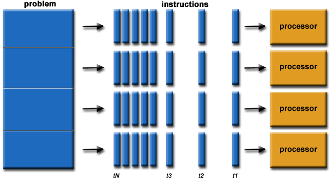
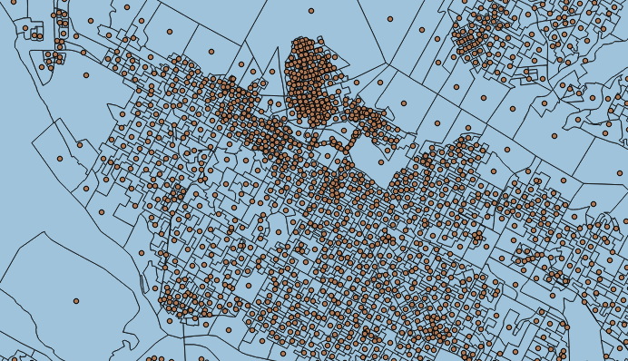

## PostGIS 地理信息、栅格数据 多核并行处理(st_memunion, st_union) 
                      
### 作者                                                                   
digoal                 
                        
### 日期                   
2017-03-07                  
                    
### 标签                 
PostgreSQL , PostGIS , 栅格 , raster , 多核并行    
                      
----                
                         
## 背景         
自从PostgreSQL 9.6支持CPU多核并行计算后，PostgreSQL最流行的插件之一PostGIS，用户对多核需求也越来越多。  
  
原因是PostGIS中有大量的运算是非常耗费CPU资源的，比如raster类型相关的运算。  
  
PostGIS tends to involve CPU-intensive calculations on geometries, support for parallel query has been at the top of our request list to the core team for a long time.   
  
Now that it is finally arriving the question is: does it really help?  
  
PostGIS 发布的2.3.1 版本，已经可以看到诚意了吧，以下函数已经支持并行计算了。  
  
Mark ST_Extent, ST_3DExtent and ST_Mem* agg functions as parallel safe so they can be parallelized  
  
  
  
## 扫描并行  
扫描并行，比如扫描节点有大量数据要被过滤时，或者说查询子句中有大量的运算时，使用并行可以大大提升其效率。  
  
例如  
  
1\. filter过滤掉大量的数据，并且filter本身运算量较大时，使用CPU多核并行，效果明显  
  
```  
select * from table where filter...;    
```  
  
2\. 当func函数或者OP操作符运算量较大时，使用CPU多核并行，效果非常明显  
  
比如聚合运算，或者一些业务逻辑运算（虽然TABLE本身没几条记录，但是每条记录的运算耗时很长时，并行效果明显）。  
  
```  
select func(x), x op y from table ...;  
```  
  
## JOIN并行  
我们在使用explain 观察SQL时，或者使用perf跟踪SQL的开销时，对于一个多个表数据JOIN的SQL，如果JOIN的数据量很大，可能就会成为整个SQL的性能瓶颈。  
  
现在可以使用CPU的多核并行来加速JOIN了。  
  
## 聚合并行  
聚合操作，比如统计某个维度的平均值、最大、最小、SUM等，在金融、分析行业用得非常多，处理的数据量大，运算量也较大。  
  
除了扫描码并行，聚合函数本身也要支持并行才行，比如sum，count, avg, 可以想象并行处理都是安全的。  
  
应该这么说，凡是在分布式数据库中支持的2阶段聚合函数，并行都是安全的。  
  
关于分布式数据库的2阶段并行聚合的原理请参考  
  
[《hll插件在Greenplum中的使用 以及 分布式聚合函数优化思路》](../201608/20160825_02.md)   
  
[《Postgres-XC customized aggregate introduction》](../201305/20130502_01.md)  
  
## 观察并行、并行原理  
如果你要观看并行效果，这样设置一下就好了  
  
postgresql.conf  
  
```  
max_worker_processes = 64  
max_parallel_workers_per_gather = 8  
parallel_tuple_cost = 0  
parallel_setup_cost = 0  
min_parallel_relation_size = 0  
force_parallel_mode = on  
```  
  
table  
  
```  
alter table table_name set (parallel_workers=8);  
```  
  
关闭并行效果  
  
```  
alter table table_name set (parallel_workers=0);  
set force_parallel_mode = off;  
```  
  
### 并行原理  
参考  
  
[《PostgreSQL 9.6 并行计算 优化器算法浅析》](../201610/20161002_01.md)    
  
[《PostgreSQL 9.6 并行计算 优化器算法浅析》](../201608/20160816_02.md)  
  
## GIS地理信息处理与并行  
前面说的是几种使用多核并行的应用场景，那么对于GIS数据，如何利用这些并行技术呢？  
  
下面的例子取自  
  
http://blog.cleverelephant.ca/2016/03/parallel-postgis.html  
  
1\. 扫描并行  
  
```  
EXPLAIN ANALYZE   
  SELECT Count(*)   
    FROM pd   
    WHERE ST_Area(geom) > 10000;  
  
Finalize Aggregate    
(cost=20482.97..20482.98 rows=1 width=8)   
(actual time=345.855..345.856 rows=1 loops=1)  
->  Gather    
   (cost=20482.65..20482.96 rows=3 width=8)   
   (actual time=345.674..345.846 rows=4 loops=1)  
     Number of Workers: 3  
     ->  Partial Aggregate    
         (cost=19482.65..19482.66 rows=1 width=8)   
         (actual time=336.663..336.664 rows=1 loops=4)  
           ->  Parallel Seq Scan on pd    
               (cost=0.00..19463.96 rows=7477 width=0)   
               (actual time=0.154..331.815 rows=15540 loops=4)  
                 Filter: (st_area(geom) > 10000)  
                 Rows Removed by Filter: 1844  
Planning time: 0.145 ms  
Execution time: 349.345 ms  
```  
  
2\. JOIN并行  
  
```  
CREATE TABLE pts AS   
SELECT   
  ST_PointOnSurface(geom)::Geometry(point, 3347) AS geom,   
  gid, fed_num   
FROM pd;  
  
CREATE INDEX pts_gix   
  ON pts USING GIST (geom);  
```  
  
找出与蓝色区域重叠的点  
  
  
  
```  
EXPLAIN ANALYZE   
 SELECT Count(*)   
  FROM pd   
  JOIN pts   
  ON ST_Intersects(pd.geom, pts.geom);  
  
  
The ST_Intersects() function is actually a SQL wrapper on top of the && operator and the _ST_Intersects() function, but unwrapping it and using the components directly also has no effect.  
  
改成  
  
EXPLAIN ANALYZE   
 SELECT Count(*)   
  FROM pd   
  JOIN pts   
  ON pd.geom && pts.geom  
  AND _ST_Intersects(pd.geom, pts.geom);  
```  
  
UPDATE: Marking the geometry_overlaps function which is bound to the && operator as PARALLEL SAFE allows PostgreSQL to generate parallel join plans when the index is in place.  
  
3\. 聚合并行  
  
以ST_Union为例。  
  
不建议使用ST_Union()，因为它使用的是级联UNION的方式，开启并行并没有效果，原因是需要使用memory copy, 聚合过程中，越到后面，耗费越大。  
  
ST_MemUnion 可以替代ST_Union，在并行中取得很好的效果  
  
“Fortunately” we have such an aggregate, the old union implementation from before we added “cascaded union”.   
  
The “memory friendly” union saves memory by not building up the array of geometries in memory, at the cost of spending lots of CPU unioning each input geometry into the transfer state.  
  
支持并行的ST_MemUnion聚合函数如下  
  
```  
CREATE AGGREGATE ST_MemUnion (  
  basetype = geometry,  
  sfunc = ST_Union,  
  combinefunc = ST_Union,  
  stype = geometry  
 );  
```  
  
例如  
  
```  
EXPLAIN ANALYZE   
  SELECT ST_Area(ST_MemUnion(geom))   
    FROM pd   
    WHERE fed_num = 47005;  
  
 Finalize Aggregate    
 (cost=16536.53..16536.79 rows=1 width=8)   
 (actual time=2263.638..2263.639 rows=1 loops=1)  
   ->  Gather    
   (cost=16461.22..16461.53 rows=3 width=32)   
   (actual time=754.309..757.204 rows=4 loops=1)  
         Number of Workers: 3  
         ->  Partial Aggregate    
         (cost=15461.22..15461.23 rows=1 width=32)   
         (actual time=676.738..676.739 rows=1 loops=4)  
               ->  Parallel Seq Scan on pd    
               (cost=0.00..13856.38 rows=64 width=2311)   
               (actual time=3.009..27.321 rows=42 loops=4)  
                     Filter: (fed_num = 47005)  
                     Rows Removed by Filter: 17341  
 Planning time: 0.219 ms  
 Execution time: 2264.684 ms  
```  
  
## 小结  
1\. 自从PostgreSQL 9.6支持并行后，由于PostgreSQL开放了并行接口，比如聚合函数，使用并行时，会以两阶段方式运行，你需要增加一个合并函数。  
  
周边的插件，也可以很方便的将原有的聚合或者操作符，改造为并行的模式，从而享受PostgreSQL多核并行带来的效果。  
  
2\. 其他加速技术，包括LLVM，列存储，向量化，算子复用，GPU加速等。  
  
[《PostgreSQL 向量化执行插件(瓦片式实现) 10x提速OLAP》](../201702/20170225_01.md)  
  
[《分析加速引擎黑科技 - LLVM、列存、多核并行、算子复用 大联姻 - 一起来开启PostgreSQL的百宝箱》](../201612/20161216_01.md)  
  
https://github.com/pg-strom   
  
## 参考  
  
http://postgis.net/docs/RT_FAQ.html  
  
https://trac.osgeo.org/postgis/wiki/WKTRaster  
  
http://osgeo-org.1560.x6.nabble.com/Parallel-Support-td5258386.html  
  
http://blog.cleverelephant.ca/2016/03/parallel-postgis.html  
  
https://github.com/pramsey/postgis/tree/parallel  
  
http://postgis.net/docs/manual-2.3/release_notes.html#idm40209  
  
  

  
<a rel="nofollow" href="http://info.flagcounter.com/h9V1"  ></a>  
  
  
  
  
  
  
## [digoal's 大量PostgreSQL文章入口](https://github.com/digoal/blog/blob/master/README.md "22709685feb7cab07d30f30387f0a9ae")
  
