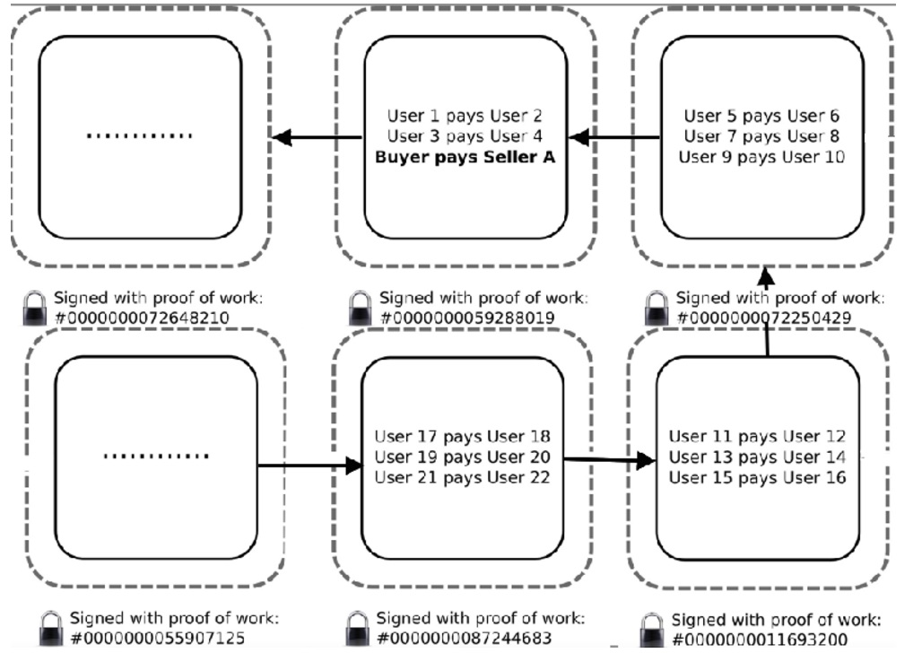
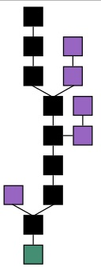

## PostgreSQL 区块链条管理举例  
##### [TAG 15](../class/15.md)
                                    
### 作者                                                                                 
digoal                               
                                      
### 日期                                 
2017-03-10                            
                                  
### 标签                               
PostgreSQL , blockchain , 链条管理 , 递归查询     
                                    
----                              
                                       
## 背景    
区块链的概念请参考  
  
https://github.com/yeasy/blockchain_guide/blob/master/intro/what.md  
  
截取部分如下  
  
### 什么是区块链  
  
  
区块链的基本原理理解起来并不难。基本概念包括：  
  
- 交易（Transaction）：一次操作，导致账本状态的一次改变，如添加一条记录；  
  
- 区块（Block）：记录一段时间内发生的交易和状态结果，是对当前账本状态的一次共识；  
  
- 链（Chain）：由一个个区块按照发生顺序串联而成，是整个状态变化的日志记录。  
  
- 如果把区块链作为一个状态机，则每次交易就是试图改变一次状态，而每次共识生成的区块，就是参与者对于区块中所有交易内容导致状态改变的结果进行确认。  
  
  
  
在实现上，首先假设存在一个分布式的数据记录本（这方面的技术相对成熟），这个记录本只允许添加、不允许删除。其结构是一个线性的链表，由一个个“区块”串联组成，这也是其名字“区块链”的来源。新的数据要加入，必须放到一个新的区块中。而这个块（以及块里的交易）是否合法，可以通过一些手段快速检验出来。维护节点都可以提议一个新的区块，然而必须经过一定的共识机制来对最终选择的区块达成一致。  
  
具体以比特币为例来看如何使用了区块链技术？客户端发起一项交易后，会广播到网络中并等待确认。网络中的节点会将一些等待确认的交易记录打包在一起（此外还要包括此前区块的哈希值等信息），组成一个候选区块。然后，试图找到一个 nonce 串放到区块里，使得候选区块的 hash 结果满足一定条件（比如小于某个值）。一旦算出来这个区块在格式上就合法了，就可以进行全网广播。大家拿到提案区块，进行验证，发现确实符合约定条件了，就承认这个区块是一个合法的新区块，被添加到链上。当然，在实现上还会有很多的细节。  
  
比特币的这种基于算力的共识机制被称为 Proof of Work（PoW）。目前，要让 hash 结果满足一定条件并无已知的启发式算法，只能进行暴力尝试。尝试的次数越多，算出来的概率越大。通过调节对 hash 结果的限制，比特币网络控制约 10 分钟平均算出来一个合法区块。算出来的节点将得到区块中所有交易的管理费和协议固定发放的奖励费（目前是 12.5 比特币，每四年减半）。也即俗称的挖矿。  
  
很自然会有人问，能否进行恶意操作来破坏整个区块链系统或者获取非法利益。比如不承认别人的结果，拒绝别人的交易等。实际上，因为系统中存在大量的用户，而且用户默认都只承认他看到的最长的链。只要不超过一半（概率意义上越少肯定越难）的用户协商，最终最长的链将很大概率上是合法的链，而且随着时间增加，这个概率会越大。例如，经过 6 个块后，即便有一半的节点联合起来想颠覆被确认的结果，其概率将为 $$\frac{1}{2}^6 = 1.6\%$$，即低于 $$\frac{1}{60}$$ 的可能性。  
  
### 分类  
  
根据参与者的不同，可以分为公开（Public）链、联盟（Consortium）链和私有（Private）链。  
  
公开链，顾名思义，任何人都可以参与使用和维护，典型的如比特币区块链，信息是完全公开的。  
  
如果引入许可机制，包括私有链和联盟链两种。  
  
私有链，则是集中管理者进行限制，只能得到内部少数人可以使用，信息不公开。  
  
联盟链则介于两者之间，由若干组织一起合作维护一条区块链，该区块链的使用必须是有权限的管理，相关信息会得到保护，典型如银联组织。  
  
目前来看，公开链将会更多的吸引社区和媒体的眼球，但更多的商业价值应该在联盟链和私有链上。  
  
根据使用目的和场景的不同，又可以分为以数字货币为目的的货币链，以记录产权为目的的产权链，以众筹为目的的众筹链等。  
  
### 误区  
  
目前，对区块链的认识还存在不少误区。  
  
首先，区块链不是数据库。虽然区块链也可以用来存储数据，但它要解决的问题是多方的互信问题。单纯从存储数据角度，它的效率可能不高，笔者也不推荐把大量的原始数据放到区块链上。  
  
其次，区块链不是要颠覆现有技术。作为基于多项已有技术而出现的新事物，区块链跟现有技术的关系是一脉相承的，在解决多方合作和可信处理上多走了一步，但并不意味着它将彻底颠覆已有的商业模式。很长一段时间里，区块链的适用场景仍需摸索，跟已有系统必然是合作共存的关系。  
  
## 区块链条  
区块链由BLOCK组成，每个BLOCK有一个HASH VALUE，同时有一个指向上一个BLOCK的HASH value，从而形成了BLOCK的链条。  
  
A blockchain – originally block chain – is a distributed database that maintains a continuously growing list of ordered records called blocks.   
  
Each block contains a timestamp and a link to a previous block.[6] By design, blockchains are inherently resistant to modification of the data — once recorded, the data in a block cannot be altered retroactively.   
  
Blockchains are "an open, distributed ledger that can record transactions between two parties efficiently and in a verifiable and permanent way. The ledger itself can also be programmed to trigger transactions automatically."  
  
一个区块链的图例如下，主链为最长的链（黑色），绿色该区块链的起始BLOCK，而紫色为被推翻的BLOCK，在主链的外围。为什么会有紫色的块呢？很显然是被推翻的块，比如超过半数的维护节点（维护区块链副本的所有节点）推翻它。  
  
  
  
Blockchain formation. The main chain (black) consists of the longest series of blocks from the genesis block (green) to the current block. Orphan blocks (purple) exist outside of the main chain.  
  
## 链条数据的维护  
区块链中，有一条主链，即最长的链，不在主链上的块，都是报废的块。  
  
每个块都有一个height值，表示它的前面有多少个数据块。  
  
如果在数据库中为每个BLOCK存储一条记录，那么如何从一个区块，找到它的上层区块呢？  
  
### 生成区块链的测试数据  
  
1\. 测试表  
  
```  
create table blockchain(  
  block_hash text primary key, -- block 哈希值  
  prev_block text, -- 前一个block的哈希值  
  height int  -- 当前block的高度,表示前面有多少个BLOCK，起始BLOCK的高度为0  
);  
```  
  
2\. 插入100万测试数据，100万个区块。  
  
```  
do language plpgsql $$  
declare  
  v_id1 text;  
  v_id2 text;  
begin  
  v_id1 := ( md5(random()::text||clock_timestamp()::text) || md5(random()::text||clock_timestamp()::text) );  
  v_id2 := ( md5(random()::text||clock_timestamp()::text) || md5(random()::text||clock_timestamp()::text) );  
  for i in 1..1000000 loop  
      if i <> 1 then  
        insert into blockchain(block_hash, prev_block, height) values (v_id2, v_id1, i-1);  
      else  
        insert into blockchain(block_hash, prev_block, height) values (v_id2, '0', 0);  
      end if;  
      v_id1 := v_id2;   
      v_id2 := ( md5(random()::text||clock_timestamp()::text) || md5(random()::text||clock_timestamp()::text) );  
  end loop;  
end;  
$$;  
```  
  
测试数据如下  
  
```  
postgres=# select * from blockchain limit 10;  
                            block_hash                            |                            prev_block                            | height   
------------------------------------------------------------------+------------------------------------------------------------------+--------  
 487eb30b363cedb9abd171d17ac4b1bacea760824080a09beaed48e63f8f3bfe | 0                                                                |      0  
 ad1585e0b348f6dcd630801b815a8ff541a2a57183408e4a7b85ba8dcc19768b | 487eb30b363cedb9abd171d17ac4b1bacea760824080a09beaed48e63f8f3bfe |      1  
 1868e5a410091d003ca3313f4e5cfda2a4941ff747cf77e26b2c6e94e3f04fde | ad1585e0b348f6dcd630801b815a8ff541a2a57183408e4a7b85ba8dcc19768b |      2  
 ad6e8994d1b54ce3a7ebf4d25c306ea587c0a7145237bd1e4d064da85581a371 | 1868e5a410091d003ca3313f4e5cfda2a4941ff747cf77e26b2c6e94e3f04fde |      3  
 f8257ed95ec8c42c3377e362ef34a02b0051b7ac92067ab51852bb86de88eff2 | ad6e8994d1b54ce3a7ebf4d25c306ea587c0a7145237bd1e4d064da85581a371 |      4  
 bcb5c2e001fff982b78e9f413a076359ab546a146bc2bbab585ab3c69e47d43c | f8257ed95ec8c42c3377e362ef34a02b0051b7ac92067ab51852bb86de88eff2 |      5  
 ecfd744a073aa655faa5c8bee32d2686fc63dbf334b34a2caf2c04b5c360fc24 | bcb5c2e001fff982b78e9f413a076359ab546a146bc2bbab585ab3c69e47d43c |      6  
 317e0727c91758af37f0d21d1adda8d80f3f0f86b914aac4275b4c7e358fbe89 | ecfd744a073aa655faa5c8bee32d2686fc63dbf334b34a2caf2c04b5c360fc24 |      7  
 a1896dffd46a9c5695c2340a42ac8957d3141e67d047765c4cf3ac270e8dd6e9 | 317e0727c91758af37f0d21d1adda8d80f3f0f86b914aac4275b4c7e358fbe89 |      8  
 14967b84c7297e68611b4e294eed993f7c8e19894375e2fa55307b71cd7d3e80 | a1896dffd46a9c5695c2340a42ac8957d3141e67d047765c4cf3ac270e8dd6e9 |      9  
(10 rows)  
```  
  
创建索引  
  
```  
create index idx_blockchain_1 on blockchain(prev_block);  
```  
  
### 根据某个区块找到它的前面的所有区块  
由于区块链是链表结构，从一个块找前面所有的块，就类似顺藤摸瓜，在PostgreSQL中，使用递归查询即可达到这个目的。  
  
```  
WITH RECURSIVE tmp(block_hash, prev_block, height) as (  
      select * from blockchain where block_hash='a1896dffd46a9c5695c2340a42ac8957d3141e67d047765c4cf3ac270e8dd6e9'  
  UNION ALL  
      SELECT t1.block_hash, t1.prev_block, t1.height FROM tmp JOIN blockchain t1 ON (t1.block_hash = tmp.prev_block)  
)  
select * from tmp;  
  
                            block_hash                            |                            prev_block                            | height   
------------------------------------------------------------------+------------------------------------------------------------------+--------  
 a1896dffd46a9c5695c2340a42ac8957d3141e67d047765c4cf3ac270e8dd6e9 | 317e0727c91758af37f0d21d1adda8d80f3f0f86b914aac4275b4c7e358fbe89 |      8  
 317e0727c91758af37f0d21d1adda8d80f3f0f86b914aac4275b4c7e358fbe89 | ecfd744a073aa655faa5c8bee32d2686fc63dbf334b34a2caf2c04b5c360fc24 |      7  
 ecfd744a073aa655faa5c8bee32d2686fc63dbf334b34a2caf2c04b5c360fc24 | bcb5c2e001fff982b78e9f413a076359ab546a146bc2bbab585ab3c69e47d43c |      6  
 bcb5c2e001fff982b78e9f413a076359ab546a146bc2bbab585ab3c69e47d43c | f8257ed95ec8c42c3377e362ef34a02b0051b7ac92067ab51852bb86de88eff2 |      5  
 f8257ed95ec8c42c3377e362ef34a02b0051b7ac92067ab51852bb86de88eff2 | ad6e8994d1b54ce3a7ebf4d25c306ea587c0a7145237bd1e4d064da85581a371 |      4  
 ad6e8994d1b54ce3a7ebf4d25c306ea587c0a7145237bd1e4d064da85581a371 | 1868e5a410091d003ca3313f4e5cfda2a4941ff747cf77e26b2c6e94e3f04fde |      3  
 1868e5a410091d003ca3313f4e5cfda2a4941ff747cf77e26b2c6e94e3f04fde | ad1585e0b348f6dcd630801b815a8ff541a2a57183408e4a7b85ba8dcc19768b |      2  
 ad1585e0b348f6dcd630801b815a8ff541a2a57183408e4a7b85ba8dcc19768b | 487eb30b363cedb9abd171d17ac4b1bacea760824080a09beaed48e63f8f3bfe |      1  
 487eb30b363cedb9abd171d17ac4b1bacea760824080a09beaed48e63f8f3bfe | 0                                                                |      0  
(9 rows)  
```  
  
### 根据某个区块找到它的后面的所有区块  
  
```  
WITH RECURSIVE tmp(block_hash, prev_block, height) as (  
      select * from blockchain where block_hash='a1896dffd46a9c5695c2340a42ac8957d3141e67d047765c4cf3ac270e8dd6e9'  
  UNION ALL  
      SELECT t1.block_hash, t1.prev_block, t1.height FROM tmp JOIN blockchain t1 ON (t1.prev_block = tmp.block_hash)  
)  
select * from tmp limit 10;  
  
                            block_hash                            |                            prev_block                            | height   
------------------------------------------------------------------+------------------------------------------------------------------+--------  
 a1896dffd46a9c5695c2340a42ac8957d3141e67d047765c4cf3ac270e8dd6e9 | 317e0727c91758af37f0d21d1adda8d80f3f0f86b914aac4275b4c7e358fbe89 |      8  
 14967b84c7297e68611b4e294eed993f7c8e19894375e2fa55307b71cd7d3e80 | a1896dffd46a9c5695c2340a42ac8957d3141e67d047765c4cf3ac270e8dd6e9 |      9  
 efd41c98ea6e6ba557b35ce982b87b3c62245534f625c508608d9c58db3555ee | 14967b84c7297e68611b4e294eed993f7c8e19894375e2fa55307b71cd7d3e80 |     10  
 96c3d5160ee43783bebf70a86361dd6cfb61245d4f3acb177aed14b74c1b177a | efd41c98ea6e6ba557b35ce982b87b3c62245534f625c508608d9c58db3555ee |     11  
 2dd3ac50b6ef67dcbca5e54bd8aca7bc5327e71a9f29773e27264a0aa0507a20 | 96c3d5160ee43783bebf70a86361dd6cfb61245d4f3acb177aed14b74c1b177a |     12  
 57ffc9ae3d87c3ec22080e0aed0722605d6eb640bff51c38620196d253c73017 | 2dd3ac50b6ef67dcbca5e54bd8aca7bc5327e71a9f29773e27264a0aa0507a20 |     13  
 0ae675c06aa5d04a6f8e625babdafce75a97bb7e0ba0d8aa639e4a3c3dfc50cc | 57ffc9ae3d87c3ec22080e0aed0722605d6eb640bff51c38620196d253c73017 |     14  
 027de6b68ef168d34384ea8f9bb8fc9abdf9baa80616cf7d1f784737c6b0f964 | 0ae675c06aa5d04a6f8e625babdafce75a97bb7e0ba0d8aa639e4a3c3dfc50cc |     15  
 0c8d6fc0d1c09578f0b95ae7cfbcb0ab8553ee108983f194048a886915dbe4d5 | 027de6b68ef168d34384ea8f9bb8fc9abdf9baa80616cf7d1f784737c6b0f964 |     16  
 f5c61da7c03769372d0ea404de6e7a4cc19707c43c3818df6176d30c01ddd68b | 0c8d6fc0d1c09578f0b95ae7cfbcb0ab8553ee108983f194048a886915dbe4d5 |     17  
(10 rows)  
```  
  
递归查询的启动子句除了SELECT，也支持VALUES子句。  
  
```
WITH RECURSIVE tmp(block_hash, prev_block, height) as (  
      select * from (values ('a1896dffd46a9c5695c2340a42ac8957d3141e67d047765c4cf3ac270e8dd6e9', '317e0727c91758af37f0d21d1adda8d80f3f0f86b914aac4275b4c7e358fbe89', 8)) as t(block_hash,prev_block,height)
  UNION ALL  
      SELECT t1.block_hash, t1.prev_block, t1.height FROM tmp JOIN blockchain t1 ON (t1.prev_block = tmp.block_hash)  
)  
select * from tmp limit 10;  
```
  
效率是一样的。   
  
```
postgres=# explain (analyze,verbose,timing,costs,buffers) WITH RECURSIVE tmp(block_hash, prev_block, height) as (  
      select * from blockchain where block_hash='a1896dffd46a9c5695c2340a42ac8957d3141e67d047765c4cf3ac270e8dd6e9'  
  UNION ALL  
      SELECT t1.block_hash, t1.prev_block, t1.height FROM tmp JOIN blockchain t1 ON (t1.prev_block = tmp.block_hash)  
)  
select * from tmp ; 
                                                                            QUERY PLAN                                                                            
------------------------------------------------------------------------------------------------------------------------------------------------------------------
 CTE Scan on tmp  (cost=324.94..326.96 rows=101 width=68) (actual time=0.025..5817.479 rows=999992 loops=1)
   Output: tmp.block_hash, tmp.prev_block, tmp.height
   Buffers: shared hit=5029960, temp written=17822
   CTE tmp
     ->  Recursive Union  (cost=0.55..324.94 rows=101 width=134) (actual time=0.024..5189.381 rows=999992 loops=1)
           Buffers: shared hit=5029960
           ->  Index Scan using blockchain_pkey on public.blockchain  (cost=0.55..3.17 rows=1 width=134) (actual time=0.022..0.022 rows=1 loops=1)
                 Output: blockchain.block_hash, blockchain.prev_block, blockchain.height
                 Index Cond: (blockchain.block_hash = 'a1896dffd46a9c5695c2340a42ac8957d3141e67d047765c4cf3ac270e8dd6e9'::text)
                 Buffers: shared hit=5
           ->  Nested Loop  (cost=0.55..31.97 rows=10 width=134) (actual time=0.004..0.005 rows=1 loops=999992)
                 Output: t1.block_hash, t1.prev_block, t1.height
                 Buffers: shared hit=5029955
                 ->  WorkTable Scan on tmp tmp_1  (cost=0.00..0.20 rows=10 width=32) (actual time=0.000..0.000 rows=1 loops=999992)
                       Output: tmp_1.block_hash, tmp_1.prev_block, tmp_1.height
                 ->  Index Scan using idx_blockchain_1 on public.blockchain t1  (cost=0.55..3.17 rows=1 width=134) (actual time=0.004..0.004 rows=1 loops=999992)
                       Output: t1.block_hash, t1.prev_block, t1.height
                       Index Cond: (t1.prev_block = tmp_1.block_hash)
                       Buffers: shared hit=5029955
 Planning time: 0.189 ms
 Execution time: 5922.225 ms
(21 rows)

postgres=# explain (analyze,verbose,timing,costs,buffers) WITH RECURSIVE tmp(block_hash, prev_block, height) as (  
      select * from (values ('a1896dffd46a9c5695c2340a42ac8957d3141e67d047765c4cf3ac270e8dd6e9', '317e0727c91758af37f0d21d1adda8d80f3f0f86b914aac4275b4c7e358fbe89', 8)) as t(block_hash,prev_block,height)
  UNION ALL  
      SELECT t1.block_hash, t1.prev_block, t1.height FROM tmp JOIN blockchain t1 ON (t1.prev_block = tmp.block_hash)  
)  
select * from tmp ;  
                                                                                  QUERY PLAN                                                                                   
-------------------------------------------------------------------------------------------------------------------------------------------------------------------------------
 CTE Scan on tmp  (cost=321.78..323.80 rows=101 width=68) (actual time=0.006..5815.594 rows=999992 loops=1)
   Output: tmp.block_hash, tmp.prev_block, tmp.height
   Buffers: shared hit=5029955, temp written=17822
   CTE tmp
     ->  Recursive Union  (cost=0.00..321.78 rows=101 width=134) (actual time=0.003..5186.289 rows=999992 loops=1)
           Buffers: shared hit=5029955
           ->  Result  (cost=0.00..0.01 rows=1 width=68) (actual time=0.001..0.001 rows=1 loops=1)
                 Output: 'a1896dffd46a9c5695c2340a42ac8957d3141e67d047765c4cf3ac270e8dd6e9'::text, '317e0727c91758af37f0d21d1adda8d80f3f0f86b914aac4275b4c7e358fbe89'::text, 8
           ->  Nested Loop  (cost=0.55..31.97 rows=10 width=134) (actual time=0.004..0.005 rows=1 loops=999992)
                 Output: t1.block_hash, t1.prev_block, t1.height
                 Buffers: shared hit=5029955
                 ->  WorkTable Scan on tmp tmp_1  (cost=0.00..0.20 rows=10 width=32) (actual time=0.000..0.000 rows=1 loops=999992)
                       Output: tmp_1.block_hash, tmp_1.prev_block, tmp_1.height
                 ->  Index Scan using idx_blockchain_1 on public.blockchain t1  (cost=0.55..3.17 rows=1 width=134) (actual time=0.004..0.004 rows=1 loops=999992)
                       Output: t1.block_hash, t1.prev_block, t1.height
                       Index Cond: (t1.prev_block = tmp_1.block_hash)
                       Buffers: shared hit=5029955
 Planning time: 0.196 ms
 Execution time: 5923.727 ms
(19 rows)
```
  
### 更新BLOCK高度  
递归调用中同样可以使用DML语句，比如  
  
```  
delete from ... returning *;  
update xxx set xxx from xxx where xxx returning *;  
```  
  
递归查询可以由多个SUB组成。  
  
## 图数据应用
递归查询同样可以用于图数据场景，比如人脉分析。  
  
[《金融风控、公安刑侦、社会关系、人脉分析等需求分析与数据库实现 - PostgreSQL图数据库场景应用》](../201612/20161213_01.md)  
  
## 参考  
https://github.com/yeasy/blockchain_guide/blob/master/intro/what.md  
  
https://en.wikipedia.org/wiki/Blockchain  
  
[【区块链之技术实战】](https://yq.aliyun.com/articles/60443)  
  
[《金融风控、公安刑侦、社会关系、人脉分析等需求分析与数据库实现 - PostgreSQL图数据库场景应用》](../201612/20161213_01.md)  
  
[《PostgreSQL Oracle 兼容性之 - connect by》](../201606/20160614_03.md)   
  
[《PostgreSQL Oracle 兼容性之 - WITH 递归 ( connect by )》](../201512/20151221_02.md)   
  
<a rel="nofollow" href="http://info.flagcounter.com/h9V1"  ></a>  
  
  
  
  
  
  
## [digoal's 大量PostgreSQL文章入口](https://github.com/digoal/blog/blob/master/README.md "22709685feb7cab07d30f30387f0a9ae")
  
