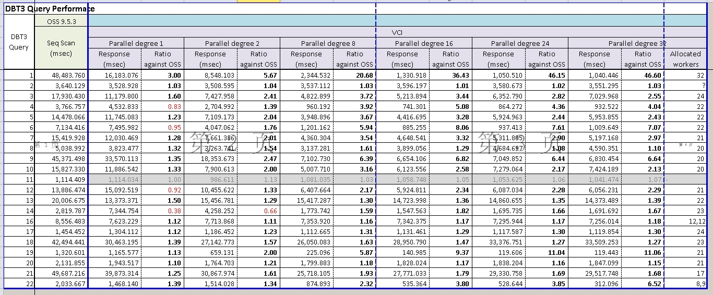
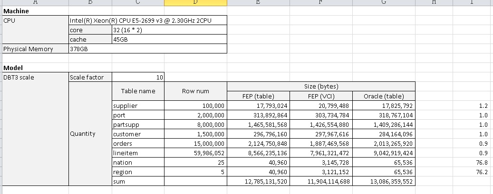
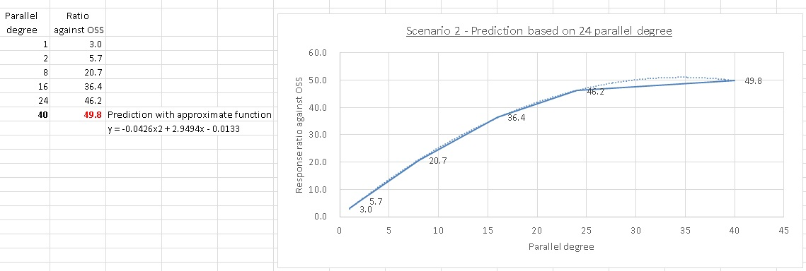

## PostgreSQL 10.0 preview 功能增强 - OLAP增强 向量聚集索引(列存储扩展)  
##### [TAG 13](../class/13.md) , [TAG 16](../class/16.md)
                                                                          
### 作者                                                                                                                       
digoal                                                                     
                                                                            
### 日期                                                                       
2017-03-13                                                                      
                                                                        
### 标签                                                                     
PostgreSQL , 10.0 , Vertical Clustered Index (columnar store extension) , 列存储 , 向量聚集索引    
                                                                          
----                                                                    
                                                                             
## 背景         
未来数据库OLTP+OLAP逐渐模糊化，需求逐渐融合是一个大的趋势，如果你的数据库只支持OLTP的场景，未来可能会成为业务的绊脚石。  
  
在这方面PostgreSQL每年发布的新版本，都给用户很大的惊喜，OLTP已经具备非常强大的竞争力（性能、功能、稳定性、成熟度、案例、跨行业应用等），而OLAP方面，新增的feature也是层出不穷。  
  
[《PostgreSQL 10.0 preview 性能增强 - OLAP提速框架, Faster Expression Evaluation Framework(含JIT)》](../201703/20170312_14.md)    
  
[《分析加速引擎黑科技 - LLVM、列存、多核并行、算子复用 大联姻 - 一起来开启PostgreSQL的百宝箱》](../201612/20161216_01.md)    
    
[《PostgreSQL 向量化执行插件(瓦片式实现) 10x提速OLAP》](../201702/20170225_01.md)  
  
PostgreSQL 10.0将要整合的一个功能：  
  
Vertical Clustered Index (columnar store extension) , 列存储 , 向量聚集索引。  
  
这个模块是Fujitsu实验室提供的，一种新增的VCI索引访问接口，这么做可以最小化数据库的改动。  
  
用户仅需要在原来的堆表上创建VCI即可（向量聚集索引），索引将以向量聚集形式组织，提升查询性能。  
  
VCI有两方面的优化，索引数据分为两个部分：  
  
1\. 写优化部分(WOS)  
  
行格式存储（类似堆表），同时携带xmin/xmax标记（事务号），所以如果更新WOS中的数据，和更新PostgreSQL原有的堆表一样效率很高。  
  
PostgreSQL backend process或者autovacuum会持续自动的将WOS中已经frozen的记录（即对所有事务可见的记录），转移到ROS（读优化部分）存储。  
  
ROS存储中，没有版本信息（XMIN/XMAX），有tuple id，可以通过tuple id访问ROS中的记录。（没有版本信息，如何判断可见性呢？后面讲）  
  
2\. 读优化部分(ROS)  
  
ROS为列存储，每列一个或一批文件，在ROS中，记录是以extent来组织的，每个extent存储262,144行记录，可以方便的建立堆表TID to ROS CRID的映射关系。  
  
插入vci记录，与插入索引一样。（插入WOS，后台自动将frozen记录合并到ROS）  
  
删除vci记录，如果数据只在WOS中，删除和删堆表记录一样，做标记，如果数据已经从WOS合并到ROS，那么需要维护一个向量，这个向量中包含被删除的记录在ROS中的tuple id, 以及删除该记录的事务的xact id等。读取ROS时，根据这个向量，过滤ros中对应的tuple id.  
  
更新vci记录，与删除类似。  
  
目前提供的性能测试数据  
  
  
  
  
  
  
  
讨论  
  
```  
Hi All,  
  
Fujitsu was interested in developing a columnar storage extension with  
minimal  
changes the server backend.  
  
The columnar store is implemented as an extension using index access  
methods.  
This can be easily enhanced with pluggable storage methods once they are  
available.  
  
A new index method (VCI) is added to create columnar index on the table.  
  
The following is the basic design idea of the columnar extension,  
  
This has the on-disk columnar representation. So, even after crash,  
the columnar format is recovered to the state when it was crashed.  
  
To provide performance benefit for both read and write operations,  
the data is stored in two formats  
  
1) write optimized storage (WOS)  
2) read optimized storage (ROS).  
  
This is useful for the users where there is a great chance of data  
modification  
that is newly added instead of the old data.  
  
WOS  
====  
  
write optimized storage is the data of all columns that are part of VCI are  
stored in a row wise format. All the newly added data is stored in WOS  
relation with xmin/xmax information also. If user wants to update/delete the  
newly added data, it doesn't affect the performance much compared to  
deleting the data from columnar storage.  
  
The tuples which don't have multiple copies or frozen data will be moved  
from WOS to ROS periodically by the background worker process or autovauum  
process. Every column data is stored separately in it's relation file. There  
is no transaction information is present in ROS. The data in ROS can be  
referred with tuple ID.  
  
In this approach, the column data is present in both heap and columnar  
storage.  
  
ROS  
====  
  
This is the place, where all the column data is stored in columnar format.  
The data from WOS to ROS is converted by background workers continously  
based  
on the tuple visibility check. Whenever the tuple is frozen and it gets  
moved  
from WOS to ROS.  
  
The Data in ROS is stored in extents. One extent contains of 262,144 rows.  
Because  
of fixed number of records in an extent it is easy to map the heap record  
to the columnar  
record with TID to CRID map.  
  
Insert  
=====  
  
The insert operation is just like inserting a data into an index.  
  
Select  
=====  
  
Because of two storage formats, during the select operation, the data in WOS  
is converted into Local ROS for the statement to be executed. The conversion  
cost depends upon the number of tuples present in the WOS file. This  
may add some performance overhead for select statements. The life of the  
Local  
ROS is till the end of query context.  
  
Delete  
=====  
  
During the delete operation, whenever the data is deleted in heap at the  
same  
time the data in WOS file is marked as deleted similar like heap. But in  
case  
if the data is already migrated from WOS to ROS, then we will maintain some  
delete vector to store the details of tuple id, transaction information and  
etc.  
During the data read from ROS file, it is verified against delete vector  
and  
confirms whether the record is visible or not? All the delete vectors  
data is applied to ROS periodically.  
  
More details of internal relations and their usage is available in the  
README.  
Still it needs more updates to explain full details of the columnar index  
design.  
  
The concept of Vertical clustered index columnar extension is from Fujitsu  
Labs, Japan.  
  
Following is the brief schedule of patches that are required  
for a better performing columnar store.  
  
1. Minimal server changes (new relkind "CSTORE" option)  
2. Base storage patch  
3. Support for moving data from WOS to ROS  
4. Local ROS support  
5. Custom scan support to read the data from ROS and Local ROS  
6. Background worker support for data movement  
7. Expression state support in VCI  
8. Aggregation support in VCI  
9. Pg_dump support for the new type of relations  
10. psql \d command support for CSTORE relations  
11. Parallelism support  
12. Compression support  
13. In-memory support with dynamic shared memory  
  
Currently I attached only patches for 1 and 2. These will provide the  
basic changes that are required in PostgreSQL core to the extension  
to work.  
  
I have to rebase/rewrite the rest of the patches to the latest master,  
and share them with community.  
  
Any Comments on the approach?  
  
Regards,  
Hari Babu  
Fujitsu Australia  
```  
    
这个patch的讨论，详见邮件组，本文末尾URL。    
    
PostgreSQL社区的作风非常严谨，一个patch可能在邮件组中讨论几个月甚至几年，根据大家的意见反复的修正，patch合并到master已经非常成熟，所以PostgreSQL的稳定性也是远近闻名的。    
                
## 参考        
https://commitfest.postgresql.org/13/945/  
    
https://www.postgresql.org/message-id/flat/CAJrrPGfaC7WC9NK6PTTy6YN-NN+hCy8xOLAh2doYhVg5d6HsAA@mail.gmail.com#CAJrrPGfaC7WC9NK6PTTy6YN-NN+hCy8xOLAh2doYhVg5d6HsAA@mail.gmail.com  
  
[《分析加速引擎黑科技 - LLVM、列存、多核并行、算子复用 大联姻 - 一起来开启PostgreSQL的百宝箱》](../201612/20161216_01.md)    
    
[《PostgreSQL 向量化执行插件(瓦片式实现) 10x提速OLAP》](../201702/20170225_01.md)  
  
[《PostgreSQL 10.0 preview 性能增强 - OLAP提速框架, Faster Expression Evaluation Framework(含JIT)》](../201703/20170312_14.md)    
  
<a rel="nofollow" href="http://info.flagcounter.com/h9V1"  ></a>  
  
  
  
  
  
  
## [digoal's 大量PostgreSQL文章入口](https://github.com/digoal/blog/blob/master/README.md "22709685feb7cab07d30f30387f0a9ae")
  
