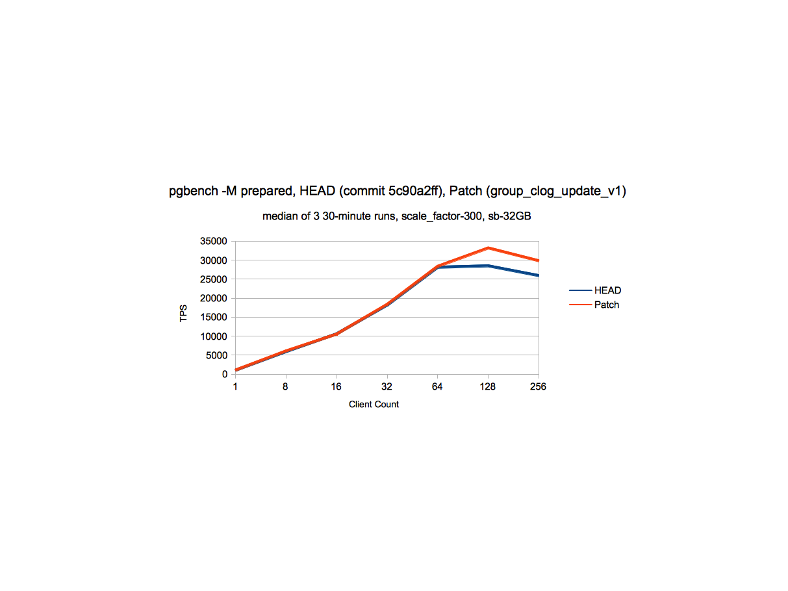
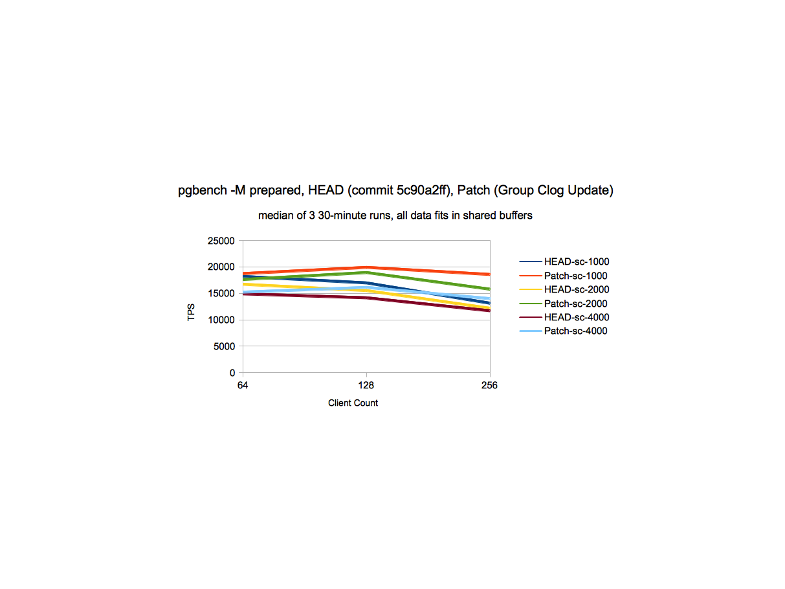

## PostgreSQL 10.0 preview 性能增强 - CLOG group commit    
##### [TAG 13](../class/13.md)
                                                                            
### 作者                                                                                                                         
digoal                                                                       
                                                                              
### 日期                                                                         
2017-03-13                                                                        
                                                                          
### 标签                                                                       
PostgreSQL , 10.0 , CLOG , group commit    
                                                                            
----                                                                      
                                                                               
## 背景           
clog是PostgreSQL的事务提交状态日志，每个事务对应2个BIT，当事务频繁（小事务）结束时，可能出现CLOGControlLock 冲突的问题。  
  
虽然增加clog buffer可以缓解，PostgreSQL 10.0 采样clog group commit进一步降低这个冲突。  
  
提升高并发下的TPS能力。  
  
  
  
  
  
  
```  
I think the main focus for test in this area would be at higher client  
count.  At what scale factors have you taken the data and what are  
the other non-default settings you have used.  By the way, have you  
tried by dropping and recreating the database and restarting the server  
after each run, can you share the exact steps you have used to perform  
the tests.  I am not sure why it is not showing the benefit in your testing,  
may be the benefit is on some what more higher end m/c or it could be  
that some of the settings used for test are not same as mine or the way  
to test the read-write workload of pgbench is different.  
  
In anycase, I went ahead and tried further reducing the CLogControlLock  
contention by grouping the transaction status updates.  The basic idea  
is same as is used to reduce the ProcArrayLock contention [1] which is to  
allow one of the proc to become leader and update the transaction status for  
other active transactions in system.  This has helped to reduce the  
contention  
around CLOGControlLock.  Attached patch group_update_clog_v1.patch  
implements this idea.  
  
I have taken performance data with this patch to see the impact at  
various scale-factors.  All the data is for cases when data fits in shared  
buffers and is taken against commit - 5c90a2ff on server with below  
configuration and non-default postgresql.conf settings.  
  
Performance Data  
-----------------------------  
RAM - 500GB  
8 sockets, 64 cores(Hyperthreaded128 threads total)  
  
Non-default parameters  
------------------------------------  
max_connections = 300  
shared_buffers=8GB  
min_wal_size=10GB  
max_wal_size=15GB  
checkpoint_timeout    =35min  
maintenance_work_mem = 1GB  
checkpoint_completion_target = 0.9  
wal_buffers = 256MB  
  
Refer attached files for performance data.  
  
sc_300_perf.png - This data indicates that at scale_factor 300, there is a  
gain of ~15% at higher client counts, without degradation at lower client  
count.  
different_sc_perf.png - At various scale factors, there is a gain from  
~15% to 41% at higher client counts and in some cases we see gain  
of ~5% at somewhat moderate client count (64) as well.  
perf_write_clogcontrollock_data_v1.ods - Detailed performance data at  
various client counts and scale factors.  
  
Feel free to ask for more details if the data in attached files is not  
clear.  
  
Below is the LWLock_Stats information with and without patch:  
  
Stats Data  
---------  
A. scale_factor = 300; shared_buffers=32GB; client_connections - 128  
  
HEAD - 5c90a2ff  
----------------  
CLogControlLock Data  
------------------------  
PID 94100 lwlock main 11: shacq 678672 exacq 326477 blk 204427 spindelay  
8532 dequeue self 93192  
PID 94129 lwlock main 11: shacq 757047 exacq 363176 blk 207840 spindelay  
8866 dequeue self 96601  
PID 94115 lwlock main 11: shacq 721632 exacq 345967 blk 207665 spindelay  
8595 dequeue self 96185  
PID 94011 lwlock main 11: shacq 501900 exacq 241346 blk 173295 spindelay  
7882 dequeue self 78134  
PID 94087 lwlock main 11: shacq 653701 exacq 314311 blk 201733 spindelay  
8419 dequeue self 92190  
  
After Patch group_update_clog_v1  
----------------  
CLogControlLock Data  
------------------------  
PID 100205 lwlock main 11: shacq 836897 exacq 176007 blk 116328 spindelay  
1206 dequeue self 54485  
PID 100034 lwlock main 11: shacq 437610 exacq 91419 blk 77523 spindelay 994  
dequeue self 35419  
PID 100175 lwlock main 11: shacq 748948 exacq 158970 blk 114027 spindelay  
1277 dequeue self 53486  
PID 100162 lwlock main 11: shacq 717262 exacq 152807 blk 115268 spindelay  
1227 dequeue self 51643  
PID 100214 lwlock main 11: shacq 856044 exacq 180422 blk 113695 spindelay  
1202 dequeue self 54435  
  
The above data indicates that contention due to CLogControlLock is  
reduced by around 50% with this patch.  
  
The reasons for remaining contention could be:  
  
1. Readers of clog data (checking transaction status data) can take  
Exclusive CLOGControlLock when reading the page from disk, this can  
contend with other Readers (shared lockers of CLogControlLock) and with  
exclusive locker which updates transaction status. One of the ways to  
mitigate this contention is to increase the number of CLOG buffers for which  
patch has been already posted on this thread.  
  
2. Readers of clog data (checking transaction status data) takes shared  
CLOGControlLock which can contend with exclusive locker (Group leader) which  
updates transaction status.  I have tried to reduce the amount of work done  
by group leader, by allowing group leader to just read the Clog page once  
for all the transactions in the group which updated the same CLOG page  
(idea similar to what we currently we use for updating the status of  
transactions  
having sub-transaction tree), but that hasn't given any further performance  
boost,  
so I left it.  
  
I think we can use some other ways as well to reduce the contention around  
CLOGControlLock by doing somewhat major surgery around SLRU like using  
buffer pools similar to shared buffers, but this idea gives us moderate  
improvement without much impact on exiting mechanism.  
  
  
Thoughts?  
  
  
[1] -  
http://www.postgresql.org/message-id/CAA4eK1JbX4FzPHigNt0JSaz30a85BPJV+ewhk+wg_o-T6xufEA@mail.gmail.com  
  
With Regards,  
Amit Kapila.  
EnterpriseDB: http://www.enterprisedb.com  
```  
      
这个patch的讨论，详见邮件组，本文末尾URL。      
      
PostgreSQL社区的作风非常严谨，一个patch可能在邮件组中讨论几个月甚至几年，根据大家的意见反复的修正，patch合并到master已经非常成熟，所以PostgreSQL的稳定性也是远近闻名的。      
                  
## 参考          
https://www.postgresql.org/message-id/flat/CAA4eK1+8=X9mSNeVeHg_NqMsOR-XKsjuqrYzQf=iCsdh3U4EOA@mail.gmail.com#CAA4eK1+8=X9mSNeVeHg_NqMsOR-XKsjuqrYzQf=iCsdh3U4EOA@mail.gmail.com  
  
https://commitfest.postgresql.org/13/358/  

  
<a rel="nofollow" href="http://info.flagcounter.com/h9V1"  ></a>  
  
  
  
  
  
  
## [digoal's 大量PostgreSQL文章入口](https://github.com/digoal/blog/blob/master/README.md "22709685feb7cab07d30f30387f0a9ae")
  
